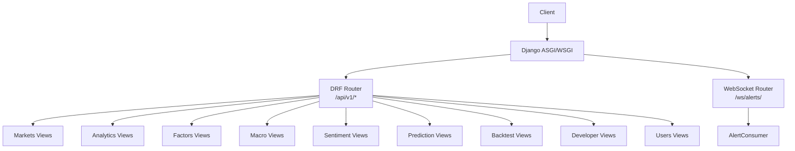
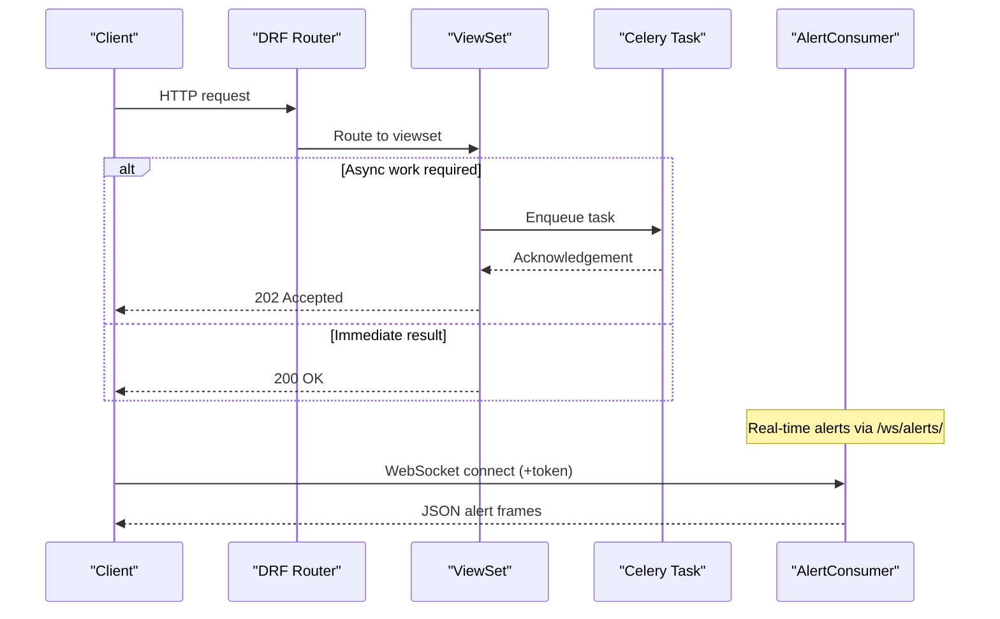
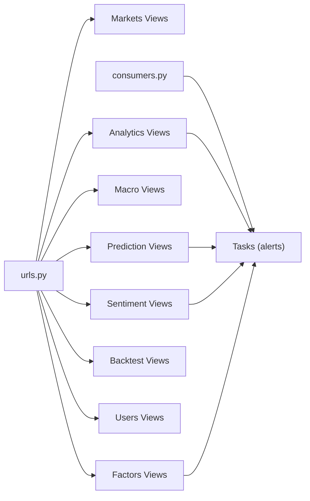

# API Reference

<cite>
**Referenced Files in This Document**
- [urls.py](file://config/urls.py)
- [authentication.py](file://apps/developer/authentication.py)
- [throttling.py](file://apps/core/throttling.py)
- [consumers.py](file://apps/analytics/consumers.py)
- [useAlertsSocket.ts](file://frontend/src/hooks/useAlertsSocket.ts)
- [api.md](file://docs/reference/api.md)
- [views.py (markets)](file://apps/markets/views.py)
- [serializers.py (markets)](file://apps/markets/serializers.py)
- [views.py (analytics)](file://apps/analytics/views.py)
- [serializers.py (analytics)](file://apps/analytics/serializers.py)
- [models.py (analytics)](file://apps/analytics/models.py)
- [tasks.py (analytics)](file://apps/analytics/tasks.py)
- [views.py (factors)](file://apps/factors/views.py)
- [views.py (sentiment)](file://apps/sentiment/views.py)
- [views.py (macro)](file://apps/macro/views.py)
- [views.py (prediction)](file://apps/prediction/views.py)
- [views.py (backtest)](file://apps/backtest/views.py)
- [views.py (users)](file://apps/users/views.py)
</cite>

## Table of Contents
1. Introduction
2. Project Structure
3. Core Components
4. Architecture Overview
5. Detailed Component Analysis
6. Dependency Analysis
7. Performance Considerations
8. Troubleshooting Guide
9. Conclusion
10. Appendices

## Introduction
This document provides a comprehensive API reference for the FinanceAnalysis REST API under the /api/v1/ namespace, including authentication methods, rate limiting, error formats, versioning, and WebSocket streaming for real-time alerts at /ws/alerts/. It covers market data queries, technical indicators, factor scores, predictions, backtests, and user management endpoints, with concrete usage patterns and performance tips.

## Project Structure
The API is built on Django + Django REST Framework with DRF routers. All v1 endpoints are mounted under /api/v1/ and grouped by feature: markets, analytics, factors, macro, sentiment, prediction, backtest, developer tools, and users. OpenAPI schema and UI are exposed via drf-spectacular.



**Diagram sources**
- [urls.py:74-128](file://config/urls.py#L74-L128)
- [consumers.py:18-46](file://apps/analytics/consumers.py#L18-L46)

**Section sources**
- [urls.py:109-128](file://config/urls.py#L109-L128)
- [api.md:326-348](file://docs/reference/api.md#L326-L348)

## Core Components
- Authentication
  - JWT tokens via scoped token endpoints.
  - API key authentication using X-API-Key header.
- Rate Limiting
  - Dedicated throttle for auth endpoints.
  - Tier-based throttles per subscription tier.
- Versioning
  - Base path /api/v1/; schema served at /api/v1/schema/.
- Error Handling
  - Standard DRF JSON errors with documented status codes.

**Section sources**
- [urls.py:114-127](file://config/urls.py#L114-L127)
- [authentication.py:10-52](file://apps/developer/authentication.py#L10-L52)
- [throttling.py:5-88](file://apps/core/throttling.py#L5-L88)
- [api.md:302-325](file://docs/reference/api.md#L302-L325)

## Architecture Overview
The API exposes read-only and write-enabled viewsets behind a single router. Some endpoints trigger background tasks (Celery) for heavy computation or async processing. The WebSocket stream uses Channels with Redis channel layer to push alert events to authenticated clients.



**Diagram sources**
- [urls.py:74-128](file://config/urls.py#L74-L128)
- [views.py (backtest):75-100](file://apps/backtest/views.py#L75-L100)
- [consumers.py:18-46](file://apps/analytics/consumers.py#L18-L46)

## Detailed Component Analysis

### Markets API (/api/v1/markets, /assets, /ohlcv)
- Markets
  - GET /api/v1/markets/, /api/v1/markets/{id}/
  - Read-only list/retrieve with 24h cache.
- Assets
  - GET /api/v1/assets/, /api/v1/assets/{id}/
  - Filters: market__code, listing_status; search by symbol/ts_code/name; ordering by symbol/name.
  - Lightweight list serializer used for performance.
- OHLCV
  - GET /api/v1/ohlcv/, /api/v1/ohlcv/{id}/
  - Filters: asset, date; date_from/date_to ranges; ordered by date desc.
  - Lightweight list serializer excludes heavy fields.

Request/Response Schemas
- Market: id, code, name
- Asset: id, symbol, ts_code, name, market_name, market_code, listing_status, list_date, delist_date
- OHLCV: id, asset, asset_symbol, asset_name, date, open, high, low, close, adj_close, volume, amount

Usage Examples
- List assets filtered by market and search: GET /api/v1/assets/?market__code=SZ&search=600519
- Get OHLCV for an asset within a date range: GET /api/v1/ohlcv/?asset=123&date_from=2026-01-01&date_to=2026-01-31

Performance Notes
- List and retrieve actions are cached (24h for markets, 2h for assets/OHLCV).
- Use lightweight serializers for large lists.

**Section sources**
- [views.py (markets):16-106](file://apps/markets/views.py#L16-L106)
- [serializers.py (markets):5-50](file://apps/markets/serializers.py#L5-L50)

### Analytics API (/indicators, dashboard/stocks, screeners, alerts, signals)
- Technical Indicators
  - GET /api/v1/indicators/, /api/v1/indicators/{id}/
  - Filters: asset, indicator_type, date_from/date_to; order by timestamp desc.
  - Actions:
    - GET /api/v1/indicators/top_rsi/ — top RSI assets (cached 5m)
    - GET /api/v1/indicators/bottom_rsi/ — bottom RSI assets (cached 5m)
    - GET /api/v1/indicators/indicator_types/ — indicator type counts
    - GET /api/v1/indicators/compare/?asset_id=&indicator_types=&date_from=&date_to= — multi-indicator time series comparison
    - GET /api/v1/indicators/trending_strong/ — ADX > 25
    - GET /api/v1/indicators/overbought_stoch/ — STOCH >= 80
    - GET /api/v1/indicators/oversold_stoch/ — STOCH <= 20
    - GET /api/v1/indicators/fibonacci_levels/?asset_id= — latest Fibonacci levels
    - POST /api/v1/indicators/recalculate/ — queue recalculation for an indicator type and asset
- Dashboard Stocks
  - GET /api/v1/dashboard/stocks/ — composite board with factors, indicators, sentiment, model predictions; supports candidate selection and filtering.
- Screeners
  - GET /api/v1/screeners/prebuilt/ — list prebuilt screener types
  - GET /api/v1/screeners/run/?type=&limit= — run a prebuilt screener
- Alerts
  - CRUD for AlertRule and AlertEvent via registered viewsets.
- Signals
  - Read-only SignalEvent list via registered viewset.

Request/Response Schemas
- Indicator: id, asset, asset_symbol, asset_name, timestamp, indicator_type, value, parameters
- DashboardStockRow: composite score, technical/fundamental/capital flow scores, sentiment, OHLCV-derived fields, heuristic/lightgbm/lstm prediction fields, suggested flags
- ScreenerTemplate: owner, name, description, screener_type, config, is_public, timestamps
- AlertRule: owner, asset, condition_type, indicator_type, threshold, channels, cooldown_minutes, is_active, last_triggered_at, timestamps
- AlertEvent: alert_rule, asset, status, trigger_value, message, metadata, dispatched_channels, notified_at, created_at
- SignalEvent: asset, signal_type, timestamp, description, metadata, created_at

Usage Examples
- Compare indicators: GET /api/v1/indicators/compare/?asset_id=1&indicator_types=RSI,MACD&date_from=2026-01-01
- Queue recalculation: POST /api/v1/indicators/recalculate/ with body {asset_id, indicator_type, params}
- Run screener: GET /api/v1/screeners/run?type=overbought_oversold&high=70&low=30&limit=20

Performance Notes
- Many actions are cached (5m–2h).
- Recalculate endpoints return 202 Accepted and enqueue Celery tasks.

**Section sources**
- [views.py (analytics):196-735](file://apps/analytics/views.py#L196-L735)
- [serializers.py (analytics):5-150](file://apps/analytics/serializers.py#L5-L150)
- [models.py (analytics):124-163](file://apps/analytics/models.py#L124-L163)
- [tasks.py (analytics):1198-1304](file://apps/analytics/tasks.py#L1198-L1304)

### Factors API (/factors/fundamentals, /factors/capital-flows, /screener/bottom-candidates)
- FundamentalFactorSnapshotViewSet: read/write snapshots for fundamentals.
- CapitalFlowSnapshotViewSet: read/write snapshots for capital flows.
- BottomCandidateViewSet
  - GET /api/v1/screener/bottom-candidates/ — list bottom candidates with optional mode, as_of, min_score, top_n, sort_by, prediction_horizon, macro_context, event_tag.
  - POST /api/v1/screener/bottom-candidates/recalculate/ — queue factor scoring with weights and optional macro context.

Request/Response Schemas
- FactorScore: asset, date, mode, fundamental_score, capital_flow_score, technical_score, bottom_probability_score, plus optional adjusted fields when macro context applied.

Usage Examples
- List bottom candidates: GET /api/v1/screener/bottom-candidates/?mode=COMPOSITE&as_of=2026-01-31&top_n=20&sort_by=trade_score
- Recalculate with macro context: POST /api/v1/screener/bottom-candidates/recalculate/ with {as_of, financial_weight, flow_weight, technical_weight, sentiment_weight, macro_context, event_tag}

**Section sources**
- [views.py (factors):29-218](file://apps/factors/views.py#L29-L218)

### Sentiment API (/sentiment/news, /sentiment, /sentiment/concepts)
- NewsArticleViewSet: read articles with source filter; ingest endpoint queues ingestion.
- SentimentScoreViewSet: read scores with score_type and asset filters; latest action returns most recent per scope; recalculate queues pipeline.
- ConceptHeatViewSet: read concept heat rankings; top action returns latest top concepts.

Request/Response Schemas
- NewsArticle: provider, published_at, related_assets, content
- SentimentScore: asset, article, date, score_type, sentiment_score, sentiment_label
- ConceptHeat: concept_name, date, heat_score

Usage Examples
- Latest asset sentiment: GET /api/v1/sentiment/latest?score_type=ASSET_7D&asset=123
- Ingest news: POST /api/v1/sentiment/news/ingest/ with {items: [...]}

**Section sources**
- [views.py (sentiment):36-122](file://apps/sentiment/views.py#L36-L122)

### Macro API (/macro/snapshots, /macro/contexts, /macro/event-impacts)
- MacroSnapshotViewSet: read monthly macro snapshots; sync queues external sync.
- MarketContextViewSet: read current context; refresh queues context update.
- EventImpactStatViewSet: read event impact statistics with optional event_tag filter.

Usage Examples
- Current market context: GET /api/v1/macro/contexts/current/
- Refresh context: POST /api/v1/macro/contexts/refresh/ with {snapshot_id, event_tag}

**Section sources**
- [views.py (macro):14-60](file://apps/macro/views.py#L14-L60)

### Prediction API (/prediction, /prediction-model-versions, /lightgbm-predictions, /lstm-predictions)
- ModelVersionViewSet: read model versions with optional model_type filter.
- PredictionViewSet
  - GET /api/v1/prediction/{stock_code}/ — get predictions for a stock by date and horizons; auto-generates if missing.
  - POST /api/v1/prediction/batch/ — batch generate and retrieve predictions for multiple stocks.
  - POST /api/v1/prediction/recalculate/ — queue retraining and inference.

Request/Response Schemas
- PredictionResult: horizon_days, up_probability, flat_probability, down_probability, confidence, predicted_label, target_price, stop_loss_price, risk_reward_ratio, trade_score, suggested, macro_phase, event_tag

Usage Examples
- Single stock: GET /api/v1/prediction/600519/?date=2026-01-31&horizons=3,7,30
- Batch: POST /api/v1/prediction/batch/ with {stock_codes: ["600519","..."], date, horizons}

**Section sources**
- [views.py (prediction):15-162](file://apps/prediction/views.py#L15-L162)

### Backtest API (/backtest, /backtest-trades)
- BacktestRunViewSet
  - CRUD for runs; lifecycle actions: rerun, restart, pause, resume, delete.
  - GET /backtest/{id}/trades/ — trades ledger for a run.
  - GET /backtest/{id}/comparison_curve/?extra_compare_run_id=... — benchmark comparison curves.
- BacktestTradeViewSet: read trades with optional backtest_run filter.

Request/Response Schemas
- BacktestRun: strategy_type, parameters, status, current_task_id, pending_control_action, error_message, timestamps
- BacktestTrade: asset, trade_date, price, quantity, side, pnl, metadata

Usage Examples
- Create run: POST /api/v1/backtest/ with strategy parameters -> 202 Accepted
- Pause run: POST /api/v1/backtest/{id}/pause/
- Comparison curve: GET /api/v1/backtest/{id}/comparison_curve/?extra_compare_run_ids=1,2

**Section sources**
- [views.py (backtest):1-221](file://apps/backtest/views.py#L1-L221)

### Users API (/users/profile, /users/subscriptions, /users/usage, /auth, registration)
- Registration and Auth
  - POST /api/v1/users/register/ — register new user
  - POST /api/v1/users/verify-email/ — verify email
  - POST /api/v1/users/password-reset/ — request reset
  - POST /api/v1/users/password-reset-confirm/ — confirm reset
  - POST /api/v1/auth/token/ — obtain JWT pair
  - POST /api/v1/auth/token/refresh/ — refresh token
  - POST /api/v1/auth/token/verify/ — verify token
- Profile and Subscription
  - GET/PUT/PATCH /api/v1/users/profile/me/ — current user profile
  - GET /api/v1/users/subscriptions/ — list subscriptions
  - GET /api/v1/users/subscriptions/current/ — active subscription info
- Usage Analytics
  - GET /api/v1/users/usage/ — call log
  - GET /api/v1/users/usage/stats/ — daily/monthly stats and limits

Usage Examples
- Obtain token: POST /api/v1/auth/token/ with credentials
- Get current profile: GET /api/v1/users/profile/me/ with Authorization: Bearer <token>

**Section sources**
- [urls.py:114-121](file://config/urls.py#L114-L121)
- [views.py (users):32-284](file://apps/users/views.py#L32-L284)

### WebSocket API (/ws/alerts/)
- Path: /ws/alerts/
- Consumer: AlertConsumer (AsyncJsonWebsocketConsumer)
- Channel Layer: Redis-backed
- Authentication:
  - Session cookie via ASGI middleware stack
  - Query parameter ?token=<access_token> validated as SimpleJWT AccessToken
- Message Format (server-pushed, receive-only):
  - type: "alert"
  - event_id, asset_symbol, alert_name, message, created_at
- Client Behavior:
  - Connect with token if not session-authenticated
  - Handle reconnect with exponential backoff
  - Parse JSON frames; fallback to string if parsing fails

```mermaid
sequenceDiagram
participant Client as "Frontend Hook"
participant WS as "WebSocket"
participant Consumer as "AlertConsumer"
Client->>WS : Connect ws(s) : //host/ws/alerts/?token=...
WS->>Consumer : Accept connection
Consumer-->>Client : {"type" : "alert", ...}
Note over Client,Consumer : Receive-only stream; client manages reconnect
```

**Diagram sources**
- [consumers.py:18-46](file://apps/analytics/consumers.py#L18-L46)
- [useAlertsSocket.ts:23-108](file://frontend/src/hooks/useAlertsSocket.ts#L23-L108)
- [api.md:243-299](file://docs/reference/api.md#L243-L299)

**Section sources**
- [consumers.py:18-46](file://apps/analytics/consumers.py#L18-L46)
- [useAlertsSocket.ts:1-108](file://frontend/src/hooks/useAlertsSocket.ts#L1-L108)
- [api.md:243-299](file://docs/reference/api.md#L243-L299)

## Dependency Analysis
- URL routing centralizes all v1 endpoints and groups them by feature.
- Views depend on models and serializers defined per app.
- Background tasks are enqueued from views for heavy operations (predictions, indicators, sentiment, macro sync).
- WebSocket consumer depends on Django user model and SimpleJWT tokens.



**Diagram sources**
- [urls.py:74-128](file://config/urls.py#L74-L128)
- [consumers.py:18-46](file://apps/analytics/consumers.py#L18-L46)

**Section sources**
- [urls.py:74-128](file://config/urls.py#L74-L128)

## Performance Considerations
- Caching
  - Markets list/retrieve: 24 hours
  - Assets/OHLCV list/retrieve: 2 hours
  - Indicator ranking actions: 5 minutes
  - Dashboard stocks: short-lived cache keyed by query parameters
- Pagination
  - Backtest runs use PageNumberPagination with default page_size 100 and max_page_size 100
- Throttling
  - Auth endpoints: dedicated throttle scope
  - Tier-based throttles: free/pro/premium daily limits enforced per user profile
- Asynchronous Processing
  - Heavy computations (predictions, indicators, sentiment, macro sync) return 202 Accepted and enqueue Celery tasks

[No sources needed since this section provides general guidance]

## Troubleshooting Guide
- Authentication Failures
  - Ensure JWT access token is valid and not expired for protected endpoints
  - For WebSocket, pass token as query parameter if no session cookie
- Validation Errors
  - 400 responses include field-specific messages; check request payloads against schemas
- Rate Limiting
  - 429 indicates throttling; adjust client retry behavior or upgrade subscription tier
- WebSocket Issues
  - If socket closes immediately, verify token validity and that the user is active
  - Implement exponential backoff and token refresh before reconnect

**Section sources**
- [api.md:302-325](file://docs/reference/api.md#L302-L325)
- [authentication.py:24-49](file://apps/developer/authentication.py#L24-L49)
- [consumers.py:23-42](file://apps/analytics/consumers.py#L23-L42)

## Conclusion
The FinanceAnalysis API provides a robust, versioned surface for market data, technical indicators, factor scores, predictions, backtests, and user management. It supports JWT and API key authentication, tier-based rate limiting, caching strategies, and asynchronous processing for heavy workloads. The WebSocket stream delivers real-time alerts to authenticated clients. Use the provided examples and performance tips to build efficient integrations.

[No sources needed since this section summarizes without analyzing specific files]

## Appendices

### Endpoint Groups Map
- /markets/, /assets/, /ohlcv/: exchanges, instruments, daily bars
- /indicators/: stored indicators plus ranking and comparison actions
- /dashboard/stocks/: composite board with factors, indicators, sentiment, dual-model decisions
- /screeners/, /screener-templates/: prebuilt screeners and saved templates
- /screener/bottom-candidates/: bottom-fishing candidates
- /alerts/, /alert-events/: alert rules and fired events
- /signals/: signal events
- /factors/fundamentals/, /factors/capital-flows/: snapshot tables behind FactorScore
- /macro/snapshots/, /macro/contexts/, /macro/event-impacts/: macro surface and regime
- /sentiment/news/, /sentiment/, /sentiment/concepts/: articles, scores, concept heat
- /prediction/, /prediction-model-versions/: heuristic predictions and model registry
- /lightgbm-predictions/, /lightgbm-models/, /ensemble-weights/: LightGBM surface
- /lstm-predictions/: LSTM surface
- /backtest/, /backtest-trades/: runs, lifecycle actions, comparison curves, trade detail
- /developer/keys/, /developer/changelog/: API key portal and public changelog
- /users/profile/, /users/subscriptions/, /users/usage/: account surface

**Section sources**
- [api.md:326-348](file://docs/reference/api.md#L326-L348)