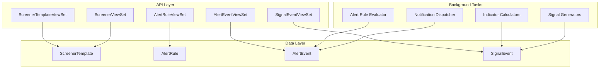
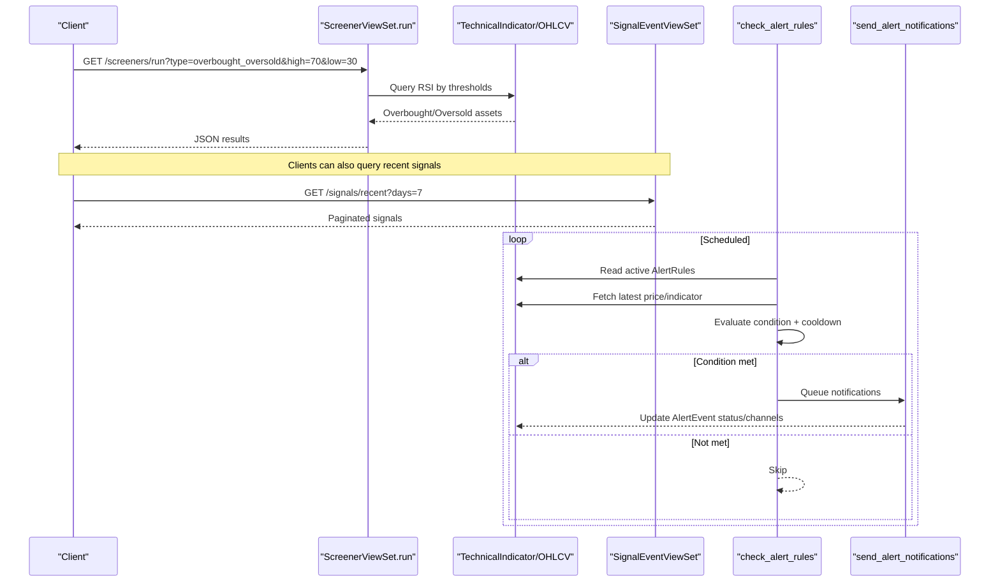
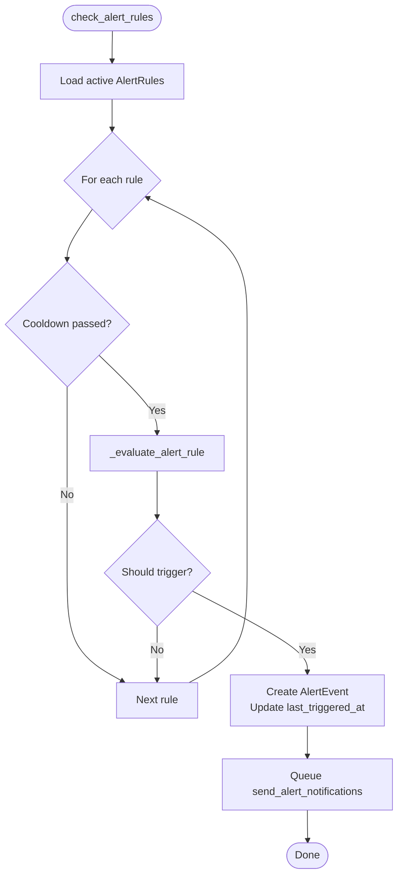
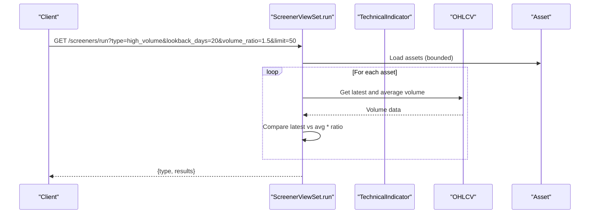
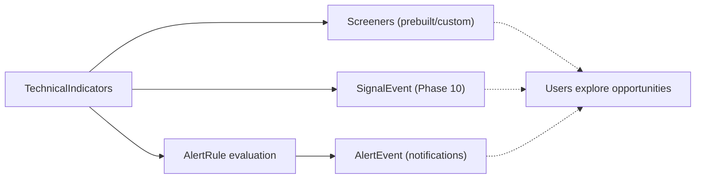
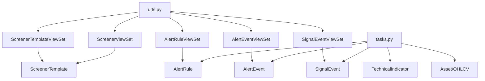

# Alerts & Screeners

<cite>
**Referenced Files in This Document**
- [models.py](file://apps/analytics/models.py)
- [views.py](file://apps/analytics/views.py)
- [serializers.py](file://apps/analytics/serializers.py)
- [tasks.py](file://apps/analytics/tasks.py)
- [urls.py](file://config/urls.py)
</cite>

## Table of Contents
1. Introduction
2. Project Structure
3. Core Components
4. Architecture Overview
5. Detailed Component Analysis
6. Dependency Analysis
7. Performance Considerations
8. Troubleshooting Guide
9. Conclusion

## Introduction
This document explains the alerting and screening capabilities in the analytics module. It covers:
- AlertRule model fields, supported condition types, and notification mechanisms
- ScreenerTemplate creation and sharing (public vs private)
- Prebuilt screeners with their filtering criteria and parameters
- ScreenerViewSet endpoints for running custom or prebuilt screening logic
- Examples of creating alert conditions based on technical indicators, price movements, and volume spikes
- How alerts, screeners, and signal events fit into the broader analytics pipeline

## Project Structure
The alerting and screening features are implemented under the analytics app:
- Data models define screener templates, alert rules, alert events, and signal events
- ViewSets expose REST endpoints for managing templates, running screeners, and querying alerts/events/signals
- Background tasks compute technical indicators, generate signals, evaluate alert rules, and dispatch notifications
- URL configuration registers all viewsets under /api/v1/

**Diagram sources**
- [views.py:738-934](file://apps/analytics/views.py#L738-L934)
- [models.py:48-255](file://apps/analytics/models.py#L48-L255)
- [tasks.py:1186-1317](file://apps/analytics/tasks.py#L1186-L1317)

**Section sources**
- [urls.py:74-85](file://config/urls.py#L74-L85)
- [views.py:738-934](file://apps/analytics/views.py#L738-L934)
- [models.py:48-255](file://apps/analytics/models.py#L48-L255)

## Core Components
- TechnicalIndicator: stores computed indicator values per asset and timestamp
- ScreenerTemplate: user-owned or public templates that encapsulate screener configurations
- AlertRule: defines thresholds and channels to notify users when conditions are met
- AlertEvent: records each trigger and its delivery status across channels
- SignalEvent: captures Phase 10 technical signals such as golden crosses, breakouts, volume spikes, and reversal combinations

Key responsibilities:
- Views provide CRUD for templates and alerts, run prebuilt screeners, and list/query events and signals
- Tasks compute indicators, detect signals, evaluate alert rules, and send notifications via email, SMS webhook, or WebSocket
- Serializers validate inputs and return enriched data including owner and asset details

**Section sources**
- [models.py:8-255](file://apps/analytics/models.py#L8-L255)
- [serializers.py:5-150](file://apps/analytics/serializers.py#L5-L150)
- [views.py:424-934](file://apps/analytics/views.py#L424-L934)
- [tasks.py:68-1159](file://apps/analytics/tasks.py#L68-L1159)

## Architecture Overview
The system integrates real-time screening, scheduled signal generation, and alerting:

**Diagram sources**
- [views.py:756-858](file://apps/analytics/views.py#L756-L858)
- [views.py:896-934](file://apps/analytics/views.py#L896-L934)
- [tasks.py:1283-1317](file://apps/analytics/tasks.py#L1283-L1317)
- [tasks.py:1231-1281](file://apps/analytics/tasks.py#L1231-L1281)

## Detailed Component Analysis

### AlertRule Model and Evaluation
- Fields:
  - Owner and Asset associations
  - Name, ConditionType, IndicatorType (for indicator-based alerts), Threshold
  - CustomCondition (JSON) for extensibility
  - Channels (email, sms, websocket), CooldownMinutes, IsActive, LastTriggeredAt
- Condition types:
  - PRICE_ABOVE, PRICE_BELOW
  - INDICATOR_ABOVE, INDICATOR_BELOW
- Evaluation:
  - Reads latest price or latest indicator value
  - Compares against threshold using the selected condition type
  - Enforces cooldown to avoid duplicate triggers
- Notifications:
  - Email via Django mail
  - SMS via configurable webhook
  - WebSocket via channel layer group messaging
  - Updates AlertEvent with dispatched channels and status

**Diagram sources**
- [tasks.py:1283-1317](file://apps/analytics/tasks.py#L1283-L1317)
- [tasks.py:1186-1210](file://apps/analytics/tasks.py#L1186-L1210)

**Section sources**
- [models.py:87-146](file://apps/analytics/models.py#L87-L146)
- [serializers.py:90-123](file://apps/analytics/serializers.py#L90-L123)
- [tasks.py:1186-1317](file://apps/analytics/tasks.py#L1186-L1317)

### AlertEvent and Notification Mechanisms
- Statuses: TRIGGERED, SENT, FAILED
- Stores trigger_value, message, metadata, dispatched_channels, notified_at
- Notification dispatcher:
  - Sends email if configured and user has an email
  - Sends SMS via webhook if enabled and URL configured
  - Pushes WebSocket message to user-specific group
  - Records which channels succeeded and updates event status

**Section sources**
- [models.py:148-196](file://apps/analytics/models.py#L148-L196)
- [tasks.py:1212-1281](file://apps/analytics/tasks.py#L1212-L1281)

### ScreenerTemplate: Creation and Sharing
- Fields:
  - Owner (nullable), Name, Description
  - ScreenerType (PREBUILT or CUSTOM)
  - Config (JSON) to store screener parameters
  - IsPublic flag to share with other users
  - Timestamps
- Access control:
  - Authenticated users see their own templates plus public ones
  - Unauthenticated users can only read public templates
- Serializer exposes owner_username and read-only timestamps

**Section sources**
- [models.py:48-85](file://apps/analytics/models.py#L48-L85)
- [views.py:738-754](file://apps/analytics/views.py#L738-L754)
- [serializers.py:78-88](file://apps/analytics/serializers.py#L78-L88)

### ScreenerViewSet: Prebuilt Screeners and Execution
- Prebuilt screeners:
  - overbought_oversold: finds assets with RSI above/below thresholds
  - high_volume: finds assets where latest volume exceeds a multiple of average volume over lookback
  - breakout_candidates: finds assets near period high within a percentage
  - trend_reversal: finds assets with low RSI and positive MACD crossover context
- Parameters:
  - type: selects the screener
  - limit: number of results
  - Per-screener params like high, low, lookback_days, volume_ratio, rsi_threshold
- Responses include screener type, parameters used, and matched assets with relevant metrics

**Diagram sources**
- [views.py:756-858](file://apps/analytics/views.py#L756-L858)

**Section sources**
- [views.py:756-858](file://apps/analytics/views.py#L756-L858)

### SignalEvent: Technical Signals
- Captures Phase 10 signals including:
  - Moving average signals: GOLDEN_CROSS, DEATH_CROSS, MA_BULL_ALIGN, MA_BEAR_ALIGN
  - Bollinger Band signals: BB_SQUEEZE, BB_BREAKOUT_UP, BB_BREAKOUT_DOWN, BB_RSI_OVERBOUGHT, BB_RSI_OVERSOLD
  - Volume signals: VOLUME_SPIKE, VOLUME_PRICE_DIVERGENCE
  - Momentum signals: MOMENTUM_UP_5D, MOMENTUM_DOWN_5D, HIGH_RS_SCORE
  - Reversal signals: OVERSOLD_COMBINATION
- Generated by background tasks that compute indicators and compare conditions
- Queriable via SignalEventViewSet with filters and recent window

**Section sources**
- [models.py:198-255](file://apps/analytics/models.py#L198-L255)
- [views.py:896-934](file://apps/analytics/views.py#L896-L934)
- [tasks.py:740-1159](file://apps/analytics/tasks.py#L740-L1159)

### Relationship Between Alerts, Screeners, and Signal Events
- Screeners:
  - Provide ad-hoc or prebuilt views of current market conditions
  - Useful for discovery and exploration; do not persist state beyond responses
- SignalEvents:
  - Persisted technical signals generated from indicator analysis
  - Can be queried for historical patterns and dashboards
- AlertRules:
  - User-defined conditions that monitor prices or indicators
  - When triggered, create AlertEvent records and dispatch notifications
- Pipeline integration:
  - Indicator calculations feed both screeners and signal generators
  - Signal generators produce SignalEvent rows
  - Alert evaluator runs independently to check user rules and notify

[No sources needed since this diagram shows conceptual workflow, not actual code structure]

## Dependency Analysis
- Views depend on models for persistence and serializers for I/O
- Tasks depend on markets models (Asset, OHLCV) and analytics models (TechnicalIndicator, SignalEvent, AlertRule, AlertEvent)
- URL routing wires viewsets to REST endpoints
- Celery tasks execute asynchronously for heavy computations and notifications

**Diagram sources**
- [urls.py:74-85](file://config/urls.py#L74-L85)
- [views.py:738-934](file://apps/analytics/views.py#L738-L934)
- [tasks.py:1186-1317](file://apps/analytics/tasks.py#L1186-L1317)

**Section sources**
- [urls.py:74-85](file://config/urls.py#L74-L85)
- [views.py:738-934](file://apps/analytics/views.py#L738-L934)
- [tasks.py:1186-1317](file://apps/analytics/tasks.py#L1186-L1317)

## Performance Considerations
- Caching:
  - TechnicalIndicatorViewSet actions cache top RSI, bottom RSI, trending strong, overbought/oversold stochastics for short periods
  - DashboardStockViewSet caches aggregated results keyed by parameters
- Database indexing:
  - TechnicalIndicator indexed by asset, timestamp, indicator_type
  - SignalEvent indexed by asset, timestamp, signal_type
- Task freshness checks:
  - Trailing indicator staleness guards prevent redundant recalculations
- Pagination and limits:
  - Screeners accept limit to bound result sets
  - SignalEventViewSet supports pagination

[No sources needed since this section provides general guidance]

## Troubleshooting Guide
Common issues and resolutions:
- No alerts firing:
  - Ensure rules are active and cooldown has elapsed
  - Verify latest price/indicator exists for the asset
  - Check that indicator calculations have run recently
- Notifications not received:
  - Email: confirm user has an email and mail is configured
  - SMS: ensure ALERTS_ENABLE_SMS and SMS_WEBHOOK_URL are set and reachable
  - WebSocket: verify channel layer is available and client subscribed to user group
- Screener returns empty:
  - Adjust thresholds (e.g., RSI high/low) or lookback windows
  - Confirm underlying indicators or OHLCV data exist for assets

**Section sources**
- [tasks.py:1212-1281](file://apps/analytics/tasks.py#L1212-L1281)
- [views.py:756-858](file://apps/analytics/views.py#L756-L858)

## Conclusion
The analytics module provides a robust framework for screening and alerting:
- ScreenerTemplate enables reusable, sharable screening logic
- Prebuilt screeners offer quick insights into overbought/oversold, volume spikes, breakouts, and trend reversals
- AlertRules allow precise monitoring of prices and indicators with multi-channel notifications
- SignalEvents capture rich technical signals for analysis and dashboards
Together, these components form a cohesive analytics pipeline that supports discovery, monitoring, and timely action.