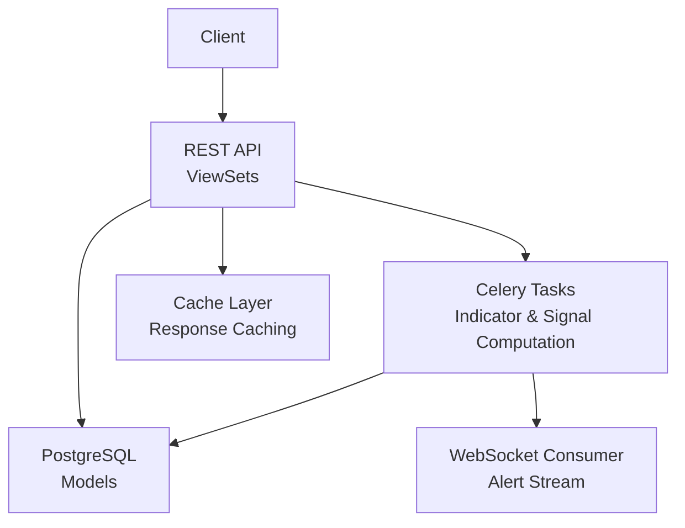
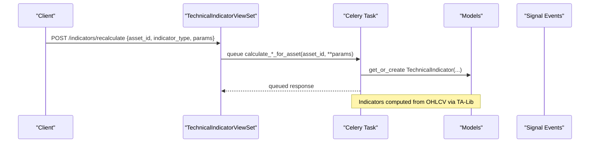
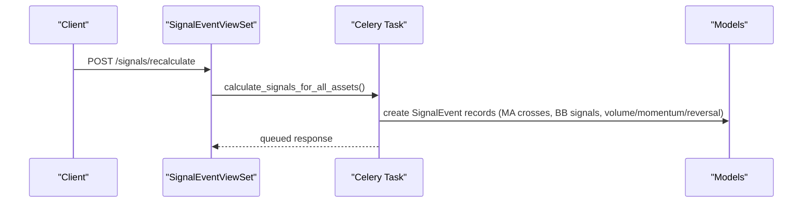
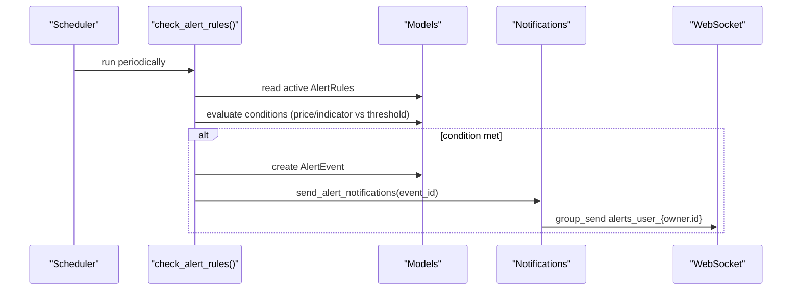
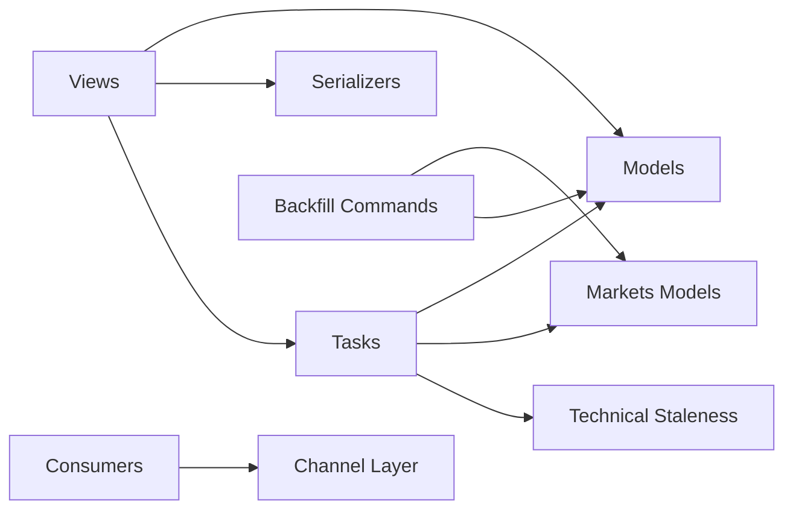

# Analytics & Technical Indicators API

<cite>
**Referenced Files in This Document**
- [views.py](file://apps/analytics/views.py)
- [models.py](file://apps/analytics/models.py)
- [serializers.py](file://apps/analytics/serializers.py)
- [tasks.py](file://apps/analytics/tasks.py)
- [consumers.py](file://apps/analytics/consumers.py)
- [backfill_technical_indicators.py](file://apps/analytics/management/commands/backfill_technical_indicators.py)
- [backfill_signal_events.py](file://apps/analytics/management/commands/backfill_signal_events.py)
- [technical_staleness.py](file://apps/analytics/technical_staleness.py)
</cite>

## Table of Contents
1. [Introduction](#introduction)
2. [Project Structure](#project-structure)
3. [Core Components](#core-components)
4. [Architecture Overview](#architecture-overview)
5. [Detailed Component Analysis](#detailed-component-analysis)
6. [Dependency Analysis](#dependency-analysis)
7. [Performance Considerations](#performance-considerations)
8. [Troubleshooting Guide](#troubleshooting-guide)
9. [Conclusion](#conclusion)
10. [Appendices](#appendices)

## Introduction
This document describes the technical analysis and analytics endpoints for computing, storing, querying, and acting on technical indicators and signals. It covers:
- Indicator calculations (RSI, MACD, Bollinger Bands, SMA/EMA, Stochastic, ADX, OBV, Fibonacci retracement)
- Signal event generation (moving average crosses, Bollinger Band breakouts/squeezes, volume spikes/divergence, momentum flags, reversal combinations, relative strength)
- Alert rule management and notification delivery (email, SMS via webhook, WebSocket)
- Screener functionality (prebuilt screeners and saved templates)
- Parameter specifications for indicator configurations, time windows, and filtering criteria
- Examples of building custom analytical queries and interpreting outputs

The system uses a Django REST backend with Celery tasks for heavy computation, a PostgreSQL-backed data model, and optional real-time alerts via WebSockets.

## Project Structure
The analytics module exposes REST endpoints, background tasks, models, serializers, and utilities to compute and serve technical analysis results. Key entry points include:
- ViewSets for technical indicators, screeners, alert rules, alert events, and signal events
- Celery tasks that compute indicators and generate signals from OHLCV history
- Models that persist indicators, alerts, and signals
- Management commands for backfilling historical data
- A WebSocket consumer for streaming alert notifications

**Diagram sources**
- [views.py:424-735](file://apps/analytics/views.py#L424-L735)
- [tasks.py:67-615](file://apps/analytics/tasks.py#L67-L615)
- [models.py:8-255](file://apps/analytics/models.py#L8-L255)
- [consumers.py:18-59](file://apps/analytics/consumers.py#L18-L59)

**Section sources**
- [views.py:424-934](file://apps/analytics/views.py#L424-L934)
- [models.py:8-255](file://apps/analytics/models.py#L8-L255)

## Core Components
- TechnicalIndicatorViewSet: Read-only access to stored technical indicators with filters and specialized actions (top/bottom RSI, compare indicators, trending strong, overbought/oversold stochastics, Fibonacci levels, recalculation).
- ScreenerTemplateViewSet: CRUD for user-saved screener templates.
- ScreenerViewSet: Prebuilt screeners (overbought/oversold, high volume, breakout candidates, trend reversal).
- AlertRuleViewSet: CRUD for alert rules owned by authenticated users; includes an active list action.
- AlertEventViewSet: Read-only alert history scoped to the current user.
- SignalEventViewSet: Read-only endpoint for Phase 10 technical signal events with recent and recalculate actions.
- DashboardStockViewSet: Aggregates factors, predictions, sentiment, indicators, and candidate selection into dashboard rows.

**Section sources**
- [views.py:196-422](file://apps/analytics/views.py#L196-L422)
- [views.py:424-735](file://apps/analytics/views.py#L424-L735)
- [views.py:738-934](file://apps/analytics/views.py#L738-L934)

## Architecture Overview
The system computes indicators and signals asynchronously using TA-Lib on OHLCV data, persists them, and serves them through REST APIs. Alerts are evaluated periodically and delivered via email, SMS, or WebSocket.

**Diagram sources**
- [views.py:690-735](file://apps/analytics/views.py#L690-L735)
- [tasks.py:67-229](file://apps/analytics/tasks.py#L67-L229)
- [models.py:8-43](file://apps/analytics/models.py#L8-L43)

**Diagram sources**
- [views.py:929-934](file://apps/analytics/views.py#L929-L934)
- [tasks.py:1146-1159](file://apps/analytics/tasks.py#L1146-L1159)
- [models.py:198-255](file://apps/analytics/models.py#L198-L255)

**Diagram sources**
- [tasks.py:1283-1317](file://apps/analytics/tasks.py#L1283-L1317)
- [consumers.py:18-59](file://apps/analytics/consumers.py#L18-L59)
- [models.py:87-196](file://apps/analytics/models.py#L87-L196)

## Detailed Component Analysis

### Technical Indicators API
Endpoints:
- GET /api/v1/indicators/: list with filters (asset, indicator_type, date range), ordering by timestamp
- GET /api/v1/indicators/top_rsi/: top RSI assets (cached)
- GET /api/v1/indicators/bottom_rsi/: bottom RSI assets (cached)
- GET /api/v1/indicators/indicator_types/: available types with counts
- GET /api/v1/indicators/compare/?asset_id=...&indicator_types=...&date_from=...&date_to=...
- GET /api/v1/indicators/trending_strong/: ADX > 25
- GET /api/v1/indicators/overbought_stoch/: STOCH >= 80
- GET /api/v1/indicators/oversold_stoch/: STOCH <= 20
- GET /api/v1/indicators/fibonacci_levels/?asset_id=...
- POST /api/v1/indicators/recalculate/: queue indicator calculation

Parameter specifications:
- asset_id: integer
- indicator_type: one of RSI, MACD, BBANDS, SMA, EMA, STOCH, ADX, OBV, FIB_RET
- date_from/date_to: ISO date strings
- indicator_types: comma-separated list for compare
- params: JSON object per indicator type

Indicator parameters:
- RSI: timeperiod (default 14)
- MACD: fastperiod (default 12), slowperiod (default 26), signalperiod (default 9)
- BBANDS: timeperiod (default 20), nbdevup (default 2), nbdevdn (default 2)
- SMA/EMA: timeperiods (default [5,10,20,50,100,200])
- STOCH: fastk_period (default 14), slowk_period (default 3), slowd_period (default 3)
- ADX: timeperiod (default 14)
- OBV: no parameters
- FIB_RET: lookback_days (default 60)

Example usage:
- Compare RSI and MACD for asset 1 over last month: GET /indicators/compare?asset_id=1&indicator_types=RSI,MACD&date_from=YYYY-MM-DD&date_to=YYYY-MM-DD
- Recalculate RSI with custom period: POST /indicators/recalculate {"asset_id": 1, "indicator_type": "RSI", "params": {"timeperiod": 21}}

Interpretation:
- RSI: 0–100; >70 often overbought, <30 oversold
- MACD: positive/negative divergence can indicate momentum shifts
- BBANDS: price above upper band suggests breakout; below lower suggests breakdown; squeeze indicates low volatility
- SMA/EMA: trend direction and crossovers
- STOCH: %K/%D oscillators; >80 overbought, <30 oversold
- ADX: >25 strong trend
- OBV: cumulative volume flow
- FIB_RET: support/resistance levels based on recent range

**Section sources**
- [views.py:424-735](file://apps/analytics/views.py#L424-L735)
- [tasks.py:67-591](file://apps/analytics/tasks.py#L67-L591)
- [models.py:8-43](file://apps/analytics/models.py#L8-L43)
- [serializers.py:5-23](file://apps/analytics/serializers.py#L5-L23)

### Signal Events API
Endpoints:
- GET /api/v1/signals/: paginated list, filter by asset and signal_type, search description/symbol/name
- GET /api/v1/signals/recent/?days=N: signals from last N days
- POST /api/v1/signals/recalculate: queue full signal recalculation

Signal types:
- Moving averages: GOLDEN_CROSS, DEATH_CROSS, MA_BULL_ALIGN, MA_BEAR_ALIGN
- Bollinger Bands: BB_SQUEEZE, BB_BREAKOUT_UP, BB_BREAKOUT_DOWN, BB_RSI_OVERBOUGHT, BB_RSI_OVERSOLD
- Volume: VOLUME_SPIKE, VOLUME_PRICE_DIVERGENCE
- Momentum: MOMENTUM_UP_5D, MOMENTUM_DOWN_5D
- Reversal: OVERSOLD_COMBINATION
- Relative strength: HIGH_RS_SCORE (computed separately)

Parameters and thresholds:
- MA crosses use SMA(5) and SMA(20); alignment checks SMA(5), SMA(10), SMA(20), SMA(60)
- BBANDS default timeperiod=20, nbdevup=2, nbdevdn=2; bandwidth < 5% triggers squeeze
- Volume spike threshold default multiplier=2.0x over 20-day average
- Divergence checks 5-day price return vs OBV change
- Momentum thresholds ±5% over 5 days
- Oversold combination: RSI < 30, price near lower BB, volume contraction (<80% avg)

Example usage:
- Get recent signals: GET /signals/recent?days=7
- Filter by signal type: GET /signals?signal_type=GOLDEN_CROSS
- Queue recalculation: POST /signals/recalculate

Interpretation:
- Golden cross: bullish momentum shift; death cross: bearish
- BB squeeze: potential volatility expansion; breakouts: continuation or exhaustion depending on context
- Volume spike: significant participation; divergence: warning of trend weakening/strengthening
- Momentum flags: strong short-term moves
- Oversold combination: potential reversal setup

**Section sources**
- [views.py:896-934](file://apps/analytics/views.py#L896-L934)
- [tasks.py:740-1159](file://apps/analytics/tasks.py#L740-L1159)
- [models.py:198-255](file://apps/analytics/models.py#L198-L255)
- [serializers.py:138-150](file://apps/analytics/serializers.py#L138-L150)

### Alert Rules and Events API
Endpoints:
- GET/POST/PUT/DELETE /api/v1/alert-rules/: CRUD for alert rules (authenticated)
- GET /api/v1/alert-rules/active/: list active rules
- GET /api/v1/alert-events/: read-only alert history (user-scoped)

Alert rule fields:
- name, condition_type (PRICE_ABOVE, PRICE_BELOW, INDICATOR_ABOVE, INDICATOR_BELOW)
- indicator_type (required for indicator-based alerts)
- threshold (decimal)
- channels (list: email, sms, websocket)
- cooldown_minutes (positive integer)
- is_active (boolean)

Validation:
- Indicator-based alerts require indicator_type
- Channels must be from allowed set

Notification delivery:
- Email via Django mail
- SMS via configured webhook
- WebSocket via channel layer group

Example usage:
- Create rule: POST /alert-rules {"name":"RSI Overbought","condition_type":"INDICATOR_ABOVE","indicator_type":"RSI","threshold":70,"channels":["websocket"],"cooldown_minutes":60,"is_active":true}
- Check active rules: GET /alert-rules/active
- View events: GET /alert-events

Interpretation:
- Alerts trigger when current value exceeds/under threshold, respecting cooldown
- Events record status (TRIGGERED, SENT, FAILED), dispatched channels, and timestamps

**Section sources**
- [views.py:861-894](file://apps/analytics/views.py#L861-L894)
- [tasks.py:1186-1317](file://apps/analytics/tasks.py#L1186-L1317)
- [models.py:87-196](file://apps/analytics/models.py#L87-L196)
- [serializers.py:90-136](file://apps/analytics/serializers.py#L90-L136)
- [consumers.py:18-59](file://apps/analytics/consumers.py#L18-L59)

### Screener Functionality
Prebuilt screeners:
- overbought_oversold: RSI thresholds (high/low)
- high_volume: volume ratio vs average
- breakout_candidates: near-period high
- trend_reversal: low RSI + positive MACD

Custom screener templates:
- Save and share templates with config JSON
- Public or owner-scoped

Example usage:
- List prebuilt: GET /screeners/prebuilt
- Run overbought/oversold: GET /screeners/run?type=overbought_oversold&high=70&low=30&limit=20
- Run high volume: GET /screeners/run?type=high_volume&lookback_days=20&volume_ratio=1.5&limit=20
- Run breakout candidates: GET /screeners/run?type=breakout_candidates&lookback_days=20&limit=20
- Run trend reversal: GET /screeners/run?type=trend_reversal&rsi_threshold=35&limit=20

Interpretation:
- Overbought/oversold: extremes in RSI
- High volume: unusual activity
- Breakout candidates: near recent highs
- Trend reversal: potential reversal setups

**Section sources**
- [views.py:756-859](file://apps/analytics/views.py#L756-L859)
- [models.py:48-85](file://apps/analytics/models.py#L48-L85)
- [serializers.py:78-88](file://apps/analytics/serializers.py#L78-L88)

### Dashboard Stock Endpoint
Aggregates multiple data sources into dashboard rows:
- Factor scores, sentiment, latest OHLCV
- Latest indicators (RSI, MACD, BBANDS, SMA)
- Predictions (heuristic, lightgbm, lstm)
- Candidate ranking based on configurable mode (top_n or trade_score)

Query parameters:
- prediction_horizon (integer, minimum 1)
- model_family (both, heuristic, lightgbm, lstm)
- suggested_only (boolean)
- search (string)
- ordering (field name, optional descending with '-')
- page/page_size (pagination)
- candidate configuration keys: prediction_source, horizon_days, candidate_mode, up_threshold, top_n, top_n_metric, trade_score_scope, trade_score_threshold, max_positions, use_macro_context

Example usage:
- GET /dashboard-stocks?prediction_horizon=7&suggested_only=true&page_size=50

Interpretation:
- Composite score integrates fundamentals, capital flow, technical, sentiment
- Candidate rank identifies top opportunities based on selected mode
- Prediction fields provide labels, probabilities, confidence, trade scores, target/stop-loss prices, risk-reward ratios

**Section sources**
- [views.py:196-422](file://apps/analytics/views.py#L196-L422)
- [serializers.py:25-76](file://apps/analytics/serializers.py#L25-L76)

## Dependency Analysis
Key dependencies and relationships:
- Views depend on models, serializers, and tasks
- Tasks depend on markets models (Asset, OHLCV), analytics models (TechnicalIndicator, SignalEvent, AlertRule, AlertEvent), and technical staleness utilities
- Backfill commands depend on core date floor and market models
- Consumers depend on channel layers and authentication tokens

**Diagram sources**
- [views.py:17-45](file://apps/analytics/views.py#L17-L45)
- [tasks.py:17-26](file://apps/analytics/tasks.py#L17-L26)
- [backfill_technical_indicators.py:17-20](file://apps/analytics/management/commands/backfill_technical_indicators.py#L17-L20)
- [consumers.py:1-7](file://apps/analytics/consumers.py#L1-L7)

**Section sources**
- [views.py:17-45](file://apps/analytics/views.py#L17-L45)
- [tasks.py:17-26](file://apps/analytics/tasks.py#L17-L26)
- [backfill_technical_indicators.py:17-20](file://apps/analytics/management/commands/backfill_technical_indicators.py#L17-L20)
- [consumers.py:1-7](file://apps/analytics/consumers.py#L1-L7)

## Performance Considerations
- Response caching: Many indicator list/retrieve actions and specialized endpoints cache responses for 2 hours or 5 minutes to reduce database load.
- Background computation: Heavy indicator and signal calculations run as Celery tasks to avoid blocking requests.
- Data freshness: Staleness checks ensure computations only run when required trading windows are fresh, preventing unnecessary recalculations.
- Bulk operations: Backfill commands use chunked transactions and bulk creates for efficient historical processing.
- Pagination: Dashboard and list endpoints support pagination to limit payload sizes.

[No sources needed since this section provides general guidance]

## Troubleshooting Guide
Common issues and resolutions:
- Missing calendar data: Without exchange trading calendars, staleness guards cannot determine current trade dates, preventing indicator/signal writes. Ensure trading calendar is seeded.
- Insufficient data: Indicators require minimum lookback periods; tasks log warnings if data is insufficient.
- Stale indicators: If trailing window is not fresh, calculations are skipped; verify OHLCV continuity and trading dates.
- Alert cooldown: Rules respect cooldown_minutes; check last_triggered_at to understand why alerts did not fire.
- WebSocket connection: Alerts require authenticated connections; ensure token-based auth is passed in query string if needed.

**Section sources**
- [tasks.py:77-85](file://apps/analytics/tasks.py#L77-L85)
- [tasks.py:1283-1317](file://apps/analytics/tasks.py#L1283-L1317)
- [consumers.py:23-42](file://apps/analytics/consumers.py#L23-L42)
- [technical_staleness.py:157-190](file://apps/analytics/technical_staleness.py#L157-L190)

## Conclusion
The analytics module provides a comprehensive suite of technical analysis capabilities, from indicator computation and storage to signal generation, alerting, and screening. The architecture separates concerns between REST APIs, background tasks, and data persistence, enabling scalable and maintainable analytics workflows. Proper parameterization and staleness checks ensure accurate and timely results.

[No sources needed since this section summarizes without analyzing specific files]

## Appendices

### Indicator Parameter Reference
- RSI: timeperiod (default 14)
- MACD: fastperiod (default 12), slowperiod (default 26), signalperiod (default 9)
- BBANDS: timeperiod (default 20), nbdevup (default 2), nbdevdn (default 2)
- SMA/EMA: timeperiods (default [5,10,20,50,100,200])
- STOCH: fastk_period (default 14), slowk_period (default 3), slowd_period (default 3)
- ADX: timeperiod (default 14)
- OBV: none
- FIB_RET: lookback_days (default 60)

**Section sources**
- [tasks.py:67-591](file://apps/analytics/tasks.py#L67-L591)
- [backfill_technical_indicators.py:22-44](file://apps/analytics/management/commands/backfill_technical_indicators.py#L22-L44)

### Signal Event Types and Thresholds
- GOLDEN_CROSS/DEATH_CROSS: SMA(5) crossing SMA(20)
- MA_BULL_ALIGN/MA_BEAR_ALIGN: SMA(5) > SMA(10) > SMA(20) > SMA(60) or reverse
- BB_SQUEEZE: bandwidth < 5%
- BB_BREAKOUT_UP/DOWN: price outside bands
- BB_RSI_OVERBOUGHT/OVERSOLD: near band with RSI > 70/< 30
- VOLUME_SPIKE: volume >= 2.0x 20-day average
- VOLUME_PRICE_DIVERGENCE: 5-day price return vs OBV change
- MOMENTUM_UP_5D/MOMENTUM_DOWN_5D: ±5% over 5 days
- OVERSOLD_COMBINATION: RSI < 30, near lower BB, volume contraction
- HIGH_RS_SCORE: top 20% by 20-day return

**Section sources**
- [tasks.py:740-1159](file://apps/analytics/tasks.py#L740-L1159)
- [models.py:198-255](file://apps/analytics/models.py#L198-L255)