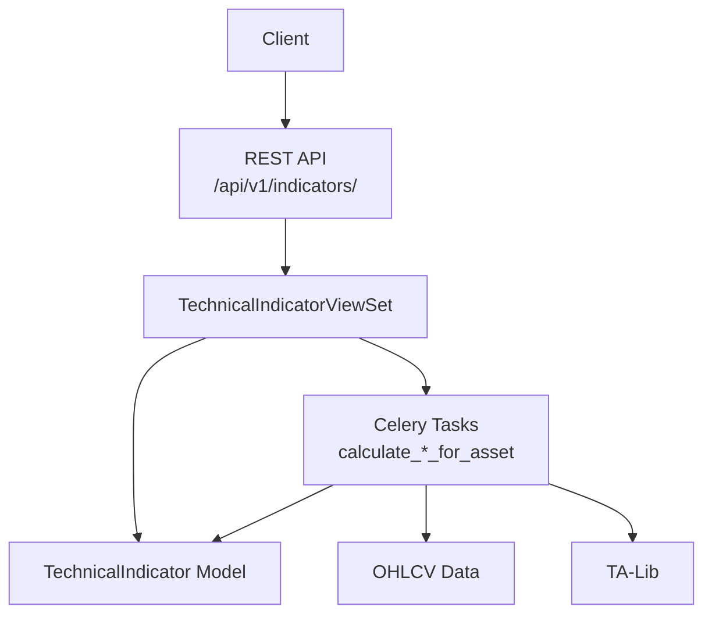
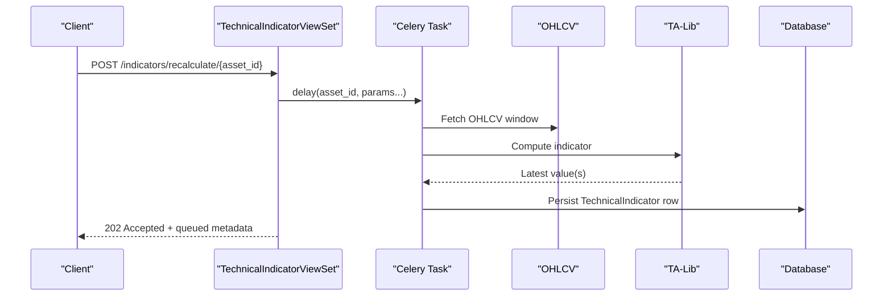
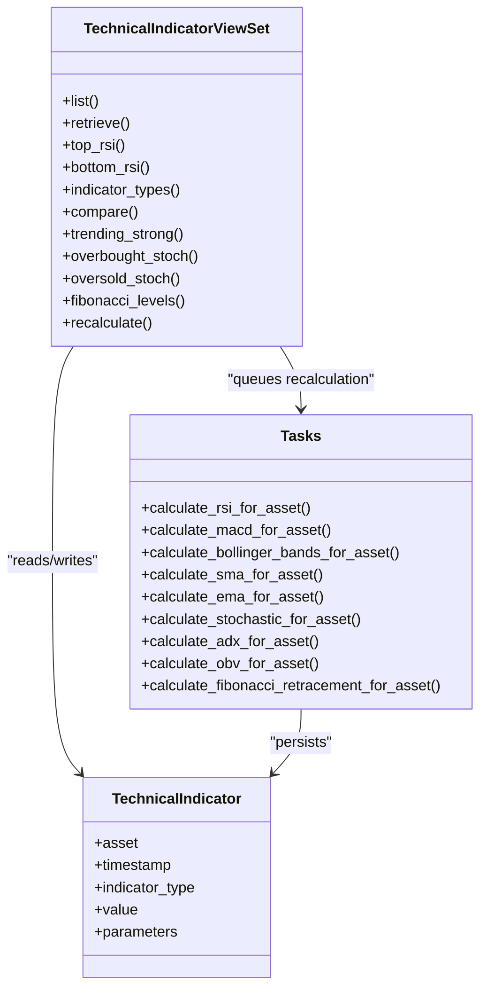

# Technical Indicators

<cite>
**Referenced Files in This Document**
- [views.py](file://apps/analytics/views.py)
- [tasks.py](file://apps/analytics/tasks.py)
- [models.py](file://apps/analytics/models.py)
- [serializers.py](file://apps/analytics/serializers.py)
- [urls.py](file://config/urls.py)
- [api.md](file://docs/reference/api.md)
</cite>

## Table of Contents
1. [Introduction](#introduction)
2. [Project Structure](#project-structure)
3. [Core Components](#core-components)
4. [Architecture Overview](#architecture-overview)
5. [Detailed Component Analysis](#detailed-component-analysis)
6. [Dependency Analysis](#dependency-analysis)
7. [Performance Considerations](#performance-considerations)
8. [Troubleshooting Guide](#troubleshooting-guide)
9. [Conclusion](#conclusion)

## Introduction
This document explains the technical indicator endpoints and their on-demand recalculation workflow. It covers supported indicators (RSI, MACD, BBANDS, SMA, EMA, STOCH, ADX, OBV, FIB_RET), their calculation methodology, parameters, input requirements, output formats, filtering examples, and performance considerations including caching and staleness checks.

## Project Structure
Technical indicators are exposed via a read-only viewset with additional actions for ranking, comparison, Fibonacci levels, and recalculation. Indicator values are persisted as rows with timestamps, types, values, and JSON parameters. Calculations run asynchronously via Celery tasks that fetch OHLCV data, compute indicators using TA-Lib, and persist results.

**Diagram sources**
- [views.py:424-735](file://apps/analytics/views.py#L424-L735)
- [tasks.py:28-615](file://apps/analytics/tasks.py#L28-L615)
- [models.py:8-43](file://apps/analytics/models.py#L8-L43)
- [urls.py:74-85](file://config/urls.py#L74-L85)

**Section sources**
- [views.py:424-735](file://apps/analytics/views.py#L424-L735)
- [urls.py:74-85](file://config/urls.py#L74-L85)

## Core Components
- TechnicalIndicator model stores each indicator value with asset, timestamp, type, value, and parameters.
- TechnicalIndicatorViewSet provides list/retrieve, plus custom actions: top_rsi, bottom_rsi, indicator_types, compare, trending_strong, overbought_stoch, oversold_stoch, fibonacci_levels, and recalculate.
- Celery tasks implement per-indicator calculations and persistence.
- Serializers define response shapes for indicator rows and dashboard rows.

Key behaviors:
- List/retrieve support filtering by asset, indicator_type, date_from, date_to.
- Ranking endpoints return latest indicator snapshots for screening use cases.
- Compare groups multiple indicator series for one asset over time.
- Recalculate queues background computation with custom parameters.

**Section sources**
- [models.py:8-43](file://apps/analytics/models.py#L8-L43)
- [views.py:424-735](file://apps/analytics/views.py#L424-L735)
- [serializers.py:5-23](file://apps/analytics/serializers.py#L5-L23)

## Architecture Overview
The endpoint layer is thin; heavy lifting happens in background tasks. Staleness checks avoid recomputation when recent data has not changed. Results are cached at the API layer to reduce database load.

**Diagram sources**
- [views.py:690-735](file://apps/analytics/views.py#L690-L735)
- [tasks.py:67-591](file://apps/analytics/tasks.py#L67-L591)

## Detailed Component Analysis

### Endpoint Surface
Base path: /api/v1/indicators/

- List/Retrieve: GET /indicators/?asset={id}&indicator_type={type}&date_from={YYYY-MM-DD}&date_to={YYYY-MM-DD}
- Rankings:
  - GET /indicators/top_rsi/
  - GET /indicators/bottom_rsi/
  - GET /indicators/trending_strong/
  - GET /indicators/overbought_stoch/
  - GET /indicators/oversold_stoch/
- Comparison: GET /indicators/compare/?asset_id={id}&indicator_types=RSI,MACD&date_from=...&date_to=...
- Fibonacci Levels: GET /indicators/fibonacci_levels/?asset_id={id}
- Recalculate: POST /indicators/recalculate/ with body {asset_id, indicator_type, params}

Notes:
- Pagination applies to list views.
- Date-range filters are inclusive.
- Some endpoints are cached for 2 hours or 5 minutes.

**Section sources**
- [views.py:424-735](file://apps/analytics/views.py#L424-L735)
- [api.md:168-184](file://docs/reference/api.md#L168-L184)
- [api.md:225-239](file://docs/reference/api.md#L225-L239)

### Supported Indicators and Parameters

- RSI (Relative Strength Index)
  - Method: TA-Lib RSI on close prices.
  - Parameters: timeperiod (default 14).
  - Input: OHLCV close series.
  - Output: value = latest RSI; parameters include timeperiod.
  - Example query: GET /indicators/?asset=1&indicator_type=RSI&date_from=2026-01-01&date_to=2026-01-31

- MACD (Moving Average Convergence Divergence)
  - Method: TA-Lib MACD on close prices.
  - Parameters: fastperiod (default 12), slowperiod (default 26), signalperiod (default 9).
  - Input: OHLCV close series.
  - Output: value = latest MACD line; parameters include periods.
  - Example query: GET /indicators/?asset=1&indicator_type=MACD

- BBANDS (Bollinger Bands)
  - Method: TA-Lib BBANDS on close prices.
  - Parameters: timeperiod (default 20), nbdevup (default 2), nbdevdn (default 2).
  - Input: OHLCV close series.
  - Output: value = middle band; parameters include upper, middle, lower bands and settings.
  - Example query: GET /indicators/?asset=1&indicator_type=BBANDS

- SMA (Simple Moving Average)
  - Method: TA-Lib SMA on close prices for multiple periods.
  - Parameters: timeperiods (list; default includes common windows like 5, 10, 20, 50, 100, 200).
  - Input: OHLCV close series.
  - Output: one row per period; value = latest SMA; parameters include timeperiod.
  - Example query: GET /indicators/?asset=1&indicator_type=SMA

- EMA (Exponential Moving Average)
  - Method: TA-Lib EMA on close prices for multiple periods.
  - Parameters: timeperiods (list; default includes common windows).
  - Input: OHLCV close series.
  - Output: one row per period; value = latest EMA; parameters include timeperiod.
  - Example query: GET /indicators/?asset=1&indicator_type=EMA

- STOCH (Stochastic Oscillator)
  - Method: TA-Lib STOCH using high, low, close.
  - Parameters: fastk_period (default 14), slowk_period (default 3), slowd_period (default 3).
  - Input: OHLCV high/low/close series.
  - Output: value = %K; parameters include %K and %D lines and settings.
  - Example query: GET /indicators/?asset=1&indicator_type=STOCH

- ADX (Average Directional Index)
  - Method: TA-Lib ADX with PLUS_DI and MINUS_DI.
  - Parameters: timeperiod (default 14).
  - Input: OHLCV high/low/close series.
  - Output: value = ADX; parameters include ADX, plus_di, minus_di.
  - Example query: GET /indicators/?asset=1&indicator_type=ADX

- OBV (On-Balance Volume)
  - Method: TA-Lib OBV using close and volume.
  - Parameters: none required.
  - Input: OHLCV close and volume series.
  - Output: value = latest OBV.
  - Example query: GET /indicators/?asset=1&indicator_type=OBV

- FIB_RET (Fibonacci Retracement)
  - Method: Uses recent lookback range to compute retracement levels from high/low.
  - Parameters: lookback_days (default 60).
  - Input: OHLCV within lookback window.
  - Output: value = 0.500 level; parameters include high, low, range, and computed levels.
  - Example query: GET /indicators/?asset=1&indicator_type=FIB_RET

**Section sources**
- [tasks.py:67-591](file://apps/analytics/tasks.py#L67-L591)
- [models.py:8-43](file://apps/analytics/models.py#L8-L43)
- [serializers.py:5-23](file://apps/analytics/serializers.py#L5-L23)

### Query Examples

- Filter by asset and date range:
  - GET /indicators/?asset=1&indicator_type=RSI&date_from=2026-01-01&date_to=2026-01-31

- Filter by indicator type only:
  - GET /indicators/?indicator_type=MACD

- Retrieve Fibonacci levels for an asset:
  - GET /indicators/fibonacci_levels/?asset_id=1

- Compare multiple indicators for one asset:
  - GET /indicators/compare/?asset_id=1&indicator_types=RSI,MACD&date_from=2026-01-01

- Screen by thresholds (ranking endpoints):
  - Overbought RSI: GET /indicators/top_rsi/
  - Oversold RSI: GET /indicators/bottom_rsi/
  - Strong trend (ADX > 25): GET /indicators/trending_strong/
  - Overbought Stochastic (> 80): GET /indicators/overbought_stoch/
  - Oversold Stochastic (< 20): GET /indicators/oversold_stoch/

Note: Thresholds for screener-style endpoints are fixed in code; for custom thresholds, filter the general list endpoint by date range and process client-side.

**Section sources**
- [views.py:477-688](file://apps/analytics/views.py#L477-L688)

### Recalculate Endpoint

Purpose: On-demand computation of a specific indicator for a given asset with custom parameters.

- Endpoint: POST /indicators/recalculate/
- Request body fields:
  - asset_id: integer
  - indicator_type: string (one of RSI, MACD, BBANDS, SMA, EMA, STOCH, ADX, OBV, FIB_RET)
  - params: object with indicator-specific parameters
- Response: 202 Accepted with queued metadata

Examples:
- RSI with custom period:
  - POST /indicators/recalculate/
  - Body: {"asset_id": 1, "indicator_type": "RSI", "params": {"timeperiod": 21}}

- BBANDS with custom multipliers:
  - POST /indicators/recalculate/
  - Body: {"asset_id": 1, "indicator_type": "BBANDS", "params": {"timeperiod": 20, "nbdevup": 2.5, "nbdevdn": 2.5}}

- FIB_RET with custom lookback:
  - POST /indicators/recalculate/
  - Body: {"asset_id": 1, "indicator_type": "FIB_RET", "params": {"lookback_days": 90}}

Supported parameter sets per indicator:
- RSI: timeperiod
- MACD: fastperiod, slowperiod, signalperiod
- BBANDS: timeperiod, nbdevup, nbdevdn
- SMA: timeperiods (list)
- EMA: timeperiods (list)
- STOCH: fastk_period, slowk_period, slowd_period
- ADX: timeperiod
- OBV: none
- FIB_RET: lookback_days

Validation:
- Missing asset_id or indicator_type returns 400.
- Unsupported indicator_type returns 400.
- Non-integer asset_id returns 400.

**Section sources**
- [views.py:690-735](file://apps/analytics/views.py#L690-L735)
- [tasks.py:67-591](file://apps/analytics/tasks.py#L67-L591)

### Calculation Methodology Summary

- All core indicators use TA-Lib functions over OHLCV data retrieved for the asset’s recent trading window.
- Each task validates data availability and freshness before computing.
- Results are persisted as TechnicalIndicator rows with unique constraints on (asset, timestamp, indicator_type, parameters).
- For multi-output indicators (e.g., BBANDS, STOCH, ADX), the primary value is stored in value, while full outputs are kept in parameters.

**Section sources**
- [tasks.py:28-615](file://apps/analytics/tasks.py#L28-L615)
- [models.py:8-43](file://apps/analytics/models.py#L8-L43)

## Dependency Analysis

**Diagram sources**
- [views.py:424-735](file://apps/analytics/views.py#L424-L735)
- [tasks.py:67-591](file://apps/analytics/tasks.py#L67-L591)
- [models.py:8-43](file://apps/analytics/models.py#L8-L43)

**Section sources**
- [views.py:424-735](file://apps/analytics/views.py#L424-L735)
- [tasks.py:67-591](file://apps/analytics/tasks.py#L67-L591)
- [models.py:8-43](file://apps/analytics/models.py#L8-L43)

## Performance Considerations

- Caching:
  - List and retrieve actions are cached for 2 hours.
  - Ranking endpoints (top_rsi, bottom_rsi, trending_strong, overbought_stoch, oversold_stoch) are cached for 5 minutes.
  - Dashboard-related caches exist for composite board endpoints.
- Staleness checks:
  - Tasks check whether the trailing indicator window is fresh before recomputing, avoiding redundant work when no new trading data exists.
- Database indexing:
  - TechnicalIndicator has indexes on (asset, timestamp, indicator_type) and a unique constraint on (asset, timestamp, indicator_type, parameters) to ensure efficient queries and idempotent writes.
- Pagination:
  - All list endpoints paginate; default page size is configurable up to a maximum.
- Rate limiting:
  - Throttling is tier-based; exceeding limits returns 429 with Retry-After.

Recommendations:
- Use date ranges to limit payload size.
- Prefer ranking endpoints for quick screens instead of scanning large datasets.
- Bypass cache when necessary by adding a nonce query parameter or flushing cache after backfills.

**Section sources**
- [views.py:469-688](file://apps/analytics/views.py#L469-L688)
- [tasks.py:77-543](file://apps/analytics/tasks.py#L77-L543)
- [models.py:35-43](file://apps/analytics/models.py#L35-L43)
- [api.md:136-164](file://docs/reference/api.md#L136-L164)
- [api.md:188-239](file://docs/reference/api.md#L188-L239)

## Troubleshooting Guide

Common issues and resolutions:
- No data returned:
  - Ensure asset exists and has OHLCV history covering the requested time period.
  - Check that indicator calculations have been queued and completed.
- 400 Bad Request on recalculate:
  - Validate asset_id is an integer and indicator_type is supported.
  - Provide required parameters for the chosen indicator.
- Stale results:
  - If data was recently backfilled, add a nonce query parameter to bypass cache or flush cache.
- Too many requests:
  - Respect rate limits; consider batching requests or using pagination.

Error responses follow standard DRF format with field-level messages for validation errors.

**Section sources**
- [views.py:690-735](file://apps/analytics/views.py#L690-L735)
- [api.md:302-323](file://docs/reference/api.md#L302-L323)

## Conclusion
The technical indicators API provides a robust set of endpoints to query and recompute widely used market indicators. The design separates lightweight request handling from heavy computation via background tasks, with staleness checks and caching ensuring efficiency at scale. Use the provided filters and ranking endpoints for efficient querying, and leverage the recalculate endpoint for on-demand computations with custom parameters.