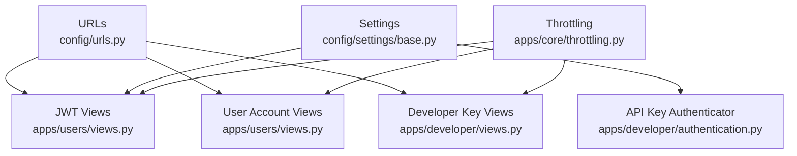
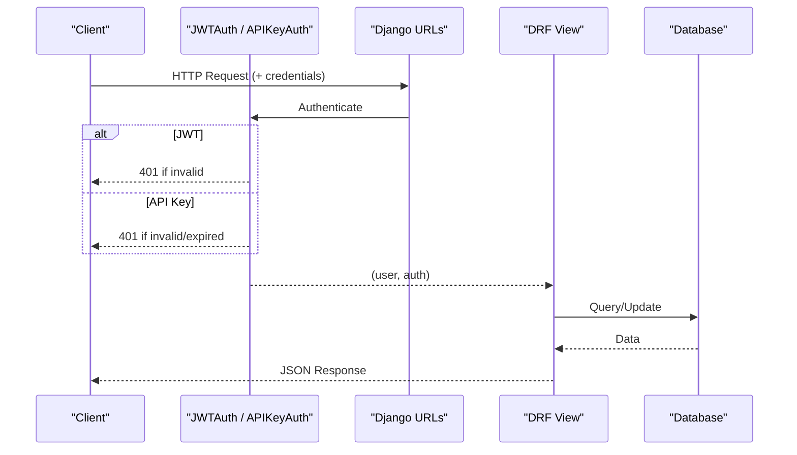
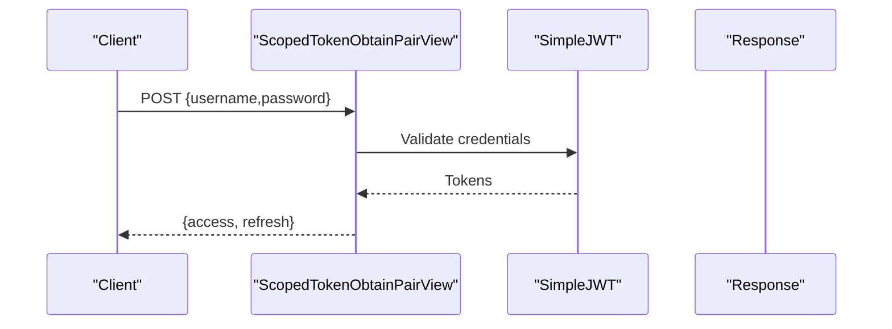
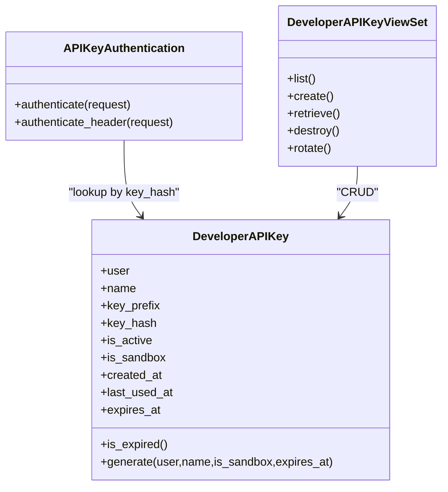
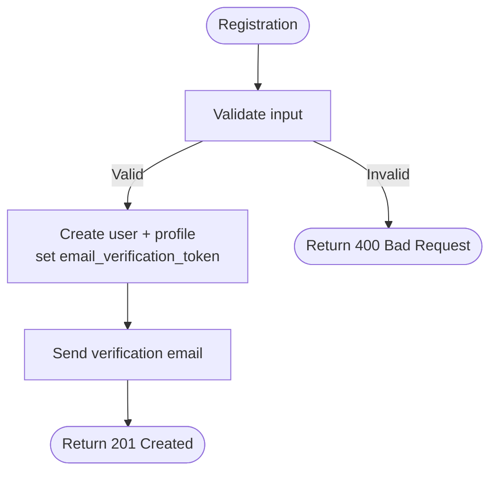
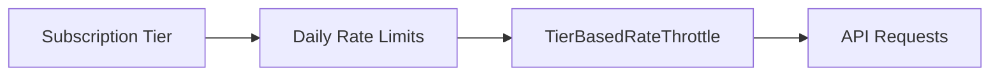
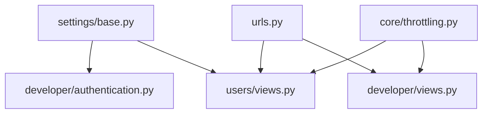

# Authentication & Authorization

<cite>
**Referenced Files in This Document**
- [config/urls.py](file://config/urls.py)
- [config/settings/base.py](file://config/settings/base.py)
- [apps/users/views.py](file://apps/users/views.py)
- [apps/users/serializers.py](file://apps/users/serializers.py)
- [apps/developer/authentication.py](file://apps/developer/authentication.py)
- [apps/developer/models.py](file://apps/developer/models.py)
- [apps/developer/views.py](file://apps/developer/views.py)
- [apps/developer/serializers.py](file://apps/developer/serializers.py)
- [apps/core/throttling.py](file://apps/core/throttling.py)
- [docs/reference/api.md](file://docs/reference/api.md)
</cite>

## Table of Contents
1. [Introduction](#introduction)
2. [Project Structure](#project-structure)
3. [Core Components](#core-components)
4. [Architecture Overview](#architecture-overview)
5. [Detailed Component Analysis](#detailed-component-analysis)
6. [Dependency Analysis](#dependency-analysis)
7. [Performance Considerations](#performance-considerations)
8. [Troubleshooting Guide](#troubleshooting-guide)
9. [Conclusion](#conclusion)
10. [Appendices](#appendices)

## Introduction
This document describes the authentication and authorization mechanisms for the FinanceAnalysis API. It covers:
- JWT-based authentication with token obtain, refresh, and verify endpoints at /api/v1/auth/token/.
- API key authentication for developer access via X-API-Key header.
- Scoped permissions and rate limiting by subscription tier.
- User registration, email verification, and password reset workflows.
- Request/response schemas for all authentication endpoints.
- Error handling patterns and security best practices.
- Client implementation examples for both JWT and API key methods.

## Project Structure
Authentication-related functionality is implemented across several modules:
- URL routing for auth endpoints under /api/v1/auth/ and user account management under /api/v1/users/.
- JWT configuration and default authentication classes in settings.
- Custom throttling per subscription tier.
- Developer API key model, serializer, views, and custom authenticator.
- User registration, email verification, and password reset views and serializers.

**Diagram sources**
- [config/urls.py:109-128](file://config/urls.py#L109-L128)
- [apps/users/views.py:32-41](file://apps/users/views.py#L32-L41)
- [apps/developer/views.py:13-83](file://apps/developer/views.py#L13-L83)
- [config/settings/base.py:280-321](file://config/settings/base.py#L280-L321)
- [apps/developer/authentication.py:10-52](file://apps/developer/authentication.py#L10-L52)
- [apps/core/throttling.py:44-87](file://apps/core/throttling.py#L44-L87)

**Section sources**
- [config/urls.py:109-128](file://config/urls.py#L109-L128)
- [config/settings/base.py:280-321](file://config/settings/base.py#L280-L321)

## Core Components
- JWT endpoints:
  - POST /api/v1/auth/token/ — obtain access and refresh tokens
  - POST /api/v1/auth/token/refresh/ — rotate refresh to new access
  - POST /api/v1/auth/token/verify/ — validate a token
- API key endpoints:
  - POST /api/v1/developer/keys/ — create an API key (returns raw_key once)
  - GET /api/v1/developer/keys/{id}/ — list/retrieve keys scoped to current user
  - DELETE /api/v1/developer/keys/{id}/ — revoke a key
  - POST /api/v1/developer/keys/{id}/rotate/ — revoke and issue replacement
- User account endpoints:
  - POST /api/v1/users/register/ — register a new user
  - POST /api/v1/users/verify-email/ — verify email using token
  - POST /api/v1/users/password-reset/ — request password reset link
  - POST /api/v1/users/password-reset-confirm/ — confirm password reset

Key behaviors:
- Default authentication order: JWT Bearer, API Key, Session.
- Throttling applies per tier; auth endpoints are rate-limited.
- API keys are hashed before storage; only prefix and hash stored.
- Email verification and password reset use one-time tokens stored on user profile.

**Section sources**
- [config/urls.py:114-121](file://config/urls.py#L114-L121)
- [apps/users/views.py:32-41](file://apps/users/views.py#L32-L41)
- [apps/developer/views.py:13-83](file://apps/developer/views.py#L13-L83)
- [apps/developer/authentication.py:10-52](file://apps/developer/authentication.py#L10-L52)
- [apps/core/throttling.py:44-87](file://apps/core/throttling.py#L44-L87)

## Architecture Overview
The system supports two primary authentication methods:
- JWT Bearer tokens for interactive/dashboard usage.
- API keys for programmatic/third-party integrations.

Requests are authenticated in this order:
1. JWTAuthentication (Authorization: Bearer <access>)
2. APIKeyAuthentication (X-API-Key: <key>)
3. SessionAuthentication (for browsable API/admin)

Rate limits vary by subscription tier and apply globally unless overridden.

**Diagram sources**
- [config/settings/base.py:280-285](file://config/settings/base.py#L280-L285)
- [apps/developer/authentication.py:24-49](file://apps/developer/authentication.py#L24-L49)
- [config/urls.py:109-128](file://config/urls.py#L109-L128)

## Detailed Component Analysis

### JWT Token Endpoints
- Obtain pair: POST /api/v1/auth/token/
  - Request body: username, password
  - Response: access, refresh
  - Throttled by AuthEndpointRateThrottle
- Refresh: POST /api/v1/auth/token/refresh/
  - Request body: refresh
  - Response: new access (rotation enabled; old refresh blacklisted)
- Verify: POST /api/v1/auth/token/verify/
  - Request body: token
  - Response: validation result

Token lifetimes and rotation are configured in settings.

**Diagram sources**
- [apps/users/views.py:32-34](file://apps/users/views.py#L32-L34)
- [config/settings/base.py:307-321](file://config/settings/base.py#L307-L321)

**Section sources**
- [apps/users/views.py:32-41](file://apps/users/views.py#L32-L41)
- [config/settings/base.py:307-321](file://config/settings/base.py#L307-L321)
- [docs/reference/api.md:48-81](file://docs/reference/api.md#L48-L81)

### API Key Authentication
- Header: X-API-Key
- Storage: SHA-256 hash of raw key; only prefix stored for display
- Lifecycle: create, list, retrieve, revoke, rotate
- Scoping: Keys are scoped to the creating user; lists filtered by request.user

**Diagram sources**
- [apps/developer/models.py:10-100](file://apps/developer/models.py#L10-L100)
- [apps/developer/authentication.py:10-52](file://apps/developer/authentication.py#L10-L52)
- [apps/developer/views.py:13-83](file://apps/developer/views.py#L13-L83)

**Section sources**
- [apps/developer/authentication.py:10-52](file://apps/developer/authentication.py#L10-L52)
- [apps/developer/models.py:10-100](file://apps/developer/models.py#L10-L100)
- [apps/developer/views.py:13-83](file://apps/developer/views.py#L13-L83)
- [apps/developer/serializers.py:6-50](file://apps/developer/serializers.py#L6-L50)

### User Registration, Email Verification, Password Reset
- Registration:
  - POST /api/v1/users/register/
  - Validates password strength and uniqueness
  - Creates user and profile; sets email_verification_token
  - Sends verification email
- Email verification:
  - POST /api/v1/users/verify-email/
  - Validates token; marks email verified and clears token
- Password reset:
  - POST /api/v1/users/password-reset/
  - Generates reset token and sends email; always returns success to prevent enumeration
  - POST /api/v1/users/password-reset-confirm/
  - Validates token and password; updates password and clears token

**Diagram sources**
- [apps/users/views.py:44-71](file://apps/users/views.py#L44-L71)
- [apps/users/serializers.py:45-110](file://apps/users/serializers.py#L45-L110)

**Section sources**
- [apps/users/views.py:44-157](file://apps/users/views.py#L44-L157)
- [apps/users/serializers.py:45-216](file://apps/users/serializers.py#L45-L216)

### Permissions and Scopes
- Default permission policy allows read-only anonymous access where appropriate; many endpoints require IsAuthenticated.
- Subscription tiers influence throttling limits:
  - Anonymous: 100/day
  - Free: 100/day
  - Pro: 1000/day
  - Premium: 10000/day
- Some views enforce stricter permissions (e.g., screener prebuilt requires authentication).

**Diagram sources**
- [config/settings/base.py:287-300](file://config/settings/base.py#L287-L300)
- [apps/core/throttling.py:44-87](file://apps/core/throttling.py#L44-L87)

**Section sources**
- [config/settings/base.py:287-300](file://config/settings/base.py#L287-L300)
- [apps/core/throttling.py:44-87](file://apps/core/throttling.py#L44-L87)

## Dependency Analysis
- URL routes map to views that implement authentication flows.
- Settings configure default authentication classes and JWT parameters.
- Developer module provides API key lifecycle and custom authenticator.
- Users module implements JWT wrappers with throttling and account management.
- Throttling module enforces per-tier limits based on user profile.

**Diagram sources**
- [config/urls.py:109-128](file://config/urls.py#L109-L128)
- [config/settings/base.py:280-321](file://config/settings/base.py#L280-L321)
- [apps/developer/authentication.py:10-52](file://apps/developer/authentication.py#L10-L52)
- [apps/core/throttling.py:44-87](file://apps/core/throttling.py#L44-L87)

**Section sources**
- [config/urls.py:109-128](file://config/urls.py#L109-L128)
- [config/settings/base.py:280-321](file://config/settings/base.py#L280-L321)

## Performance Considerations
- JWT access tokens are short-lived (60 minutes); refresh tokens last 7 days with rotation and blacklist after rotation to minimize reuse risk.
- API key lookups use indexed fields (key_hash, user+is_active) for efficient queries.
- Throttling prevents abuse and protects backend resources; ensure clients respect 429 responses and back off.
- Non-blocking update of last_used_at for API keys avoids request latency spikes.

[No sources needed since this section provides general guidance]

## Troubleshooting Guide
Common errors and resolutions:
- 401 Unauthorized:
  - Missing or invalid Authorization header for JWT
  - Missing or invalid X-API-Key header
  - Expired or revoked API key
- 400 Bad Request:
  - Validation errors in registration, email verification, or password reset payloads
  - Mismatched passwords or weak password
- 404 Not Found:
  - Invalid resource ID when retrieving or deleting API keys
- 429 Too Many Requests:
  - Exceeded rate limit; check tier and throttle headers; retry later

Debugging tips:
- Use Swagger UI or ReDoc to inspect schemas and test endpoints.
- Inspect response bodies for detailed error messages from serializers.
- Confirm environment variables for JWT signing key and email settings.

**Section sources**
- [apps/users/views.py:44-157](file://apps/users/views.py#L44-L157)
- [apps/developer/views.py:13-83](file://apps/developer/views.py#L13-L83)
- [apps/core/throttling.py:44-87](file://apps/core/throttling.py#L44-L87)

## Conclusion
The FinanceAnalysis API provides robust authentication and authorization through JWT and API keys, with strong security practices including token rotation, hashing of API keys, and tiered rate limiting. User account workflows support secure registration, email verification, and password resets. Clients should follow the documented request/response schemas and handle errors appropriately.

[No sources needed since this section summarizes without analyzing specific files]

## Appendices

### API Endpoint Reference

- JWT
  - POST /api/v1/auth/token/
    - Request: {username, password}
    - Response: {access, refresh}
  - POST /api/v1/auth/token/refresh/
    - Request: {refresh}
    - Response: {access}
  - POST /api/v1/auth/token/verify/
    - Request: {token}
    - Response: validation result

- API Keys
  - POST /api/v1/developer/keys/
    - Request: {name, is_sandbox?, expires_at?}
    - Response: key metadata + raw_key (once)
  - GET /api/v1/developer/keys/{id}/
    - Response: key metadata (no raw_key)
  - DELETE /api/v1/developer/keys/{id}/
    - Response: 204 No Content
  - POST /api/v1/developer/keys/{id}/rotate/
    - Response: new key metadata + raw_key (once)

- User Accounts
  - POST /api/v1/users/register/
    - Request: {username, email, password, password_confirm, first_name?, last_name?, phone_number?, company?}
    - Response: message + user object
  - POST /api/v1/users/verify-email/
    - Request: {token}
    - Response: message
  - POST /api/v1/users/password-reset/
    - Request: {email}
    - Response: message (always success to avoid enumeration)
  - POST /api/v1/users/password-reset-confirm/
    - Request: {token, password, password_confirm}
    - Response: message

**Section sources**
- [config/urls.py:114-121](file://config/urls.py#L114-L121)
- [apps/users/views.py:44-157](file://apps/users/views.py#L44-L157)
- [apps/developer/views.py:13-83](file://apps/developer/views.py#L13-L83)
- [apps/developer/serializers.py:6-50](file://apps/developer/serializers.py#L6-L50)

### Security Best Practices
- Always use HTTPS for all requests.
- Store JWT access tokens securely in client memory; do not persist long-lived secrets.
- Rotate refresh tokens regularly; never reuse a refresh token after rotation.
- Treat API keys as secrets; store them in secure environments and rotate periodically.
- Enforce least privilege: use sandbox keys for testing; restrict scopes as needed.
- Monitor rate limits and implement exponential backoff on 429 responses.
- Validate all inputs server-side; rely on DRF serializers for consistent validation.

[No sources needed since this section provides general guidance]

### Client Implementation Examples

- JWT Authentication
  - Obtain tokens: POST /api/v1/auth/token/ with username and password
  - Use access token: Authorization: Bearer <access>
  - Refresh token: POST /api/v1/auth/token/refresh/ with refresh token
  - Verify token: POST /api/v1/auth/token/verify/ with token

- API Key Authentication
  - Create key: POST /api/v1/developer/keys/ with name (and optional is_sandbox, expires_at)
  - Use key: X-API-Key: <key>
  - Rotate key: POST /api/v1/developer/keys/{id}/rotate/

For concrete request/response shapes, consult the OpenAPI schema endpoints:
- Swagger UI: /api/v1/schema/swagger-ui/
- ReDoc: /api/v1/schema/redoc/
- Raw OpenAPI: /api/v1/schema/

**Section sources**
- [docs/reference/api.md:48-95](file://docs/reference/api.md#L48-L95)
- [config/settings/base.py:350-388](file://config/settings/base.py#L350-L388)