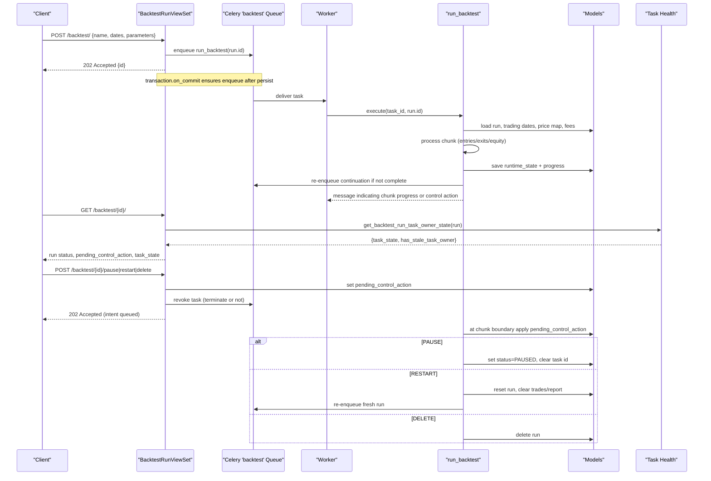
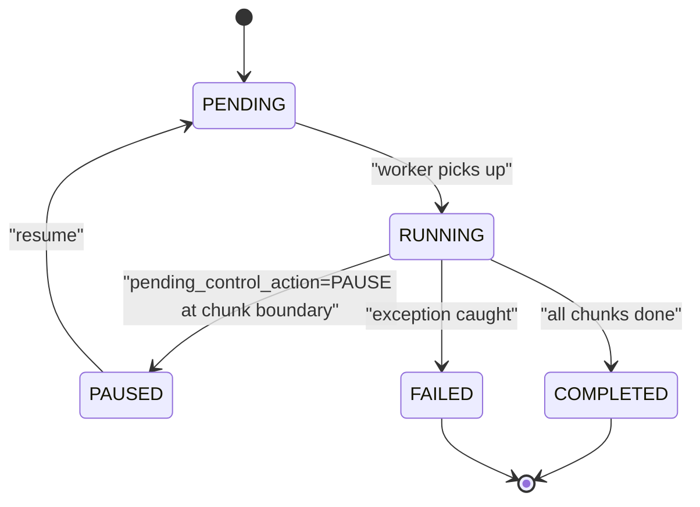
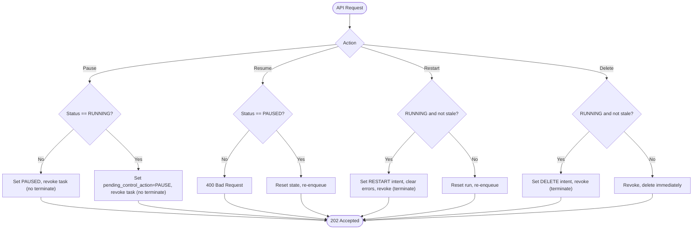
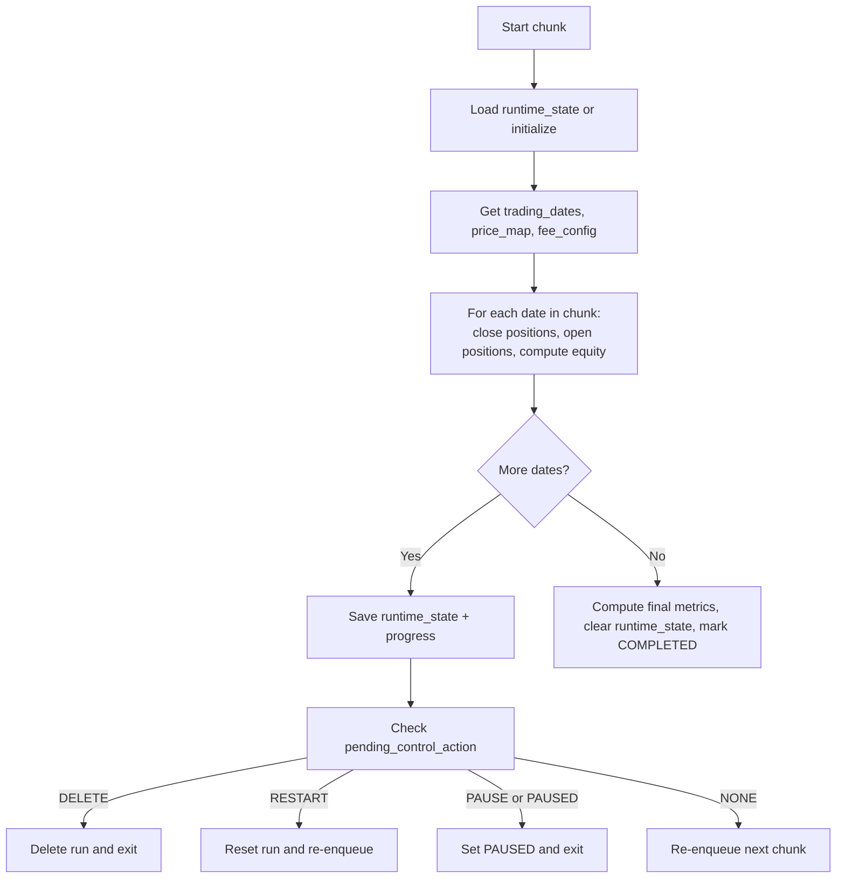
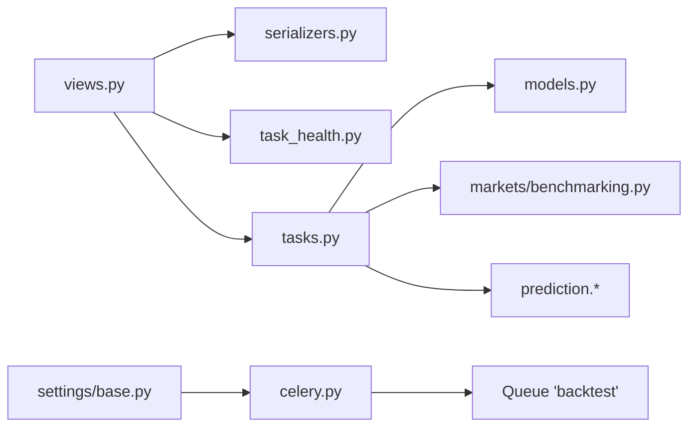

# Backtest Runs

<cite>
**Referenced Files in This Document**
- [models.py](file://apps/backtest/models.py)
- [views.py](file://apps/backtest/views.py)
- [tasks.py](file://apps/backtest/tasks.py)
- [serializers.py](file://apps/backtest/serializers.py)
- [task_health.py](file://apps/backtest/task_health.py)
- [base.py](file://config/settings/base.py)
- [celery.py](file://config/celery.py)
- [run_core_backtest_matrix.py](file://apps/backtest/management/commands/run_core_backtest_matrix.py)
- [rerun_backtests_for_comparison.py](file://apps/backtest/management/commands/rerun_backtests_for_comparison.py)
- [api.md](file://docs/reference/api.md)
- [celery.md](file://docs/reference/celery.md)
</cite>

## Table of Contents
1. [Introduction](#introduction)
2. [Project Structure](#project-structure)
3. [Core Components](#core-components)
4. [Architecture Overview](#architecture-overview)
5. [Detailed Component Analysis](#detailed-component-analysis)
6. [Dependency Analysis](#dependency-analysis)
7. [Performance Considerations](#performance-considerations)
8. [Troubleshooting Guide](#troubleshooting-guide)
9. [Conclusion](#conclusion)
10. [Appendices](#appendices)

## Introduction
This document explains the backtest run management endpoints and their lifecycle: creation, execution, pausing, resuming, restarting, and deletion. It documents the intent-based control system where pause/restart/delete are queued and applied at chunk boundaries, the asynchronous execution model using Celery tasks on the dedicated backtest queue, parameter specifications for strategy configuration, cost modeling, risk constraints, and performance metrics, and operational guidance for batch workflows, monitoring via status polling, result retrieval, error handling, task health checks, and recovery from failed or stale tasks.

## Project Structure
Backtesting is implemented as a Django app with:
- Models defining runs and trades
- REST viewset exposing CRUD plus lifecycle actions
- Celery tasks implementing chunked, resumable execution
- Serializers validating parameters and surfacing task health
- Task health utilities to detect orphaned or stale tasks
- Management commands for matrix runs and comparison reruns
- Celery configuration routing backtest tasks to a dedicated queue

```mermaid
graph TB
Client["Client"] --> API["Django REST ViewSet<br/>apps/backtest/views.py"]
API --> Serializer["Parameter Validation<br/>apps/backtest/serializers.py"]
API --> Queue["Celery Queue 'backtest'<br/>config/settings/base.py"]
Queue --> Worker["Celery Worker"]
Worker --> Task["run_backtest<br/>apps/backtest/tasks.py"]
Task --> DB["Django ORM<br/>apps/backtest/models.py"]
Task --> Health["Task Health Check<br/>apps/backtest/task_health.py"]
API <-- Health
```

**Diagram sources**
- [views.py:75-208](file://apps/backtest/views.py#L75-L208)
- [serializers.py:48-300](file://apps/backtest/serializers.py#L48-L300)
- [base.py:174-204](file://config/settings/base.py#L174-L204)
- [tasks.py:2299-2578](file://apps/backtest/tasks.py#L2299-L2578)
- [models.py:24-117](file://apps/backtest/models.py#L24-L117)
- [task_health.py:45-95](file://apps/backtest/task_health.py#L45-L95)

**Section sources**
- [views.py:1-221](file://apps/backtest/views.py#L1-L221)
- [models.py:1-168](file://apps/backtest/models.py#L1-L168)
- [tasks.py:1-800](file://apps/backtest/tasks.py#L1-L800)
- [serializers.py:1-300](file://apps/backtest/serializers.py#L1-L300)
- [task_health.py:1-95](file://apps/backtest/task_health.py#L1-L95)
- [base.py:174-204](file://config/settings/base.py#L174-L204)
- [celery.py:1-17](file://config/celery.py#L1-L17)

## Core Components
- BacktestRun: stores run identity, strategy type, time window, capital, metrics, JSON parameters/report, current Celery task id, pending control action, timestamps.
- BacktestTrade: trade ledger rows (legs), including signal payload and metadata.
- BacktestRunViewSet: exposes create/list/retrieve plus lifecycle actions (pause, resume, restart, rerun, delete), trade listing, and comparison curve endpoint.
- run_backtest Celery task: executes chunk by chunk, persists runtime state, re-queues itself until completion, applies pending control actions at chunk boundaries.
- Serializers: validate strategy parameters, fee models, candidate modes, thresholds, and LightGBM inference settings; surface task health fields.
- Task health: determines whether a RUNNING run has a stale or terminal Celery task owner.

Key behaviors:
- Creation enqueues asynchronously onto the backtest queue; response is accepted immediately.
- Control actions are intents recorded on the run and applied at chunk boundaries by the worker.
- Long runs are chunked and resumable via runtime_state stored in report.
- Errors are captured and persisted on the run; Celery may still report success because the task catches exceptions internally.

**Section sources**
- [models.py:24-117](file://apps/backtest/models.py#L24-L117)
- [views.py:75-208](file://apps/backtest/views.py#L75-L208)
- [tasks.py:2299-2578](file://apps/backtest/tasks.py#L2299-L2578)
- [serializers.py:48-300](file://apps/backtest/serializers.py#L48-L300)
- [task_health.py:45-95](file://apps/backtest/task_health.py#L45-L95)

## Architecture Overview
The backtest lifecycle spans HTTP requests, Celery queues, and persistent state:



**Diagram sources**
- [views.py:90-196](file://apps/backtest/views.py#L90-L196)
- [tasks.py:2299-2578](file://apps/backtest/tasks.py#L2299-L2578)
- [task_health.py:45-95](file://apps/backtest/task_health.py#L45-L95)
- [base.py:174-204](file://config/settings/base.py#L174-L204)

## Detailed Component Analysis

### Run Model and Lifecycle States
- Strategy types include bottom candidate, prediction threshold, macro rotation.
- Status transitions: PENDING -> RUNNING -> COMPLETED or FAILED; PAUSED reachable from RUNNING.
- Control actions: NONE, PAUSE, RESTART, DELETE. These are intents applied at chunk boundaries.
- Fields track capital, metrics, JSON parameters/report, current Celery task id, and timestamps.



**Diagram sources**
- [models.py:41-52](file://apps/backtest/models.py#L41-L52)
- [tasks.py:2331-2338](file://apps/backtest/tasks.py#L2331-L2338)
- [tasks.py:2479-2485](file://apps/backtest/tasks.py#L2479-L2485)
- [tasks.py:2555-2569](file://apps/backtest/tasks.py#L2555-L2569)

**Section sources**
- [models.py:24-117](file://apps/backtest/models.py#L24-L117)

### API Endpoints and Intent-Based Controls
- Create: returns 202 Accepted; enqueues run asynchronously after commit.
- Pause:
  - If PENDING or stale owner: immediately set PAUSED and revoke task without termination.
  - If RUNNING: record PAUSE intent, revoke task without termination; applied at next chunk boundary.
- Resume: only from PAUSED; resets state and re-enqueues.
- Restart/Rerun:
  - If RUNNING and not stale owner: record RESTART intent, clear errors, revoke task with termination; applied at next chunk boundary.
  - Otherwise: reset run data and re-enqueue immediately.
- Delete:
  - If RUNNING and not stale owner: record DELETE intent, revoke task with termination; applied at next chunk boundary.
  - Otherwise: revoke and delete immediately.
- Trades: list trade legs for a run.
- Comparison curve: returns equity curves for comparison against other runs.



**Diagram sources**
- [views.py:90-196](file://apps/backtest/views.py#L90-L196)

**Section sources**
- [views.py:75-208](file://apps/backtest/views.py#L75-L208)

### Execution Engine and Chunking
- The run_backtest task processes BACKTEST_CHUNK_TRADING_DAYS trading days per chunk.
- Progress is persisted in report.runtime_state and report.progress so long runs survive worker restarts and timeouts.
- At each chunk boundary, the task checks pending_control_action and applies PAUSE, RESTART, or DELETE before continuing or terminating.
- On completion, final metrics are computed and saved; runtime_state is cleared from report.



**Diagram sources**
- [tasks.py:2394-2488](file://apps/backtest/tasks.py#L2394-L2488)
- [tasks.py:2489-2570](file://apps/backtest/tasks.py#L2489-L2570)

**Section sources**
- [tasks.py:2299-2578](file://apps/backtest/tasks.py#L2299-L2578)

### Parameter Specifications
Strategy configuration and controls are validated in the serializer and consumed by the engine:

- Prediction threshold strategy required keys:
  - top_n: integer > 0
  - horizon_days: one of 3, 7, 30
  - up_threshold: float between 0 and 1
  - prediction_source: heuristic, lightgbm, lstm
  - holding_period_days: optional integer > 0
  - capital_fraction_per_entry: float between 0 and 1
  - entry_weekdays: list or comma-separated string of MON..FRI
  - candidate_mode: top_n or trade_score
  - top_n_metric: trade_score or up_prob_3d/up_prob_7d/up_prob_30d
  - trade_score_scope: independent or combined
  - max_positions: optional integer > 0
  - trade_score_threshold: optional numeric
  - use_macro_context: boolean
  - enable_stop_target_exit: boolean
  - trade_decision_policy: object with optional include_near_round_target (bool), min_target_return_pct (0..0.5), min_stop_distance_pct (0..0.5)
  - compare_backtest_run_id: optional integer referencing a completed run of same strategy_type and matching prediction_source

- Fee modeling:
  - Two mutually exclusive modes:
    - structured CN A-share default: commission_rate_per_mille, commission_min, exchange_fee_rate_per_mille, regulatory_fee_rate_per_mille, stamp_duty_rate_per_mille, transfer_fee_rate_per_mille
    - legacy_flat_fee: single fee_rate applied symmetrically
  - slippage_bps: non-negative numeric

- LightGBM-specific:
  - lightgbm_inference_backend: auto, cpu_serial, cpu_batched, windows_gpu
  - lightgbm_batch_size: positive integer

- Risk and execution controls:
  - stop/target exits controlled via enable_stop_target_exit and trade_decision_policy thresholds
  - macro context multiplier can be enabled via use_macro_context

These validations ensure consistent, interpretable runs and prevent mixed fee models.

**Section sources**
- [serializers.py:86-300](file://apps/backtest/serializers.py#L86-L300)
- [tasks.py:338-446](file://apps/backtest/tasks.py#L338-L446)
- [tasks.py:614-678](file://apps/backtest/tasks.py#L614-L678)

### Batch Backtesting Workflows
- Matrix command creates many runs across variants and sources, then either queues them or executes inline while preserving in-memory caches.
- Supports configurable chunk size, LightGBM backend selection, and output manifest generation.
- Comparison rerun command clones existing runs with deep-copied parameters, sets compare_backtest_run_id, and optionally queues or executes inline.

Operational notes:
- Use --execute-inline for fastest local runs when sharing caches within a process.
- Use --queue to dispatch to workers consuming the backtest queue.
- Clear process caches between unrelated batches to avoid cross-run contamination.

**Section sources**
- [run_core_backtest_matrix.py:1-461](file://apps/backtest/management/commands/run_core_backtest_matrix.py#L1-L461)
- [rerun_backtests_for_comparison.py:1-157](file://apps/backtest/management/commands/rerun_backtests_for_comparison.py#L1-L157)

### Monitoring and Result Retrieval
- Poll run status via GET /backtest/{id}/ to observe status, pending_control_action, task_state, and has_stale_task_owner.
- Retrieve trades via GET /backtest/{id}/trades/.
- Compare equity curves via GET /backtest/{id}/comparison_curve/?extra_compare_run_id=N&extra_compare_run_ids=M,N.

Monitoring best practices:
- Treat RUNNING with a terminal Celery task state or a stale pending task beyond the configured age as needing intervention.
- Use task_state and has_stale_task_owner to distinguish healthy continuations from dead tasks.

**Section sources**
- [views.py:198-208](file://apps/backtest/views.py#L198-L208)
- [task_health.py:45-95](file://apps/backtest/task_health.py#L45-L95)
- [api.md:350-357](file://docs/reference/api.md#L350-L357)

## Dependency Analysis
- Views depend on serializers for validation and on task_health for live task ownership info.
- Tasks depend on models for persistence and on market/prediction modules for signals and features.
- Celery routes apps.backtest.tasks.run_backtest to the backtest queue; workers must consume that queue explicitly.
- Settings define queue topology and time limits; global defaults protect ops queue while backtest tasks override soft/hard limits.



**Diagram sources**
- [views.py:20-31](file://apps/backtest/views.py#L20-L31)
- [tasks.py:54-69](file://apps/backtest/tasks.py#L54-L69)
- [base.py:174-204](file://config/settings/base.py#L174-L204)
- [celery.py:1-17](file://config/celery.py#L1-L17)

**Section sources**
- [base.py:174-204](file://config/settings/base.py#L174-L204)
- [celery.py:1-17](file://config/celery.py#L1-L17)

## Performance Considerations
- Chunk size: BACKTEST_CHUNK_TRADING_DAYS governs how many trading days are processed per task; larger chunks reduce overhead but increase memory/time per chunk.
- Process-level caches: trading dates, price maps, and matrix signals are bounded and shared within a process; clear_backtest_process_caches should be used between unrelated batches.
- LightGBM inference backend: choose cpu_serial, cpu_batched, or windows_gpu based on environment; batch size affects throughput.
- Time limits: run_backtest overrides global limits to allow long runs; ensure workers have sufficient resources.
- Avoid mixing fee models; structured mode is recommended for accurate CN A-share costs.

[No sources needed since this section provides general guidance]

## Troubleshooting Guide
Common issues and remedies:
- Run stuck in RUNNING with no progress:
  - Inspect task_state and has_stale_task_owner; if stale, pause or restart to recover.
- Task terminated unexpectedly:
  - Check error_message on the run; failures are persisted even if Celery reports success.
- Worker not executing backtests:
  - Ensure a worker consumes the backtest queue; default worker may only consume ops.
- Stale or orphaned tasks:
  - Use pause or restart to reclaim ownership; the system revokes tasks appropriately.
- Inconsistent results after changes:
  - Use rerun command to clone runs and compare new outputs against baselines.

Operational tips:
- Always poll status and task_state; do not rely solely on Celery state.
- For long-running matrices, prefer --execute-inline locally to reuse caches, or queue with adequate workers.
- Export results after matrix runs using export commands for archival and analysis.

**Section sources**
- [task_health.py:1-95](file://apps/backtest/task_health.py#L1-L95)
- [tasks.py:2275-2296](file://apps/backtest/tasks.py#L2275-L2296)
- [celery.md:13-108](file://docs/reference/celery.md#L13-L108)

## Conclusion
Backtest runs are managed through an intent-based control system that decouples user actions from execution boundaries, enabling safe pausing, restarting, and deletion during long-running, chunked executions. The Celery-backed engine persists progress to support resilience against worker failures and timeouts. Robust parameter validation ensures reproducible strategies and accurate cost modeling. Operational tooling supports batch experimentation and comparison workflows, while task health utilities help identify and recover from stale or failed tasks.

[No sources needed since this section summarizes without analyzing specific files]

## Appendices

### API Reference Summary
- Create backtest run: POST /backtest/ with name, start_date, end_date, strategy_type, parameters; returns 202 Accepted.
- List/retrieve runs: GET /backtest/, GET /backtest/{id}/.
- Lifecycle actions:
  - POST /backtest/{id}/pause/
  - POST /backtest/{id}/resume/
  - POST /backtest/{id}/restart/
  - POST /backtest/{id}/rerun/
  - DELETE /backtest/{id}/
- Results:
  - GET /backtest/{id}/trades/
  - GET /backtest/{id}/comparison_curve/?extra_compare_run_id=N&extra_compare_run_ids=M,N

**Section sources**
- [api.md:350-357](file://docs/reference/api.md#L350-L357)
- [views.py:75-208](file://apps/backtest/views.py#L75-L208)

### Celery Queue and Limits
- Queues: ops (default), backtest, train-lightgbm, train-lstm.
- Routing: apps.backtest.tasks.run_backtest -> backtest queue.
- Time limits: global defaults protect ops; run_backtest overrides soft_time_limit and time_limit for long runs.

**Section sources**
- [base.py:174-204](file://config/settings/base.py#L174-L204)
- [celery.md:13-108](file://docs/reference/celery.md#L13-L108)