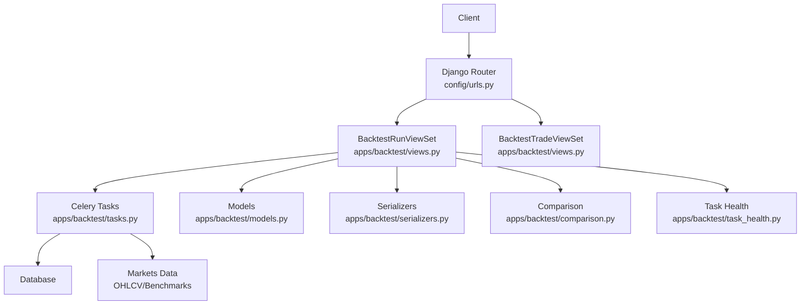
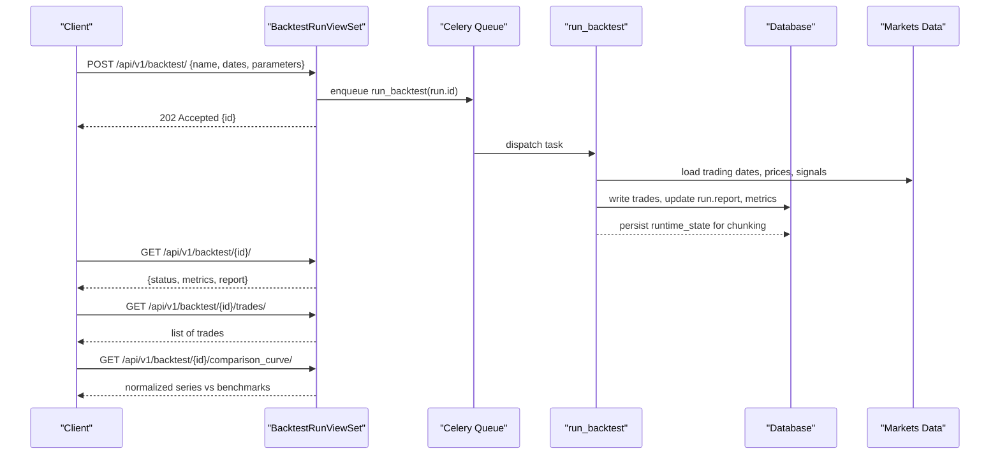
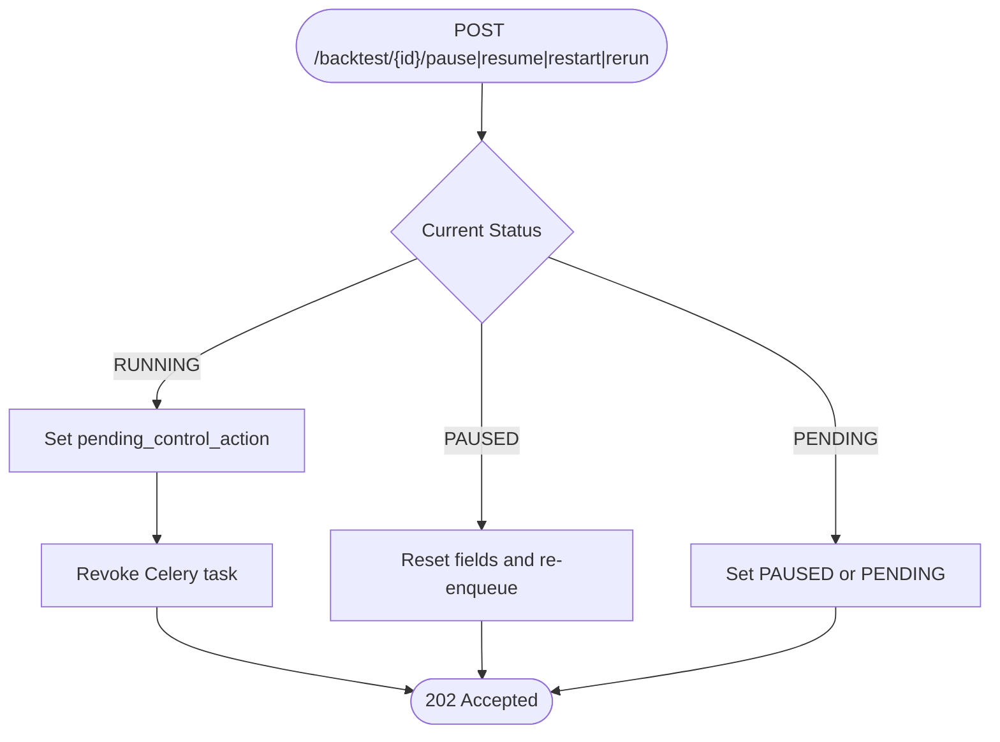
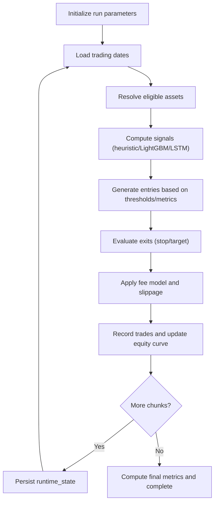
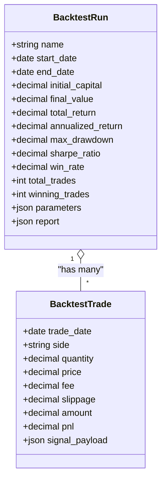
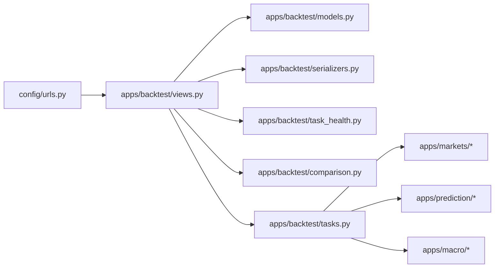

# Backtesting API

<cite>
**Referenced Files in This Document**
- [views.py](file://apps/backtest/views.py)
- [models.py](file://apps/backtest/models.py)
- [serializers.py](file://apps/backtest/serializers.py)
- [tasks.py](file://apps/backtest/tasks.py)
- [comparison.py](file://apps/backtest/comparison.py)
- [task_health.py](file://apps/backtest/task_health.py)
- [urls.py](file://config/urls.py)
- [api.md](file://docs/reference/api.md)
- [TECHNICAL_GUIDE.md](file://TECHNICAL_GUIDE.md)
- [run_core_backtest_matrix.py](file://apps/backtest/management/commands/run_core_backtest_matrix.py)
</cite>

## Table of Contents
1. [Introduction](#introduction)
2. [Project Structure](#project-structure)
3. [Core Components](#core-components)
4. [Architecture Overview](#architecture-overview)
5. [Detailed Component Analysis](#detailed-component-analysis)
6. [Dependency Analysis](#dependency-analysis)
7. [Performance Considerations](#performance-considerations)
8. [Troubleshooting Guide](#troubleshooting-guide)
9. [Conclusion](#conclusion)
10. [Appendices](#appendices)

## Introduction
This document describes the backtesting API surface for strategy simulation, trade execution, and performance analysis. It covers how to create and manage backtest runs, retrieve trade history, compare equity curves against benchmarks, and interpret performance metrics. It also documents parameter specifications for strategy configuration, cost modeling, and risk controls, along with example workflows for strategy development and benchmarking.

## Project Structure
The backtesting feature is implemented as a Django app under apps/backtest with:
- REST endpoints exposed via viewsets
- Celery-backed asynchronous execution for long-running backtests
- Persistence models for runs and trades
- Comparison utilities for benchmarking
- Task health detection for resilient lifecycle control

**Diagram sources**
- [urls.py:74-107](file://config/urls.py#L74-L107)
- [views.py:75-221](file://apps/backtest/views.py#L75-L221)
- [tasks.py:1-120](file://apps/backtest/tasks.py#L1-L120)
- [models.py:24-168](file://apps/backtest/models.py#L24-L168)
- [serializers.py:35-300](file://apps/backtest/serializers.py#L35-L300)
- [comparison.py:177-245](file://apps/backtest/comparison.py#L177-L245)
- [task_health.py:45-95](file://apps/backtest/task_health.py#L45-L95)

**Section sources**
- [urls.py:74-107](file://config/urls.py#L74-L107)
- [api.md:326-357](file://docs/reference/api.md#L326-L357)

## Core Components
- BacktestRun model: stores run configuration, status, lifecycle state, and results (equity curve, metrics).
- BacktestTrade model: ledger of executed legs (buy/sell), fees, slippage, PnL, and signal payload.
- BacktestRunViewSet: CRUD plus lifecycle actions (pause, resume, restart, rerun, delete), comparison curve endpoint, and trade listing.
- BacktestTradeViewSet: read-only access to trades filtered by run.
- tasks.py: chunked, resumable backtest engine; fee modeling; candidate generation; exit logic; metrics computation.
- comparison.py: builds normalized equity curves for the run and benchmarks (CSI 300, CSI A500).
- task_health.py: detects stale or orphaned tasks to support safe pause/restart/delete.

Key behaviors:
- Creation enqueues an async task on the backtest queue; responses are accepted immediately.
- Long runs execute in chunks and persist progress in report.runtime_state for resumption.
- Lifecycle transitions are intent-based; they may apply at chunk boundaries.

**Section sources**
- [models.py:24-168](file://apps/backtest/models.py#L24-L168)
- [views.py:75-221](file://apps/backtest/views.py#L75-L221)
- [tasks.py:1-120](file://apps/backtest/tasks.py#L1-L120)
- [comparison.py:177-245](file://apps/backtest/comparison.py#L177-L245)
- [task_health.py:45-95](file://apps/backtest/task_health.py#L45-L95)

## Architecture Overview
The backtesting system follows an event-driven architecture:
- Clients submit backtest runs via REST.
- The API queues a Celery task that executes the engine in chunks.
- The engine reads market data and signals, simulates trades, records trades, and updates run metrics.
- Clients poll run status and fetch trades or comparison curves.

**Diagram sources**
- [views.py:90-101](file://apps/backtest/views.py#L90-L101)
- [views.py:198-208](file://apps/backtest/views.py#L198-L208)
- [tasks.py:1-120](file://apps/backtest/tasks.py#L1-L120)
- [comparison.py:177-245](file://apps/backtest/comparison.py#L177-L245)

## Detailed Component Analysis

### Backtest Run Management
- Create: Accepts strategy_type, date range, initial capital, and parameters JSON. Enqueues asynchronously and returns 202 Accepted.
- List/Retrieve: Supports filtering by strategy_type and status; includes task health fields to distinguish active vs stale tasks.
- Lifecycle Actions:
  - Pause: For pending or running runs; sets pending_control_action and revokes current task if needed.
  - Resume: Only from paused; resets error and queued state, re-enqueues.
  - Restart/Rerun: Revives or resets run and re-queues; handles stale ownership recovery.
  - Delete: Removes run; cancels task if running.
- Trades: Lists all trades for a run ordered by date and id.
- Comparison Curve: Returns normalized equity curves for the run and optional compare runs, plus CSI 300 and CSI A500 benchmarks.

**Diagram sources**
- [views.py:124-196](file://apps/backtest/views.py#L124-L196)
- [task_health.py:45-95](file://apps/backtest/task_health.py#L45-L95)

**Section sources**
- [views.py:75-221](file://apps/backtest/views.py#L75-L221)
- [task_health.py:45-95](file://apps/backtest/task_health.py#L45-L95)

### Strategy Simulation and Trade Execution
- Candidate Generation: Recomputed per trading date using heuristic, LightGBM, or LSTM paths; never relies on stored predictions to ensure comparability across runs.
- Universe Selection: Uses point-in-time effective universe rules; fails closed when coverage is missing.
- Entry Rules: Controlled by parameters such as top_n, horizon_days, up_threshold, candidate_mode, trade_score_scope, entry_weekdays, and macro context adjustments.
- Exit Rules: Stop/target exits can be enabled; conservative handling when both stop and target trigger on same bar; no fabricated prices used for force-closes.
- Chunking: Runs execute in configurable chunk sizes (default environment-derived) and persist runtime_state for resume.

**Diagram sources**
- [tasks.py:520-617](file://apps/backtest/tasks.py#L520-L617)
- [tasks.py:681-800](file://apps/backtest/tasks.py#L681-L800)
- [TECHNICAL_GUIDE.md:783-806](file://TECHNICAL_GUIDE.md#L783-L806)

**Section sources**
- [tasks.py:1-120](file://apps/backtest/tasks.py#L1-L120)
- [tasks.py:520-617](file://apps/backtest/tasks.py#L520-L617)
- [tasks.py:681-800](file://apps/backtest/tasks.py#L681-L800)
- [TECHNICAL_GUIDE.md:783-806](file://TECHNICAL_GUIDE.md#L783-L806)

### Performance Metrics and Benchmarking
- Metrics: total_return, annualized_return, max_drawdown, sharpe_ratio, win_rate, total_trades, winning_trades.
- Definitions: Annualization uses calendar days for return and 252 trading days for Sharpe; Sharpe uses population standard deviation; total_trades counts closed positions.
- Benchmarking: Comparison endpoint normalizes strategy equity curve against CSI 300 and CSI A500 index series over the run’s trading dates. Optional compare runs can be included.

**Diagram sources**
- [models.py:24-168](file://apps/backtest/models.py#L24-L168)

**Section sources**
- [TECHNICAL_GUIDE.md:783-806](file://TECHNICAL_GUIDE.md#L783-L806)
- [comparison.py:177-245](file://apps/backtest/comparison.py#L177-L245)

### Parameter Specifications
Strategy parameters are validated in serializers and consumed by the engine. Key groups:

- Prediction source and model inference:
  - prediction_source: heuristic | lightgbm | lstm
  - lightgbm_inference_backend: auto | cpu_serial | cpu_batched | windows_gpu
  - lightgbm_batch_size: integer > 0
- Top-N selection:
  - top_n: integer > 0
  - horizon_days: 3 | 7 | 30
  - up_threshold: float between 0 and 1
  - top_n_metric: trade_score | up_prob_3d | up_prob_7d | up_prob_30d
- Candidate mode and scoring:
  - candidate_mode: top_n | trade_score
  - trade_score_scope: independent | combined
  - trade_score_threshold: numeric
- Risk and position sizing:
  - holding_period_days: integer > 0
  - capital_fraction_per_entry: float between 0 and 1
  - max_positions: integer > 0 (used in trade_score mode)
- Cost modeling:
  - fee_rate: legacy flat symmetric fee (cannot combine with structured fees)
  - Structured CN A-share defaults: commission_rate_per_mille, commission_min, exchange_fee_rate_per_mille, regulatory_fee_rate_per_mille, stamp_duty_rate_per_mille, transfer_fee_rate_per_mille
  - slippage_bps: non-negative numeric
- Macro and scheduling:
  - use_macro_context: boolean
  - enable_stop_target_exit: boolean
  - entry_weekdays: list or comma-separated string of MON..FRI
- Comparison:
  - compare_backtest_run_id: integer > 0 referencing a completed run of the same strategy_type and matching prediction_source

Validation rules enforce mutual exclusivity between fee_rate and structured fees, type constraints, and value ranges.

**Section sources**
- [serializers.py:86-300](file://apps/backtest/serializers.py#L86-L300)
- [tasks.py:338-447](file://apps/backtest/tasks.py#L338-L447)

### Cost Modeling
Two mutually exclusive modes:
- Legacy flat fee: single symmetric rate applied to both sides.
- Structured CN A-share default: asymmetric costs with stamp duty on sells only; each component overridable via per-mille parameters.

Fee breakdowns include commission, exchange fee, regulatory fee, transfer fee, stamp duty, and total fee per leg. Buy-side maximum buy amount accounts for minimum commission and variable rates.

**Section sources**
- [tasks.py:338-447](file://apps/backtest/tasks.py#L338-L447)
- [tasks.py:449-503](file://apps/backtest/tasks.py#L449-L503)

### Risk Constraints
- Position limits: max_positions controls capacity in trade_score mode.
- Holding period: holding_period_days caps exposure duration.
- Stop/target exits: enable_stop_target_exit toggles conservative exit logic; when both triggers occur on the same bar, stop takes precedence.
- Macro context: optional multiplier adjusts probabilities based on macro phase.

**Section sources**
- [tasks.py:637-668](file://apps/backtest/tasks.py#L637-L668)
- [TECHNICAL_GUIDE.md:783-806](file://TECHNICAL_GUIDE.md#L783-L806)

### Examples: Strategy Development Workflows
- Quick heuristic test:
  - Create a run with prediction_source=heuristic, candidate_mode=top_n, horizon_days=7, top_n=5, up_threshold=0.45, holding_period_days=5.
  - Monitor status until COMPLETED; fetch trades and comparison_curve.
- LightGBM batched inference:
  - Set prediction_source=lightgbm, lightgbm_inference_backend=cpu_batched or windows_gpu, lightgbm_batch_size=256.
  - Use compare_backtest_run_id to compare against a baseline run with the same prediction_source and strategy_type.
- Matrix experiments:
  - Use management command run_core_backtest_matrix to generate multiple runs across variants (top-n, trade-score-limit), sources (heuristic, lightgbm), horizons (3/7/30), and profiles (conservative/base/aggressive).
  - Choose --queue for background execution or --execute-inline for fast local runs with shared process caches.

**Section sources**
- [run_core_backtest_matrix.py:49-83](file://apps/backtest/management/commands/run_core_backtest_matrix.py#L49-L83)
- [run_core_backtest_matrix.py:185-229](file://apps/backtest/management/commands/run_core_backtest_matrix.py#L185-L229)
- [run_core_backtest_matrix.py:316-461](file://apps/backtest/management/commands/run_core_backtest_matrix.py#L316-L461)

## Dependency Analysis
- URL routing registers backtest endpoints under api/v1.
- Views depend on models, serializers, task health, and comparison utilities.
- Tasks depend on markets data (OHLCV, benchmarks), prediction modules (heuristic/LightGBM/LSTM), and macro context.
- Serializers validate parameters and normalize values before persistence.

**Diagram sources**
- [urls.py:74-107](file://config/urls.py#L74-L107)
- [views.py:20-32](file://apps/backtest/views.py#L20-L32)
- [tasks.py:54-69](file://apps/backtest/tasks.py#L54-L69)

**Section sources**
- [urls.py:74-107](file://config/urls.py#L74-L107)
- [views.py:20-32](file://apps/backtest/views.py#L20-L32)
- [tasks.py:54-69](file://apps/backtest/tasks.py#L54-L69)

## Performance Considerations
- Chunk size: BACKTEST_CHUNK_TRADING_DAYS controls how many trading days are processed per chunk; larger chunks reduce overhead but increase memory usage.
- Process-level caches: Trading dates, price maps, and matrix signals are cached with bounded sizes; clear_backtest_process_caches should be used between unrelated batches.
- Inference backend: lightgbm_inference_backend affects throughput; cpu_batched and windows_gpu can significantly speed up large matrices.
- Batch size: lightgbm_batch_size tunes memory/performance trade-offs for batched inference.
- Universe and staleness: Effective universe rules and technical freshness policies prevent silent degradation; missing coverage fails closed.

**Section sources**
- [tasks.py:106-112](file://apps/backtest/tasks.py#L106-L112)
- [tasks.py:149-160](file://apps/backtest/tasks.py#L149-L160)
- [tasks.py:275-287](file://apps/backtest/tasks.py#L275-L287)
- [TECHNICAL_GUIDE.md:25-58](file://TECHNICAL_GUIDE.md#L25-L58)

## Troubleshooting Guide
Common issues and resolutions:
- Run stuck in RUNNING with no progress:
  - Check task_health fields (task_state, has_stale_task_owner); if stale, pause or restart to recover.
- Orphaned tasks after worker failure:
  - Use restart or rerun; the API will revoke tasks and reset state where necessary.
- Parameter validation errors:
  - Ensure fee_rate is not combined with structured fees; verify numeric ranges and allowed enums.
- Missing benchmarks:
  - Comparison requires completed runs and available benchmark index history; message indicates availability.
- Long runs timing out:
  - Adjust chunk_trading_days or inference backend/batch size; monitor Celery soft time limits.

**Section sources**
- [task_health.py:45-95](file://apps/backtest/task_health.py#L45-L95)
- [views.py:124-196](file://apps/backtest/views.py#L124-L196)
- [serializers.py:86-300](file://apps/backtest/serializers.py#L86-L300)
- [comparison.py:177-245](file://apps/backtest/comparison.py#L177-L245)

## Conclusion
The backtesting API provides a robust, chunked, and resumable simulation engine with strong parameter validation, realistic cost modeling, and comprehensive performance reporting. Clients can orchestrate strategy experiments via REST, manage lifecycle intents safely, and analyze outcomes through trade ledgers and normalized benchmark comparisons. For large-scale experimentation, the matrix command streamlines creation and execution while preserving cache efficiency and reproducibility.

## Appendices

### API Endpoints Summary
- Base path: /api/v1
- Groups:
  - /backtest/: BacktestRunViewSet (create, list, retrieve, pause, resume, restart, rerun, delete, trades, comparison_curve)
  - /backtest-trades/: BacktestTradeViewSet (list, filter by backtest_run)

**Section sources**
- [urls.py:104-105](file://config/urls.py#L104-L105)
- [api.md:326-357](file://docs/reference/api.md#L326-L357)