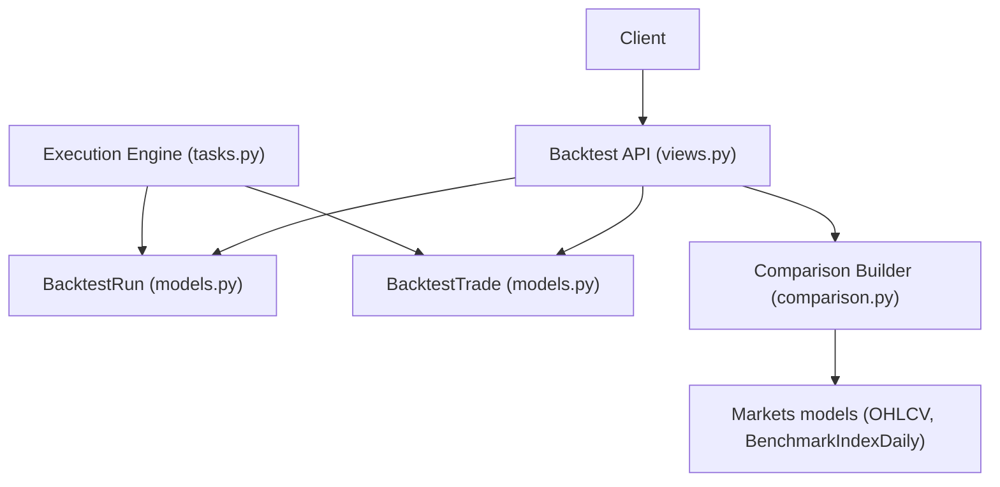
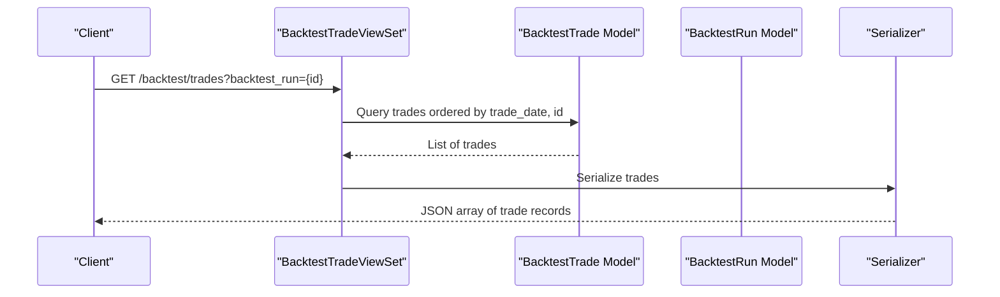
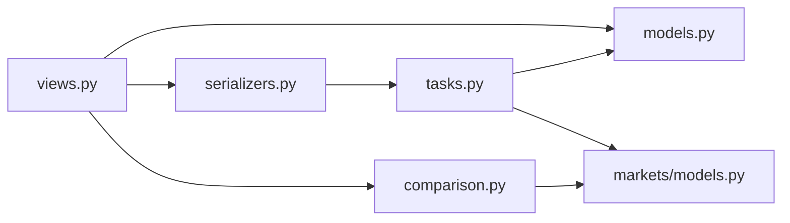

# Trade History & Analysis

<cite>
**Referenced Files in This Document**
- [views.py](file://apps/backtest/views.py)
- [models.py](file://apps/backtest/models.py)
- [serializers.py](file://apps/backtest/serializers.py)
- [comparison.py](file://apps/backtest/comparison.py)
- [tasks.py](file://apps/backtest/tasks.py)
- [models.py](file://apps/markets/models.py)
</cite>

## Table of Contents
1. [Introduction](#introduction)
2. [Project Structure](#project-structure)
3. [Core Components](#core-components)
4. [Architecture Overview](#architecture-overview)
5. [Detailed Component Analysis](#detailed-component-analysis)
6. [Dependency Analysis](#dependency-analysis)
7. [Performance Considerations](#performance-considerations)
8. [Troubleshooting Guide](#troubleshooting-guide)
9. [Conclusion](#conclusion)
10. [Appendices](#appendices)

## Introduction
This document explains the trade history and analysis endpoints for backtesting, focusing on retrieving trade execution records, understanding trade lifecycle states, tracking positions, calculating P&L, and benchmarking strategies against indices or other runs. It also provides practical guidance for analyzing trade patterns, identifying slippage issues, and optimizing strategy parameters using historical performance data.

## Project Structure
The backtest module exposes:
- A read-only viewset for trades filtered by backtest run ID
- A viewset for backtest runs with actions to manage lifecycle and retrieve trades and comparison curves
- Models that define runs and trades, including fields for fees, slippage, and P&L
- A comparison builder that constructs equity curve series normalized against benchmarks

**Diagram sources**
- [views.py:75-221](file://apps/backtest/views.py#L75-L221)
- [models.py:24-168](file://apps/backtest/models.py#L24-L168)
- [comparison.py:177-245](file://apps/backtest/comparison.py#L177-L245)
- [tasks.py:1-37](file://apps/backtest/tasks.py#L1-L37)

**Section sources**
- [views.py:75-221](file://apps/backtest/views.py#L75-L221)
- [models.py:24-168](file://apps/backtest/models.py#L24-L168)
- [comparison.py:177-245](file://apps/backtest/comparison.py#L177-L245)

## Core Components
- BacktestTradeViewSet: Read-only endpoint to list trades with optional filtering by backtest run ID. Trades are ordered by trade date and id to preserve temporal ordering within a run.
- BacktestRunViewSet: Manages backtest runs and exposes:
  - /trades action to return all trades for a run
  - /comparison_curve action to return benchmarked equity curves for the run
- Models:
  - BacktestRun: Stores configuration, status, metrics, and report data; supports lifecycle control via pending_control_action and task ownership checks
  - BacktestTrade: Records each leg (buy/sell), price, fee, slippage, amount, pnl, signal payload, and metadata
- Serializers: Validate run parameters and surface task state information for clients
- Comparison builder: Builds normalized series for selected run(s), compare target run(s), and official benchmarks (CSI 300, CSI A500)

**Section sources**
- [views.py:211-221](file://apps/backtest/views.py#L211-L221)
- [views.py:198-208](file://apps/backtest/views.py#L198-L208)
- [models.py:24-168](file://apps/backtest/models.py#L24-L168)
- [serializers.py:35-84](file://apps/backtest/serializers.py#L35-L84)
- [comparison.py:177-245](file://apps/backtest/comparison.py#L177-L245)

## Architecture Overview
The system separates concerns between API exposure, persistence, execution, and comparison:
- API layer exposes endpoints for trades and run management
- Execution engine writes trades and updates run metrics asynchronously
- Comparison builder derives equity curves and benchmarks on demand from stored reports and market index data

**Diagram sources**
- [views.py:211-221](file://apps/backtest/views.py#L211-L221)
- [models.py:120-168](file://apps/backtest/models.py#L120-L168)
- [serializers.py:35-46](file://apps/backtest/serializers.py#L35-L46)

## Detailed Component Analysis

### BacktestTradeViewSet
- Purpose: Retrieve trade execution records for one or more backtest runs
- Filtering: Supports filtering by backtest_run query parameter
- Ordering: Trades are ordered by trade_date then id to ensure deterministic temporal sequence
- Serialization: Includes asset symbol/name and core trade fields such as side, quantity, price, fee, slippage, amount, pnl, signal_payload, metadata

Key behaviors:
- Uses select_related to efficiently load asset and backtest_run
- Applies pagination through default DRF behavior if configured elsewhere

**Section sources**
- [views.py:211-221](file://apps/backtest/views.py#L211-L221)
- [serializers.py:35-46](file://apps/backtest/serializers.py#L35-L46)

### BacktestRunViewSet
- Lifecycle actions: pause, resume, restart, rerun, delete
- Trades action: Returns all trades for a run, preloaded with assets
- Comparison curve action: Returns normalized equity curves for the run, optional compare target, extra compare runs, and benchmarks

Important notes:
- Lifecycle transitions are intent-based; a RUNNING run may have a pending control action until the worker applies it at chunk boundaries
- Task health detection helps distinguish genuinely running tasks from stale owners

**Section sources**
- [views.py:75-208](file://apps/backtest/views.py#L75-L208)

### Models: BacktestRun and BacktestTrade
- BacktestRun:
  - Strategy type and status track execution state
  - Metrics include total_return, annualized_return, max_drawdown, sharpe_ratio, win_rate, total_trades, winning_trades
  - Report stores equity curve and runtime state for resumable chunked execution
- BacktestTrade:
  - Each row is a single leg (BUY or SELL); closed positions produce paired legs
  - Fields capture price, fee, slippage, amount, pnl, signal_payload, metadata
  - Indexes optimize queries by run+date and asset+date

Lifecycle states:
- PENDING -> RUNNING -> COMPLETED or FAILED
- PAUSED reachable from RUNNING via intent-based control

Temporal ordering:
- Trades are ordered by trade_date and id to maintain chronological execution order within a run

Asset associations:
- Each trade links to an Asset via foreign key; serializers expose symbol and name for readability

**Section sources**
- [models.py:24-118](file://apps/backtest/models.py#L24-L118)
- [models.py:120-168](file://apps/backtest/models.py#L120-L168)

### Comparison Curve Endpoint
- Purpose: Provide benchmarked equity curves for a completed run
- Series included:
  - Selected run’s equity curve
  - Optional compare target run (if specified and completed)
  - Additional compare runs via query parameters
  - Official benchmarks: CSI 300 and CSI A500
- Normalization: All series are scaled to a common baseline value derived from the selected run’s first point
- Drawdown: Per-point drawdown computed from peak values

Workflow:
- If run not completed, returns message indicating unavailability
- Otherwise builds series points with date, value, and drawdown
- Adds available_series_keys for client-side selection

**Section sources**
- [views.py:204-208](file://apps/backtest/views.py#L204-L208)
- [comparison.py:177-245](file://apps/backtest/comparison.py#L177-L245)

### Execution Engine and Position Tracking
- Chunked execution: Runs process fixed trading-day chunks and persist progress in report.runtime_state
- Position lifecycle:
  - Positions open on buy legs and close on sell legs
  - Exits prefer conservative outcomes; stop-loss takes priority over target when both trigger on the same bar
  - Missing or non-positive close prices keep positions open for retry later
- Fees and slippage:
  - Asymmetric fees apply (e.g., stamp duty on sells only)
  - Slippage modeled via bps parameter and recorded per trade
- P&L calculation:
  - Closed position PnL recorded per sell leg
  - Equity curve updated per trading day based on portfolio valuation
  - Metrics like total_return, annualized_return, max_drawdown, sharpe_ratio, win_rate computed and stored on the run

Trade ledger semantics:
- Rows are legs, not round trips; total_trades counts closed positions
- signal_payload captures why entries occurred (candidate rank, threshold pass/fail, decision levels, model provenance)
- metadata includes exit reasons and other contextual info

**Section sources**
- [tasks.py:1-37](file://apps/backtest/tasks.py#L1-L37)
- [tasks.py:2364-2392](file://apps/backtest/tasks.py#L2364-L2392)
- [models.py:120-168](file://apps/backtest/models.py#L120-L168)

## Dependency Analysis
- Views depend on models for querying and serializing data
- Comparison builder depends on markets models for OHLCV dates and benchmark index daily series
- Execution engine depends on prediction modules, factor scores, macro context, and market data to generate candidates and execute trades
- Serializers validate run parameters and enrich responses with task state

**Diagram sources**
- [views.py:75-221](file://apps/backtest/views.py#L75-L221)
- [comparison.py:177-245](file://apps/backtest/comparison.py#L177-L245)
- [tasks.py:1-37](file://apps/backtest/tasks.py#L1-L37)
- [models.py:24-168](file://apps/backtest/models.py#L24-L168)
- [models.py:147-226](file://apps/markets/models.py#L147-L226)

**Section sources**
- [views.py:75-221](file://apps/backtest/views.py#L75-L221)
- [comparison.py:177-245](file://apps/backtest/comparison.py#L177-L245)
- [tasks.py:1-37](file://apps/backtest/tasks.py#L1-L37)
- [models.py:24-168](file://apps/backtest/models.py#L24-L168)
- [models.py:147-226](file://apps/markets/models.py#L147-L226)

## Performance Considerations
- Use select_related in views to reduce N+1 queries when loading asset and backtest_run
- Filter trades by backtest_run to limit result sets and improve response times
- Leverage indexes on trade_date and backtest_run for efficient range queries
- For comparison curves, rely on on-demand computation against stored equity curves and benchmark series; ensure benchmark data is up to date
- Execution engine uses bounded caches for trading dates, price maps, and matrix signals; clear caches between unrelated batches to control memory usage

[No sources needed since this section provides general guidance]

## Troubleshooting Guide
Common issues and resolutions:
- No comparison curves: Ensure the run status is COMPLETED and equity curve exists in report
- Stale task owner: API surfaces has_stale_task_owner; use pause/resume/restart actions to recover
- Missing trades: Verify run completed successfully and trades were written; check error_message on the run
- Inconsistent ordering: Trades are ordered by trade_date and id; if anomalies appear, inspect underlying data integrity

Operational tips:
- Use /trades action to quickly audit a run’s full trade ledger
- Use /comparison_curve to validate strategy performance against benchmarks and compare runs
- Inspect signal_payload and metadata to understand entry/exit rationale and identify slippage or fee impacts

**Section sources**
- [views.py:198-208](file://apps/backtest/views.py#L198-L208)
- [comparison.py:177-245](file://apps/backtest/comparison.py#L177-L245)
- [models.py:24-118](file://apps/backtest/models.py#L24-L118)

## Conclusion
The backtest module provides robust endpoints for retrieving trade histories and analyzing strategy performance. Trades are persisted as granular legs with rich metadata, enabling detailed post-trade analysis. The comparison curve endpoint normalizes equity curves against benchmarks and optional compare runs, facilitating strategy evaluation. Execution logic ensures conservative exits, accurate fee modeling, and resilient chunked processing. By leveraging these endpoints and understanding the underlying mechanics, users can analyze trade patterns, diagnose slippage issues, and optimize parameters based on historical performance.

[No sources needed since this section summarizes without analyzing specific files]

## Appendices

### API Usage Examples

- Retrieve trades for a specific backtest run:
  - GET /backtest/trades?backtest_run={run_id}
  - Returns paginated list of trades ordered by trade_date and id

- Retrieve trades for a run via run detail:
  - GET /backtest/{run_id}/trades
  - Returns serialized trades for the run

- Compare strategy against benchmarks:
  - GET /backtest/{run_id}/comparison_curve
  - Optionally add extra_compare_run_ids to include additional runs

- Analyze trade patterns:
  - Filter trades by asset or date ranges using client-side aggregation
  - Inspect signal_payload for candidate mode, thresholds, and model provenance
  - Review metadata for exit reasons and contextual flags

- Identify slippage issues:
  - Compare slippage field across trades to detect outliers
  - Correlate high slippage with low liquidity periods using OHLCV volume and amount

- Optimize strategy parameters:
  - Use comparison_curve to evaluate parameter changes against benchmarks
  - Adjust holding_period_days, capital_fraction_per_entry, max_positions, and thresholds based on observed performance
  - Re-run backtests with updated parameters and compare results

[No sources needed since this section provides general guidance]