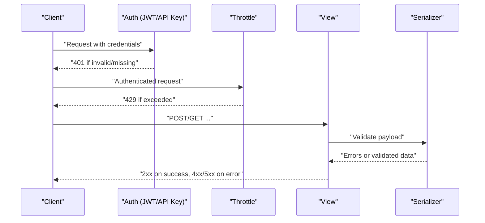
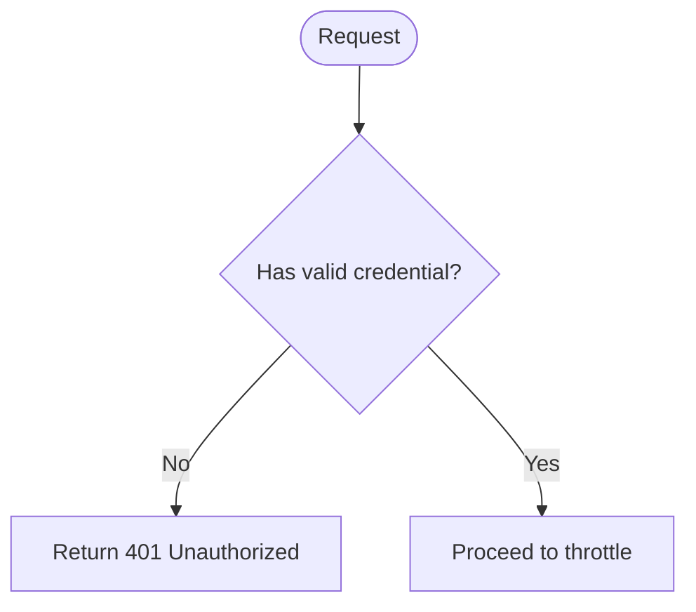
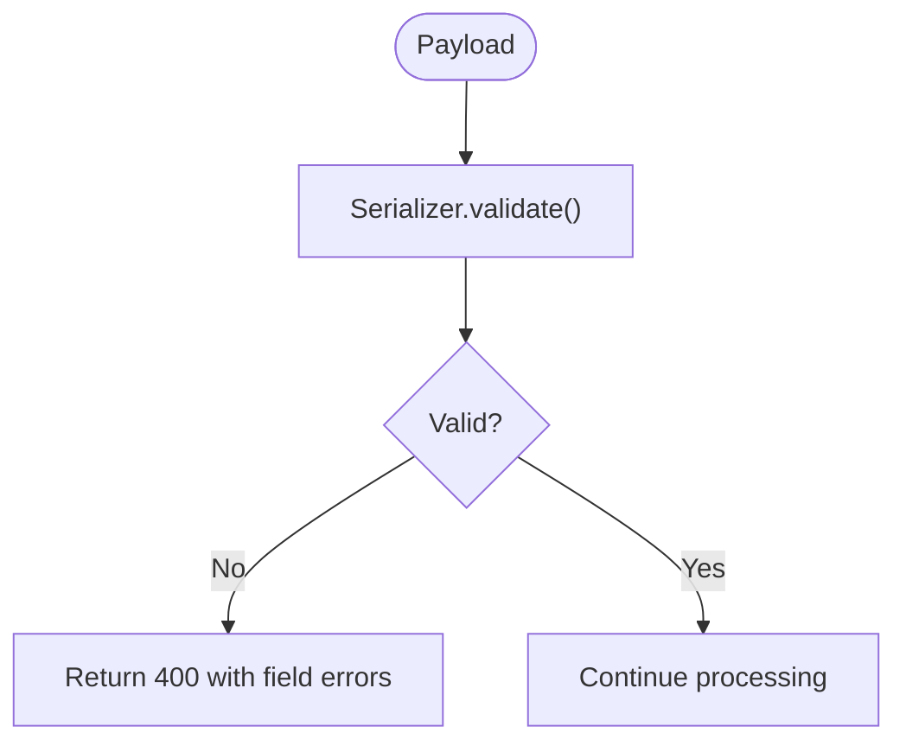
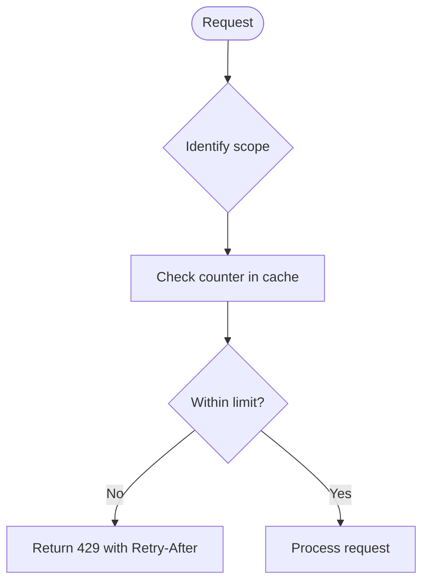
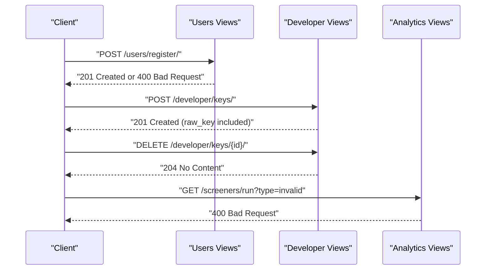
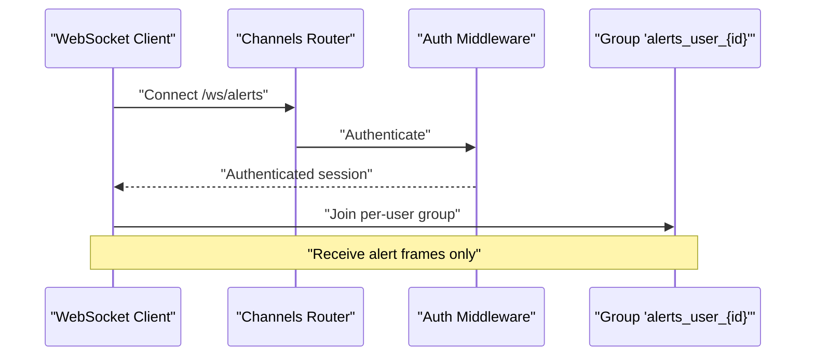
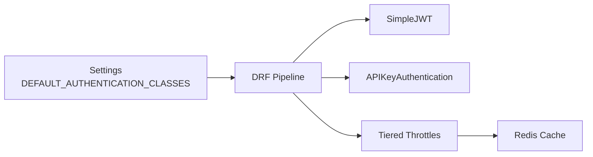

# Error Handling & Status Codes

<cite>
**Referenced Files in This Document**
- [api.md](file://docs/reference/api.md)
- [base.py](file://config/settings/base.py)
- [authentication.py](file://apps/developer/authentication.py)
- [throttling.py](file://apps/core/throttling.py)
- [views.py (users)](file://apps/users/views.py)
- [views.py (developer)](file://apps/developer/views.py)
- [views.py (analytics)](file://apps/analytics/views.py)
- [serializers.py (users)](file://apps/users/serializers.py)
- [serializers.py (backtest)](file://apps/backtest/serializers.py)
- [api.test.ts](file://frontend/src/lib/api.test.ts)
- [AlertCenterPage.tsx](file://frontend/src/pages/AlertCenterPage.tsx)
- [routing.py](file://config/routing.py)
</cite>

## Table of Contents
1. Introduction
2. Project Structure
3. Core Components
4. Architecture Overview
5. Detailed Component Analysis
6. Dependency Analysis
7. Performance Considerations
8. Troubleshooting Guide
9. Conclusion
10. Appendices

## Introduction
This document standardizes error response formats, HTTP status codes, and error handling patterns across all API endpoints. It covers authentication failures, validation errors, throttling responses, and server errors. It also provides client-side guidance for handling these errors and debugging techniques to diagnose issues quickly.

## Project Structure
Error handling spans several layers:
- Authentication: JWT via SimpleJWT and a custom API key authenticator.
- Validation: DRF serializers raise field-level or non-field errors.
- Throttling: Tier-based rate limits enforced by DRF throttles.
- Views: Endpoints return consistent success/error responses.
- Frontend: Client library handles 401 refresh flows and surfaces user-friendly messages.

```mermaid
graph TB
Client["Client"] --> DRF["Django REST Framework"]
DRF --> Auth["Authentication<br/>JWT + API Key"]
DRF --> Throttle["Throttling<br/>Tier-based"]
DRF --> Views["Views / ViewSets"]
Views --> Serializers["Serializers<br/>Validation"]
Views --> DB["Database"]
Client <-- DRF
```

**Diagram sources**
- [base.py:354-388](file://config/settings/base.py#L354-L388)
- [authentication.py:10-53](file://apps/developer/authentication.py#L10-L53)
- [throttling.py:1-88](file://apps/core/throttling.py#L1-L88)
- [views.py (users):44-157](file://apps/users/views.py#L44-L157)
- [views.py (developer):13-83](file://apps/developer/views.py#L13-L83)
- [views.py (analytics):773-782](file://apps/analytics/views.py#L773-L782)

**Section sources**
- [base.py:354-388](file://config/settings/base.py#L354-L388)
- [api.md:34-46](file://docs/reference/api.md#L34-L46)

## Core Components
- Authentication
  - JWT Bearer tokens via SimpleJWT views wrapped with dedicated throttling.
  - API key authentication via a custom authenticator that validates active, non-expired keys.
- Validation
  - Serializer-level validation raises structured field errors; some endpoints perform explicit parameter checks.
- Throttling
  - Tier-based throttles enforce per-day limits; exceeding limits returns 429 with Retry-After.
- Responses
  - Success responses use appropriate 2xx codes; errors use 4xx/5xx with JSON bodies.

**Section sources**
- [views.py (users):32-41](file://apps/users/views.py#L32-L41)
- [authentication.py:10-53](file://apps/developer/authentication.py#L10-L53)
- [throttling.py:17-88](file://apps/core/throttling.py#L17-L88)
- [api.md:302-325](file://docs/reference/api.md#L302-L325)

## Architecture Overview
The request lifecycle for error scenarios:
- Request arrives at DRF.
- Authentication is attempted (JWT first, then API key).
- Throttling is checked against the caller’s tier or IP.
- View processes input; serializer validates fields.
- Errors are returned as standardized JSON with appropriate status codes.



**Diagram sources**
- [views.py (users):32-41](file://apps/users/views.py#L32-L41)
- [authentication.py:24-49](file://apps/developer/authentication.py#L24-L49)
- [throttling.py:17-88](file://apps/core/throttling.py#L17-L88)
- [views.py (users):51-71](file://apps/users/views.py#L51-L71)
- [views.py (developer):39-54](file://apps/developer/views.py#L39-L54)
- [views.py (analytics):773-782](file://apps/analytics/views.py#L773-L782)

## Detailed Component Analysis

### Authentication Failures
- Missing or invalid JWT:
  - The default permission policy allows read-only access unless a view requires authentication. When credentials are missing or invalid on protected endpoints, DRF returns 401.
- Invalid or expired API key:
  - The custom API key authenticator raises an authentication failure when the key is not found, inactive, or expired.
- Token rotation and refresh:
  - Refresh endpoints are throttled separately to protect login traffic. Clients should handle 401 by refreshing tokens and retrying once.



**Diagram sources**
- [authentication.py:24-49](file://apps/developer/authentication.py#L24-L49)
- [api.md:34-46](file://docs/reference/api.md#L34-L46)

**Section sources**
- [authentication.py:24-49](file://apps/developer/authentication.py#L24-L49)
- [api.md:34-46](file://docs/reference/api.md#L34-L46)

### Validation Errors
- Field-level validation errors are raised by serializers and returned as a mapping of field names to lists of messages.
- Some endpoints validate complex parameters and return structured errors under specific keys (for example, backtest parameters).



**Diagram sources**
- [serializers.py (users):73-84](file://apps/users/serializers.py#L73-L84)
- [serializers.py (backtest):90-187](file://apps/backtest/serializers.py#L90-L187)
- [api.md:315-322](file://docs/reference/api.md#L315-L322)

**Section sources**
- [serializers.py (users):73-84](file://apps/users/serializers.py#L73-L84)
- [serializers.py (backtest):90-187](file://apps/backtest/serializers.py#L90-L187)
- [api.md:315-322](file://docs/reference/api.md#L315-L322)

### Rate Limiting (Throttling)
- Tier-based throttles apply daily limits based on subscription tier or anonymous IP.
- Exceeding limits returns 429 with a Retry-After header and a JSON detail message.



**Diagram sources**
- [throttling.py:17-88](file://apps/core/throttling.py#L17-L88)
- [api.md:188-221](file://docs/reference/api.md#L188-L221)

**Section sources**
- [throttling.py:17-88](file://apps/core/throttling.py#L17-L88)
- [api.md:188-221](file://docs/reference/api.md#L188-L221)

### Endpoint-Specific Error Patterns
- User registration and account flows:
  - Returns 201 on successful creation; 400 on validation failures.
- Developer API keys:
  - Creation returns 201 with the raw key once; revocation returns 204; using a revoked/expired key returns 401.
- Analytics screener:
  - Explicitly returns 400 for unsupported screener types.



**Diagram sources**
- [views.py (users):44-71](file://apps/users/views.py#L44-L71)
- [views.py (developer):39-61](file://apps/developer/views.py#L39-L61)
- [views.py (analytics):773-782](file://apps/analytics/views.py#L773-L782)

**Section sources**
- [views.py (users):44-71](file://apps/users/views.py#L44-L71)
- [views.py (developer):39-61](file://apps/developer/views.py#L39-L61)
- [views.py (analytics):773-782](file://apps/analytics/views.py#L773-L782)

### WebSocket Alerts
- WebSocket connections are routed through Channels with authentication middleware.
- Alert events are pushed to a per-user group; clients receive frames without sending requests.



**Diagram sources**
- [routing.py:1-13](file://config/routing.py#L1-L13)
- [api.md:276-299](file://docs/reference/api.md#L276-L299)

**Section sources**
- [routing.py:1-13](file://config/routing.py#L1-L13)
- [api.md:276-299](file://docs/reference/api.md#L276-L299)

## Dependency Analysis
- Authentication classes are registered globally; order matters (JWT first, then API key).
- Throttling depends on user profile tier; anonymous requests are keyed by IP.
- Views rely on serializers for validation; explicit parameter checks may occur in views.
- Frontend tests demonstrate expected 401 behavior during token refresh flows.



**Diagram sources**
- [base.py:354-388](file://config/settings/base.py#L354-L388)
- [throttling.py:17-88](file://apps/core/throttling.py#L17-L88)
- [api.md:188-221](file://docs/reference/api.md#L188-L221)

**Section sources**
- [base.py:354-388](file://config/settings/base.py#L354-L388)
- [api.md:188-221](file://docs/reference/api.md#L188-L221)

## Performance Considerations
- Throttling counters are stored in Redis; misconfiguration can cause widespread failures (e.g., authentication errors in Redis break throttling and caching).
- Response caching reduces load on read endpoints but may serve stale data within TTL windows.
- Large datasets require pagination; requesting excessive page sizes is clamped to prevent performance degradation.

[No sources needed since this section provides general guidance]

## Troubleshooting Guide
Common error scenarios and how to debug them:
- 401 Unauthorized
  - Causes: Missing/invalid JWT or API key; revoked/expired key; unauthenticated access to protected endpoint.
  - Debug steps: Verify headers; check token validity; ensure API key is active and not expired; confirm permissions.
  - Client behavior: On 401, attempt refresh flow and retry once; clear dead tokens while preserving API keys.
- 400 Bad Request
  - Causes: Validation errors in payload; unsupported parameters.
  - Debug steps: Inspect field-specific error messages; ensure required fields are present and correctly typed.
- 403 Forbidden
  - Causes: Authenticated but insufficient permissions.
  - Debug steps: Confirm user role and view permissions.
- 404 Not Found
  - Causes: Unknown primary key or route.
  - Debug steps: Verify resource existence and URL path.
- 429 Too Many Requests
  - Causes: Exceeded tier-based rate limit.
  - Debug steps: Respect Retry-After; reduce request rate; verify Redis connectivity and credentials.
- 500 Internal Server Error
  - Causes: Unhandled exceptions in views or downstream services.
  - Debug steps: Check server logs; reproduce with minimal payload; isolate failing dependencies.

Frontend error handling examples:
- Token refresh flow: Tests show handling 401 with a refresh response and updating persisted tokens.
- User-facing errors: Pages surface localized messages when auth is missing or API calls fail.

**Section sources**
- [api.md:302-325](file://docs/reference/api.md#L302-L325)
- [api.md:188-221](file://docs/reference/api.md#L188-L221)
- [api.test.ts:44-104](file://frontend/src/lib/api.test.ts#L44-L104)
- [AlertCenterPage.tsx:12-25](file://frontend/src/pages/AlertCenterPage.tsx#L12-L25)

## Conclusion
The API uses consistent, standards-compliant error handling:
- 400 for validation errors with field-specific messages.
- 401 for authentication failures.
- 403 for authorization failures.
- 404 for missing resources.
- 429 for throttling with Retry-After.
- 500 for unexpected server errors.
Clients should implement robust error handling, including token refresh on 401, respecting rate limits, and presenting meaningful feedback to users.

[No sources needed since this section summarizes without analyzing specific files]

## Appendices

### Standardized Error Response Formats
- Validation errors (400):
  - Body maps field names to lists of messages.
- Throttling (429):
  - Includes Retry-After header and a JSON detail message.
- Authentication (401):
  - Indicates missing or invalid credentials.

**Section sources**
- [api.md:302-325](file://docs/reference/api.md#L302-L325)
- [api.md:188-221](file://docs/reference/api.md#L188-L221)

### Client Best Practices
- Always paginate list endpoints and respect maximum page sizes.
- Handle 401 by refreshing tokens and retrying once; clear dead tokens after failed refresh.
- Respect Retry-After on 429 and back off accordingly.
- Surface user-friendly messages for network and server errors.

**Section sources**
- [api.md:136-164](file://docs/reference/api.md#L136-L164)
- [api.test.ts:44-104](file://frontend/src/lib/api.test.ts#L44-L104)