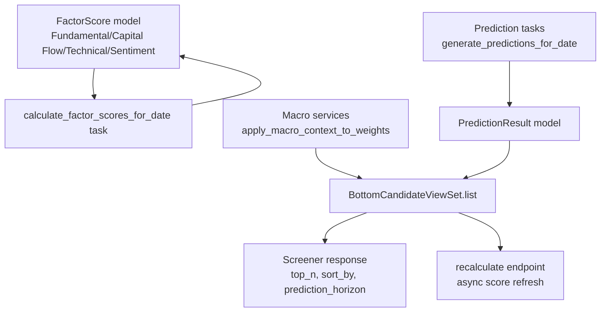
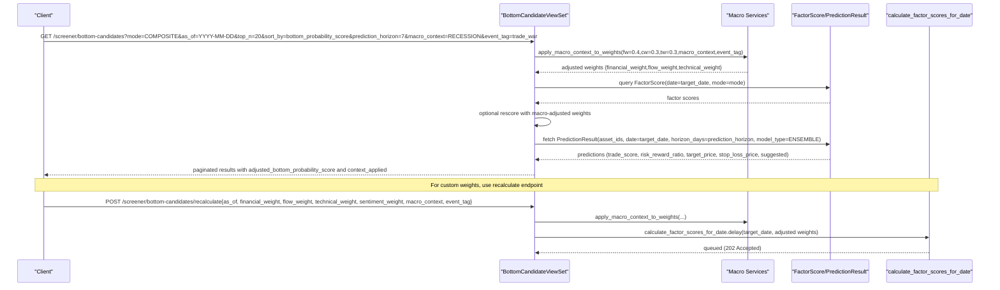
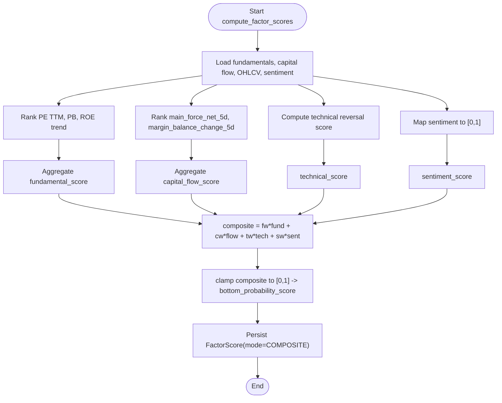
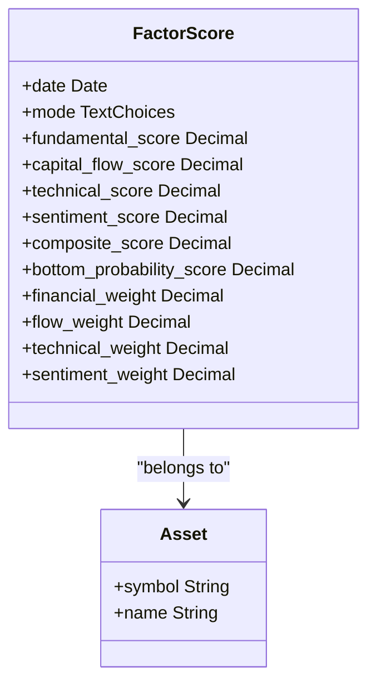
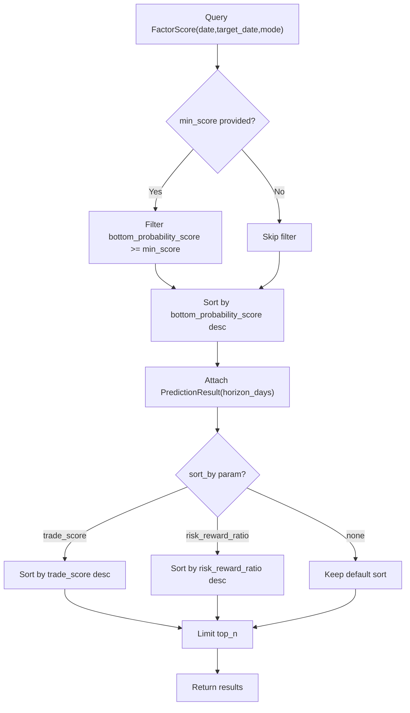
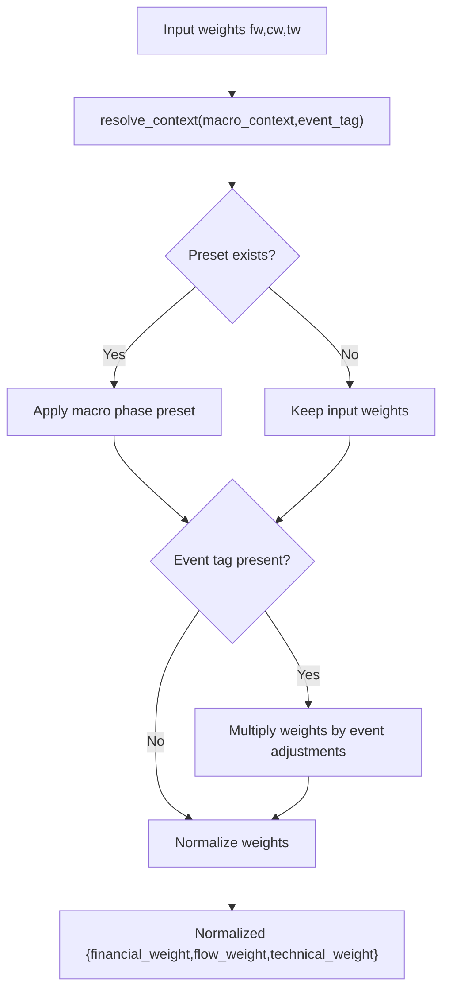
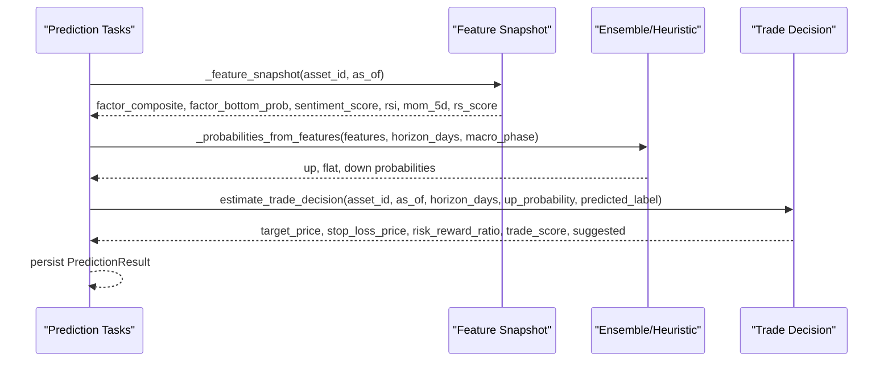
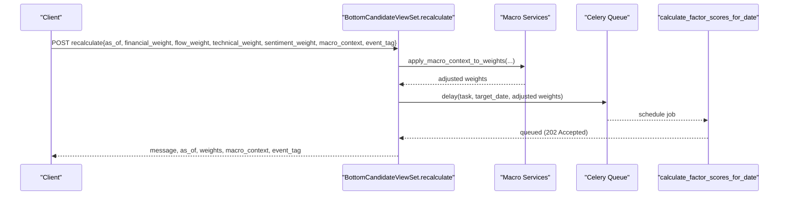
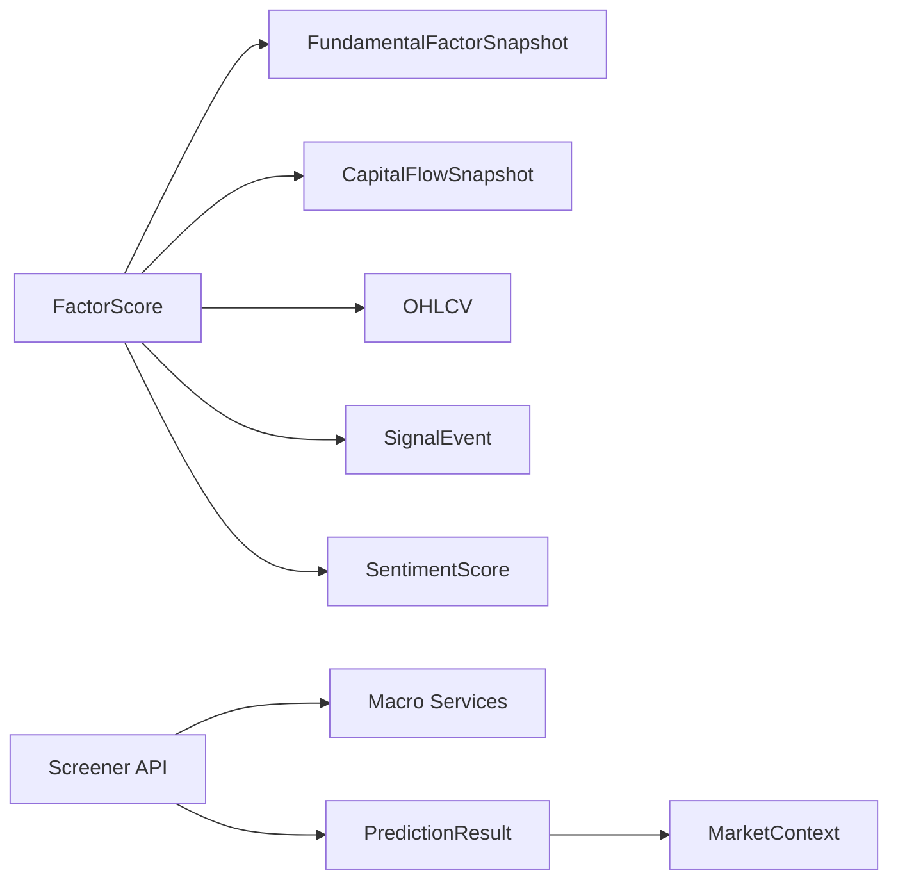

# Bottom Candidates Screening

<cite>
**Referenced Files in This Document**
- [views.py](file://apps/factors/views.py)
- [tasks.py](file://apps/factors/tasks.py)
- [models.py](file://apps/factors/models.py)
- [serializers.py](file://apps/factors/serializers.py)
- [services.py](file://apps/macro/services.py)
- [tasks.py](file://apps/prediction/tasks.py)
- [models.py](file://apps/prediction/models.py)
- [odds.py](file://apps/prediction/odds.py)
- [tests.py](file://apps/factors/tests.py)
- [tests.py](file://apps/backtest/tests.py)
</cite>

## Table of Contents
1. [Introduction](#introduction)
2. [Project Structure](#project-structure)
3. [Core Components](#core-components)
4. [Architecture Overview](#architecture-overview)
5. [Detailed Component Analysis](#detailed-component-analysis)
6. [Dependency Analysis](#dependency-analysis)
7. [Performance Considerations](#performance-considerations)
8. [Troubleshooting Guide](#troubleshooting-guide)
9. [Conclusion](#conclusion)
10. [Appendices](#appendices)

## Introduction
This document explains the bottom candidate screening functionality that identifies undervalued stocks with high recovery potential. It covers:
- The multi-factor scoring system combining fundamentals, capital flow, technical reversal signals, and sentiment.
- Parameter specifications for mode selection (composite, technical, fundamental), time windows, ranking criteria, and filtering.
- Macro context adjustment to tune weights based on market phase and event tags.
- Prediction horizon analysis integrated into the screener output.
- The recalculate endpoint for custom weight configurations and its asynchronous processing workflow.

## Project Structure
The bottom candidates feature spans several modules:
- Factors module: computes factor scores and exposes the screener API.
- Macro module: provides macro-phase-based weight presets and event adjustments.
- Prediction module: generates prediction horizons and trade decisions used by the screener.
- Models and serializers: define data structures and API payloads.

**Diagram sources**
- [models.py:124-176](file://apps/factors/models.py#L124-L176)
- [tasks.py:283-461](file://apps/factors/tasks.py#L283-L461)
- [services.py:62-89](file://apps/macro/services.py#L62-L89)
- [views.py:45-218](file://apps/factors/views.py#L45-L218)
- [tasks.py:177-200](file://apps/prediction/tasks.py#L177-L200)
- [models.py:43-97](file://apps/prediction/models.py#L43-L97)

**Section sources**
- [views.py:45-218](file://apps/factors/views.py#L45-L218)
- [tasks.py:283-461](file://apps/factors/tasks.py#L283-L461)
- [services.py:62-89](file://apps/macro/services.py#L62-L89)
- [tasks.py:177-200](file://apps/prediction/tasks.py#L177-L200)
- [models.py:124-176](file://apps/factors/models.py#L124-L176)
- [models.py:43-97](file://apps/prediction/models.py#L43-L97)

## Core Components
- FactorScore model stores per-asset daily scores across modes (technical, fundamental, composite) and aggregates (fundamental_score, capital_flow_score, technical_score, composite_score, bottom_probability_score).
- calculate_factor_scores_for_date task computes component scores and composite/bottom probability using normalized weights and point-in-time universe coverage.
- BottomCandidateViewSet exposes:
  - GET /api/v1/screener/bottom-candidates/: list with mode, as_of, min_score, top_n, sort_by, prediction_horizon, macro_context, event_tag.
  - POST /api/v1/screener/bottom-candidates/recalculate/: queue async recalculation with custom weights and macro context.
- Macro services adjust weights via CONTEXT_WEIGHT_PRESETS and EVENT_ADJUSTMENTS, normalizing them for consistent scoring.
- Prediction results provide horizon-specific probabilities, trade scores, target/stop-loss prices, and suggested flags.

**Section sources**
- [models.py:124-176](file://apps/factors/models.py#L124-L176)
- [tasks.py:283-461](file://apps/factors/tasks.py#L283-L461)
- [views.py:45-218](file://apps/factors/views.py#L45-L218)
- [services.py:62-89](file://apps/macro/services.py#L62-L89)
- [models.py:43-97](file://apps/prediction/models.py#L43-L97)

## Architecture Overview
The screener pipeline integrates multiple data sources and models:

**Diagram sources**
- [views.py:81-218](file://apps/factors/views.py#L81-L218)
- [services.py:62-89](file://apps/macro/services.py#L62-L89)
- [tasks.py:283-461](file://apps/factors/tasks.py#L283-L461)
- [models.py:124-176](file://apps/factors/models.py#L124-L176)
- [models.py:43-97](file://apps/prediction/models.py#L43-L97)

## Detailed Component Analysis

### Multi-Factor Scoring System
- Fundamental Score: derived from PE TTM and PB percentile ranks (lower is better) and ROE trend; averaged across available components.
- Capital Flow Score: derived from main force net flow and margin balance change; ranked within the asset universe.
- Technical Score: technical reversal score built from RSI oversold conditions, proximity to Bollinger Bands lower band, and volume confirmation or oversold combination signals.
- Sentiment Score: mapped from [-1,1] to [0,1] using latest 7-day sentiment.
- Composite Score: weighted sum of fundamental, capital flow, technical, and sentiment scores; normalized weights are enforced.
- Bottom Probability Score: clamped composite score in [0,1], representing recovery likelihood.

**Diagram sources**
- [tasks.py:283-461](file://apps/factors/tasks.py#L283-L461)
- [tasks.py:124-239](file://apps/factors/tasks.py#L124-L239)
- [tasks.py:241-254](file://apps/factors/tasks.py#L241-L254)

**Section sources**
- [tasks.py:283-461](file://apps/factors/tasks.py#L283-L461)
- [tasks.py:124-239](file://apps/factors/tasks.py#L124-L239)
- [tasks.py:241-254](file://apps/factors/tasks.py#L241-L254)

### Mode Selection and Time Windows
- Mode parameter supports COMPOSITE, TECHNICAL, FUNDAMENTAL. Defaults to COMPOSITE if invalid.
- Time window:
  - as_of selects a specific date; defaults to latest available date for the chosen mode.
  - Point-in-time union ensures assets are tradeable at the selected date.
  - Lookback windows for technical indicators:
    - RSI uses 14-period window with lookback rows computed from RSI_TIMEPERIOD.
    - Bollinger Bands use 20-period window with lookback rows computed from BBANDS_TIMEPERIOD.
    - Volume confirmation uses last 21 sessions.

**Diagram sources**
- [models.py:124-176](file://apps/factors/models.py#L124-L176)

**Section sources**
- [views.py:54-79](file://apps/factors/views.py#L54-L79)
- [tasks.py:22-28](file://apps/factors/tasks.py#L22-L28)
- [tasks.py:101-122](file://apps/factors/tasks.py#L101-L122)

### Ranking Criteria and Filtering
- Default ranking: bottom_probability_score descending, then symbol ascending.
- Optional sorting:
  - sort_by=trade_score: sorts by predicted trade score when available.
  - sort_by=risk_reward_ratio: sorts by risk-reward ratio when available.
- Filtering:
  - min_score filters by bottom_probability_score threshold.
  - top_n limits results (clamped between 1 and 200).
  - prediction_horizon selects prediction results for 3, 7, or 30 days.

**Diagram sources**
- [views.py:81-176](file://apps/factors/views.py#L81-L176)

**Section sources**
- [views.py:81-176](file://apps/factors/views.py#L81-L176)

### Macro Context Adjustment
- Weight presets per macro phase:
  - RECOVERY: higher flow weight emphasis.
  - OVERHEAT: higher technical weight emphasis.
  - STAGFLATION: higher financial weight emphasis.
  - RECESSION: highest financial weight emphasis.
- Event tag multipliers:
  - trade_war: increases financial and technical weights, decreases flow.
  - rate_cut_cycle: increases flow weight, neutral technical.
- Weights are normalized after applying presets and event adjustments.

**Diagram sources**
- [services.py:62-89](file://apps/macro/services.py#L62-L89)

**Section sources**
- [services.py:62-89](file://apps/macro/services.py#L62-L89)

### Prediction Horizon Analysis
- Prediction results include up/flat/down probabilities, confidence, predicted label, target price, stop loss price, risk-reward ratio, trade score, and suggested flag.
- Probabilities incorporate momentum, sentiment, relative strength, and factor signals, scaled by horizon and adjusted by macro phase.
- Trade decision estimates reward/risk and suggests trades when thresholds are met.

**Diagram sources**
- [tasks.py:55-112](file://apps/prediction/tasks.py#L55-L112)
- [odds.py:138-158](file://apps/prediction/odds.py#L138-L158)
- [models.py:43-97](file://apps/prediction/models.py#L43-L97)

**Section sources**
- [tasks.py:55-112](file://apps/prediction/tasks.py#L55-L112)
- [odds.py:138-158](file://apps/prediction/odds.py#L138-L158)
- [models.py:43-97](file://apps/prediction/models.py#L43-L97)

### Recalculate Endpoint and Asynchronous Processing
- Endpoint: POST /api/v1/screener/bottom-candidates/recalculate
- Parameters:
  - as_of: target date for recalculation.
  - financial_weight, flow_weight, technical_weight, sentiment_weight: custom weights.
  - macro_context, event_tag: optional macro adjustments applied before normalization.
- Workflow:
  - Weights are adjusted via macro context and normalized.
  - calculate_factor_scores_for_date is dispatched asynchronously via Celery.
  - Response returns 202 Accepted with queued status, weights, and context.

**Diagram sources**
- [views.py:178-218](file://apps/factors/views.py#L178-L218)
- [services.py:62-89](file://apps/macro/services.py#L62-L89)
- [tasks.py:283-461](file://apps/factors/tasks.py#L283-L461)

**Section sources**
- [views.py:178-218](file://apps/factors/views.py#L178-L218)
- [services.py:62-89](file://apps/macro/services.py#L62-L89)
- [tasks.py:283-461](file://apps/factors/tasks.py#L283-L461)

## Dependency Analysis
- FactorScore depends on:
  - FundamentalFactorSnapshot and CapitalFlowSnapshot for raw inputs.
  - OHLCV and SignalEvent for technical reversal scoring.
  - SentimentScore for sentiment factor.
- Screener depends on:
  - Macro services for weight adjustments.
  - PredictionResult for horizon-specific metrics.
- Prediction tasks depend on:
  - FactorScore and SentimentScore for features.
  - MarketContext for macro phase adjustments.

**Diagram sources**
- [models.py:124-176](file://apps/factors/models.py#L124-L176)
- [tasks.py:283-461](file://apps/factors/tasks.py#L283-L461)
- [services.py:62-89](file://apps/macro/services.py#L62-L89)
- [models.py:43-97](file://apps/prediction/models.py#L43-L97)

**Section sources**
- [models.py:124-176](file://apps/factors/models.py#L124-L176)
- [tasks.py:283-461](file://apps/factors/tasks.py#L283-L461)
- [services.py:62-89](file://apps/macro/services.py#L62-L89)
- [models.py:43-97](file://apps/prediction/models.py#L43-L97)

## Performance Considerations
- Batch creation of FactorScore records improves throughput during recalculations.
- Point-in-time union ensures only tradeable assets are scored, reducing noise.
- Lookback windows for technical indicators are bounded to avoid excessive queries.
- Sorting and limiting results minimize payload size and client load.

[No sources needed since this section provides general guidance]

## Troubleshooting Guide
- Invalid mode parameter: defaults to COMPOSITE.
- Missing as_of: uses latest available date for the mode.
- Invalid min_score or top_n: ignored or defaulted safely.
- No predictions found: fields like trade_score and risk_reward_ratio will be null; sorting by these fields prioritizes non-null entries.
- Macro context not set: weights remain unadjusted unless explicitly provided.

**Section sources**
- [views.py:54-92](file://apps/factors/views.py#L54-L92)
- [views.py:145-176](file://apps/factors/views.py#L145-L176)

## Conclusion
The bottom candidate screening system combines fundamentals, capital flows, technical reversals, and sentiment into a robust multi-factor score. It supports flexible mode selection, time-window targeting, macro-aware weight adjustments, and horizon-specific predictions. The recalculate endpoint enables custom weight experimentation with asynchronous processing, ensuring scalability and responsiveness.

[No sources needed since this section summarizes without analyzing specific files]

## Appendices

### API Parameters Summary
- GET /api/v1/screener/bottom-candidates/:
  - mode: COMPOSITE | TECHNICAL | FUNDAMENTAL (default COMPOSITE)
  - as_of: YYYY-MM-DD (defaults to latest)
  - min_score: float threshold for bottom_probability_score
  - top_n: integer 1..200 (default 20)
  - sort_by: bottom_probability_score | trade_score | risk_reward_ratio
  - prediction_horizon: 3 | 7 | 30 (default 7)
  - macro_context: string (e.g., RECESSION, RECOVERY)
  - event_tag: string (e.g., trade_war, rate_cut_cycle)
- POST /api/v1/screener/bottom-candidates/recalculate:
  - as_of: YYYY-MM-DD
  - financial_weight: float (default 0.4)
  - flow_weight: float (default 0.3)
  - technical_weight: float (default 0.3)
  - sentiment_weight: float (default 0.0)
  - macro_context: string
  - event_tag: string

**Section sources**
- [views.py:54-92](file://apps/factors/views.py#L54-L92)
- [views.py:178-218](file://apps/factors/views.py#L178-L218)