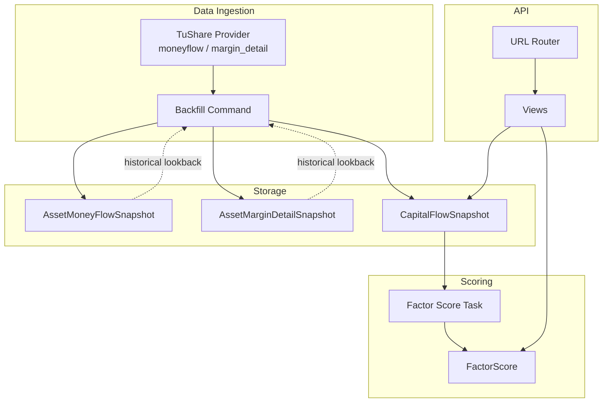
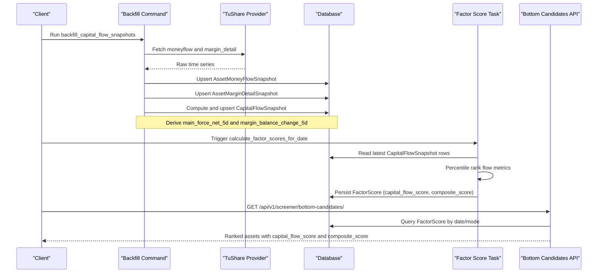
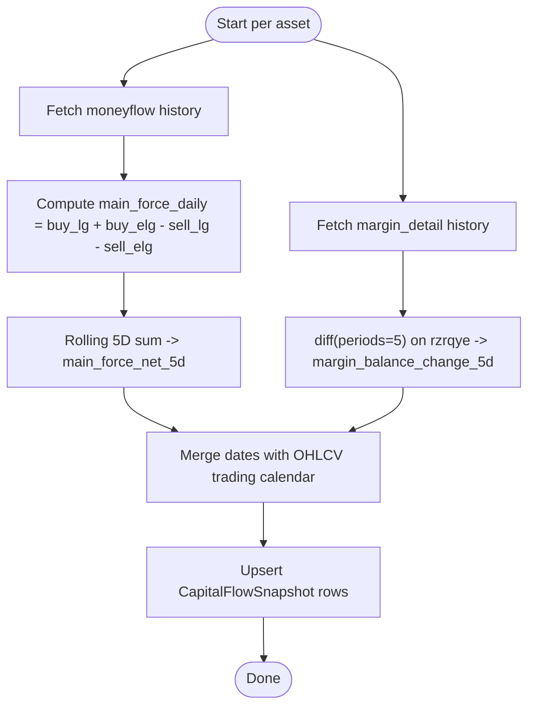
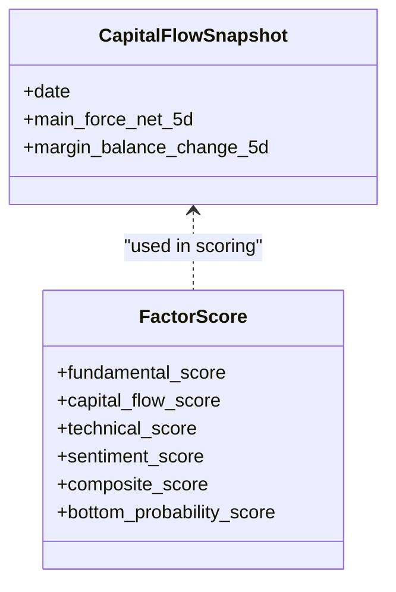

# Capital Flow Analysis

<cite>
**Referenced Files in This Document**
- [models.py](file://apps/factors/models.py)
- [backfill_capital_flow_snapshots.py](file://apps/factors/management/commands/backfill_capital_flow_snapshots.py)
- [tasks.py](file://apps/factors/tasks.py)
- [views.py](file://apps/factors/views.py)
- [serializers.py](file://apps/factors/serializers.py)
- [urls.py](file://config/urls.py)
- [validate_data_quality.py](file://apps/core/management/commands/validate_data_quality.py)
</cite>

## Table of Contents
1. [Introduction](#introduction)
2. [Project Structure](#project-structure)
3. [Core Components](#core-components)
4. [Architecture Overview](#architecture-overview)
5. [Detailed Component Analysis](#detailed-component-analysis)
6. [Dependency Analysis](#dependency-analysis)
7. [Performance Considerations](#performance-considerations)
8. [Troubleshooting Guide](#troubleshooting-guide)
9. [Conclusion](#conclusion)
10. [Appendices](#appendices)

## Introduction
This document explains how capital flow tracking is implemented and used to support institutional flow signals, retail sentiment indicators, and money flow metrics. It covers:
- How raw market microstructure data is ingested and transformed into capital flow snapshots
- The calculation of flow direction analysis and rolling window metrics
- How these flows are integrated into multi-factor scoring for accumulation/distribution detection
- API usage patterns for querying capital flow data and generating trading signals via bottom candidates

The system focuses on two primary flow components:
- Main force net flow (proxy for institutional activity) derived from large and extra-large buy/sell amounts
- Margin balance change (proxy for leveraged positions) derived from margin detail balances

These are combined into a capital flow score that contributes to composite factor scores used to identify potential accumulation or distribution phases.

## Project Structure
Capital flow functionality spans several modules:
- Data models define raw money flow and margin detail snapshots and the derived capital flow snapshot
- A management command backfills and computes capital flow snapshots from external provider data
- Tasks compute factor scores using capital flow snapshots alongside fundamentals, technicals, and sentiment
- Views expose REST endpoints for capital flow snapshots and bottom candidate screening
- Serializers define API payloads
- URL routing registers the endpoints

**Diagram sources**
- [backfill_capital_flow_snapshots.py:120-148](file://apps/factors/management/commands/backfill_capital_flow_snapshots.py#L120-L148)
- [models.py:39-121](file://apps/factors/models.py#L39-L121)
- [tasks.py:283-461](file://apps/factors/tasks.py#L283-L461)
- [views.py:37-43](file://apps/factors/views.py#L37-L43)
- [urls.py:89-91](file://config/urls.py#L89-L91)

**Section sources**
- [models.py:39-121](file://apps/factors/models.py#L39-L121)
- [backfill_capital_flow_snapshots.py:57-118](file://apps/factors/management/commands/backfill_capital_flow_snapshots.py#L57-L118)
- [tasks.py:283-461](file://apps/factors/tasks.py#L283-L461)
- [views.py:37-43](file://apps/factors/views.py#L37-L43)
- [urls.py:89-91](file://config/urls.py#L89-L91)

## Core Components
- AssetMoneyFlowSnapshot: Stores per-stock daily money flow fields including small/medium/large/extra-large buy and sell amounts and net main flow amount
- AssetMarginDetailSnapshot: Stores per-stock daily margin detail fields including financing and securities lending balances and total margin balance
- CapitalFlowSnapshot: Derived daily snapshot with:
  - main_force_net_5d: Rolling 5-day sum of daily main force flow (large + extra-large buys minus sells)
  - margin_balance_change_5d: 5-day difference in total margin balance
- FactorScore: Composite scoring that includes capital_flow_score derived from percentile ranks of main force flow and margin balance change

Key responsibilities:
- Backfill command fetches raw provider data, upserts raw snapshots, computes derived capital flow metrics, and persists them
- Scoring task reads latest capital flow snapshots, normalizes via percentile ranking, averages component flow scores, and combines with fundamentals, technicals, and sentiment to produce composite scores

**Section sources**
- [models.py:39-121](file://apps/factors/models.py#L39-L121)
- [models.py:124-176](file://apps/factors/models.py#L124-L176)
- [backfill_capital_flow_snapshots.py:312-372](file://apps/factors/management/commands/backfill_capital_flow_snapshots.py#L312-L372)
- [tasks.py:316-398](file://apps/factors/tasks.py#L316-L398)

## Architecture Overview
The capital flow pipeline integrates market microstructure data into actionable signals:

**Diagram sources**
- [backfill_capital_flow_snapshots.py:190-243](file://apps/factors/management/commands/backfill_capital_flow_snapshots.py#L190-L243)
- [backfill_capital_flow_snapshots.py:312-372](file://apps/factors/management/commands/backfill_capital_flow_snapshots.py#L312-L372)
- [tasks.py:283-461](file://apps/factors/tasks.py#L283-L461)
- [views.py:45-176](file://apps/factors/views.py#L45-L176)
- [urls.py:89-91](file://config/urls.py#L89-L91)

## Detailed Component Analysis

### CapitalFlowSnapshot Model Structure
- Fields:
  - asset: Foreign key to Asset
  - date: Trading date index
  - main_force_net_5d: Rolling 5-day sum of main force daily flow
  - margin_balance_change_5d: 5-day difference of margin balance
  - metadata: JSON field capturing source and formulas
- Indexes:
  - Unique constraint on (asset, date)
  - Indexes on (asset, date) and date for efficient queries

Interpretation:
- Positive main_force_net_5d suggests institutional accumulation over the last 5 days
- Negative margin_balance_change_5d indicates deleveraging; positive indicates increasing leverage
- Combined trends help identify accumulation vs distribution phases when considered with fundamentals and technicals

**Section sources**
- [models.py:100-121](file://apps/factors/models.py#L100-L121)

### Money Flow Calculation Algorithms
Main force daily flow:
- Computed as large and extra-large buy amounts minus corresponding sell amounts
- Rolling 5-day sum yields main_force_net_5d

Margin balance change:
- 5-day difference of total margin balance (rzrqye)
- Captures changes in leveraged positions

Edge cases:
- Missing provider data results in None values
- Warmup periods handled via min_periods=1 for rolling sums
- Validation commands classify nulls based on presence of source rows

**Diagram sources**
- [backfill_capital_flow_snapshots.py:312-372](file://apps/factors/management/commands/backfill_capital_flow_snapshots.py#L312-L372)

**Section sources**
- [backfill_capital_flow_snapshots.py:312-372](file://apps/factors/management/commands/backfill_capital_flow_snapshots.py#L312-L372)
- [validate_data_quality.py:2336-2362](file://apps/core/management/commands/validate_data_quality.py#L2336-L2362)

### Integration with Market Microstructure Data
- Raw inputs:
  - moneyflow: buy_sm_amount, sell_sm_amount, buy_md_amount, sell_md_amount, buy_lg_amount, sell_lg_amount, buy_elg_amount, sell_elg_amount, net_mf_amount
  - margin_detail: rzye, rqye, rzmre, rzche, rqyl, rqchl, rqmcl, rzrqye
- Integration steps:
  - Batch fetch with date windows to respect provider limits
  - Normalize and merge with existing historical lookback
  - Upsert raw snapshots and derive capital flow metrics
  - Persist derived snapshots for downstream scoring

Validation:
- Data quality checks ensure continuity and classify nulls due to missing source rows or unexpected gaps

**Section sources**
- [backfill_capital_flow_snapshots.py:190-243](file://apps/factors/management/commands/backfill_capital_flow_snapshots.py#L190-L243)
- [backfill_capital_flow_snapshots.py:245-310](file://apps/factors/management/commands/backfill_capital_flow_snapshots.py#L245-L310)
- [validate_data_quality.py:1381-1409](file://apps/core/management/commands/validate_data_quality.py#L1381-L1409)

### Multi-Factor Scoring and Capital Flow Contribution
- Percentile ranking:
  - main_force_net_5d and margin_balance_change_5d are ranked across assets to produce normalized scores
- Averaging:
  - capital_flow_score is the average of main force flow score and margin flow score
- Composite:
  - composite_score combines fundamental_score, capital_flow_score, technical_score, and optionally sentiment_score using configurable weights
- Bottom candidates:
  - Assets are ranked by bottom_probability_score (clamped composite) for screening

**Diagram sources**
- [models.py:100-121](file://apps/factors/models.py#L100-L121)
- [models.py:124-176](file://apps/factors/models.py#L124-L176)
- [tasks.py:316-398](file://apps/factors/tasks.py#L316-L398)

**Section sources**
- [tasks.py:316-398](file://apps/factors/tasks.py#L316-L398)

### API Usage Examples
Endpoints:
- Capital flow snapshots: GET /api/v1/factors/capital-flows/
  - Returns paginated list of CapitalFlowSnapshot with asset symbol, date, main_force_net_5d, margin_balance_change_5d
- Bottom candidates: GET /api/v1/screener/bottom-candidates/
  - Filters by mode, as_of date, minimum score threshold
  - Supports macro context adjustments to weights and returns adjusted scores

Example workflows:
- Analyze recent institutional accumulation:
  - Query capital flows for an asset and filter by positive main_force_net_5d over multiple dates
  - Combine with technical reversal scores to confirm oversold conditions
- Identify distribution phases:
  - Look for negative main_force_net_5d and rising margin_balance_change_5d indicating leveraged selling pressure
- Generate trading signals:
  - Use bottom candidates endpoint to retrieve top-ranked assets by composite score
  - Optionally apply macro context to adjust weights and re-rank

Note:
- Authentication is required for these endpoints
- Pagination and filtering parameters can be used to refine results

**Section sources**
- [views.py:37-43](file://apps/factors/views.py#L37-L43)
- [views.py:45-176](file://apps/factors/views.py#L45-L176)
- [urls.py:89-91](file://config/urls.py#L89-L91)
- [serializers.py:17-26](file://apps/factors/serializers.py#L17-L26)
- [serializers.py:29-44](file://apps/factors/serializers.py#L29-L44)

## Dependency Analysis
- Backfill command depends on:
  - TuShare provider for moneyflow and margin_detail
  - OHLCV model for trading dates
  - Database models for raw and derived snapshots
- Scoring task depends on:
  - CapitalFlowSnapshot, FundamentalFactorSnapshot, SentimentScore, TechnicalIndicator (via prediction features), and OHLCV
  - Celery for asynchronous execution
- API views depend on:
  - Models and serializers for serialization
  - Macro services for weight adjustment

Potential coupling:
- Strong cohesion within factors app for capital flow logic
- Loose coupling via database models allows independent updates to ingestion and scoring

Circular dependencies:
- None observed between core modules; tasks call management commands but not vice versa

External integrations:
- TuShare API rate limiting handled with retries and sleeps
- Configuration via settings for token and timing parameters

**Section sources**
- [backfill_capital_flow_snapshots.py:66-118](file://apps/factors/management/commands/backfill_capital_flow_snapshots.py#L66-L118)
- [tasks.py:283-461](file://apps/factors/tasks.py#L283-L461)
- [views.py:45-176](file://apps/factors/views.py#L45-L176)

## Performance Considerations
- Batch operations:
  - Bulk create with update conflicts reduces database writes during backfill
- Windowed fetching:
  - Date windows prevent large provider requests and mitigate rate limits
- Efficient queries:
  - Indexes on asset/date enable fast retrieval for scoring and validation
- Minimization of lookbacks:
  - Limited historical lookback rows reduce memory and computation overhead
- Asynchronous scoring:
  - Celery tasks decouple heavy computations from request-response cycles

Recommendations:
- Monitor provider rate limits and tune sleep/retry settings
- Ensure adequate indexing on frequently queried fields
- Consider partitioning large tables by date for improved query performance

[No sources needed since this section provides general guidance]

## Troubleshooting Guide
Common issues and diagnostics:
- Missing moneyflow source rows:
  - main_force_net_5d may be NULL if no same-day AssetMoneyFlowSnapshot exists
  - Validate data quality command classifies such cases as expected nulls
- Unexpected nulls with source rows:
  - Indicates processing errors or data transformation issues
- Margin balance warmup gaps:
  - margin_balance_change_5d requires sufficient history; early dates may be NULL until lookback is satisfied
- Continuity gaps:
  - Reports generated by validation command highlight missing capital flow rows relative to trading calendar

Actions:
- Re-run backfill for affected date ranges
- Check provider availability and rate limit responses
- Inspect metadata fields for source and formula information
- Use validation reports to pinpoint problematic assets and dates

**Section sources**
- [validate_data_quality.py:2336-2362](file://apps/core/management/commands/validate_data_quality.py#L2336-L2362)
- [validate_data_quality.py:1381-1409](file://apps/core/management/commands/validate_data_quality.py#L1381-L1409)

## Conclusion
The capital flow system transforms raw market microstructure data into actionable signals by:
- Computing institutional flow proxies (main force net flow) and leveraged position changes (margin balance change)
- Integrating these into multi-factor scoring to identify accumulation and distribution phases
- Exposing APIs for querying flows and screening bottom candidates with optional macro context adjustments

This approach enables robust trend detection and signal generation grounded in both institutional behavior and broader market context.

[No sources needed since this section summarizes without analyzing specific files]

## Appendices

### API Reference Summary
- Capital flow snapshots:
  - Endpoint: /api/v1/factors/capital-flows/
  - Method: GET
  - Auth: Required
  - Response fields: id, asset, asset_symbol, date, main_force_net_5d, margin_balance_change_5d, metadata, created_at
- Bottom candidates:
  - Endpoint: /api/v1/screener/bottom-candidates/
  - Methods: GET, POST (recalculate)
  - Parameters: mode, as_of, min_score, top_n, sort_by, prediction_horizon, macro_context, event_tag
  - Response includes composite and adjusted scores with context metadata

**Section sources**
- [views.py:37-43](file://apps/factors/views.py#L37-L43)
- [views.py:45-176](file://apps/factors/views.py#L45-L176)
- [urls.py:89-91](file://config/urls.py#L89-L91)
- [serializers.py:17-26](file://apps/factors/serializers.py#L17-L26)
- [serializers.py:29-44](file://apps/factors/serializers.py#L29-L44)