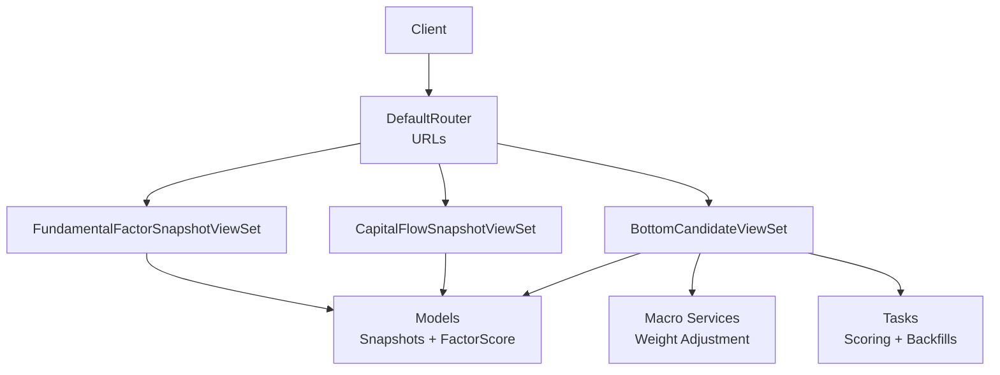
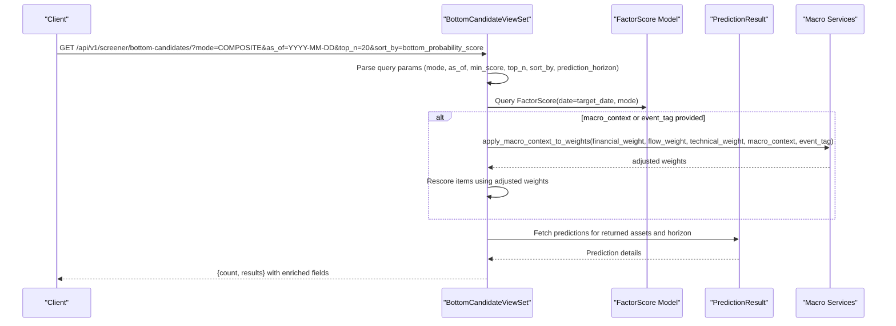
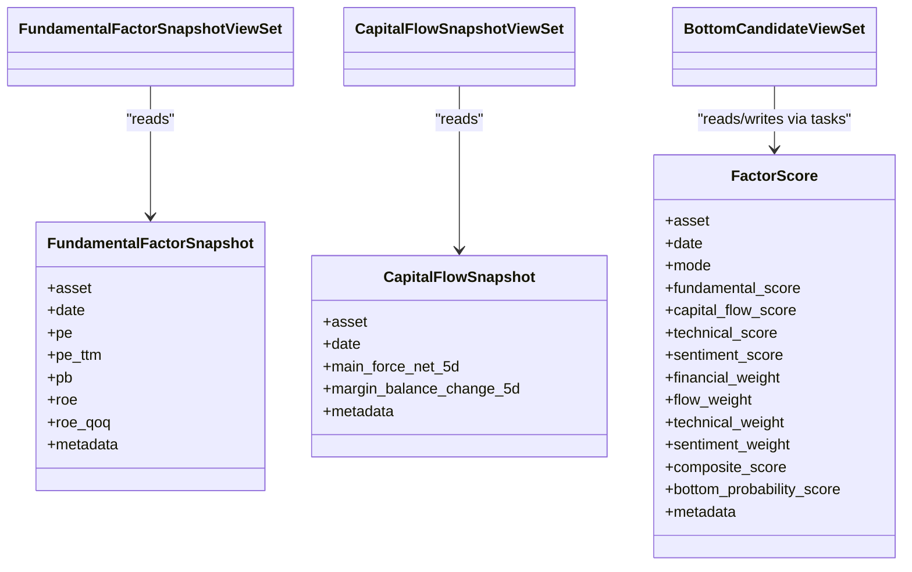

# Factor Analysis API

<cite>
**Referenced Files in This Document**
- [views.py](file://apps/factors/views.py)
- [models.py](file://apps/factors/models.py)
- [serializers.py](file://apps/factors/serializers.py)
- [tasks.py](file://apps/factors/tasks.py)
- [urls.py](file://config/urls.py)
- [api.md](file://docs/reference/api.md)
- [backfill_fundamental_snapshots.py](file://apps/factors/management/commands/backfill_fundamental_snapshots.py)
- [backfill_capital_flow_snapshots.py](file://apps/factors/management/commands/backfill_capital_flow_snapshots.py)
- [services.py](file://apps/macro/services.py)
</cite>

## Table of Contents
1. [Introduction](#introduction)
2. [Project Structure](#project-structure)
3. [Core Components](#core-components)
4. [Architecture Overview](#architecture-overview)
5. [Detailed Component Analysis](#detailed-component-analysis)
6. [Dependency Analysis](#dependency-analysis)
7. [Performance Considerations](#performance-considerations)
8. [Troubleshooting Guide](#troubleshooting-guide)
9. [Conclusion](#conclusion)
10. [Appendices](#appendices)

## Introduction
This document describes the factor analysis endpoints that expose fundamental factors, capital flow analysis, and composite scoring for bottom candidate identification. It covers:
- Fundamental factor snapshot retrieval
- Capital flow snapshot retrieval
- Composite factor scoring and bottom candidate ranking
- Parameter specifications for factor selection, time windows, and ranking criteria
- Multi-factor analysis and portfolio construction using factor scores

The system computes daily factor scores across fundamental, capital flow, technical, and sentiment dimensions, then aggregates them into a composite score used to rank assets as potential bottom candidates.

## Project Structure
Factor-related functionality is implemented under the factors app with REST endpoints backed by Django models and DRF viewsets. URL routing registers three primary groups:
- Fundamental snapshots
- Capital flow snapshots
- Bottom candidate screener (composite scores)

**Diagram sources**
- [urls.py:74-107](file://config/urls.py#L74-L107)
- [views.py:29-43](file://apps/factors/views.py#L29-L43)
- [views.py:45-176](file://apps/factors/views.py#L45-L176)
- [models.py:7-176](file://apps/factors/models.py#L7-L176)
- [tasks.py:256-461](file://apps/factors/tasks.py#L256-L461)
- [services.py:62-89](file://apps/macro/services.py#L62-L89)

**Section sources**
- [urls.py:74-107](file://config/urls.py#L74-L107)
- [api.md:326-348](file://docs/reference/api.md#L326-L348)

## Core Components
- FundamentalFactorSnapshot: Daily fundamental metrics per asset (valuation, size, profitability).
- CapitalFlowSnapshot: Derived capital flow metrics per asset (main force net flow, margin balance change).
- FactorScore: Aggregated multi-factor scores and bottom probability per asset per date and mode.
- ViewSets: Provide read access to snapshots and a custom list endpoint for bottom candidates with optional macro context adjustment and prediction enrichment.
- Tasks: Background computation of factor scores and backfilling of raw snapshots from external data sources.

Key responsibilities:
- Snapshot retrieval via standard ModelViewSet endpoints
- Bottom candidate listing with filtering, sorting, and optional macro-adjusted rescore
- Asynchronous recalculation of factor scores with configurable weights

**Section sources**
- [models.py:7-176](file://apps/factors/models.py#L7-L176)
- [serializers.py:6-45](file://apps/factors/serializers.py#L6-L45)
- [views.py:29-176](file://apps/factors/views.py#L29-L176)
- [tasks.py:256-461](file://apps/factors/tasks.py#L256-L461)

## Architecture Overview
The factor analysis pipeline consists of:
- Data ingestion and backfill commands populate FundamentalFactorSnapshot and CapitalFlowSnapshot tables from external sources.
- A background task calculates FactorScore entries per asset per date, including component scores and composite aggregation.
- The bottom candidate endpoint reads FactorScore records, optionally applies macro context weight adjustments, enriches with predictions, and returns ranked results.

**Diagram sources**
- [views.py:54-176](file://apps/factors/views.py#L54-L176)
- [services.py:62-89](file://apps/macro/services.py#L62-L89)
- [models.py:124-176](file://apps/factors/models.py#L124-L176)

## Detailed Component Analysis

### Fundamental Factor Snapshots
- Endpoint group: /api/v1/factors/fundamentals/
- Purpose: Retrieve daily fundamental factor snapshots for assets.
- Filtering: Standard DRF filters apply (asset, date ranges, ordering).
- Response fields include valuation ratios, share counts, market values, ROE, and metadata.

Use cases:
- Validate input data quality before scoring
- Analyze valuation trends across time windows
- Build custom fundamental-only screens

**Section sources**
- [views.py:29-35](file://apps/factors/views.py#L29-L35)
- [serializers.py:6-15](file://apps/factors/serializers.py#L6-L15)
- [models.py:7-37](file://apps/factors/models.py#L7-L37)
- [api.md:326-348](file://docs/reference/api.md#L326-L348)

### Capital Flow Snapshots
- Endpoint group: /api/v1/factors/capital-flows/
- Purpose: Retrieve daily capital flow snapshots derived from money flow and margin detail.
- Key fields: main_force_net_5d, margin_balance_change_5d.

Use cases:
- Monitor institutional and margin-driven flows
- Combine with fundamentals for multi-factor strategies
- Validate backfilled data consistency

**Section sources**
- [views.py:37-43](file://apps/factors/views.py#L37-L43)
- [serializers.py:17-26](file://apps/factors/serializers.py#L17-L26)
- [models.py:100-122](file://apps/factors/models.py#L100-L122)
- [api.md:326-348](file://docs/reference/api.md#L326-L348)

### Bottom Candidate Screener (Composite Scoring)
- Endpoint: /api/v1/screener/bottom-candidates/
- Methods:
  - GET: List bottom candidates with optional macro context adjustment and prediction enrichment
  - POST /recalculate/: Queue asynchronous recalculation of factor scores with specified weights and macro context

Parameters:
- mode: One of COMPOSITE, TECHNICAL, FUNDAMENTAL; defaults to COMPOSITE
- as_of: Target date string (YYYY-MM-DD); defaults to latest available date for the selected mode
- min_score: Minimum bottom_probability_score threshold (optional)
- top_n: Number of results to return (default 20, clamped between 1 and 200)
- sort_by: Sort field; supports bottom_probability_score, trade_score, risk_reward_ratio
- prediction_horizon: Horizon days for prediction lookup (default 7)
- macro_context: Optional macro context key to adjust weights
- event_tag: Optional event tag to further adjust weights

Response:
- count: Number of results
- results: Array of factor score objects with additional fields:
  - adjusted_bottom_probability_score: Present when macro context is applied
  - context_applied: Object containing macro_context, event_tag, and adjusted weights
  - prediction_horizon: Requested horizon
  - target_price, stop_loss_price, risk_reward_ratio, trade_score, suggested: Enriched from predictions if available

Behavior:
- If macro_context or event_tag is provided, the endpoint recalculates a weighted composite using adjusted weights and attaches context metadata to each result.
- Predictions are fetched for the returned assets and requested horizon, enriching results with trade-related fields.

**Section sources**
- [views.py:45-176](file://apps/factors/views.py#L45-L176)
- [services.py:62-89](file://apps/macro/services.py#L62-L89)
- [models.py:124-176](file://apps/factors/models.py#L124-L176)

### Recalculate Factor Scores
- Endpoint: POST /api/v1/screener/bottom-candidates/recalculate/
- Purpose: Trigger background calculation of FactorScore entries for a target date with specified weights and optional macro context.
- Request body fields:
  - as_of: Target date string (YYYY-MM-DD)
  - financial_weight: Numeric weight for fundamental score
  - flow_weight: Numeric weight for capital flow score
  - technical_weight: Numeric weight for technical score
  - sentiment_weight: Numeric weight for sentiment score
  - macro_context: Optional macro context key
  - event_tag: Optional event tag

Behavior:
- Weights are normalized and may be adjusted by macro context and event tag.
- A Celery task is enqueued to compute factor scores for all assets in the point-in-time universe on the target date.
- Response includes queued status, as_of, final weights, and macro context information.

**Section sources**
- [views.py:178-218](file://apps/factors/views.py#L178-L218)
- [tasks.py:283-461](file://apps/factors/tasks.py#L283-L461)
- [services.py:62-89](file://apps/macro/services.py#L62-L89)

### Factor Score Computation Logic
- Inputs:
  - FundamentalFactorSnapshot: PE, PE TTM, PB, ROE QoQ
  - CapitalFlowSnapshot: Main force net flow 5D, Margin balance change 5D
  - Technical signals: RSI, Bollinger Bands, volume confirmation, oversold signals
  - Sentiment: 7-day asset sentiment score mapped to [0,1]
- Processing:
  - Percentile ranks computed for valuation and flow metrics
  - Component scores aggregated into fundamental_score, capital_flow_score, technical_score
  - Composite score computed using normalized weights (financial, flow, technical, sentiment)
  - bottom_probability_score derived from composite score clamped to [0,1]
- Output:
  - FactorScore rows stored per asset/date/mode with detailed metadata

Complexity considerations:
- Batch creation with update conflicts ensures idempotent recomputation
- Lookback windows for technical indicators are bounded to limit computation

**Section sources**
- [tasks.py:283-461](file://apps/factors/tasks.py#L283-L461)
- [models.py:124-176](file://apps/factors/models.py#L124-L176)

### Data Backfill Commands
- Fundamental snapshots:
  - Command: backfill_fundamental_snapshots
  - Sources: TuShare daily_basic and fina_indicator
  - Outputs: FundamentalFactorSnapshot rows with valuation and profitability fields
- Capital flow snapshots:
  - Command: backfill_capital_flow_snapshots
  - Sources: TuShare moneyflow and margin_detail
  - Outputs: AssetMoneyFlowSnapshot, AssetMarginDetailSnapshot, and CapitalFlowSnapshot rows

These commands ensure the underlying data required for factor scoring is present and up to date.

**Section sources**
- [backfill_fundamental_snapshots.py:40-171](file://apps/factors/management/commands/backfill_fundamental_snapshots.py#L40-L171)
- [backfill_capital_flow_snapshots.py:57-372](file://apps/factors/management/commands/backfill_capital_flow_snapshots.py#L57-L372)

## Dependency Analysis
- Views depend on:
  - Models for data persistence and querying
  - Serializers for response shaping
  - Macro services for weight adjustment
  - Tasks for asynchronous scoring
- Tasks depend on:
  - External data sources via management commands
  - Technical indicator utilities and signal events
  - Prediction results for enrichment
- URL routing centralizes endpoint registration and naming

**Diagram sources**
- [models.py:7-176](file://apps/factors/models.py#L7-L176)
- [views.py:29-176](file://apps/factors/views.py#L29-L176)

**Section sources**
- [urls.py:74-107](file://config/urls.py#L74-L107)
- [views.py:29-176](file://apps/factors/views.py#L29-L176)
- [models.py:7-176](file://apps/factors/models.py#L7-L176)

## Performance Considerations
- Pagination: All list endpoints use page-based pagination with default page size and maximum limits.
- Caching: Some read endpoints are cached server-side; bypass cache with unique query parameters when needed.
- Throttling: Tier-based rate limiting applies; consult API documentation for limits.
- Batch operations: Factor score computation uses bulk create with update conflicts to handle large universes efficiently.
- Lookback windows: Technical indicators use bounded lookbacks to control computation cost.

[No sources needed since this section provides general guidance]

## Troubleshooting Guide
Common issues and resolutions:
- Missing factor scores: Ensure backfill commands have run for both fundamentals and capital flows for the desired date range.
- Stale data: Use unique query parameter to bypass caching or flush Redis cache after backfills.
- Weight adjustments not applied: Verify macro_context and event_tag values; check macro service presets and event adjustments.
- Prediction fields missing: Confirm predictions exist for the requested horizon and model version; verify asset IDs and dates match.

Operational checks:
- Validate authentication and permissions for endpoints requiring IsAuthenticated.
- Inspect error responses for validation failures or throttling messages.
- Review Celery task queue for recalculate jobs and their completion status.

**Section sources**
- [api.md:188-239](file://docs/reference/api.md#L188-L239)
- [views.py:178-218](file://apps/factors/views.py#L178-L218)
- [tasks.py:283-461](file://apps/factors/tasks.py#L283-L461)

## Conclusion
The Factor Analysis API provides robust endpoints for retrieving fundamental and capital flow snapshots, computing composite factor scores, and identifying bottom candidates. It supports flexible parameterization for time windows, ranking criteria, and macro-aware weight adjustments. With background tasks for scoring and comprehensive backfill commands, it enables reliable multi-factor analysis and portfolio construction workflows.

[No sources needed since this section summarizes without analyzing specific files]

## Appendices

### API Endpoints Summary
- /api/v1/factors/fundamentals/
  - Method: GET
  - Purpose: Retrieve fundamental factor snapshots
  - Filters: asset, date ranges, ordering
- /api/v1/factors/capital-flows/
  - Method: GET
  - Purpose: Retrieve capital flow snapshots
  - Filters: asset, date ranges, ordering
- /api/v1/screener/bottom-candidates/
  - Method: GET
  - Purpose: List bottom candidates with optional macro context adjustment and prediction enrichment
  - Parameters: mode, as_of, min_score, top_n, sort_by, prediction_horizon, macro_context, event_tag
- /api/v1/screener/bottom-candidates/recalculate/
  - Method: POST
  - Purpose: Queue factor score recalculation with specified weights and macro context
  - Body: as_of, financial_weight, flow_weight, technical_weight, sentiment_weight, macro_context, event_tag

**Section sources**
- [urls.py:89-91](file://config/urls.py#L89-L91)
- [views.py:29-176](file://apps/factors/views.py#L29-L176)
- [api.md:326-348](file://docs/reference/api.md#L326-L348)

### Example Workflows

#### Multi-Factor Analysis
1. Retrieve fundamental snapshots for a date range to assess valuation trends.
2. Retrieve capital flow snapshots to evaluate recent institutional and margin activity.
3. Use bottom candidate endpoint with mode=COMPOSITE and sort_by=bottom_probability_score to identify top candidates.
4. Apply macro_context and event_tag to adjust weights based on current regime and events.

#### Portfolio Construction Using Factor Scores
1. Run recalculate with custom weights to reflect strategy preferences.
2. Fetch bottom candidates with top_n set to desired portfolio size.
3. Filter by min_score to enforce minimum quality thresholds.
4. Enrich with predictions to incorporate target price, stop loss, and trade score for position sizing and risk management.

[No sources needed since this section provides conceptual examples]