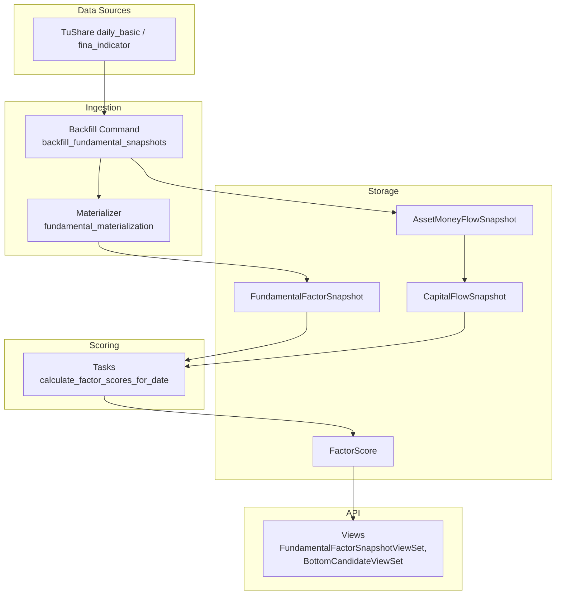
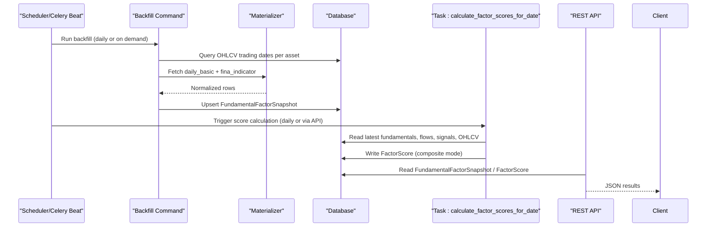
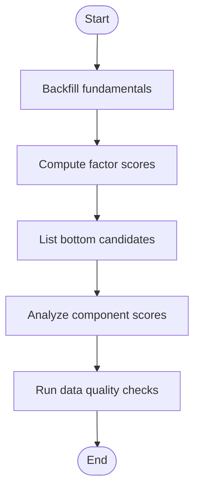
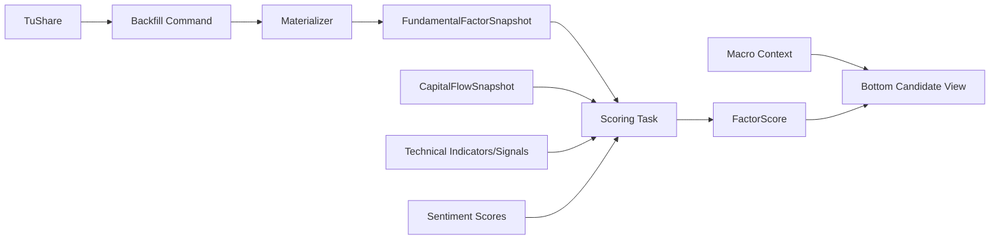

# Fundamental Factors

<cite>
**Referenced Files in This Document**
- [models.py](file://apps/factors/models.py)
- [views.py](file://apps/factors/views.py)
- [serializers.py](file://apps/factors/serializers.py)
- [tasks.py](file://apps/factors/tasks.py)
- [fundamental_materialization.py](file://apps/factors/fundamental_materialization.py)
- [backfill_fundamental_snapshots.py](file://apps/factors/management/commands/backfill_fundamental_snapshots.py)
- [api.md](file://docs/reference/api.md)
- [celery.md](file://docs/reference/celery.md)
- [validate_data_quality.py](file://apps/core/management/commands/validate_data_quality.py)
- [README.md](file://README.md)
</cite>

## Table of Contents
1. [Introduction](#introduction)
2. [Project Structure](#project-structure)
3. [Core Components](#core-components)
4. [Architecture Overview](#architecture-overview)
5. [Detailed Component Analysis](#detailed-component-analysis)
6. [Dependency Analysis](#dependency-analysis)
7. [Performance Considerations](#performance-considerations)
8. [Troubleshooting Guide](#troubleshooting-guide)
9. [Conclusion](#conclusion)
10. [Appendices](#appendices)

## Introduction
This document explains the fundamental factor snapshots used for multi-factor scoring and bottom-candidate screening. It covers:
- What fundamental factors are stored and how they are computed
- Data sources, update cadence, and quality controls
- The FundamentalFactorSnapshot model structure and business logic for financial health scoring
- API usage examples to retrieve fundamentals, filter by date ranges, and analyze trends across assets
- Examples of fundamental analysis workflows and factor correlation studies

## Project Structure
The fundamental factors feature lives primarily under the factors app and integrates with markets, analytics, sentiment, macro, and prediction apps.

**Diagram sources**
- [backfill_fundamental_snapshots.py:40-171](file://apps/factors/management/commands/backfill_fundamental_snapshots.py#L40-L171)
- [fundamental_materialization.py:123-190](file://apps/factors/fundamental_materialization.py#L123-L190)
- [models.py:7-36](file://apps/factors/models.py#L7-L36)
- [tasks.py:283-461](file://apps/factors/tasks.py#L283-L461)
- [views.py:29-79](file://apps/factors/views.py#L29-L79)

**Section sources**
- [README.md:65-100](file://README.md#L65-L100)
- [api.md:326-348](file://docs/reference/api.md#L326-L348)

## Core Components
- FundamentalFactorSnapshot: Daily snapshot of valuation and growth fields per asset.
- CapitalFlowSnapshot: Aggregated capital flow metrics used as a factor component.
- FactorScore: Composite scores combining fundamental, capital flow, technical, and sentiment components with configurable weights.

Key responsibilities:
- Ingest raw fundamentals from TuShare into FundamentalFactorSnapshot
- Compute cross-sectional percentile ranks and normalized scores
- Aggregate into fundamental_score, capital_flow_score, technical_score, sentiment_score
- Produce composite_score and bottom_probability_score for candidate ranking

**Section sources**
- [models.py:7-176](file://apps/factors/models.py#L7-L176)
- [serializers.py:6-45](file://apps/factors/serializers.py#L6-L45)

## Architecture Overview
End-to-end flow from data source to API:

**Diagram sources**
- [backfill_fundamental_snapshots.py:54-171](file://apps/factors/management/commands/backfill_fundamental_snapshots.py#L54-L171)
- [fundamental_materialization.py:123-190](file://apps/factors/fundamental_materialization.py#L123-L190)
- [tasks.py:283-461](file://apps/factors/tasks.py#L283-L461)
- [views.py:29-79](file://apps/factors/views.py#L29-L79)

## Detailed Component Analysis

### FundamentalFactorSnapshot Model
Purpose: Store daily valuation and growth indicators per asset for factor computation.

Fields overview:
- Identifiers and time: asset, date
- Valuation ratios: pe, pe_ttm, pb
- Size and liquidity proxies: total_share, float_share, free_share, total_mv, circ_mv
- Profitability and trend: roe, roe_qoq
- Audit and provenance: metadata, created_at

Indexes and constraints:
- Unique per (asset, date)
- Indexes on (asset, date) and date for efficient queries

Business meaning:
- Lower PE/PE TTM/PB generally favors “bottom” candidates
- ROE and ROE QoQ capture profitability level and recent improvement

**Section sources**
- [models.py:7-36](file://apps/factors/models.py#L7-L36)
- [serializers.py:6-15](file://apps/factors/serializers.py#L6-L15)

### Fundamental Data Ingestion and Materialization
Sources:
- TuShare daily_basic: valuation and size fields
- TuShare fina_indicator: ROE series and announcement/report dates

Processing:
- Normalize dates and fields
- Back-fill missing values using last available report
- Derive ROE quarter-over-quarter change
- Map upstream fields to FundamentalFactorSnapshot columns

Update frequency:
- Backfill command supports arbitrary windows; typically run after market close or on-demand
- Retries and rate-limit handling built-in for provider stability

Quality safeguards:
- Skips assets already complete unless repair flag is set
- Detects stale same-announcement ROE rows and reprocesses when needed

**Section sources**
- [backfill_fundamental_snapshots.py:40-171](file://apps/factors/management/commands/backfill_fundamental_snapshots.py#L40-L171)
- [fundamental_materialization.py:20-121](file://apps/factors/fundamental_materialization.py#L20-L121)
- [fundamental_materialization.py:123-190](file://apps/factors/fundamental_materialization.py#L123-L190)

### Factor Scoring and Financial Health Logic
Inputs:
- Latest FundamentalFactorSnapshot per asset
- Latest CapitalFlowSnapshot per asset
- Technical reversal score from OHLCV and signals
- Sentiment score from sentiment module

Normalization and ranking:
- Cross-sectional percentile ranks for PE, PE TTM, PB, main force flow, margin balance change
- Rank inversion for valuation metrics (lower is better)
- ROE trend normalization to [0,1]

Aggregation:
- fundamental_score = average of PE TTM rank, PB rank, ROE trend
- capital_flow_score = average of main force flow rank and margin balance change rank
- technical_score and sentiment_score from respective modules
- composite_score = weighted sum of four components
- bottom_probability_score = composite clamped to [0,1]

Weights:
- Default: financial_weight=0.4, flow_weight=0.3, technical_weight=0.3, sentiment_weight=0.0
- Adjustable via API recalculate action and macro context adjustments

Output:
- FactorScore row per (asset, date, mode), with mode COMPOSITE by default

**Section sources**
- [tasks.py:40-69](file://apps/factors/tasks.py#L40-L69)
- [tasks.py:124-239](file://apps/factors/tasks.py#L124-L239)
- [tasks.py:283-461](file://apps/factors/tasks.py#L283-L461)
- [views.py:45-176](file://apps/factors/views.py#L45-L176)

### API Usage Examples
Endpoints relevant to fundamentals and bottom candidates:
- GET /factors/fundamentals/ — list FundamentalFactorSnapshot records
- GET /factors/capital-flows/ — list CapitalFlowSnapshot records
- GET /screeners/bottom-candidates/ — top bottom candidates by bottom_probability_score
- POST /screeners/bottom-candidates/recalculate/ — trigger recomputation with custom weights

Filtering and pagination:
- Use standard DRF filters: asset, date__gte, date__lte, ordering
- Pagination defaults to page_size=50, max 1000

Examples:
- Retrieve fundamentals for a symbol over a date range:
  - GET /factors/fundamentals/?asset=<id>&date__gte=YYYY-MM-DD&date__lte=YYYY-MM-DD
- Get top 20 bottom candidates as of latest date:
  - GET /screeners/bottom-candidates/?top_n=20&sort_by=bottom_probability_score
- Adjust weights and recompute:
  - POST /screeners/bottom-candidates/recalculate/ with body including financial_weight, flow_weight, technical_weight, sentiment_weight, optional macro_context and event_tag

Authentication and throttling:
- JWT or API key required for these endpoints
- Throttling tiers apply; see API reference

**Section sources**
- [views.py:29-79](file://apps/factors/views.py#L29-L79)
- [views.py:178-218](file://apps/factors/views.py#L178-L218)
- [api.md:136-184](file://docs/reference/api.md#L136-L184)
- [api.md:188-239](file://docs/reference/api.md#L188-L239)
- [api.md:326-348](file://docs/reference/api.md#L326-L348)

### Example Workflows

#### Fundamental Analysis Workflow
Goal: Identify undervalued, improving companies with positive momentum.

Steps:
1. Backfill fundamentals for target universe and date window
2. Ensure capital flows and technical indicators are up to date
3. Trigger factor score calculation for the target date
4. Retrieve bottom candidates sorted by bottom_probability_score
5. Inspect component scores (fundamental_score, capital_flow_score, technical_score)
6. Validate with data quality reports

[No sources needed since this diagram shows conceptual workflow, not actual code structure]

#### Factor Correlation Study
Goal: Understand relationships between valuation, profitability, flow, and technical signals.

Approach:
- Export FundamentalFactorSnapshot and FactorScore for a date range
- Compute correlations across assets:
  - PE/PE TTM vs PB
  - ROE vs ROE QoQ
  - Fundamental_score vs capital_flow_score vs technical_score
- Segment by market regime or macro context if available
- Visualize scatter plots and heatmaps

Tools:
- Use the API to paginate large datasets
- Combine with macro context endpoints for regime-aware analysis

[No sources needed since this section provides general guidance]

## Dependency Analysis
Key dependencies and coupling:
- Backfill depends on TuShare APIs and OHLCV trading calendar
- Materializer depends on pandas for as-of merges and normalization
- Scoring depends on:
  - FundamentalFactorSnapshot
  - CapitalFlowSnapshot
  - Technical indicators and signals
  - Sentiment scores
  - Macro context for weight adjustments
- Views expose read-only access to snapshots and scored candidates

**Diagram sources**
- [backfill_fundamental_snapshots.py:54-171](file://apps/factors/management/commands/backfill_fundamental_snapshots.py#L54-L171)
- [tasks.py:283-461](file://apps/factors/tasks.py#L283-L461)
- [views.py:45-176](file://apps/factors/views.py#L45-L176)

**Section sources**
- [tasks.py:283-461](file://apps/factors/tasks.py#L283-L461)
- [views.py:45-176](file://apps/factors/views.py#L45-L176)

## Performance Considerations
- Batch writes:
  - Backfill uses bulk_create with batch_size=2000
  - Scoring uses bulk_create with FACTOR_SCORE_BATCH_SIZE=1000
- Lookbacks:
  - Technical lookback windows sized to RSI(14), BBANDS(20), volume(21)
  - FINA indicator lookback extended to ensure coverage
- Efficient queries:
  - select_related('asset') in views
  - Distinct latest-by-asset retrieval for cross-sectional ranking
- Provider resilience:
  - Rate limit retries with exponential backoff for TuShare calls

Recommendations:
- Schedule backfills during off-peak hours
- Limit top_n in screener requests to reduce payload size
- Use effective universe filters to constrain cross-sectional calculations

[No sources needed since this section provides general guidance]

## Troubleshooting Guide
Common issues and resolutions:
- Missing fundamentals:
  - Re-run backfill with --repair-same-announcement-roe to fix stale ROE rows
  - Check TuShare token configuration and rate limits
- Stale factor scores:
  - Recalculate via POST /screeners/bottom-candidates/recalculate/
  - Verify macro context and weights applied
- Data quality alerts:
  - Run validate_data_quality to generate reports and identify gaps
  - Focus on fundamental reconciliation and continuity checks

Operational tips:
- Monitor Celery beat schedule and task queues
- Use pagination and date-range filters to isolate problematic assets/dates
- Leverage metadata fields in snapshots to trace upstream sources and dates

**Section sources**
- [backfill_fundamental_snapshots.py:40-171](file://apps/factors/management/commands/backfill_fundamental_snapshots.py#L40-L171)
- [validate_data_quality.py:177-200](file://apps/core/management/commands/validate_data_quality.py#L177-L200)
- [celery.md:34-48](file://docs/reference/celery.md#L34-L48)

## Conclusion
The fundamental factors system ingests valuation and profitability data from TuShare, materializes daily snapshots, and computes cross-sectional scores that feed a composite bottom-candidate screener. The design emphasizes robustness (retries, repairs), performance (batching, lookbacks), and transparency (metadata, validation). Users can retrieve fundamentals via REST APIs, adjust scoring weights, and perform correlation studies to support investment decisions.

## Appendices

### Field Definitions Summary
- FundamentalFactorSnapshot:
  - pe, pe_ttm, pb: valuation multiples
  - total_share, float_share, free_share, total_mv, circ_mv: size and liquidity proxies
  - roe, roe_qoq: profitability level and recent trend
  - metadata: source and audit info
- CapitalFlowSnapshot:
  - main_force_net_5d, margin_balance_change_5d: short-term flow momentum
- FactorScore:
  - Component scores: fundamental_score, capital_flow_score, technical_score, sentiment_score
  - Weights: financial_weight, flow_weight, technical_weight, sentiment_weight
  - Outputs: composite_score, bottom_probability_score

**Section sources**
- [models.py:7-176](file://apps/factors/models.py#L7-L176)
- [serializers.py:6-45](file://apps/factors/serializers.py#L6-L45)