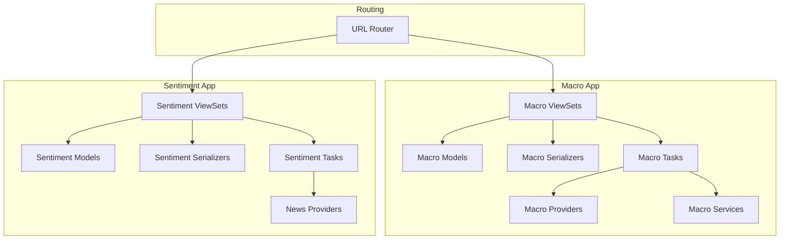
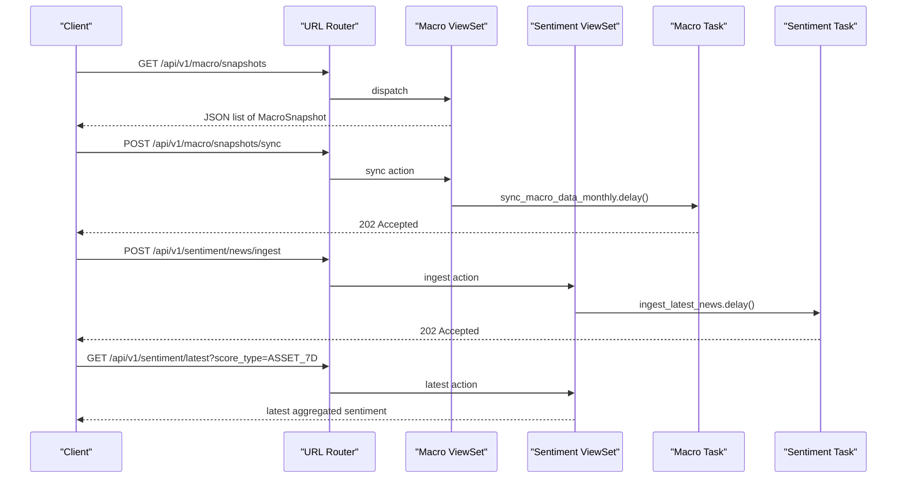
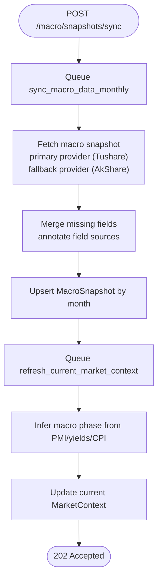
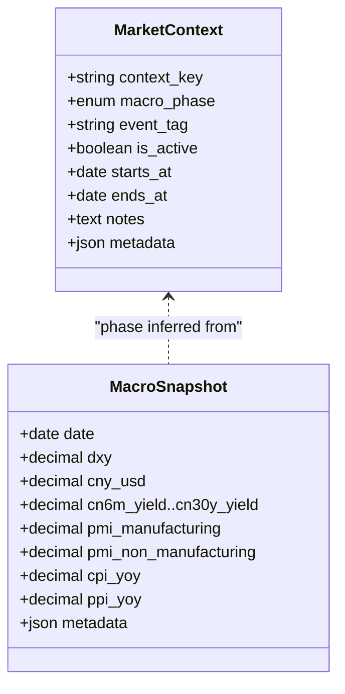
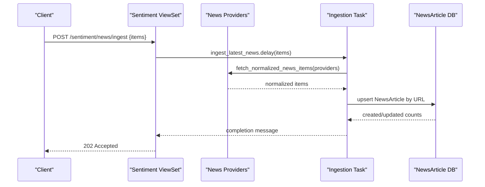
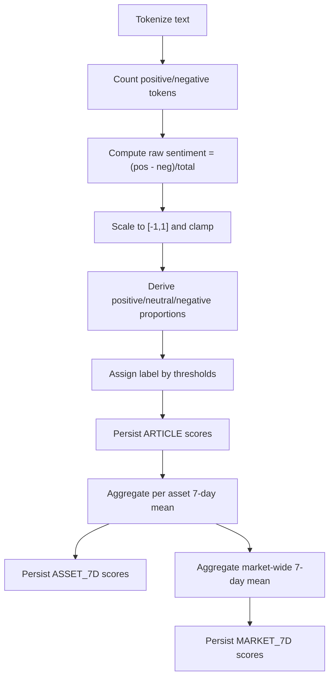
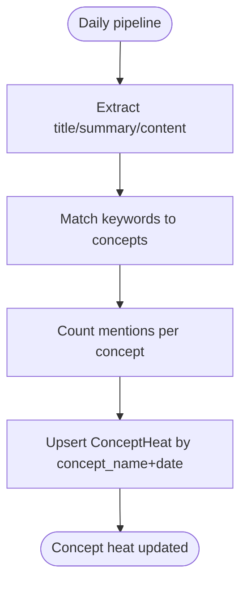
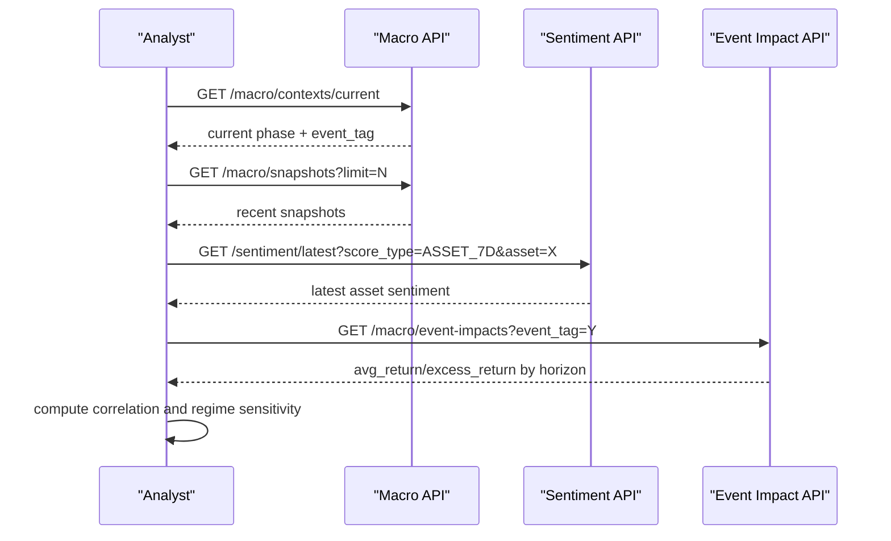
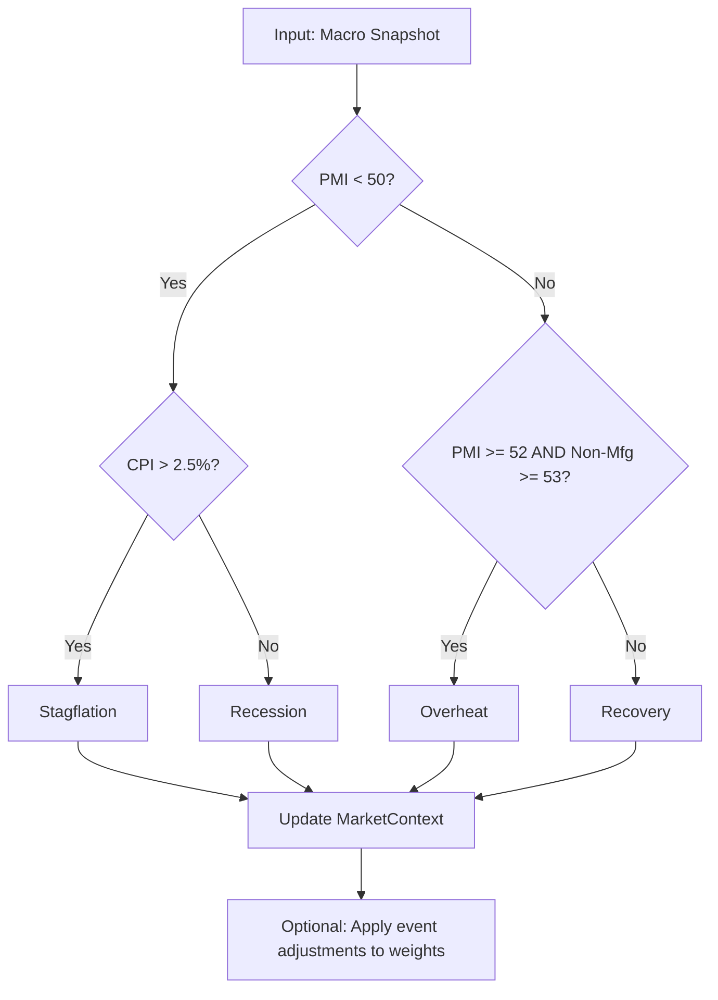
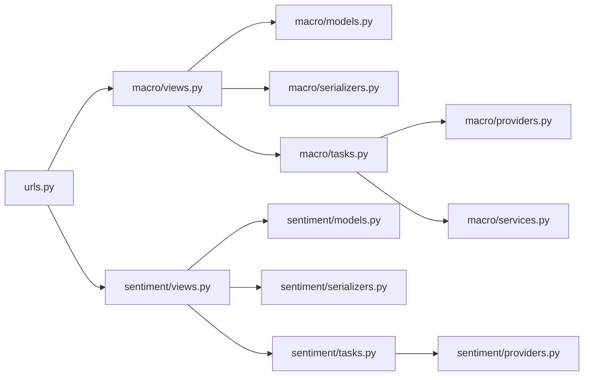

# Macro & Sentiment API

<cite>
**Referenced Files in This Document**
- [views.py](file://apps/macro/views.py)
- [models.py](file://apps/macro/models.py)
- [serializers.py](file://apps/macro/serializers.py)
- [tasks.py](file://apps/macro/tasks.py)
- [providers.py](file://apps/macro/providers.py)
- [services.py](file://apps/macro/services.py)
- [views.py](file://apps/sentiment/views.py)
- [models.py](file://apps/sentiment/models.py)
- [serializers.py](file://apps/sentiment/serializers.py)
- [tasks.py](file://apps/sentiment/tasks.py)
- [providers.py](file://apps/sentiment/providers.py)
- [urls.py](file://config/urls.py)
</cite>

## Table of Contents
1. [Introduction](#introduction)
2. [Project Structure](#project-structure)
3. [Core Components](#core-components)
4. [Architecture Overview](#architecture-overview)
5. [Detailed Component Analysis](#detailed-component-analysis)
6. [Dependency Analysis](#dependency-analysis)
7. [Performance Considerations](#performance-considerations)
8. [Troubleshooting Guide](#troubleshooting-guide)
9. [Conclusion](#conclusion)
10. [Appendices](#appendices)

## Introduction
This document describes the macroeconomic data and sentiment analysis endpoints exposed by the application. It covers:
- Macro snapshots, market context indicators, and event impact statistics
- News article retrieval, sentiment scoring algorithms, and concept heat mapping
- Practical workflows for macro-sentiment correlation analysis and regime detection

The system provides read-only REST endpoints to query stored macro data and sentiment signals, plus write actions that queue background tasks to ingest and recompute data.

## Project Structure
The relevant functionality is split across two Django apps:
- Macro app: stores macro snapshots, current market context, and historical event impact stats; exposes viewsets and background tasks to sync macro data and refresh context.
- Sentiment app: ingests news from multiple providers, scores articles, aggregates per-asset and market-level sentiment over rolling windows, and tracks concept heat.

**Diagram sources**
- [urls.py:74-107](file://config/urls.py#L74-L107)
- [views.py:14-59](file://apps/macro/views.py#L14-L59)
- [views.py:36-121](file://apps/sentiment/views.py#L36-L121)
- [tasks.py:91-150](file://apps/macro/tasks.py#L91-L150)
- [tasks.py:283-565](file://apps/sentiment/tasks.py#L283-L565)

**Section sources**
- [urls.py:74-107](file://config/urls.py#L74-L107)
- [views.py:14-59](file://apps/macro/views.py#L14-L59)
- [views.py:36-121](file://apps/sentiment/views.py#L36-L121)

## Core Components
- Macro Snapshot: daily/monthly macro indicators including DXY, CNY/USD, China yield curve points, PMI, CPI/PPI YoY, with metadata tracking source fields.
- Market Context: current macro phase (Recovery, Overheat, Stagflation, Recession), optional event tag, active window, notes, and metadata.
- Event Impact Stat: historical average/excess returns by event tag, sector, and horizon days.
- News Article: normalized ingestion from multiple Chinese financial news providers with deduplication on URL.
- Sentiment Score: three scopes in one table—per-article, per-asset 7-day aggregation, and market 7-day aggregation—with positive/neutral/negative components and a label.
- Concept Heat: daily ranking of inferred concepts based on keyword matching against article content.

**Section sources**
- [models.py:5-28](file://apps/macro/models.py#L5-L28)
- [models.py:31-56](file://apps/macro/models.py#L31-L56)
- [models.py:59-76](file://apps/macro/models.py#L59-L76)
- [models.py:35-61](file://apps/sentiment/models.py#L35-L61)
- [models.py:64-107](file://apps/sentiment/models.py#L64-L107)
- [models.py:110-124](file://apps/sentiment/models.py#L110-L124)

## Architecture Overview
The API surface is built on Django REST Framework viewsets registered under /api/v1/. Clients authenticate via JWT and call read endpoints to retrieve macro and sentiment data. Write actions enqueue Celery tasks for asynchronous processing.

**Diagram sources**
- [urls.py:92-97](file://config/urls.py#L92-L97)
- [views.py:21-24](file://apps/macro/views.py#L21-L24)
- [views.py:47-50](file://apps/sentiment/views.py#L47-L50)
- [views.py:70-92](file://apps/sentiment/views.py#L70-L92)
- [tasks.py:91-131](file://apps/macro/tasks.py#L91-L131)
- [tasks.py:283-350](file://apps/sentiment/tasks.py#L283-L350)

## Detailed Component Analysis

### Macro Snapshots Endpoint
- Purpose: Retrieve monthly macro snapshots containing currency indices, yields, PMIs, inflation metrics, and metadata.
- Query behavior: Ordered by date descending; supports standard DRF filtering if needed.
- Sync action: Queues a background task to fetch macro data from configured primary/fallback providers and update or create a snapshot for the month.

**Diagram sources**
- [views.py:21-24](file://apps/macro/views.py#L21-L24)
- [tasks.py:91-150](file://apps/macro/tasks.py#L91-L150)
- [providers.py:540-615](file://apps/macro/providers.py#L540-L615)

**Section sources**
- [views.py:14-24](file://apps/macro/views.py#L14-L24)
- [tasks.py:91-150](file://apps/macro/tasks.py#L91-L150)
- [providers.py:540-615](file://apps/macro/providers.py#L540-L615)

### Market Context Indicators
- Purpose: Provide the current macro phase and optional event tag used to adjust model weights or strategy parameters.
- Current endpoint: Returns the active context keyed as 'current'.
- Refresh action: Queues recomputation using the latest macro snapshot and optional event tag.

**Diagram sources**
- [models.py:31-56](file://apps/macro/models.py#L31-L56)
- [models.py:5-28](file://apps/macro/models.py#L5-L28)
- [tasks.py:11-34](file://apps/macro/tasks.py#L11-L34)

**Section sources**
- [views.py:27-47](file://apps/macro/views.py#L27-L47)
- [models.py:31-56](file://apps/macro/models.py#L31-L56)
- [tasks.py:11-34](file://apps/macro/tasks.py#L11-L34)

### Economic Event Impacts
- Purpose: Historical performance statistics by event tag, sector, and horizon days to quantify typical market reactions.
- Filtering: Supports filtering by event_tag via query parameter.

**Section sources**
- [views.py:50-59](file://apps/macro/views.py#L50-L59)
- [models.py:59-76](file://apps/macro/models.py#L59-L76)
- [serializers.py:29-35](file://apps/macro/serializers.py#L29-L35)

### News Article Retrieval
- Purpose: Ingest and serve normalized news articles from multiple Chinese financial providers with deduplication by URL.
- Ingest action: Accepts a list of news items and queues background ingestion.
- Provider normalization: Handles different record shapes, datetime formats, and synthetic URL generation when no stable URL exists.

**Diagram sources**
- [views.py:47-50](file://apps/sentiment/views.py#L47-L50)
- [tasks.py:283-350](file://apps/sentiment/tasks.py#L283-L350)
- [providers.py:284-312](file://apps/sentiment/providers.py#L284-L312)

**Section sources**
- [views.py:36-50](file://apps/sentiment/views.py#L36-L50)
- [providers.py:1-312](file://apps/sentiment/providers.py#L1-L312)
- [tasks.py:283-350](file://apps/sentiment/tasks.py#L283-L350)

### Sentiment Scoring Algorithms
- Algorithm type: Rule-based lexicon scoring for Chinese financial text with optional jieba tokenization.
- Output: Positive, neutral, negative proportions and a composite sentiment score in [-1, 1], mapped to labels POSITIVE/NEUTRAL/NEGATIVE.
- Aggregation: Daily per-article scores roll up into ASSET_7D and MARKET_7D scopes using a 7-day lookback window.

**Diagram sources**
- [tasks.py:97-138](file://apps/sentiment/tasks.py#L97-L138)
- [tasks.py:393-521](file://apps/sentiment/tasks.py#L393-L521)

**Section sources**
- [tasks.py:97-138](file://apps/sentiment/tasks.py#L97-L138)
- [tasks.py:393-521](file://apps/sentiment/tasks.py#L393-L521)
- [models.py:64-107](file://apps/sentiment/models.py#L64-L107)

### Concept Heat Mapping
- Purpose: Track theme popularity by inferring concept tags from article content using keyword sets.
- Storage: One row per concept per day with heat_score equal to mention count and auxiliary fields for dashboard use.
- Top endpoint: Returns top concepts by heat_score for the latest date.

**Diagram sources**
- [tasks.py:215-221](file://apps/sentiment/tasks.py#L215-L221)
- [tasks.py:524-557](file://apps/sentiment/tasks.py#L524-L557)
- [models.py:110-124](file://apps/sentiment/models.py#L110-L124)

**Section sources**
- [views.py:100-121](file://apps/sentiment/views.py#L100-L121)
- [tasks.py:215-221](file://apps/sentiment/tasks.py#L215-L221)
- [tasks.py:524-557](file://apps/sentiment/tasks.py#L524-L557)
- [models.py:110-124](file://apps/sentiment/models.py#L110-L124)

### Macro-Sentiment Correlation Analysis Workflow
A practical workflow to correlate macro regimes with sentiment signals:
1. Retrieve current macro context (phase and event tag).
2. Pull recent macro snapshots to confirm regime stability.
3. Fetch latest ASSET_7D sentiment scores for assets of interest.
4. Compute correlation between macro phase transitions and sentiment shifts over defined windows.
5. Use event impact stats to validate expected directional moves post-event.

[No sources needed since this diagram shows conceptual workflow, not actual code structure]

### Regime Detection Workflow
Regime detection leverages macro indicators to infer phases and optionally adjust weights for downstream models:
- Phase inference uses PMI levels, yield curve slope, and CPI thresholds.
- Active context is maintained with start/end dates and can be overridden by explicit params or event tags.
- Weight adjustment applies preset weights per phase and event-specific multipliers, then normalizes to sum to 1.

**Diagram sources**
- [tasks.py:11-34](file://apps/macro/tasks.py#L11-L34)
- [services.py:6-27](file://apps/macro/services.py#L6-L27)
- [services.py:62-89](file://apps/macro/services.py#L62-L89)

**Section sources**
- [tasks.py:11-34](file://apps/macro/tasks.py#L11-L34)
- [services.py:6-27](file://apps/macro/services.py#L6-L27)
- [services.py:51-89](file://apps/macro/services.py#L51-L89)

## Dependency Analysis
Key dependencies and interactions:
- Macro viewset depends on MacroSnapshot, MarketContext, EventImpactStat models and their serializers.
- Macro tasks depend on providers for data fetching and services for weight adjustments.
- Sentiment viewset depends on NewsArticle, SentimentScore, ConceptHeat models and serializers.
- Sentiment tasks depend on providers for news ingestion and Asset model for attribution.
- URL router registers all viewsets under /api/v1/.

**Diagram sources**
- [urls.py:92-97](file://config/urls.py#L92-L97)
- [views.py:14-59](file://apps/macro/views.py#L14-L59)
- [views.py:36-121](file://apps/sentiment/views.py#L36-L121)
- [tasks.py:91-150](file://apps/macro/tasks.py#L91-L150)
- [tasks.py:283-565](file://apps/sentiment/tasks.py#L283-L565)

**Section sources**
- [urls.py:92-97](file://config/urls.py#L92-L97)
- [views.py:14-59](file://apps/macro/views.py#L14-L59)
- [views.py:36-121](file://apps/sentiment/views.py#L36-L121)

## Performance Considerations
- Background processing: All ingestion and recalculation endpoints return 202 Accepted and delegate work to Celery tasks to avoid blocking requests.
- Deduplication: News ingestion deduplicates by URL; synthetic URLs are deterministic to prevent duplicates when providers omit stable links.
- Idempotent aggregation: Sentiment aggregation uses unique constraints on (article, asset, date, score_type) to safely rerun pipelines without double-counting.
- Provider resilience: Macro data fetching includes retries and fallback between Tushare and AkShare; sentiment backfill detects quota errors and defers rather than failing.
- Indexing: Database indexes on key fields (e.g., date, score_type, asset) support efficient queries for latest and filtered endpoints.

[No sources needed since this section provides general guidance]

## Troubleshooting Guide
Common issues and resolutions:
- Missing macro fields: Check metadata field_sources and fallback_source to identify which provider supplied each field; verify provider credentials and quotas.
- No active market context: Ensure macro snapshots exist and the refresh task has run; check for duplicate contexts and ensure only one is active per date.
- Sentiment neutrality: Lexicon scoring is neutral-heavy; treat neutral as “no evidence” rather than “no signal”; consider expanding lexicons or integrating a specialized model.
- Provider quota exhaustion: Backfill tasks detect quota markers and defer; retry later or reduce chunk sizes and limits.
- Date parsing failures: Provider adapters coerce datetimes with multiple formats; if misparsed, timestamps default to now, potentially skewing windows—validate upstream formats.

**Section sources**
- [providers.py:540-615](file://apps/macro/providers.py#L540-L615)
- [tasks.py:58-66](file://apps/sentiment/tasks.py#L58-L66)
- [tasks.py:259-280](file://apps/sentiment/tasks.py#L259-L280)
- [providers.py:46-74](file://apps/sentiment/providers.py#L46-L74)

## Conclusion
The Macro & Sentiment API provides robust endpoints for querying macroeconomic snapshots, current market context, and event impacts, alongside comprehensive sentiment analysis capabilities including news ingestion, rule-based scoring, and concept heat mapping. Background tasks ensure scalability and resilience, while structured models and serializers maintain clarity and consistency. The documented workflows enable analysts to perform macro-sentiment correlation and regime detection effectively.

[No sources needed since this section summarizes without analyzing specific files]

## Appendices

### API Endpoints Summary
- Macro Snapshots
  - GET /api/v1/macro/snapshots
  - POST /api/v1/macro/snapshots/sync
- Market Context
  - GET /api/v1/macro/contexts/current
  - POST /api/v1/macro/contexts/refresh
- Event Impacts
  - GET /api/v1/macro/event-impacts?event_tag=...
- Sentiment
  - GET /api/v1/sentiment/news
  - POST /api/v1/sentiment/news/ingest
  - GET /api/v1/sentiment?score_type=ASSET_7D&asset=...
  - GET /api/v1/sentiment/latest?score_type=ASSET_7D&asset=...
  - POST /api/v1/sentiment/recalculate
  - GET /api/v1/sentiment/concepts/top?limit=...

**Section sources**
- [urls.py:92-97](file://config/urls.py#L92-L97)
- [views.py:14-59](file://apps/macro/views.py#L14-L59)
- [views.py:36-121](file://apps/sentiment/views.py#L36-L121)