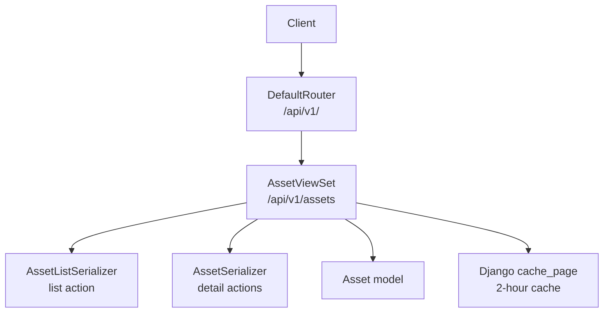
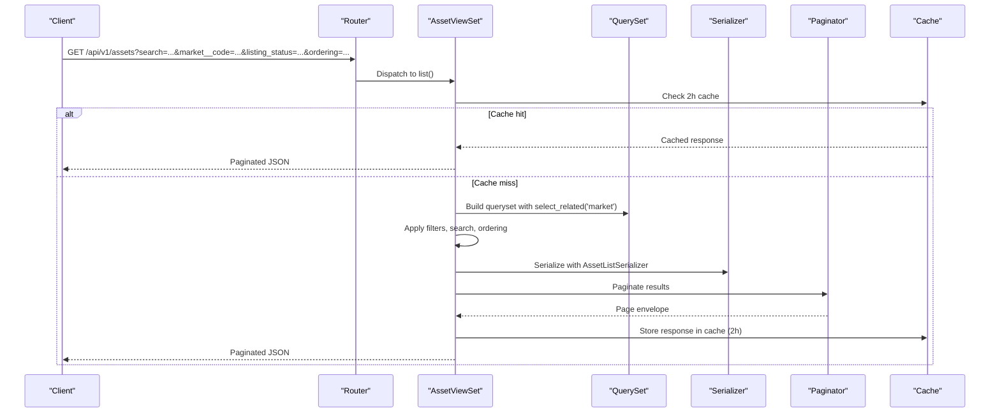
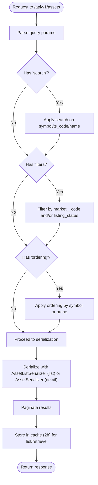
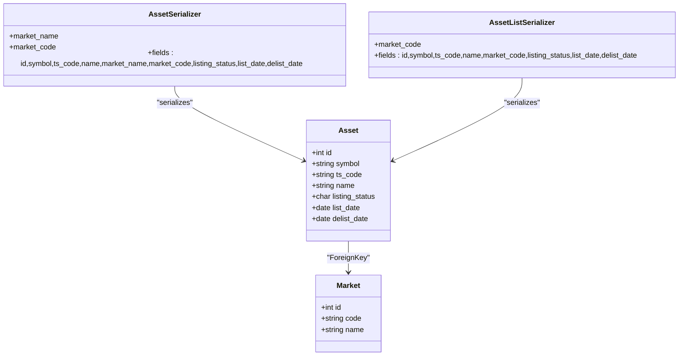
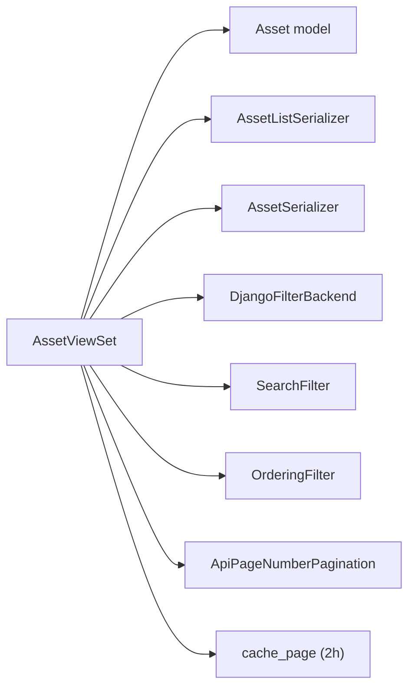

# Asset Management

<cite>
**Referenced Files in This Document**
- [views.py](file://apps/markets/views.py)
- [serializers.py](file://apps/markets/serializers.py)
- [models.py](file://apps/markets/models.py)
- [urls.py](file://config/urls.py)
- [pagination.py](file://apps/core/pagination.py)
- [base.py](file://config/settings/base.py)
</cite>

## Table of Contents
1. [Introduction](#introduction)
2. [Project Structure](#project-structure)
3. [Core Components](#core-components)
4. [Architecture Overview](#architecture-overview)
5. [Detailed Component Analysis](#detailed-component-analysis)
6. [Dependency Analysis](#dependency-analysis)
7. [Performance Considerations](#performance-considerations)
8. [Troubleshooting Guide](#troubleshooting-guide)
9. [Conclusion](#conclusion)
10. [Appendices](#appendices)

## Introduction
This document explains the asset CRUD operations exposed by the API, focusing on listing, retrieval, filtering, and search capabilities for assets. It details the AssetViewSet endpoints, supported query parameters (search by symbol, ts_code, name; filter by market__code and listing_status), ordering options, pagination behavior, serializer differences between list and detail views, and caching strategy. Request/response examples are provided to illustrate common queries.

## Project Structure
The asset functionality is implemented under the markets app:
- Views define the REST endpoints and behaviors for assets.
- Serializers control the shape of request/response payloads.
- Models define the data schema and relationships.
- URL routing registers the viewsets under /api/v1/assets.
- Pagination is configured globally via a custom paginator class.
- Global REST framework settings enable filtering, searching, ordering, and authentication.

**Diagram sources**
- [urls.py:74-78](file://config/urls.py#L74-L78)
- [views.py:32-56](file://apps/markets/views.py#L32-L56)
- [serializers.py:11-29](file://apps/markets/serializers.py#L11-L29)
- [models.py:19-62](file://apps/markets/models.py#L19-L62)

**Section sources**
- [urls.py:74-78](file://config/urls.py#L74-L78)
- [views.py:32-56](file://apps/markets/views.py#L32-L56)
- [serializers.py:11-29](file://apps/markets/serializers.py#L11-L29)
- [models.py:19-62](file://apps/markets/models.py#L19-L62)

## Core Components
- AssetViewSet: Read-only viewset for assets with search, filtering, and ordering.
- AssetSerializer: Full-detail fields including nested market info.
- AssetListSerializer: Lightweight fields optimized for list responses.
- Asset model: Defines asset attributes, choices for listing status, and relationships to Market.
- Pagination: Global page size and max page size configuration.
- Caching: View-level HTTP caching for list and retrieve actions.

Key behaviors:
- Search by symbol, ts_code, and name using free-text search.
- Filter by market__code and listing_status using exact match filters.
- Order by symbol or name; default order is by symbol.
- Use AssetListSerializer for list, AssetSerializer for detail.
- Apply 2-hour HTTP cache to list and retrieve.

**Section sources**
- [views.py:32-56](file://apps/markets/views.py#L32-L56)
- [serializers.py:11-29](file://apps/markets/serializers.py#L11-L29)
- [models.py:19-62](file://apps/markets/models.py#L19-L62)
- [pagination.py:4-7](file://apps/core/pagination.py#L4-L7)
- [base.py:266-301](file://config/settings/base.py#L266-L301)

## Architecture Overview
The Asset API follows a standard Django REST Framework pattern:
- Requests arrive at /api/v1/assets.
- The router dispatches to AssetViewSet based on HTTP method and path.
- Filtering/searching/ordering are applied via DRF backends.
- Responses are serialized using the appropriate serializer.
- Results are paginated using ApiPageNumberPagination.
- List and retrieve responses are cached for 2 hours.

**Diagram sources**
- [urls.py:74-78](file://config/urls.py#L74-L78)
- [views.py:32-56](file://apps/markets/views.py#L32-L56)
- [serializers.py:11-29](file://apps/markets/serializers.py#L11-L29)
- [pagination.py:4-7](file://apps/core/pagination.py#L4-L7)

## Detailed Component Analysis

### AssetViewSet
- Endpoints:
  - GET /api/v1/assets/ — list assets with pagination, filtering, search, ordering.
  - GET /api/v1/assets/{id}/ — retrieve a single asset.
- Query parameters:
  - search: Free-text search across symbol, ts_code, name.
  - market__code: Exact filter on market code.
  - listing_status: Exact filter on listing status (Active/Delisted).
  - ordering: Sort by symbol or name; prefix with - for descending.
- Behavior:
  - Uses select_related('market') to optimize joins.
  - Chooses AssetListSerializer for list and AssetSerializer for detail.
  - Applies 2-hour HTTP cache to list and retrieve.

**Diagram sources**
- [views.py:32-56](file://apps/markets/views.py#L32-L56)

**Section sources**
- [views.py:32-56](file://apps/markets/views.py#L32-L56)

### AssetSerializer vs AssetListSerializer
- AssetSerializer includes:
  - id, symbol, ts_code, name
  - market_name, market_code (read-only nested fields)
  - listing_status, list_date, delist_date
- AssetListSerializer includes:
  - id, symbol, ts_code, name
  - market_code (read-only)
  - listing_status, list_date, delist_date
- Difference:
  - List uses AssetListSerializer to reduce payload size and improve performance.
  - Detail uses AssetSerializer to include full market context.

**Diagram sources**
- [models.py:19-62](file://apps/markets/models.py#L19-L62)
- [serializers.py:11-29](file://apps/markets/serializers.py#L11-L29)

**Section sources**
- [serializers.py:11-29](file://apps/markets/serializers.py#L11-L29)
- [models.py:19-62](file://apps/markets/models.py#L19-L62)

### Pagination Behavior
- Default page size: 50
- Override parameter: page_size
- Maximum page size: 1000
- Page parameter: page (1-based)
- Response envelope includes count, next, previous, results

Example usage:
- GET /api/v1/assets/?page=2&page_size=100

**Section sources**
- [pagination.py:4-7](file://apps/core/pagination.py#L4-L7)
- [base.py:266-268](file://config/settings/base.py#L266-L268)

### Caching Strategy
- List and retrieve actions are cached for 2 hours using Django’s cache_page decorator.
- Cache backend is Redis per global settings.
- Benefits:
  - Reduces database load for frequent queries.
  - Improves latency for repeated requests within the cache window.

Notes:
- Cache keys are derived from the full request URL, so different query parameters produce separate cache entries.
- For bulk operations that mutate data, consider invalidating relevant cache keys if implemented elsewhere.

**Section sources**
- [views.py:50-56](file://apps/markets/views.py#L50-L56)
- [base.py:323-330](file://config/settings/base.py#L323-L330)

### Filtering and Searching
- Search fields: symbol, ts_code, name
- Filter fields: market__code, listing_status
- Ordering fields: symbol, name (default: symbol)

Examples:
- Search by partial name: ?search=kweichow
- Filter by market: ?market__code=SSE
- Filter by status: ?listing_status=A
- Order by name ascending: ?ordering=name
- Order by symbol descending: ?ordering=-symbol

**Section sources**
- [views.py:39-43](file://apps/markets/views.py#L39-L43)

### Request/Response Examples

Common list queries:
- List all assets, page 1, size 50:
  - GET /api/v1/assets/
- Search assets by symbol:
  - GET /api/v1/assets/?search=600519
- Filter by market code:
  - GET /api/v1/assets/?market__code=SZSE
- Filter by listing status:
  - GET /api/v1/assets/?listing_status=D
- Order by name:
  - GET /api/v1/assets/?ordering=name
- Combine filters and search:
  - GET /api/v1/assets/?search=maotai&market__code=SSE&listing_status=A&ordering=-symbol

Retrieve a single asset:
- GET /api/v1/assets/{id}/

Note: Bulk create/update/delete are not available because AssetViewSet is read-only.

[No sources needed since this section provides general guidance]

## Dependency Analysis
- AssetViewSet depends on:
  - Asset model for data access.
  - AssetSerializer and AssetListSerializer for output formatting.
  - DjangoFilterBackend, SearchFilter, OrderingFilter for query processing.
  - ApiPageNumberPagination for result pagination.
  - Django cache_page for HTTP caching.

**Diagram sources**
- [views.py:32-56](file://apps/markets/views.py#L32-L56)
- [serializers.py:11-29](file://apps/markets/serializers.py#L11-L29)
- [models.py:19-62](file://apps/markets/models.py#L19-L62)
- [pagination.py:4-7](file://apps/core/pagination.py#L4-L7)

**Section sources**
- [views.py:32-56](file://apps/markets/views.py#L32-L56)
- [serializers.py:11-29](file://apps/markets/serializers.py#L11-L29)
- [models.py:19-62](file://apps/markets/models.py#L19-L62)
- [pagination.py:4-7](file://apps/core/pagination.py#L4-L7)

## Performance Considerations
- Use AssetListSerializer for list endpoints to minimize payload size.
- Leverage select_related('market') to avoid N+1 queries when accessing market fields.
- Prefer specific filters (market__code, listing_status) and targeted searches to reduce result sets.
- Use pagination to handle large datasets; default page size is 50, maximum is 1000.
- Take advantage of 2-hour HTTP caching for repeated list/retrieve requests.
- Avoid overly broad searches; refine with additional filters where possible.

[No sources needed since this section provides general guidance]

## Troubleshooting Guide
- No results returned:
  - Verify search terms and filters; ensure market codes and listing statuses match expected values.
  - Check pagination parameters; ensure you are on the correct page.
- Unexpected field presence:
  - Confirm whether you are hitting list or detail endpoints; list uses AssetListSerializer, detail uses AssetSerializer.
- Slow responses:
  - Add filters to narrow results.
  - Use smaller page sizes or paginate through pages.
  - Ensure cache is enabled and not bypassed by unique query strings.
- Authentication issues:
  - Provide JWT token or API key as required by global settings.

[No sources needed since this section provides general guidance]

## Conclusion
The Asset API provides efficient, filtered, and searchable access to asset data with robust pagination and caching. Use AssetListSerializer for list operations and AssetSerializer for detailed views. Combine search, filters, and ordering to tailor results. The 2-hour cache improves performance for repeated queries. Since the viewset is read-only, bulk write operations are not supported.

[No sources needed since this section summarizes without analyzing specific files]

## Appendices

### Endpoint Reference
- Base path: /api/v1/assets
- Actions:
  - GET /api/v1/assets/ — list with pagination, search, filters, ordering
  - GET /api/v1/assets/{id}/ — retrieve single asset

[No sources needed since this section provides general guidance]