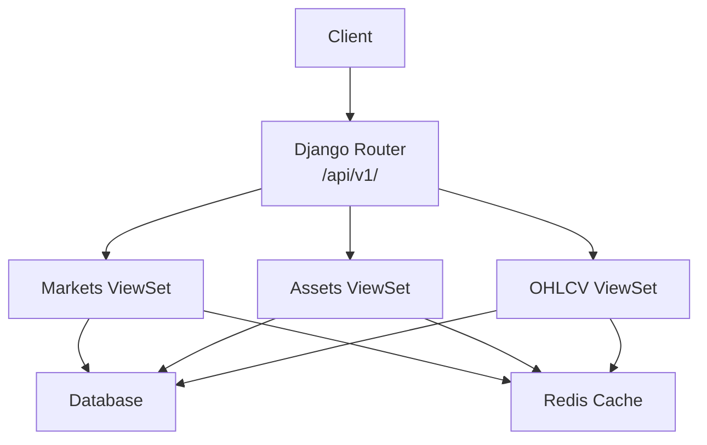
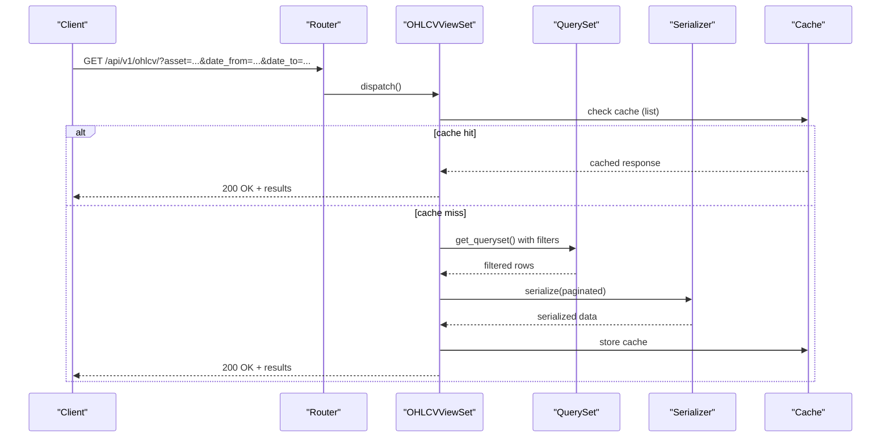
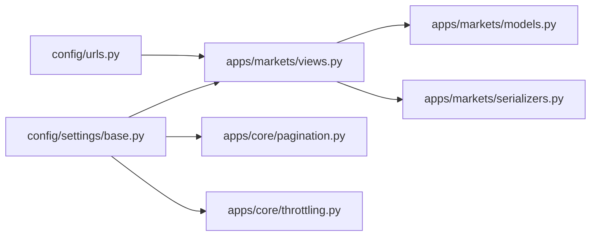

# Market Data API

<cite>
**Referenced Files in This Document**
- [config/urls.py](file://config/urls.py)
- [apps/markets/views.py](file://apps/markets/views.py)
- [apps/markets/serializers.py](file://apps/markets/serializers.py)
- [apps/markets/models.py](file://apps/markets/models.py)
- [config/settings/base.py](file://config/settings/base.py)
- [apps/core/pagination.py](file://apps/core/pagination.py)
- [apps/core/throttling.py](file://apps/core/throttling.py)
- [docs/reference/api.md](file://docs/reference/api.md)
</cite>

## Table of Contents
1. [Introduction](#introduction)
2. [Project Structure](#project-structure)
3. [Core Components](#core-components)
4. [Architecture Overview](#architecture-overview)
5. [Detailed Component Analysis](#detailed-component-analysis)
6. [Dependency Analysis](#dependency-analysis)
7. [Performance Considerations](#performance-considerations)
8. [Troubleshooting Guide](#troubleshooting-guide)
9. [Conclusion](#conclusion)

## Introduction
This document provides detailed API documentation for market data endpoints that support:
- Asset management (read-only access to assets and markets)
- OHLCV historical price retrieval with filtering by asset and date range
- Market overview endpoints via related models (markets, benchmark indices)

The API is versioned under /api/v1/ and exposes read-only viewsets for markets, assets, and OHLCV data. It supports pagination, filtering, searching, ordering, rate limiting, and server-side caching.

## Project Structure
Market data endpoints are implemented in the markets app and registered on a central router. The key files are:
- URL routing registers viewsets under /api/v1/
- ViewSets define list/retrieve behavior, filters, and caching
- Serializers define response shapes
- Models define data schema and indexes
- Settings configure pagination, throttling, authentication, and caching

**Diagram sources**
- [config/urls.py:74-78](file://config/urls.py#L74-L78)
- [apps/markets/views.py:16-105](file://apps/markets/views.py#L16-L105)
- [config/settings/base.py:323-330](file://config/settings/base.py#L323-L330)

**Section sources**
- [config/urls.py:74-78](file://config/urls.py#L74-L78)
- [apps/markets/views.py:16-105](file://apps/markets/views.py#L16-L105)
- [config/settings/base.py:266-301](file://config/settings/base.py#L266-L301)

## Core Components
- Markets endpoint: Read-only listing and detail for exchanges/markets
- Assets endpoint: Read-only listing and detail for instruments with search and filter support
- OHLCV endpoint: Read-only listing and detail for daily price bars with asset and date-range filters

Key capabilities:
- Pagination: page-based with configurable page size
- Filtering: exact match and lookups via DjangoFilterBackend
- Searching: free-text search on asset symbol/name/ts_code
- Ordering: sortable fields per endpoint
- Caching: server-side cache_page decorators for list/retrieve
- Rate limiting: tier-based daily limits

**Section sources**
- [apps/markets/views.py:16-105](file://apps/markets/views.py#L16-L105)
- [apps/markets/serializers.py:5-49](file://apps/markets/serializers.py#L5-L49)
- [apps/markets/models.py:4-226](file://apps/markets/models.py#L4-L226)
- [apps/core/pagination.py:1-7](file://apps/core/pagination.py#L1-L7)
- [docs/reference/api.md:136-184](file://docs/reference/api.md#L136-L184)

## Architecture Overview
The market data API uses DRF viewsets backed by Django models. Requests flow through the router to viewsets, which apply filters, ordering, and pagination before returning serialized responses. Caching is applied at the viewset level for list/retrieve operations.

**Diagram sources**
- [apps/markets/views.py:59-105](file://apps/markets/views.py#L59-L105)
- [apps/markets/serializers.py:32-49](file://apps/markets/serializers.py#L32-L49)
- [config/settings/base.py:323-330](file://config/settings/base.py#L323-L330)

## Detailed Component Analysis

### Markets Endpoint
- Base path: /api/v1/markets/
- Methods: GET (list), GET {id} (retrieve)
- Behavior: Read-only; caches list and retrieve for 24 hours
- Response fields: id, code, name

Example usage:
- List all markets: GET /api/v1/markets/
- Retrieve a specific market: GET /api/v1/markets/{id}/

Response shape:
- List: paginated envelope with results array containing market objects
- Detail: single market object

**Section sources**
- [config/urls.py:76-78](file://config/urls.py#L76-L78)
- [apps/markets/views.py:16-29](file://apps/markets/views.py#L16-L29)
- [apps/markets/serializers.py:5-8](file://apps/markets/serializers.py#L5-L8)

### Assets Endpoint
- Base path: /api/v1/assets/
- Methods: GET (list), GET {id} (retrieve)
- Filters:
  - market__code: exact match by market code
  - listing_status: exact match (Active/Delisted)
- Search: symbol, ts_code, name
- Ordering: symbol, name
- Behavior: Read-only; caches list and retrieve for 2 hours
- Response fields include asset identifiers, names, market info, listing status, and dates

Example usage:
- List assets in a market: GET /api/v1/assets/?market__code=SSE
- Search by name: GET /api/v1/assets/?search=kweichow
- Order by symbol descending: GET /api/v1/assets/?ordering=-symbol

Response shape:
- List: paginated envelope with lightweight asset objects
- Detail: full asset object including market_name and market_code

**Section sources**
- [config/urls.py:76-78](file://config/urls.py#L76-L78)
- [apps/markets/views.py:32-56](file://apps/markets/views.py#L32-L56)
- [apps/markets/serializers.py:11-29](file://apps/markets/serializers.py#L11-L29)
- [apps/markets/models.py:19-62](file://apps/markets/models.py#L19-L62)

### OHLCV Endpoint
- Base path: /api/v1/ohlcv/
- Methods: GET (list), GET {id} (retrieve)
- Filters:
  - asset: exact match by asset ID
  - date: exact match or lookup filters (e.g., date__gte, date__lte)
- Custom query params:
  - asset: filter by asset ID
  - date_from: inclusive lower bound
  - date_to: inclusive upper bound
- Ordering: date (descending default)
- Behavior: Read-only; caches list and retrieve for 2 hours
- Response fields include date, open, high, low, close, volume (list) and additional fields (detail)

Example usage:
- Get last 30 days for an asset: GET /api/v1/ohlcv/?asset=12&date_from=YYYY-MM-DD&date_to=YYYY-MM-DD
- Get all records for an asset: GET /api/v1/ohlcv/?asset=12

Response shape:
- List: paginated envelope with lightweight OHLCV objects
- Detail: full OHLCV object including asset identifiers and amount

**Section sources**
- [config/urls.py:76-78](file://config/urls.py#L76-L78)
- [apps/markets/views.py:59-105](file://apps/markets/views.py#L59-L105)
- [apps/markets/serializers.py:32-49](file://apps/markets/serializers.py#L32-L49)
- [apps/markets/models.py:201-226](file://apps/markets/models.py#L201-L226)

### Market Overview Endpoints
While there is no dedicated “overview” viewset, market context can be derived from:
- Markets list/detail for exchange metadata
- Assets list/detail for instrument metadata
- BenchmarkIndexDaily model for official index history (not exposed via a dedicated viewset here)
- PointInTimeBenchmarkDaily model for internal benchmark series (not exposed via a dedicated viewset here)

For index-related queries, use the asset and OHLCV endpoints with appropriate filters and combine with external index constituents if needed.

**Section sources**
- [apps/markets/models.py:147-190](file://apps/markets/models.py#L147-L190)
- [docs/reference/api.md:326-348](file://docs/reference/api.md#L326-L348)

## Dependency Analysis
- URLs register viewsets under /api/v1/
- ViewSets depend on models and serializers
- Global settings configure pagination, throttling, authentication, and rendering
- Caching uses Redis

**Diagram sources**
- [config/urls.py:74-78](file://config/urls.py#L74-L78)
- [apps/markets/views.py:1-105](file://apps/markets/views.py#L1-L105)
- [config/settings/base.py:266-301](file://config/settings/base.py#L266-L301)

**Section sources**
- [config/urls.py:74-78](file://config/urls.py#L74-L78)
- [config/settings/base.py:266-301](file://config/settings/base.py#L266-L301)

## Performance Considerations
- Pagination: Use page and page_size parameters to limit payload size. Default page size is 50; maximum allowed is 1000.
- Filtering: Prefer exact filters (asset, market__code) and date ranges (date_from/date_to or date__gte/date__lte) to reduce result sets.
- Ordering: Use ordering to optimize client consumption patterns (e.g., newest first).
- Caching: List and retrieve endpoints are cached server-side. For fresh data after backfills, append a unique query parameter to bypass cache.
- Rate limiting: Respect tier-based daily limits. If you receive 429 errors, implement retry with exponential backoff and respect Retry-After headers.

[No sources needed since this section provides general guidance]

## Troubleshooting Guide
Common issues and resolutions:
- 401 Unauthorized: Ensure JWT Bearer token or API Key is provided for write endpoints; read endpoints may be open depending on permissions.
- 403 Forbidden: Insufficient permissions for the requested action.
- 404 Not Found: Invalid primary key or non-existent resource.
- 429 Too Many Requests: Exceeded daily rate limit. Check your subscription tier and throttle scope. Implement retries respecting Retry-After.
- Validation errors: Field-specific messages returned in JSON body.

Rate limiting details:
- Tiers: anon, auth, free, pro, premium, user
- Limits: 100/day (anon/auth/free), 1000/day (pro/user), 10000/day (premium)
- Counters stored in Redis; per-user usage persisted and accessible via users/usage

Caching notes:
- Markets: 24h TTL
- Assets and OHLCV: 2h TTL
- To force fresh reads, add a nonce query parameter or flush cache.

**Section sources**
- [docs/reference/api.md:188-239](file://docs/reference/api.md#L188-L239)
- [config/settings/base.py:266-301](file://config/settings/base.py#L266-L301)
- [apps/core/throttling.py:1-88](file://apps/core/throttling.py#L1-L88)

## Conclusion
The market data API provides robust read-only access to markets, assets, and OHLCV data with strong filtering, pagination, and performance features like caching and rate limiting. Use the documented query parameters to efficiently retrieve historical prices and asset metadata. For market overviews, combine markets and assets endpoints and leverage available models for index context where applicable.

[No sources needed since this section summarizes without analyzing specific files]