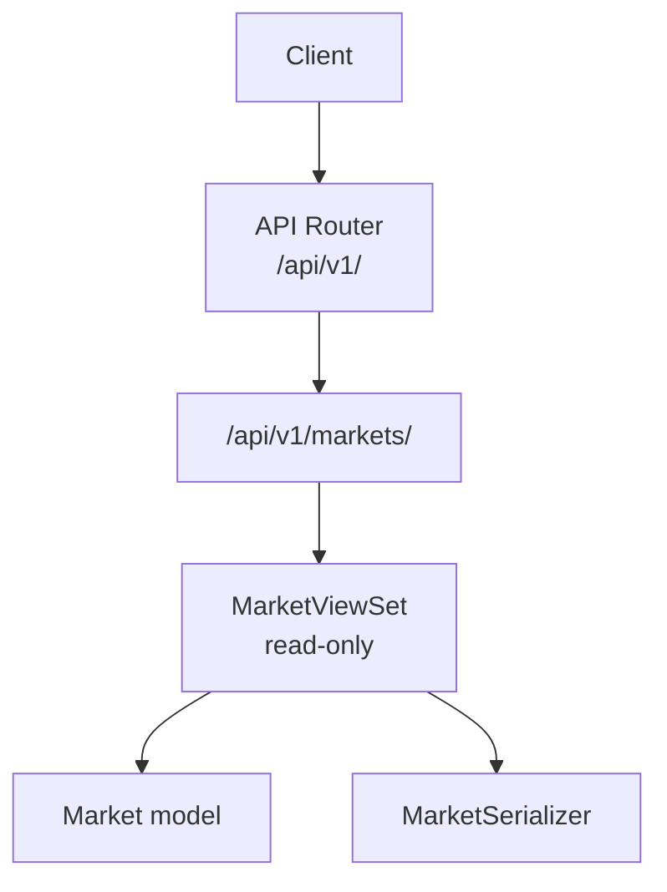
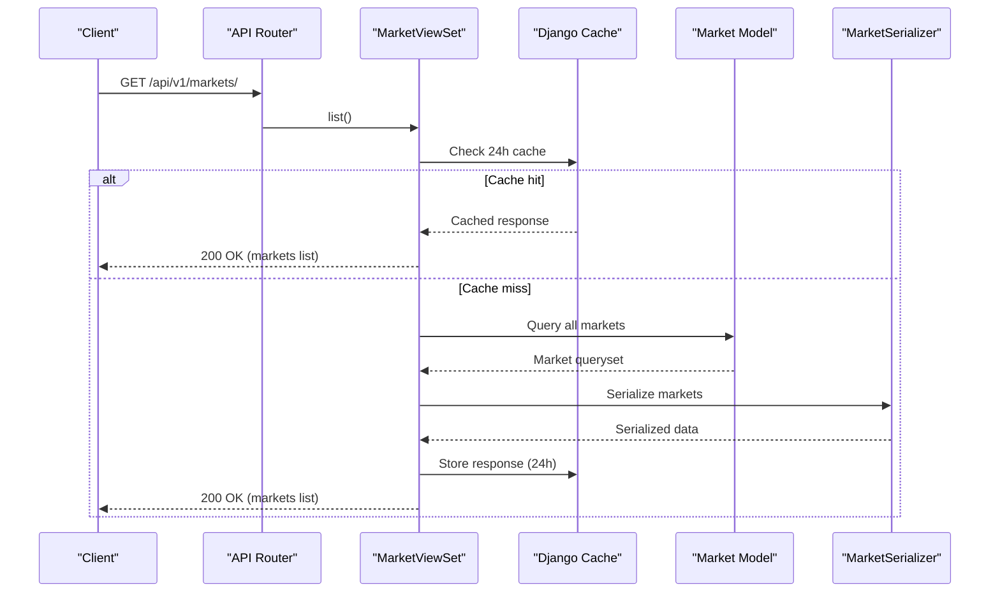
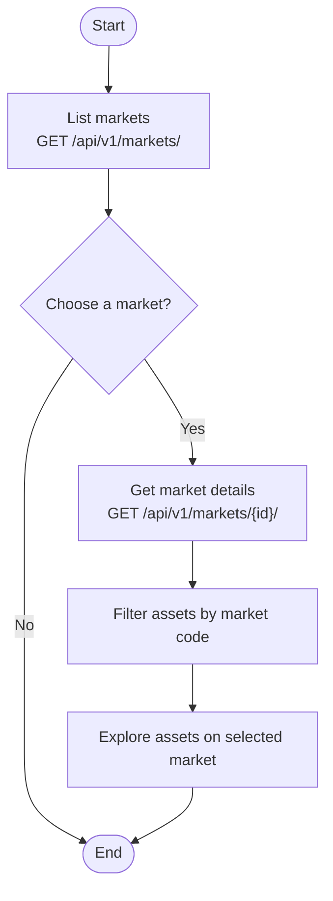
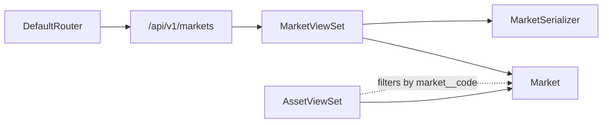

# Market Overview

<cite>
**Referenced Files in This Document**
- [views.py](file://apps/markets/views.py)
- [serializers.py](file://apps/markets/serializers.py)
- [models.py](file://apps/markets/models.py)
- [urls.py](file://config/urls.py)
</cite>

## Table of Contents
1. [Introduction](#introduction)
2. [Project Structure](#project-structure)
3. [Core Components](#core-components)
4. [Architecture Overview](#architecture-overview)
5. [Detailed Component Analysis](#detailed-component-analysis)
6. [Dependency Analysis](#dependency-analysis)
7. [Performance Considerations](#performance-considerations)
8. [Troubleshooting Guide](#troubleshooting-guide)
9. [Conclusion](#conclusion)
10. [Appendices](#appendices)

## Introduction
This document explains the market overview endpoints that expose available markets and exchanges for discovery and navigation. It focuses on the read-only MarketViewSet, its 24-hour caching strategy, the MarketSerializer structure, and how markets relate to assets. It also provides practical examples for querying market listings, retrieving individual market details, understanding market codes and identifiers, and common use cases such as discovering exchanges and navigating assets by market.

## Project Structure
The market overview functionality is implemented in the markets app and exposed via a REST API router:
- ViewSet and caching logic are defined in the views module.
- Data serialization is handled by the serializers module.
- Domain models (Market, Asset, OHLCV) define the data schema and relationships.
- The URL router registers the MarketViewSet under the api/v1 prefix.

**Diagram sources**
- [urls.py:74-78](file://config/urls.py#L74-L78)
- [views.py:16-29](file://apps/markets/views.py#L16-L29)
- [serializers.py:5-9](file://apps/markets/serializers.py#L5-L9)
- [models.py:4-17](file://apps/markets/models.py#L4-L17)

**Section sources**
- [urls.py:74-78](file://config/urls.py#L74-L78)
- [views.py:16-29](file://apps/markets/views.py#L16-L29)
- [serializers.py:5-9](file://apps/markets/serializers.py#L5-L9)
- [models.py:4-17](file://apps/markets/models.py#L4-L17)

## Core Components
- MarketViewSet: A read-only viewset exposing market metadata with list and retrieve actions. Both actions are cached for 24 hours to reduce database load and improve response times.
- MarketSerializer: Serializes Market objects to include id, code, and name fields.
- Market model: Represents an exchange or market with a unique code and a human-readable name.
- Relationship to assets: Assets belong to a Market via a foreign key; this relationship enables filtering assets by market code and building market-centric navigation flows.

Key behaviors:
- Read-only access: Only list and retrieve operations are supported.
- Caching: 24-hour cache applied to both list and retrieve responses using Django’s cache_page decorator.
- Filtering and search: While MarketViewSet itself does not add filters, related AssetViewSet supports filtering by market__code, enabling market-based asset discovery.

**Section sources**
- [views.py:16-29](file://apps/markets/views.py#L16-L29)
- [serializers.py:5-9](file://apps/markets/serializers.py#L5-L9)
- [models.py:4-17](file://apps/markets/models.py#L4-L17)
- [models.py:19-62](file://apps/markets/models.py#L19-L62)

## Architecture Overview
The market overview flow involves the client requesting market data through the API router, which delegates to MarketViewSet. The viewset uses MarketSerializer to serialize Market instances from the database. Responses are cached for 24 hours to optimize performance.

**Diagram sources**
- [urls.py:74-78](file://config/urls.py#L74-L78)
- [views.py:16-29](file://apps/markets/views.py#L16-L29)
- [serializers.py:5-9](file://apps/markets/serializers.py#L5-L9)
- [models.py:4-17](file://apps/markets/models.py#L4-L17)

## Detailed Component Analysis

### MarketViewSet
- Purpose: Provide read-only access to market metadata (list and retrieve).
- Caching: Both list and retrieve methods are wrapped with a 24-hour cache decorator to minimize repeated queries.
- Behavior: Inherits standard DRF ReadOnlyModelViewSet behavior; no custom filtering or authentication beyond application defaults.

Example usage:
- List markets: GET /api/v1/markets/
- Retrieve a specific market: GET /api/v1/markets/{id}/

Notes:
- The endpoint returns serialized market objects including id, code, and name.
- Because it is read-only, write operations are not permitted.

**Section sources**
- [views.py:16-29](file://apps/markets/views.py#L16-L29)

### MarketSerializer
- Fields: id, code, name.
- Role: Converts Market model instances into JSON for API responses.
- Design: Simple model serializer with explicit field selection to avoid exposing unnecessary data.

Use cases:
- Displaying a list of exchanges in UI components.
- Populating dropdowns or filters based on available markets.

**Section sources**
- [serializers.py:5-9](file://apps/markets/serializers.py#L5-L9)

### Market Model
- Fields:
  - code: Unique identifier for the market/exchange (e.g., SSE, SZSE).
  - name: Human-readable market name.
- Relationships:
  - One-to-many with Asset via foreign key; each asset belongs to one market.
- Constraints:
  - code is unique to ensure consistent identification across systems.

Implications:
- Market code can be used to filter assets and build market-specific navigation flows.
- Name provides user-friendly display values.

**Section sources**
- [models.py:4-17](file://apps/markets/models.py#L4-L17)
- [models.py:19-62](file://apps/markets/models.py#L19-L62)

### Relationship Between Markets and Assets
- Assets reference a Market via a foreign key, enabling:
  - Filtering assets by market code.
  - Building market-centric dashboards and lists.
  - Discovering assets listed on specific exchanges.

Practical patterns:
- Use market code to narrow asset searches when presenting exchange-specific lists.
- Combine market listing with asset listing to provide navigation from markets to their assets.

**Section sources**
- [models.py:19-62](file://apps/markets/models.py#L19-L62)

### Example Queries and Workflows

- Query market listings:
  - Endpoint: GET /api/v1/markets/
  - Response: Array of markets with id, code, name.
  - Use case: Populate exchange selector in UI.

- Retrieve individual market details:
  - Endpoint: GET /api/v1/markets/{id}/
  - Response: Single market object with id, code, name.
  - Use case: Show detailed info about a specific exchange.

- Navigate assets by market:
  - After obtaining market code, query assets filtered by market__code.
  - Use case: Display all stocks listed on a particular exchange.

- Understand market codes and identifiers:
  - code is the canonical identifier for a market; use it consistently across requests and integrations.
  - name is for display purposes only.

[No sources needed since this section provides conceptual guidance]

### Conceptual Overview

[No sources needed since this diagram shows conceptual workflow, not actual code structure]

## Dependency Analysis
The market overview depends on:
- DRF router registration mapping /api/v1/markets to MarketViewSet.
- MarketViewSet depending on Market model and MarketSerializer.
- AssetViewSet supporting market-based filtering via market__code, complementing market discovery.

**Diagram sources**
- [urls.py:74-78](file://config/urls.py#L74-L78)
- [views.py:16-29](file://apps/markets/views.py#L16-L29)
- [views.py:32-56](file://apps/markets/views.py#L32-L56)
- [models.py:4-17](file://apps/markets/models.py#L4-L17)
- [models.py:19-62](file://apps/markets/models.py#L19-L62)

**Section sources**
- [urls.py:74-78](file://config/urls.py#L74-L78)
- [views.py:16-29](file://apps/markets/views.py#L16-L29)
- [views.py:32-56](file://apps/markets/views.py#L32-L56)
- [models.py:4-17](file://apps/markets/models.py#L4-L17)
- [models.py:19-62](file://apps/markets/models.py#L19-L62)

## Performance Considerations
- Caching: Market list and retrieve responses are cached for 24 hours, reducing database queries and improving latency for frequently accessed market metadata.
- Read-only design: Minimizes write overhead and simplifies consistency concerns.
- Efficient serialization: MarketSerializer exposes only necessary fields to keep payloads small.
- Related asset filtering: Using market__code to filter assets avoids loading unnecessary data and leverages database indexes where applicable.

[No sources needed since this section provides general guidance]

## Troubleshooting Guide
Common issues and resolutions:
- Stale market data: If market metadata changes infrequently, rely on the 24-hour cache. For immediate updates, consider cache invalidation strategies at the deployment level.
- Incorrect market code usage: Ensure you use the canonical market code (not the name) for filtering assets to maintain consistency.
- Missing assets after market selection: Verify that assets exist for the selected market and that listing status includes active assets if relevant.

[No sources needed since this section provides general guidance]

## Conclusion
The market overview endpoints provide a simple, efficient way to discover available markets and navigate to assets within those markets. With read-only access, clear serialization, and robust 24-hour caching, clients can reliably list markets, retrieve details, and use market codes to explore associated assets. This foundation supports market-driven navigation and discovery workflows across the application.

[No sources needed since this section summarizes without analyzing specific files]

## Appendices

### API Endpoints Summary
- List markets: GET /api/v1/markets/
- Retrieve market: GET /api/v1/markets/{id}/
- Related asset discovery: GET /api/v1/assets/?market__code={CODE}

[No sources needed since this section provides general guidance]