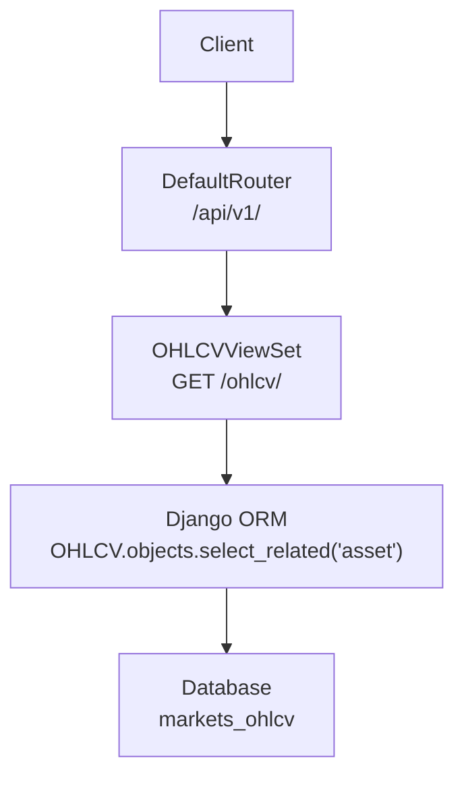
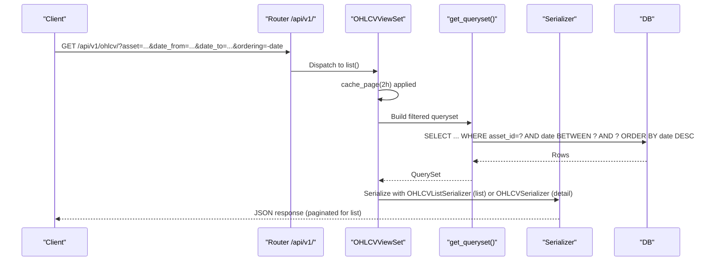
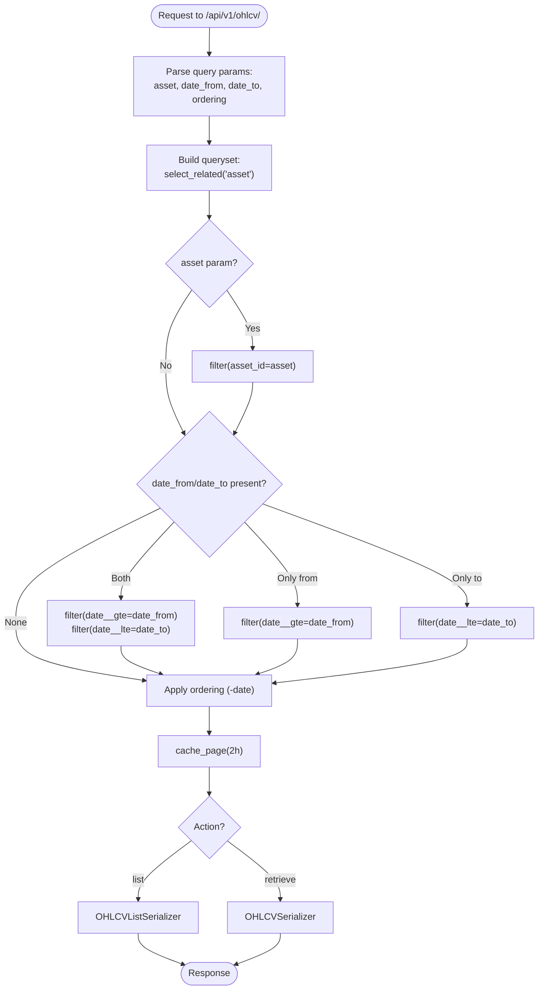
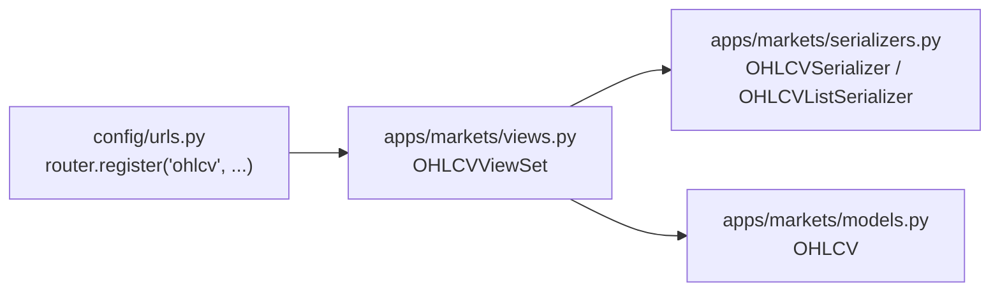

# OHLCV Historical Data

<cite>
**Referenced Files in This Document**
- [views.py](file://apps/markets/views.py)
- [serializers.py](file://apps/markets/serializers.py)
- [models.py](file://apps/markets/models.py)
- [urls.py](file://config/urls.py)
- [api.md](file://docs/reference/api.md)
</cite>

## Table of Contents
1. [Introduction](#introduction)
2. [Project Structure](#project-structure)
3. [Core Components](#core-components)
4. [Architecture Overview](#architecture-overview)
5. [Detailed Component Analysis](#detailed-component-analysis)
6. [Dependency Analysis](#dependency-analysis)
7. [Performance Considerations](#performance-considerations)
8. [Troubleshooting Guide](#troubleshooting-guide)
9. [Conclusion](#conclusion)

## Introduction
This document explains the OHLCV (Open, High, Low, Close, Volume) historical price data retrieval endpoint. It covers how to filter by asset and date range using query parameters, how ordering works, which serializers are used for list versus detail responses, and how caching affects response freshness. It also provides usage examples and performance guidance suitable for time series analysis.

## Project Structure
The OHLCV endpoint is implemented as a read-only viewset in the markets app and exposed via the API router under /api/v1/.

**Diagram sources**
- [urls.py:74-78](file://config/urls.py#L74-L78)
- [views.py:59-105](file://apps/markets/views.py#L59-L105)
- [models.py:201-226](file://apps/markets/models.py#L201-L226)

**Section sources**
- [urls.py:74-78](file://config/urls.py#L74-L78)
- [views.py:59-105](file://apps/markets/views.py#L59-L105)
- [models.py:201-226](file://apps/markets/models.py#L201-L226)

## Core Components
- OHLCVViewSet: Read-only viewset that serves daily OHLCV records with filtering, ordering, pagination, and caching.
- Serializers:
  - OHLCVSerializer: Full detail fields including asset symbol/name and adjusted close/amount.
  - OHLCVListSerializer: Lightweight list fields optimized for time series payloads.
- Model: OHLCV stores daily Open, High, Low, Close, Adjusted Close, Volume, and Amount per asset and date.

Key behaviors:
- Filtering:
  - By asset ID via query parameter asset.
  - By date range via date_from and date_to.
- Ordering:
  - Default order is newest first by date (descending).
- Serializer selection:
  - List action uses OHLCVListSerializer; detail actions use OHLCVSerializer.
- Caching:
  - Both list and retrieve actions are cached for 2 hours.

**Section sources**
- [views.py:59-105](file://apps/markets/views.py#L59-L105)
- [serializers.py:32-49](file://apps/markets/serializers.py#L32-L49)
- [models.py:201-226](file://apps/markets/models.py#L201-L226)

## Architecture Overview
The request flow for retrieving OHLCV history:

**Diagram sources**
- [urls.py:74-78](file://config/urls.py#L74-L78)
- [views.py:59-105](file://apps/markets/views.py#L59-L105)
- [serializers.py:32-49](file://apps/markets/serializers.py#L32-L49)
- [models.py:201-226](file://apps/markets/models.py#L201-L226)

## Detailed Component Analysis

### OHLCVViewSet
Responsibilities:
- Exposes a read-only endpoint for OHLCV data.
- Applies filters for asset and date range.
- Orders results by date descending by default.
- Selects appropriate serializer based on action.
- Caches list and retrieve responses for 2 hours.

Filtering logic:
- asset: exact match on asset ID.
- date_from: inclusive lower bound on date.
- date_to: inclusive upper bound on date.

Ordering:
- Default ordering is by date descending.
- The API supports standard ordering parameters; clients can override if needed.

Serializer selection:
- List action returns OHLCVListSerializer for a compact payload.
- Detail actions return OHLCVSerializer with extended fields.

Caching:
- Both list and retrieve are cached for 2 hours.

**Diagram sources**
- [views.py:59-105](file://apps/markets/views.py#L59-L105)

**Section sources**
- [views.py:59-105](file://apps/markets/views.py#L59-L105)

### Serializers
- OHLCVSerializer: Includes asset identifiers and full OHLCV fields such as adjusted close and amount.
- OHLCVListSerializer: Minimal set of fields optimized for time series lists: date, open, high, low, close, volume.

Use cases:
- Use list endpoints for charting and backtesting where only core OHLCV fields are needed.
- Use detail endpoints when you need additional context like asset name/symbol or adjusted close/amount.

**Section sources**
- [serializers.py:32-49](file://apps/markets/serializers.py#L32-L49)

### Model and Indexing
- OHLCV model stores daily bars per asset with unique constraint on (asset, date).
- Indexed on (asset, date) to optimize range queries and lookups by asset.
- Default ordering is by date descending at the model level.

**Section sources**
- [models.py:201-226](file://apps/markets/models.py#L201-L226)

## Dependency Analysis
- URL routing registers the OHLCVViewSet under /api/v1/ohlcv/.
- ViewSet depends on:
  - Django REST Framework viewsets and filters.
  - Django’s cache_page decorator for response caching.
  - Models and serializers defined in the markets app.

**Diagram sources**
- [urls.py:74-78](file://config/urls.py#L74-L78)
- [views.py:59-105](file://apps/markets/views.py#L59-L105)
- [serializers.py:32-49](file://apps/markets/serializers.py#L32-L49)
- [models.py:201-226](file://apps/markets/models.py#L201-L226)

**Section sources**
- [urls.py:74-78](file://config/urls.py#L74-L78)
- [views.py:59-105](file://apps/markets/views.py#L59-L105)

## Performance Considerations
- Pagination: All list endpoints paginate. Use page and page_size to control result size. The documentation specifies a default page size and maximum limits.
- Filtering: Always filter by asset and narrow date ranges with date_from and date_to to minimize row scans.
- Ordering: Default ordering is by date descending; avoid unnecessary reordering unless required.
- Caching: Responses are cached for 2 hours. For fresh data after backfills or repairs, bypass cache by appending a unique query parameter or flushing the cache backend.
- Database indexes: Queries against asset and date benefit from the composite index on (asset, date).

Practical tips:
- For time series analysis, prefer list endpoints with OHLCVListSerializer to reduce payload size.
- Combine asset filtering with tight date ranges to keep queries efficient.
- If you must fetch large histories, paginate and process in chunks.

**Section sources**
- [api.md:136-164](file://docs/reference/api.md#L136-L164)
- [api.md:225-239](file://docs/reference/api.md#L225-L239)
- [views.py:59-105](file://apps/markets/views.py#L59-L105)
- [models.py:201-226](file://apps/markets/models.py#L201-L226)

## Troubleshooting Guide
Common issues and resolutions:
- Empty results:
  - Ensure asset exists and has OHLCV data.
  - Verify date_from and date_to are valid dates and within available data range.
- Unexpected ordering:
  - Confirm ordering parameter is not overriding the default descending date order.
- Stale data:
  - Responses may be cached for up to 2 hours. Append a unique query parameter to bypass cache or flush the cache backend after data updates.
- Rate limiting:
  - Excessive requests may be throttled. Respect rate limits and implement client-side retries with backoff.

Cache bypass technique:
- Add a unique query parameter (for example, a nonce) to force a non-cached response when you need the latest data immediately after a repair or backfill.

**Section sources**
- [api.md:225-239](file://docs/reference/api.md#L225-L239)
- [views.py:99-105](file://apps/markets/views.py#L99-L105)

## Conclusion
The OHLCV endpoint provides a robust, efficient way to retrieve historical price data for time series analysis. Use asset and date range filters to scope queries, rely on default descending date ordering, and choose the appropriate serializer for your needs. Leverage pagination and caching to optimize performance, and bypass cache when you require fresh data after maintenance operations.