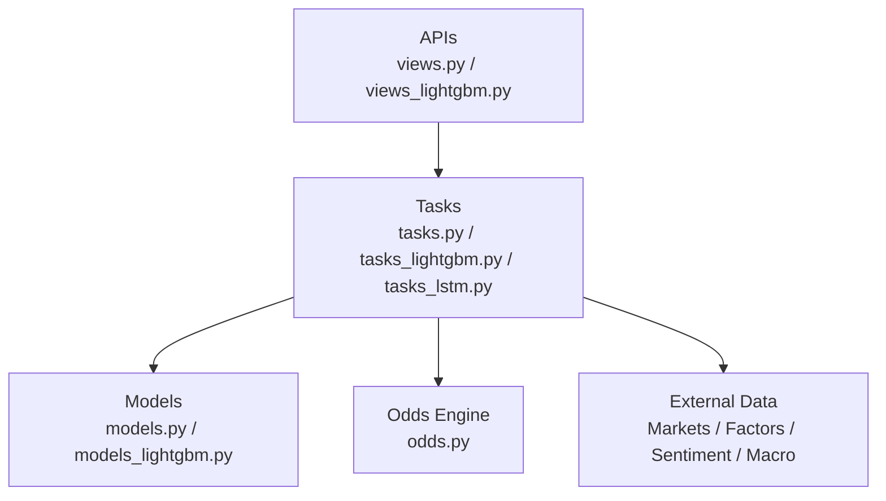
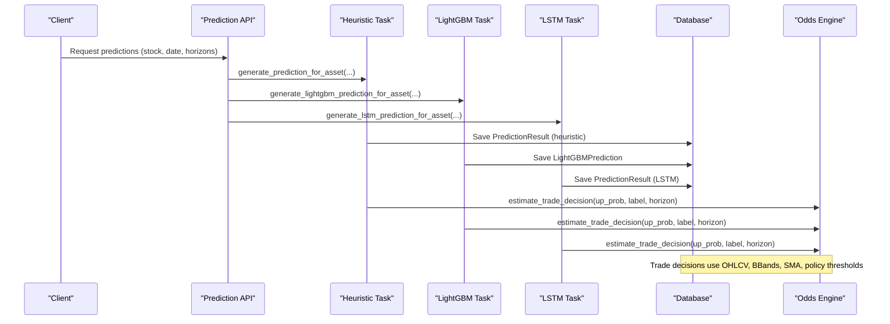
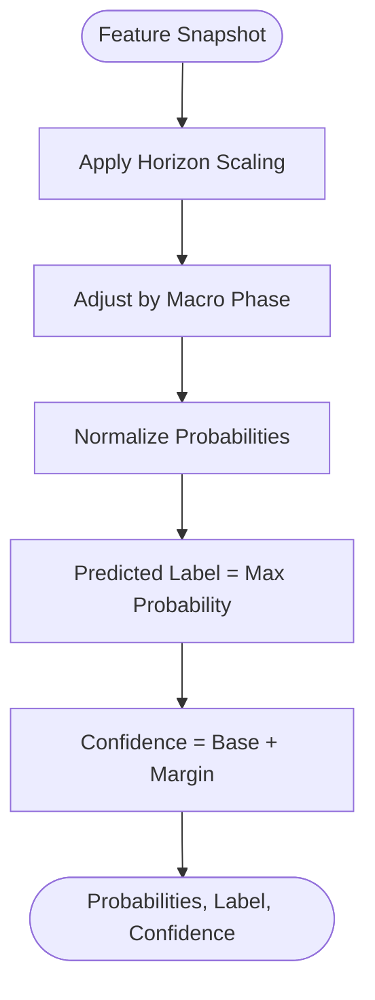
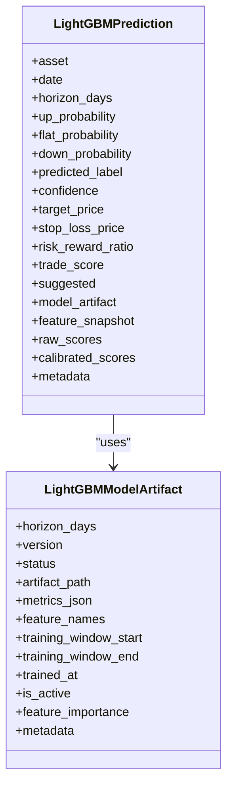
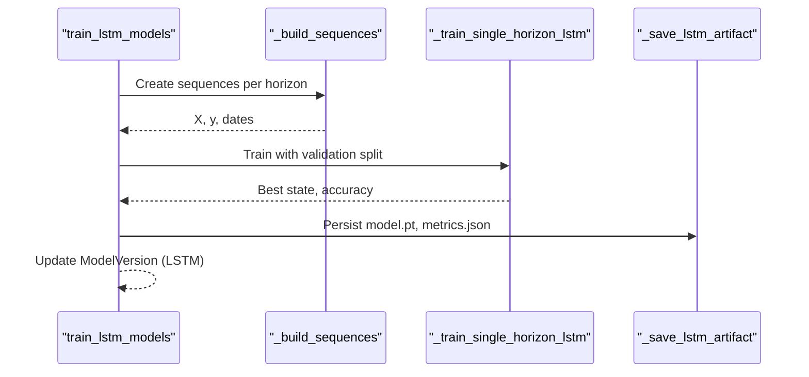
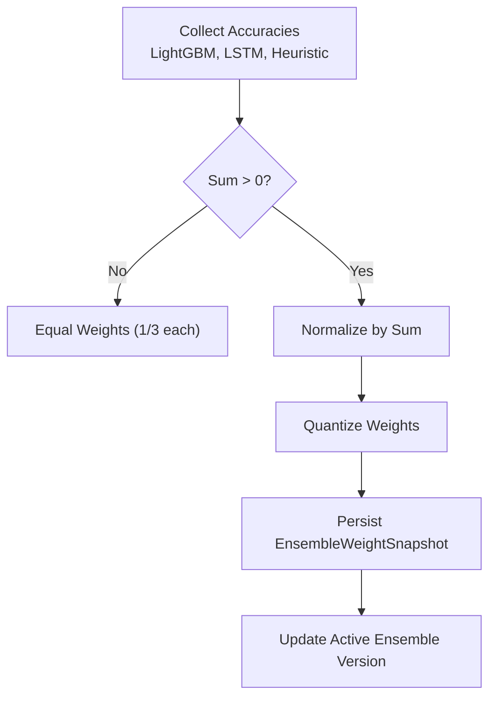
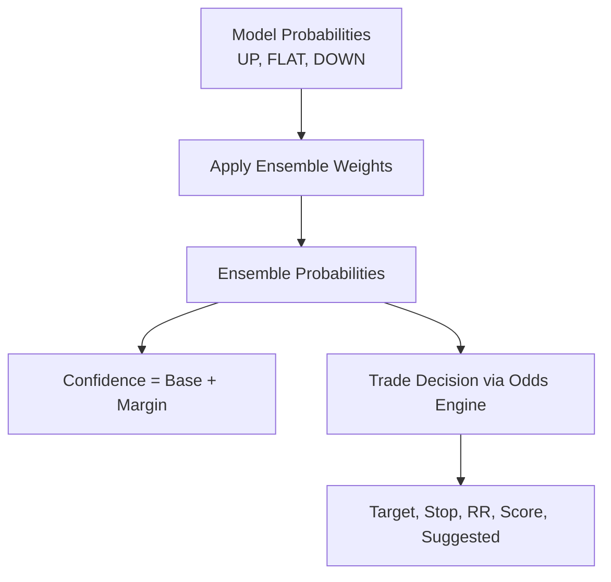
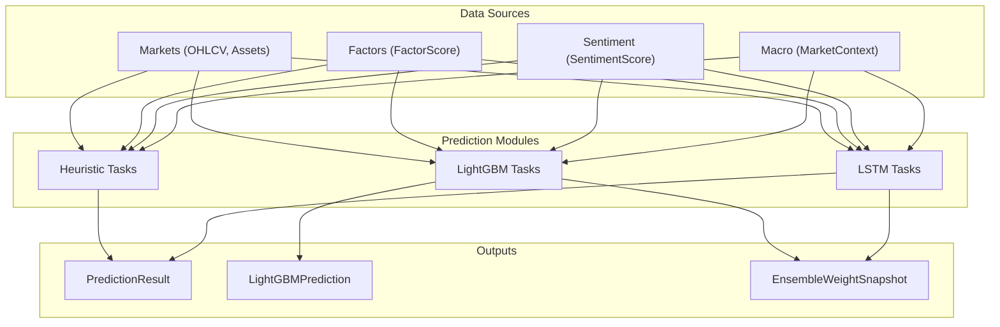

# Ensemble Weighting & Model Combination

<cite>
**Referenced Files in This Document**
- [models.py](file://apps/prediction/models.py)
- [models_lightgbm.py](file://apps/prediction/models_lightgbm.py)
- [tasks.py](file://apps/prediction/tasks.py)
- [tasks_lightgbm.py](file://apps/prediction/tasks_lightgbm.py)
- [tasks_lstm.py](file://apps/prediction/tasks_lstm.py)
- [views.py](file://apps/prediction/views.py)
- [views_lightgbm.py](file://apps/prediction/views_lightgbm.py)
- [odds.py](file://apps/prediction/odds.py)
</cite>

## Table of Contents
1. [Introduction](#introduction)
2. [Project Structure](#project-structure)
3. [Core Components](#core-components)
4. [Architecture Overview](#architecture-overview)
5. [Detailed Component Analysis](#detailed-component-analysis)
6. [Dependency Analysis](#dependency-analysis)
7. [Performance Considerations](#performance-considerations)
8. [Troubleshooting Guide](#troubleshooting-guide)
9. [Conclusion](#conclusion)
10. [Appendices](#appendices)

## Introduction
This document explains the ensemble weighting system that combines predictions from three model types:
- Heuristic baseline (feature-driven probability estimator)
- LightGBM (tree-based classifier with calibration)
- LSTM (sequence model with softmax probabilities)

The system computes per-asset, per-horizon (3-day, 7-day, 30-day) probabilities for UP, FLAT, and DOWN outcomes. It then derives ensemble confidence scores and trade decisions. The ensemble weights are dynamically refreshed based on recent performance metrics and persisted as snapshots for auditability.

## Project Structure
The ensemble pipeline spans several modules:
- Data models define prediction results, model versions, and weight snapshots.
- Tasks implement training and inference for each model type and refresh ensemble weights.
- Views expose APIs to trigger training/inference and retrieve predictions and weights.
- Odds utilities convert probabilities into actionable trade parameters.

**Diagram sources**
- [views.py:27-162](file://apps/prediction/views.py#L27-L162)
- [views_lightgbm.py:124-282](file://apps/prediction/views_lightgbm.py#L124-L282)
- [tasks.py:149-327](file://apps/prediction/tasks.py#L149-L327)
- [tasks_lightgbm.py:2105-2304](file://apps/prediction/tasks_lightgbm.py#L2105-L2304)
- [tasks_lstm.py:829-967](file://apps/prediction/tasks_lstm.py#L829-L967)
- [models.py:7-107](file://apps/prediction/models.py#L7-L107)
- [models_lightgbm.py:7-137](file://apps/prediction/models_lightgbm.py#L7-L137)
- [odds.py:60-158](file://apps/prediction/odds.py#L60-L158)

**Section sources**
- [views.py:27-162](file://apps/prediction/views.py#L27-L162)
- [views_lightgbm.py:124-282](file://apps/prediction/views_lightgbm.py#L124-L282)
- [models.py:7-107](file://apps/prediction/models.py#L7-L107)
- [models_lightgbm.py:7-137](file://apps/prediction/models_lightgbm.py#L7-L137)
- [tasks.py:149-327](file://apps/prediction/tasks.py#L149-L327)
- [tasks_lightgbm.py:2105-2304](file://apps/prediction/tasks_lightgbm.py#L2105-L2304)
- [tasks_lstm.py:829-967](file://apps/prediction/tasks_lstm.py#L829-L967)
- [odds.py:60-158](file://apps/prediction/odds.py#L60-L158)

## Core Components
- PredictionResult stores heuristic and LSTM outputs per asset/date/horizon, including probabilities, label, confidence, and trade decision fields.
- LightGBMPrediction stores LightGBM outputs with raw and calibrated scores.
- EnsembleWeightSnapshot records daily ensemble weights and basis metrics used to compute them.
- ModelVersion tracks active model artifacts across HEURISTIC (ENSEMBLE), LIGHTGBM, and LSTM types.

Key responsibilities:
- Heuristic baseline: feature-driven probability estimation with horizon scaling and macro adjustments.
- LightGBM: trained tree model with calibration; produces calibrated probabilities and confidence.
- LSTM: sequence model producing softmax probabilities and confidence.
- Ensemble weights: normalized by recent accuracy across model types; persisted for auditing.

**Section sources**
- [models.py:43-107](file://apps/prediction/models.py#L43-L107)
- [models_lightgbm.py:41-137](file://apps/prediction/models_lightgbm.py#L41-L137)
- [tasks.py:82-127](file://apps/prediction/tasks.py#L82-L127)
- [tasks_lightgbm.py:631-730](file://apps/prediction/tasks_lightgbm.py#L631-L730)
- [tasks_lstm.py:371-442](file://apps/prediction/tasks_lstm.py#L371-L442)

## Architecture Overview
The ensemble architecture integrates three model streams and a dynamic weighting mechanism:

**Diagram sources**
- [views.py:37-97](file://apps/prediction/views.py#L37-L97)
- [views_lightgbm.py:136-193](file://apps/prediction/views_lightgbm.py#L136-L193)
- [tasks.py:304-327](file://apps/prediction/tasks.py#L304-L327)
- [tasks_lightgbm.py:2253-2304](file://apps/prediction/tasks_lightgbm.py#L2253-L2304)
- [tasks_lstm.py:898-967](file://apps/prediction/tasks_lstm.py#L898-L967)
- [odds.py:60-158](file://apps/prediction/odds.py#L60-L158)

## Detailed Component Analysis

### Heuristic Baseline Probability Estimator
- Computes base probabilities from features (factor composite/bottom prob, sentiment, momentum, RS score).
- Applies horizon-specific scaling factors and macro phase adjustments.
- Normalizes probabilities to sum to one and clamps within [0,1].
- Derives predicted label and confidence from probability margins.

**Diagram sources**
- [tasks.py:55-127](file://apps/prediction/tasks.py#L55-L127)

**Section sources**
- [tasks.py:82-127](file://apps/prediction/tasks.py#L82-L127)

### LightGBM Model Pipeline
- Trains per-horizon models with feature engineering, optional pruning, and calibration.
- Persists artifacts (model, scaler, calibrator) and metadata.
- Produces calibrated probabilities and confidence; stores raw and calibrated scores.
- Integrates with ensemble weight refresh using model accuracy.

**Diagram sources**
- [models_lightgbm.py:7-95](file://apps/prediction/models_lightgbm.py#L7-L95)

**Section sources**
- [tasks_lightgbm.py:2105-2304](file://apps/prediction/tasks_lightgbm.py#L2105-L2304)
- [models_lightgbm.py:7-95](file://apps/prediction/models_lightgbm.py#L7-L95)

### LSTM Model Pipeline
- Builds sequences from historical features with missingness indicators.
- Trains per-horizon LSTM classifiers with validation accuracy tracking.
- Produces softmax probabilities and confidence; stores raw logits and calibrated probabilities.
- Persists model artifacts and metrics; participates in ensemble weight refresh.

**Diagram sources**
- [tasks_lstm.py:109-142](file://apps/prediction/tasks_lstm.py#L109-L142)
- [tasks_lstm.py:473-589](file://apps/prediction/tasks_lstm.py#L473-L589)
- [tasks_lstm.py:592-826](file://apps/prediction/tasks_lstm.py#L592-L826)

**Section sources**
- [tasks_lstm.py:371-442](file://apps/prediction/tasks_lstm.py#L371-L442)
- [tasks_lstm.py:592-826](file://apps/prediction/tasks_lstm.py#L592-L826)

### Ensemble Weight Calculation and Dynamic Adjustment
- Weights are computed from recent accuracies of LightGBM, LSTM, and Heuristic models.
- If no valid accuracies exist, equal weights are assigned.
- Weights are normalized and quantized; stored as EnsembleWeightSnapshot with basis metrics.
- Active ensemble version is updated with snapshot date and weight metadata.

**Diagram sources**
- [tasks_lightgbm.py:631-730](file://apps/prediction/tasks_lightgbm.py#L631-L730)

**Section sources**
- [tasks_lightgbm.py:631-730](file://apps/prediction/tasks_lightgbm.py#L631-L730)
- [models_lightgbm.py:97-111](file://apps/prediction/models_lightgbm.py#L97-L111)

### Time Horizon Weighting and Combination
- Each model produces probabilities per horizon (3, 7, 30 days).
- Heuristic applies horizon-specific scaling to adjust signal strength.
- Ensemble weights are computed globally per snapshot date but applied to combine model contributions at inference time.
- Current implementation persists per-model predictions separately; ensemble combination logic can be extended to produce unified forecasts by applying weights to probabilities per horizon.

Note: The repository stores separate predictions per model type and updates ensemble weights. To produce unified ensemble forecasts, apply the latest EnsembleWeightSnapshot weights to combine up/flat/down probabilities across models per horizon.

**Section sources**
- [tasks.py:90-112](file://apps/prediction/tasks.py#L90-L112)
- [tasks_lightgbm.py:631-730](file://apps/prediction/tasks_lightgbm.py#L631-L730)
- [models_lightgbm.py:97-111](file://apps/prediction/models_lightgbm.py#L97-L111)

### Odds Conversion and Ensemble Confidence Scores
- Individual model probabilities feed into the odds engine to compute target price, stop loss, risk-reward ratio, trade score, and suggestion flag.
- Confidence is derived per model:
  - Heuristic: margin between top two probabilities added to base.
  - LightGBM/LSTM: maximum calibrated probability or softmax probability.
- For ensemble confidence, combine probabilities using weights and then derive confidence similarly (e.g., max probability after weighted combination).

**Diagram sources**
- [tasks.py:123-127](file://apps/prediction/tasks.py#L123-L127)
- [tasks_lightgbm.py:2168-2194](file://apps/prediction/tasks_lightgbm.py#L2168-L2194)
- [tasks_lstm.py:403-441](file://apps/prediction/tasks_lstm.py#L403-L441)
- [odds.py:60-158](file://apps/prediction/odds.py#L60-L158)

**Section sources**
- [tasks.py:123-127](file://apps/prediction/tasks.py#L123-L127)
- [tasks_lightgbm.py:2168-2194](file://apps/prediction/tasks_lightgbm.py#L2168-L2194)
- [tasks_lstm.py:403-441](file://apps/prediction/tasks_lstm.py#L403-L441)
- [odds.py:60-158](file://apps/prediction/odds.py#L60-L158)

### Model Correlation Handling and Diversity Metrics
- The current ensemble weight calculation uses accuracy as the sole metric; correlation is not explicitly modeled.
- Diversity can be improved by:
  - Penalizing highly correlated models during weight computation.
  - Incorporating diversity metrics (e.g., disagreement rate, entropy) into weight updates.
  - Using performance-weighted diversity adjustments to reduce overweighting of similar signals.

Recommendation: Extend _refresh_ensemble_weights to include correlation penalties and diversity terms when computing final weights.

[No sources needed since this section provides general guidance]

### Ensemble Performance Optimization
- Feature pruning for LightGBM reduces dimensionality while retaining importance coverage.
- GPU acceleration probing for LightGBM inference improves throughput when supported.
- LSTM training uses validation splits and best-state selection to improve generalization.
- Runtime caching reduces repeated data loads and model artifact reloads.

**Section sources**
- [tasks_lightgbm.py:477-579](file://apps/prediction/tasks_lightgbm.py#L477-L579)
- [tasks_lightgbm.py:202-247](file://apps/prediction/tasks_lightgbm.py#L202-L247)
- [tasks_lstm.py:473-589](file://apps/prediction/tasks_lstm.py#L473-L589)

## Dependency Analysis
The ensemble system depends on external data sources and internal modules:

**Diagram sources**
- [tasks.py:55-79](file://apps/prediction/tasks.py#L55-L79)
- [tasks_lightgbm.py:731-800](file://apps/prediction/tasks_lightgbm.py#L731-L800)
- [tasks_lstm.py:202-231](file://apps/prediction/tasks_lstm.py#L202-L231)
- [models.py:43-107](file://apps/prediction/models.py#L43-L107)
- [models_lightgbm.py:41-137](file://apps/prediction/models_lightgbm.py#L41-L137)

**Section sources**
- [tasks.py:55-79](file://apps/prediction/tasks.py#L55-L79)
- [tasks_lightgbm.py:731-800](file://apps/prediction/tasks_lightgbm.py#L731-L800)
- [tasks_lstm.py:202-231](file://apps/prediction/tasks_lstm.py#L202-L231)
- [models.py:43-107](file://apps/prediction/models.py#L43-L107)
- [models_lightgbm.py:41-137](file://apps/prediction/models_lightgbm.py#L41-L137)

## Performance Considerations
- Use runtime caches for OHLCV rows and model artifacts to minimize I/O.
- Prune LightGBM features based on importance snapshots to reduce inference cost.
- Probe GPU availability for LightGBM predictions to accelerate batch inference.
- Limit LSTM sequence lengths and chunk sizes to balance memory and throughput.
- Quantize probabilities and prices to maintain precision without excessive storage.

[No sources needed since this section provides general guidance]

## Troubleshooting Guide
Common issues and resolutions:
- Missing model artifacts: Ensure training tasks complete successfully and artifacts are saved.
- No active model version: Verify ModelVersion flags and status transitions.
- Insufficient data for LSTM: Check sequence construction and minimum sample requirements.
- Ensemble weights not updating: Confirm accuracy metrics are available and non-finite values are handled.

**Section sources**
- [tasks_lightgbm.py:2105-2132](file://apps/prediction/tasks_lightgbm.py#L2105-L2132)
- [tasks_lstm.py:234-263](file://apps/prediction/tasks_lstm.py#L234-L263)
- [tasks_lightgbm.py:631-667](file://apps/prediction/tasks_lightgbm.py#L631-L667)

## Conclusion
The ensemble system integrates heuristic, LightGBM, and LSTM predictions with dynamic weight adjustment based on recent accuracy. While the current implementation stores per-model predictions and updates ensemble weights, unified forecasts can be produced by applying the latest weights to combine probabilities per horizon. The odds engine converts probabilities into actionable trade decisions. Future enhancements should incorporate correlation handling and diversity metrics to improve robustness.

[No sources needed since this section summarizes without analyzing specific files]

## Appendices

### Example Requests and Configuration
- Single stock prediction request: GET /api/v1/prediction/{stock_code}/?date=YYYY-MM-DD&horizons=3,7,30
- Batch prediction request: POST /api/v1/prediction/batch/ with stock_codes and horizons
- LightGBM train/recalculate: POST /api/v1/lightgbm-predictions/train/ and /recalculate/
- Ensemble weights retrieval: GET /api/v1/ensemble-weights/

**Section sources**
- [views.py:37-97](file://apps/prediction/views.py#L37-L97)
- [views.py:99-162](file://apps/prediction/views.py#L99-L162)
- [views_lightgbm.py:136-282](file://apps/prediction/views_lightgbm.py#L136-L282)

### Custom Weighting Schemes
To implement custom weighting:
- Modify _refresh_ensemble_weights to include additional metrics (e.g., Sharpe ratio, drawdown).
- Add correlation penalties and diversity adjustments before normalization.
- Persist new weight schemes in EnsembleWeightSnapshot metadata for traceability.

[No sources needed since this section provides general guidance]