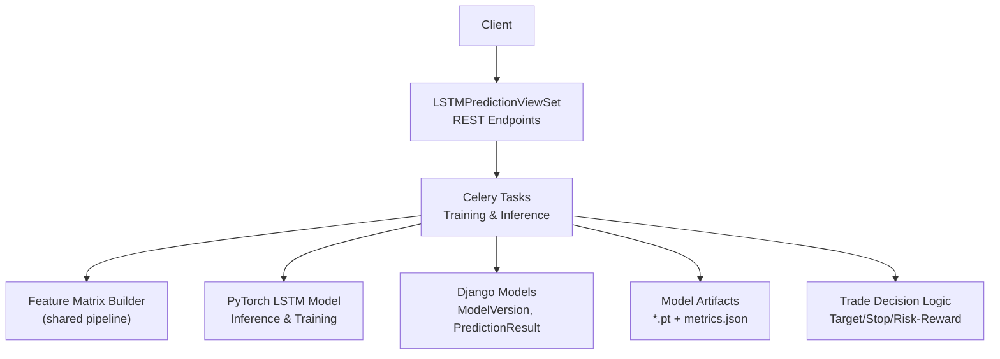
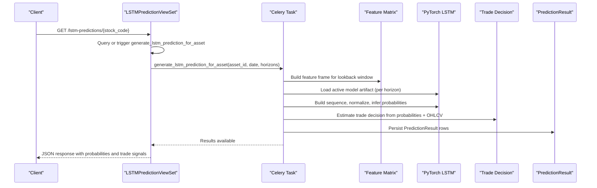
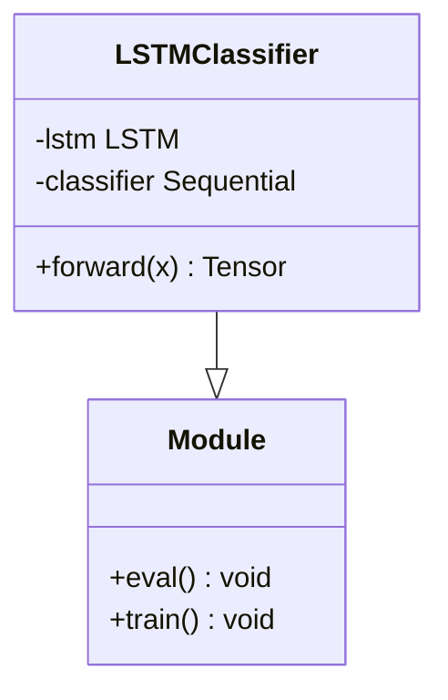
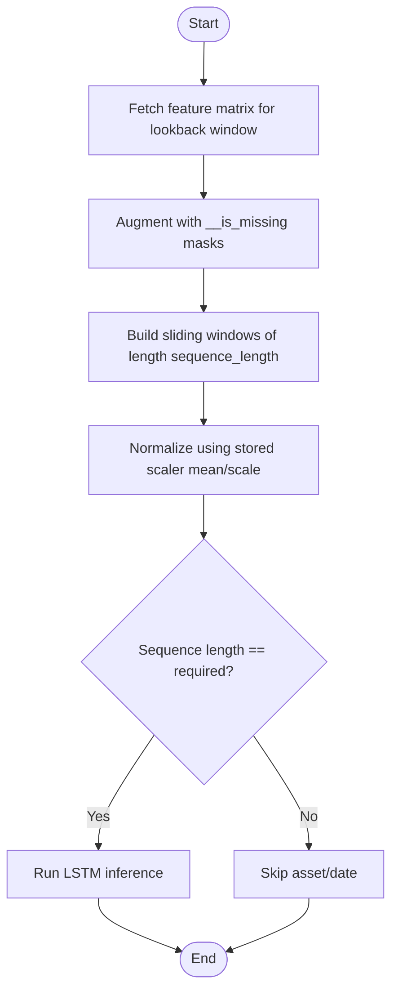
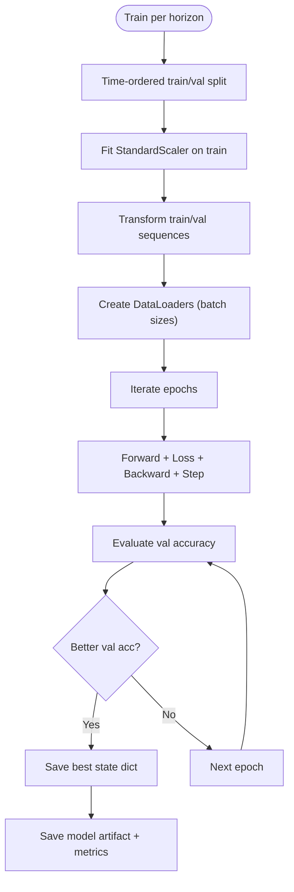
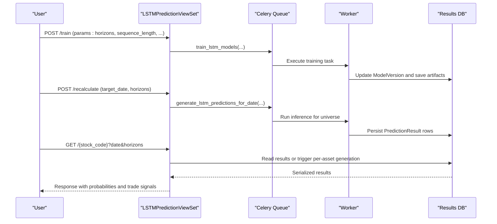
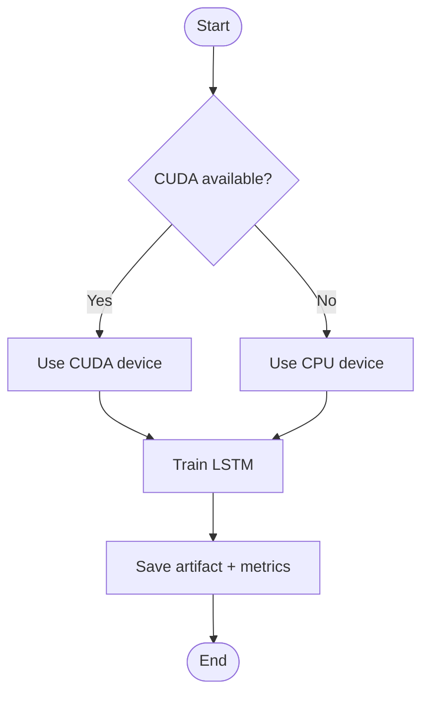
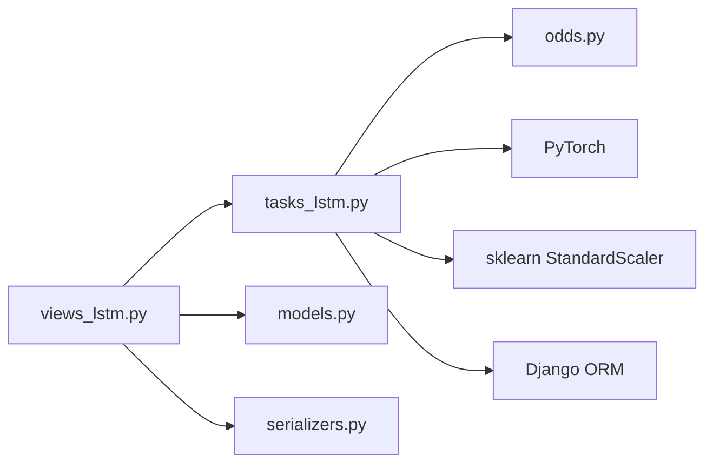

# LSTM Neural Network Predictions

<cite>
**Referenced Files in This Document**
- [views_lstm.py](file://apps/prediction/views_lstm.py)
- [tasks_lstm.py](file://apps/prediction/tasks_lstm.py)
- [models.py](file://apps/prediction/models.py)
- [serializers.py](file://apps/prediction/serializers.py)
- [odds.py](file://apps/prediction/odds.py)
- [rebuild_lstm_pipeline.py](file://apps/prediction/management/commands/rebuild_lstm_pipeline.py)
- [TECHNICAL_GUIDE.md](file://TECHNICAL_GUIDE.md)
</cite>

## Table of Contents
1. [Introduction](#introduction)
2. [Project Structure](#project-structure)
3. [Core Components](#core-components)
4. [Architecture Overview](#architecture-overview)
5. [Detailed Component Analysis](#detailed-component-analysis)
6. [Dependency Analysis](#dependency-analysis)
7. [Performance Considerations](#performance-considerations)
8. [Troubleshooting Guide](#troubleshooting-guide)
9. [Conclusion](#conclusion)
10. [Appendices](#appendices)

## Introduction
This document explains the LSTM-based prediction endpoints and pipeline for temporal financial data analysis. It covers how raw time series are transformed into sequences, how models are trained and served, and how predictions are generated per asset and horizon. It also documents model architecture, sequence configuration, batch and streaming workflows, PyTorch backend usage, GPU acceleration options, memory management strategies, training configurations, convergence monitoring, performance tuning, and troubleshooting guidance for common issues such as vanishing gradients, overfitting, and resource constraints.

## Project Structure
The LSTM prediction feature is implemented under the prediction app with REST endpoints, Celery tasks for training and inference, Django models for versioning and results, and a management command to rebuild the pipeline end-to-end.

**Diagram sources**
- [views_lstm.py:19-171](file://apps/prediction/views_lstm.py#L19-L171)
- [tasks_lstm.py:41-319](file://apps/prediction/tasks_lstm.py#L41-L319)
- [models.py:7-107](file://apps/prediction/models.py#L7-L107)
- [odds.py:60-158](file://apps/prediction/odds.py#L60-L158)

**Section sources**
- [views_lstm.py:19-171](file://apps/prediction/views_lstm.py#L19-L171)
- [tasks_lstm.py:41-319](file://apps/prediction/tasks_lstm.py#L41-L319)
- [models.py:7-107](file://apps/prediction/models.py#L7-L107)
- [odds.py:60-158](file://apps/prediction/odds.py#L60-L158)

## Core Components
- LSTMPredictionViewSet: Exposes endpoints to retrieve per-stock predictions, trigger recalculation, train models, and run batch generation.
- LSTMClassifier (PyTorch): Defines the neural network architecture used for classification across horizons.
- Sequence builder and scaler: Converts features into fixed-length sequences and normalizes them using StandardScaler fitted on training data.
- Training task: Builds sequences, trains per-horizon models, saves artifacts, updates ModelVersion records, and refreshes ensemble weights.
- Inference task: Loads the active model artifact, builds sequences per asset, runs inference, computes trade decisions, and persists PredictionResult rows.
- Trade decision logic: Derives target price, stop loss, risk-reward ratio, trade score, and suggestion flags based on probabilities and market context.

**Section sources**
- [views_lstm.py:19-171](file://apps/prediction/views_lstm.py#L19-L171)
- [tasks_lstm.py:41-319](file://apps/prediction/tasks_lstm.py#L41-L319)
- [tasks_lstm.py:592-826](file://apps/prediction/tasks_lstm.py#L592-L826)
- [tasks_lstm.py:829-967](file://apps/prediction/tasks_lstm.py#L829-L967)
- [odds.py:60-158](file://apps/prediction/odds.py#L60-L158)
- [models.py:7-107](file://apps/prediction/models.py#L7-L107)

## Architecture Overview
The system integrates feature engineering, sequence construction, PyTorch-based LSTM training/inference, and business logic for trade decisions.

**Diagram sources**
- [views_lstm.py:32-91](file://apps/prediction/views_lstm.py#L32-L91)
- [tasks_lstm.py:898-967](file://apps/prediction/tasks_lstm.py#L898-L967)
- [tasks_lstm.py:322-441](file://apps/prediction/tasks_lstm.py#L322-L441)
- [odds.py:60-158](file://apps/prediction/odds.py#L60-L158)

## Detailed Component Analysis

### LSTM Classifier Architecture
- Input layer: Accepts sequences of shape (batch, sequence_length, features).
- LSTM layers: 2-layer LSTM with hidden_size=64 and dropout applied between layers when num_layers > 1.
- Classifier head: Linear -> ReLU -> Dropout -> Linear to produce logits for 3 classes (DOWN, FLAT, UP).
- Forward pass: Uses last time step’s hidden state for classification.

**Diagram sources**
- [tasks_lstm.py:41-62](file://apps/prediction/tasks_lstm.py#L41-L62)

**Section sources**
- [tasks_lstm.py:41-62](file://apps/prediction/tasks_lstm.py#L41-L62)

### Sequence Processing and Window Configuration
- Feature augmentation: Each base feature includes an `__is_missing` mask column; this doubles the effective input size compared to non-LSTM pipelines.
- Sequence builder: Sliding windows of length `sequence_length` (default 20) are created per asset, aligned to labels by horizon.
- Missing value strategy: Supports “mask_and_zero_impute” where missing values are zeroed and masked; legacy mode fills missing columns with zeros if absent.
- Normalization: StandardScaler fitted on training sequences; during inference, sequences are normalized using stored mean/scale and NaN/Inf are sanitized.

**Diagram sources**
- [tasks_lstm.py:96-141](file://apps/prediction/tasks_lstm.py#L96-L141)
- [tasks_lstm.py:322-368](file://apps/prediction/tasks_lstm.py#L322-L368)
- [tasks_lstm.py:144-155](file://apps/prediction/tasks_lstm.py#L144-L155)

**Section sources**
- [tasks_lstm.py:96-141](file://apps/prediction/tasks_lstm.py#L96-L141)
- [tasks_lstm.py:322-368](file://apps/prediction/tasks_lstm.py#L322-L368)
- [tasks_lstm.py:144-155](file://apps/prediction/tasks_lstm.py#L144-L155)
- [TECHNICAL_GUIDE.md:407-421](file://TECHNICAL_GUIDE.md#L407-L421)

### Model Parameters and Training Configuration
- Architecture: 2-layer LSTM, hidden_size=64, dropout=0.2, 3 output classes.
- Training loop: Adam optimizer with learning rate 1e-3, CrossEntropyLoss, 8 epochs, best validation accuracy checkpointing.
- Data split: Time-ordered split into 80% train and 20% validation.
- Batch sizes: 128 for training DataLoader, 256 for validation DataLoader.
- Device selection: Automatically uses CUDA if available, otherwise CPU.
- Artifact storage: Per-horizon model files named `{horizon}d_model.pt`, plus metrics JSON and summary metadata.

**Diagram sources**
- [tasks_lstm.py:473-589](file://apps/prediction/tasks_lstm.py#L473-L589)
- [tasks_lstm.py:711-741](file://apps/prediction/tasks_lstm.py#L711-L741)
- [tasks_lstm.py:444-470](file://apps/prediction/tasks_lstm.py#L444-L470)

**Section sources**
- [tasks_lstm.py:473-589](file://apps/prediction/tasks_lstm.py#L473-L589)
- [tasks_lstm.py:711-741](file://apps/prediction/tasks_lstm.py#L711-L741)
- [tasks_lstm.py:444-470](file://apps/prediction/tasks_lstm.py#L444-L470)
- [TECHNICAL_GUIDE.md:407-421](file://TECHNICAL_GUIDE.md#L407-L421)

### Prediction Workflow and Endpoints
- Single stock retrieval: GET endpoint returns probabilities and trade signals for specified horizons; triggers background generation if not present.
- Recalculate: POST queues generation for all assets on a target date and horizons.
- Batch: POST accepts multiple stock codes and returns grouped results after queuing generation.
- Training: POST queues training with configurable parameters including sequence length and sample limits.

**Diagram sources**
- [views_lstm.py:93-171](file://apps/prediction/views_lstm.py#L93-L171)
- [tasks_lstm.py:592-826](file://apps/prediction/tasks_lstm.py#L592-L826)
- [tasks_lstm.py:829-967](file://apps/prediction/tasks_lstm.py#L829-L967)

**Section sources**
- [views_lstm.py:32-171](file://apps/prediction/views_lstm.py#L32-L171)
- [tasks_lstm.py:592-826](file://apps/prediction/tasks_lstm.py#L592-L826)
- [tasks_lstm.py:829-967](file://apps/prediction/tasks_lstm.py#L829-L967)

### Integration with PyTorch Backend and GPU Acceleration
- Device selection: Training automatically selects CUDA if available; otherwise falls back to CPU.
- Inference: Models are loaded on CPU via torch.load with map_location='cpu'; tensors are moved to device during training loops.
- Memory management: Sequences are built per asset and normalized before inference; caches are used to avoid redundant feature frame recomputation within a single run.

**Diagram sources**
- [tasks_lstm.py:711-741](file://apps/prediction/tasks_lstm.py#L711-L741)
- [tasks_lstm.py:283-300](file://apps/prediction/tasks_lstm.py#L283-L300)

**Section sources**
- [tasks_lstm.py:711-741](file://apps/prediction/tasks_lstm.py#L711-L741)
- [tasks_lstm.py:283-300](file://apps/prediction/tasks_lstm.py#L283-L300)

### Batch Processing and Streaming Scenarios
- Batch processing: The batch endpoint accepts a list of stock codes and queues generation for a target date; results are grouped by asset symbol and horizon.
- Streaming-like behavior: Real-time per-asset requests can be made via the stock endpoint; if results do not exist, they are generated on demand and returned.

**Section sources**
- [views_lstm.py:119-171](file://apps/prediction/views_lstm.py#L119-L171)
- [views_lstm.py:32-91](file://apps/prediction/views_lstm.py#L32-L91)

### Model Versioning and Persistence
- ModelVersion tracks active model, status, artifact path, metrics, feature schema, training window, and metadata.
- PredictionResult stores per-asset, per-date, per-horizon outputs including probabilities, confidence, predicted label, and derived trade signals.

**Section sources**
- [models.py:7-107](file://apps/prediction/models.py#L7-L107)

## Dependency Analysis
Key dependencies and relationships:
- views_lstm.py depends on tasks_lstm.py for async operations and on models/serializers for persistence and serialization.
- tasks_lstm.py depends on shared feature extraction utilities, PyTorch, sklearn scalers, and Django ORM.
- odds.py depends on market data (OHLCV) and technical indicators to compute trade decisions.

**Diagram sources**
- [views_lstm.py:1-171](file://apps/prediction/views_lstm.py#L1-L171)
- [tasks_lstm.py:1-319](file://apps/prediction/tasks_lstm.py#L1-L319)
- [odds.py:1-158](file://apps/prediction/odds.py#L1-L158)

**Section sources**
- [views_lstm.py:1-171](file://apps/prediction/views_lstm.py#L1-L171)
- [tasks_lstm.py:1-319](file://apps/prediction/tasks_lstm.py#L1-L319)
- [odds.py:1-158](file://apps/prediction/odds.py#L1-L158)

## Performance Considerations
- Sequence length: Default 20 trading rows; longer sequences increase memory and computation cost.
- Asset chunking: Feature extraction is chunked by asset count to control memory usage during training.
- Sample limits: Max samples per horizon cap prevents excessive memory consumption during retraining.
- Batch sizes: Training uses 128; validation uses 256 to balance throughput and stability.
- Device selection: Automatic CUDA detection optimizes training speed when hardware is available.
- Caching: Runtime caches reduce repeated feature frame computations within a single inference run.

[No sources needed since this section provides general guidance]

## Troubleshooting Guide
Common issues and remedies:
- Insufficient data: If too few sequence samples are collected, training returns insufficient_data; ensure adequate historical coverage and valid labels.
- No assets: If no assets are found, training cannot proceed; verify asset universe and membership coverage.
- Missing features: Ensure feature matrix contains required base features; missingness masks are added automatically but base features must exist.
- Vanishing gradients: Mitigated by dropout and ReLU activations; consider reducing sequence length or increasing regularization if training instability occurs.
- Overfitting: Validation accuracy is tracked; use early stopping concepts by selecting best checkpoints; adjust dropout or reduce capacity if overfitting is observed.
- Resource constraints: Reduce asset_chunk_size or max_samples_per_horizon; prefer CPU if GPU memory is insufficient; leverage caching to minimize redundant work.

**Section sources**
- [tasks_lstm.py:620-709](file://apps/prediction/tasks_lstm.py#L620-L709)
- [tasks_lstm.py:473-589](file://apps/prediction/tasks_lstm.py#L473-L589)
- [rebuild_lstm_pipeline.py:121-132](file://apps/prediction/management/commands/rebuild_lstm_pipeline.py#L121-L132)

## Conclusion
The LSTM prediction system provides robust endpoints for retrieving and generating multi-horizon forecasts, backed by a PyTorch-based classifier and a disciplined training pipeline. Sequence construction, normalization, and missing-value handling ensure compatibility with noisy financial data. The system supports batch and on-demand inference, persistent model versioning, and integration with trade decision logic. Proper configuration of sequence length, sample limits, and chunk sizes enables scalable operation under varying computational constraints.

[No sources needed since this section summarizes without analyzing specific files]

## Appendices

### API Reference Summary
- GET /api/v1/lstm-predictions/{stock_code}/
  - Query params: date, horizons (comma-separated integers; default 3,7,30)
  - Returns: stock_code, date, results array with probabilities, confidence, predicted_label, model_version, target_price, stop_loss_price, risk_reward_ratio, trade_score, suggested
- POST /api/v1/lstm-predictions/recalculate/
  - Body: target_date, horizons
  - Queues generation for all assets on target_date
- POST /api/v1/lstm-predictions/train/
  - Body: training_start_date, training_end_date, horizons, sequence_length, asset_chunk_size, max_samples_per_horizon
  - Queues training and returns acceptance
- POST /api/v1/lstm-predictions/batch/
  - Body: stock_codes (list), date (optional), horizons (list)
  - Queues generation and returns grouped results

**Section sources**
- [views_lstm.py:32-171](file://apps/prediction/views_lstm.py#L32-L171)

### Management Command
- Rebuild LSTM pipeline:
  - Arguments: start-date, end-date, horizons, sequence-length, asset-chunk-size, max-samples-per-horizon, skip-backfill, skip-sentiment, version-tag
  - Validates inputs, ensures PIT membership coverage, optionally backfills model data, then trains horizons and prints results

**Section sources**
- [rebuild_lstm_pipeline.py:15-173](file://apps/prediction/management/commands/rebuild_lstm_pipeline.py#L15-L173)