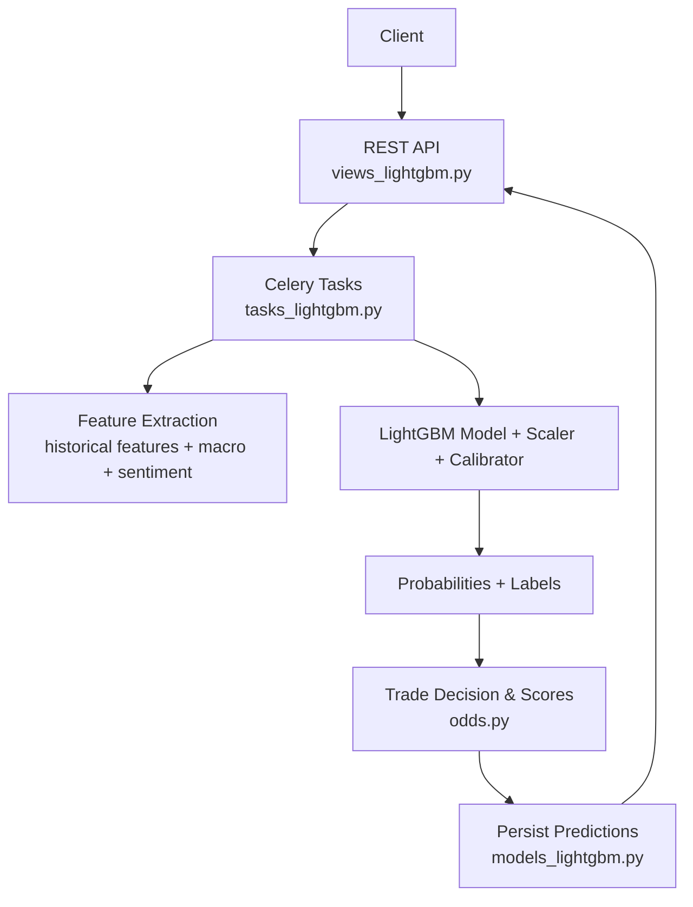
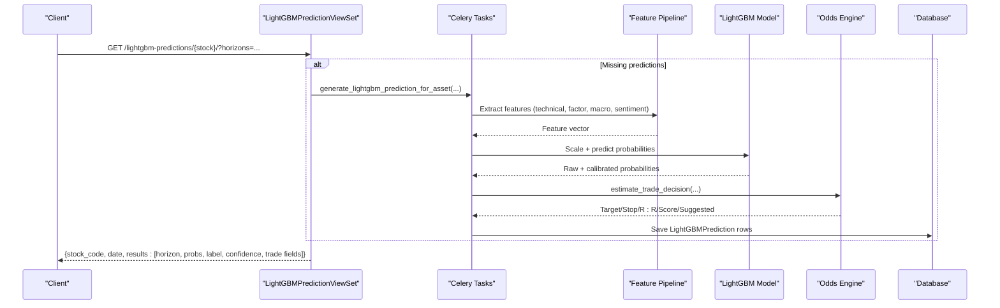
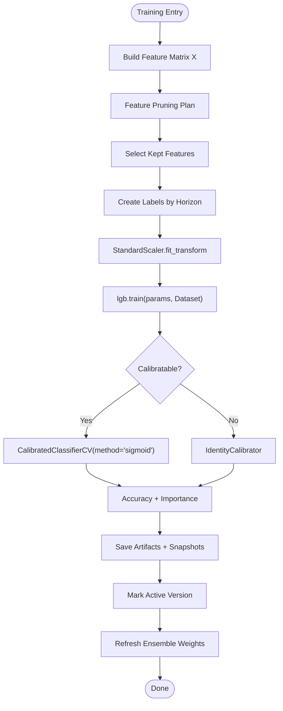
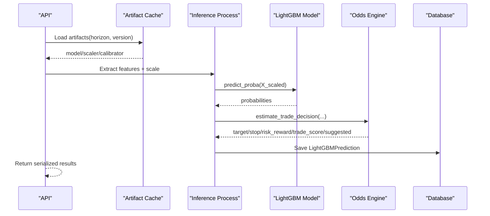
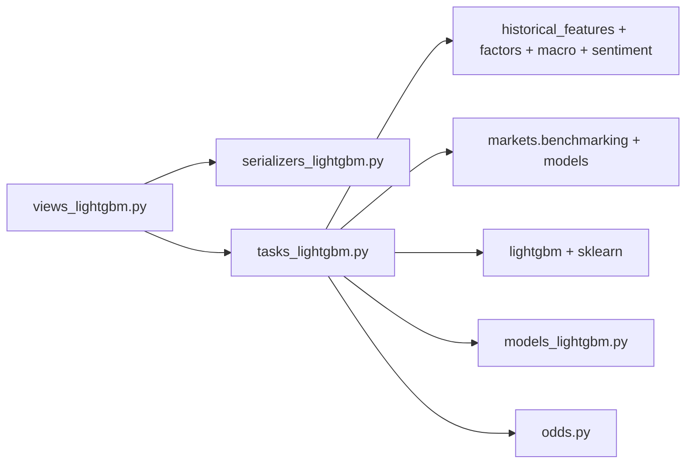

# LightGBM Predictions

<cite>
**Referenced Files in This Document**
- [views_lightgbm.py](file://apps/prediction/views_lightgbm.py)
- [models_lightgbm.py](file://apps/prediction/models_lightgbm.py)
- [serializers_lightgbm.py](file://apps/prediction/serializers_lightgbm.py)
- [tasks_lightgbm.py](file://apps/prediction/tasks_lightgbm.py)
- [odds.py](file://apps/prediction/odds.py)
- [TECHNICAL_GUIDE.md](file://TECHNICAL_GUIDE.md)
</cite>

## Table of Contents
1. [Introduction](#introduction)
2. [Project Structure](#project-structure)
3. [Core Components](#core-components)
4. [Architecture Overview](#architecture-overview)
5. [Detailed Component Analysis](#detailed-component-analysis)
6. [Dependency Analysis](#dependency-analysis)
7. [Performance Considerations](#performance-considerations)
8. [Troubleshooting Guide](#troubleshooting-guide)
9. [Conclusion](#conclusion)
10. [Appendices](#appendices)

## Introduction
This document explains the LightGBM gradient boosting machine prediction system, including REST API endpoints for generating predictions, parameter specifications for feature selection and time horizons, model-specific settings, response formats (confidence scores, probability distributions, feature importance), underlying training parameters, batch and real-time inference workflows, integration with feature engineering and post-processing, performance optimization, caching strategies, and error handling.

## Project Structure
LightGBM predictions are implemented under the prediction app:
- Views expose REST endpoints for querying, training, recalculating, and batch inference.
- Models define artifacts, predictions, ensemble weights, and feature importance snapshots.
- Serializers shape API responses.
- Tasks implement feature extraction, model training, calibration, inference, persistence, and ensemble weight updates.
- Odds utilities compute trade decisions from probabilities and market data.

**Diagram sources**
- [views_lightgbm.py:124-269](file://apps/prediction/views_lightgbm.py#L124-L269)
- [tasks_lightgbm.py:1900-2098](file://apps/prediction/tasks_lightgbm.py#L1900-L2098)
- [odds.py:60-158](file://apps/prediction/odds.py#L60-L158)
- [models_lightgbm.py:7-94](file://apps/prediction/models_lightgbm.py#L7-L94)

**Section sources**
- [views_lightgbm.py:30-122](file://apps/prediction/views_lightgbm.py#L30-L122)
- [models_lightgbm.py:7-94](file://apps/prediction/models_lightgbm.py#L7-L94)

## Core Components
- LightGBMModelArtifactViewSet: Lists and filters trained model artifacts by horizon and status; exposes feature importance trends endpoint with caching.
- LightGBMPredictionViewSet: Provides stock-level queries, training queue, recalculation queue, and batch inference endpoints.
- Prediction models: Persist per-asset, per-date, per-horizon predictions with probabilities, labels, confidence, target/stop-loss prices, risk-reward ratio, trade score, suggestion flag, and raw/calibrated scores.
- Feature importance snapshots: Track per-feature importance over time for each artifact.
- Ensemble weight snapshots: Track dynamic weighting among LightGBM, LSTM, and heuristic components.

**Section sources**
- [views_lightgbm.py:30-122](file://apps/prediction/views_lightgbm.py#L30-L122)
- [views_lightgbm.py:124-269](file://apps/prediction/views_lightgbm.py#L124-L269)
- [models_lightgbm.py:7-136](file://apps/prediction/models_lightgbm.py#L7-L136)
- [serializers_lightgbm.py:11-58](file://apps/prediction/serializers_lightgbm.py#L11-L58)

## Architecture Overview
The system supports both real-time and batch prediction flows:
- Real-time: GET a specific asset’s predictions; if missing, triggers asynchronous generation for requested horizons.
- Batch: POST multiple assets; queues generation for a date and horizons, then returns persisted results grouped by asset.
- Training: POST to queue retraining across selected horizons; persists artifacts, metrics, feature importance, and updates active versions.

**Diagram sources**
- [views_lightgbm.py:136-193](file://apps/prediction/views_lightgbm.py#L136-L193)
- [tasks_lightgbm.py:1900-2098](file://apps/prediction/tasks_lightgbm.py#L1900-L2098)
- [odds.py:60-158](file://apps/prediction/odds.py#L60-L158)

## Detailed Component Analysis

### REST API Endpoints
- GET /api/v1/lightgbm-predictions/{stock_code}/
  - Query params:
    - date: ISO date string; defaults to current trading date if invalid or absent.
    - horizons: comma-separated integers; default [3, 7, 30].
  - Behavior: Returns existing predictions; if none exist, asynchronously generates them for requested horizons and returns results.
  - Response fields per horizon: horizon_days, up, flat, down, confidence, predicted_label, model_version, target_price, stop_loss_price, risk_reward_ratio, trade_score, suggested.

- POST /api/v1/lightgbm-predictions/train/
  - Body: optional training_start_date, training_end_date.
  - Behavior: Queues model retraining for configured horizons; returns 202 Accepted.

- POST /api/v1/lightgbm-predictions/recalculate/
  - Body: target_date, horizons (default [3, 7, 30]).
  - Behavior: Queues inference for specified date and horizons; returns 202 Accepted.

- POST /api/v1/lightgbm-predictions/batch/
  - Body: stock_codes (list), optional date, horizons (list).
  - Behavior: Queues inference for date/horizons; returns persisted results grouped by stock_code.

- GET /api/v1/lightgbm-models/feature-importance-trends
  - Query params: horizon_days (optional), limit_models (default 5, capped at 20), top_n (default 10, capped at 50).
  - Behavior: Aggregates historical feature importance across recent artifacts; caches result for 1 hour.

**Section sources**
- [views_lightgbm.py:136-193](file://apps/prediction/views_lightgbm.py#L136-L193)
- [views_lightgbm.py:195-269](file://apps/prediction/views_lightgbm.py#L195-L269)
- [views_lightgbm.py:49-121](file://apps/prediction/views_lightgbm.py#L49-L121)

### Data Models and Serialization
- LightGBMModelArtifact: Stores model files path, version, status, metrics JSON, feature names, training window, timestamps, active flag, feature importance snapshot, and metadata.
- LightGBMPrediction: Stores per-asset, per-date, per-horizon predictions including probabilities, label, confidence, trade-related fields, model artifact reference, feature snapshot, raw/calibrated scores, and metadata.
- EnsembleWeightSnapshot: Tracks daily weights for LightGBM, LSTM, and heuristic components.
- FeatureImportanceSnapshot: Per-artifact, per-feature importance records with rank and score.
- Serializers map these models to API payloads, exposing derived fields like asset symbol/name and model version/horizon.

**Section sources**
- [models_lightgbm.py:7-136](file://apps/prediction/models_lightgbm.py#L7-L136)
- [serializers_lightgbm.py:11-58](file://apps/prediction/serializers_lightgbm.py#L11-L58)

### Feature Engineering and Preprocessing
- Technical indicators: RSI, momentum (5d), relative strength score, lagged variants, deltas, returns (3/5/10d), relative volume (5/20d), realized volatility (5d).
- Factor scores: PE/PB percentiles, ROE trend, composite score, main force/margin flow scores.
- Macro context: Market phase encoding, PMI manufacturing/non-manufacturing, yield curve (10y-3y).
- Sentiment: Asset 7-day sentiment and 20-day average.
- Interaction features: Cross-products between selected pairs (e.g., RSI x relative volume).
- Missing value strategy: Supports legacy neutral fill and native NaN preservation; influences feature construction and pruning behavior.

**Section sources**
- [tasks_lightgbm.py:731-1051](file://apps/prediction/tasks_lightgbm.py#L731-L1051)
- [tasks_lightgbm.py:1120-1159](file://apps/prediction/tasks_lightgbm.py#L1120-L1159)

### Model Training and Parameters
- Objective: multiclass with 3 classes (DOWN, FLAT, UP).
- Tree complexity: num_leaves=15.
- Learning rate: 0.05.
- Subsampling: feature_fraction=0.6, bagging_fraction=0.8, bagging_freq=5.
- Regularization: lambda_l1=1.0, lambda_l2=1.0, min_data_in_leaf=50.
- Random state: 42.
- Calibration: Sigmoid-based CalibratedClassifierCV when supported; otherwise identity calibrator.
- Training loop: Builds feature matrix, applies scaling, trains LightGBM, computes accuracy, extracts feature importance, persists artifacts and snapshots, updates active versions, refreshes ensemble weights.

**Diagram sources**
- [tasks_lightgbm.py:1900-2098](file://apps/prediction/tasks_lightgbm.py#L1900-L2098)
- [TECHNICAL_GUIDE.md:392-405](file://TECHNICAL_GUIDE.md#L392-L405)

**Section sources**
- [tasks_lightgbm.py:1900-2098](file://apps/prediction/tasks_lightgbm.py#L1900-L2098)
- [TECHNICAL_GUIDE.md:392-405](file://TECHNICAL_GUIDE.md#L392-L405)

### Inference Flow and Post-Processing
- Load artifacts: model, scaler, calibrator; cache in process memory with LRU policy.
- Optional GPU acceleration: probe device capability and use GPU predict when compatible.
- Probability computation: apply scaler, run model or calibrator, coerce to probability matrix.
- Trade decision: estimate target price, stop loss, risk-reward ratio, trade score, and suggestion based on recent OHLCV, Bollinger Bands, moving averages, and policy thresholds.
- Persistence: store predictions with raw and calibrated scores, feature snapshot, and metadata.

**Diagram sources**
- [tasks_lightgbm.py:121-156](file://apps/prediction/tasks_lightgbm.py#L121-L156)
- [tasks_lightgbm.py:249-278](file://apps/prediction/tasks_lightgbm.py#L249-L278)
- [odds.py:60-158](file://apps/prediction/odds.py#L60-L158)

**Section sources**
- [tasks_lightgbm.py:121-156](file://apps/prediction/tasks_lightgbm.py#L121-L156)
- [tasks_lightgbm.py:249-278](file://apps/prediction/tasks_lightgbm.py#L249-L278)
- [odds.py:60-158](file://apps/prediction/odds.py#L60-L158)

### Prediction Response Format
- Per horizon object includes:
  - horizon_days: integer.
  - up, flat, down: float probabilities summing to approximately 1.
  - confidence: float representing margin between top and second probabilities.
  - predicted_label: one of UP, FLAT, DOWN.
  - model_version: string identifying artifact.
  - target_price, stop_loss_price: floats or null.
  - risk_reward_ratio, trade_score: floats or null.
  - suggested: boolean indicating actionable signal based on thresholds.
- Batch response groups results by stock_code with arrays of horizon objects.

**Section sources**
- [views_lightgbm.py:171-193](file://apps/prediction/views_lightgbm.py#L171-L193)
- [views_lightgbm.py:253-269](file://apps/prediction/views_lightgbm.py#L253-L269)
- [models_lightgbm.py:41-94](file://apps/prediction/models_lightgbm.py#L41-L94)

### Feature Importance Rankings
- Trained artifacts record top features by gain-based importance.
- FeatureImportanceSnapshot stores per-feature scores and ranks for historical analysis.
- Endpoint aggregates trends across recent artifacts, grouping by horizon and ranking by cumulative importance.

**Section sources**
- [tasks_lightgbm.py:1996-2001](file://apps/prediction/tasks_lightgbm.py#L1996-L2001)
- [tasks_lightgbm.py:612-628](file://apps/prediction/tasks_lightgbm.py#L612-L628)
- [views_lightgbm.py:49-121](file://apps/prediction/views_lightgbm.py#L49-L121)
- [models_lightgbm.py:113-136](file://apps/prediction/models_lightgbm.py#L113-L136)

### Examples

#### Batch Prediction Request
- Endpoint: POST /api/v1/lightgbm-predictions/batch/
- Body:
  - stock_codes: list of strings.
  - date: optional ISO date string.
  - horizons: optional list of integers; defaults to [3, 7, 30].
- Behavior: Queues inference for the date/horizons and returns grouped results by stock_code.

**Section sources**
- [views_lightgbm.py:219-269](file://apps/prediction/views_lightgbm.py#L219-L269)

#### Real-Time Inference Call
- Endpoint: GET /api/v1/lightgbm-predictions/{stock_code}/
- Query params:
  - date: optional ISO date string.
  - horizons: optional comma-separated integers; defaults to "3,7,30".
- Behavior: If predictions exist, returns immediately; otherwise triggers async generation and returns results.

**Section sources**
- [views_lightgbm.py:136-193](file://apps/prediction/views_lightgbm.py#L136-L193)

#### Model Tuning Workflow
- Trigger training: POST /api/v1/lightgbm-predictions/train/
- Optional body: training_start_date, training_end_date.
- Outcome: Asynchronous training across horizons; artifacts saved with metrics and feature importance; active versions updated; ensemble weights refreshed.

**Section sources**
- [views_lightgbm.py:195-205](file://apps/prediction/views_lightgbm.py#L195-L205)
- [tasks_lightgbm.py:1900-2098](file://apps/prediction/tasks_lightgbm.py#L1900-L2098)

## Dependency Analysis
- Views depend on serializers and tasks for background processing.
- Tasks depend on:
  - Historical features, factors, macro, sentiment, technical staleness utilities.
  - Markets benchmarking for universe selection and membership coverage.
  - LightGBM and scikit-learn for modeling and calibration.
  - Database models for artifacts, predictions, and ensemble weights.
- Odds engine depends on markets OHLCV and analytics helpers for trade decision logic.

**Diagram sources**
- [views_lightgbm.py:10-27](file://apps/prediction/views_lightgbm.py#L10-L27)
- [tasks_lightgbm.py:17-51](file://apps/prediction/tasks_lightgbm.py#L17-L51)
- [odds.py:1-5](file://apps/prediction/odds.py#L1-L5)

**Section sources**
- [views_lightgbm.py:10-27](file://apps/prediction/views_lightgbm.py#L10-L27)
- [tasks_lightgbm.py:17-51](file://apps/prediction/tasks_lightgbm.py#L17-L51)

## Performance Considerations
- Artifact caching: In-memory LRU cache for model/scaler/calibrator per horizon/version; configurable max entries via environment variable.
- GPU acceleration: Probe and use GPU predict when supported by the model interface; cached per model handle.
- Feature pruning: Snapshot-based pruning retains top features by cumulative importance within bounded ranges; reduces dimensionality and improves throughput.
- Database indexing: Predictions and artifacts indexed by date, horizon, asset, status, and active flags to optimize query performance.
- Batch operations: Bulk creation of feature importance snapshots and efficient merges/as-of joins during feature matrix construction.

[No sources needed since this section provides general guidance]

## Troubleshooting Guide
- Missing predictions: If a stock has no predictions for a date/horizon, the GET endpoint triggers asynchronous generation; ensure tasks are running and data availability is sufficient.
- Insufficient training data: Training may fail with insufficient samples; verify training window and label availability.
- Feature schema mismatch: Ensure engineered features match artifact expectations; interaction features and aliases are handled but mismatches can cause neutral fills.
- GPU predict failures: Falls back to CPU; check model compatibility and device probing.
- Ensemble weights: Weights are refreshed based on recent accuracies; if LightGBM accuracy is non-finite, defaults are applied.

**Section sources**
- [views_lightgbm.py:159-169](file://apps/prediction/views_lightgbm.py#L159-L169)
- [tasks_lightgbm.py:1952-1958](file://apps/prediction/tasks_lightgbm.py#L1952-L1958)
- [tasks_lightgbm.py:2089-2094](file://apps/prediction/tasks_lightgbm.py#L2089-L2094)
- [tasks_lightgbm.py:631-681](file://apps/prediction/tasks_lightgbm.py#L631-L681)

## Conclusion
The LightGBM prediction system provides robust REST APIs for real-time and batch inference, comprehensive feature engineering, conservative hyperparameters with strong regularization, calibrated probabilities, and actionable trade signals. It integrates seamlessly with the broader pipeline through Celery tasks, maintains detailed artifacts and snapshots for auditability, and employs caching and optional GPU acceleration for performance.

[No sources needed since this section summarizes without analyzing specific files]

## Appendices

### API Reference Summary
- GET /api/v1/lightgbm-predictions/{stock_code}/
  - Params: date, horizons
  - Response: stock_code, date, results array with horizon-specific fields
- POST /api/v1/lightgbm-predictions/train/
  - Body: training_start_date, training_end_date
  - Response: 202 Accepted
- POST /api/v1/lightgbm-predictions/recalculate/
  - Body: target_date, horizons
  - Response: 202 Accepted
- POST /api/v1/lightgbm-predictions/batch/
  - Body: stock_codes, date, horizons
  - Response: date, results grouped by stock_code
- GET /api/v1/lightgbm-models/feature-importance-trends
  - Params: horizon_days, limit_models, top_n
  - Response: aggregated trends with snapshots

**Section sources**
- [views_lightgbm.py:136-269](file://apps/prediction/views_lightgbm.py#L136-L269)
- [views_lightgbm.py:49-121](file://apps/prediction/views_lightgbm.py#L49-L121)