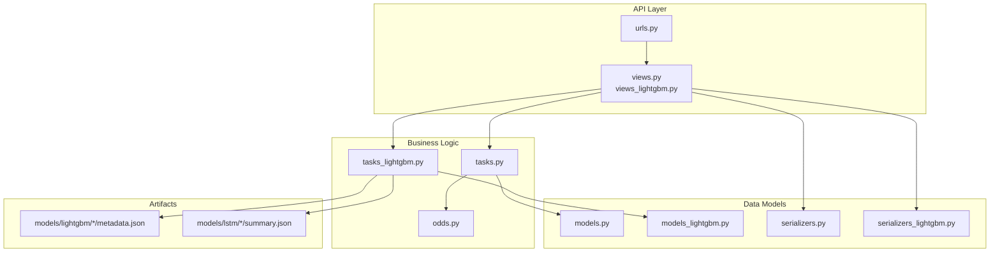
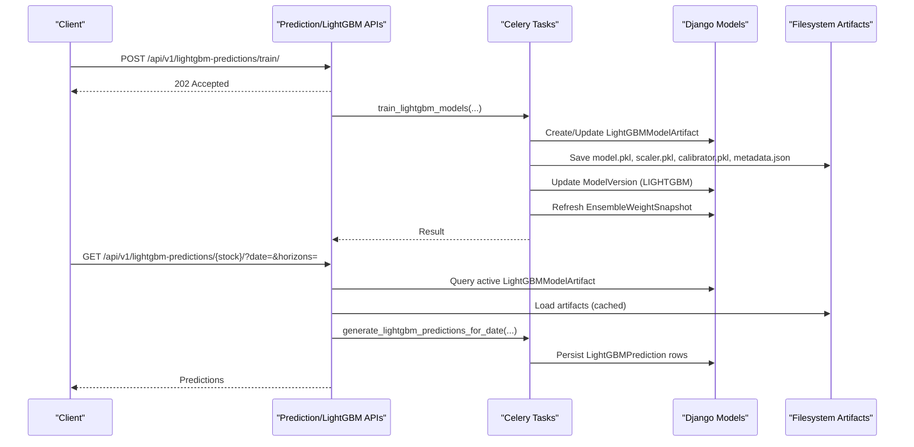
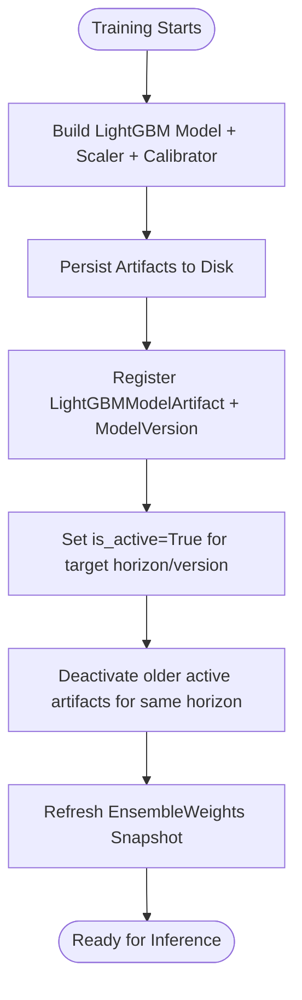
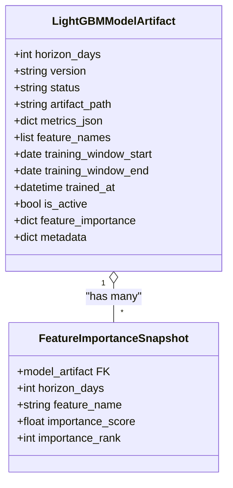
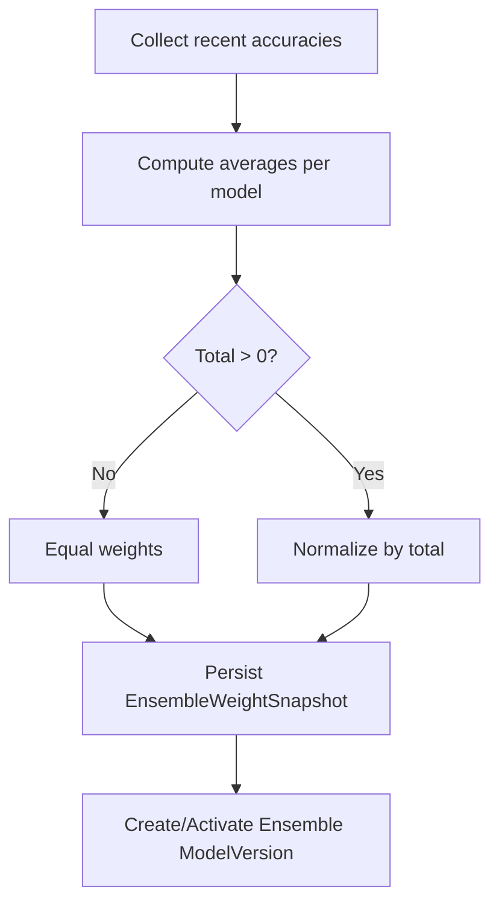
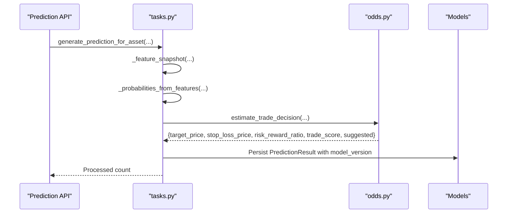
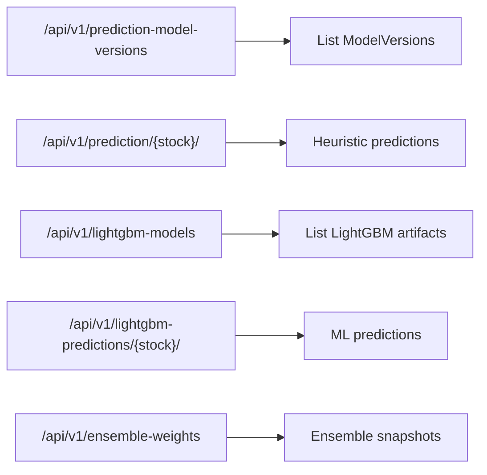
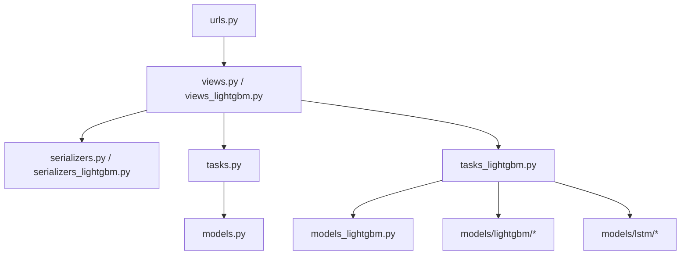

# Model Versions & Artifacts

<cite>
**Referenced Files in This Document**
- [models.py](file://apps/prediction/models.py)
- [models_lightgbm.py](file://apps/prediction/models_lightgbm.py)
- [views.py](file://apps/prediction/views.py)
- [views_lightgbm.py](file://apps/prediction/views_lightgbm.py)
- [tasks.py](file://apps/prediction/tasks.py)
- [tasks_lightgbm.py](file://apps/prediction/tasks_lightgbm.py)
- [serializers.py](file://apps/prediction/serializers.py)
- [serializers_lightgbm.py](file://apps/prediction/serializers_lightgbm.py)
- [odds.py](file://apps/prediction/odds.py)
- [urls.py](file://config/urls.py)
- [metadata.json](file://models/lightgbm/3d_lgb-3d-2024-12-31/metadata.json)
- [summary.json](file://models/lstm/lstm-2024-12-31/summary.json)
- [models.md](file://docs/reference/models.md)
- [retrain.md](file://docs/how-to/retrain.md)
</cite>

## Table of Contents
1. Introduction
2. Project Structure
3. Core Components
4. Architecture Overview
5. Detailed Component Analysis
6. Dependency Analysis
7. Performance Considerations
8. Troubleshooting Guide
9. Conclusion
10. Appendices

## Introduction
This document explains how the prediction system manages model versions and artifacts across training, validation, deployment, and rollback. It covers:
- The model registry and artifact storage for LightGBM and LSTM models
- Metadata, metrics, and feature schema tracking
- Ensemble weighting across 3-day, 7-day, and 30-day horizons
- API endpoints to list versions, retrieve predictions, and manage artifacts
- Validation, quality checks, and promotion/rollback procedures
- Examples of model selection strategies, A/B testing workflows, and performance comparisons

## Project Structure
The prediction subsystem is organized into:
- Data models for versioning and artifacts
- ViewSets exposing REST APIs for listing, querying, and triggering training/inference
- Celery tasks that train models, persist artifacts, compute ensemble weights, and generate predictions
- On-disk artifact directories with metadata files per model version
- Documentation generators and runbooks for retraining and promotion

**Diagram sources**
- [urls.py:74-107](file://config/urls.py#L74-L107)
- [views.py:15-162](file://apps/prediction/views.py#L15-L162)
- [views_lightgbm.py:30-282](file://apps/prediction/views_lightgbm.py#L30-L282)
- [tasks.py:149-327](file://apps/prediction/tasks.py#L149-L327)
- [tasks_lightgbm.py:58-157](file://apps/prediction/tasks_lightgbm.py#L58-L157)
- [models.py:7-107](file://apps/prediction/models.py#L7-L107)
- [models_lightgbm.py:7-137](file://apps/prediction/models_lightgbm.py#L7-L137)
- [serializers.py:6-33](file://apps/prediction/serializers.py#L6-L33)
- [serializers_lightgbm.py:11-59](file://apps/prediction/serializers_lightgbm.py#L11-L59)

**Section sources**
- [urls.py:74-107](file://config/urls.py#L74-L107)
- [views.py:15-162](file://apps/prediction/views.py#L15-L162)
- [views_lightgbm.py:30-282](file://apps/prediction/views_lightgbm.py#L30-L282)
- [tasks.py:149-327](file://apps/prediction/tasks.py#L149-L327)
- [tasks_lightgbm.py:58-157](file://apps/prediction/tasks_lightgbm.py#L58-L157)
- [models.py:7-107](file://apps/prediction/models.py#L7-L107)
- [models_lightgbm.py:7-137](file://apps/prediction/models_lightgbm.py#L7-L137)
- [serializers.py:6-33](file://apps/prediction/serializers.py#L6-L33)
- [serializers_lightgbm.py:11-59](file://apps/prediction/serializers_lightgbm.py#L11-L59)

## Core Components
- ModelVersion: High-level registry for all model types (LightGBM, LSTM, Ensemble), including status, artifact path, metrics, feature schema, training window, timestamps, and active flag.
- PredictionResult: Heuristic baseline predictions linked to an ensemble model version.
- LightGBMModelArtifact: Per-horizon LightGBM deployment record with artifact path, metrics, feature names, importance, and active flag.
- LightGBMPrediction: ML-generated predictions linked to a specific LightGBM artifact.
- EnsembleWeightSnapshot: Daily snapshot of ensemble weights (LightGBM, LSTM, heuristic) derived from recent accuracy.
- FeatureImportanceSnapshot: Historical per-feature importance for each LightGBM artifact.

Key responsibilities:
- Version lifecycle: TRAINING → READY/FAILED/ARCHIVED
- Artifact persistence: pickled model, scaler, calibrator, and JSON metadata on disk
- Active selection: one active LightGBM artifact per horizon; one active Ensemble version per date
- Metrics and provenance: training windows, trained_at, feature schemas, pruning rules, missing-value strategy

**Section sources**
- [models.py:7-107](file://apps/prediction/models.py#L7-L107)
- [models_lightgbm.py:7-137](file://apps/prediction/models_lightgbm.py#L7-L137)

## Architecture Overview
The system exposes REST endpoints to trigger training, query predictions, and inspect model artifacts and ensemble weights. Training runs asynchronously via Celery tasks, persists artifacts to disk, updates registries, and refreshes ensemble weights. Inference loads active artifacts, computes probabilities, and stores results.

**Diagram sources**
- [views_lightgbm.py:124-282](file://apps/prediction/views_lightgbm.py#L124-L282)
- [tasks_lightgbm.py:2096-2132](file://apps/prediction/tasks_lightgbm.py#L2096-L2132)
- [tasks_lightgbm.py:58-157](file://apps/prediction/tasks_lightgbm.py#L58-L157)
- [models_lightgbm.py:7-137](file://apps/prediction/models_lightgbm.py#L7-L137)

## Detailed Component Analysis

### Model Registry and Lifecycle
- ModelVersion tracks high-level versions for LIGHTGBM, LSTM, and ENSEMBLE with status transitions and active flags.
- LightGBMModelArtifact provides per-horizon deployment control; only one artifact per horizon can be active at a time.
- During training, tasks update or create ModelVersion entries, set statuses, store metrics, and mark artifacts active.

**Diagram sources**
- [tasks_lightgbm.py:586-629](file://apps/prediction/tasks_lightgbm.py#L586-L629)
- [tasks_lightgbm.py:631-729](file://apps/prediction/tasks_lightgbm.py#L631-L729)

**Section sources**
- [models.py:7-31](file://apps/prediction/models.py#L7-L31)
- [models_lightgbm.py:7-38](file://apps/prediction/models_lightgbm.py#L7-L38)
- [tasks_lightgbm.py:586-729](file://apps/prediction/tasks_lightgbm.py#L586-L729)

### Artifact Storage and Retrieval
- LightGBM artifacts are stored under models/lightgbm/<horizon>_<version>/ with model.pkl, scaler.pkl, calibrator.pkl, and metadata.json.
- Retrieval uses an in-process cache keyed by horizon and version, with LRU eviction controlled by environment variable.
- LSTM artifacts include per-horizon .pt files and summary.json with accuracy and metadata.

**Diagram sources**
- [models_lightgbm.py:7-38](file://apps/prediction/models_lightgbm.py#L7-L38)
- [models_lightgbm.py:113-137](file://apps/prediction/models_lightgbm.py#L113-L137)

**Section sources**
- [tasks_lightgbm.py:78-157](file://apps/prediction/tasks_lightgbm.py#L78-L157)
- [metadata.json:1-112](file://models/lightgbm/3d_lgb-3d-2024-12-31/metadata.json#L1-L112)
- [summary.json:1-41](file://models/lstm/lstm-2024-12-31/summary.json#L1-L41)

### Ensemble Weighting Mechanism
- Ensemble weights are computed daily based on recent accuracy of LightGBM, LSTM, and heuristic baselines over a lookback window.
- Weights are normalized and persisted as EnsembleWeightSnapshot; an active Ensemble ModelVersion is created per snapshot date.
- The heuristic baseline uses feature-driven probability adjustments and trade decision heuristics.

**Diagram sources**
- [tasks_lightgbm.py:631-729](file://apps/prediction/tasks_lightgbm.py#L631-L729)
- [tasks.py:129-174](file://apps/prediction/tasks.py#L129-L174)

**Section sources**
- [tasks_lightgbm.py:631-729](file://apps/prediction/tasks_lightgbm.py#L631-L729)
- [tasks.py:129-174](file://apps/prediction/tasks.py#L129-L174)

### Prediction Generation and Trade Decisions
- Heuristic baseline generates probabilities using factor, sentiment, momentum, and RS signals, adjusted by macro phase and horizon scaling.
- Trade decisions estimate target price, stop loss, risk-reward ratio, and suggestion flags using technical indicators and policy options.
- LightGBM inference loads active artifacts, applies scaling/calibration, and persists predictions with raw and calibrated scores.

**Diagram sources**
- [tasks.py:177-327](file://apps/prediction/tasks.py#L177-L327)
- [odds.py:60-158](file://apps/prediction/odds.py#L60-L158)

**Section sources**
- [tasks.py:177-327](file://apps/prediction/tasks.py#L177-L327)
- [odds.py:60-158](file://apps/prediction/odds.py#L60-L158)

### API Endpoints for Model Management
- List model versions: GET /api/v1/prediction-model-versions/?model_type=...
- Retrieve predictions: GET /api/v1/prediction/{stock_code}/?date=&horizons=
- Batch predictions: POST /api/v1/prediction/batch/
- Recalculate/heuristic retrain: POST /api/v1/prediction/recalculate/
- LightGBM artifacts: GET /api/v1/lightgbm-models/?horizon_days=...
- LightGBM predictions: GET/POST /api/v1/lightgbm-predictions/{stock_code}/, /batch/, /train/, /recalculate/
- Ensemble weights: GET /api/v1/ensemble-weights/

**Diagram sources**
- [urls.py:98-103](file://config/urls.py#L98-L103)
- [views.py:15-162](file://apps/prediction/views.py#L15-L162)
- [views_lightgbm.py:30-282](file://apps/prediction/views_lightgbm.py#L30-L282)

**Section sources**
- [urls.py:98-103](file://config/urls.py#L98-L103)
- [views.py:15-162](file://apps/prediction/views.py#L15-L162)
- [views_lightgbm.py:30-282](file://apps/prediction/views_lightgbm.py#L30-L282)

### Model Selection Strategies and A/B Testing
- Strategy examples:
  - Horizon-specific selection: choose active LightGBM artifact per horizon (3d, 7d, 30d).
  - Ensemble blend: combine LightGBM, LSTM, and heuristic outputs using latest EnsembleWeightSnapshot.
  - Backtest-driven selection: compare recent backtest metrics to promote the best-performing artifact per horizon.
- A/B testing workflow:
  - Train candidate artifacts with distinct features or parameters.
  - Promote candidate to active for a subset of assets or horizons.
  - Compare key metrics (accuracy, trade score, risk-reward) against incumbent.
  - Roll back if candidate underperforms; otherwise, fully promote.

[No sources needed since this section provides conceptual guidance]

### Performance Comparison Between Model Versions
- Use the generated registry report to compare active artifacts’ accuracy, feature counts, pruning rules, and missing-value strategies.
- Inspect EnsembleWeightSnapshot basis_metrics to see recent per-model accuracy used for weighting.
- Validate feature importance trends to detect drift or instability.

**Section sources**
- [models.md:13-64](file://docs/reference/models.md#L13-L64)
- [tasks_lightgbm.py:631-729](file://apps/prediction/tasks_lightgbm.py#L631-L729)

### Model Validation, Quality Checks, and Deployment Approval
- Validation triggers:
  - Changes to stored features or universe composition
  - Feature contract changes (new columns, renamed fields, missing-value strategy)
  - Drift detected in validation backtests versus benchmark
- Quality checks:
  - validate_data_quality command findings must be repaired before retraining
  - Ensure artifact paths resolve and metadata integrity
- Deployment approval:
  - Promote candidate artifact by setting is_active for its horizon
  - Verify ensemble weights updated and ModelVersion reflects new active state
  - Monitor predictions and backtests post-promotion

**Section sources**
- [retrain.md:10-34](file://docs/how-to/retrain.md#L10-L34)
- [tasks_lightgbm.py:586-629](file://apps/prediction/tasks_lightgbm.py#L586-L629)

## Dependency Analysis
- Views depend on serializers and tasks; tasks depend on models and external data providers.
- LightGBM inference depends on active artifacts and caches; ensemble weighting depends on recent accuracies from multiple sources.
- URL routing wires viewsets to REST endpoints.

**Diagram sources**
- [urls.py:74-107](file://config/urls.py#L74-L107)
- [views.py:15-162](file://apps/prediction/views.py#L15-L162)
- [views_lightgbm.py:30-282](file://apps/prediction/views_lightgbm.py#L30-L282)
- [tasks.py:149-327](file://apps/prediction/tasks.py#L149-L327)
- [tasks_lightgbm.py:58-157](file://apps/prediction/tasks_lightgbm.py#L58-L157)

**Section sources**
- [urls.py:74-107](file://config/urls.py#L74-L107)
- [views.py:15-162](file://apps/prediction/views.py#L15-L162)
- [views_lightgbm.py:30-282](file://apps/prediction/views_lightgbm.py#L30-L282)
- [tasks.py:149-327](file://apps/prediction/tasks.py#L149-L327)
- [tasks_lightgbm.py:58-157](file://apps/prediction/tasks_lightgbm.py#L58-L157)

## Performance Considerations
- Artifact loading cache: In-memory LRU cache reduces repeated disk reads; size configurable via environment variable.
- GPU acceleration: For certain LightGBM boosters, inference may use GPU device detection and caching to speed up predictions.
- Feature pruning: Snapshot-based pruning retains top features by cumulative importance within bounded ranges to reduce computation.
- Batch operations: Batch prediction endpoints minimize database round-trips and group results efficiently.

[No sources needed since this section provides general guidance]

## Troubleshooting Guide
Common issues and resolutions:
- Missing active artifact: Ensure a LightGBMModelArtifact exists with status READY and is_active=True for the horizon.
- Artifact load failure: Check file existence and metadata integrity; verify artifact path resolves on disk.
- Ensemble weights stale: Confirm recent accuracies are finite and non-zero; re-run training to refresh weights.
- Prediction gaps: Verify effective universe coverage and trading dates; ensure technical indicators are not stale.

**Section sources**
- [tasks_lightgbm.py:121-157](file://apps/prediction/tasks_lightgbm.py#L121-L157)
- [tasks_lightgbm.py:2096-2132](file://apps/prediction/tasks_lightgbm.py#L2096-L2132)
- [tasks_lightgbm.py:631-729](file://apps/prediction/tasks_lightgbm.py#L631-L729)

## Conclusion
The prediction system provides a robust model versioning and artifact management framework with clear separation between high-level registry (ModelVersion) and per-horizon deployment (LightGBMModelArtifact). Ensemble weighting integrates multiple models across horizons, while APIs enable transparent inspection and control. Validation and promotion processes ensure quality and traceability throughout the lifecycle.

[No sources needed since this section summarizes without analyzing specific files]

## Appendices

### API Reference Summary
- Model versions: GET /api/v1/prediction-model-versions/
- Heuristic predictions: GET /api/v1/prediction/{stock_code}/, POST /api/v1/prediction/batch/, POST /api/v1/prediction/recalculate/
- LightGBM artifacts: GET /api/v1/lightgbm-models/
- LightGBM predictions: GET/POST /api/v1/lightgbm-predictions/{stock_code}/, /batch/, /train/, /recalculate/
- Ensemble weights: GET /api/v1/ensemble-weights/

**Section sources**
- [urls.py:98-103](file://config/urls.py#L98-L103)
- [views.py:15-162](file://apps/prediction/views.py#L15-L162)
- [views_lightgbm.py:30-282](file://apps/prediction/views_lightgbm.py#L30-L282)

### Artifact Formats and Locations
- LightGBM: models/lightgbm/<horizon>_<version>/ contains model.pkl, scaler.pkl, calibrator.pkl, metadata.json
- LSTM: models/lstm/<version>/ contains per-horizon .pt files and summary.json with accuracy and metadata

**Section sources**
- [tasks_lightgbm.py:95-119](file://apps/prediction/tasks_lightgbm.py#L95-L119)
- [metadata.json:1-112](file://models/lightgbm/3d_lgb-3d-2024-12-31/metadata.json#L1-L112)
- [summary.json:1-41](file://models/lstm/lstm-2024-12-31/summary.json#L1-L41)