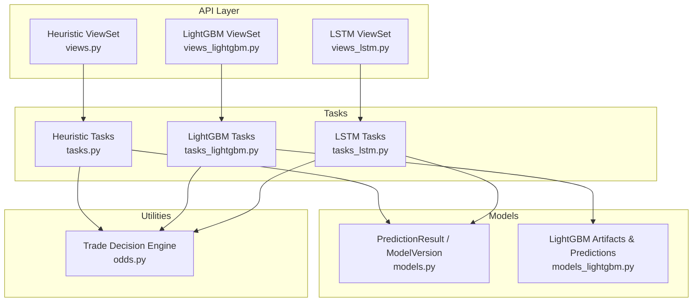
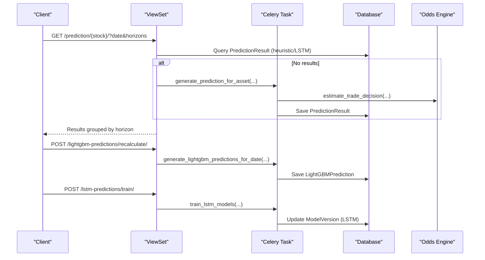
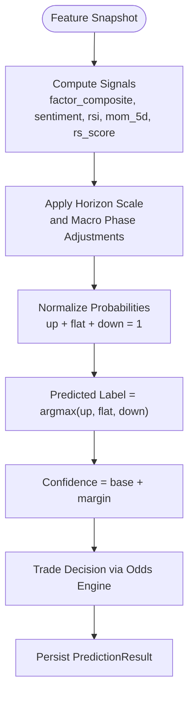
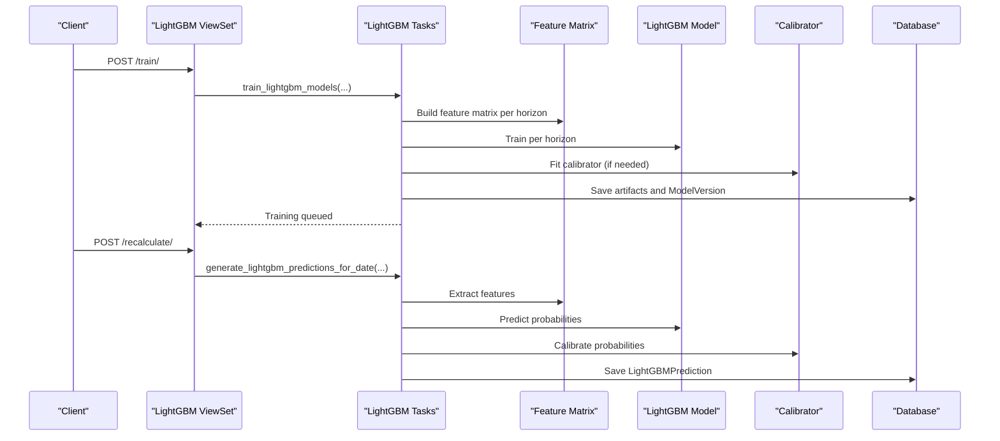
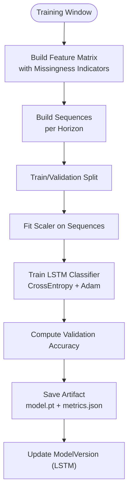
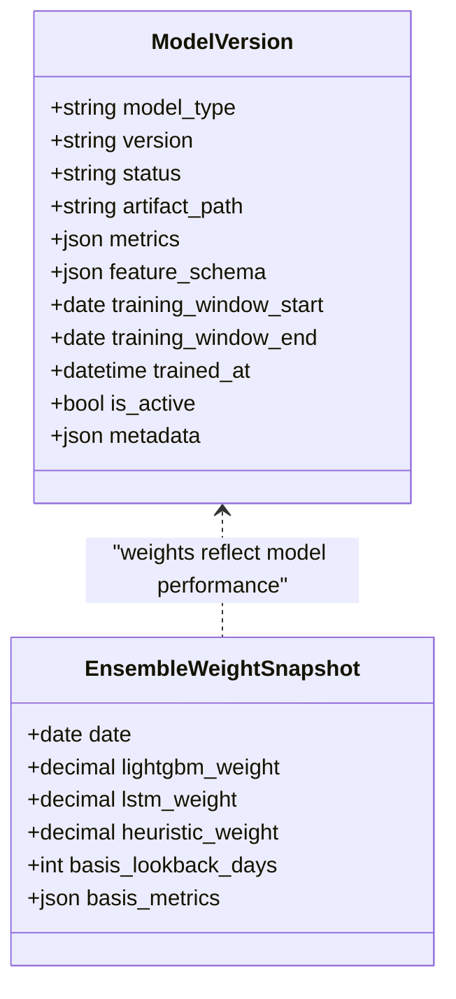
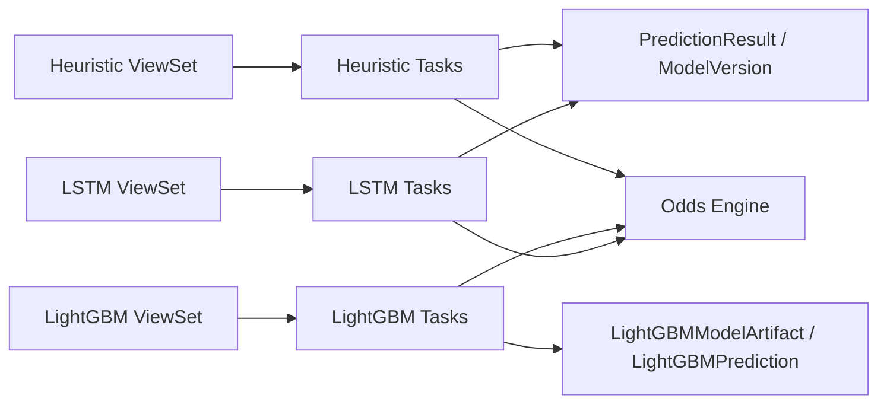

# Prediction & ML Models API

<cite>
**Referenced Files in This Document**
- [views.py](file://apps/prediction/views.py)
- [views_lightgbm.py](file://apps/prediction/views_lightgbm.py)
- [views_lstm.py](file://apps/prediction/views_lstm.py)
- [models.py](file://apps/prediction/models.py)
- [serializers.py](file://apps/prediction/serializers.py)
- [models_lightgbm.py](file://apps/prediction/models_lightgbm.py)
- [serializers_lightgbm.py](file://apps/prediction/serializers_lightgbm.py)
- [tasks.py](file://apps/prediction/tasks.py)
- [tasks_lightgbm.py](file://apps/prediction/tasks_lightgbm.py)
- [tasks_lstm.py](file://apps/prediction/tasks_lstm.py)
- [odds.py](file://apps/prediction/odds.py)
- [views.py (backtest)](file://apps/backtest/views.py)
</cite>

## Table of Contents
1. [Introduction](#introduction)
2. [Project Structure](#project-structure)
3. [Core Components](#core-components)
4. [Architecture Overview](#architecture-overview)
5. [Detailed Component Analysis](#detailed-component-analysis)
6. [Dependency Analysis](#dependency-analysis)
7. [Performance Considerations](#performance-considerations)
8. [Troubleshooting Guide](#troubleshooting-guide)
9. [Conclusion](#conclusion)
10. [Appendices](#appendices)

## Introduction
This document describes the prediction model endpoints and supporting pipelines for heuristic predictions, LightGBM models, and LSTM neural networks. It covers model versioning, ensemble weighting, confidence scoring, parameter specifications for feature selection and time horizons, and provides examples for model comparison, backtesting integration, and real-time prediction workflows.

The system exposes:
- Heuristic baseline predictions stored as generic PredictionResult rows with an ENSEMBLE model version.
- LightGBM predictions stored in a dedicated LightGBMPrediction table with artifact-level metadata.
- LSTM predictions stored in PredictionResult rows tagged by model_type=LSTM.

All endpoints support 3-day, 7-day, and 30-day horizons and return probabilities, predicted labels, confidence, trade decision fields, and suggested flags.

## Project Structure
Prediction functionality is implemented under apps/prediction with separate viewsets for each model family and shared tasks for training and inference. Backtesting integration lives under apps/backtest.

**Diagram sources**
- [views.py:15-162](file://apps/prediction/views.py#L15-L162)
- [views_lightgbm.py:30-282](file://apps/prediction/views_lightgbm.py#L30-L282)
- [views_lstm.py:19-171](file://apps/prediction/views_lstm.py#L19-L171)
- [tasks.py:149-327](file://apps/prediction/tasks.py#L149-L327)
- [tasks_lightgbm.py:58-800](file://apps/prediction/tasks_lightgbm.py#L58-L800)
- [tasks_lstm.py:41-800](file://apps/prediction/tasks_lstm.py#L41-L800)
- [models.py:7-107](file://apps/prediction/models.py#L7-L107)
- [models_lightgbm.py:7-137](file://apps/prediction/models_lightgbm.py#L7-L137)
- [odds.py:60-158](file://apps/prediction/odds.py#L60-L158)

**Section sources**
- [views.py:15-162](file://apps/prediction/views.py#L15-L162)
- [views_lightgbm.py:30-282](file://apps/prediction/views_lightgbm.py#L30-L282)
- [views_lstm.py:19-171](file://apps/prediction/views_lstm.py#L19-L171)
- [models.py:7-107](file://apps/prediction/models.py#L7-L107)
- [models_lightgbm.py:7-137](file://apps/prediction/models_lightgbm.py#L7-L137)
- [tasks.py:149-327](file://apps/prediction/tasks.py#L149-L327)
- [tasks_lightgbm.py:58-800](file://apps/prediction/tasks_lightgbm.py#L58-L800)
- [tasks_lstm.py:41-800](file://apps/prediction/tasks_lstm.py#L41-L800)
- [odds.py:60-158](file://apps/prediction/odds.py#L60-L158)

## Core Components
- Heuristic baseline: Computes probabilities from factor composite, sentiment, RSI, momentum, and relative strength; adjusts by macro phase and horizon scale; stores results in PredictionResult with an ENSEMBLE model version.
- LightGBM: Trains per-horizon gradient boosting models, persists artifacts, computes calibrated probabilities, stores LightGBMPrediction rows, and tracks feature importance snapshots.
- LSTM: Trains sequence classifiers per horizon, persists PyTorch artifacts, builds sequences with missingness indicators, and stores PredictionResult rows tagged as LSTM.
- Ensemble weighting: Tracks daily weights across heuristic, LightGBM, and LSTM based on recent accuracy metrics and persists an active ENSEMBLE model version snapshot.
- Trade decision engine: Derives target price, stop loss, risk-reward ratio, trade score, and suggestion flag using OHLCV context and policy options.

Key data structures:
- ModelVersion: Tracks model type (LIGHTGBM, LSTM, ENSEMBLE), version string, status, artifact path, metrics, feature schema, training window, trained timestamp, active flag, and metadata.
- PredictionResult: Stores per-asset, per-date, per-horizon probabilities, label, confidence, trade decision fields, and optional macro/event tags.
- LightGBMModelArtifact and LightGBMPrediction: Persist LightGBM artifacts and predictions with raw/calibrated scores and feature snapshots.
- EnsembleWeightSnapshot and FeatureImportanceSnapshot: Track ensemble weights over time and per-feature importance history.

**Section sources**
- [models.py:7-107](file://apps/prediction/models.py#L7-L107)
- [models_lightgbm.py:7-137](file://apps/prediction/models_lightgbm.py#L7-L137)
- [tasks.py:82-147](file://apps/prediction/tasks.py#L82-L147)
- [tasks_lightgbm.py:586-730](file://apps/prediction/tasks_lightgbm.py#L586-L730)
- [tasks_lstm.py:234-319](file://apps/prediction/tasks_lstm.py#L234-L319)
- [odds.py:60-158](file://apps/prediction/odds.py#L60-L158)

## Architecture Overview
The API layer exposes read-only and action endpoints to retrieve or trigger predictions and model management. Tasks run asynchronously via Celery to train models and generate predictions. Data flows through feature extraction, model inference, trade decision computation, and persistence.

**Diagram sources**
- [views.py:27-162](file://apps/prediction/views.py#L27-L162)
- [views_lightgbm.py:124-282](file://apps/prediction/views_lightgbm.py#L124-L282)
- [views_lstm.py:19-171](file://apps/prediction/views_lstm.py#L19-L171)
- [tasks.py:177-327](file://apps/prediction/tasks.py#L177-L327)
- [tasks_lightgbm.py:586-730](file://apps/prediction/tasks_lightgbm.py#L586-L730)
- [tasks_lstm.py:592-800](file://apps/prediction/tasks_lstm.py#L592-L800)
- [odds.py:60-158](file://apps/prediction/odds.py#L60-L158)

## Detailed Component Analysis

### Heuristic Baseline Endpoints
- GET /api/v1/prediction/{stock_code}/
  - Parameters: date (ISO), horizons (comma-separated integers; default 3,7,30), macro_context, event_tag.
  - Behavior: Retrieves existing heuristic predictions for the asset/date/horizons; if none exist, triggers asynchronous generation for requested horizons.
  - Response: stock_code, date, results array with horizon_days, up/flat/down probabilities, confidence, predicted_label, target_price, stop_loss_price, risk_reward_ratio, trade_score, suggested, macro_phase, event_tag.
- POST /api/v1/prediction/batch/
  - Body: stock_codes (list), date (optional), horizons (list; default [3,7,30]), macro_context, event_tag.
  - Behavior: Queues batch generation for all assets and returns grouped results by symbol.
- POST /api/v1/prediction/recalculate/
  - Body: target_date (optional), horizons (optional), macro_context, event_tag.
  - Behavior: Queues retraining of ensemble baseline and regeneration of predictions.

Implementation highlights:
- Probability computation uses factor composite, sentiment, RSI, momentum, and relative strength signals with horizon scaling and macro phase adjustments.
- Confidence derived from probability margin; label determined by max probability.
- Trade decisions computed via odds engine with OHLCV context and policy parameters.

**Section sources**
- [views.py:27-162](file://apps/prediction/views.py#L27-L162)
- [tasks.py:82-147](file://apps/prediction/tasks.py#L82-L147)
- [tasks.py:177-327](file://apps/prediction/tasks.py#L177-L327)
- [odds.py:60-158](file://apps/prediction/odds.py#L60-L158)

#### Heuristic Probability Flow

**Diagram sources**
- [tasks.py:82-147](file://apps/prediction/tasks.py#L82-L147)
- [tasks.py:177-327](file://apps/prediction/tasks.py#L177-L327)
- [odds.py:60-158](file://apps/prediction/odds.py#L60-L158)

### LightGBM Endpoints
- GET /api/v1/lightgbm-models/
  - Filters: horizon_days (optional).
  - Returns registered LightGBM artifacts with metrics, feature names, training windows, and active flags.
- GET /api/v1/lightgbm-models/feature-importance-trends
  - Parameters: horizon_days (optional), limit_models (default 5), top_n (default 10).
  - Behavior: Aggregates historical feature importance snapshots per horizon and returns ranked trends with caching.
- GET /api/v1/lightgbm-predictions/{stock_code}/
  - Parameters: date (ISO), horizons (comma-separated; default 3,7,30).
  - Behavior: Retrieves LightGBM predictions; if absent, triggers asynchronous generation.
- POST /api/v1/lightgbm-predictions/train/
  - Body: training_start_date, training_end_date (optional).
  - Behavior: Queues LightGBM model training per horizon.
- POST /api/v1/lightgbm-predictions/recalculate/
  - Body: target_date (optional), horizons (list; default [3,7,30]).
  - Behavior: Queues LightGBM inference for specified date(s).
- POST /api/v1/lightgbm-predictions/batch/
  - Body: stock_codes (list), date (optional), horizons (list; default [3,7,30]).
  - Behavior: Queues batch inference and returns grouped results.

Model versioning and artifacts:
- Each horizon has a distinct artifact version; artifacts include model, scaler, calibrator, and metadata.
- Active artifact per horizon is tracked; inactive versions are retired upon new training.

Ensemble weighting:
- Daily ensemble weights updated based on recent accuracies of LightGBM, LSTM, and heuristic baselines; persisted as EnsembleWeightSnapshot and reflected in an active ENSEMBLE model version.

Feature pruning and importance:
- Optional snapshot-based feature pruning retains top features by cumulative importance within configured bounds.
- Feature importance snapshots recorded per artifact and exposed via trends endpoint.

**Section sources**
- [views_lightgbm.py:30-282](file://apps/prediction/views_lightgbm.py#L30-L282)
- [models_lightgbm.py:7-137](file://apps/prediction/models_lightgbm.py#L7-L137)
- [tasks_lightgbm.py:58-800](file://apps/prediction/tasks_lightgbm.py#L58-L800)
- [tasks_lightgbm.py:586-730](file://apps/prediction/tasks_lightgbm.py#L586-L730)

#### LightGBM Training and Inference Sequence

**Diagram sources**
- [views_lightgbm.py:195-217](file://apps/prediction/views_lightgbm.py#L195-L217)
- [tasks_lightgbm.py:586-730](file://apps/prediction/tasks_lightgbm.py#L586-L730)
- [tasks_lightgbm.py:58-800](file://apps/prediction/tasks_lightgbm.py#L58-L800)

### LSTM Endpoints
- GET /api/v1/lstm-predictions/{stock_code}/
  - Parameters: date (ISO), horizons (comma-separated; default 3,7,30).
  - Behavior: Retrieves LSTM predictions stored in PredictionResult with model_type=LSTM; triggers generation if missing.
- POST /api/v1/lstm-predictions/train/
  - Body: training_start_date, training_end_date (optional), horizons (list; default [3,7,30]), sequence_length (default 20), asset_chunk_size (default 60), max_samples_per_horizon (default 30000).
  - Behavior: Queues LSTM training per horizon; persists model artifacts and updates ModelVersion.
- POST /api/v1/lstm-predictions/recalculate/
  - Body: target_date (optional), horizons (list; default [3,7,30]).
  - Behavior: Queues LSTM inference for specified date(s).
- POST /api/v1/lstm-predictions/batch/
  - Body: stock_codes (list), date (optional), horizons (list; default [3,7,30]).
  - Behavior: Queues batch inference and returns grouped results.

Model architecture and configuration:
- LSTMClassifier with configurable hidden size, layers, dropout; trained with cross-entropy loss and Adam optimizer.
- Sequences built from normalized features with missingness indicators; scalers fit per training set.
- Artifacts saved with feature names, sequence length, scaler parameters, and training metadata.

Inference details:
- Resolves active LSTM model version; loads artifact and constructs sequences; normalizes and predicts probabilities; computes trade decisions and stores results.

**Section sources**
- [views_lstm.py:19-171](file://apps/prediction/views_lstm.py#L19-L171)
- [tasks_lstm.py:41-800](file://apps/prediction/tasks_lstm.py#L41-L800)
- [models.py:7-107](file://apps/prediction/models.py#L7-L107)

#### LSTM Training Flow

**Diagram sources**
- [tasks_lstm.py:592-800](file://apps/prediction/tasks_lstm.py#L592-L800)
- [tasks_lstm.py:41-319](file://apps/prediction/tasks_lstm.py#L41-L319)

### Ensemble Weighting and Model Versioning
- Ensemble weights computed daily from recent accuracies of LightGBM, LSTM, and heuristic baselines; normalized to sum to one; persisted as EnsembleWeightSnapshot.
- Active ENSEMBLE model version created or updated with snapshot date, weights, and metadata; used by heuristic baseline generation to tag results.

**Diagram sources**
- [models.py:7-31](file://apps/prediction/models.py#L7-L31)
- [models_lightgbm.py:97-111](file://apps/prediction/models_lightgbm.py#L97-L111)
- [tasks_lightgbm.py:631-730](file://apps/prediction/tasks_lightgbm.py#L631-L730)

**Section sources**
- [tasks_lightgbm.py:631-730](file://apps/prediction/tasks_lightgbm.py#L631-L730)
- [models.py:7-31](file://apps/prediction/models.py#L7-L31)
- [models_lightgbm.py:97-111](file://apps/prediction/models_lightgbm.py#L97-L111)

### Parameter Specifications
- Horizons: 3, 7, 30 days supported across all models.
- Date: ISO format; defaults to current trading date when omitted.
- Heuristic:
  - Inputs: factor_composite, factor_bottom_prob, sentiment_score, rsi, mom_5d, rs_score.
  - Macro phase adjustments applied when provided or resolved from MarketContext.
- LightGBM:
  - Training window: training_start_date, training_end_date.
  - Feature pruning: optional snapshot-based retention targeting cumulative importance thresholds.
  - Artifact cache: configurable via environment variable for model loading.
- LSTM:
  - sequence_length: default 20; controls lookback window for sequences.
  - asset_chunk_size: default 60; batches asset processing during training.
  - max_samples_per_horizon: default 30000; caps training samples per horizon.
  - Missing value strategy: native NaN handling with missingness indicators.
- Trade decision policy:
  - include_near_round_target: boolean; min_target_return_pct; min_stop_distance_pct.

**Section sources**
- [views.py:37-97](file://apps/prediction/views.py#L37-L97)
- [views_lightgbm.py:136-193](file://apps/prediction/views_lightgbm.py#L136-L193)
- [views_lstm.py:32-91](file://apps/prediction/views_lstm.py#L32-L91)
- [tasks.py:82-147](file://apps/prediction/tasks.py#L82-L147)
- [tasks_lightgbm.py:58-800](file://apps/prediction/tasks_lightgbm.py#L58-L800)
- [tasks_lstm.py:592-800](file://apps/prediction/tasks_lstm.py#L592-L800)
- [odds.py:29-35](file://apps/prediction/odds.py#L29-L35)

### Examples

#### Model Comparison Workflow
- Retrieve heuristic predictions for a stock and date range.
- Retrieve LightGBM predictions for the same stock and date range.
- Retrieve LSTM predictions for the same stock and date range.
- Compare probabilities, labels, confidence, and trade decision fields across models.
- Use feature importance trends to understand LightGBM behavior changes over time.

Endpoints:
- GET /api/v1/prediction/{stock_code}/
- GET /api/v1/lightgbm-predictions/{stock_code}/
- GET /api/v1/lstm-predictions/{stock_code}/
- GET /api/v1/lightgbm-models/feature-importance-trends

**Section sources**
- [views.py:37-97](file://apps/prediction/views.py#L37-L97)
- [views_lightgbm.py:136-193](file://apps/prediction/views_lightgbm.py#L136-L193)
- [views_lstm.py:32-91](file://apps/prediction/views_lstm.py#L32-L91)
- [views_lightgbm.py:49-121](file://apps/prediction/views_lightgbm.py#L49-L121)

#### Backtesting Integration
- Create a backtest run via the backtest API; it queues a task that can consume prediction outputs for evaluation.
- Use comparison curve endpoint to visualize performance against benchmarks or other runs.
- Pause/resume/restart/delete runs with intent-based lifecycle control.

Endpoints:
- POST /api/v1/backtest-runs/
- GET /api/v1/backtest-runs/{id}/comparison_curve/
- POST /api/v1/backtest-runs/{id}/pause/
- POST /api/v1/backtest-runs/{id}/resume/
- POST /api/v1/backtest-runs/{id}/restart/
- DELETE /api/v1/backtest-runs/{id}/

**Section sources**
- [views.py (backtest):75-221](file://apps/backtest/views.py#L75-L221)

#### Real-Time Prediction Workflow
- For a given stock and date, request heuristic, LightGBM, and LSTM predictions.
- If predictions do not exist, the API triggers asynchronous generation.
- Poll until results are available; use response fields to assess confidence and trade suggestions.

Endpoints:
- GET /api/v1/prediction/{stock_code}/
- GET /api/v1/lightgbm-predictions/{stock_code}/
- GET /api/v1/lstm-predictions/{stock_code}/

**Section sources**
- [views.py:37-97](file://apps/prediction/views.py#L37-L97)
- [views_lightgbm.py:136-193](file://apps/prediction/views_lightgbm.py#L136-L193)
- [views_lstm.py:32-91](file://apps/prediction/views_lstm.py#L32-L91)

## Dependency Analysis
- Views depend on serializers and tasks; tasks depend on models and utilities.
- LightGBM tasks depend on feature engineering, calibration, and artifact persistence.
- LSTM tasks depend on PyTorch model definitions, sequence building, and artifact saving.
- All tasks integrate with the trade decision engine for consistent risk/reward calculations.

**Diagram sources**
- [views.py:15-162](file://apps/prediction/views.py#L15-L162)
- [views_lightgbm.py:30-282](file://apps/prediction/views_lightgbm.py#L30-L282)
- [views_lstm.py:19-171](file://apps/prediction/views_lstm.py#L19-L171)
- [tasks.py:149-327](file://apps/prediction/tasks.py#L149-L327)
- [tasks_lightgbm.py:58-800](file://apps/prediction/tasks_lightgbm.py#L58-L800)
- [tasks_lstm.py:41-800](file://apps/prediction/tasks_lstm.py#L41-L800)
- [odds.py:60-158](file://apps/prediction/odds.py#L60-L158)

**Section sources**
- [views.py:15-162](file://apps/prediction/views.py#L15-L162)
- [views_lightgbm.py:30-282](file://apps/prediction/views_lightgbm.py#L30-L282)
- [views_lstm.py:19-171](file://apps/prediction/views_lstm.py#L19-L171)
- [tasks.py:149-327](file://apps/prediction/tasks.py#L149-L327)
- [tasks_lightgbm.py:58-800](file://apps/prediction/tasks_lightgbm.py#L58-L800)
- [tasks_lstm.py:41-800](file://apps/prediction/tasks_lstm.py#L41-L800)
- [odds.py:60-158](file://apps/prediction/odds.py#L60-L158)

## Performance Considerations
- Artifact caching: LightGBM artifacts cached in memory with configurable max entries to reduce disk I/O.
- GPU acceleration: LightGBM predict may use GPU when compatible; device probing avoids fallback overhead.
- Sequence batching: LSTM training uses DataLoader with batch sizes tuned for throughput; validation batches sized differently.
- Missing value strategies: Native NaN handling reduces imputation cost; missingness indicators augment LSTM inputs efficiently.
- Caching: Feature frames and asset IDs cached during inference to avoid repeated queries.

[No sources needed since this section provides general guidance]

## Troubleshooting Guide
Common issues and resolutions:
- No predictions returned: Ensure model artifacts exist and are marked READY; check active model versions; verify asset availability and data coverage.
- Training failures: Validate training window and data floor; check sample counts per horizon; inspect error messages from tasks.
- Feature mismatch: Confirm feature schema matches artifact expectations; handle legacy aliases; ensure interaction features are present.
- Trade decision fields null: Latest OHLCV data unavailable or invalid close price; verify market context and data freshness.

Operational checks:
- Verify Celery workers are running and consuming tasks.
- Monitor ensemble weight snapshots to confirm model performance updates.
- Inspect feature importance trends for drift detection.

**Section sources**
- [tasks_lightgbm.py:586-730](file://apps/prediction/tasks_lightgbm.py#L586-L730)
- [tasks_lstm.py:234-319](file://apps/prediction/tasks_lstm.py#L234-L319)
- [odds.py:60-158](file://apps/prediction/odds.py#L60-L158)

## Conclusion
The prediction API provides a unified interface for heuristic, LightGBM, and LSTM models with robust versioning, ensemble weighting, and confidence scoring. It supports flexible horizons, feature selection, and integrates seamlessly with backtesting and real-time workflows. The design emphasizes traceability through artifacts, snapshots, and metadata, enabling continuous monitoring and improvement.

[No sources needed since this section summarizes without analyzing specific files]

## Appendices

### API Reference Summary
- Heuristic:
  - GET /api/v1/prediction/{stock_code}/
  - POST /api/v1/prediction/batch/
  - POST /api/v1/prediction/recalculate/
- LightGBM:
  - GET /api/v1/lightgbm-models/
  - GET /api/v1/lightgbm-models/feature-importance-trends
  - GET /api/v1/lightgbm-predictions/{stock_code}/
  - POST /api/v1/lightgbm-predictions/train/
  - POST /api/v1/lightgbm-predictions/recalculate/
  - POST /api/v1/lightgbm-predictions/batch/
- LSTM:
  - GET /api/v1/lstm-predictions/{stock_code}/
  - POST /api/v1/lstm-predictions/train/
  - POST /api/v1/lstm-predictions/recalculate/
  - POST /api/v1/lstm-predictions/batch/

**Section sources**
- [views.py:15-162](file://apps/prediction/views.py#L15-L162)
- [views_lightgbm.py:30-282](file://apps/prediction/views_lightgbm.py#L30-L282)
- [views_lstm.py:19-171](file://apps/prediction/views_lstm.py#L19-L171)