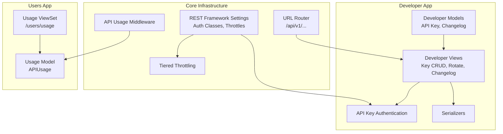
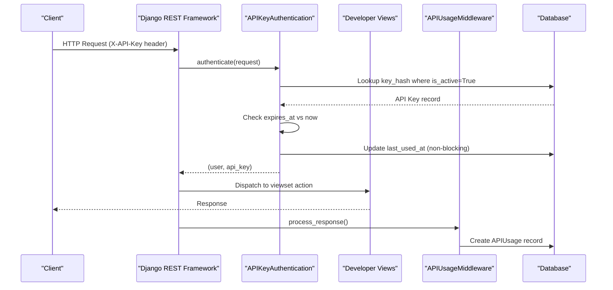
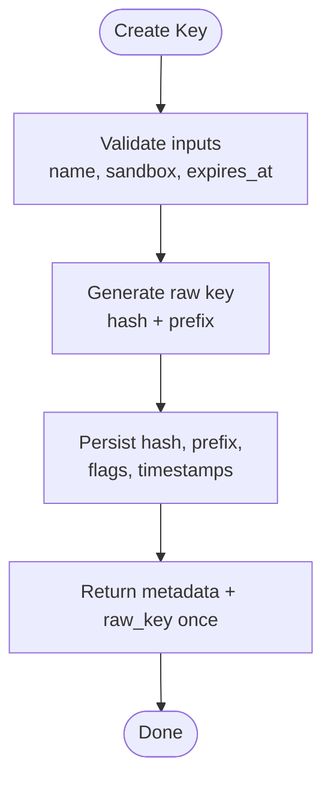
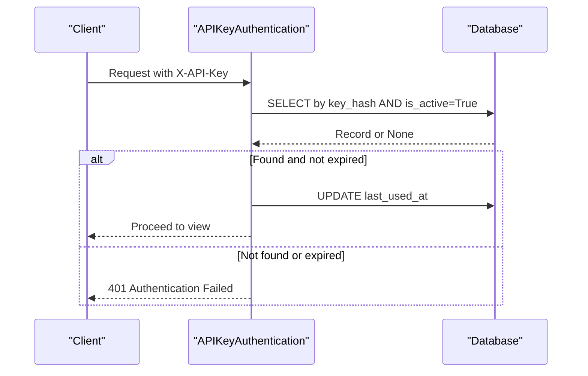
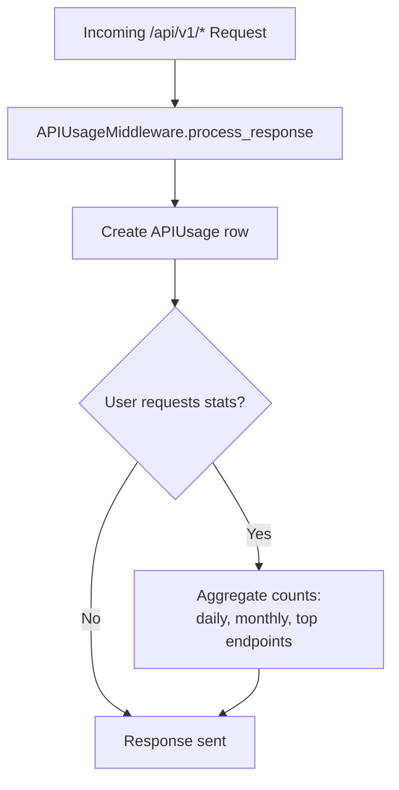
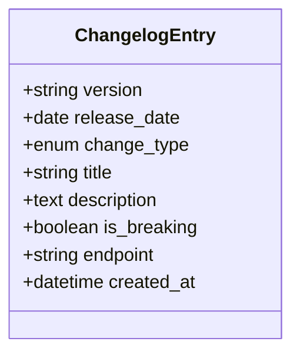
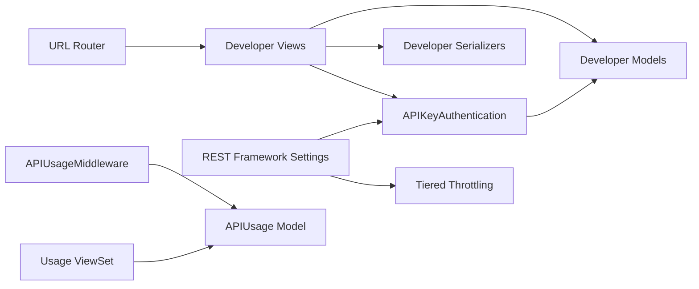

# Developer Portal

<cite>
**Referenced Files in This Document**
- [models.py](file://apps/developer/models.py)
- [views.py](file://apps/developer/views.py)
- [authentication.py](file://apps/developer/authentication.py)
- [serializers.py](file://apps/developer/serializers.py)
- [base.py](file://config/settings/base.py)
- [urls.py](file://config/urls.py)
- [throttling.py](file://apps/core/throttling.py)
- [middleware.py](file://apps/users/middleware.py)
- [models.py](file://apps/users/models.py)
- [views.py](file://apps/users/views.py)
</cite>

## Table of Contents
1. [Introduction](#introduction)
2. [Project Structure](#project-structure)
3. [Core Components](#core-components)
4. [Architecture Overview](#architecture-overview)
5. [Detailed Component Analysis](#detailed-component-analysis)
6. [Dependency Analysis](#dependency-analysis)
7. [Performance Considerations](#performance-considerations)
8. [Troubleshooting Guide](#troubleshooting-guide)
9. [Conclusion](#conclusion)
10. [Appendices](#appendices)

## Introduction
This document explains the Developer Portal features for API key management, usage statistics, and changelog access. It covers how developers generate and manage API keys, authenticate requests using a custom authentication class, rotate keys securely, and monitor consumption through built-in analytics. It also documents the public changelog system for versioning and update notifications, along with security considerations for storage, transmission, and revocation.

## Project Structure
The Developer Portal is implemented as a Django app under apps/developer with supporting infrastructure for authentication, throttling, and usage tracking:
- Developer models define API keys and changelog entries.
- Views expose endpoints to create, list, revoke, and rotate keys, plus a public changelog endpoint.
- A custom authentication class validates API keys via an HTTP header.
- Global settings configure authentication classes, throttling tiers, and OpenAPI documentation.
- URL routing registers developer endpoints alongside other API modules.
- Usage tracking middleware records API calls per user or IP.

**Diagram sources**
- [models.py:10-156](file://apps/developer/models.py#L10-L156)
- [views.py:13-100](file://apps/developer/views.py#L13-L100)
- [authentication.py:10-53](file://apps/developer/authentication.py#L10-L53)
- [base.py:266-301](file://config/settings/base.py#L266-L301)
- [urls.py:106-107](file://config/urls.py#L106-L107)
- [throttling.py:17-88](file://apps/core/throttling.py#L17-L88)
- [middleware.py:6-34](file://apps/users/middleware.py#L6-L34)
- [models.py:140-185](file://apps/users/models.py#L140-L185)
- [views.py:226-266](file://apps/users/views.py#L226-L266)

**Section sources**
- [urls.py:69-107](file://config/urls.py#L69-L107)
- [base.py:266-301](file://config/settings/base.py#L266-L301)

## Core Components
- Developer API Key model: stores hashed keys, prefixes, sandbox flags, expiration, and last-used timestamps. Provides a factory method to mint new keys and returns the raw key only once.
- Changelog Entry model: tracks versioned changes with type, breaking-change flag, affected endpoints, and release date.
- API Key Authentication: reads the X-API-Key header, hashes it, validates against active non-expired keys, and updates last_used_at.
- Developer Views: REST endpoints to list, create, retrieve, revoke (soft-delete), and rotate keys; public read-only changelog listing and retrieval with filtering and search.
- Serializers: safe read-only exposure of key metadata and changelog fields; creation input validation for name, sandbox mode, and optional expiration.
- Throttling: tier-based rate limits applied globally; anonymous and authenticated scopes configured.
- Usage Tracking: middleware records each /api/v1/ request with user, endpoint, method, status, and IP; users can query their own usage stats.

**Section sources**
- [models.py:10-156](file://apps/developer/models.py#L10-L156)
- [authentication.py:10-53](file://apps/developer/authentication.py#L10-L53)
- [views.py:13-100](file://apps/developer/views.py#L13-L100)
- [serializers.py:6-68](file://apps/developer/serializers.py#L6-L68)
- [base.py:266-301](file://config/settings/base.py#L266-L301)
- [middleware.py:6-34](file://apps/users/middleware.py#L6-L34)
- [models.py:140-185](file://apps/users/models.py#L140-L185)
- [views.py:226-266](file://apps/users/views.py#L226-L266)

## Architecture Overview
The Developer Portal integrates with Django REST Framework’s authentication pipeline and global throttling. Requests carrying an X-API-Key are authenticated by the custom authenticator, which validates the key hash and checks expiration. Successful authentication sets the request user and allows downstream views to enforce permissions. Usage is tracked by middleware, and developers can inspect their consumption via the usage viewset. The changelog is publicly accessible for transparency on API versions and changes.

**Diagram sources**
- [authentication.py:24-49](file://apps/developer/authentication.py#L24-L49)
- [views.py:13-100](file://apps/developer/views.py#L13-L100)
- [middleware.py:11-31](file://apps/users/middleware.py#L11-L31)

## Detailed Component Analysis

### API Key Lifecycle and Management
- Generation: Use the POST endpoint to create a key with a friendly name, optional sandbox mode, and optional expiration. The response includes the full key once; only the hash and prefix are stored.
- Listing and Retrieval: List all active keys owned by the current user; retrieve metadata without exposing sensitive data.
- Revocation: Soft-delete by marking a key inactive; this immediately invalidates future requests.
- Rotation: Revoke the current key and issue a replacement with the same settings; the new raw key is returned once.

**Diagram sources**
- [views.py:39-54](file://apps/developer/views.py#L39-L54)
- [models.py:81-100](file://apps/developer/models.py#L81-L100)
- [serializers.py:40-51](file://apps/developer/serializers.py#L40-L51)

**Section sources**
- [views.py:13-83](file://apps/developer/views.py#L13-L83)
- [models.py:10-100](file://apps/developer/models.py#L10-L100)
- [serializers.py:6-51](file://apps/developer/serializers.py#L6-L51)

### Developer Authentication Flow
- Header: Clients send X-API-Key with the raw key value.
- Validation: The server hashes the provided key and looks up an active, non-expired record. On success, it updates last_used_at and attaches the user to the request.
- Errors: Invalid or revoked keys raise authentication failures; expired keys are rejected.

**Diagram sources**
- [authentication.py:24-49](file://apps/developer/authentication.py#L24-L49)
- [models.py:73-76](file://apps/developer/models.py#L73-L76)

**Section sources**
- [authentication.py:10-53](file://apps/developer/authentication.py#L10-L53)
- [models.py:73-76](file://apps/developer/models.py#L73-L76)

### Usage Tracking and Analytics
- Recording: Every /api/v1/ request is recorded with user (or None for anonymous), endpoint, method, response status, and IP address.
- Querying: Users can list their usage and fetch aggregated stats such as daily/monthly counts and top endpoints over the last week.
- Rate Limits: Tier-based throttling applies across the API surface; limits are enforced per scope and user profile tier.

**Diagram sources**
- [middleware.py:11-31](file://apps/users/middleware.py#L11-L31)
- [views.py:226-266](file://apps/users/views.py#L226-L266)
- [models.py:140-185](file://apps/users/models.py#L140-L185)

**Section sources**
- [middleware.py:6-34](file://apps/users/middleware.py#L6-L34)
- [views.py:226-266](file://apps/users/views.py#L226-L266)
- [models.py:140-185](file://apps/users/models.py#L140-L185)
- [base.py:287-301](file://config/settings/base.py#L287-L301)

### Public Changelog System
- Purpose: Provide versioned change logs for API consumers, including breaking changes and affected endpoints.
- Access: Public read-only endpoints support filtering by version, change type, and breaking flag, plus search by title, description, and endpoint.
- Data Model: Stores version, release date, change type, title, description, breaking flag, and endpoint.

**Diagram sources**
- [models.py:103-156](file://apps/developer/models.py#L103-L156)

**Section sources**
- [views.py:86-100](file://apps/developer/views.py#L86-L100)
- [models.py:103-156](file://apps/developer/models.py#L103-L156)

### Permission Scoping and Sandbox Mode
- Sandbox Keys: When creating a key, you can mark it as sandbox to restrict operations to read-only and synthetic data. While sandbox enforcement is conceptualized in the model, ensure your business logic respects the flag when implementing protected actions.
- User Isolation: Key listing and management are scoped to the authenticated user; each user sees only their own keys.

**Section sources**
- [models.py:46-50](file://apps/developer/models.py#L46-L50)
- [views.py:35-36](file://apps/developer/views.py#L35-L36)

### Quota Management Through Throttling
- Tiers: Anonymous, Free, Pro, Premium, and legacy user scopes have distinct daily limits configured globally.
- Enforcement: DRF throttles apply at the framework level; exceeding limits returns 429 responses with Retry-After headers.
- Visibility: Usage stats help developers understand consumption trends and plan capacity.

**Section sources**
- [base.py:287-301](file://config/settings/base.py#L287-L301)
- [throttling.py:17-88](file://apps/core/throttling.py#L17-L88)

## Dependency Analysis
- Developer views depend on developer models and serializers, and rely on global REST Framework configuration for authentication and throttling.
- Authentication depends on the DeveloperAPIKey model and performs database lookups and updates.
- Usage tracking depends on the users app’s APIUsage model and is triggered by middleware on every API v1 request.
- URL router wires developer endpoints into the API namespace.

**Diagram sources**
- [views.py:13-100](file://apps/developer/views.py#L13-L100)
- [models.py:10-156](file://apps/developer/models.py#L10-L156)
- [authentication.py:10-53](file://apps/developer/authentication.py#L10-L53)
- [base.py:266-301](file://config/settings/base.py#L266-L301)
- [urls.py:106-107](file://config/urls.py#L106-L107)
- [middleware.py:6-34](file://apps/users/middleware.py#L6-L34)
- [models.py:140-185](file://apps/users/models.py#L140-L185)
- [views.py:226-266](file://apps/users/views.py#L226-L266)

**Section sources**
- [urls.py:69-107](file://config/urls.py#L69-L107)
- [base.py:266-301](file://config/settings/base.py#L266-L301)

## Performance Considerations
- Key lookup uses indexed fields (key_hash, user+is_active) to minimize query time.
- last_used_at updates are performed via bulk update to avoid N+1 issues during high traffic.
- Usage recording creates one row per API call; consider log rotation or archival strategies for long-term storage.
- Throttling leverages Redis-backed cache for counters; ensure Redis availability and sizing for expected load.

[No sources needed since this section provides general guidance]

## Troubleshooting Guide
- Invalid or revoked key: Ensure the key is active and not expired; verify the header name and value.
- Expired key: Renew or rotate the key before expiration; set appropriate expires_at when creating keys.
- Rate limited: Check your subscription tier and adjust usage patterns; review usage stats to identify hot endpoints.
- Missing usage records: Confirm that requests target /api/v1/ paths; middleware only tracks those routes.

**Section sources**
- [authentication.py:24-49](file://apps/developer/authentication.py#L24-L49)
- [middleware.py:11-31](file://apps/users/middleware.py#L11-L31)
- [base.py:287-301](file://config/settings/base.py#L287-L301)

## Conclusion
The Developer Portal provides secure API key generation, robust authentication, flexible quota management, and transparent changelog access. Developers can automate workflows using keys, rotate them safely, and monitor consumption through usage analytics. Security best practices include storing only hashed keys, transmitting keys via secure headers over HTTPS, and promptly revoking compromised keys.

[No sources needed since this section summarizes without analyzing specific files]

## Appendices

### API Endpoints Summary
- Developer Keys
  - POST /api/v1/developer/keys/ — Create a new API key (returns raw_key once)
  - GET /api/v1/developer/keys/ — List active keys for the current user
  - GET /api/v1/developer/keys/{id}/ — Retrieve key metadata
  - DELETE /api/v1/developer/keys/{id}/ — Revoke a key (soft-delete)
  - POST /api/v1/developer/keys/{id}/rotate/ — Rotate a key (revokes old, issues new)
- Changelog
  - GET /api/v1/developer/changelog/ — List changelog entries (public)
  - GET /api/v1/developer/changelog/{id}/ — Retrieve a specific entry
- Usage
  - GET /api/v1/users/usage/ — List usage records for the current user
  - GET /api/v1/users/usage/stats/ — Get usage statistics

**Section sources**
- [urls.py:106-107](file://config/urls.py#L106-L107)
- [views.py:13-100](file://apps/developer/views.py#L13-L100)
- [views.py:226-266](file://apps/users/views.py#L226-L266)

### Security Considerations
- Storage: Only SHA-256 hashes of keys are persisted; raw keys are never stored after creation.
- Transmission: Send keys via the X-API-Key header over HTTPS to prevent interception.
- Revocation: Immediately mark keys inactive upon compromise; use rotate to replace keys regularly.
- Expiration: Prefer setting expires_at for automation pipelines to limit exposure windows.
- Least Privilege: Use sandbox keys for development/testing to restrict access to read-only and synthetic data.

**Section sources**
- [models.py:10-50](file://apps/developer/models.py#L10-L50)
- [authentication.py:24-49](file://apps/developer/authentication.py#L24-L49)
- [views.py:56-83](file://apps/developer/views.py#L56-L83)