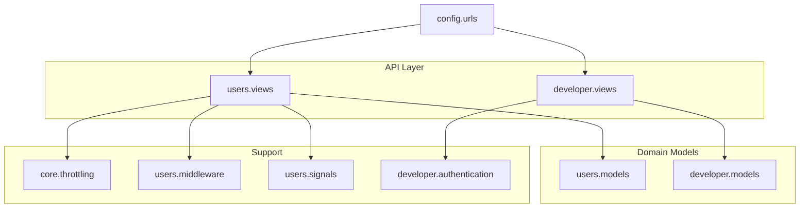
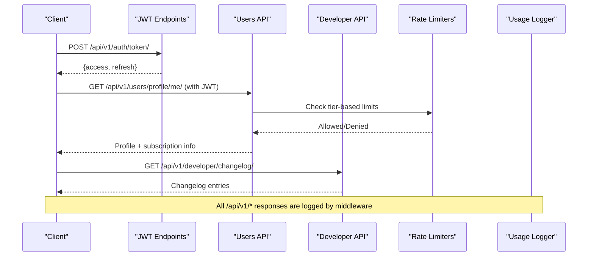
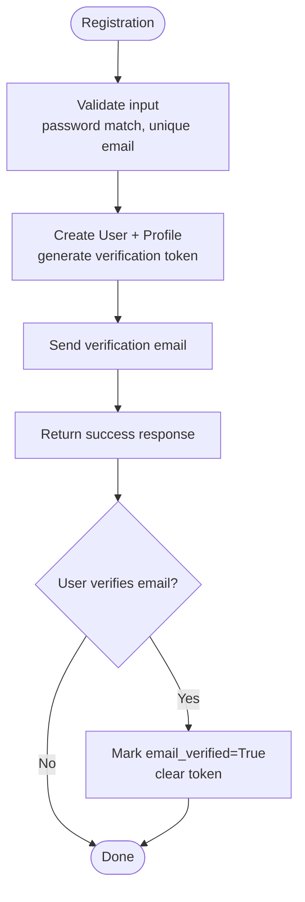
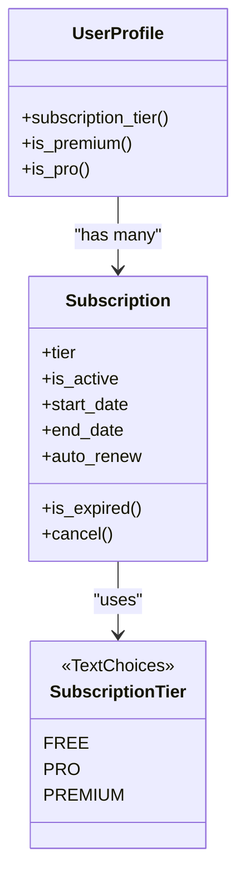
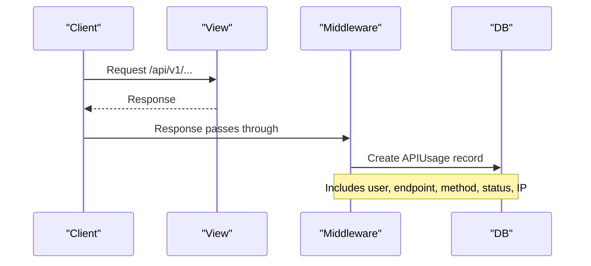
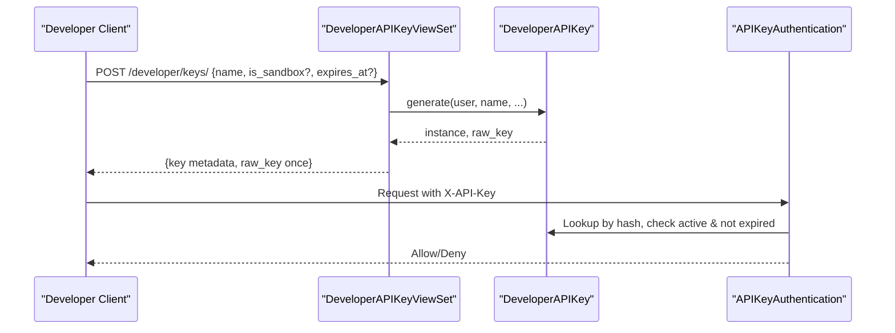
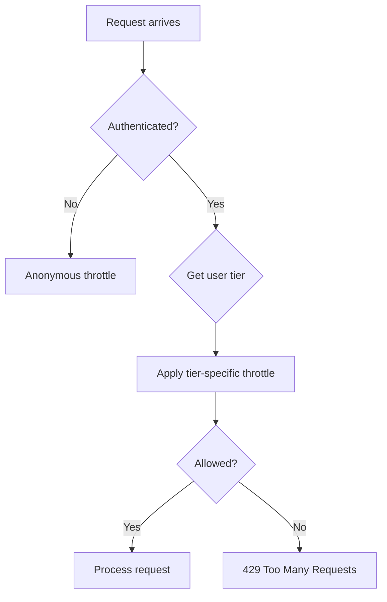
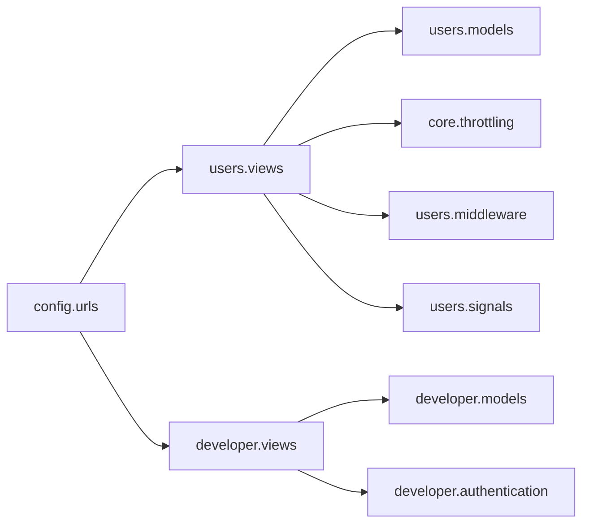

# User Management API

<cite>
**Referenced Files in This Document**
- [apps/users/models.py](file://apps/users/models.py)
- [apps/users/views.py](file://apps/users/views.py)
- [apps/users/serializers.py](file://apps/users/serializers.py)
- [apps/users/middleware.py](file://apps/users/middleware.py)
- [apps/users/signals.py](file://apps/users/signals.py)
- [apps/core/throttling.py](file://apps/core/throttling.py)
- [apps/developer/models.py](file://apps/developer/models.py)
- [apps/developer/views.py](file://apps/developer/views.py)
- [apps/developer/serializers.py](file://apps/developer/serializers.py)
- [apps/developer/authentication.py](file://apps/developer/authentication.py)
- [config/urls.py](file://config/urls.py)
</cite>

## Table of Contents
1. [Introduction](#introduction)
2. [Project Structure](#project-structure)
3. [Core Components](#core-components)
4. [Architecture Overview](#architecture-overview)
5. [Detailed Component Analysis](#detailed-component-analysis)
6. [Dependency Analysis](#dependency-analysis)
7. [Performance Considerations](#performance-considerations)
8. [Troubleshooting Guide](#troubleshooting-guide)
9. [Conclusion](#conclusion)
10. [Appendices](#appendices)

## Introduction
This document explains user account management, subscription handling, and API usage tracking for the platform. It covers:
- User profile operations (registration, verification, password reset, profile updates)
- Subscription tiers and current subscription retrieval
- Usage metering and analytics endpoints
- Developer portal endpoints for API key management and changelog access
- Examples of automation workflows for user onboarding and subscription management

The system uses Django REST Framework with JWT authentication for user sessions and a custom API key authenticator for developer integrations. Rate limiting is tier-aware to enforce quotas per subscription level.

## Project Structure
Key modules involved:
- users: user accounts, profiles, subscriptions, usage tracking, throttling integration
- developer: developer API keys, changelog, and API key authentication
- core: shared throttling utilities
- config: URL routing that wires all endpoints

**Diagram sources**
- [config/urls.py:74-107](file://config/urls.py#L74-L107)
- [apps/users/views.py:1-29](file://apps/users/views.py#L1-L29)
- [apps/developer/views.py:1-10](file://apps/developer/views.py#L1-L10)
- [apps/users/models.py:1-186](file://apps/users/models.py#L1-L186)
- [apps/developer/models.py:1-156](file://apps/developer/models.py#L1-L156)
- [apps/core/throttling.py:1-88](file://apps/core/throttling.py#L1-L88)
- [apps/users/middleware.py:1-34](file://apps/users/middleware.py#L1-L34)
- [apps/users/signals.py:1-23](file://apps/users/signals.py#L1-L23)
- [apps/developer/authentication.py:1-53](file://apps/developer/authentication.py#L1-L53)

**Section sources**
- [config/urls.py:74-129](file://config/urls.py#L74-L129)

## Core Components
- User registration, email verification, and password reset flows
- Profile management and subscription status retrieval
- API usage logging and statistics
- Developer API key lifecycle (create, list, rotate, revoke)
- Public changelog listing
- Tier-based rate limiting

**Section sources**
- [apps/users/views.py:44-284](file://apps/users/views.py#L44-L284)
- [apps/developer/views.py:13-100](file://apps/developer/views.py#L13-L100)
- [apps/core/throttling.py:5-88](file://apps/core/throttling.py#L5-L88)
- [apps/users/middleware.py:6-34](file://apps/users/middleware.py#L6-L34)

## Architecture Overview
The API surface includes:
- Authentication: JWT token obtain/refresh/verify
- Users: register, verify email, password reset, profile CRUD, subscription read, usage stats
- Developer: API key management and public changelog

**Diagram sources**
- [config/urls.py:114-127](file://config/urls.py#L114-L127)
- [apps/users/views.py:32-42](file://apps/users/views.py#L32-L42)
- [apps/users/views.py:160-224](file://apps/users/views.py#L160-L224)
- [apps/developer/views.py:86-100](file://apps/developer/views.py#L86-L100)
- [apps/core/throttling.py:17-88](file://apps/core/throttling.py#L17-L88)
- [apps/users/middleware.py:6-34](file://apps/users/middleware.py#L6-L34)

## Detailed Component Analysis

### User Accounts and Profiles
- Registration creates a user and a UserProfile, generates an email verification token, and sends a verification email.
- Email verification marks the profile verified and clears the token.
- Password reset flow issues a temporary token via email and allows secure password change.
- Profile endpoint returns combined user and profile data and supports partial updates.

**Diagram sources**
- [apps/users/serializers.py:45-110](file://apps/users/serializers.py#L45-L110)
- [apps/users/views.py:44-71](file://apps/users/views.py#L44-L71)
- [apps/users/views.py:74-94](file://apps/users/views.py#L74-L94)
- [apps/users/signals.py:7-13](file://apps/users/signals.py#L7-L13)

**Section sources**
- [apps/users/views.py:44-157](file://apps/users/views.py#L44-L157)
- [apps/users/serializers.py:45-110](file://apps/users/serializers.py#L45-L110)
- [apps/users/signals.py:7-23](file://apps/users/signals.py#L7-L23)

### Subscription Tiers and Current Subscription
- Tiers: Free, Pro, Premium.
- Subscription model tracks Stripe IDs, active state, start/end dates, auto-renewal.
- Current subscription endpoint returns the active subscription or defaults to Free if none exists.
- Profile exposes computed properties for tier checks.

**Diagram sources**
- [apps/users/models.py:7-138](file://apps/users/models.py#L7-L138)

**Section sources**
- [apps/users/models.py:13-138](file://apps/users/models.py#L13-L138)
- [apps/users/views.py:194-224](file://apps/users/views.py#L194-L224)
- [apps/users/serializers.py:113-140](file://apps/users/serializers.py#L113-L140)

### API Usage Tracking and Analytics
- Middleware logs every request under /api/v1/, capturing user, endpoint, method, status code, and IP.
- Usage stats endpoint computes daily/monthly counts, top endpoints, and remaining quota based on tier.
- Quotas: Free 100/day, Pro 1000/day, Premium 10000/day.

**Diagram sources**
- [apps/users/middleware.py:6-34](file://apps/users/middleware.py#L6-L34)

**Section sources**
- [apps/users/middleware.py:6-34](file://apps/users/middleware.py#L6-L34)
- [apps/users/views.py:226-284](file://apps/users/views.py#L226-L284)
- [apps/users/models.py:140-186](file://apps/users/models.py#L140-L186)

### Developer Portal: API Key Management
- Keys are created with a safe prefix and a one-time raw key returned only at creation.
- Keys can be listed, retrieved (metadata only), rotated (revoke old, issue new), and revoked (soft-delete).
- Authentication supports X-API-Key header; expired or inactive keys are rejected; last-used timestamp updated non-blockingly.

**Diagram sources**
- [apps/developer/views.py:13-83](file://apps/developer/views.py#L13-L83)
- [apps/developer/models.py:10-100](file://apps/developer/models.py#L10-L100)
- [apps/developer/authentication.py:10-53](file://apps/developer/authentication.py#L10-L53)

**Section sources**
- [apps/developer/views.py:13-100](file://apps/developer/views.py#L13-L100)
- [apps/developer/models.py:10-100](file://apps/developer/models.py#L10-L100)
- [apps/developer/serializers.py:6-51](file://apps/developer/serializers.py#L6-L51)
- [apps/developer/authentication.py:10-53](file://apps/developer/authentication.py#L10-L53)

### Developer Portal: Changelog Access
- Public read-only endpoint lists changelog entries sorted by release date.
- Supports filtering by version, change type, and breaking changes; search by title/description/endpoint.

**Section sources**
- [apps/developer/views.py:86-100](file://apps/developer/views.py#L86-L100)
- [apps/developer/models.py:103-156](file://apps/developer/models.py#L103-L156)
- [apps/developer/serializers.py:53-68](file://apps/developer/serializers.py#L53-L68)

### Rate Limiting and Quotas
- Dedicated throttle for auth endpoints to protect login/refresh traffic.
- Tier-based throttles apply different daily limits based on subscription tier.
- Usage stats reflect tiered quotas and remaining daily requests.

**Diagram sources**
- [apps/core/throttling.py:5-88](file://apps/core/throttling.py#L5-L88)
- [apps/users/views.py:32-42](file://apps/users/views.py#L32-L42)

**Section sources**
- [apps/core/throttling.py:5-88](file://apps/core/throttling.py#L5-L88)
- [apps/users/views.py:32-42](file://apps/users/views.py#L32-L42)

## Dependency Analysis
- URLs route to viewsets and views that depend on models and serializers.
- Users views depend on throttling and middleware for protection and tracking.
- Developer views depend on custom authentication and models for key lifecycle.
- Signals ensure UserProfile creation upon User creation.

**Diagram sources**
- [config/urls.py:74-129](file://config/urls.py#L74-L129)
- [apps/users/views.py:1-29](file://apps/users/views.py#L1-L29)
- [apps/developer/views.py:1-10](file://apps/developer/views.py#L1-L10)
- [apps/users/models.py:1-186](file://apps/users/models.py#L1-L186)
- [apps/developer/models.py:1-156](file://apps/developer/models.py#L1-L156)
- [apps/core/throttling.py:1-88](file://apps/core/throttling.py#L1-L88)
- [apps/users/middleware.py:1-34](file://apps/users/middleware.py#L1-L34)
- [apps/users/signals.py:1-23](file://apps/users/signals.py#L1-L23)
- [apps/developer/authentication.py:1-53](file://apps/developer/authentication.py#L1-L53)

**Section sources**
- [config/urls.py:74-129](file://config/urls.py#L74-L129)

## Performance Considerations
- Usage logging occurs on every /api/v1/ response; consider batching or async writes in high-throughput environments.
- Indexes on APIUsage (user+timestamp, endpoint+timestamp) optimize queries for stats and history.
- Subscription lookups use efficient filters; ensure database indexes remain effective as data grows.
- Throttling uses cache-backed rate counters; configure cache backend appropriately for performance.

[No sources needed since this section provides general guidance]

## Troubleshooting Guide
- Registration fails due to duplicate email or mismatched passwords: validate inputs and ensure unique constraints.
- Email verification fails: confirm token validity and that the profile has not been previously verified.
- Password reset link does not work: verify token presence and that it matches a valid profile token.
- API usage stats show zero: ensure middleware is enabled and requests go through /api/v1/.
- Rate limit errors: check user’s subscription tier and corresponding daily limits; adjust client retry logic.
- API key authentication failures: ensure X-API-Key header is set, key is active, and not expired.

**Section sources**
- [apps/users/serializers.py:73-110](file://apps/users/serializers.py#L73-L110)
- [apps/users/views.py:74-157](file://apps/users/views.py#L74-L157)
- [apps/users/middleware.py:6-34](file://apps/users/middleware.py#L6-L34)
- [apps/core/throttling.py:17-88](file://apps/core/throttling.py#L17-L88)
- [apps/developer/authentication.py:24-53](file://apps/developer/authentication.py#L24-L53)

## Conclusion
The platform provides a robust foundation for user account management, subscription handling, and API usage tracking. The developer portal enables secure API key management and transparent changelog access. Tier-based throttling and comprehensive usage metrics support scalable and fair usage policies. Automating user onboarding and subscription workflows can streamline operations while maintaining security and compliance.

[No sources needed since this section summarizes without analyzing specific files]

## Appendices

### API Endpoints Reference
- Authentication
  - POST /api/v1/auth/token/ — Obtain JWT pair
  - POST /api/v1/auth/token/refresh/ — Refresh JWT
  - POST /api/v1/auth/token/verify/ — Verify JWT
- Users
  - POST /api/v1/users/register/ — Register user
  - POST /api/v1/users/verify-email/ — Verify email
  - POST /api/v1/users/password-reset/ — Request password reset
  - POST /api/v1/users/password-reset-confirm/ — Confirm password reset
  - GET/PUT/PATCH /api/v1/users/profile/me/ — Get/update profile
  - GET /api/v1/users/subscriptions/ — List subscriptions
  - GET /api/v1/users/subscriptions/current/ — Current active subscription
  - GET /api/v1/users/usage/ — List usage records
  - GET /api/v1/users/usage/stats/ — Usage statistics
- Developer
  - GET/POST/DELETE /api/v1/developer/keys/ — Manage API keys
  - POST /api/v1/developer/keys/{id}/rotate/ — Rotate key
  - GET /api/v1/developer/changelog/ — Public changelog

**Section sources**
- [config/urls.py:114-127](file://config/urls.py#L114-L127)
- [config/urls.py:86-107](file://config/urls.py#L86-L107)

### Example Workflows

#### User Workflow Automation
- On registration:
  - Validate payload, create user and profile, send verification email.
  - On verification: mark email verified and clear token.
  - On password reset: generate token, send email, allow secure reset.
- On profile update:
  - Partial updates supported; return updated profile and user data.

**Section sources**
- [apps/users/views.py:44-157](file://apps/users/views.py#L44-L157)
- [apps/users/serializers.py:45-110](file://apps/users/serializers.py#L45-L110)

#### Subscription Management Automation
- Retrieve current subscription:
  - If active subscription exists within time window, return details; otherwise default to Free.
- Enforce quotas:
  - Use tier-based throttles to limit requests per day according to subscription tier.
  - Expose usage stats to clients for self-service monitoring.

**Section sources**
- [apps/users/views.py:194-284](file://apps/users/views.py#L194-L284)
- [apps/core/throttling.py:17-88](file://apps/core/throttling.py#L17-L88)

#### Developer API Key Lifecycle
- Create key:
  - Generate secure key, store hash and prefix, return raw key once.
- Rotate key:
  - Revoke existing key and issue a replacement with same settings.
- Authenticate:
  - Accept X-API-Key header, validate against stored hash, reject expired/inactive keys.

**Section sources**
- [apps/developer/views.py:13-83](file://apps/developer/views.py#L13-L83)
- [apps/developer/models.py:10-100](file://apps/developer/models.py#L10-L100)
- [apps/developer/authentication.py:10-53](file://apps/developer/authentication.py#L10-L53)