# User Profiles & Subscriptions

<cite>
**Referenced Files in This Document**
- [views.py](file://apps/users/views.py)
- [models.py](file://apps/users/models.py)
- [serializers.py](file://apps/users/serializers.py)
- [urls.py](file://config/urls.py)
- [throttling.py](file://apps/core/throttling.py)
- [middleware.py](file://apps/users/middleware.py)
- [signals.py](file://apps/users/signals.py)
- [base.py](file://config/settings/base.py)
</cite>

## Table of Contents
1. [Introduction](#introduction)
2. [Project Structure](#project-structure)
3. [Core Components](#core-components)
4. [Architecture Overview](#architecture-overview)
5. [Detailed Component Analysis](#detailed-component-analysis)
6. [Dependency Analysis](#dependency-analysis)
7. [Performance Considerations](#performance-considerations)
8. [Troubleshooting Guide](#troubleshooting-guide)
9. [Conclusion](#conclusion)

## Introduction
This document explains user profile management, subscription tier handling, and account settings for the application. It covers:
- Profile CRUD via UserProfileViewSet on /api/v1/users/profile/me/
- Subscription lifecycle management via SubscriptionViewSet (read-only listing and current subscription retrieval)
- Email verification workflow, password reset functionality, and user registration
- Examples of user onboarding flows and subscription upgrade/downgrade scenarios
- Integration points with Stripe payment processing
- Authentication flow using JWT tokens, rate limiting implementation, and security considerations for protecting user data

## Project Structure
The user and subscription features are implemented under apps/users with supporting configuration in config/urls.py and core throttling utilities in apps/core/throttling.py.

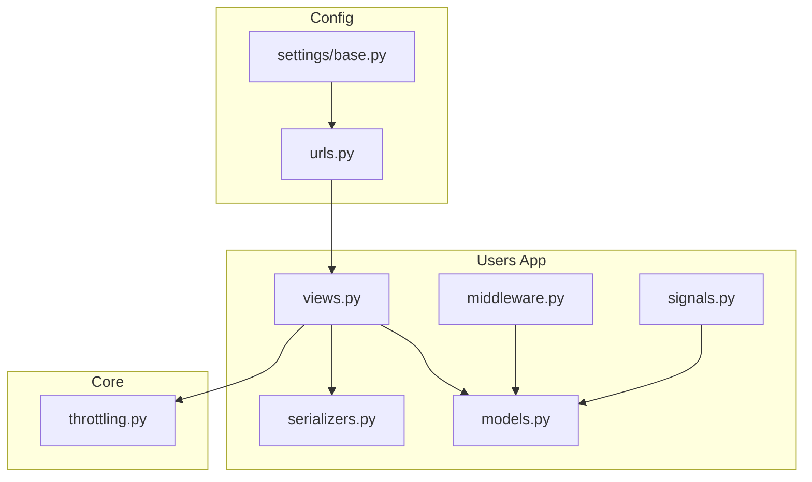

**Diagram sources**
- [urls.py:74-128](file://config/urls.py#L74-L128)
- [views.py:1-284](file://apps/users/views.py#L1-L284)
- [models.py:1-186](file://apps/users/models.py#L1-L186)
- [serializers.py:1-217](file://apps/users/serializers.py#L1-L217)
- [throttling.py:1-88](file://apps/core/throttling.py#L1-L88)
- [middleware.py:1-34](file://apps/users/middleware.py#L1-L34)
- [signals.py:1-23](file://apps/users/signals.py#L1-L23)
- [base.py:64-99](file://config/settings/base.py#L64-L99)

**Section sources**
- [urls.py:74-128](file://config/urls.py#L74-L128)
- [base.py:64-99](file://config/settings/base.py#L64-L99)

## Core Components
- UserProfileViewSet: Provides GET/PUT/PATCH for the current user’s profile at /api/v1/users/profile/me/.
- SubscriptionViewSet: Read-only endpoints to list subscriptions and retrieve the current active subscription at /api/v1/users/subscriptions/current/.
- Registration, email verification, and password reset views:
  - POST /api/v1/users/register/
  - POST /api/v1/users/verify-email/
  - POST /api/v1/users/password-reset/
  - POST /api/v1/users/password-reset-confirm/
- JWT authentication endpoints:
  - POST /api/v1/auth/token/
  - POST /api/v1/auth/token/refresh/
  - POST /api/v1/auth/token/verify/
- API usage tracking and analytics:
  - GET /api/v1/users/usage/
  - GET /api/v1/users/usage/stats/

**Section sources**
- [views.py:44-284](file://apps/users/views.py#L44-L284)
- [urls.py:86-121](file://config/urls.py#L86-L121)

## Architecture Overview
The system uses Django REST Framework viewsets and class-based views to expose a clean API surface. Authentication is handled by JWT tokens with scoped rate limiting for auth endpoints. User profiles and subscriptions are modeled as Django models with one-to-one and one-to-many relationships. Middleware tracks API usage for analytics and rate-limiting decisions.

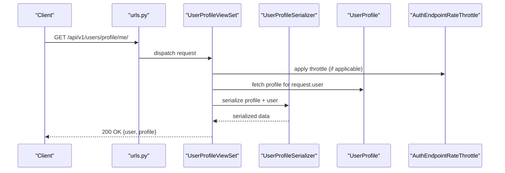

**Diagram sources**
- [urls.py:86-121](file://config/urls.py#L86-L121)
- [views.py:160-192](file://apps/users/views.py#L160-L192)
- [serializers.py:8-26](file://apps/users/serializers.py#L8-L26)
- [models.py:13-66](file://apps/users/models.py#L13-L66)
- [throttling.py:5-15](file://apps/core/throttling.py#L5-L15)

## Detailed Component Analysis

### User Registration Flow
- Endpoint: POST /api/v1/users/register/
- Behavior:
  - Validates input and ensures passwords match and email uniqueness.
  - Creates a new Django User and associated UserProfile via signals.
  - Generates an email verification token and sends a verification email.
  - Returns user data and a success message.

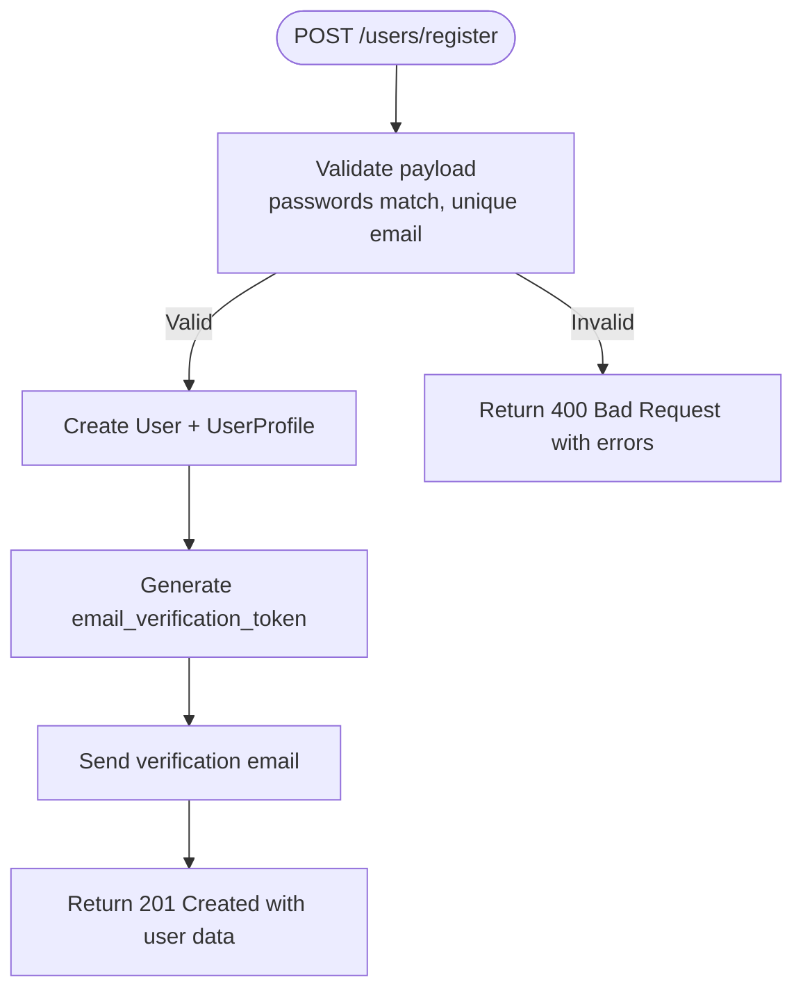

**Diagram sources**
- [views.py:44-71](file://apps/users/views.py#L44-L71)
- [serializers.py:45-110](file://apps/users/serializers.py#L45-L110)
- [signals.py:7-13](file://apps/users/signals.py#L7-L13)

**Section sources**
- [views.py:44-71](file://apps/users/views.py#L44-L71)
- [serializers.py:45-110](file://apps/users/serializers.py#L45-L110)
- [signals.py:7-13](file://apps/users/signals.py#L7-L13)

### Email Verification Workflow
- Endpoint: POST /api/v1/users/verify-email/
- Behavior:
  - Accepts a token from the verification email link.
  - Validates token and marks the profile as verified; clears the token.
  - Returns success response.

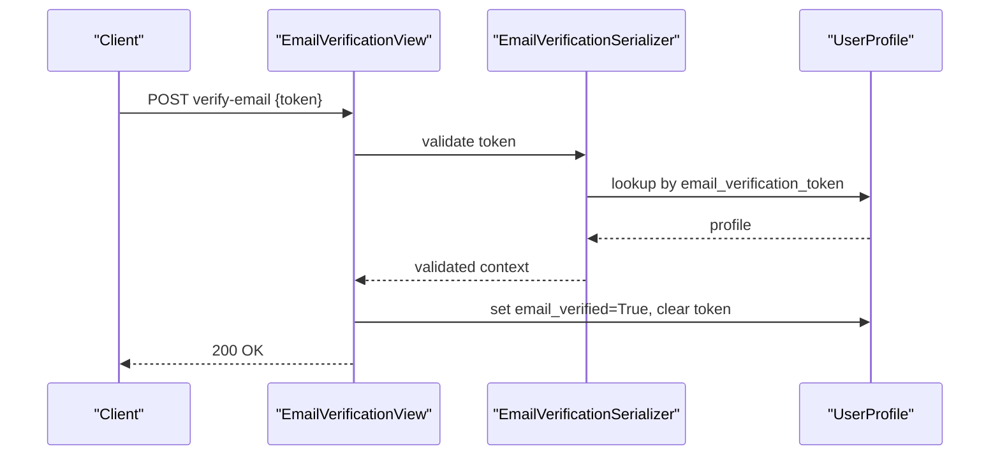

**Diagram sources**
- [views.py:74-94](file://apps/users/views.py#L74-L94)
- [serializers.py:159-171](file://apps/users/serializers.py#L159-L171)
- [models.py:13-66](file://apps/users/models.py#L13-L66)

**Section sources**
- [views.py:74-94](file://apps/users/views.py#L74-L94)
- [serializers.py:159-171](file://apps/users/serializers.py#L159-L171)

### Password Reset Functionality
- Endpoints:
  - POST /api/v1/users/password-reset/
  - POST /api/v1/users/password-reset-confirm/
- Behavior:
  - Request: generates a secure token and sends a reset email; always returns success to prevent enumeration.
  - Confirm: validates token and password confirmation, sets new password, clears token.

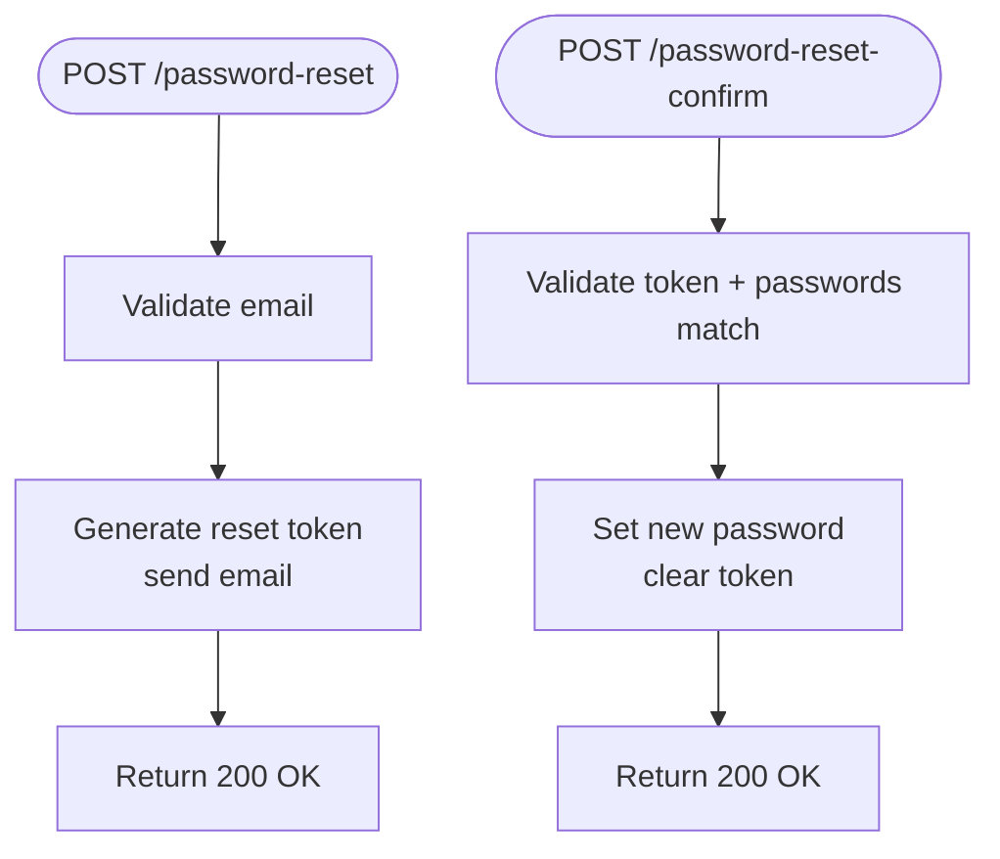

**Diagram sources**
- [views.py:97-157](file://apps/users/views.py#L97-L157)
- [serializers.py:174-216](file://apps/users/serializers.py#L174-L216)

**Section sources**
- [views.py:97-157](file://apps/users/views.py#L97-L157)
- [serializers.py:174-216](file://apps/users/serializers.py#L174-L216)

### Profile Management (CRUD)
- Endpoint: /api/v1/users/profile/me/
- Methods:
  - GET: returns current user’s profile and user details.
  - PUT: fully updates profile fields.
  - PATCH: partially updates profile fields.
- Permissions: Requires authentication.

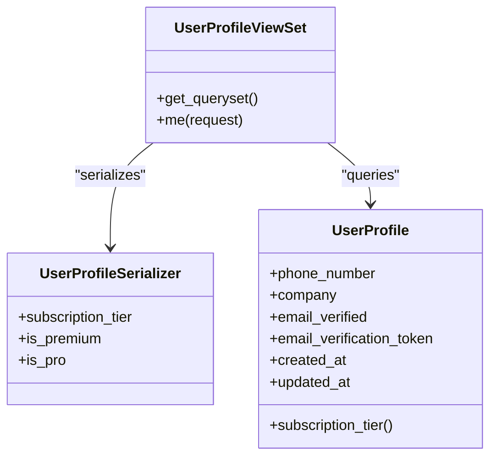

**Diagram sources**
- [views.py:160-192](file://apps/users/views.py#L160-L192)
- [serializers.py:8-26](file://apps/users/serializers.py#L8-L26)
- [models.py:13-66](file://apps/users/models.py#L13-L66)

**Section sources**
- [views.py:160-192](file://apps/users/views.py#L160-L192)
- [serializers.py:8-26](file://apps/users/serializers.py#L8-L26)
- [models.py:13-66](file://apps/users/models.py#L13-L66)

### Subscription Lifecycle Management
- Endpoints:
  - GET /api/v1/users/subscriptions/ — lists user’s subscriptions (read-only).
  - GET /api/v1/users/subscriptions/current/ — retrieves current active subscription or defaults to free tier if none active.
- Models:
  - SubscriptionTier: FREE, PRO, PREMIUM.
  - Subscription: stores tier, Stripe IDs, dates, auto-renew flags, and active status.
- Behavior:
  - Current subscription is determined by active flag and end date.
  - If no active subscription exists, the endpoint returns a default free-tier response.

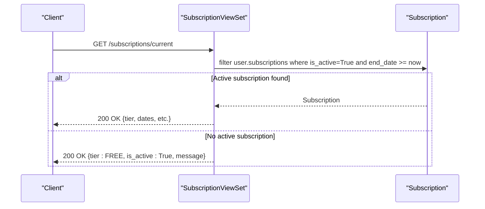

**Diagram sources**
- [views.py:194-223](file://apps/users/views.py#L194-L223)
- [models.py:7-137](file://apps/users/models.py#L7-L137)

**Section sources**
- [views.py:194-223](file://apps/users/views.py#L194-L223)
- [models.py:7-137](file://apps/users/models.py#L7-L137)

### API Usage Tracking and Analytics
- Endpoints:
  - GET /api/v1/users/usage/ — lists all API calls for the current user.
  - GET /api/v1/users/usage/stats/ — provides daily/monthly usage, limits based on tier, top endpoints, and usage percentage.
- Middleware:
  - APIUsageMiddleware records endpoint, method, timestamp, response status, and IP address for each /api/v1/ request.

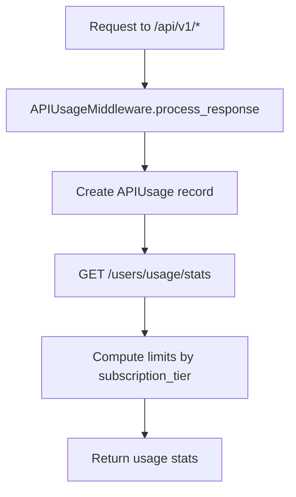

**Diagram sources**
- [middleware.py:6-33](file://apps/users/middleware.py#L6-L33)
- [views.py:226-284](file://apps/users/views.py#L226-L284)
- [models.py:140-186](file://apps/users/models.py#L140-L186)

**Section sources**
- [middleware.py:6-33](file://apps/users/middleware.py#L6-L33)
- [views.py:226-284](file://apps/users/views.py#L226-L284)
- [models.py:140-186](file://apps/users/models.py#L140-L186)

### Authentication Flow with JWT Tokens
- Endpoints:
  - POST /api/v1/auth/token/ — obtain access and refresh tokens.
  - POST /api/v1/auth/token/refresh/ — rotate refresh token to get a new access token.
  - POST /api/v1/auth/token/verify/ — validate a token.
- Security:
  - Scoped rate limiting applied to auth endpoints via AuthEndpointRateThrottle.
  - Token rotation and blacklist enabled in settings.

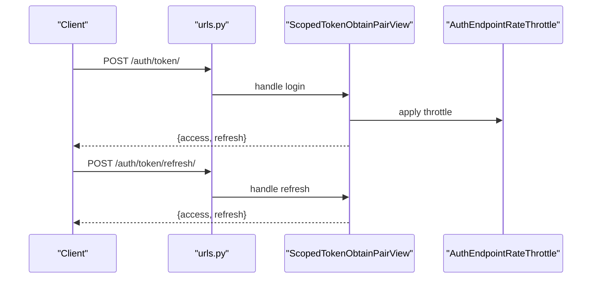

**Diagram sources**
- [urls.py:118-121](file://config/urls.py#L118-L121)
- [views.py:32-42](file://apps/users/views.py#L32-L42)
- [throttling.py:5-15](file://apps/core/throttling.py#L5-L15)
- [base.py:74-74](file://config/settings/base.py#L74-L74)

**Section sources**
- [urls.py:118-121](file://config/urls.py#L118-L121)
- [views.py:32-42](file://apps/users/views.py#L32-L42)
- [throttling.py:5-15](file://apps/core/throttling.py#L5-L15)
- [base.py:74-74](file://config/settings/base.py#L74-L74)

### Rate Limiting Implementation
- Auth endpoints use a dedicated anonymous throttle scope to protect login/refresh traffic independently from global anonymous API limits.
- Tier-based throttles exist for Free, Pro, and Premium users, keyed by user ID and subscription tier.

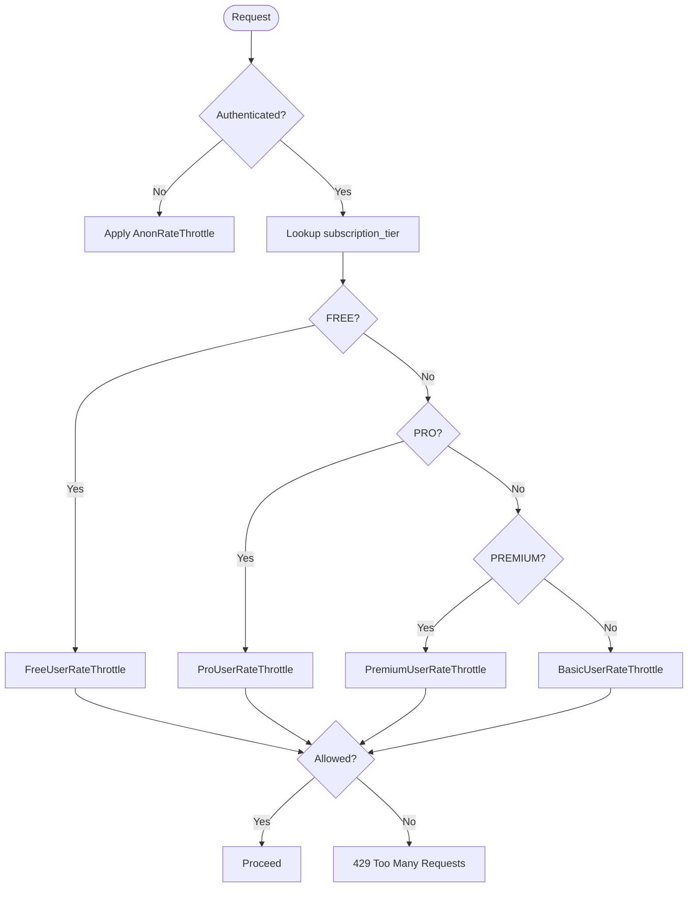

**Diagram sources**
- [throttling.py:5-88](file://apps/core/throttling.py#L5-L88)

**Section sources**
- [throttling.py:5-88](file://apps/core/throttling.py#L5-L88)

### Stripe Payment Processing Integration Points
- The Subscription model includes fields for Stripe integration:
  - stripe_subscription_id
  - stripe_customer_id
- These fields indicate that subscription creation/upgrades/downgrades are managed externally via Stripe and synchronized into the database.
- The current API exposes read-only access to subscriptions; actual subscription changes are expected to be driven by Stripe webhooks or backend services not present in this codebase.

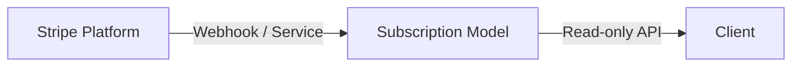

**Diagram sources**
- [models.py:68-137](file://apps/users/models.py#L68-L137)
- [views.py:194-223](file://apps/users/views.py#L194-L223)

**Section sources**
- [models.py:68-137](file://apps/users/models.py#L68-L137)
- [views.py:194-223](file://apps/users/views.py#L194-L223)

## Dependency Analysis
- URLs route to views and viewsets for user operations.
- Views depend on serializers for validation and serialization.
- Serializers rely on models for field definitions and business logic.
- Middleware tracks API usage for analytics and informs usage stats.
- Settings enable JWT token blacklist and DRF components.

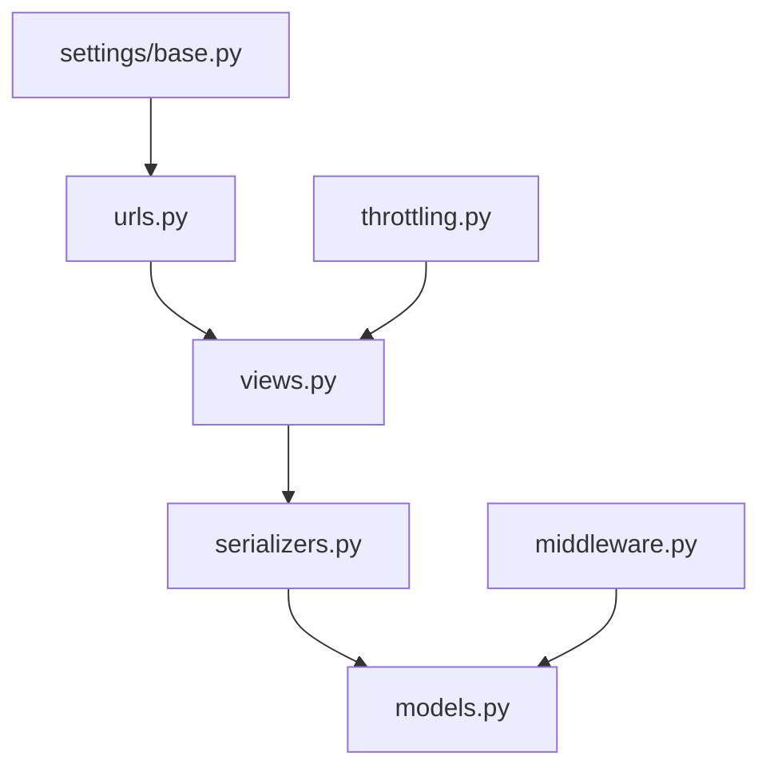

**Diagram sources**
- [urls.py:74-128](file://config/urls.py#L74-L128)
- [views.py:1-284](file://apps/users/views.py#L1-L284)
- [serializers.py:1-217](file://apps/users/serializers.py#L1-L217)
- [models.py:1-186](file://apps/users/models.py#L1-L186)
- [middleware.py:1-34](file://apps/users/middleware.py#L1-L34)
- [base.py:64-99](file://config/settings/base.py#L64-L99)
- [throttling.py:1-88](file://apps/core/throttling.py#L1-L88)

**Section sources**
- [urls.py:74-128](file://config/urls.py#L74-L128)
- [views.py:1-284](file://apps/users/views.py#L1-L284)
- [serializers.py:1-217](file://apps/users/serializers.py#L1-L217)
- [models.py:1-186](file://apps/users/models.py#L1-L186)
- [middleware.py:1-34](file://apps/users/middleware.py#L1-L34)
- [base.py:64-99](file://config/settings/base.py#L64-L99)
- [throttling.py:1-88](file://apps/core/throttling.py#L1-L88)

## Performance Considerations
- Use indexes on frequently queried fields such as user+timestamp and stripe_subscription_id to optimize lookups.
- Keep subscription queries efficient by filtering on is_active and end_date to determine current tiers.
- Apply tier-based throttling to reduce load from high-volume clients while preserving service quality for lower tiers.
- Track API usage via middleware to identify hotspots and optimize endpoints accordingly.

[No sources needed since this section provides general guidance]

## Troubleshooting Guide
- Registration issues:
  - Ensure password fields match and email is unique; check serializer validation errors.
  - Verify email sending configuration and FRONTEND_URL for verification links.
- Email verification failures:
  - Confirm token validity and that the email has not been previously verified.
- Password reset problems:
  - Request always returns success to avoid enumeration; ensure tokens are generated and emails sent.
  - Confirm token matches a valid profile when resetting.
- Subscription current endpoint:
  - If no active subscription exists, expect a default free-tier response; verify subscription records and dates.
- Rate limiting:
  - Auth endpoints are throttled separately; monitor 429 responses and adjust scopes if necessary.
- API usage stats:
  - Ensure middleware is active and requests go through /api/v1/ paths to be tracked.

**Section sources**
- [views.py:44-157](file://apps/users/views.py#L44-L157)
- [serializers.py:45-216](file://apps/users/serializers.py#L45-L216)
- [views.py:194-223](file://apps/users/views.py#L194-L223)
- [throttling.py:5-88](file://apps/core/throttling.py#L5-L88)
- [middleware.py:6-33](file://apps/users/middleware.py#L6-L33)

## Conclusion
The application provides a robust foundation for user profile management, subscription lifecycle visibility, and account security. Key capabilities include:
- Secure user registration with email verification and password reset workflows.
- Read-only subscription management with current tier resolution and Stripe integration points.
- JWT-based authentication with scoped rate limiting and token rotation.
- Comprehensive API usage tracking and analytics to support tiered rate limiting and monitoring.

For production readiness, ensure Stripe webhook handlers are implemented to synchronize subscription state changes, and continue refining rate limits and monitoring based on usage patterns.

[No sources needed since this section summarizes without analyzing specific files]