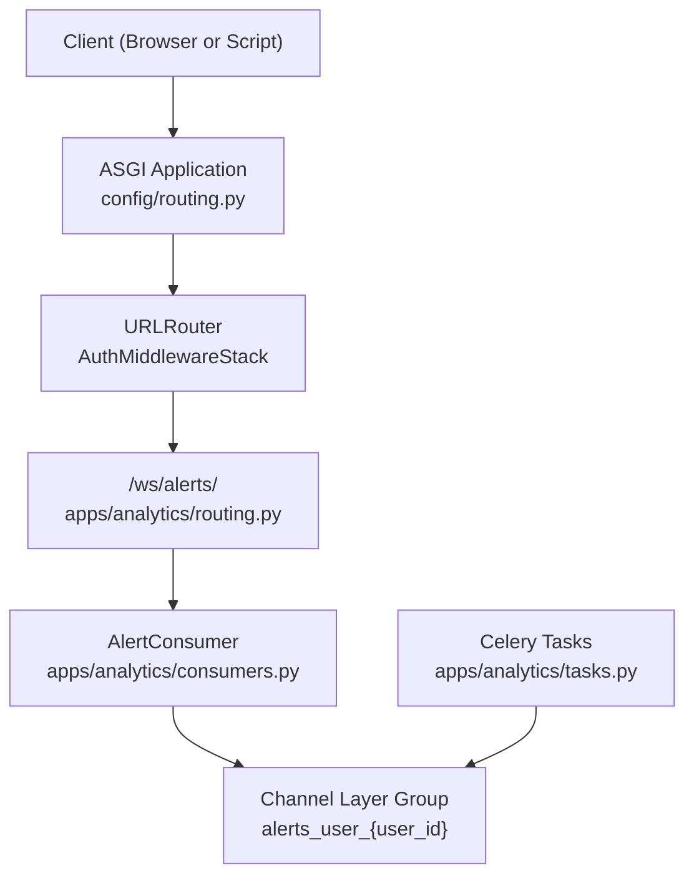
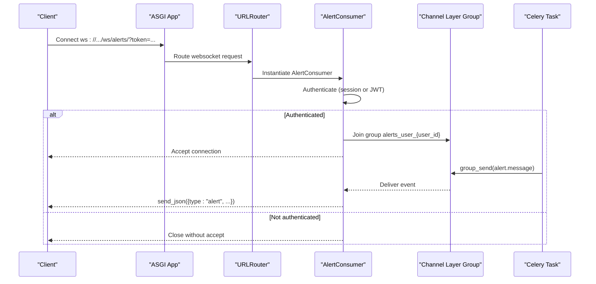
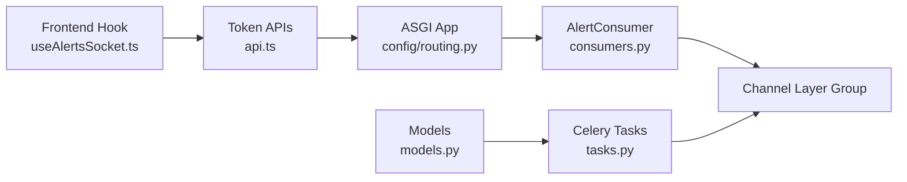

# WebSocket Real-time API

<cite>
**Referenced Files in This Document**
- [consumers.py](file://apps/analytics/consumers.py)
- [routing.py](file://apps/analytics/routing.py)
- [routing.py](file://config/routing.py)
- [tasks.py](file://apps/analytics/tasks.py)
- [models.py](file://apps/analytics/models.py)
- [api.md](file://docs/reference/api.md)
- [useAlertsSocket.ts](file://frontend/src/hooks/useAlertsSocket.ts)
- [api.ts](file://frontend/src/lib/api.ts)
</cite>

## Table of Contents
1. [Introduction](#introduction)
2. [Project Structure](#project-structure)
3. [Core Components](#core-components)
4. [Architecture Overview](#architecture-overview)
5. [Detailed Component Analysis](#detailed-component-analysis)
6. [Dependency Analysis](#dependency-analysis)
7. [Performance Considerations](#performance-considerations)
8. [Troubleshooting Guide](#troubleshooting-guide)
9. [Conclusion](#conclusion)
10. [Appendices](#appendices)

## Introduction
This document provides comprehensive documentation for the real-time alert streaming WebSocket endpoint at /ws/alerts/. It covers connection establishment, authentication, message protocols, event types, filtering mechanisms, client reconnection strategies, error handling patterns, and performance optimization techniques. It also includes guidance for implementing JavaScript/TypeScript clients and Python clients.

## Project Structure
The WebSocket feature is implemented using Django Channels with a JSON-based consumer, routed through an ASGI application that applies authentication middleware. The frontend hook demonstrates a robust reconnection strategy and token handling.

**Diagram sources**
- [routing.py:7-13](file://config/routing.py#L7-L13)
- [routing.py:6-8](file://apps/analytics/routing.py#L6-L8)
- [consumers.py:18-46](file://apps/analytics/consumers.py#L18-L46)
- [tasks.py:1231-1280](file://apps/analytics/tasks.py#L1231-L1280)

**Section sources**
- [routing.py:7-13](file://config/routing.py#L7-L13)
- [routing.py:6-8](file://apps/analytics/routing.py#L6-L8)
- [consumers.py:18-46](file://apps/analytics/consumers.py#L18-L46)
- [tasks.py:1231-1280](file://apps/analytics/tasks.py#L1231-L1280)

## Core Components
- AlertConsumer: Handles WebSocket connections, authenticates users via session or JWT query parameter, joins per-user groups, and sends alert frames.
- Routing: Maps /ws/alerts/ to AlertConsumer under AuthMiddlewareStack.
- Celery Tasks: Evaluate alert rules, persist events, and dispatch notifications including WebSocket messages via channel layer group_send.
- Models: Define AlertRule and AlertEvent schemas, channels configuration, cooldown behavior, and status tracking.
- Frontend Hook: Demonstrates connection management, token acquisition, and exponential backoff reconnection.

**Section sources**
- [consumers.py:18-59](file://apps/analytics/consumers.py#L18-L59)
- [routing.py:6-8](file://apps/analytics/routing.py#L6-L8)
- [routing.py:7-13](file://config/routing.py#L7-L13)
- [tasks.py:1231-1317](file://apps/analytics/tasks.py#L1231-L1317)
- [models.py:87-195](file://apps/analytics/models.py#L87-L195)
- [useAlertsSocket.ts:23-109](file://frontend/src/hooks/useAlertsSocket.ts#L23-L109)

## Architecture Overview
The system streams user-scoped alerts over WebSocket using Django Channels. Authentication is enforced before accepting the connection. When alert rules trigger, Celery tasks persist events and push messages to the appropriate user group. Clients receive JSON frames and can implement UI updates accordingly.

**Diagram sources**
- [routing.py:7-13](file://config/routing.py#L7-L13)
- [routing.py:6-8](file://apps/analytics/routing.py#L6-L8)
- [consumers.py:23-46](file://apps/analytics/consumers.py#L23-L46)
- [tasks.py:1261-1275](file://apps/analytics/tasks.py#L1261-L1275)

## Detailed Component Analysis

### WebSocket Endpoint and Routing
- Path: /ws/alerts/
- Base class: AsyncJsonWebsocketConsumer
- Channel layer: Redis-backed via channels_redis
- ASGI app: config.asgi.application

Authentication flow:
- Session cookie via AuthMiddlewareStack
- JWT query parameter ?token=<access token> validated as SimpleJWT AccessToken
- If no active user, close immediately without accepting

Message format:
- Server pushes JSON frames with type "alert" and fields: event_id, asset_symbol, alert_name, message, created_at
- Receive-only stream; clients do not send messages

Grouping:
- On acceptance, consumer joins group alerts_user_{user_id}
- Messages are sent to this group by tasks when alerts trigger

**Section sources**
- [api.md:243-299](file://docs/reference/api.md#L243-L299)
- [routing.py:6-8](file://apps/analytics/routing.py#L6-L8)
- [routing.py:7-13](file://config/routing.py#L7-L13)
- [consumers.py:23-46](file://apps/analytics/consumers.py#L23-L46)
- [consumers.py:48-59](file://apps/analytics/consumers.py#L48-L59)

### AlertConsumer Implementation
Key behaviors:
- connect(): Attempts authentication via session or JWT; if successful, joins per-user group and accepts; otherwise closes
- disconnect(): Discards group membership on close
- alert_message(): Transforms incoming channel layer events into JSON frames sent to the client

Error handling:
- Exceptions during token parsing result in anonymous user and immediate close
- No explicit error frames; failures surface as connection close events

**Section sources**
- [consumers.py:9-16](file://apps/analytics/consumers.py#L9-L16)
- [consumers.py:23-46](file://apps/analytics/consumers.py#L23-L46)
- [consumers.py:48-59](file://apps/analytics/consumers.py#L48-L59)

### Alert Rule Evaluation and Notification Dispatch
- check_alert_rules(): Iterates active rules, evaluates conditions, creates AlertEvent records, updates last_triggered_at, and schedules notification dispatch
- send_alert_notifications(event_id): Sends email/SMS/websocket based on rule.channels; for websocket, uses channel_layer.group_send to alerts_user_{owner.id}
- Cooldown: Rules respect cooldown_minutes to avoid frequent triggers

Data model highlights:
- AlertRule: owner, asset, condition_type, indicator_type, threshold, channels, cooldown_minutes, is_active, last_triggered_at
- AlertEvent: alert_rule, asset, status, trigger_value, message, metadata, dispatched_channels, notified_at

**Section sources**
- [tasks.py:1231-1280](file://apps/analytics/tasks.py#L1231-L1280)
- [tasks.py:1283-1317](file://apps/analytics/tasks.py#L1283-L1317)
- [models.py:87-195](file://apps/analytics/models.py#L87-L195)

### Client Reconnection Strategy (JavaScript/TypeScript)
- Token acquisition: getSocketAuthToken() returns current access token or refreshes via API
- Connection URL: wsUrl + "?token=" + encoded token
- Reconnect logic: Exponential backoff up to MAX_RECONNECT_ATTEMPTS; clears timers on unmount; resets attempt count on open
- Message handling: Parses JSON frames; falls back to string display on parse errors; maintains limited message history

Best practices demonstrated:
- Use environment variable VITE_ALERTS_WS_URL for configurable endpoints
- Handle both ws and wss based on window.location.protocol
- Avoid reconnecting when no auth credentials exist

**Section sources**
- [useAlertsSocket.ts:11-21](file://frontend/src/hooks/useAlertsSocket.ts#L11-L21)
- [useAlertsSocket.ts:23-109](file://frontend/src/hooks/useAlertsSocket.ts#L23-L109)
- [api.ts:454-469](file://frontend/src/lib/api.ts#L454-L469)
- [api.ts:531-567](file://frontend/src/lib/api.ts#L531-L567)

### Python Client Guidance
While no Python WebSocket client is present in the repository, you can implement a Python client using standard libraries or third-party packages such as websockets or httpx-ws. Recommended approach:
- Establish WebSocket connection to /ws/alerts/?token=<access_token>
- Authenticate using JWT access token obtained from /auth/token/ or refreshed via /auth/token/refresh/
- Subscribe to receive-only frames; handle JSON parsing and update local state
- Implement reconnection with exponential backoff similar to the frontend hook
- Respect server-side grouping; each user receives only their own alerts

Example steps:
- Acquire access token via HTTP POST to /auth/token/
- Optionally refresh token via /auth/token/refresh/
- Connect WebSocket with query parameter token
- Parse incoming JSON frames and process alert events
- Handle connection close events and retry with fresh token

[No sources needed since this section provides general guidance]

## Dependency Analysis
The WebSocket pipeline depends on:
- Django Channels routing and middleware for authentication and URL mapping
- Redis channel layer for group messaging
- Celery tasks for periodic evaluation and dispatch
- SimpleJWT for token validation
- Frontend utilities for token management and reconnection

**Diagram sources**
- [useAlertsSocket.ts:23-109](file://frontend/src/hooks/useAlertsSocket.ts#L23-L109)
- [api.ts:454-469](file://frontend/src/lib/api.ts#L454-L469)
- [routing.py:7-13](file://config/routing.py#L7-L13)
- [consumers.py:23-46](file://apps/analytics/consumers.py#L23-L46)
- [tasks.py:1231-1317](file://apps/analytics/tasks.py#L1231-L1317)
- [models.py:87-195](file://apps/analytics/models.py#L87-L195)

**Section sources**
- [useAlertsSocket.ts:23-109](file://frontend/src/hooks/useAlertsSocket.ts#L23-L109)
- [api.ts:454-469](file://frontend/src/lib/api.ts#L454-L469)
- [routing.py:7-13](file://config/routing.py#L7-L13)
- [consumers.py:23-46](file://apps/analytics/consumers.py#L23-L46)
- [tasks.py:1231-1317](file://apps/analytics/tasks.py#L1231-L1317)
- [models.py:87-195](file://apps/analytics/models.py#L87-L195)

## Performance Considerations
- Group scoping: Each user is isolated in alerts_user_{user_id}, minimizing broadcast overhead
- Receive-only stream: Reduces client-to-server traffic and simplifies concurrency
- Cooldowns: Rule-level cooldown_minutes prevent excessive alert generation
- Periodic evaluation: check_alert_rules runs periodically (documented as every 5 minutes), balancing freshness and load
- Token refresh: Frontend refreshes tokens before reconnecting to avoid expired sessions
- Channel layer: Redis-backed channel layer scales well for group messaging

Optimization recommendations:
- Ensure Redis channel layer is properly sized for expected concurrent connections
- Tune Celery worker concurrency for task throughput
- Monitor alert rule evaluation frequency and adjust scheduling if necessary
- Implement client-side message throttling or batching for UI rendering

[No sources needed since this section provides general guidance]

## Troubleshooting Guide
Common issues and resolutions:
- Connection closed immediately: Indicates authentication failure; verify session or JWT token validity and ensure user is active
- No messages received: Confirm alert rules exist and are active; check that channels include 'websocket'; verify Celery tasks are running
- Repeated reconnects: Check token expiration and refresh logic; ensure hasAnyAuthCredential returns true before reconnect attempts
- Parsing errors: Handle non-JSON frames gracefully; log raw data for debugging

Debugging steps:
- Inspect WebSocket connection URL and query parameters
- Validate JWT token via /auth/token/refresh/ if needed
- Review Celery logs for check_alert_rules and send_alert_notifications
- Verify channel layer connectivity and group membership

**Section sources**
- [consumers.py:23-46](file://apps/analytics/consumers.py#L23-L46)
- [tasks.py:1231-1317](file://apps/analytics/tasks.py#L1231-L1317)
- [useAlertsSocket.ts:50-65](file://frontend/src/hooks/useAlertsSocket.ts#L50-L65)
- [api.ts:531-567](file://frontend/src/lib/api.ts#L531-L567)

## Conclusion
The /ws/alerts/ WebSocket endpoint provides a secure, user-scoped, receive-only stream of alert notifications. Authentication is enforced via session cookies or JWT tokens, and messages are delivered through Django Channels groups. The frontend hook demonstrates robust reconnection and token management. By following the documented protocols and best practices, clients can reliably consume real-time alerts while maintaining performance and security.

[No sources needed since this section summarizes without analyzing specific files]

## Appendices

### Event Types and Fields
- type: "alert"
- event_id: integer identifier of the alert event
- asset_symbol: string representing the asset symbol
- alert_name: string name of the alert rule
- message: human-readable description of the alert
- created_at: ISO timestamp of event creation

**Section sources**
- [api.md:276-299](file://docs/reference/api.md#L276-L299)
- [consumers.py:48-59](file://apps/analytics/consumers.py#L48-L59)

### Filtering Mechanisms
- Server-side filtering: Per-user groups ensure only relevant alerts are delivered
- Rule-level filtering: AlertRule defines condition_type, indicator_type, threshold, and channels
- Cooldown filtering: cooldown_minutes prevents rapid repeated alerts

**Section sources**
- [models.py:87-133](file://apps/analytics/models.py#L87-L133)
- [tasks.py:1283-1317](file://apps/analytics/tasks.py#L1283-L1317)

### Error Handling Patterns
- Authentication failures: Immediate close without accept
- Network errors: Client-side reconnection with exponential backoff
- Token expiration: Refresh token before reconnecting
- Message parsing: Graceful fallback to string display on JSON parse errors

**Section sources**
- [consumers.py:23-46](file://apps/analytics/consumers.py#L23-L46)
- [useAlertsSocket.ts:50-93](file://frontend/src/hooks/useAlertsSocket.ts#L50-L93)
- [api.ts:531-567](file://frontend/src/lib/api.ts#L531-L567)