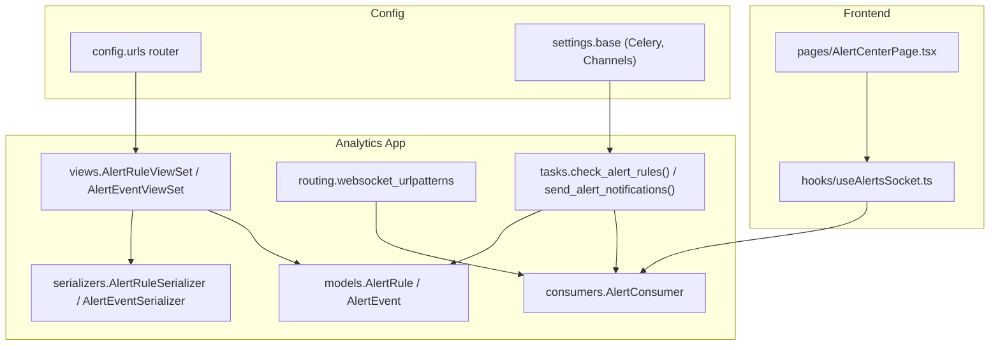
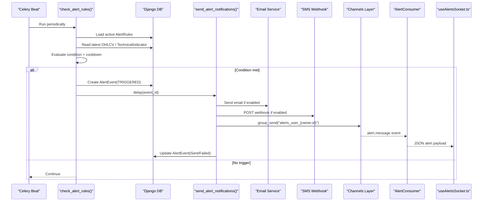
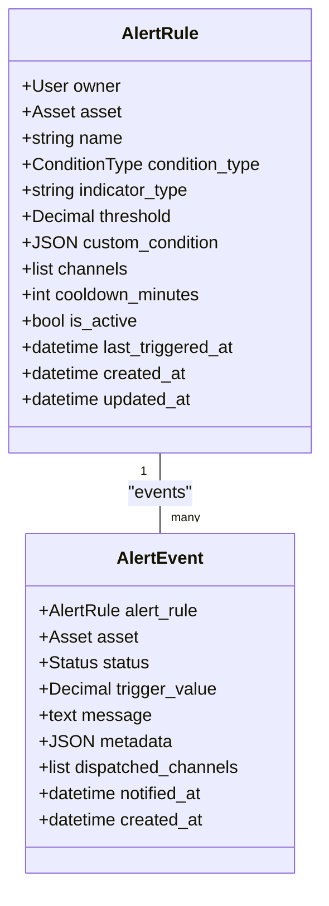
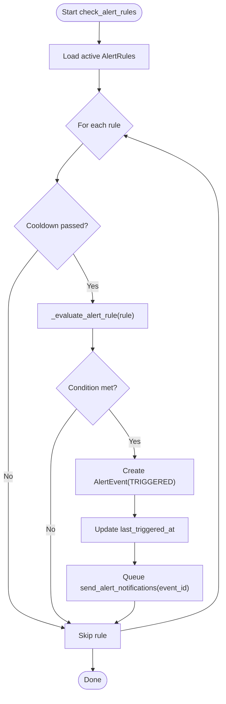
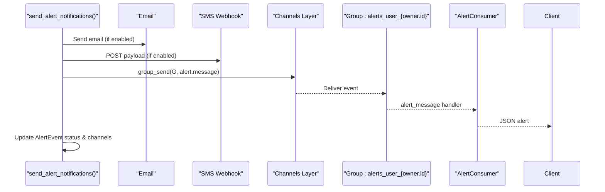
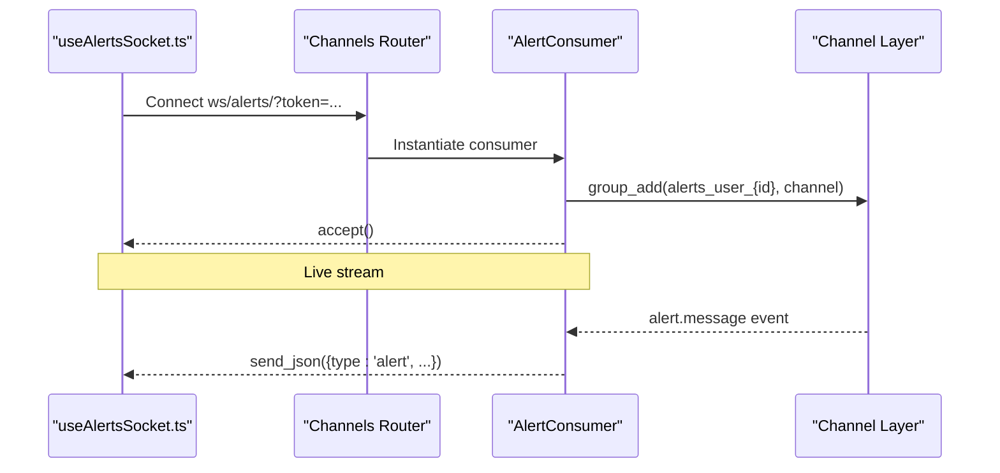
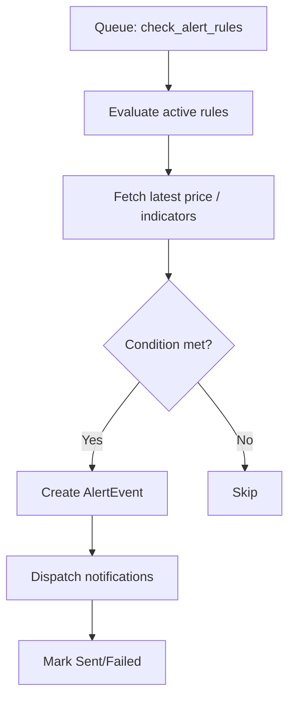
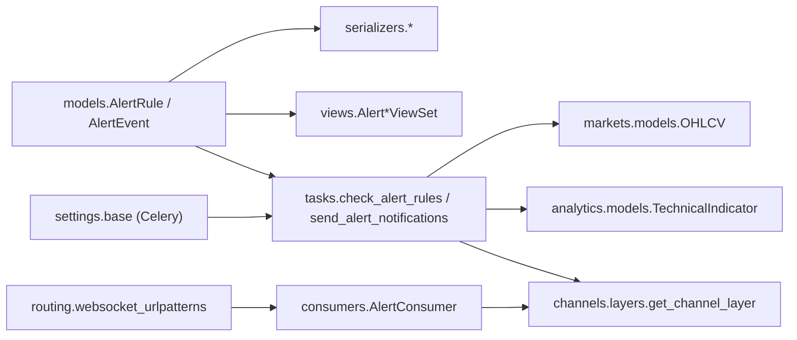

# Alert System

<cite>
**Referenced Files in This Document**
- [models.py](file://apps/analytics/models.py)
- [tasks.py](file://apps/analytics/tasks.py)
- [consumers.py](file://apps/analytics/consumers.py)
- [routing.py](file://apps/analytics/routing.py)
- [serializers.py](file://apps/analytics/serializers.py)
- [views.py](file://apps/analytics/views.py)
- [urls.py](file://config/urls.py)
- [base.py](file://config/settings/base.py)
- [useAlertsSocket.ts](file://frontend/src/hooks/useAlertsSocket.ts)
- [AlertCenterPage.tsx](file://frontend/src/pages/AlertCenterPage.tsx)
- [api.md](file://docs/reference/api.md)
</cite>

## Table of Contents
1. [Introduction](#introduction)
2. [Project Structure](#project-structure)
3. [Core Components](#core-components)
4. [Architecture Overview](#architecture-overview)
5. [Detailed Component Analysis](#detailed-component-analysis)
6. [Dependency Analysis](#dependency-analysis)
7. [Performance Considerations](#performance-considerations)
8. [Troubleshooting Guide](#troubleshooting-guide)
9. [Conclusion](#conclusion)
10. [Appendices](#appendices)

## Introduction
This document explains the Alert System that provides real-time notifications based on price and technical indicator conditions. It covers:
- AlertRule model: condition types, thresholds, channels, cooldown, activation state
- AlertEvent tracking: delivery status and audit trail
- WebSocket consumer for live alert streaming to authenticated users
- Task-based evaluation pipeline: scheduled checks, cooldown enforcement, and multi-channel dispatch
- Integration with analytics (technical indicators, signals), rate limiting, and frontend consumption

## Project Structure
The Alert System lives primarily under apps/analytics and integrates with Django REST Framework, Channels (WebSocket), Celery (background tasks), and the frontend via a React hook and page.

**Diagram sources**
- [models.py:87-195](file://apps/analytics/models.py#L87-L195)
- [tasks.py:1231-1316](file://apps/analytics/tasks.py#L1231-L1316)
- [consumers.py:18-59](file://apps/analytics/consumers.py#L18-L59)
- [routing.py:6-8](file://apps/analytics/routing.py#L6-L8)
- [serializers.py:90-150](file://apps/analytics/serializers.py#L90-L150)
- [views.py:861-894](file://apps/analytics/views.py#L861-L894)
- [urls.py:83-85](file://config/urls.py#L83-L85)
- [base.py:174-189](file://config/settings/base.py#L174-L189)
- [useAlertsSocket.ts:1-108](file://frontend/src/hooks/useAlertsSocket.ts#L1-L108)
- [AlertCenterPage.tsx:1-68](file://frontend/src/pages/AlertCenterPage.tsx#L1-L68)

**Section sources**
- [models.py:87-195](file://apps/analytics/models.py#L87-L195)
- [tasks.py:1231-1316](file://apps/analytics/tasks.py#L1231-L1316)
- [consumers.py:18-59](file://apps/analytics/consumers.py#L18-L59)
- [routing.py:6-8](file://apps/analytics/routing.py#L6-L8)
- [serializers.py:90-150](file://apps/analytics/serializers.py#L90-L150)
- [views.py:861-894](file://apps/analytics/views.py#L861-L894)
- [urls.py:83-85](file://config/urls.py#L83-L85)
- [base.py:174-189](file://config/settings/base.py#L174-L189)
- [useAlertsSocket.ts:1-108](file://frontend/src/hooks/useAlertsSocket.ts#L1-L108)
- [AlertCenterPage.tsx:1-68](file://frontend/src/pages/AlertCenterPage.tsx#L1-L68)

## Core Components
- AlertRule: Defines per-user rules tied to an asset, with condition type (price above/below, indicator above/below), threshold, optional custom condition, notification channels (email, sms, websocket), cooldown minutes, activation flag, and last triggered timestamp.
- AlertEvent: Records each trigger with status (triggered, sent, failed), trigger value, message, metadata, dispatched channels, and notified_at timestamp. Provides an audit trail.
- Evaluation Pipeline: A Celery task iterates active rules, enforces cooldown, evaluates conditions against latest price or indicator values, creates AlertEvent records, and dispatches notifications asynchronously.
- WebSocket Consumer: Streams alerts to authenticated users via a user-scoped group channel.
- API Surface: CRUD for alert rules and read-only history for alert events.

**Section sources**
- [models.py:87-195](file://apps/analytics/models.py#L87-L195)
- [tasks.py:1283-1316](file://apps/analytics/tasks.py#L1283-L1316)
- [consumers.py:18-59](file://apps/analytics/consumers.py#L18-L59)
- [serializers.py:90-150](file://apps/analytics/serializers.py#L90-L150)
- [views.py:861-894](file://apps/analytics/views.py#L861-L894)

## Architecture Overview
End-to-end flow from rule evaluation to user notification:

**Diagram sources**
- [tasks.py:1283-1316](file://apps/analytics/tasks.py#L1283-L1316)
- [tasks.py:1231-1280](file://apps/analytics/tasks.py#L1231-L1280)
- [consumers.py:18-59](file://apps/analytics/consumers.py#L18-L59)
- [routing.py:6-8](file://apps/analytics/routing.py#L6-L8)
- [useAlertsSocket.ts:1-108](file://frontend/src/hooks/useAlertsSocket.ts#L1-L108)

## Detailed Component Analysis

### AlertRule Model
- Fields: owner, asset, name, condition_type, indicator_type (for indicator-based rules), threshold, custom_condition (JSON), channels (list), cooldown_minutes, is_active, last_triggered_at, timestamps.
- Indexes optimize queries by owner and asset with activation state.
- Validation in serializer ensures indicator_type is present for indicator conditions and channels are restricted to allowed set.

**Diagram sources**
- [models.py:87-195](file://apps/analytics/models.py#L87-L195)

**Section sources**
- [models.py:87-145](file://apps/analytics/models.py#L87-L145)
- [serializers.py:90-122](file://apps/analytics/serializers.py#L90-L122)

### AlertEvent Tracking and Audit Trail
- Status lifecycle: TRIGGERED -> SENT or FAILED after dispatch attempt.
- Stores trigger_value, message, metadata (condition_type, indicator_type, threshold), and which channels were used.
- Indexed by alert_rule and status for efficient querying and reporting.

**Section sources**
- [models.py:148-195](file://apps/analytics/models.py#L148-L195)
- [tasks.py:1277-1280](file://apps/analytics/tasks.py#L1277-L1280)

### Evaluation Pipeline and Cooldown Mechanism
- check_alert_rules(): Loads active rules, skips those within cooldown window, evaluates conditions, creates AlertEvent, updates last_triggered_at, and queues send_alert_notifications().
- _evaluate_alert_rule(): Compares current price or latest indicator value against threshold based on condition_type.
- Cooldown: Enforced via last_triggered_at and cooldown_minutes to prevent alert storms.

**Diagram sources**
- [tasks.py:1283-1316](file://apps/analytics/tasks.py#L1283-L1316)
- [tasks.py:1198-1209](file://apps/analytics/tasks.py#L1198-L1209)

**Section sources**
- [tasks.py:1198-1209](file://apps/analytics/tasks.py#L1198-L1209)
- [tasks.py:1283-1316](file://apps/analytics/tasks.py#L1283-L1316)

### Multi-Channel Notification Dispatch
- Email: Uses Django’s send_mail when 'email' is in channels and owner has an email.
- SMS: Sends JSON payload to a configured webhook URL; success recorded only on HTTP 2xx.
- WebSocket: Publishes to user-scoped group via Channels layer; tracked in dispatched_channels.
- Event status updated to SENT if any channel succeeds; otherwise FAILED.

**Diagram sources**
- [tasks.py:1231-1280](file://apps/analytics/tasks.py#L1231-L1280)
- [consumers.py:18-59](file://apps/analytics/consumers.py#L18-L59)

**Section sources**
- [tasks.py:1212-1280](file://apps/analytics/tasks.py#L1212-L1280)
- [consumers.py:18-59](file://apps/analytics/consumers.py#L18-L59)

### WebSocket Consumer Implementation
- Authenticates via JWT token query parameter or session user.
- Joins a user-specific group named alerts_user_{user.id}.
- Handles incoming alert messages and forwards structured JSON to connected clients.

**Diagram sources**
- [routing.py:6-8](file://apps/analytics/routing.py#L6-L8)
- [consumers.py:18-59](file://apps/analytics/consumers.py#L18-L59)
- [useAlertsSocket.ts:1-108](file://frontend/src/hooks/useAlertsSocket.ts#L1-L108)

**Section sources**
- [consumers.py:18-59](file://apps/analytics/consumers.py#L18-L59)
- [routing.py:6-8](file://apps/analytics/routing.py#L6-L8)
- [useAlertsSocket.ts:1-108](file://frontend/src/hooks/useAlertsSocket.ts#L1-L108)

### Task-Based Alert Evaluation Pipeline
- Scheduled via Celery Beat (configured elsewhere) to run check_alert_rules periodically.
- Reads latest data from markets models (OHLCV) and analytics indicators (TechnicalIndicator).
- Persists SignalEvents for Phase 10 signals; these can be used by dashboards and potentially inform future alert strategies.

**Diagram sources**
- [tasks.py:1283-1316](file://apps/analytics/tasks.py#L1283-L1316)
- [tasks.py:1198-1209](file://apps/analytics/tasks.py#L1198-L1209)

**Section sources**
- [tasks.py:1283-1316](file://apps/analytics/tasks.py#L1283-L1316)
- [tasks.py:1198-1209](file://apps/analytics/tasks.py#L1198-L1209)

### Integration with Analytics Ecosystem
- Uses TechnicalIndicator values (RSI, MACD, BBANDS, SMA, EMA, STOCH, ADX, OBV, FIB_RET) computed by background tasks.
- SignalEvent records Phase 10 signals (e.g., golden/death crosses, volume spikes) for analytics dashboards and potential alert triggers.
- Views expose endpoints to list, filter, and recalculate indicators and signals.

**Section sources**
- [tasks.py:67-615](file://apps/analytics/tasks.py#L67-L615)
- [tasks.py:622-800](file://apps/analytics/tasks.py#L622-L800)
- [views.py:424-735](file://apps/analytics/views.py#L424-L735)

### API Endpoints for Alerts
- Alert Rules:
  - GET/POST/PUT/DELETE /api/v1/alerts/ (CRUD, user-scoped)
  - GET /api/v1/alerts/active/ (list active rules)
- Alert Events:
  - GET /api/v1/alert-events/ (paginated, filtered by status, asset, alert_rule; user-scoped)

**Section sources**
- [views.py:861-894](file://apps/analytics/views.py#L861-L894)
- [urls.py:83-85](file://config/urls.py#L83-L85)

### Rate Limiting and Throttling
- Global API throttling is tier-based and documented in the reference docs.
- Alert system uses Celery tasks and Channels groups; no explicit per-rule throttle beyond cooldown_minutes.
- Ensure external SMS webhooks handle their own rate limits; failures are recorded as non-sent channels.

**Section sources**
- [api.md:188-221](file://docs/reference/api.md#L188-L221)

## Dependency Analysis
Key dependencies and relationships:
- models.py defines AlertRule and AlertEvent, referenced by serializers, views, and tasks.
- tasks.py depends on markets.models.OHLCV and analytics.models.TechnicalIndicator for evaluation.
- consumers.py depends on Channels layers and JWT tokens for authentication.
- routing.py wires WebSocket path to AlertConsumer.
- settings.base configures Celery queues and broker.

**Diagram sources**
- [models.py:87-195](file://apps/analytics/models.py#L87-L195)
- [tasks.py:1231-1316](file://apps/analytics/tasks.py#L1231-L1316)
- [consumers.py:18-59](file://apps/analytics/consumers.py#L18-L59)
- [routing.py:6-8](file://apps/analytics/routing.py#L6-L8)
- [base.py:174-189](file://config/settings/base.py#L174-L189)

**Section sources**
- [models.py:87-195](file://apps/analytics/models.py#L87-L195)
- [tasks.py:1231-1316](file://apps/analytics/tasks.py#L1231-L1316)
- [consumers.py:18-59](file://apps/analytics/consumers.py#L18-L59)
- [routing.py:6-8](file://apps/analytics/routing.py#L6-L8)
- [base.py:174-189](file://config/settings/base.py#L174-L189)

## Performance Considerations
- Indicator freshness: Tasks use staleness checks to avoid recomputation when data is unchanged.
- Database indexes: AlertRule and AlertEvent have indexes for owner, asset, and status to speed up queries.
- Cooldown: Prevents excessive evaluations and notifications.
- Batch operations: Indicator calculations use bulk_create where applicable.
- Channel layer: Group-based messaging scales to multiple clients per user.

[No sources needed since this section provides general guidance]

## Troubleshooting Guide
Common issues and resolutions:
- No alerts received via WebSocket:
  - Verify client connects with valid JWT token query parameter.
  - Confirm consumer joins correct group and channel layer is available.
  - Check server logs for group_send errors.
- Email not delivered:
  - Ensure owner has an email and DEFAULT_FROM_EMAIL is configured.
  - Review mail backend configuration and server logs.
- SMS not delivered:
  - Validate ALERTS_ENABLE_SMS and SMS_WEBHOOK_URL settings.
  - Inspect webhook responses; non-2xx results mark SMS as not sent.
- Too many alerts:
  - Increase cooldown_minutes for affected rules.
  - Review thresholds and condition types for specificity.
- Stale indicator values:
  - Ensure indicator calculation tasks run successfully and data windows are fresh.
  - Use recalculation endpoints to refresh indicators if needed.

**Section sources**
- [consumers.py:18-59](file://apps/analytics/consumers.py#L18-L59)
- [tasks.py:1212-1280](file://apps/analytics/tasks.py#L1212-L1280)
- [views.py:690-735](file://apps/analytics/views.py#L690-L735)

## Conclusion
The Alert System combines robust data-driven rule evaluation, reliable audit trails, and real-time delivery through multiple channels. It leverages existing analytics infrastructure for indicators and signals, while providing clear APIs and a responsive frontend experience. Proper configuration of cooldowns, channels, and background workers ensures scalable and timely notifications.

[No sources needed since this section summarizes without analyzing specific files]

## Appendices

### Example: Alert Rule Configuration
- Create a rule for price above a threshold:
  - Set condition_type to PRICE_ABOVE, provide threshold, choose channels (e.g., ["email", "websocket"]), set cooldown_minutes, ensure is_active=True.
- Create a rule for indicator above/below:
  - Set condition_type to INDICATOR_ABOVE or INDICATOR_BELOW, specify indicator_type (e.g., RSI), set threshold accordingly.

**Section sources**
- [serializers.py:90-122](file://apps/analytics/serializers.py#L90-L122)
- [models.py:87-145](file://apps/analytics/models.py#L87-L145)

### Example: Multi-Channel Notification Setup
- Enable email: Include 'email' in channels and ensure owner email exists.
- Enable SMS: Configure ALERTS_ENABLE_SMS and SMS_WEBHOOK_URL; include 'sms' in channels.
- Enable WebSocket: Include 'websocket' in channels; connect frontend to ws/alerts/ with token.

**Section sources**
- [tasks.py:1231-1280](file://apps/analytics/tasks.py#L1231-L1280)
- [consumers.py:18-59](file://apps/analytics/consumers.py#L18-L59)
- [useAlertsSocket.ts:1-108](file://frontend/src/hooks/useAlertsSocket.ts#L1-L108)

### Example: Viewing Alert History
- Query /api/v1/alert-events/ with filters such as status, asset, or alert_rule to review delivery outcomes and timestamps.

**Section sources**
- [views.py:881-894](file://apps/analytics/views.py#L881-L894)
- [serializers.py:125-135](file://apps/analytics/serializers.py#L125-L135)