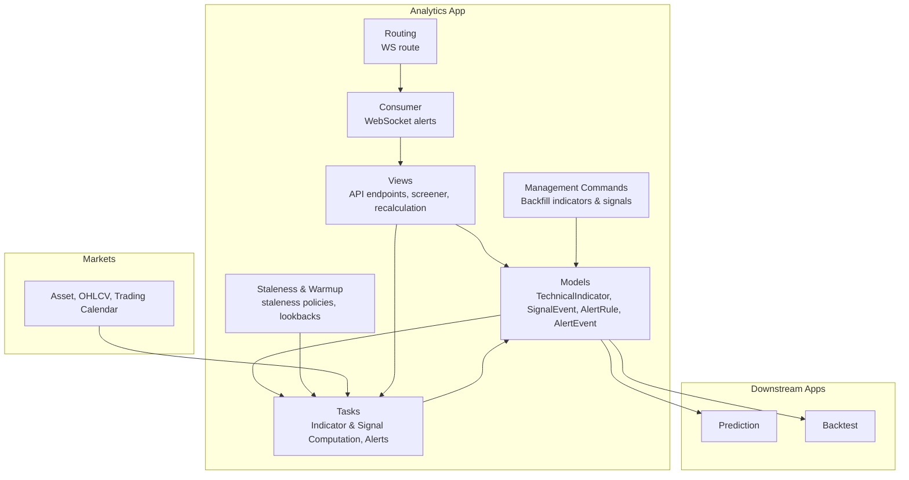
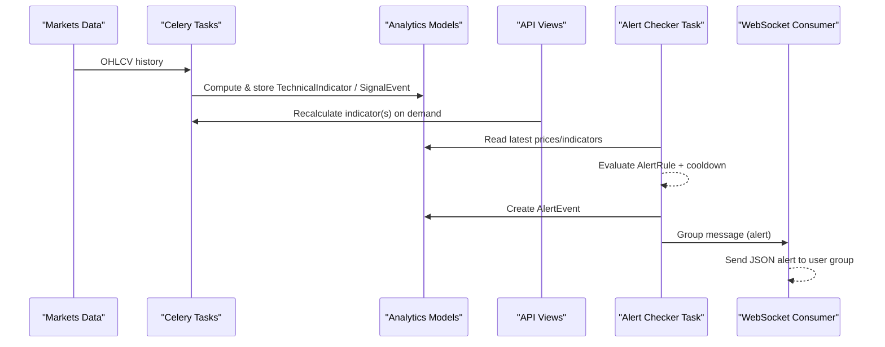
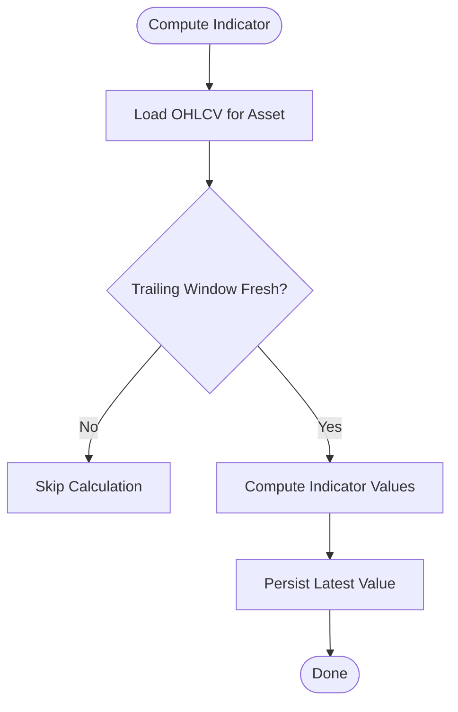
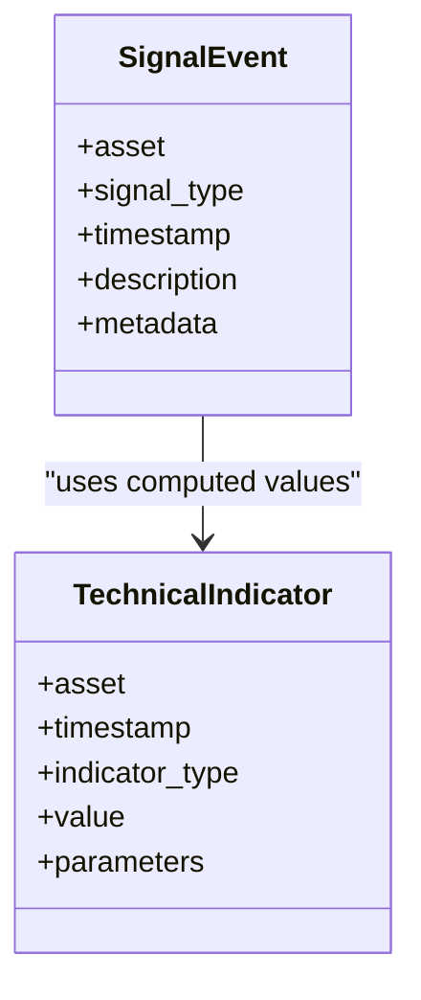
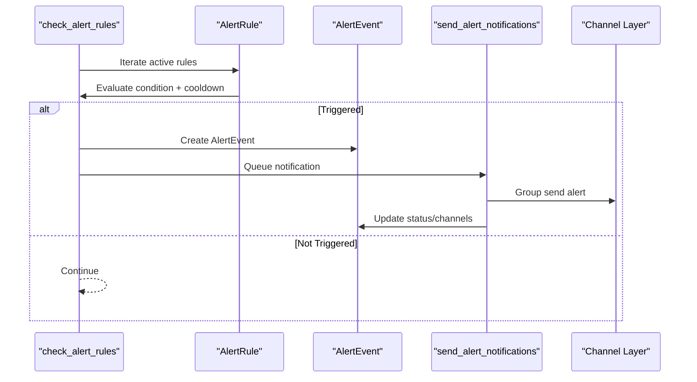
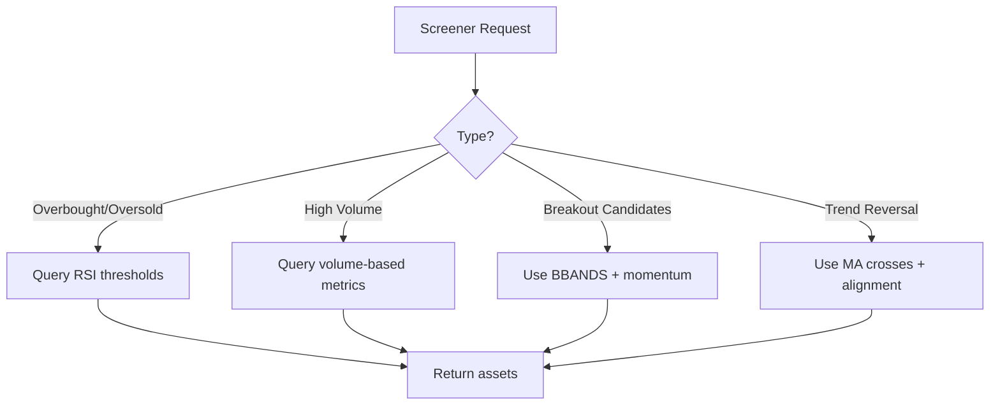
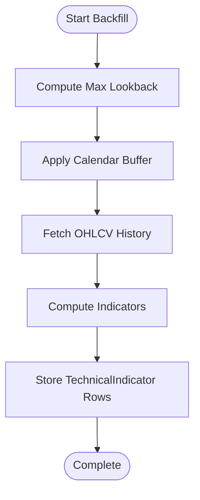
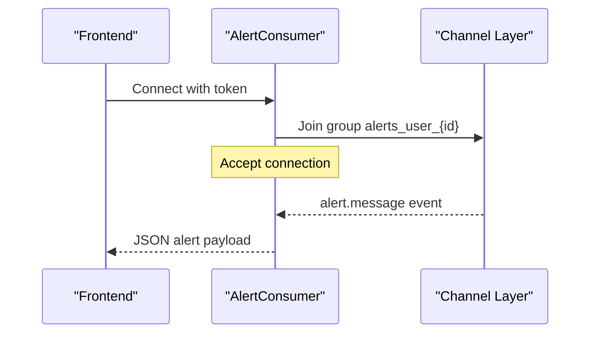
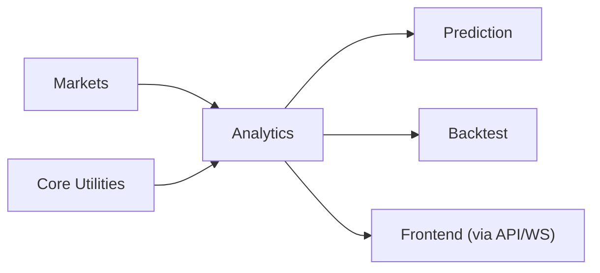

# Analytics Application

<cite>
**Referenced Files in This Document**
- [models.py](file://apps/analytics/models.py)
- [technical_staleness.py](file://apps/analytics/technical_staleness.py)
- [indicator_warmup.py](file://apps/analytics/indicator_warmup.py)
- [tasks.py](file://apps/analytics/tasks.py)
- [consumers.py](file://apps/analytics/consumers.py)
- [routing.py](file://apps/analytics/routing.py)
- [views.py](file://apps/analytics/views.py)
- [backfill_technical_indicators.py](file://apps/analytics/management/commands/backfill_technical_indicators.py)
- [backfill_signal_events.py](file://apps/analytics/management/commands/backfill_signal_events.py)
- [admin.py](file://apps/analytics/admin.py)
</cite>

## Table of Contents
1. [Introduction](#introduction)
2. [Project Structure](#project-structure)
3. [Core Components](#core-components)
4. [Architecture Overview](#architecture-overview)
5. [Detailed Component Analysis](#detailed-component-analysis)
6. [Dependency Analysis](#dependency-analysis)
7. [Performance Considerations](#performance-considerations)
8. [Troubleshooting Guide](#troubleshooting-guide)
9. [Conclusion](#conclusion)
10. [Appendices](#appendices)

## Introduction
The Analytics application computes technical indicators from market data, detects trading signals, evaluates alert rules, and delivers real-time notifications to clients. It depends on the Markets module for OHLCV and asset metadata, and provides derived analytics consumed by downstream applications such as Prediction and Backtest. The system supports:
- Technical indicator computation with staleness policies and warmup lookbacks
- Signal event generation for moving average crosses, Bollinger Band conditions, volume spikes, momentum, and reversal combinations
- Alert rule evaluation with cooldowns and multi-channel delivery (email, SMS webhook, WebSocket)
- Screener templates and prebuilt screeners
- Batch backfill commands for historical indicators and signals
- Asynchronous task queue processing via Celery
- Real-time WebSocket consumers for live alerts

## Project Structure
The Analytics app is organized around models, computation tasks, staleness/warmup utilities, API views, WebSocket consumer, and management commands for backfills.

**Diagram sources**
- [models.py:8-255](file://apps/analytics/models.py#L8-L255)
- [tasks.py:28-1317](file://apps/analytics/tasks.py#L28-L1317)
- [technical_staleness.py:9-190](file://apps/analytics/technical_staleness.py#L9-L190)
- [indicator_warmup.py:4-143](file://apps/analytics/indicator_warmup.py#L4-L143)
- [views.py:424-800](file://apps/analytics/views.py#L424-L800)
- [consumers.py:18-59](file://apps/analytics/consumers.py#L18-L59)
- [routing.py:6-8](file://apps/analytics/routing.py#L6-L8)
- [backfill_technical_indicators.py:92-646](file://apps/analytics/management/commands/backfill_technical_indicators.py#L92-L646)
- [backfill_signal_events.py:74-751](file://apps/analytics/management/commands/backfill_signal_events.py#L74-L751)

**Section sources**
- [models.py:8-255](file://apps/analytics/models.py#L8-L255)
- [tasks.py:28-1317](file://apps/analytics/tasks.py#L28-L1317)
- [technical_staleness.py:9-190](file://apps/analytics/technical_staleness.py#L9-L190)
- [indicator_warmup.py:4-143](file://apps/analytics/indicator_warmup.py#L4-L143)
- [views.py:424-800](file://apps/analytics/views.py#L424-L800)
- [consumers.py:18-59](file://apps/analytics/consumers.py#L18-L59)
- [routing.py:6-8](file://apps/analytics/routing.py#L6-L8)
- [backfill_technical_indicators.py:92-646](file://apps/analytics/management/commands/backfill_technical_indicators.py#L92-L646)
- [backfill_signal_events.py:74-751](file://apps/analytics/management/commands/backfill_signal_events.py#L74-L751)

## Core Components
- TechnicalIndicator: Stores per-asset time series values for indicators like RSI, MACD, BBANDS, SMA/EMA, STOCH, ADX, OBV, Fibonacci retracement, returns, relative volumes, realized volatility, and RS_SCORE. Parameters are stored as JSON to support variant-specific configurations.
- SignalEvent: Records discrete trading signals such as golden/death crosses, MA alignments, Bollinger squeeze/breakouts, volume spikes/divergence, momentum thresholds, and oversold combinations.
- AlertRule: User-defined rules that evaluate price or indicator thresholds with cooldowns and notification channels.
- AlertEvent: Audit trail of triggered alerts with status tracking and dispatched channels.
- ScreenerTemplate: Saved screener configurations for reuse across dashboards.

These components enable derived analytics for downstream apps while maintaining a clean separation between raw market data and computed insights.

**Section sources**
- [models.py:8-255](file://apps/analytics/models.py#L8-L255)
- [admin.py:4-41](file://apps/analytics/admin.py#L4-L41)

## Architecture Overview
The system follows an asynchronous pipeline:
- Market data (OHLCV) is ingested into Markets; Analytics reads it to compute indicators and signals.
- Celery tasks perform heavy computations and persist results.
- Staleness checks prevent recomputation when data is too old or gaps exist.
- Views expose APIs for dashboards and trigger recalculations.
- A scheduled checker evaluates alert rules and dispatches notifications via email, SMS webhook, or WebSocket.
- A WebSocket consumer streams alerts to authenticated users.

**Diagram sources**
- [tasks.py:28-1317](file://apps/analytics/tasks.py#L28-L1317)
- [models.py:8-255](file://apps/analytics/models.py#L8-L255)
- [views.py:690-735](file://apps/analytics/views.py#L690-L735)
- [consumers.py:18-59](file://apps/analytics/consumers.py#L18-L59)

## Detailed Component Analysis

### Technical Indicator Model and Staleness Policies
- TechnicalIndicator stores indicator values with parameters and timestamps, indexed for efficient queries.
- Staleness policies define maximum allowed gaps between trading days for each indicator type, ensuring freshness before using stored values.
- Warmup lookbacks specify how many prior trading days are required to produce valid indicator values for each type and parameter set.

Key behaviors:
- Moving averages use bucketed max-gap rules based on timeperiod.
- Specialized indicators (e.g., FIB_RET, RS_SCORE) have custom gap windows.
- Freshness checks consider both trailing window continuity and distance to current trade date.

**Diagram sources**
- [tasks.py:67-161](file://apps/analytics/tasks.py#L67-L161)
- [technical_staleness.py:64-154](file://apps/analytics/technical_staleness.py#L64-L154)
- [indicator_warmup.py:35-86](file://apps/analytics/indicator_warmup.py#L35-L86)

**Section sources**
- [models.py:8-46](file://apps/analytics/models.py#L8-L46)
- [technical_staleness.py:9-190](file://apps/analytics/technical_staleness.py#L9-L190)
- [indicator_warmup.py:4-143](file://apps/analytics/indicator_warmup.py#L4-L143)
- [tasks.py:67-161](file://apps/analytics/tasks.py#L67-L161)

### Signal Event Tracking
Signal events capture actionable patterns derived from indicators and price/volume behavior:
- Moving Average Crosses and Alignments (golden/death cross, bull/bear alignment)
- Bollinger Band conditions (squeeze, breakouts, overbought/oversold with RSI)
- Volume anomalies (spikes, divergence with price)
- Momentum thresholds (strong upward/downward moves)
- Reversal combinations (RSI near lower band with volume contraction)

Signals are persisted idempotently and can be backfilled historically.

**Diagram sources**
- [models.py:198-255](file://apps/analytics/models.py#L198-L255)
- [tasks.py:740-1084](file://apps/analytics/tasks.py#L740-L1084)

**Section sources**
- [models.py:198-255](file://apps/analytics/models.py#L198-L255)
- [tasks.py:740-1084](file://apps/analytics/tasks.py#L740-L1084)

### Alert Rule Evaluation and Delivery
Alert rules allow users to define conditions on price or indicator values with cooldowns and multiple notification channels:
- Condition types include price above/below and indicator above/below.
- Cooldown prevents frequent re-triggering.
- Channels: email, SMS via webhook, and WebSocket group messaging.

Delivery flow:
- Scheduled task iterates active rules, evaluates against latest data, creates AlertEvent if triggered.
- Notification task sends messages via configured channels and updates event status.

**Diagram sources**
- [tasks.py:1186-1317](file://apps/analytics/tasks.py#L1186-L1317)
- [consumers.py:18-59](file://apps/analytics/consumers.py#L18-L59)

**Section sources**
- [models.py:87-196](file://apps/analytics/models.py#L87-L196)
- [tasks.py:1186-1317](file://apps/analytics/tasks.py#L1186-L1317)
- [consumers.py:18-59](file://apps/analytics/consumers.py#L18-L59)

### Screener Functionality
The screener component supports:
- Predefined screener types (overbought/oversold, breakout candidates, high volume, trend reversal).
- Custom screener templates owned by users or public templates.
- API endpoints to run screeners and retrieve results.

**Diagram sources**
- [views.py:756-800](file://apps/analytics/views.py#L756-L800)
- [models.py:48-85](file://apps/analytics/models.py#L48-L85)

**Section sources**
- [views.py:738-800](file://apps/analytics/views.py#L738-L800)
- [models.py:48-85](file://apps/analytics/models.py#L48-L85)

### Technical Indicator Warmup Process
Warmup ensures sufficient historical data exists before computing indicators:
- Each indicator has a defined lookback period based on its parameters.
- For moving averages and oscillators, lookback accounts for smoothing periods.
- Minimum calendar buffer ensures enough trading days are available even with holidays.

**Diagram sources**
- [indicator_warmup.py:29-143](file://apps/analytics/indicator_warmup.py#L29-L143)
- [backfill_technical_indicators.py:442-646](file://apps/analytics/management/commands/backfill_technical_indicators.py#L442-L646)

**Section sources**
- [indicator_warmup.py:4-143](file://apps/analytics/indicator_warmup.py#L4-L143)
- [backfill_technical_indicators.py:92-646](file://apps/analytics/management/commands/backfill_technical_indicators.py#L92-L646)

### Real-Time WebSocket Consumers for Live Alerts
The WebSocket consumer authenticates users via JWT token in query string and joins a user-scoped group to receive alert messages. When alerts are triggered, the channel layer broadcasts to the group, and the consumer forwards JSON payloads to connected clients.

**Diagram sources**
- [consumers.py:18-59](file://apps/analytics/consumers.py#L18-L59)
- [routing.py:6-8](file://apps/analytics/routing.py#L6-L8)
- [tasks.py:1261-1275](file://apps/analytics/tasks.py#L1261-L1275)

**Section sources**
- [consumers.py:18-59](file://apps/analytics/consumers.py#L18-L59)
- [routing.py:6-8](file://apps/analytics/routing.py#L6-L8)
- [tasks.py:1261-1275](file://apps/analytics/tasks.py#L1261-L1275)

### Management Commands for Backfilling Indicators and Signals
Two robust backfill commands support historical reconstruction:
- backfill_technical_indicators: Computes and persists TechnicalIndicator rows for supported indicator types across assets and date ranges, with chunking and checkpointing.
- backfill_signal_events: Recomputes non-RS signal events using OHLCV history, also supporting chunking and checkpoints.

Both commands:
- Validate inputs and enforce supported types.
- Load OHLCV into pandas DataFrames for vectorized computation.
- Use atomic transactions for delete/insert chunks.
- Track progress via checkpoint files for resumability.

**Section sources**
- [backfill_technical_indicators.py:92-646](file://apps/analytics/management/commands/backfill_technical_indicators.py#L92-L646)
- [backfill_signal_events.py:74-751](file://apps/analytics/management/commands/backfill_signal_events.py#L74-L751)

### Task Queue Architecture and Async Processing
The app uses Celery shared tasks for all heavy computations:
- Indicator calculations (RSI, MACD, BBANDS, SMA/EMA, STOCH, ADX, OBV, Fibonacci)
- Signal detection (MA crosses, Bollinger conditions, volume/momentum/reversal)
- Cross-asset ranking (RS scores)
- Alert evaluation and notification dispatch

Dispatcher tasks queue per-asset workloads, enabling parallel execution and scalability.

**Section sources**
- [tasks.py:594-616](file://apps/analytics/tasks.py#L594-L616)
- [tasks.py:1146-1159](file://apps/analytics/tasks.py#L1146-L1159)

### Dependence on Markets and Downstream Consumption
- Reads OHLCV and asset metadata from Markets to compute indicators and signals.
- Provides derived analytics (indicators, signals, screener results) consumed by:
  - Prediction: Uses factors and indicators for feature sets and candidate selection.
  - Backtest: Leverages indicators and signals for strategy evaluation and comparison.

**Section sources**
- [tasks.py:17-19](file://apps/analytics/tasks.py#L17-L19)
- [views.py:27-33](file://apps/analytics/views.py#L27-L33)

## Dependency Analysis
The Analytics app depends on:
- Markets: Asset, OHLCV, ExchangeTradingCalendar
- Core: Date floor utilities
- External libraries: TA-Lib for indicator computation, pandas/numpy for data processing
- Django Channels for WebSocket communication
- Celery for async task processing

**Diagram sources**
- [tasks.py:17-19](file://apps/analytics/tasks.py#L17-L19)
- [views.py:27-33](file://apps/analytics/views.py#L27-L33)

**Section sources**
- [tasks.py:17-19](file://apps/analytics/tasks.py#L17-L19)
- [views.py:27-33](file://apps/analytics/views.py#L27-L33)

## Performance Considerations
- Vectorized computation using pandas and TA-Lib minimizes CPU time.
- Chunked backfills reduce memory pressure and improve resiliency.
- Staleness checks avoid unnecessary recomputation and ensure data quality.
- Database indexes optimize queries for asset/time/indicator filters.
- Caching on API endpoints reduces load for frequently accessed lists.

[No sources needed since this section provides general guidance]

## Troubleshooting Guide
Common issues and resolutions:
- Stale indicators: Verify trailing window freshness and max gap settings; re-run backfill if gaps exceed thresholds.
- Missing signals: Ensure sufficient history and exact trading windows; check warmup lookbacks for required periods.
- WebSocket not receiving alerts: Confirm user authentication via token and group membership; verify channel layer configuration.
- Alert not triggering: Check cooldown settings and threshold logic; validate latest price/indicator availability.

**Section sources**
- [technical_staleness.py:122-190](file://apps/analytics/technical_staleness.py#L122-L190)
- [tasks.py:1179-1317](file://apps/analytics/tasks.py#L1179-L1317)
- [consumers.py:23-59](file://apps/analytics/consumers.py#L23-L59)

## Conclusion
The Analytics application provides a robust foundation for technical indicator computation, signal detection, alerting, and screener functionality. Its architecture separates concerns through models, tasks, staleness utilities, and real-time consumers, while integrating tightly with Markets and serving downstream apps like Prediction and Backtest. The backfill commands and task queue ensure scalability and reliability for large-scale data processing.

[No sources needed since this section summarizes without analyzing specific files]

## Appendices
- API endpoints for indicators, screeners, and dashboard data are exposed via REST views with caching and filtering.
- Admin interfaces provide visibility into models for operational monitoring.

**Section sources**
- [views.py:424-800](file://apps/analytics/views.py#L424-L800)
- [admin.py:4-41](file://apps/analytics/admin.py#L4-L41)