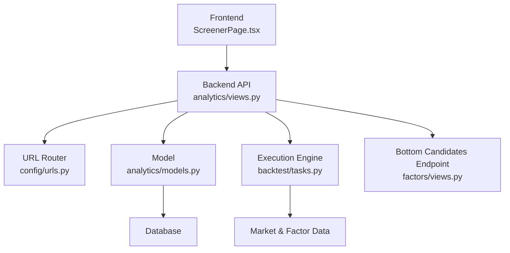
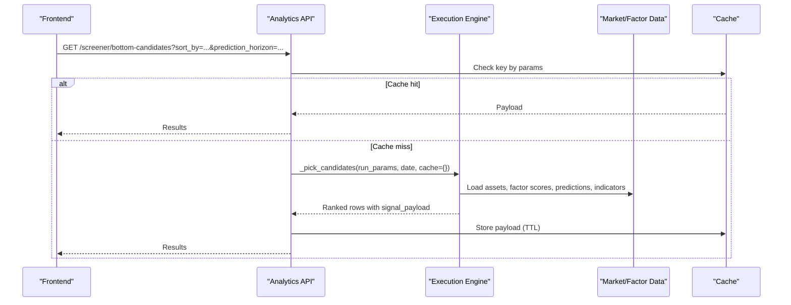
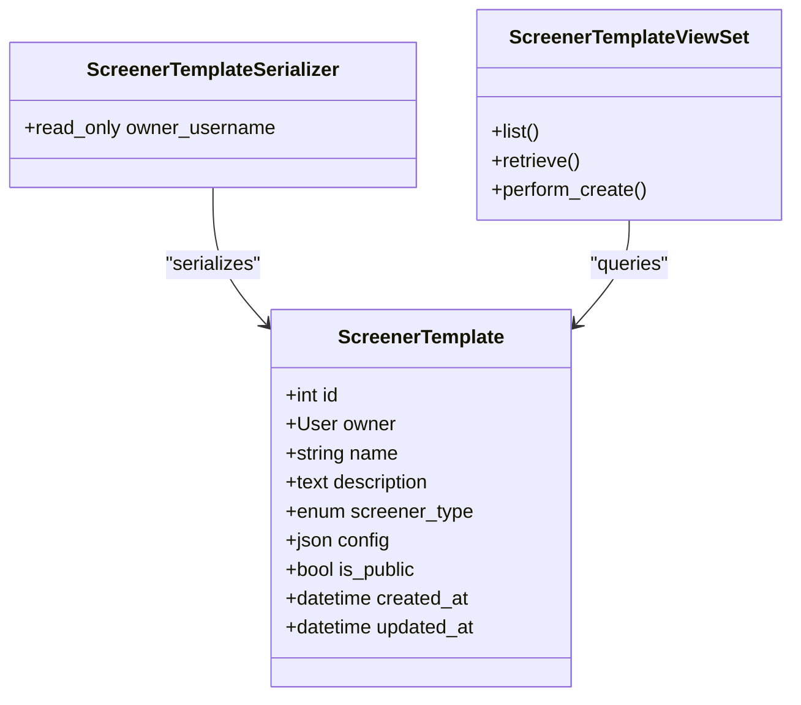
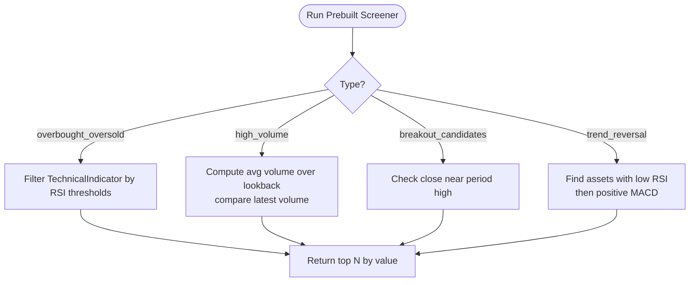
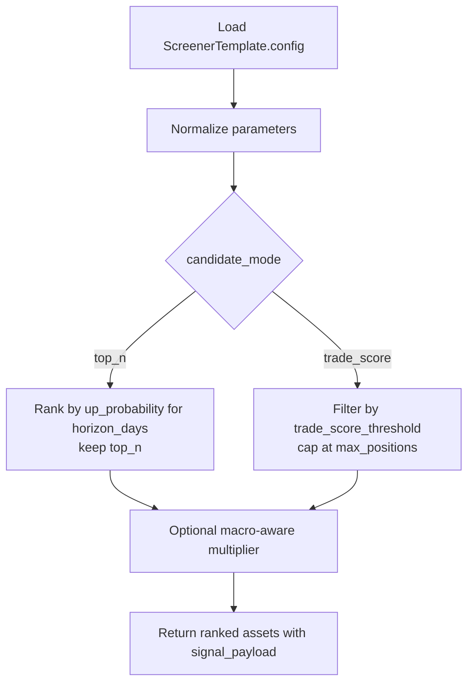
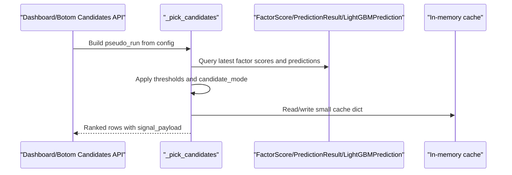
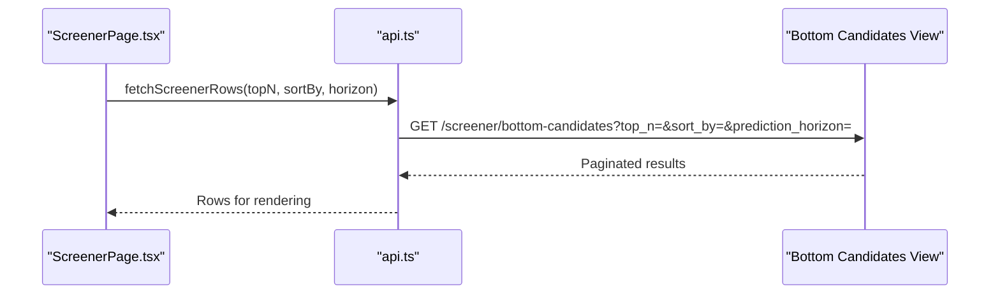
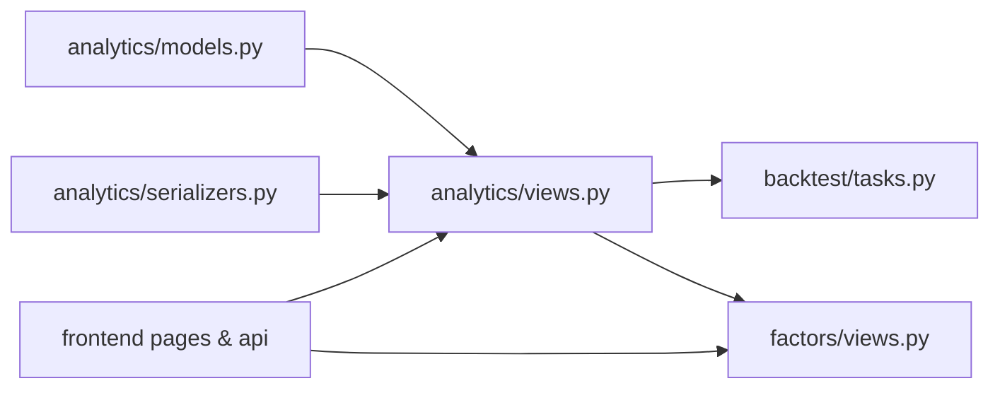

# Screener Templates

<cite>
**Referenced Files in This Document**
- [models.py](file://apps/analytics/models.py)
- [serializers.py](file://apps/analytics/serializers.py)
- [views.py](file://apps/analytics/views.py)
- [admin.py](file://apps/analytics/admin.py)
- [urls.py](file://config/urls.py)
- [tasks.py](file://apps/backtest/tasks.py)
- [views.py](file://apps/factors/views.py)
- [ScreenerPage.tsx](file://frontend/src/pages/ScreenerPage.tsx)
- [api.ts](file://frontend/src/lib/api.ts)
</cite>

## Table of Contents
1. [Introduction](#introduction)
2. [Project Structure](#project-structure)
3. [Core Components](#core-components)
4. [Architecture Overview](#architecture-overview)
5. [Detailed Component Analysis](#detailed-component-analysis)
6. [Dependency Analysis](#dependency-analysis)
7. [Performance Considerations](#performance-considerations)
8. [Troubleshooting Guide](#troubleshooting-guide)
9. [Conclusion](#conclusion)
10. [Appendices](#appendices)

## Introduction
This document explains the Screener Templates system that enables users to create, share, and execute custom stock screening criteria. It covers:
- The ScreenerTemplate model for storing prebuilt vs custom screeners with owner-based access control and public sharing.
- JSON-based configuration storage for defining multi-dimensional filters (technical indicators, fundamentals, market conditions).
- The screener execution engine that applies templates against the asset universe, ranks results, and caches outputs.
- Practical examples for creating custom screeners, combining complex filters, and integrating results with portfolio analysis tools.

## Project Structure
The Screener Templates feature spans multiple Django apps and the frontend:
- Data model and API: analytics app (models, serializers, views, admin).
- Execution engine: backtest tasks implement candidate selection and ranking logic reused by dashboard and screener endpoints.
- Bottom candidates endpoint: factors app exposes a dedicated screener endpoint used by the frontend.
- Frontend: React page and API client call the backend endpoints and render results.

**Diagram sources**
- [views.py:738-754](file://apps/analytics/views.py#L738-L754)
- [models.py:48-84](file://apps/analytics/models.py#L48-L84)
- [tasks.py:1672-1692](file://apps/backtest/tasks.py#L1672-L1692)
- [views.py:47-143](file://apps/factors/views.py#L47-L143)
- [urls.py:81-91](file://config/urls.py#L81-L91)
- [ScreenerPage.tsx:1-83](file://frontend/src/pages/ScreenerPage.tsx#L1-L83)

**Section sources**
- [models.py:48-84](file://apps/analytics/models.py#L48-L84)
- [serializers.py:78-87](file://apps/analytics/serializers.py#L78-L87)
- [views.py:738-754](file://apps/analytics/views.py#L738-L754)
- [urls.py:81-91](file://config/urls.py#L81-L91)
- [ScreenerPage.tsx:1-83](file://frontend/src/pages/ScreenerPage.tsx#L1-L83)
- [api.ts:768-776](file://frontend/src/lib/api.ts#L768-L776)

## Core Components
- ScreenerTemplate model: stores template metadata, type (prebuilt or custom), JSON config, ownership, and visibility.
- ScreenerTemplateSerializer: exposes fields including owner_username and read-only timestamps.
- ScreenerTemplateViewSet: enforces authentication and controls list/retrieve visibility based on ownership and public flag.
- ScreenerViewSet: provides built-in screeners (RSI overbought/oversold, high volume, breakout candidates, trend reversal).
- Bottom candidates endpoint: returns ranked assets using composite scores, predictions, and optional macro context adjustments.
- Execution engine: selects and ranks candidates using configurable modes (top_n, trade_score), thresholds, and macro-aware scoring.

Key responsibilities:
- Template management: CRUD via REST with owner scoping and public sharing.
- Prebuilt screeners: quick queries against technical indicators and OHLCV data.
- Custom screeners: JSON-driven rules interpreted by the execution engine.
- Ranking and caching: deterministic ordering and short-lived cache for performance.

**Section sources**
- [models.py:48-84](file://apps/analytics/models.py#L48-L84)
- [serializers.py:78-87](file://apps/analytics/serializers.py#L78-L87)
- [views.py:738-754](file://apps/analytics/views.py#L738-L754)
- [views.py:756-858](file://apps/analytics/views.py#L756-L858)
- [views.py:100-133](file://apps/analytics/views.py#L100-L133)
- [tasks.py:1672-1692](file://apps/backtest/tasks.py#L1672-L1692)

## Architecture Overview
The system combines a declarative template layer with an execution engine that materializes results from market data, factor scores, and predictions.

**Diagram sources**
- [views.py:100-133](file://apps/analytics/views.py#L100-L133)
- [views.py:227-251](file://apps/analytics/views.py#L227-L251)
- [tasks.py:1672-1692](file://apps/backtest/tasks.py#L1672-L1692)

## Detailed Component Analysis

### ScreenerTemplate Model and Access Control
- Fields: name, description, screener_type (PREBUILT/CUSTOM), config (JSON), is_public, owner (nullable), timestamps.
- Indexes optimize queries by owner/public status and screener_type.
- Serializer exposes owner_username for display; owner and timestamps are read-only.
- ViewSet enforces IsAuthenticatedOrReadOnly and filters lists to include user-owned templates plus public ones.

**Diagram sources**
- [models.py:48-84](file://apps/analytics/models.py#L48-L84)
- [serializers.py:78-87](file://apps/analytics/serializers.py#L78-L87)
- [views.py:738-754](file://apps/analytics/views.py#L738-L754)

**Section sources**
- [models.py:48-84](file://apps/analytics/models.py#L48-L84)
- [serializers.py:78-87](file://apps/analytics/serializers.py#L78-L87)
- [views.py:738-754](file://apps/analytics/views.py#L738-L754)
- [admin.py:12-16](file://apps/analytics/admin.py#L12-L16)

### Prebuilt Screeners
Built-in types provide quick filtering:
- Overbought/Oversold: RSI thresholds.
- High Volume: current volume vs lookback average.
- Breakout Candidates: close near period high.
- Trend Reversal: RSI + MACD combination.

**Diagram sources**
- [views.py:756-858](file://apps/analytics/views.py#L756-L858)

**Section sources**
- [views.py:756-858](file://apps/analytics/views.py#L756-L858)

### Custom Screeners and JSON Configuration
- Custom screeners store their filter definitions in the config JSON field.
- The same execution path used by dashboard candidates can be driven by normalized parameters derived from query strings or stored configs.
- Parameters include prediction source, horizon, candidate mode (top_n or trade_score), thresholds, and macro context toggles.

**Diagram sources**
- [views.py:100-133](file://apps/analytics/views.py#L100-L133)
- [tasks.py:1672-1692](file://apps/backtest/tasks.py#L1672-L1692)

**Section sources**
- [views.py:100-133](file://apps/analytics/views.py#L100-L133)
- [tasks.py:1672-1692](file://apps/backtest/tasks.py#L1672-L1692)

### Screener Execution Engine
- Candidate selection uses a pseudo-run object with strategy type and parameters to reuse backtesting logic.
- Modes:
  - top_n: rank by up_probability for a given horizon and keep top_n.
  - trade_score: filter by threshold and cap positions; supports combined or independent scopes.
- Macro-aware ranking optionally multiplies scores by market regime factors.
- Each result includes a signal_payload capturing rank, metric, threshold pass/fail, selection state, and model provenance.

**Diagram sources**
- [views.py:100-133](file://apps/analytics/views.py#L100-L133)
- [tasks.py:1672-1692](file://apps/backtest/tasks.py#L1672-L1692)

**Section sources**
- [views.py:100-133](file://apps/analytics/views.py#L100-L133)
- [tasks.py:1672-1692](file://apps/backtest/tasks.py#L1672-L1692)

### Bottom Candidates Endpoint and Integration
- The bottom candidates endpoint returns assets with composite score, bottom probability, trade score, risk-reward ratio, and suggested flags.
- Supports sorting by different metrics and prediction horizons.
- Frontend calls this endpoint to populate the Screener page table and compute averages for dashboards.

**Diagram sources**
- [ScreenerPage.tsx:1-83](file://frontend/src/pages/ScreenerPage.tsx#L1-L83)
- [api.ts:768-776](file://frontend/src/lib/api.ts#L768-L776)
- [views.py:47-143](file://apps/factors/views.py#L47-L143)

**Section sources**
- [ScreenerPage.tsx:1-83](file://frontend/src/pages/ScreenerPage.tsx#L1-L83)
- [api.ts:768-776](file://frontend/src/lib/api.ts#L768-L776)
- [views.py:47-143](file://apps/factors/views.py#L47-L143)

## Dependency Analysis
- ScreenerTemplate depends on User for ownership and Asset indirectly through related data.
- Views depend on models, serializers, and external data sources (OHLCV, TechnicalIndicator, FactorScore, PredictionResult).
- Execution engine depends on backtest task functions to unify candidate selection across features.
- Frontend depends on API client and i18n resources for labels and error messages.

**Diagram sources**
- [models.py:48-84](file://apps/analytics/models.py#L48-L84)
- [serializers.py:78-87](file://apps/analytics/serializers.py#L78-L87)
- [views.py:738-754](file://apps/analytics/views.py#L738-L754)
- [tasks.py:1672-1692](file://apps/backtest/tasks.py#L1672-L1692)
- [views.py:47-143](file://apps/factors/views.py#L47-L143)
- [ScreenerPage.tsx:1-83](file://frontend/src/pages/ScreenerPage.tsx#L1-L83)
- [api.ts:768-776](file://frontend/src/lib/api.ts#L768-L776)

**Section sources**
- [models.py:48-84](file://apps/analytics/models.py#L48-L84)
- [views.py:738-754](file://apps/analytics/views.py#L738-L754)
- [tasks.py:1672-1692](file://apps/backtest/tasks.py#L1672-L1692)
- [views.py:47-143](file://apps/factors/views.py#L47-L143)

## Performance Considerations
- Short-lived caching:
  - Dashboard candidate payloads cached with keys derived from latest date, prediction horizon, model family, candidate config hash, search, ordering, pagination.
  - Additional endpoints use method-level decorators for time-based caching.
- Efficient queries:
  - Select latest values per asset using distinct and ordering.
  - Use indexes on frequently filtered fields (owner, is_public, screener_type).
- Execution efficiency:
  - Candidate selection reuses a single function to avoid duplication and enable consistent ranking logic.
  - In-memory cache dict passed into execution reduces repeated computations within a request.

[No sources needed since this section provides general guidance]

## Troubleshooting Guide
- Authentication errors:
  - Ensure JWT/API key configured in settings when calling authenticated endpoints.
  - The frontend displays localized load errors if credentials are missing.
- Unsupported screener type:
  - Prebuilt run endpoint validates type; unsupported types return a bad request error.
- Empty results:
  - Verify latest factor scores exist and prediction horizon matches available data.
  - Check thresholds (e.g., RSI bounds, volume ratios) are not too restrictive.
- Stale data:
  - Clear or wait for cache TTL to expire; adjust cache durations if necessary.

**Section sources**
- [views.py:774-782](file://apps/analytics/views.py#L774-L782)
- [ScreenerPage.tsx:12-31](file://frontend/src/pages/ScreenerPage.tsx#L12-L31)
- [api.ts:768-776](file://frontend/src/lib/api.ts#L768-L776)

## Conclusion
The Screener Templates system provides a flexible framework for both prebuilt and custom stock screening:
- Templates encapsulate reusable configurations with clear ownership and sharing controls.
- The execution engine unifies candidate selection and ranking across features, supporting multiple strategies and macro-aware adjustments.
- Caching and efficient queries ensure responsive performance for interactive dashboards and real-time screeners.
- The frontend integrates seamlessly to present results and support portfolio analysis workflows.

[No sources needed since this section summarizes without analyzing specific files]

## Appendices

### Example Workflows

- Create a custom screener template:
  - POST to the screener-templates endpoint with name, description, screener_type=CUSTOM, and a JSON config describing filters (e.g., indicator thresholds, fundamental ranges, macro toggles).
  - Set is_public=True to share with other users.

- Configure complex filter combinations:
  - Use candidate_mode=top_n with a specific horizon and top_n_metric to rank by predicted upside.
  - Or use candidate_mode=trade_score with a threshold and scope to select trades based on heuristic and/or model scores.

- Integrate with portfolio analysis:
  - Call the bottom candidates endpoint with desired sort_by and prediction_horizon.
  - Use returned fields (composite score, bottom probability, trade score, risk-reward ratio, suggested) to feed downstream portfolio tools.

[No sources needed since this section provides general guidance]