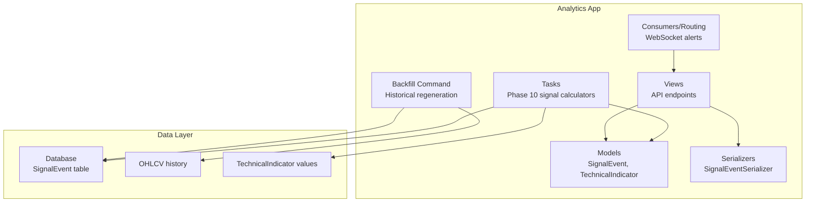
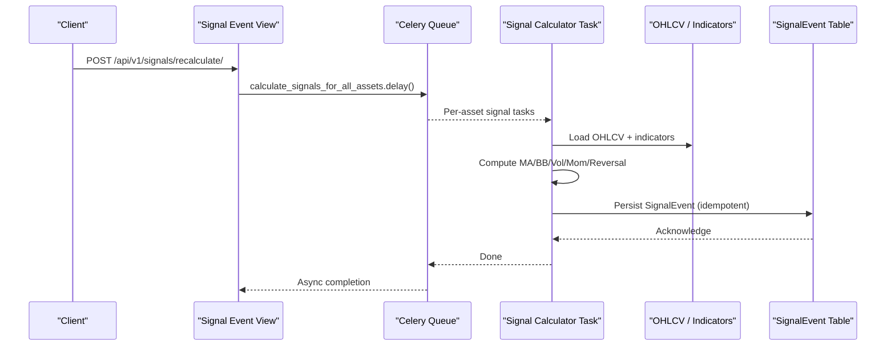
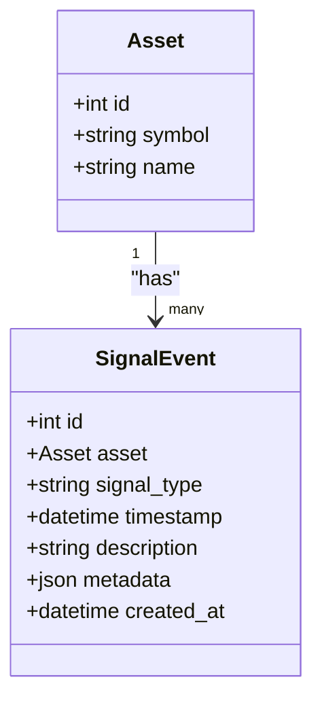
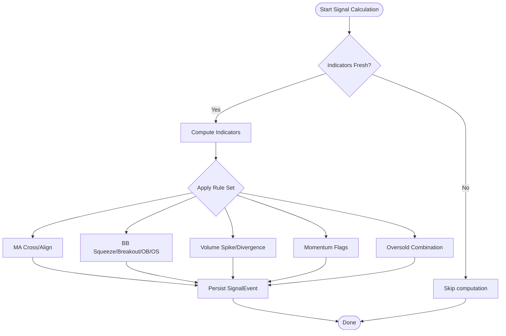
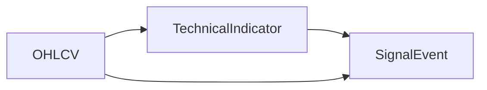
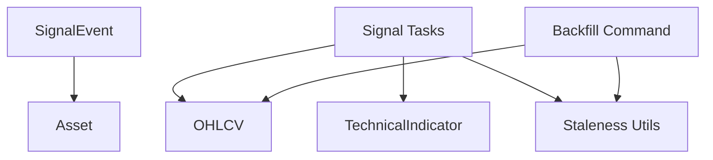

# Signal Events

<cite>
**Referenced Files in This Document**
- [models.py](file://apps/analytics/models.py)
- [tasks.py](file://apps/analytics/tasks.py)
- [views.py](file://apps/analytics/views.py)
- [serializers.py](file://apps/analytics/serializers.py)
- [backfill_signal_events.py](file://apps/analytics/management/commands/backfill_signal_events.py)
- [0004_phase10_signal_events.py](file://apps/analytics/migrations/0004_phase10_signal_events.py)
- [technical_staleness.py](file://apps/analytics/technical_staleness.py)
- [consumers.py](file://apps/analytics/consumers.py)
- [routing.py](file://apps/analytics/routing.py)
- [tests.py](file://apps/analytics/tests.py)
</cite>

## Table of Contents
1. Introduction
2. Project Structure
3. Core Components
4. Architecture Overview
5. Detailed Component Analysis
6. Dependency Analysis
7. Performance Considerations
8. Troubleshooting Guide
9. Conclusion

## Introduction
This document explains the Signal Events system that tracks technical analysis signals generated from indicator combinations. It covers the SignalEvent model, signal types (golden/death crosses, Bollinger Band breakouts, volume spikes, momentum signals, and reversal conditions), the Phase 10 indicator analysis pipeline, metadata storage for context, deduplication mechanisms, relationships between raw indicators and derived signals, and integration points with alert systems and backtesting engines.

## Project Structure
The Signal Events system lives primarily within the analytics app:
- Models define the core entities: TechnicalIndicator, AlertRule, AlertEvent, and SignalEvent.
- Celery tasks compute signals from OHLCV data and persist them as SignalEvent rows.
- Views expose API endpoints to list, filter, recalculate, and fetch recent signals.
- Serializers provide structured JSON responses for clients.
- A management command backfills historical signals across date windows with checkpointing.
- Migrations create the database schema for SignalEvent.
- Staleness utilities ensure signals are only computed when underlying indicators or price/volume windows are fresh.

**Diagram sources**
- [models.py:8-45](file://apps/analytics/models.py#L8-L45)
- [models.py:198-254](file://apps/analytics/models.py#L198-L254)
- [tasks.py:620-1160](file://apps/analytics/tasks.py#L620-L1160)
- [views.py:17-45](file://apps/analytics/views.py#L17-L45)
- [serializers.py:138-150](file://apps/analytics/serializers.py#L138-L150)
- [backfill_signal_events.py:74-218](file://apps/analytics/management/commands/backfill_signal_events.py#L74-L218)

**Section sources**
- [models.py:8-45](file://apps/analytics/models.py#L8-L45)
- [models.py:198-254](file://apps/analytics/models.py#L198-L254)
- [tasks.py:620-1160](file://apps/analytics/tasks.py#L620-L1160)
- [views.py:17-45](file://apps/analytics/views.py#L17-L45)
- [serializers.py:138-150](file://apps/analytics/serializers.py#L138-L150)
- [backfill_signal_events.py:74-218](file://apps/analytics/management/commands/backfill_signal_events.py#L74-L218)

## Core Components
- SignalEvent model: Stores each technical signal event with asset, type, timestamp, description, and metadata. Includes a unique constraint on (asset, timestamp, signal_type) to prevent duplicates.
- SignalType choices: Enumerates supported signals including moving average crosses and alignments, Bollinger Band events, volume anomalies, momentum flags, and combined reversal conditions.
- Indicator pipeline: Celery tasks compute derived signals from raw indicators (SMA, BBANDS, RSI, OBV, momentum) and persist results via a helper that ensures idempotent writes.
- Backfill command: Regenerates historical signals by scanning OHLCV windows, computing indicators, and bulk-inserting SignalEvent rows with chunked transactions and checkpoint support.
- API layer: Read-only endpoints list and filter signals, fetch recent signals, and trigger recalculation via Celery.
- Serialization: SignalEventSerializer exposes human-readable fields and display labels for signal types.

**Section sources**
- [models.py:198-254](file://apps/analytics/models.py#L198-L254)
- [tasks.py:620-1160](file://apps/analytics/tasks.py#L620-L1160)
- [backfill_signal_events.py:74-218](file://apps/analytics/management/commands/backfill_signal_events.py#L74-L218)
- [views.py:17-45](file://apps/analytics/views.py#L17-L45)
- [serializers.py:138-150](file://apps/analytics/serializers.py#L138-L150)

## Architecture Overview
The Phase 10 pipeline orchestrates signal generation across multiple indicator families. Each task validates freshness using staleness checks, computes indicators, applies rule-based logic, and persists SignalEvent records. The dispatcher queues per-asset tasks and cross-asset ranking tasks.

**Diagram sources**
- [views.py:17-45](file://apps/analytics/views.py#L17-L45)
- [tasks.py:1146-1160](file://apps/analytics/tasks.py#L1146-L1160)
- [tasks.py:740-1084](file://apps/analytics/tasks.py#L740-L1084)
- [models.py:198-254](file://apps/analytics/models.py#L198-L254)

## Detailed Component Analysis

### SignalEvent Model and Types
- Fields: asset (FK), signal_type (choice), timestamp, description, metadata, created_at.
- Indexes optimize queries by asset/timestamp/signal_type and by signal_type/timestamp.
- Unique constraint on (asset, timestamp, signal_type) enforces deduplication at the database level.
- SignalType includes:
  - Moving averages: GOLDEN_CROSS, DEATH_CROSS, MA_BULL_ALIGN, MA_BEAR_ALIGN
  - Bollinger Bands: BB_SQUEEZE, BB_BREAKOUT_UP, BB_BREAKOUT_DOWN, BB_RSI_OVERBOUGHT, BB_RSI_OVERSOLD
  - Volume: VOLUME_SPIKE, VOLUME_PRICE_DIVERGENCE
  - Momentum: MOMENTUM_UP_5D, MOMENTUM_DOWN_5D, HIGH_RS_SCORE
  - Reversal: OVERSOLD_COMBINATION

**Diagram sources**
- [models.py:198-254](file://apps/analytics/models.py#L198-L254)

**Section sources**
- [models.py:198-254](file://apps/analytics/models.py#L198-L254)
- [0004_phase10_signal_events.py:14-33](file://apps/analytics/migrations/0004_phase10_signal_events.py#L14-L33)

### Signal Generation Logic (Phase 10 Tasks)
- Moving Average Signals:
  - Computes SMA(5/10/20/60). Detects golden/death crosses when MA5 crosses above/below MA20. Flags bull/bear alignment when MA5 > MA10 > MA20 > MA60 or reverse.
  - Uses staleness checks to ensure SMA(60) is fresh before computing.
- Bollinger Band Signals:
  - Computes BBANDS(20, 2, 2). Detects squeeze (bandwidth < 5%), breakout above upper band, breakout below lower band, and overbought/oversold when near bands with RSI thresholds.
  - Optionally uses RSI(14) if fresh.
- Volume Signals:
  - Detects volume spikes when latest volume >= 2x 20-day average.
  - Detects volume-price divergence using OBV trend vs price return over 5 days.
- Momentum Signals:
  - Computes MOM_5D/MOM_10D/MOM_20D as TechnicalIndicator values.
  - Flags strong upward/downward momentum when 5-day return exceeds ±5%.
- Reversal Signals:
  - Combines RSI < 30, price near lower BB, and volume contraction (< 80% of 20-day avg) to flag oversold reversal candidates.
- Cross-Asset Ranking:
  - Ranks assets by 20-day return, assigns RS_SCORE, and emits HIGH_RS_SCORE for top 20%.

**Diagram sources**
- [tasks.py:740-1084](file://apps/analytics/tasks.py#L740-L1084)
- [technical_staleness.py](file://apps/analytics/technical_staleness.py)

**Section sources**
- [tasks.py:740-1084](file://apps/analytics/tasks.py#L740-L1084)
- [technical_staleness.py](file://apps/analytics/technical_staleness.py)

### Metadata Storage and Context
- Each SignalEvent stores a description string summarizing the triggering condition and a JSON metadata object containing numeric values used in the decision (e.g., MA values, BB levels, RSI, volumes, momentum returns).
- This enables downstream consumers (dashboards, alerts, backtests) to reconstruct context without recomputing indicators.

**Section sources**
- [models.py:238-241](file://apps/analytics/models.py#L238-L241)
- [tasks.py:781-814](file://apps/analytics/tasks.py#L781-L814)
- [tasks.py:862-897](file://apps/analytics/tasks.py#L862-L897)
- [tasks.py:926-957](file://apps/analytics/tasks.py#L926-L957)
- [tasks.py:997-1017](file://apps/analytics/tasks.py#L997-L1017)
- [tasks.py:1070-1083](file://apps/analytics/tasks.py#L1070-L1083)

### Deduplication Mechanisms
- Database-level uniqueness: unique_together on (asset, timestamp, signal_type) prevents duplicate entries for the same asset and signal at the same timestamp.
- Idempotent persistence: _save_signal_event uses get_or_create to avoid redundant inserts during recalculations or retries.
- Backfill command: Deletes existing rows per chunk before bulk inserting regenerated rows, ensuring consistent state.

**Section sources**
- [models.py:247-251](file://apps/analytics/models.py#L247-L251)
- [tasks.py:622-630](file://apps/analytics/tasks.py#L622-L630)
- [backfill_signal_events.py:160-171](file://apps/analytics/management/commands/backfill_signal_events.py#L160-L171)

### Relationship Between Raw Indicators and Derived Signals
- Raw indicators (SMA, BBANDS, RSI, OBV, momentum) are stored as TechnicalIndicator rows.
- Derived signals (SignalEvent) are computed from these indicators and OHLCV data.
- Staleness checks reference indicator freshness to avoid generating stale signals.

**Diagram sources**
- [models.py:8-45](file://apps/analytics/models.py#L8-L45)
- [models.py:198-254](file://apps/analytics/models.py#L198-L254)
- [tasks.py:740-1084](file://apps/analytics/tasks.py#L740-L1084)

**Section sources**
- [models.py:8-45](file://apps/analytics/models.py#L8-L45)
- [tasks.py:740-1084](file://apps/analytics/tasks.py#L740-L1084)

### Phase 10 Pipeline Orchestration
- Dispatcher: calculate_signals_for_all_assets queues per-asset tasks for MA, BB, volume, momentum, reversal, and cross-asset RS scoring.
- Each task independently validates freshness and computes signals.
- Results are persisted asynchronously via Celery.

**Section sources**
- [tasks.py:1146-1160](file://apps/analytics/tasks.py#L1146-L1160)

### API Integration and Consumption
- List and filter: GET /api/v1/signals/?signal_type=... supports filtering by type.
- Recent: GET /api/v1/signals/recent/?days=N returns recent signals.
- Recalculate: POST /api/v1/signals/recalculate/ triggers background recalculation.
- Serializer: SignalEventSerializer provides asset symbols/names and human-readable signal_type_display.

**Section sources**
- [views.py:17-45](file://apps/analytics/views.py#L17-L45)
- [serializers.py:138-150](file://apps/analytics/serializers.py#L138-L150)
- [tests.py:982-1030](file://apps/analytics/tests.py#L982-L1030)

### WebSocket Alerts Integration
- Consumers and routing exist to stream real-time alerts; while not directly tied to SignalEvent in this snippet, they integrate with the analytics app’s eventing infrastructure.

**Section sources**
- [consumers.py](file://apps/analytics/consumers.py)
- [routing.py](file://apps/analytics/routing.py)

## Dependency Analysis
- SignalEvent depends on Asset (FK).
- Signal calculation tasks depend on:
  - OHLCV data for price/volume series.
  - TechnicalIndicator values for indicator freshness checks.
  - Staleness utilities to validate trailing windows.
  - TA-Lib functions for indicator computations.
- Backfill command depends on OHLCV and staleness utilities to regenerate historical signals.

**Diagram sources**
- [models.py:198-254](file://apps/analytics/models.py#L198-L254)
- [tasks.py:740-1084](file://apps/analytics/tasks.py#L740-L1084)
- [backfill_signal_events.py:74-218](file://apps/analytics/management/commands/backfill_signal_events.py#L74-L218)

**Section sources**
- [models.py:198-254](file://apps/analytics/models.py#L198-L254)
- [tasks.py:740-1084](file://apps/analytics/tasks.py#L740-L1084)
- [backfill_signal_events.py:74-218](file://apps/analytics/management/commands/backfill_signal_events.py#L74-L218)

## Performance Considerations
- Bulk operations: Backfill uses bulk_create with batch_size to minimize DB round-trips.
- Chunked processing: Date ranges split into chunks to control transaction size and enable resume via checkpoints.
- Staleness checks: Avoid unnecessary recomputation by validating indicator freshness before heavy calculations.
- Indexes: Optimized indexes on SignalEvent improve query performance for listing and filtering.
- Asynchronous execution: Celery offloads signal computation to workers, preventing request blocking.

[No sources needed since this section provides general guidance]

## Troubleshooting Guide
- No signals generated:
  - Verify indicator freshness using staleness checks; missing or stale indicators will skip signal computation.
  - Ensure OHLCV has sufficient history (e.g., at least 62 bars for MA signals).
- Duplicate signals:
  - Check unique_together constraints; duplicates should be rejected at the DB level.
  - Confirm idempotent writes via get_or_create in signal persistence.
- Backfill issues:
  - Use checkpoint files to resume partial runs; verify window and options match previous runs.
  - Inspect logs for skipped assets due to no OHLCV in requested range.
- API errors:
  - Validate query parameters for filters and date ranges.
  - Ensure authentication for protected endpoints.

**Section sources**
- [tasks.py:740-757](file://apps/analytics/tasks.py#L740-L757)
- [tasks.py:822-833](file://apps/analytics/tasks.py#L822-L833)
- [backfill_signal_events.py:133-146](file://apps/analytics/management/commands/backfill_signal_events.py#L133-L146)
- [models.py:247-251](file://apps/analytics/models.py#L247-L251)

## Conclusion
The Signal Events system provides a robust, scalable framework for generating actionable trading signals from technical indicators. It combines multiple indicator families into coherent signal types, stores rich context in metadata, and ensures data integrity through deduplication and staleness checks. The Phase 10 pipeline integrates seamlessly with APIs, backtesting, and alert systems, enabling both historical analysis and real-time monitoring.

[No sources needed since this section summarizes without analyzing specific files]