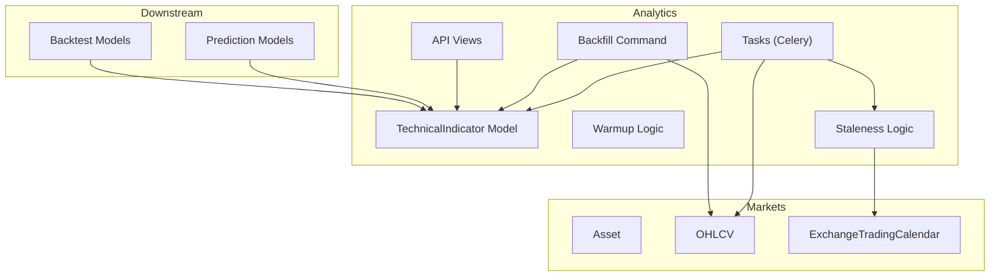
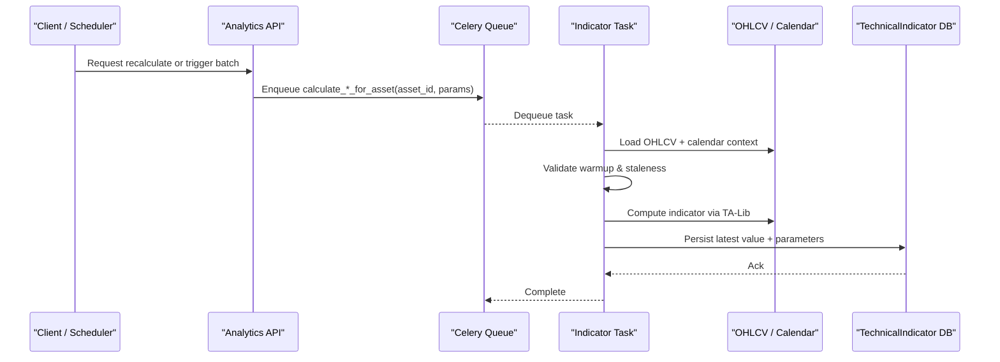
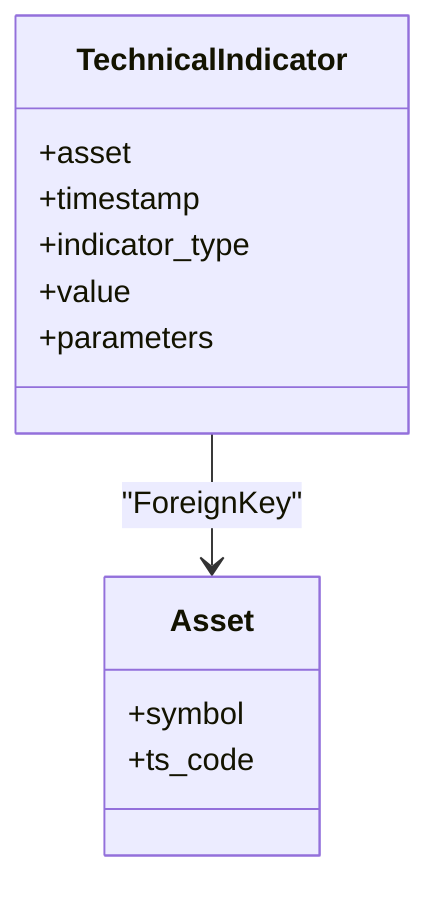
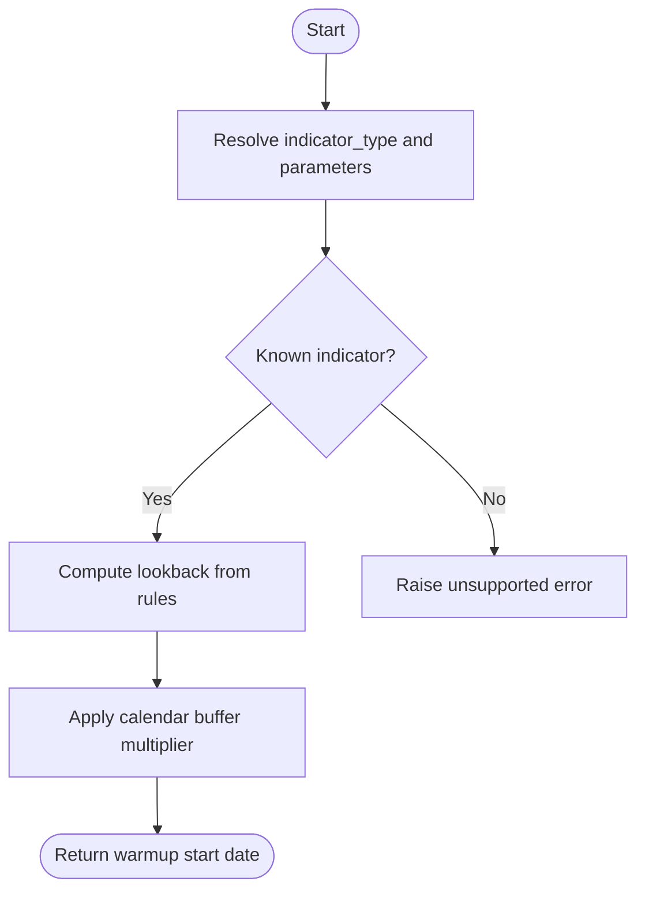
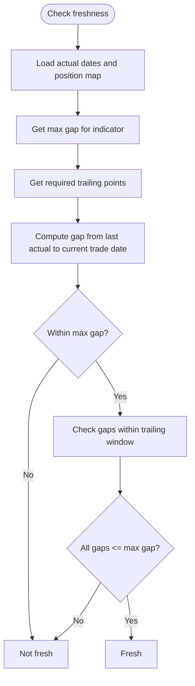
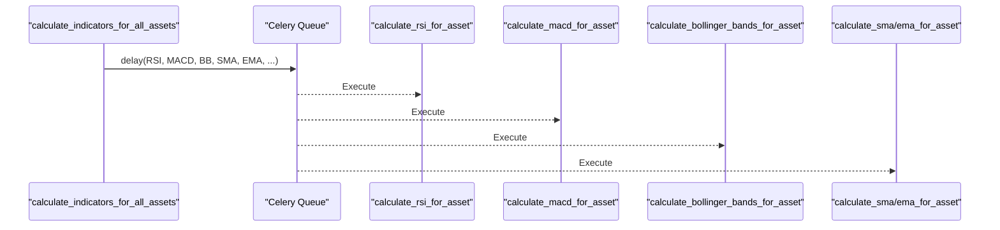
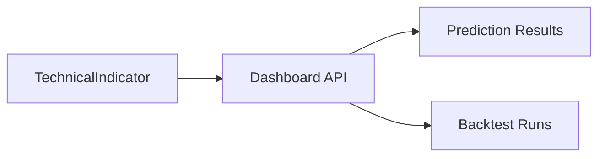
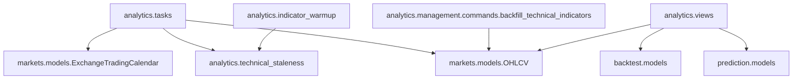

# Technical Indicators

<cite>
**Referenced Files in This Document**
- [models.py](file://apps/analytics/models.py)
- [tasks.py](file://apps/analytics/tasks.py)
- [indicator_warmup.py](file://apps/analytics/indicator_warmup.py)
- [technical_staleness.py](file://apps/analytics/technical_staleness.py)
- [backfill_technical_indicators.py](file://apps/analytics/management/commands/backfill_technical_indicators.py)
- [views.py](file://apps/analytics/views.py)
- [serializers.py](file://apps/analytics/serializers.py)
- [models.py](file://apps/markets/models.py)
- [models.py](file://apps/prediction/models.py)
- [models.py](file://apps/backtest/models.py)
</cite>

## Table of Contents
1. [Introduction](#introduction)
2. [Project Structure](#project-structure)
3. [Core Components](#core-components)
4. [Architecture Overview](#architecture-overview)
5. [Detailed Component Analysis](#detailed-component-analysis)
6. [Dependency Analysis](#dependency-analysis)
7. [Performance Considerations](#performance-considerations)
8. [Troubleshooting Guide](#troubleshooting-guide)
9. [Conclusion](#conclusion)
10. [Appendices](#appendices)

## Introduction
This document explains the Technical Indicators system that computes, stores, and manages financial technical indicators for assets. It covers the data model, indicator types (RSI, MACD, Bollinger Bands, Moving Averages), parameter storage, value precision handling, warmup logic, staleness detection, asynchronous task queue architecture, OHLCV-driven computation, indexing strategy, and integration with downstream applications such as Prediction and Backtest. It also provides configuration examples, batch processing workflows, and monitoring guidance.

## Project Structure
The Technical Indicators subsystem lives primarily under the analytics app and integrates with markets, prediction, and backtest apps:
- Data model and signals: analytics models
- Computation and scheduling: analytics tasks
- Warmup and staleness: analytics indicator_warmup and technical_staleness
- Historical backfill: analytics management command
- API access and dashboards: analytics views and serializers
- Core market entities: markets models (Asset, OHLCV, ExchangeTradingCalendar)
- Downstream consumers: prediction and backtest models

**Diagram sources**
- [models.py:8-45](file://apps/analytics/models.py#L8-L45)
- [tasks.py:28-66](file://apps/analytics/tasks.py#L28-L66)
- [indicator_warmup.py:4-27](file://apps/analytics/indicator_warmup.py#L4-L27)
- [technical_staleness.py:9-24](file://apps/analytics/technical_staleness.py#L9-L24)
- [backfill_technical_indicators.py:22-44](file://apps/analytics/management/commands/backfill_technical_indicators.py#L22-L44)
- [views.py:424-475](file://apps/analytics/views.py#L424-L475)
- [models.py:19-62](file://apps/markets/models.py#L19-L62)
- [models.py:65-84](file://apps/markets/models.py#L65-L84)
- [models.py:43-97](file://apps/prediction/models.py#L43-L97)
- [models.py:24-117](file://apps/backtest/models.py#L24-L117)

**Section sources**
- [models.py:8-45](file://apps/analytics/models.py#L8-L45)
- [tasks.py:28-66](file://apps/analytics/tasks.py#L28-L66)
- [indicator_warmup.py:4-27](file://apps/analytics/indicator_warmup.py#L4-L27)
- [technical_staleness.py:9-24](file://apps/analytics/technical_staleness.py#L9-L24)
- [backfill_technical_indicators.py:22-44](file://apps/analytics/management/commands/backfill_technical_indicators.py#L22-L44)
- [views.py:424-475](file://apps/analytics/views.py#L424-L475)
- [models.py:19-62](file://apps/markets/models.py#L19-L62)
- [models.py:65-84](file://apps/markets/models.py#L65-L84)
- [models.py:43-97](file://apps/prediction/models.py#L43-L97)
- [models.py:24-117](file://apps/backtest/models.py#L24-L117)

## Core Components
- TechnicalIndicator model: Stores per-asset, per-timestamp indicator values with type and parameters. Includes indexes and uniqueness constraints to support efficient queries and idempotent writes.
- Indicator computation tasks: Celery tasks compute RSI, MACD, Bollinger Bands, SMA, EMA, Stochastic, ADX, OBV, Fibonacci retracement, and moving average signal events. Each task validates freshness via staleness checks before computing.
- Warmup logic: Determines required lookback windows per indicator and variant parameters to ensure sufficient history is available before producing valid outputs.
- Staleness detection: Enforces maximum allowed gaps between trading days and required trailing windows to avoid serving stale or incomplete indicators.
- Backfill command: Batch historical recomputation across assets and date ranges with chunked transactions, checkpointing, and retry logic.
- API layer: Provides read endpoints, filtering, caching, and a recalculate action to enqueue on-demand indicator computations.

**Section sources**
- [models.py:8-45](file://apps/analytics/models.py#L8-L45)
- [tasks.py:67-615](file://apps/analytics/tasks.py#L67-L615)
- [indicator_warmup.py:29-143](file://apps/analytics/indicator_warmup.py#L29-L143)
- [technical_staleness.py:64-190](file://apps/analytics/technical_staleness.py#L64-L190)
- [backfill_technical_indicators.py:92-241](file://apps/analytics/management/commands/backfill_technical_indicators.py#L92-L241)
- [views.py:424-735](file://apps/analytics/views.py#L424-L735)

## Architecture Overview
The system follows a producer-consumer pattern:
- Producers: Market data sync populates OHLCV; backfill command can regenerate historical indicators; API triggers on-demand recalculation.
- Consumers: Celery workers execute indicator tasks that read OHLCV, compute values using TA-Lib, validate freshness, and persist results.
- Consumers downstream: Dashboards, Prediction, and Backtest read stored indicators or recompute features from OHLCV when needed.

**Diagram sources**
- [tasks.py:28-66](file://apps/analytics/tasks.py#L28-L66)
- [tasks.py:67-615](file://apps/analytics/tasks.py#L67-L615)
- [technical_staleness.py:122-190](file://apps/analytics/technical_staleness.py#L122-L190)
- [models.py:8-45](file://apps/analytics/models.py#L8-L45)
- [models.py:19-62](file://apps/markets/models.py#L19-L62)
- [models.py:65-84](file://apps/markets/models.py#L65-L84)

## Detailed Component Analysis

### TechnicalIndicator Model
- Fields: asset (FK to Asset), timestamp (indexed), indicator_type (indexed), value (Decimal with high precision), parameters (JSON).
- Indexes: Composite index on (asset, timestamp, indicator_type) supports fast per-asset time series retrieval. Unique constraint on (asset, timestamp, indicator_type, parameters) ensures idempotent upserts by parameter set.
- Ordering: Most recent first by timestamp, then asset and type.

**Diagram sources**
- [models.py:8-45](file://apps/analytics/models.py#L8-L45)
- [models.py:19-62](file://apps/markets/models.py#L19-L62)

**Section sources**
- [models.py:8-45](file://apps/analytics/models.py#L8-L45)

### Indicator Types and Parameter Storage
Supported indicator types include:
- RSI: parameter timeperiod
- MACD: parameters fastperiod, slowperiod, signalperiod
- BBANDS: parameters timeperiod, nbdevup, nbdevdn; stores upper/middle/lower in parameters and sets middle as value
- SMA/EMA: parameter timeperiod; multiple periods supported
- STOCH: parameters fastk_period, slowk_period, slowd_period
- ADX: parameter timeperiod
- OBV: no parameters
- FIB_RET: parameter lookback_days; stores levels and range in parameters
- Momentum and return variants: MOM_5D/MOM_10D/MOM_20D and RETURN_3D/RETURN_5D/RETURN_10D with n_days
- Relative volume and realized volatility: RELATIVE_VOLUME_5D/RELATIVE_VOLUME_20D and REALIZED_VOLATILITY_5D with window/n_days

Precision handling:
- Values are Decimal with max_digits=24 and decimal_places=8 at model level.
- Backfill uses a quantizer to round to 8 decimal places consistently.

**Section sources**
- [models.py:24-33](file://apps/analytics/models.py#L24-L33)
- [tasks.py:67-615](file://apps/analytics/tasks.py#L67-L615)
- [backfill_technical_indicators.py:42-89](file://apps/analytics/management/commands/backfill_technical_indicators.py#L42-L89)

### Indicator Warmup Process
Warmup determines how many prior trading days are required for each indicator and variant:
- Per-indicator defaults and parameter-aware calculations (e.g., MACD depends on fast/slow/signal periods).
- Functions compute lookback windows and prefill calendar offsets to ensure enough history exists before starting computation.

**Diagram sources**
- [indicator_warmup.py:29-143](file://apps/analytics/indicator_warmup.py#L29-L143)

**Section sources**
- [indicator_warmup.py:4-27](file://apps/analytics/indicator_warmup.py#L4-L27)
- [indicator_warmup.py:29-143](file://apps/analytics/indicator_warmup.py#L29-L143)

### Staleness Detection Mechanisms
Staleness ensures indicators are fresh relative to the current trading day:
- Max gap per indicator type defines acceptable lag (e.g., RSI allows more days than others).
- Required trailing points ensure sufficient recent data for rolling calculations.
- Trading calendar awareness prevents counting non-trading days toward gaps.

**Diagram sources**
- [technical_staleness.py:64-190](file://apps/analytics/technical_staleness.py#L64-L190)

**Section sources**
- [technical_staleness.py:9-24](file://apps/analytics/technical_staleness.py#L9-L24)
- [technical_staleness.py:64-190](file://apps/analytics/technical_staleness.py#L64-L190)

### Task Queue Architecture for Async Computation
- Celery shared tasks compute indicators per asset with staleness checks before work.
- Batch orchestration enqueues all indicator tasks for all assets.
- Tasks use OHLCV context helpers to load data, compute via TA-Lib, and persist results.

**Diagram sources**
- [tasks.py:594-615](file://apps/analytics/tasks.py#L594-L615)
- [tasks.py:67-615](file://apps/analytics/tasks.py#L67-L615)

**Section sources**
- [tasks.py:28-66](file://apps/analytics/tasks.py#L28-L66)
- [tasks.py:67-615](file://apps/analytics/tasks.py#L67-L615)

### Indicator Computation from OHLCV Data
Each task:
- Loads OHLCV for the asset over a suitable history window.
- Validates data availability and staleness.
- Computes indicator(s) using TA-Lib functions.
- Persists the latest valid value with parameters.

Examples:
- RSI: Uses close prices and timeperiod.
- MACD: Uses close with fast/slow/signal periods.
- BBANDS: Stores upper/middle/lower in parameters; value is middle band.
- SMA/EMA: Multiple periods computed in one pass.
- STOCH, ADX, OBV, FIB_RET: Each with specific inputs and parameters.

**Section sources**
- [tasks.py:67-615](file://apps/analytics/tasks.py#L67-L615)

### Storage Indexing and Performance
- Composite index on (asset, timestamp, indicator_type) optimizes per-asset time series queries.
- Unique constraint on (asset, timestamp, indicator_type, parameters) enables idempotent writes and deduplication.
- Backfill uses chunked delete/insert with bulk_create and transaction boundaries for performance and resilience.

**Section sources**
- [models.py:35-42](file://apps/analytics/models.py#L35-L42)
- [backfill_technical_indicators.py:415-425](file://apps/analytics/management/commands/backfill_technical_indicators.py#L415-L425)

### Integration with Prediction and Backtest
- Dashboard and analytics views fetch latest TechnicalIndicator rows alongside predictions and factors to enrich UI responses.
- Prediction and Backtest models do not directly depend on TechnicalIndicator schema but consume its outputs via dashboards and APIs; they maintain their own result tables and metadata.

**Diagram sources**
- [views.py:299-363](file://apps/analytics/views.py#L299-L363)
- [models.py:43-97](file://apps/prediction/models.py#L43-L97)
- [models.py:24-117](file://apps/backtest/models.py#L24-L117)

**Section sources**
- [views.py:299-363](file://apps/analytics/views.py#L299-L363)
- [models.py:43-97](file://apps/prediction/models.py#L43-L97)
- [models.py:24-117](file://apps/backtest/models.py#L24-L117)

## Dependency Analysis
Key dependencies:
- Analytics tasks depend on markets OHLCV and ExchangeTradingCalendar for data and calendar-aware gap calculations.
- Warmup and staleness modules define indicator-specific thresholds and lookbacks.
- Backfill command depends on markets models and uses database retries and checkpoints.
- Views expose API endpoints and integrate with other apps’ models for dashboard aggregation.

**Diagram sources**
- [tasks.py:17-26](file://apps/analytics/tasks.py#L17-L26)
- [technical_staleness.py:4-6](file://apps/analytics/technical_staleness.py#L4-L6)
- [indicator_warmup.py:4-27](file://apps/analytics/indicator_warmup.py#L4-L27)
- [backfill_technical_indicators.py:17-19](file://apps/analytics/management/commands/backfill_technical_indicators.py#L17-L19)
- [views.py:27-33](file://apps/analytics/views.py#L27-L33)

**Section sources**
- [tasks.py:17-26](file://apps/analytics/tasks.py#L17-L26)
- [technical_staleness.py:4-6](file://apps/analytics/technical_staleness.py#L4-L6)
- [indicator_warmup.py:4-27](file://apps/analytics/indicator_warmup.py#L4-L27)
- [backfill_technical_indicators.py:17-19](file://apps/analytics/management/commands/backfill_technical_indicators.py#L17-L19)
- [views.py:27-33](file://apps/analytics/views.py#L27-L33)

## Performance Considerations
- Use composite indexes and unique constraints to optimize reads and prevent duplicates.
- Prefer bulk operations in backfill (bulk_create) and chunked transactions to reduce lock contention and improve throughput.
- Leverage staleness checks to skip unnecessary recomputation when data is already fresh.
- Cache API responses where appropriate (list/retrieve actions and specialized endpoints).
- Ensure OHLCV history depth meets warmup requirements to avoid repeated partial computations.

[No sources needed since this section provides general guidance]

## Troubleshooting Guide
Common issues and resolutions:
- Not enough data: Tasks log when OHLCV length is insufficient for the requested period; ensure sufficient history or adjust lookback.
- Stale indicators: If staleness check fails, tasks skip computation; verify OHLCV updates and calendar coverage.
- NaN results: Some indicators may produce NaN for short histories; tasks guard against all-NaN outputs.
- Database errors: Backfill includes retry logic for transient operational errors; monitor logs and checkpoint progress.
- Unsupported indicator types: Warmup and backfill commands validate supported types; adjust configurations accordingly.

**Section sources**
- [tasks.py:67-615](file://apps/analytics/tasks.py#L67-L615)
- [technical_staleness.py:122-190](file://apps/analytics/technical_staleness.py#L122-L190)
- [backfill_technical_indicators.py:395-413](file://apps/analytics/management/commands/backfill_technical_indicators.py#L395-L413)

## Conclusion
The Technical Indicators system provides robust, indexed storage of computed indicators with strong safeguards for data freshness and completeness. The warmup and staleness mechanisms ensure reliable outputs, while Celery-based tasks enable scalable async computation. The backfill command supports large-scale historical regeneration with checkpointing and retries. Downstream applications consume indicators through APIs and dashboards, enabling analysis and decision-making workflows.

[No sources needed since this section summarizes without analyzing specific files]

## Appendices

### Example: Indicator Configuration
- RSI: timeperiod=14
- MACD: fastperiod=12, slowperiod=26, signalperiod=9
- BBANDS: timeperiod=20, nbdevup=2, nbdevdn=2
- SMA/EMA: timeperiods=[5,10,20,50,100,200]
- STOCH: fastk_period=14, slowk_period=3, slowd_period=3
- ADX: timeperiod=14
- OBV: no parameters
- FIB_RET: lookback_days=60
- Momentum/Returns: n_days varies by indicator
- Relative Volume/Realized Volatility: window/n_days as applicable

**Section sources**
- [tasks.py:67-615](file://apps/analytics/tasks.py#L67-L615)
- [backfill_technical_indicators.py:22-44](file://apps/analytics/management/commands/backfill_technical_indicators.py#L22-L44)

### Example: Batch Processing Workflow
- Trigger batch calculation for all assets via the orchestrator task.
- For each asset, enqueue individual indicator tasks.
- Workers compute, validate freshness, and persist results.
- Monitor completion via logs and API endpoints.

**Section sources**
- [tasks.py:594-615](file://apps/analytics/tasks.py#L594-L615)

### Monitoring Indicator Health
- Use API endpoints to list indicators, filter by type/date, and retrieve top/bottom lists.
- Check staleness via backend logic; if indicators are stale, trigger recalculations.
- Inspect backfill progress via checkpoint files and logs.

**Section sources**
- [views.py:424-735](file://apps/analytics/views.py#L424-L735)
- [technical_staleness.py:122-190](file://apps/analytics/technical_staleness.py#L122-L190)
- [backfill_technical_indicators.py:264-393](file://apps/analytics/management/commands/backfill_technical_indicators.py#L264-L393)