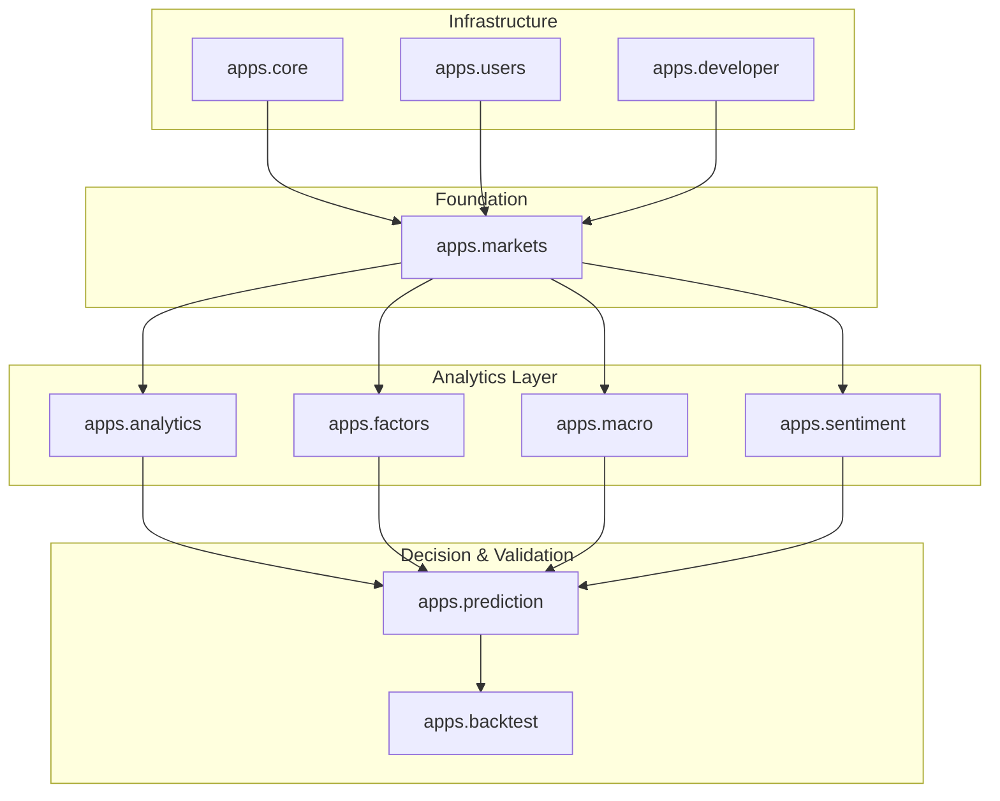
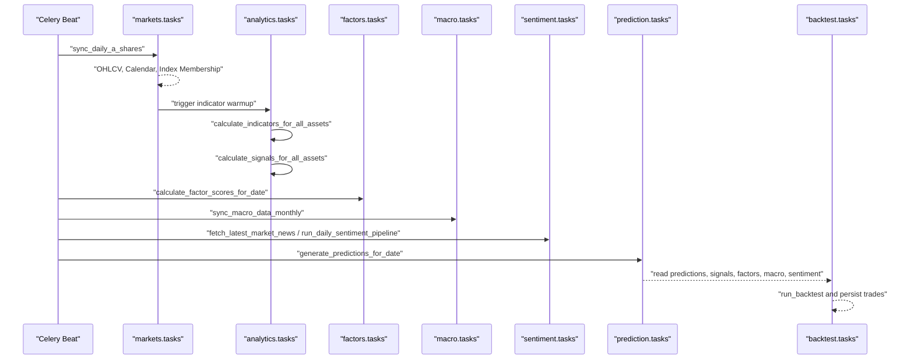
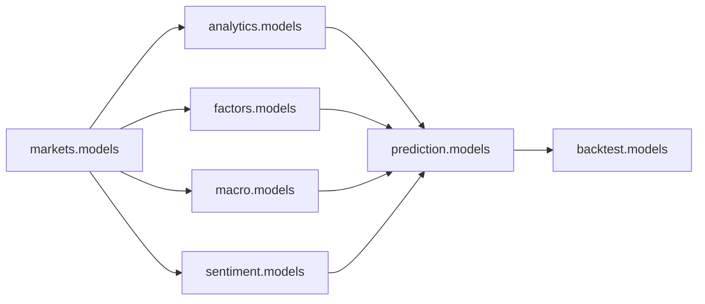

# Application Module Breakdown

<cite>
**Referenced Files in This Document**
- [base.py](file://config/settings/base.py)
- [models.py](file://apps/markets/models.py)
- [tasks.py](file://apps/markets/tasks.py)
- [models.py](file://apps/analytics/models.py)
- [models.py](file://apps/factors/models.py)
- [models.py](file://apps/macro/models.py)
- [models.py](file://apps/sentiment/models.py)
- [models.py](file://apps/prediction/models.py)
- [models.py](file://apps/backtest/models.py)
- [models.py](file://apps/users/models.py)
- [models.py](file://apps/developer/models.py)
</cite>

## Table of Contents
1. [Introduction](#introduction)
2. [Project Structure](#project-structure)
3. [Core Components](#core-components)
4. [Architecture Overview](#architecture-overview)
5. [Detailed Component Analysis](#detailed-component-analysis)
6. [Dependency Analysis](#dependency-analysis)
7. [Performance Considerations](#performance-considerations)
8. [Troubleshooting Guide](#troubleshooting-guide)
9. [Conclusion](#conclusion)

## Introduction
This document explains the FinanceAnalysis Django platform’s application module breakdown and strict dependency hierarchy. The system is organized into ten specialized Django applications that form a layered data pipeline:

- Markets (foundation): asset lifecycle, OHLCV time series, trading calendar, index memberships, and benchmark indices.
- Analytics: technical indicators and signal generation on top of market data.
- Factors: fundamental analysis, capital flow, margin details, and composite scoring.
- Macro: macroeconomic snapshots, market context phases, and event impact statistics.
- Sentiment: news ingestion, per-article scoring, rolling sentiment aggregation, and concept heat.
- Prediction: ML model versions, prediction results, and trade decision logic.
- Backtest: strategy execution, run state, and trade ledger for validation.
- Users: authentication, profiles, subscriptions, and API usage tracking.
- Developer: developer portal tools including secure API key management and changelog.
- Core: shared utilities such as pagination and throttling used across apps.

The architecture enforces a strict upstream-to-downstream dependency chain. Downstream apps may read from upstream apps via the database layer only; they must not import models or services directly from upstream Python modules. Cross-app communication occurs through persisted records and scheduled tasks.

**Section sources**
- [base.py:64-88](file://config/settings/base.py#L64-L88)

## Project Structure
At runtime, Django loads the applications in a defined order. The configuration lists core infrastructure apps first, followed by domain apps in a deliberate sequence that reflects the data dependency graph. This ordering supports clean architectural boundaries and predictable initialization behavior.

**Diagram sources**
- [base.py:64-88](file://config/settings/base.py#L64-L88)

**Section sources**
- [base.py:64-88](file://config/settings/base.py#L64-L88)

## Core Components
The foundation layer centers on markets, which defines the canonical entities for assets, exchanges, calendars, suspensions, index memberships, benchmarks, and OHLCV time series. These tables are the single source of truth consumed by all downstream analytics, factors, macro, sentiment, prediction, and backtest modules.

Key responsibilities:
- Asset lifecycle: listing status, list/delist dates, and membership tags.
- Exchange trading calendar: official open/close days per exchange.
- Suspensions: daily suspension flags and timing.
- Index memberships: historical constituent weights for benchmarks.
- Benchmark indices: official index daily history for comparisons.
- Point-in-time union benchmark: internal benchmark constructed for backtests.
- OHLCV: daily price and volume records per asset.

Downstream apps reference these entities through foreign keys and date-scoped queries rather than direct imports of business logic.

**Section sources**
- [models.py:19-62](file://apps/markets/models.py#L19-L62)
- [models.py:65-84](file://apps/markets/models.py#L65-L84)
- [models.py:87-114](file://apps/markets/models.py#L87-L114)
- [models.py:117-144](file://apps/markets/models.py#L117-L144)
- [models.py:147-170](file://apps/markets/models.py#L147-L170)
- [models.py:173-199](file://apps/markets/models.py#L173-L199)
- [models.py:201-226](file://apps/markets/models.py#L201-L226)

## Architecture Overview
The platform follows a layered architecture where each app owns its data and exposes it via the database. Tasks orchestrate data movement and computation across layers using Celery schedules and queues.

**Diagram sources**
- [base.py:218-255](file://config/settings/base.py#L218-L255)
- [tasks.py:14-20](file://apps/markets/tasks.py#L14-L20)

## Detailed Component Analysis

### Markets App (Foundation Layer)
Responsibilities:
- Maintain Market, Asset, ExchangeTradingCalendar, AssetSuspension, IndexMembership, BenchmarkIndexDaily, PointInTimeBenchmarkDaily, and OHLCV.
- Provide authoritative asset universe and time series for all downstream processing.
- Orchestrate daily synchronization of A-shares, index memberships, and calendar data via Celery tasks.

Data relationships:
- Asset links to Market and has related OHLCV, suspensions, and index memberships.
- Benchmarks store official index histories used for performance comparison.
- Point-in-time union benchmark stores computed daily returns and NAV for backtesting.

Processing highlights:
- Date range resolution and safe numeric parsing ensure robust backfills.
- Index code normalization and provider mapping support multiple benchmark sources.
- Trading calendar and suspension data gate availability for trading and analysis.

**Section sources**
- [models.py:19-62](file://apps/markets/models.py#L19-L62)
- [models.py:65-84](file://apps/markets/models.py#L65-L84)
- [models.py:87-114](file://apps/markets/models.py#L87-L114)
- [models.py:117-144](file://apps/markets/models.py#L117-L144)
- [models.py:147-170](file://apps/markets/models.py#L147-L170)
- [models.py:173-199](file://apps/markets/models.py#L173-L199)
- [models.py:201-226](file://apps/markets/models.py#L201-L226)
- [tasks.py:14-20](file://apps/markets/tasks.py#L14-L20)

### Analytics App (Technical Indicators and Signals)
Responsibilities:
- Persist TechnicalIndicator values per asset and timestamp with parameters.
- Manage ScreenerTemplate definitions and AlertRule configurations for user-defined alerts.
- Record AlertEvent outcomes and SignalEvent detections derived from indicator analysis.

Interdependencies:
- References Asset from markets via foreign key.
- Consumes OHLCV indirectly through indicator calculations orchestrated by tasks.

Signal types include moving average crosses, Bollinger Band breakouts, volume spikes, momentum signals, and reversal combinations.

**Section sources**
- [models.py:8-45](file://apps/analytics/models.py#L8-L45)
- [models.py:48-84](file://apps/analytics/models.py#L48-L84)
- [models.py:87-145](file://apps/analytics/models.py#L87-L145)
- [models.py:148-195](file://apps/analytics/models.py#L148-L195)
- [models.py:198-254](file://apps/analytics/models.py#L198-L254)

### Factors App (Fundamental Analysis and Composite Scoring)
Responsibilities:
- Store FundamentalFactorSnapshot, AssetMoneyFlowSnapshot, AssetMarginDetailSnapshot, and CapitalFlowSnapshot for factor inputs.
- Compute FactorScore entries in TECHNICAL, FUNDAMENTAL, and COMPOSITE modes with component metrics and weighted aggregates.

Interdependencies:
- References Asset from markets via foreign key.
- Scores incorporate technical reversal and sentiment components produced by other apps.

Composite scoring combines financial ratios, flow metrics, technical scores, and sentiment weights to produce bottom probability outputs.

**Section sources**
- [models.py:7-37](file://apps/factors/models.py#L7-L37)
- [models.py:39-68](file://apps/factors/models.py#L39-L68)
- [models.py:70-98](file://apps/factors/models.py#L70-L98)
- [models.py:100-122](file://apps/factors/models.py#L100-L122)
- [models.py:124-176](file://apps/factors/models.py#L124-L176)

### Macro App (Economic Data and Market Context)
Responsibilities:
- Persist MacroSnapshot with yields, PMI, CPI/PPI, and currency indices.
- Track MarketContext periods with macro phases and event tags.
- Record EventImpactStat summaries for historical impact analysis.

Interdependencies:
- No direct model dependencies on other apps; integrates via date-scoped queries and task-driven updates.

**Section sources**
- [models.py:5-28](file://apps/macro/models.py#L5-L28)
- [models.py:31-57](file://apps/macro/models.py#L31-L57)
- [models.py:59-77](file://apps/macro/models.py#L59-L77)

### Sentiment App (News and Aggregated Sentiment)
Responsibilities:
- Ingest NewsArticle records with deduplication by URL and provider tagging.
- Produce SentimentScore rows for ARTICLE, ASSET_7D, and MARKET_7D scopes with label classification.
- Aggregate ConceptHeat for theme monitoring.

Interdependencies:
- Links to Asset via ManyToMany for article association.
- ASSET_7D aggregations feed heuristic, LightGBM, LSTM, and backtest consumption paths.

Idempotent upserts rely on unique constraints across article, asset, date, and score_type.

**Section sources**
- [models.py:35-62](file://apps/sentiment/models.py#L35-L62)
- [models.py:64-108](file://apps/sentiment/models.py#L64-L108)
- [models.py:110-125](file://apps/sentiment/models.py#L110-L125)

### Prediction App (ML Pipelines and Trade Decisions)
Responsibilities:
- Track ModelVersion entries for LIGHTGBM, LSTM, and ENSEMBLE models with artifacts, metrics, and feature schemas.
- Persist PredictionResult with probabilities, confidence, predicted labels, target prices, stop-loss, risk-reward ratio, and suggested flags.
- Provide odds-based trade decision estimation and feature payloads for traceability.

Interdependencies:
- References Asset from markets via foreign key.
- Reads signals, factors, macro context, and sentiment through database queries during inference and backtesting.

**Section sources**
- [models.py:7-40](file://apps/prediction/models.py#L7-L40)
- [models.py:43-97](file://apps/prediction/models.py#L43-L97)

### Backtest App (Strategy Validation and Trade Ledger)
Responsibilities:
- Manage BacktestRun lifecycle states, parameters, reports, and chunked resume state.
- Record BacktestTrade legs with side, quantity, price, fees, slippage, PnL, and signal payload provenance.
- Support strategies including bottom candidate, prediction threshold, and macro rotation.

Interdependencies:
- References Asset from markets via foreign key.
- Consumes FactorScore, TechnicalIndicator, MarketContext, OHLCV, and prediction outputs via database reads during execution.

**Section sources**
- [models.py:24-117](file://apps/backtest/models.py#L24-L117)
- [models.py:120-168](file://apps/backtest/models.py#L120-L168)

### Users App (Authentication and Subscriptions)
Responsibilities:
- Extend Django User with UserProfile including phone, company, email verification, and subscription tier properties.
- Manage Subscription records with Stripe identifiers, active status, start/end dates, and auto-renew flags.
- Track APIUsage for rate limiting and analytics.

Interdependencies:
- Integrates with Django auth and REST framework authentication classes configured centrally.

**Section sources**
- [models.py:7-66](file://apps/users/models.py#L7-L66)
- [models.py:68-138](file://apps/users/models.py#L68-L138)
- [models.py:140-186](file://apps/users/models.py#L140-L186)

### Developer App (API Tools)
Responsibilities:
- Securely generate and store DeveloperAPIKey with hashed storage and prefix display.
- Maintain ChangelogEntry for API versioning and breaking change notices.

Interdependencies:
- Provides authentication class referenced by central DRF settings.

**Section sources**
- [models.py:10-100](file://apps/developer/models.py#L10-L100)
- [models.py:103-156](file://apps/developer/models.py#L103-L156)

## Dependency Analysis
The platform enforces a strict upstream-to-downstream boundary:

- Upstream apps: markets, users, developer, core.
- Mid-layer apps: analytics, factors, macro, sentiment.
- Downstream apps: prediction, backtest.

Rules:
- Downstream apps must not import business logic from upstream apps directly.
- Cross-app communication occurs exclusively through the database layer using foreign keys and date-scoped queries.
- Scheduled tasks coordinate data flow between apps without creating tight coupling.

**Diagram sources**
- [models.py:5-5](file://apps/analytics/models.py#L5-L5)
- [models.py:4-4](file://apps/factors/models.py#L4-L4)
- [models.py:4-4](file://apps/sentiment/models.py#L4-L4)
- [models.py:4-4](file://apps/prediction/models.py#L4-L4)
- [models.py:21-21](file://apps/backtest/models.py#L21-L21)

**Section sources**
- [models.py:5-5](file://apps/analytics/models.py#L5-L5)
- [models.py:4-4](file://apps/factors/models.py#L4-L4)
- [models.py:4-4](file://apps/sentiment/models.py#L4-L4)
- [models.py:4-4](file://apps/prediction/models.py#L4-L4)
- [models.py:21-21](file://apps/backtest/models.py#L21-L21)

## Performance Considerations
- Database indexing: All critical tables define indexes on frequently queried fields such as asset, date, and indicator_type to optimize lookups.
- Chunked execution: Backtest runs use report.runtime_state to resume large computations without reprocessing entire datasets.
- Task routing: Celery queues isolate heavy workloads (backtest, training-lightgbm, training-lstm) to prevent contention.
- Idempotency: Unique constraints on aggregated tables (e.g., sentiment scores) ensure reruns do not double-count.
- Pagination and throttling: Centralized pagination and tiered throttling protect APIs under load.

[No sources needed since this section provides general guidance]

## Troubleshooting Guide
Common issues and resolutions:
- Stale indicators or signals: Use management commands to backfill technical indicators and signal events when upstream OHLCV changes.
- Missing macro data: Verify monthly sync tasks and provider fallbacks; adjust sleep and retry settings if providers throttle.
- Backtest failures: Inspect BacktestRun.error_message and report.runtime_state; check current_task_id and pending_control_action for worker health.
- Authentication errors: Ensure JWT tokens are valid and API keys are active and not expired; verify DRF authentication classes are enabled.
- Rate limits: Review APIUsage logs and adjust throttling tiers or request patterns.

Operational hooks:
- Celery Beat schedules drive periodic syncs and pipelines; misconfiguration can cause gaps in data freshness.
- Task queues must be running for backtests and model training; monitor queue depth and worker health.

**Section sources**
- [base.py:218-255](file://config/settings/base.py#L218-L255)
- [models.py:24-117](file://apps/backtest/models.py#L24-L117)

## Conclusion
FinanceAnalysis implements a clean, layered architecture where markets provide foundational data, analytics and factors enrich it with technical and fundamental insights, macro and sentiment add external context, prediction synthesizes signals into probabilistic decisions, and backtest validates strategies against historical data. Strict dependency boundaries enforced through database-only communication ensure maintainability and scalability. Scheduled tasks and queues orchestrate data flows, while centralized configuration standardizes authentication, throttling, and operational behavior across the platform.

[No sources needed since this section summarizes without analyzing specific files]