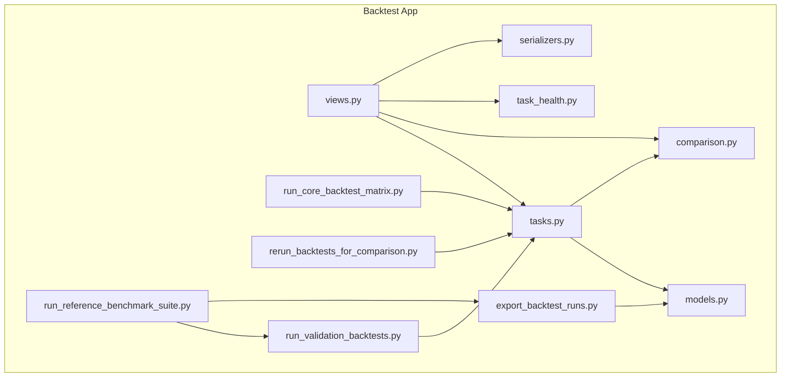
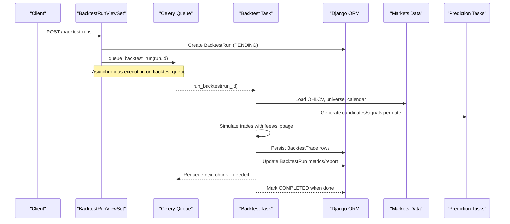
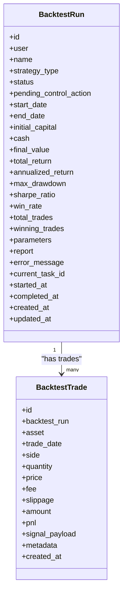
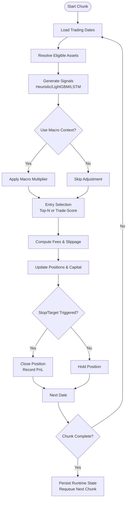
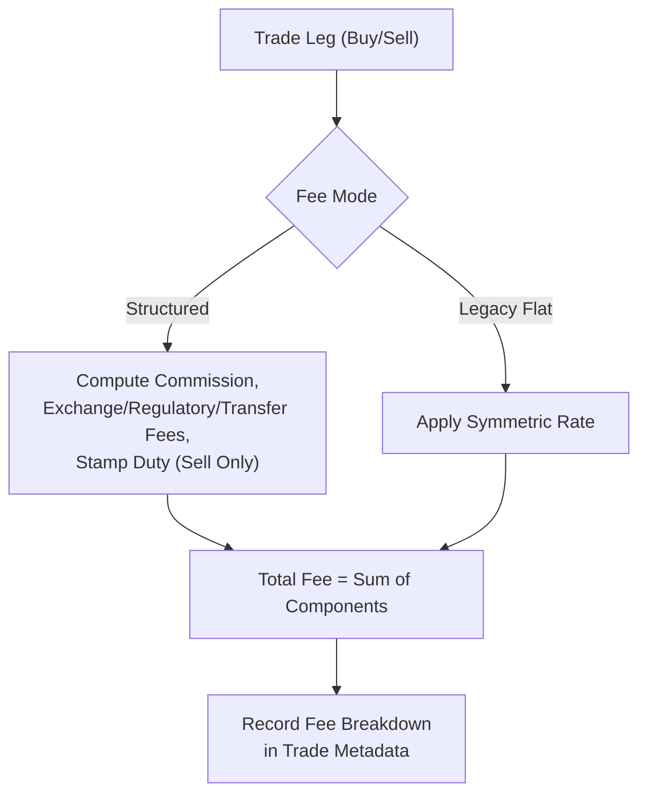
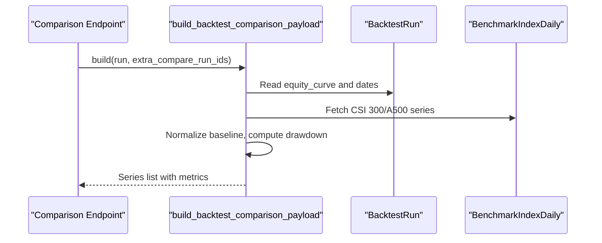
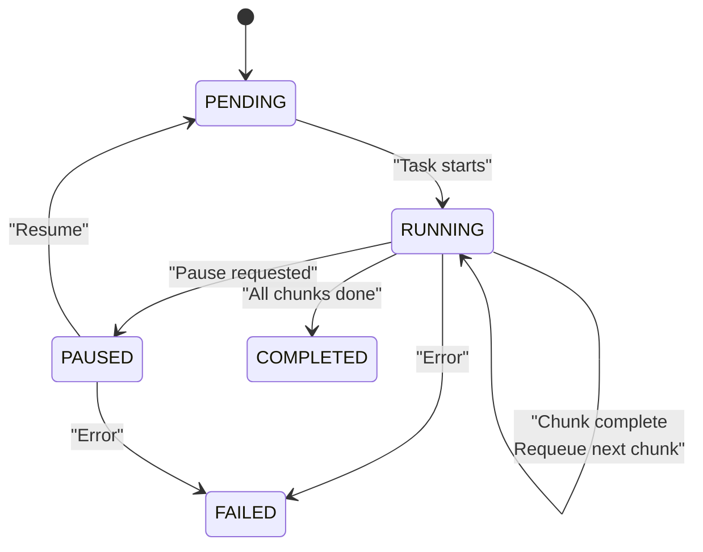
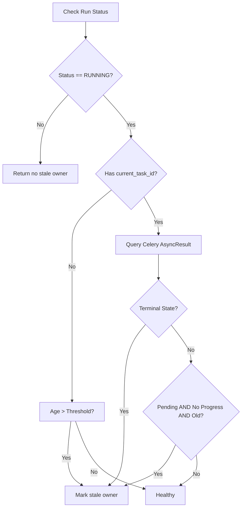
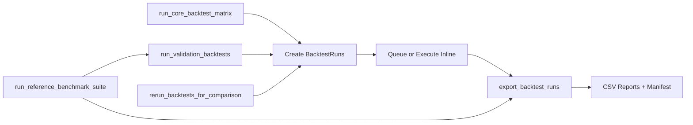
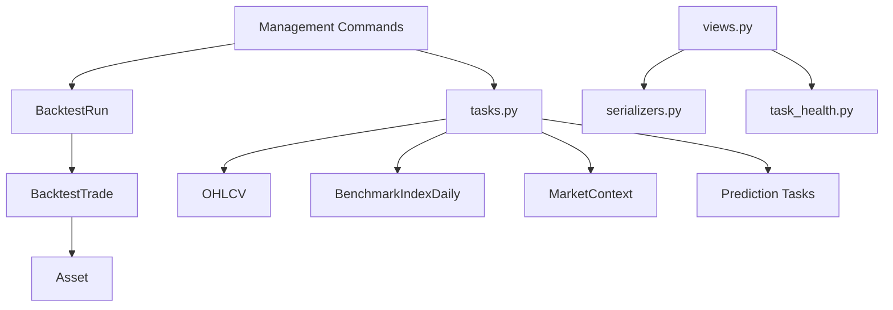

# Backtest Application

<cite>
**Referenced Files in This Document**
- [models.py](file://apps/backtest/models.py)
- [tasks.py](file://apps/backtest/tasks.py)
- [comparison.py](file://apps/backtest/comparison.py)
- [task_health.py](file://apps/backtest/task_health.py)
- [views.py](file://apps/backtest/views.py)
- [serializers.py](file://apps/backtest/serializers.py)
- [run_core_backtest_matrix.py](file://apps/backtest/management/commands/run_core_backtest_matrix.py)
- [export_backtest_runs.py](file://apps/backtest/management/commands/export_backtest_runs.py)
- [rerun_backtests_for_comparison.py](file://apps/backtest/management/commands/rerun_backtests_for_comparison.py)
- [run_validation_backtests.py](file://apps/backtest/management/commands/run_validation_backtests.py)
- [run_reference_benchmark_suite.py](file://apps/backtest/management/commands/run_reference_benchmark_suite.py)
</cite>

## Table of Contents
1. [Introduction](#introduction)
2. [Project Structure](#project-structure)
3. [Core Components](#core-components)
4. [Architecture Overview](#architecture-overview)
5. [Detailed Component Analysis](#detailed-component-analysis)
6. [Dependency Analysis](#dependency-analysis)
7. [Performance Considerations](#performance-considerations)
8. [Troubleshooting Guide](#troubleshooting-guide)
9. [Conclusion](#conclusion)
10. [Appendices](#appendices)

## Introduction
This document explains the Backtest application that validates trading strategies against historical data. It covers:
- The BacktestRun model and its performance metrics, exit strategies, and cost modeling
- The strategy execution engine that turns parameters into equity curves, trade ledgers, and reports
- Realistic cost simulation including stamp duty, slippage, and structured CN A-share fees
- Benchmark comparison framework for CSI 300 and CSI A500 index series
- Task architecture for parallel backtest execution with chunked, resumable runs
- Health monitoring for long-running jobs to detect orphaned tasks
- Management commands for running backtest matrices, validation suites, and exporting results
- Integration with Prediction results and model artifacts
- Reporting and export capabilities for performance analysis and auditability

## Project Structure
The Backtest app is organized around persistence (models), execution (tasks), API (views/serializers), benchmarking (comparison), health monitoring (task_health), and management commands for orchestration and reporting.

**Diagram sources**
- [models.py:24-168](file://apps/backtest/models.py#L24-L168)
- [tasks.py:1-120](file://apps/backtest/tasks.py#L1-L120)
- [comparison.py:1-245](file://apps/backtest/comparison.py#L1-L245)
- [task_health.py:1-95](file://apps/backtest/task_health.py#L1-L95)
- [views.py:1-221](file://apps/backtest/views.py#L1-L221)
- [serializers.py:1-300](file://apps/backtest/serializers.py#L1-L300)
- [run_core_backtest_matrix.py:1-461](file://apps/backtest/management/commands/run_core_backtest_matrix.py#L1-L461)
- [export_backtest_runs.py:1-530](file://apps/backtest/management/commands/export_backtest_runs.py#L1-L530)
- [rerun_backtests_for_comparison.py:1-157](file://apps/backtest/management/commands/rerun_backtests_for_comparison.py#L1-L157)
- [run_validation_backtests.py:1-144](file://apps/backtest/management/commands/run_validation_backtests.py#L1-L144)
- [run_reference_benchmark_suite.py:1-124](file://apps/backtest/management/commands/run_reference_benchmark_suite.py#L1-L124)

**Section sources**
- [models.py:24-168](file://apps/backtest/models.py#L24-L168)
- [tasks.py:1-120](file://apps/backtest/tasks.py#L1-L120)
- [comparison.py:1-245](file://apps/backtest/comparison.py#L1-L245)
- [task_health.py:1-95](file://apps/backtest/task_health.py#L1-L95)
- [views.py:1-221](file://apps/backtest/views.py#L1-L221)
- [serializers.py:1-300](file://apps/backtest/serializers.py#L1-L300)
- [run_core_backtest_matrix.py:1-461](file://apps/backtest/management/commands/run_core_backtest_matrix.py#L1-L461)
- [export_backtest_runs.py:1-530](file://apps/backtest/management/commands/export_backtest_runs.py#L1-L530)
- [rerun_backtests_for_comparison.py:1-157](file://apps/backtest/management/commands/rerun_backtests_for_comparison.py#L1-L157)
- [run_validation_backtests.py:1-144](file://apps/backtest/management/commands/run_validation_backtests.py#L1-L144)
- [run_reference_benchmark_suite.py:1-124](file://apps/backtest/management/commands/run_reference_benchmark_suite.py#L1-L124)

## Core Components
- BacktestRun: Stores run configuration, status lifecycle, performance metrics, report payload, and control state for pause/restart/delete.
- BacktestTrade: Ledger of executed buy/sell legs with fees, slippage, PnL, and signal payload explaining why entries occurred.
- Execution Engine (tasks): Generates candidates at runtime, computes signals, simulates trades with realistic costs, and writes equity curve and metrics.
- Comparison Framework: Builds normalized equity curves vs CSI 300 and CSI A500 for visual and metric comparison.
- Health Monitoring: Detects stale or orphaned Celery tasks for long-running chunked backtests.
- API and Serializers: Expose lifecycle controls, trade ledger, and comparison payloads; validate parameter contracts.
- Management Commands: Orchestrate matrix runs, validation sweeps, reruns for comparison, and exports.

**Section sources**
- [models.py:24-168](file://apps/backtest/models.py#L24-L168)
- [tasks.py:1-120](file://apps/backtest/tasks.py#L1-L120)
- [comparison.py:1-245](file://apps/backtest/comparison.py#L1-L245)
- [task_health.py:1-95](file://apps/backtest/task_health.py#L1-L95)
- [views.py:1-221](file://apps/backtest/views.py#L1-L221)
- [serializers.py:1-300](file://apps/backtest/serializers.py#L1-L300)
- [run_core_backtest_matrix.py:1-461](file://apps/backtest/management/commands/run_core_backtest_matrix.py#L1-L461)
- [export_backtest_runs.py:1-530](file://apps/backtest/management/commands/export_backtest_runs.py#L1-L530)
- [rerun_backtests_for_comparison.py:1-157](file://apps/backtest/management/commands/rerun_backtests_for_comparison.py#L1-L157)
- [run_validation_backtests.py:1-144](file://apps/backtest/management/commands/run_validation_backtests.py#L1-L144)
- [run_reference_benchmark_suite.py:1-124](file://apps/backtest/management/commands/run_reference_benchmark_suite.py#L1-L124)

## Architecture Overview
The system orchestrates backtests through a Django REST API and Celery workers. Runs are created via API or management commands, queued as Celery tasks, and executed in chunks with resume support. Each run produces a trade ledger and a report containing equity curves and metrics. Benchmarks are derived on demand from index history.

**Diagram sources**
- [views.py:34-41](file://apps/backtest/views.py#L34-L41)
- [views.py:90-97](file://apps/backtest/views.py#L90-L97)
- [tasks.py:1-37](file://apps/backtest/tasks.py#L1-L37)
- [models.py:24-118](file://apps/backtest/models.py#L24-L118)

**Section sources**
- [views.py:34-41](file://apps/backtest/views.py#L34-L41)
- [views.py:90-97](file://apps/backtest/views.py#L90-L97)
- [tasks.py:1-37](file://apps/backtest/tasks.py#L1-L37)
- [models.py:24-118](file://apps/backtest/models.py#L24-L118)

## Detailed Component Analysis

### BacktestRun Model and Performance Metrics
- Lifecycle states: PENDING, RUNNING, PAUSED, COMPLETED, FAILED
- Control actions: NONE, PAUSE, RESTART, DELETE
- Key fields: start/end dates, initial capital, cash, final value, total_return, annualized_return, max_drawdown, sharpe_ratio, win_rate, total_trades, winning_trades
- Parameters JSON stores flexible strategy surface (candidate mode, thresholds, fee overrides, TP/SL policy, LightGBM backend)
- Report JSON stores equity curve, benchmark curve, metadata, and runtime_state for chunked resume

**Diagram sources**
- [models.py:24-168](file://apps/backtest/models.py#L24-L168)

**Section sources**
- [models.py:24-168](file://apps/backtest/models.py#L24-L168)

### Strategy Execution Engine
Key behaviors:
- Candidates generated at runtime from active artifacts and feature tables; not read from stored predictions to ensure comparability across runs
- Each session closes before opening to keep capital allocation semantics correct
- Long runs are chunked and resumable using BACKTEST_CHUNK_TRADING_DAYS and runtime_state in report
- Exit logic prefers conservative outcomes; stop-loss wins over target on same bar; missing close keeps position open
- Fees are asymmetric: CN A-share stamp duty applies only on sells

Cost modeling:
- Structured CN A-share default mode includes commission (with minimum), exchange fee, regulatory fee, transfer fee, and stamp duty on sells
- Legacy flat fee mode applies symmetric rate for backward compatibility
- Fee breakdown computed per trade leg and recorded

Slippage:
- Slippage field exists on BacktestTrade; configurable via parameters (e.g., slippage_bps) and applied during simulation

Exit strategies:
- Optional stop/target exits controlled by enable_stop_target_exit and trade_decision_policy (min_target_return_pct, min_stop_distance_pct, include_near_round_target)

Signal generation:
- Supports heuristic, LightGBM, LSTM prediction sources
- LightGBM supports multiple inference backends (cpu_serial, cpu_batched, windows_gpu) with batch size tuning
- Matrix signal caching reduces repeated computation across runs sharing a scope key

Macro context:
- Optional macro phase multiplier adjusts candidate selection probabilities based on current market context

**Diagram sources**
- [tasks.py:1-120](file://apps/backtest/tasks.py#L1-L120)
- [tasks.py:338-478](file://apps/backtest/tasks.py#L338-L478)
- [tasks.py:547-612](file://apps/backtest/tasks.py#L547-L612)
- [tasks.py:614-679](file://apps/backtest/tasks.py#L614-L679)

**Section sources**
- [tasks.py:1-120](file://apps/backtest/tasks.py#L1-L120)
- [tasks.py:338-478](file://apps/backtest/tasks.py#L338-L478)
- [tasks.py:547-612](file://apps/backtest/tasks.py#L547-L612)
- [tasks.py:614-679](file://apps/backtest/tasks.py#L614-L679)

### Realistic Cost Simulation
- Structured fee model mirrors CN A-share schedule:
  - Commission with minimum on both sides
  - Exchange fee, regulatory fee, transfer fee on both sides
  - Stamp duty on sells only
- Legacy flat fee mode for older experiments
- Fee breakdown captured per trade leg for auditability
- Slippage modeled separately and can be configured via parameters

**Diagram sources**
- [tasks.py:338-478](file://apps/backtest/tasks.py#L338-L478)

**Section sources**
- [tasks.py:338-478](file://apps/backtest/tasks.py#L338-L478)

### Benchmark Comparison Framework
- Builds normalized equity curves for the run and benchmarks (CSI 300, CSI A500) aligned to run trading dates
- Compares additional completed runs optionally via compare_backtest_run_id and extra_compare_run_ids
- Computes total return and drawdown for each series

**Diagram sources**
- [comparison.py:177-245](file://apps/backtest/comparison.py#L177-L245)
- [views.py:204-208](file://apps/backtest/views.py#L204-L208)

**Section sources**
- [comparison.py:177-245](file://apps/backtest/comparison.py#L177-L245)
- [views.py:204-208](file://apps/backtest/views.py#L204-L208)

### Task Architecture and Parallel Execution
- Chunked execution: Each run processes a fixed number of trading days per chunk and persists progress in report.runtime_state
- Resumability: Continuation tasks requeue themselves until completion
- Parallelism: Multiple runs execute concurrently via Celery workers consuming the backtest queue
- Inline execution: Management commands can execute inline for faster local runs while preserving cache semantics

**Diagram sources**
- [models.py:41-52](file://apps/backtest/models.py#L41-L52)
- [task_health.py:45-95](file://apps/backtest/task_health.py#L45-L95)
- [views.py:124-179](file://apps/backtest/views.py#L124-L179)

**Section sources**
- [models.py:41-52](file://apps/backtest/models.py#L41-L52)
- [task_health.py:45-95](file://apps/backtest/task_health.py#L45-L95)
- [views.py:124-179](file://apps/backtest/views.py#L124-L179)

### Health Monitoring System
- Detects stale task owners by checking Celery task state and age threshold
- Distinguishes healthy pending continuations (with runtime progress) from orphaned tasks (no progress beyond threshold)
- Integrates with API to expose task_state and has_stale_task_owner for clients

**Diagram sources**
- [task_health.py:45-95](file://apps/backtest/task_health.py#L45-L95)

**Section sources**
- [task_health.py:45-95](file://apps/backtest/task_health.py#L45-L95)

### Management Commands for Backtest Matrices
- run_core_backtest_matrix: Creates a cross-product matrix of variants, sources, horizons, and profiles; queues or executes inline; exports results and manifest
- run_validation_backtests: Rolling window validation sweep across date ranges and sources
- run_reference_benchmark_suite: Wraps validation suite and exports a self-describing evidence bundle with model references
- rerun_backtests_for_comparison: Clones existing runs with deep-copied parameters to enable apples-to-apples comparisons
- export_backtest_runs: Exports run summaries, configurations, model references, and optional detail exports (trades, macro context, comparisons)

**Diagram sources**
- [run_core_backtest_matrix.py:1-461](file://apps/backtest/management/commands/run_core_backtest_matrix.py#L1-L461)
- [run_validation_backtests.py:1-144](file://apps/backtest/management/commands/run_validation_backtests.py#L1-L144)
- [run_reference_benchmark_suite.py:1-124](file://apps/backtest/management/commands/run_reference_benchmark_suite.py#L1-L124)
- [rerun_backtests_for_comparison.py:1-157](file://apps/backtest/management/commands/rerun_backtests_for_comparison.py#L1-L157)
- [export_backtest_runs.py:1-530](file://apps/backtest/management/commands/export_backtest_runs.py#L1-L530)

**Section sources**
- [run_core_backtest_matrix.py:1-461](file://apps/backtest/management/commands/run_core_backtest_matrix.py#L1-L461)
- [run_validation_backtests.py:1-144](file://apps/backtest/management/commands/run_validation_backtests.py#L1-L144)
- [run_reference_benchmark_suite.py:1-124](file://apps/backtest/management/commands/run_reference_benchmark_suite.py#L1-L124)
- [rerun_backtests_for_comparison.py:1-157](file://apps/backtest/management/commands/rerun_backtests_for_comparison.py#L1-L157)
- [export_backtest_runs.py:1-530](file://apps/backtest/management/commands/export_backtest_runs.py#L1-L530)

### Integration with Prediction Results
- Candidate generation uses active model artifacts and features at runtime, ensuring comparability across runs
- LightGBM integration supports multiple inference backends and batch sizes; matrix signal caching improves performance
- Signal payloads capture model version, artifact id, predicted labels, probabilities, and trade decisions for traceability
- Validation and reference suites link results to specific model generations via exported model_references.csv

**Section sources**
- [tasks.py:681-800](file://apps/backtest/tasks.py#L681-L800)
- [export_backtest_runs.py:344-430](file://apps/backtest/management/commands/export_backtest_runs.py#L344-L430)
- [run_core_backtest_matrix.py:231-271](file://apps/backtest/management/commands/run_core_backtest_matrix.py#L231-L271)

### Reporting and Export Functionality
- Default light export includes run_summary.csv, run_config_results.csv, model_references.csv
- Detail export adds trades.csv, macro_context_monthly.csv, and comparison CSVs
- Active LightGBM artifacts metadata can be included for attribution
- Comparison export supports paired metric deltas between left/right runs

**Section sources**
- [export_backtest_runs.py:1-530](file://apps/backtest/management/commands/export_backtest_runs.py#L1-L530)

## Dependency Analysis
- BacktestRun depends on User and Asset relationships; BacktestTrade depends on BacktestRun and Asset
- Execution engine depends on Markets models (OHLCV, BenchmarkIndexDaily), Prediction tasks (feature extraction, model inference), and Macro models (market context)
- API depends on serializers for validation and task_health for execution state exposure
- Management commands depend on tasks for execution and models for persistence

**Diagram sources**
- [models.py:24-168](file://apps/backtest/models.py#L24-L168)
- [tasks.py:54-69](file://apps/backtest/tasks.py#L54-L69)
- [comparison.py:13-17](file://apps/backtest/comparison.py#L13-L17)
- [views.py:20-31](file://apps/backtest/views.py#L20-L31)
- [serializers.py:16-20](file://apps/backtest/serializers.py#L16-L20)

**Section sources**
- [models.py:24-168](file://apps/backtest/models.py#L24-L168)
- [tasks.py:54-69](file://apps/backtest/tasks.py#L54-L69)
- [comparison.py:13-17](file://apps/backtest/comparison.py#L13-L17)
- [views.py:20-31](file://apps/backtest/views.py#L20-L31)
- [serializers.py:16-20](file://apps/backtest/serializers.py#L16-L20)

## Performance Considerations
- Process-level caches for trading dates, price maps, and matrix signals reduce repeated I/O and computation; clear between unrelated batches to bound memory
- LightGBM batch size and inference backend selection significantly impact throughput; choose appropriate backend for environment
- Chunk size tuning balances resilience and latency; larger chunks reduce requeue overhead but increase restart cost
- Matrix signal caching keyed by horizon, source, date, model identity, and policy avoids redundant predictions across runs

[No sources needed since this section provides general guidance]

## Troubleshooting Guide
Common issues and resolutions:
- Stale task owner: Use task_health to detect orphaned tasks; API supports pause/resume/restart to recover
- Missing equity curve: Comparison requires completed runs with stored equity_curve; ensure run finished successfully
- Parameter validation errors: Serializers enforce valid combinations (e.g., fee_rate vs structured fees, horizon_days values); adjust parameters accordingly
- Database connection errors: Inline execution retries on OperationalError/InterfaceError; reconnect connections as needed

**Section sources**
- [task_health.py:45-95](file://apps/backtest/task_health.py#L45-L95)
- [views.py:102-122](file://apps/backtest/views.py#L102-L122)
- [serializers.py:86-300](file://apps/backtest/serializers.py#L86-L300)
- [run_core_backtest_matrix.py:293-314](file://apps/backtest/management/commands/run_core_backtest_matrix.py#L293-L314)

## Conclusion
The Backtest application provides a robust, production-grade framework for validating trading strategies against historical data. It combines realistic cost modeling, flexible exit strategies, benchmark comparison, and resilient execution with chunked, resumable tasks. The management commands enable scalable matrix runs and validation sweeps, while exports provide comprehensive reporting and auditability. Integration with Prediction results ensures traceability to model generations, making it suitable for rigorous strategy evaluation and continuous improvement.

[No sources needed since this section summarizes without analyzing specific files]

## Appendices

### API Endpoints Summary
- Create BacktestRun: POST /backtest-runs (returns 202 Accepted)
- List/Retrieve BacktestRun: GET /backtest-runs
- Pause/Resume/Rerun/Restart/Delete: POST /backtest-runs/{id}/pause|resume|rerun|restart, DELETE /backtest-runs/{id}
- Trades: GET /backtest-runs/{id}/trades
- Comparison Curve: GET /backtest-runs/{id}/comparison_curve

**Section sources**
- [views.py:75-221](file://apps/backtest/views.py#L75-L221)

### Parameter Contract Highlights
- prediction_source: heuristic, lightgbm, lstm
- horizon_days: 3, 7, 30
- top_n: positive integer
- up_threshold: 0..1
- candidate_mode: top_n, trade_score
- trade_score_scope: independent, combined
- entry_weekdays: MON-FRI subset
- fee_rate vs structured fees: mutually exclusive
- lightgbm_inference_backend: auto, cpu_serial, cpu_batched, windows_gpu
- lightgbm_batch_size: positive integer

**Section sources**
- [serializers.py:86-300](file://apps/backtest/serializers.py#L86-L300)