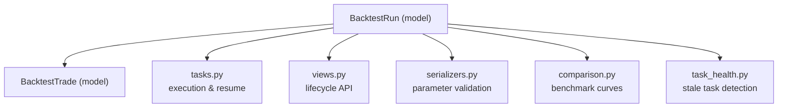
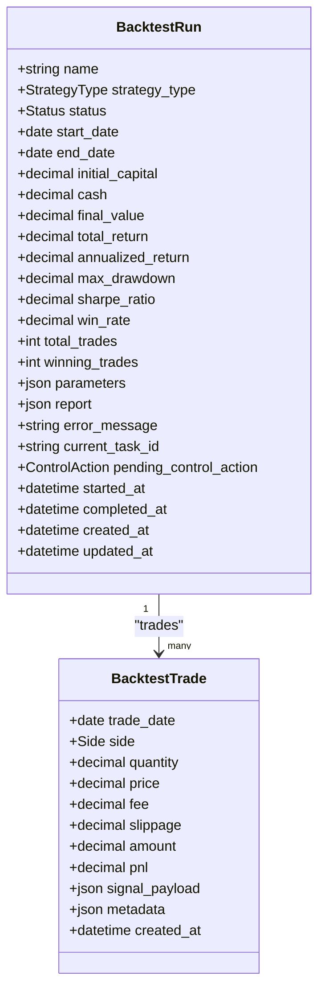
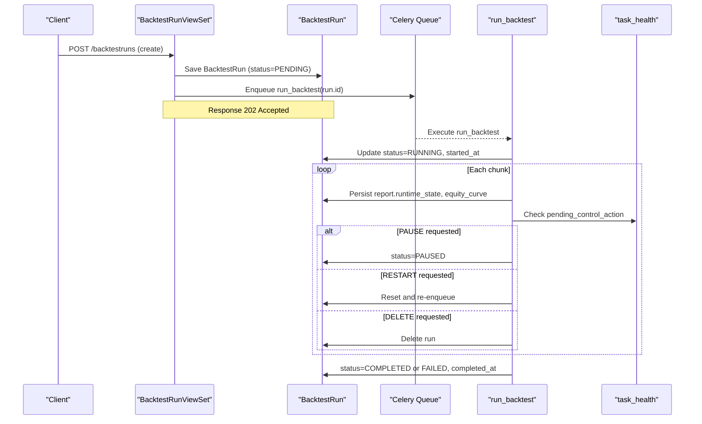
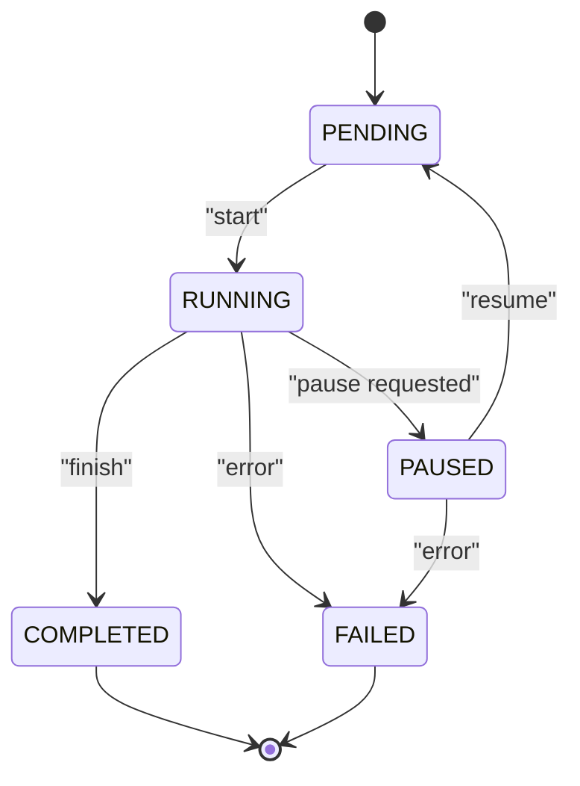
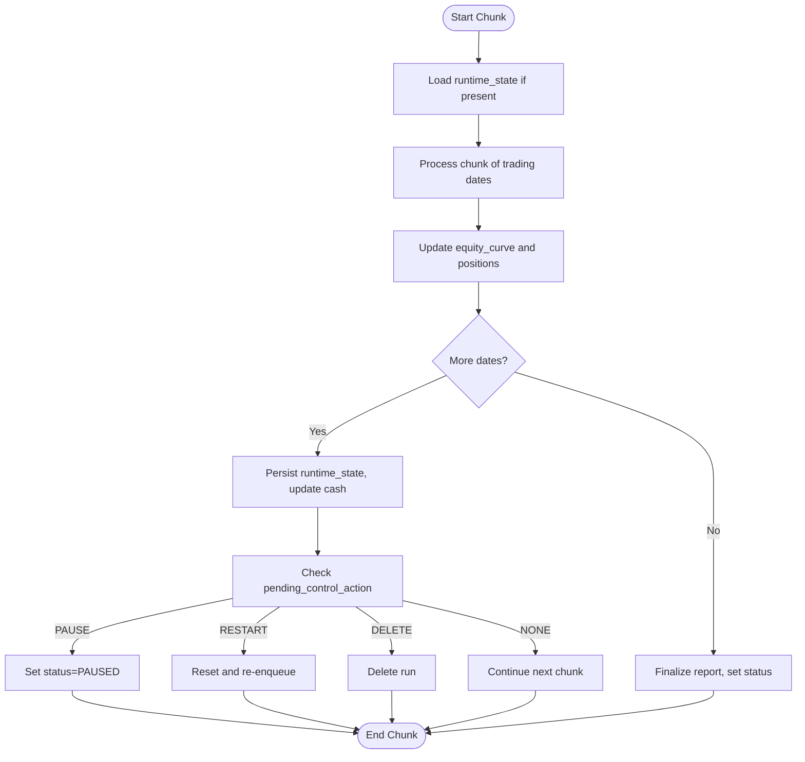
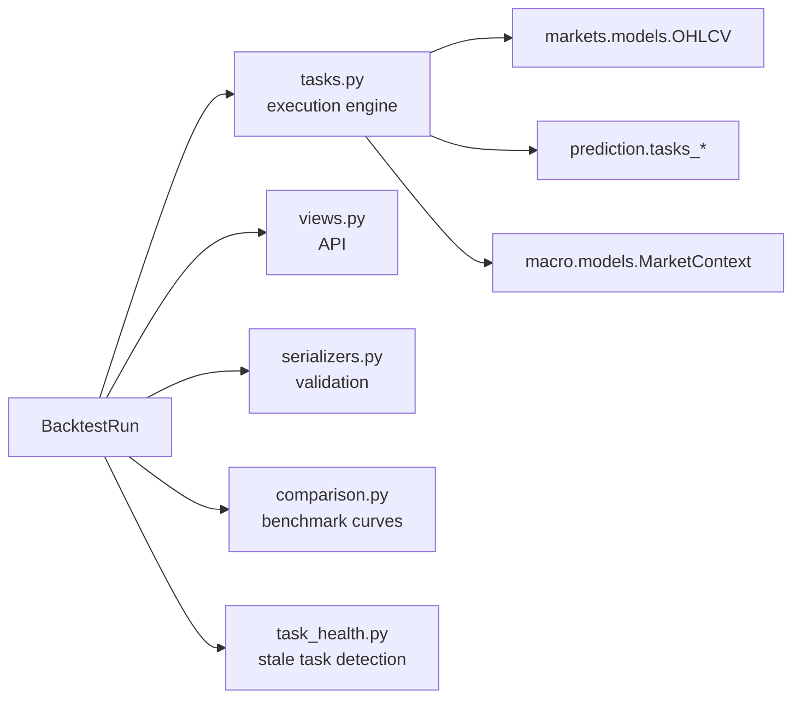

# Backtest Run Model

<cite>
**Referenced Files in This Document**
- [models.py](file://apps/backtest/models.py)
- [0001_initial.py](file://apps/backtest/migrations/0001_initial.py)
- [0002_backtestrun_lifecycle_controls.py](file://apps/backtest/migrations/0002_backtestrun_lifecycle_controls.py)
- [tasks.py](file://apps/backtest/tasks.py)
- [views.py](file://apps/backtest/views.py)
- [serializers.py](file://apps/backtest/serializers.py)
- [comparison.py](file://apps/backtest/comparison.py)
- [task_health.py](file://apps/backtest/task_health.py)
</cite>

## Table of Contents
1. [Introduction](#introduction)
2. [Project Structure](#project-structure)
3. [Core Components](#core-components)
4. [Architecture Overview](#architecture-overview)
5. [Detailed Component Analysis](#detailed-component-analysis)
6. [Dependency Analysis](#dependency-analysis)
7. [Performance Considerations](#performance-considerations)
8. [Troubleshooting Guide](#troubleshooting-guide)
9. [Conclusion](#conclusion)

## Introduction
This document explains the BacktestRun model, which is the central entity for tracking a backtest execution end-to-end: strategy configuration, lifecycle state, performance metrics, and resume/report data. It also documents the supported strategy types, lifecycle states, control actions, and how BacktestRun relates to user accounts and query indexes.

## Project Structure
The BacktestRun model lives in the backtest app alongside its execution engine, API surface, serializers, and utilities for task health and benchmark comparison. The most relevant files are:
- Data model and choices: apps/backtest/models.py
- Migrations that define fields and indexes: apps/backtest/migrations/0001_initial.py, 0002_backtestrun_lifecycle_controls.py
- Execution engine and chunked resume: apps/backtest/tasks.py
- API endpoints and lifecycle controls: apps/backtest/views.py
- Parameter validation and serialization: apps/backtest/serializers.py
- Benchmark comparison payload: apps/backtest/comparison.py
- Stale task detection: apps/backtest/task_health.py

**Diagram sources**
- [models.py:24-117](file://apps/backtest/models.py#L24-L117)
- [tasks.py:2307-2553](file://apps/backtest/tasks.py#L2307-L2553)
- [views.py:75-208](file://apps/backtest/views.py#L75-L208)
- [serializers.py:48-300](file://apps/backtest/serializers.py#L48-L300)
- [comparison.py:177-245](file://apps/backtest/comparison.py#L177-L245)
- [task_health.py:45-95](file://apps/backtest/task_health.py#L45-L95)

**Section sources**
- [models.py:24-117](file://apps/backtest/models.py#L24-L117)
- [0001_initial.py:17-93](file://apps/backtest/migrations/0001_initial.py#L17-L93)
- [0002_backtestrun_lifecycle_controls.py:10-37](file://apps/backtest/migrations/0002_backtestrun_lifecycle_controls.py#L10-L37)

## Core Components
BacktestRun stores one backtest run’s identity, configuration, results, and execution state. Key aspects:
- Strategy type: BOTTOM_CANDIDATE, PREDICTION_THRESHOLD, MACRO_ROTATION
- Lifecycle status: PENDING, RUNNING, PAUSED, COMPLETED, FAILED
- Control action: NONE, PAUSE, RESTART, DELETE
- Performance metrics: total_return, annualized_return, max_drawdown, sharpe_ratio, win_rate, trade counts
- Flexible parameters via JSON field
- Report JSON for equity curve, benchmark metadata, and runtime_state for chunked resume
- User relationship via ForeignKey

**Diagram sources**
- [models.py:24-117](file://apps/backtest/models.py#L24-L117)
- [models.py:120-168](file://apps/backtest/models.py#L120-L168)

**Section sources**
- [models.py:24-117](file://apps/backtest/models.py#L24-L117)
- [models.py:120-168](file://apps/backtest/models.py#L120-L168)

## Architecture Overview
BacktestRun is created by the API, enqueued as a Celery task, and executed in chunks. During execution, the engine updates the report with equity_curve and runtime_state so runs can be paused, resumed, restarted, or deleted at chunk boundaries. Task health utilities detect stale tasks when workers disappear.

**Diagram sources**
- [views.py:34-41](file://apps/backtest/views.py#L34-L41)
- [views.py:90-97](file://apps/backtest/views.py#L90-L97)
- [views.py:124-196](file://apps/backtest/views.py#L124-L196)
- [tasks.py:2307-2553](file://apps/backtest/tasks.py#L2307-L2553)
- [task_health.py:45-95](file://apps/backtest/task_health.py#L45-L95)

## Detailed Component Analysis

### Strategy Types and Use Cases
- Bottom Candidate: Selects bottom-performing candidates based on factors or signals; typically used for mean-reversion or contrarian strategies.
- Prediction Threshold: Uses prediction scores (heuristic, LightGBM, LSTM) and a threshold to decide entries; suitable for directional models with calibrated probabilities.
- Macro Rotation: Adjusts candidate selection or weights using macro context phases; useful for regime-aware allocation across assets or sectors.

These are defined as choices on the model and influence how parameters are interpreted during execution.

**Section sources**
- [models.py:36-39](file://apps/backtest/models.py#L36-L39)
- [tasks.py:567-611](file://apps/backtest/tasks.py#L567-L611)

### Lifecycle States and Control Actions
Lifecycle states:
- PENDING: Created but not yet running.
- RUNNING: Actively executing (may persist across multiple chunks).
- PAUSED: Temporarily halted; can be resumed.
- COMPLETED: Finished successfully.
- FAILED: Terminated due to an error.

Control actions (intent-based):
- NONE: No pending action.
- PAUSE: Request pause at next chunk boundary.
- RESTART: Request restart after current chunk or immediately if safe.
- DELETE: Request deletion after current chunk or immediately if safe.

Control actions are applied by the worker at chunk boundaries or immediately when safe, enabling long-running backtests to be managed without blocking.

**Diagram sources**
- [models.py:41-52](file://apps/backtest/models.py#L41-L52)
- [views.py:124-196](file://apps/backtest/views.py#L124-L196)
- [tasks.py:2451-2477](file://apps/backtest/tasks.py#L2451-L2477)

**Section sources**
- [models.py:41-52](file://apps/backtest/models.py#L41-L52)
- [views.py:124-196](file://apps/backtest/views.py#L124-L196)
- [tasks.py:2451-2477](file://apps/backtest/tasks.py#L2451-L2477)

### Performance Metrics Fields
The model exposes key performance metrics:
- total_return: Total return over the run period.
- annualized_return: Annualized return based on calendar days.
- max_drawdown: Maximum peak-to-trough decline from the equity curve.
- sharpe_ratio: Annualized Sharpe ratio computed from daily equity returns using 252 trading days and population standard deviation.
- win_rate: Ratio of winning trades to total closed positions.
- total_trades: Count of closed positions (not raw buy/sell rows).
- winning_trades: Closed positions with positive realized PnL.

These fields are populated by the execution engine after processing the equity curve and trade ledger.

**Section sources**
- [models.py:84-92](file://apps/backtest/models.py#L84-L92)
- [TECHNICAL_GUIDE.md:791-806](file://TECHNICAL_GUIDE.md#L791-L806)

### Parameters JSON Field Structure
The parameters JSON holds flexible strategy configuration. Validation occurs in the serializer to enforce allowed values and required keys per strategy type. For Prediction Threshold, common keys include:
- prediction_source: heuristic, lightgbm, lstm
- top_n, horizon_days, up_threshold
- candidate_mode: top_n or trade_score
- trade_score_scope: independent or combined
- entry_weekdays: list or comma-separated string of MON–FRI
- capital_fraction_per_entry, holding_period_days
- fee_rate or structured fee keys (commission_rate_per_mille, commission_min, exchange_fee_rate_per_mille, regulatory_fee_rate_per_mille, stamp_duty_rate_per_mille, transfer_fee_rate_per_mille)
- lightgbm_inference_backend, lightgbm_batch_size (when prediction_source is lightgbm)
- use_macro_context, enable_stop_target_exit
- trade_decision_policy: object with boolean and numeric thresholds
- compare_backtest_run_id: references another completed run for comparison

Validation rules ensure numeric ranges, allowed enums, and mutual exclusivity (e.g., fee_rate vs structured fees).

**Section sources**
- [serializers.py:86-300](file://apps/backtest/serializers.py#L86-L300)
- [tasks.py:338-446](file://apps/backtest/tasks.py#L338-L446)

### Report JSON Field Structure
The report JSON stores:
- equity_curve: List of portfolio equity values aligned to trading dates.
- benchmark.equity_curve: Not stored directly here; benchmark series are derived on demand from index history for comparison.
- strategy, prediction_source, candidate_mode, trade_score_scope, entry_weekdays, holding_period_days, enable_stop_target_exit, fee_model, fee_parameters, model_reference_count, model_references, macro_context_monthly.
- runtime_state: Resume bookkeeping for chunked runs, including current_index, cash, equity_curve snapshot, closed_pnls, open_positions, macro_monthly_report, and lightgbm_runtime metrics.

Chunked runs persist runtime_state between chunks, allowing safe pause/resume/restart and recovery after worker failures.

**Diagram sources**
- [tasks.py:2182-2216](file://apps/backtest/tasks.py#L2182-L2216)
- [tasks.py:2447-2477](file://apps/backtest/tasks.py#L2447-L2477)
- [tasks.py:2524-2553](file://apps/backtest/tasks.py#L2524-L2553)

**Section sources**
- [tasks.py:2182-2216](file://apps/backtest/tasks.py#L2182-L2216)
- [tasks.py:2447-2477](file://apps/backtest/tasks.py#L2447-L2477)
- [tasks.py:2524-2553](file://apps/backtest/tasks.py#L2524-L2553)

### Relationship with User Accounts
BacktestRun has a ForeignKey to the user account model, enabling:
- Ownership attribution: each run belongs to a user.
- Querying by user: retrieve all runs for a given user.
- Access control: API requires authentication; views scope queries to authenticated users.

The related_name 'backtest_runs' allows reverse lookups from user to runs.

**Section sources**
- [models.py:54-61](file://apps/backtest/models.py#L54-L61)
- [views.py:75-88](file://apps/backtest/views.py#L75-L88)

### Indexing Strategy for Efficient Querying
Indexes optimize common queries:
- Composite index on (strategy_type, status, created_at) supports filtering by strategy and status while ordering by creation time.
- Index on (start_date, end_date) optimizes date-range queries for runs.
- Additional indexes on BacktestTrade support querying trades by run and date, and by asset and date.

These indexes reduce latency for listing runs, filtering by strategy/status, and retrieving trade ledgers.

**Section sources**
- [models.py:114-117](file://apps/backtest/models.py#L114-L117)
- [0001_initial.py:76-91](file://apps/backtest/migrations/0001_initial.py#L76-L91)

## Dependency Analysis
BacktestRun depends on several components:
- Markets models for OHLCV and benchmarks used in execution and comparison.
- Prediction models and tasks for generating candidates and probabilities.
- Macro models for market context when enabled.
- Celery for asynchronous execution and task health checks.

**Diagram sources**
- [tasks.py:54-69](file://apps/backtest/tasks.py#L54-L69)
- [comparison.py:13-17](file://apps/backtest/comparison.py#L13-L17)
- [task_health.py:24-31](file://apps/backtest/task_health.py#L24-L31)

**Section sources**
- [tasks.py:54-69](file://apps/backtest/tasks.py#L54-L69)
- [comparison.py:13-17](file://apps/backtest/comparison.py#L13-L17)
- [task_health.py:24-31](file://apps/backtest/task_health.py#L24-L31)

## Performance Considerations
- Chunked execution: Runs process fixed numbers of trading days per chunk, persisting runtime_state to survive worker restarts and soft timeouts.
- Process-level caches: Trading dates, price maps, and matrix signals are cached with bounded sizes to reduce memory usage and improve throughput.
- Fee model: Asymmetric fees reflect CN A-share stamp duty on sells only; structured fee parameters allow precise cost modeling.
- Metric computation: Sharpe uses population standard deviation and 252 trading days; annualization uses calendar days.

[No sources needed since this section provides general guidance]

## Troubleshooting Guide
Common issues and resolutions:
- Stale task owner: If a run is RUNNING but the Celery task is terminal or pending too long without progress, it may be orphaned. The system detects this via task_health and can mark it stale.
- Pause/Resume: Only PENDING or RUNNING runs can be paused; only PAUSED runs can be resumed.
- Restart/Delete: Intent-based actions are applied at chunk boundaries; immediate action occurs if safe or if the task owner is stale.
- Parameter validation: Ensure required keys exist and values are within allowed ranges; fee_rate cannot be combined with structured fee parameters.

**Section sources**
- [task_health.py:45-95](file://apps/backtest/task_health.py#L45-L95)
- [views.py:124-196](file://apps/backtest/views.py#L124-L196)
- [serializers.py:86-300](file://apps/backtest/serializers.py#L86-L300)

## Conclusion
BacktestRun is the central record for backtest executions, combining strategy configuration, lifecycle management, performance metrics, and resume-capable reporting. Its design enables robust handling of long-running jobs through chunked execution, clear state transitions, and intent-based controls. Proper indexing and validation ensure efficient querying and reliable parameter handling across diverse strategies.