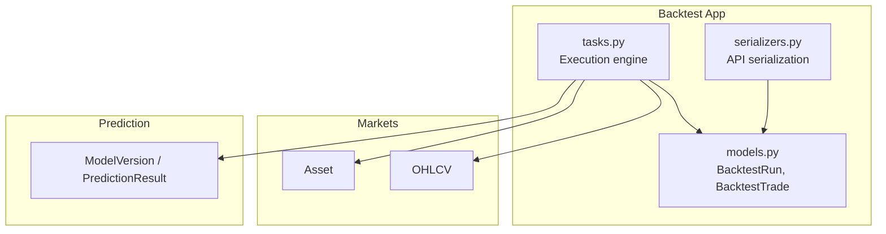
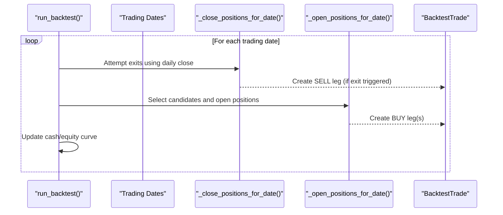
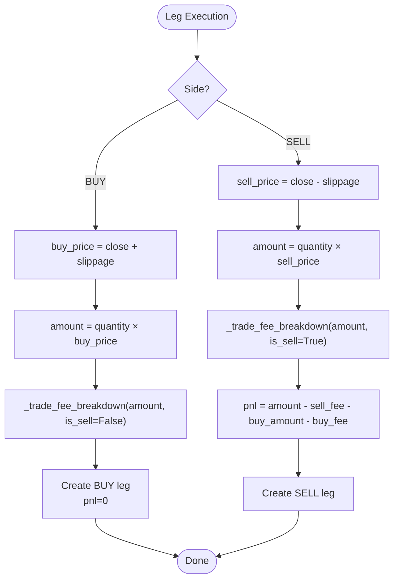
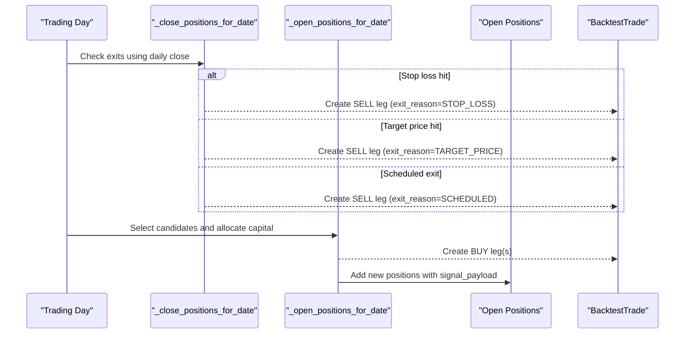
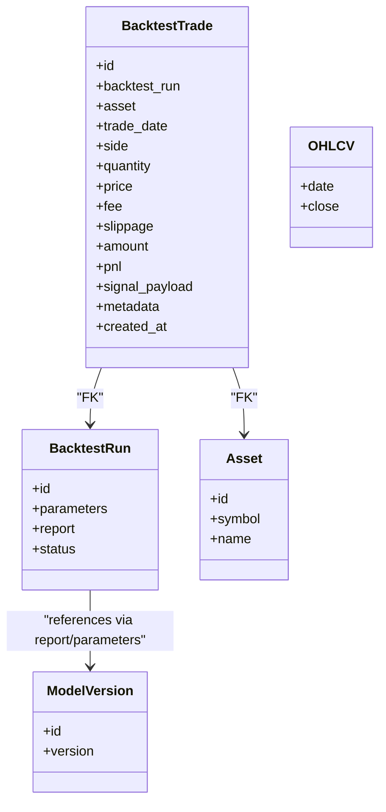

# Backtest Trade Model

<cite>
**Referenced Files in This Document**
- [models.py](file://apps/backtest/models.py)
- [serializers.py](file://apps/backtest/serializers.py)
- [tasks.py](file://apps/backtest/tasks.py)
- [tests.py](file://apps/backtest/tests.py)
</cite>

## Table of Contents
1. [Introduction](#introduction)
2. [Project Structure](#project-structure)
3. [Core Components](#core-components)
4. [Architecture Overview](#architecture-overview)
5. [Detailed Component Analysis](#detailed-component-analysis)
6. [Dependency Analysis](#dependency-analysis)
7. [Performance Considerations](#performance-considerations)
8. [Troubleshooting Guide](#troubleshooting-guide)
9. [Conclusion](#conclusion)
10. [Appendices](#appendices)

## Introduction
This document explains the BacktestTrade model used to record individual buy/sell legs produced by backtesting strategies. It clarifies how legs differ from round trips, documents all trade attributes (asset association, date, side, quantity, price, fees, slippage, amount, PnL), and details the signal_payload JSON that captures decision context such as candidate rank, selection metrics, threshold pass/fail status, trade-decision levels, and model provenance. It also covers the metadata field for additional trade context, indexing strategy for efficient queries, and provides examples of typical trade sequences and how to reconstruct portfolio positions from trade legs.

## Project Structure
The BacktestTrade model lives in the backtest app alongside a run model and an execution engine:
- apps/backtest/models.py defines BacktestRun and BacktestTrade.
- apps/backtest/serializers.py exposes API fields for trades and runs.
- apps/backtest/tasks.py implements the backtest execution engine that creates trade legs, manages positions, computes fees/slippage/PnL, and persists results.
- apps/backtest/tests.py contains tests that demonstrate expected behavior and trade counts.

**Diagram sources**
- [models.py:24-167](file://apps/backtest/models.py#L24-L167)
- [tasks.py:2299-2578](file://apps/backtest/tasks.py#L2299-L2578)

**Section sources**
- [models.py:24-167](file://apps/backtest/models.py#L24-L167)
- [serializers.py:35-46](file://apps/backtest/serializers.py#L35-L46)
- [tasks.py:2299-2578](file://apps/backtest/tasks.py#L2299-L2578)

## Core Components
- BacktestRun: Represents one backtest configuration and its results. Not directly part of this document’s focus but required context for trades.
- BacktestTrade: One executed leg (BUY or SELL). Rows are legs, not round trips; a closed position produces both BUY and SELL entries. Reported total_trades counts closed positions, so it is not comparable to a row count here.

Key fields on BacktestTrade:
- backtest_run: FK to BacktestRun.
- asset: FK to Asset.
- trade_date: Date of execution.
- side: BUY or SELL.
- quantity: Number of units bought or sold.
- price: Executed price per unit.
- fee: Total fees applied to this leg.
- slippage: Estimated slippage cost for this leg.
- amount: Gross value before fees (quantity × price).
- pnl: Realized PnL for SELL legs; zero for BUY legs.
- signal_payload: JSON capturing decision context at entry time.
- metadata: JSON for additional trade context (e.g., exit reason, fee model, fee breakdown).
- created_at: Timestamp when persisted.

Indexes:
- Composite index on (backtest_run, trade_date).
- Composite index on (asset, trade_date).
- Single-field indexes on trade_date and side for filtering.

**Section sources**
- [models.py:120-167](file://apps/backtest/models.py#L120-L167)

## Architecture Overview
The backtest engine iterates over trading dates, selects candidates, opens positions (creating BUY legs), and closes positions (creating SELL legs). Each leg is recorded as a BacktestTrade with full context via signal_payload and metadata.

**Diagram sources**
- [tasks.py:2397-2449](file://apps/backtest/tasks.py#L2397-L2449)
- [tasks.py:1920-1996](file://apps/backtest/tasks.py#L1920-L1996)
- [tasks.py:1999-2113](file://apps/backtest/tasks.py#L1999-L2113)

## Detailed Component Analysis

### BacktestTrade Model
- Purpose: Record each executed leg of a backtest strategy.
- Leg semantics:
  - BUY leg: Created when opening a position; pnl is zero; amount reflects gross purchase value; fee includes buy-side costs; slippage added to fill price.
  - SELL leg: Created when closing a position; pnl computed as proceeds minus fees minus original buy cost and fees; amount reflects sale proceeds; fee includes sell-side costs (asymmetric stamp duty applies only on sells); slippage subtracted from fill price.
- Attributes:
  - asset: Links trade to a specific tradable instrument.
  - trade_date: Execution date.
  - side: BUY or SELL.
  - quantity: Units traded.
  - price: Executed price per unit.
  - fee: Sum of all applicable fees for this leg.
  - slippage: Estimated slippage cost for this leg.
  - amount: quantity × price.
  - pnl: Realized PnL for SELL legs; zero for BUY legs.
  - signal_payload: Decision context captured at entry time and carried through to exit.
  - metadata: Additional context like exit_reason, fee_model, fee_breakdown.
  - created_at: Persist timestamp.

Indexing strategy:
- (backtest_run, trade_date): Efficiently query trades per run in chronological order.
- (asset, trade_date): Efficiently query historical trades per asset.
- trade_date and side single-field indexes support common filters.

**Section sources**
- [models.py:120-167](file://apps/backtest/models.py#L120-L167)

### Signal Payload
signal_payload records why an entry happened and what the model predicted. It is attached to both BUY and SELL legs for traceability.

Typical contents include:
- Strategy and prediction source identifiers.
- Candidate mode and top_n metric used for ranking.
- Probabilities: up_probability, flat_probability, down_probability.
- Confidence and predicted_label.
- Trade-decision fields: trade_score, target_price, stop_loss_price, risk_reward_ratio, suggested.
- Model provenance: model_version_id, model_version, model_artifact_id.
- Selection audit: candidate_rank, rank_value, passed_up_threshold, passed_trade_score_threshold (when applicable).
- Entry timing: entry_date, scheduled_exit_date.
- Macro context (optional): macro_phase, event_tag, macro_rank_multiplier.
- Generated_on_demand flag indicating whether predictions were computed at runtime.

How it is built:
- Candidates are generated at runtime per trading date from artifacts and feature tables.
- _pick_candidates ranks assets based on parameters and attaches signal_payload.
- _selection_audit_payload adds candidate_rank, rank_value, and threshold pass/fail flags.
- _backfill_prediction_trade_decision ensures missing trade-decision fields are filled if absent.

**Section sources**
- [tasks.py:1672-1827](file://apps/backtest/tasks.py#L1672-L1827)
- [tasks.py:1830-1904](file://apps/backtest/tasks.py#L1830-L1904)
- [tasks.py:1999-2113](file://apps/backtest/tasks.py#L1999-L2113)

### Metadata Field
metadata stores trade-specific context beyond the core fields:
- BUY legs: fee_model and fee_breakdown describing how fees were calculated.
- SELL legs: exit_reason (STOP_LOSS, TARGET_PRICE, or SCHEDULED), fee_model, and fee_breakdown.

This enables post-hoc analysis of why a trade occurred and how costs were applied.

**Section sources**
- [tasks.py:1976-1994](file://apps/backtest/tasks.py#L1976-L1994)
- [tasks.py:2094-2111](file://apps/backtest/tasks.py#L2094-L2111)

### Fees, Slippage, Amount, and PnL
Fees:
- Two modes supported: structured CN A-share defaults (asymmetric stamp duty on sells only) and legacy flat fee.
- Fee components include commission (with minimum), exchange fee, regulatory fee, transfer fee, and stamp duty.
- _trade_fee_breakdown computes per-leg fees; _max_buy_amount_for_budget solves budget net of fees.

Slippage:
- Configured in basis points (slippage_bps).
- BUY fills use close + slippage; SELL fills use close - slippage.

Amount:
- amount = quantity × price for both sides.

PnL:
- BUY legs have pnl = 0.
- SELL legs compute pnl = sale_proceeds - sell_fees - buy_cost - buy_fees.

**Diagram sources**
- [tasks.py:1920-1996](file://apps/backtest/tasks.py#L1920-L1996)
- [tasks.py:1999-2113](file://apps/backtest/tasks.py#L1999-L2113)
- [tasks.py:338-478](file://apps/backtest/tasks.py#L338-L478)

**Section sources**
- [tasks.py:338-478](file://apps/backtest/tasks.py#L338-L478)
- [tasks.py:1920-1996](file://apps/backtest/tasks.py#L1920-L1996)
- [tasks.py:1999-2113](file://apps/backtest/tasks.py#L1999-L2113)

### Position Lifecycle and Trade Legs
- Opening a position:
  - Candidates are selected and ranked; allocation budget is split evenly across selected candidates.
  - BUY legs are created with signal_payload including entry_date and scheduled_exit_date.
  - Position state tracks quantity, buy_amount, buy_fee, buy_price, target_price, stop_loss_price, and exit_date.
- Closing a position:
  - Exit precedence uses raw daily close: STOP_LOSS first, then TARGET_PRICE, then SCHEDULED.
  - SELL legs are created with exit_reason and associated metadata.
  - Realized PnL is appended to closed_pnls and reflected in run-level statistics.

**Diagram sources**
- [tasks.py:1920-1996](file://apps/backtest/tasks.py#L1920-L1996)
- [tasks.py:1999-2113](file://apps/backtest/tasks.py#L1999-L2113)

**Section sources**
- [tasks.py:1920-1996](file://apps/backtest/tasks.py#L1920-L1996)
- [tasks.py:1999-2113](file://apps/backtest/tasks.py#L1999-L2113)

### Typical Trade Sequences
A closed long position generates two legs:
- BUY leg on entry date with quantity, price (close + slippage), fee, amount, pnl=0, and signal_payload containing probabilities, thresholds, and model provenance.
- SELL leg on exit date with quantity, price (close - slippage), fee, amount, realized pnl, and metadata including exit_reason and fee_breakdown.

Examples validated by tests:
- A simple round trip yields two BacktestTrade rows (one BUY, one SELL).
- When no valid close exists, positions remain open and retries occur later.
- Tests assert counts and presence of BUY/SELL legs under various conditions.

**Section sources**
- [tests.py:488-488](file://apps/backtest/tests.py#L488-L488)
- [tests.py:692-692](file://apps/backtest/tests.py#L692-L692)
- [tests.py:814-815](file://apps/backtest/tests.py#L814-L815)
- [tests.py:1017-1018](file://apps/backtest/tests.py#L1017-L1018)
- [tests.py:1185-1186](file://apps/backtest/tests.py#L1185-L1186)
- [tests.py:1247-1248](file://apps/backtest/tests.py#L1247-L1248)
- [tests.py:1389-1389](file://apps/backtest/tests.py#L1389-L1389)
- [tests.py:1500-1501](file://apps/backtest/tests.py#L1500-L1501)

### Reconstructing Portfolio Positions from Trade Legs
To reconstruct positions:
- Group trades by asset and sort by trade_date.
- Maintain a running position balance:
  - On BUY: increase position by quantity; track cumulative buy_amount and buy_fee.
  - On SELL: decrease position by quantity; compute realized pnl as described above; update cash flow accordingly.
- Use signal_payload to understand why each BUY occurred (candidate_rank, thresholds, model version).
- Use metadata.exit_reason to explain SELL triggers.

Note: The engine frees capital and position slots on the same date they are vacated, ensuring capital_fraction_per_entry behaves as configured.

**Section sources**
- [tasks.py:13-15](file://apps/backtest/tasks.py#L13-L15)
- [tasks.py:1920-1996](file://apps/backtest/tasks.py#L1920-L1996)
- [tasks.py:1999-2113](file://apps/backtest/tasks.py#L1999-L2113)

## Dependency Analysis
BacktestTrade depends on:
- BacktestRun: Associates trades with a run configuration and lifecycle.
- Asset: Identifies the traded instrument.
- OHLCV: Provides daily close prices used for fills and exit checks.
- Prediction models and artifacts: Provide probabilities and trade-decision fields embedded in signal_payload.

**Diagram sources**
- [models.py:24-167](file://apps/backtest/models.py#L24-L167)
- [tasks.py:2299-2578](file://apps/backtest/tasks.py#L2299-L2578)

**Section sources**
- [models.py:24-167](file://apps/backtest/models.py#L24-L167)
- [tasks.py:2299-2578](file://apps/backtest/tasks.py#L2299-L2578)

## Performance Considerations
- Chunked execution: Long runs process fixed chunks of trading days and persist runtime_state to resume safely after worker restarts or timeouts.
- Process-level caches: Trading dates, price maps, and matrix signals are cached with bounded sizes to control memory usage.
- Bulk inserts: Trades are buffered and flushed via bulk_create to reduce database overhead.
- Asymmetric fees: Stamp duty applies only on sells; ensure correct modeling to avoid biased turnover costs.

[No sources needed since this section provides general guidance]

## Troubleshooting Guide
Common issues and resolutions:
- Missing or non-positive close: Positions remain open and retry exits on later dates; do not force-close at fabricated prices.
- Stale task owner: If a worker disappears, task_health utilities help detect stale tasks; API serializers expose task_state and has_stale_task_owner.
- Parameter validation: Ensure fee_rate is not combined with structured fee parameters; validate numeric ranges and booleans in parameters.

**Section sources**
- [tasks.py:23-26](file://apps/backtest/tasks.py#L23-L26)
- [serializers.py:86-299](file://apps/backtest/serializers.py#L86-L299)

## Conclusion
BacktestTrade records granular trade legs rather than round trips, enabling precise reconstruction of positions and performance analysis. The signal_payload field preserves the decision context and model provenance for each trade, while metadata captures execution specifics like exit reasons and fee breakdowns. Indexes support efficient querying by run and asset over time. The execution engine enforces realistic fee and slippage modeling, conservative exit logic, and robust chunked processing for long-running backtests.

[No sources needed since this section summarizes without analyzing specific files]

## Appendices

### API Exposure
BacktestTradeSerializer exposes trade fields plus asset symbol/name for convenient API consumption.

**Section sources**
- [serializers.py:35-46](file://apps/backtest/serializers.py#L35-L46)