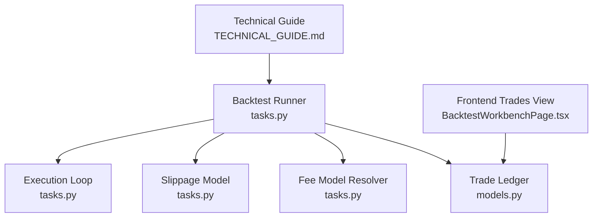
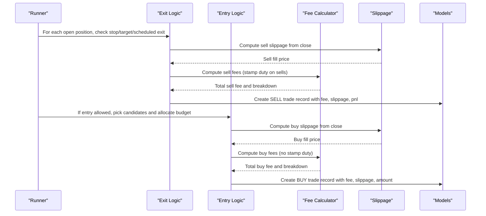
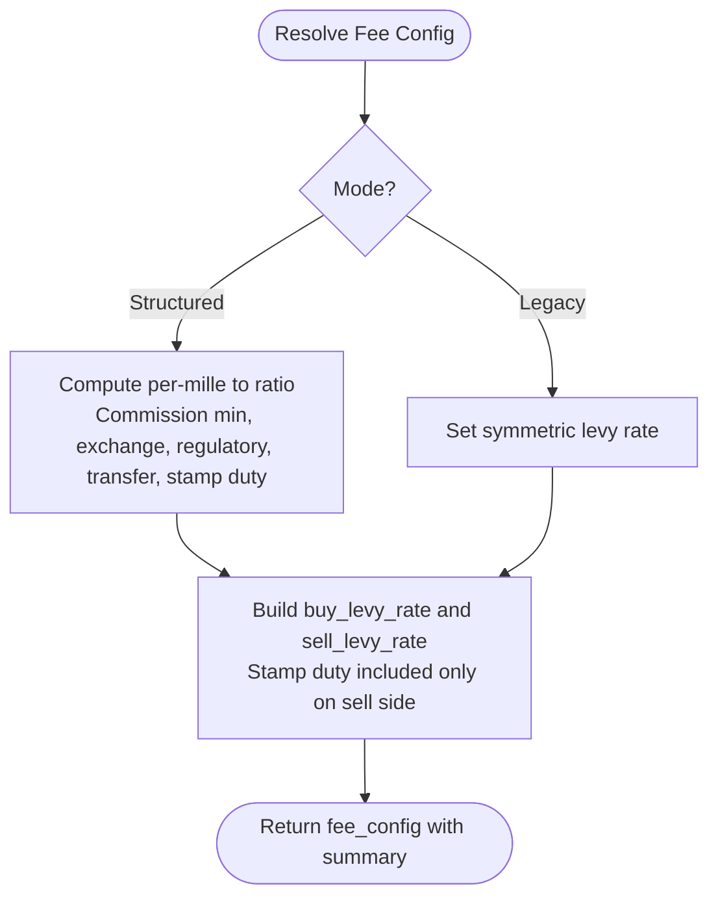
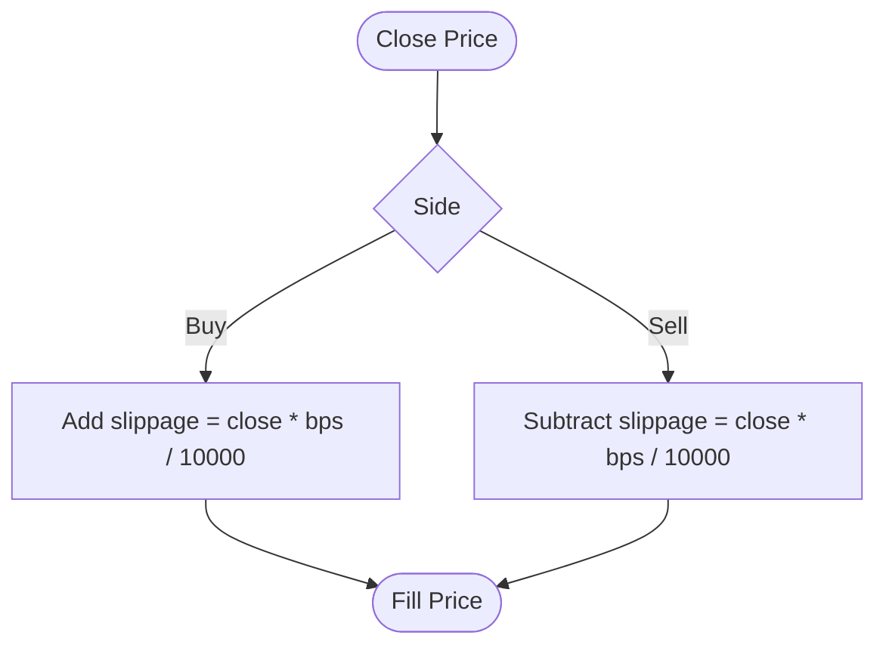
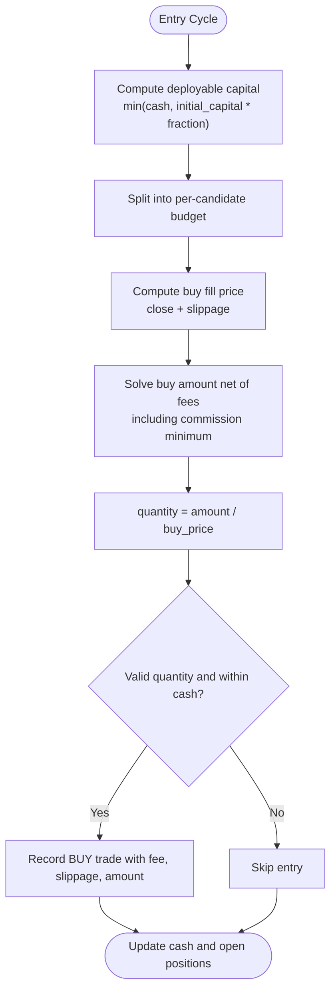
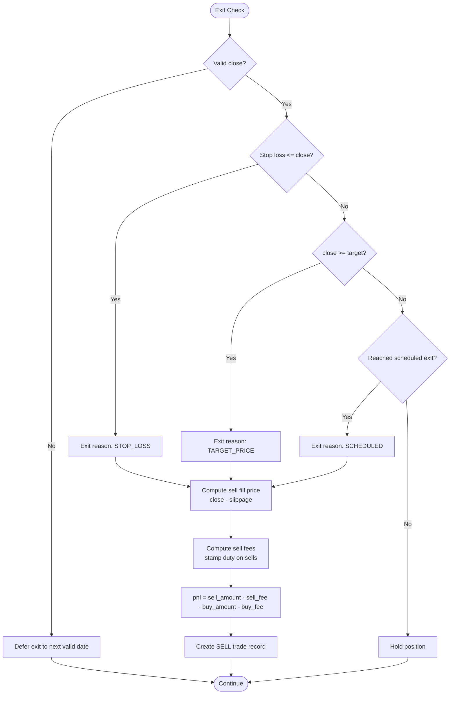
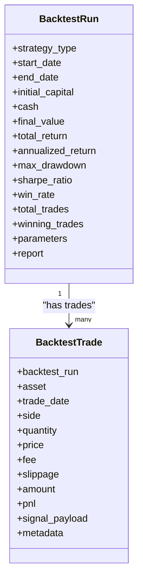
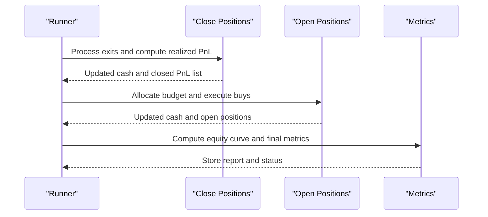
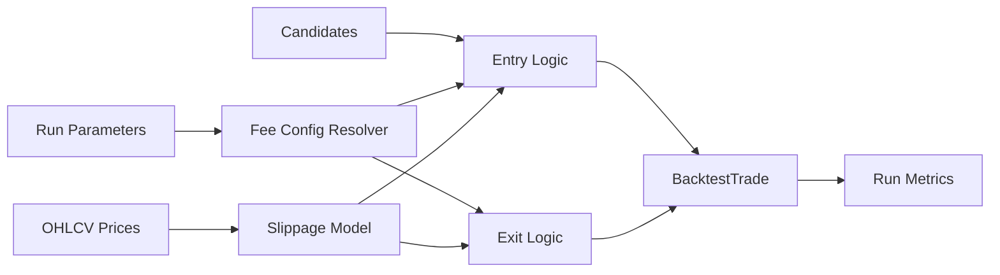

# Cost Modeling & Simulation

<cite>
**Referenced Files in This Document**
- [tasks.py](file://apps/backtest/tasks.py)
- [models.py](file://apps/backtest/models.py)
- [TECHNICAL_GUIDE.md](file://TECHNICAL_GUIDE.md)
- [tests.py](file://apps/backtest/tests.py)
- [BacktestWorkbenchPage.tsx](file://frontend/src/pages/BacktestWorkbenchPage.tsx)
</cite>

## Table of Contents
1. [Introduction](#introduction)
2. [Project Structure](#project-structure)
3. [Core Components](#core-components)
4. [Architecture Overview](#architecture-overview)
5. [Detailed Component Analysis](#detailed-component-analysis)
6. [Dependency Analysis](#dependency-analysis)
7. [Performance Considerations](#performance-considerations)
8. [Troubleshooting Guide](#troubleshooting-guide)
9. [Conclusion](#conclusion)
10. [Appendices](#appendices)

## Introduction
This document explains the realistic cost modeling system used during backtesting to simulate actual trading costs, including stamp duty, commission fees, and slippage. It details how each trade leg is priced and charged, how these costs affect portfolio performance and PnL, and how to customize parameters for different markets and broker fee structures. The system models market impact via a configurable per-trade slippage model and enforces asymmetric fees that reflect real-world turnover costs.

## Project Structure
The cost modeling logic lives primarily in the backtest execution engine and related persistence:
- Backtest execution and cost application are implemented in the backtest tasks module.
- Trade records and run metadata are persisted via the backtest models.
- The technical guide documents the cost formulas and reporting semantics.
- Tests validate default CN A-share fee behavior and fee breakdowns.
- The frontend displays per-trade fee, amount, and PnL for inspection.

**Diagram sources**
- [tasks.py:2300-2570](file://apps/backtest/tasks.py#L2300-L2570)
- [models.py:120-167](file://apps/backtest/models.py#L120-L167)
- [TECHNICAL_GUIDE.md:750-781](file://TECHNICAL_GUIDE.md#L750-L781)
- [BacktestWorkbenchPage.tsx:1256-1286](file://frontend/src/pages/BacktestWorkbenchPage.tsx#L1256-L1286)

**Section sources**
- [tasks.py:2300-2570](file://apps/backtest/tasks.py#L2300-L2570)
- [models.py:120-167](file://apps/backtest/models.py#L120-L167)
- [TECHNICAL_GUIDE.md:750-781](file://TECHNICAL_GUIDE.md#L750-L781)
- [BacktestWorkbenchPage.tsx:1256-1286](file://frontend/src/pages/BacktestWorkbenchPage.tsx#L1256-L1286)

## Core Components
- Fee configuration resolver: Selects between structured CN A-share defaults or legacy symmetric flat fee mode; validates mutually exclusive parameters and builds component rates.
- Trade fee calculator: Computes per-leg fees (commission with minimum, exchange/regulatory/transfer fees, and stamp duty on sells only).
- Slippage model: Applies basis-point slippage to buy/sell fills based on daily close prices.
- Execution loop: Opens positions with budget-aware sizing net of fees, closes positions with stop/target/scheduled exits, and records trades with detailed fee breakdowns and realized PnL.
- Persistence: Stores each trade leg with price, quantity, fee, slippage, amount, and PnL; stores run-level metrics and report metadata.

**Section sources**
- [tasks.py:338-503](file://apps/backtest/tasks.py#L338-L503)
- [tasks.py:1920-2113](file://apps/backtest/tasks.py#L1920-L2113)
- [models.py:120-167](file://apps/backtest/models.py#L120-L167)
- [TECHNICAL_GUIDE.md:750-781](file://TECHNICAL_GUIDE.md#L750-L781)

## Architecture Overview
The backtest runner orchestrates candidate selection, position management, and cost application per trading day. Each day:
- Close any positions due to exit triggers or scheduled horizon.
- If entry conditions allow, select candidates and open positions using budget allocation net of buy-side fees.
- Record every trade leg with slippage-adjusted fill price, computed fees, and PnL at close.
- Persist chunked state to support long runs and resumability.

**Diagram sources**
- [tasks.py:1920-2113](file://apps/backtest/tasks.py#L1920-L2113)
- [tasks.py:2300-2570](file://apps/backtest/tasks.py#L2300-L2570)
- [models.py:120-167](file://apps/backtest/models.py#L120-L167)

## Detailed Component Analysis

### Fee Configuration and Breakdown
- Two modes:
  - Structured CN A-share defaults: commission with minimum, exchange/regulatory/transfer fees, and stamp duty on sells only. All rates are configurable via per-mille parameters.
  - Legacy flat fee: single symmetric rate applied to both sides.
- Validation prevents mixing legacy and structured parameters.
- Breakdown includes per-component fees and total fee per leg.

**Diagram sources**
- [tasks.py:338-447](file://apps/backtest/tasks.py#L338-L447)

**Section sources**
- [tasks.py:338-447](file://apps/backtest/tasks.py#L338-L447)
- [TECHNICAL_GUIDE.md:750-781](file://TECHNICAL_GUIDE.md#L750-L781)

### Slippage Model
- Slippage is modeled as a percentage of the daily close price expressed in basis points.
- Buy fill adds slippage; sell fill subtracts slippage.
- Default slippage is configurable per run; tests demonstrate zero slippage scenarios.

**Diagram sources**
- [TECHNICAL_GUIDE.md:750-755](file://TECHNICAL_GUIDE.md#L750-L755)
- [tasks.py:2065-2067](file://apps/backtest/tasks.py#L2065-L2067)
- [tasks.py:1967-1969](file://apps/backtest/tasks.py#L1967-L1969)

**Section sources**
- [TECHNICAL_GUIDE.md:750-755](file://TECHNICAL_GUIDE.md#L750-L755)
- [tasks.py:2065-2067](file://apps/backtest/tasks.py#L2065-L2067)
- [tasks.py:1967-1969](file://apps/backtest/tasks.py#L1967-L1969)
- [tests.py:1230-1267](file://apps/backtest/tests.py#L1230-L1267)

### Position Entry and Budgeting Net of Fees
- Deployable capital per entry cycle is capped by initial capital times a configured fraction and current cash.
- Allocation is split evenly across selected candidates.
- Buy amount is solved against the allocation budget after accounting for buy-side fees, including the minimum-commission branch when it binds.
- Quantity is derived from buy amount divided by slippage-adjusted buy price; entries are skipped if quantity is non-positive or total cost exceeds available cash.

**Diagram sources**
- [tasks.py:2042-2113](file://apps/backtest/tasks.py#L2042-L2113)
- [tasks.py:485-503](file://apps/backtest/tasks.py#L485-L503)

**Section sources**
- [tasks.py:2042-2113](file://apps/backtest/tasks.py#L2042-L2113)
- [tasks.py:485-503](file://apps/backtest/tasks.py#L485-L503)

### Position Exit and Realized PnL
- Exit precedence uses raw daily close for trigger checks:
  - Stop-loss first, then target price, then scheduled exit date.
  - Missing or non-positive close defers exit to next valid date.
- Sell fill applies slippage subtraction; sell fees include stamp duty on sells only.
- Realized PnL equals sell proceeds minus sell fees minus original buy amount and buy fees.

**Diagram sources**
- [tasks.py:1920-1996](file://apps/backtest/tasks.py#L1920-L1996)
- [TECHNICAL_GUIDE.md:740-781](file://TECHNICAL_GUIDE.md#L740-L781)

**Section sources**
- [tasks.py:1920-1996](file://apps/backtest/tasks.py#L1920-L1996)
- [TECHNICAL_GUIDE.md:740-781](file://TECHNICAL_GUIDE.md#L740-L781)

### Data Model for Trades and Runs
- BacktestRun stores strategy type, dates, capital, metrics, parameters, and report.
- BacktestTrade stores each leg with asset, date, side, quantity, price, fee, slippage, amount, PnL, signal payload, and metadata including fee breakdown and model references.

**Diagram sources**
- [models.py:24-117](file://apps/backtest/models.py#L24-L117)
- [models.py:120-167](file://apps/backtest/models.py#L120-L167)

**Section sources**
- [models.py:24-117](file://apps/backtest/models.py#L24-L117)
- [models.py:120-167](file://apps/backtest/models.py#L120-L167)

### Integration With Execution Engine and PnL
- The runner executes in chunks, persisting runtime state to resume safely.
- Each day, it closes positions first (updating cash and realized PnL), then opens new positions (deducting cash for buys and fees).
- Final metrics include total return, annualized return, max drawdown, Sharpe ratio, win rate, and counts of closed/winning trades.

**Diagram sources**
- [tasks.py:2300-2570](file://apps/backtest/tasks.py#L2300-L2570)
- [tasks.py:1920-2113](file://apps/backtest/tasks.py#L1920-L2113)

**Section sources**
- [tasks.py:2300-2570](file://apps/backtest/tasks.py#L2300-L2570)

## Dependency Analysis
- Fee resolution depends on run parameters and defaults; it produces a structured config consumed by both entry and exit paths.
- Slippage depends on daily OHLCV data and configured basis points.
- Candidate selection and trade decisions feed into entry logic but do not alter cost calculations directly.
- Persistence depends on Django ORM models for runs and trades.

**Diagram sources**
- [tasks.py:338-503](file://apps/backtest/tasks.py#L338-L503)
- [tasks.py:1920-2113](file://apps/backtest/tasks.py#L1920-L2113)
- [models.py:120-167](file://apps/backtest/models.py#L120-L167)

**Section sources**
- [tasks.py:338-503](file://apps/backtest/tasks.py#L338-L503)
- [tasks.py:1920-2113](file://apps/backtest/tasks.py#L1920-L2113)
- [models.py:120-167](file://apps/backtest/models.py#L120-L167)

## Performance Considerations
- Chunked execution and process-level caches reduce memory and improve throughput for long runs.
- Batch prediction and matrix caching optimize candidate generation; while not part of cost calculation, they reduce overall runtime overhead.
- Decimal arithmetic ensures precise fee and slippage computations without floating-point drift.
- Avoid unnecessary re-resolution of fee configs and price maps by leveraging cached structures within a run.

[No sources needed since this section provides general guidance]

## Troubleshooting Guide
- Asymmetric stamp duty: Ensure stamp duty is applied only on sells; verify fee breakdowns in trade metadata.
- Minimum commission binding: When small trade sizes hit the minimum commission, budgeting adjusts accordingly; confirm expected buy amounts and fees.
- Missing close prices: Exits defer to next valid date; inspect exit reasons and retry behavior.
- Zero slippage scenarios: Tests demonstrate behavior with slippage disabled; validate fee-only impacts.

**Section sources**
- [tasks.py:449-503](file://apps/backtest/tasks.py#L449-L503)
- [tasks.py:1920-1996](file://apps/backtest/tasks.py#L1920-L1996)
- [tests.py:1230-1267](file://apps/backtest/tests.py#L1230-L1267)

## Conclusion
The backtest cost modeling system accurately simulates realistic trading costs through structured fee components, asymmetric stamp duty, and configurable slippage. Entries are sized net of fees to respect budgets, and exits apply conservative triggers with proper fee deductions. The result is a faithful representation of turnover costs and their impact on portfolio performance and PnL, enabling robust strategy evaluation and customization for diverse market environments and broker fee structures.

[No sources needed since this section summarizes without analyzing specific files]

## Appendices

### Customizing Cost Parameters
- Use structured parameters to adjust commission rate and minimum, exchange/regulatory/transfer fees, and stamp duty. These map to per-mille values converted to ratios internally.
- Switch to legacy flat fee mode by providing a single fee rate; this cannot be combined with structured parameters.
- Adjust slippage basis points per run to reflect liquidity constraints and expected market impact.

**Section sources**
- [tasks.py:338-447](file://apps/backtest/tasks.py#L338-L447)
- [TECHNICAL_GUIDE.md:750-781](file://TECHNICAL_GUIDE.md#L750-L781)

### Example Cost Scenarios
- Small trade with minimum commission binding:
  - Expected outcome: Commission floor dominates; buy amount solved net of fees; stamp duty absent on buys.
  - Reference: Test assertions for default CN A-share fees and fee breakdowns.
- Zero slippage scenario:
  - Expected outcome: Fill equals close; fees still apply; PnL reflects fee asymmetry.
  - Reference: Test case with slippage set to zero.
- Larger trade with stamp duty on sells:
  - Expected outcome: Sell-side total fee higher than buy-side due to stamp duty; realized PnL reduced accordingly.
  - Reference: Assertions comparing buy vs sell fees and stamp duty presence.

**Section sources**
- [tests.py:1230-1267](file://apps/backtest/tests.py#L1230-L1267)
- [TECHNICAL_GUIDE.md:750-781](file://TECHNICAL_GUIDE.md#L750-L781)

### Viewing Costs in the Frontend
- The workbench displays per-trade fee, amount, and PnL columns, enabling quick verification of cost application and outcomes.

**Section sources**
- [BacktestWorkbenchPage.tsx:1256-1286](file://frontend/src/pages/BacktestWorkbenchPage.tsx#L1256-L1286)