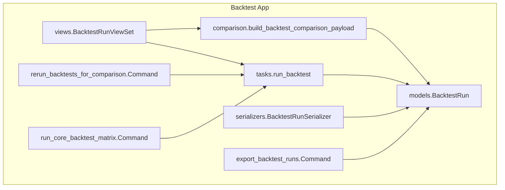
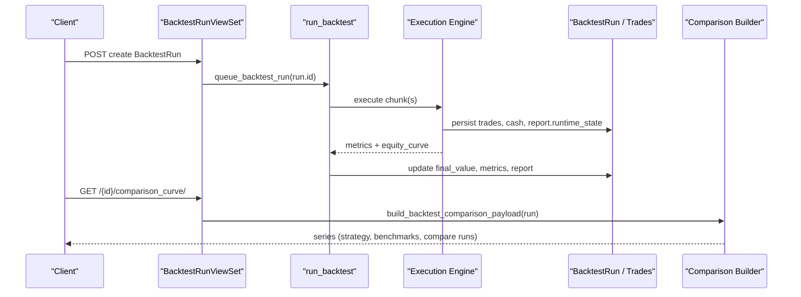
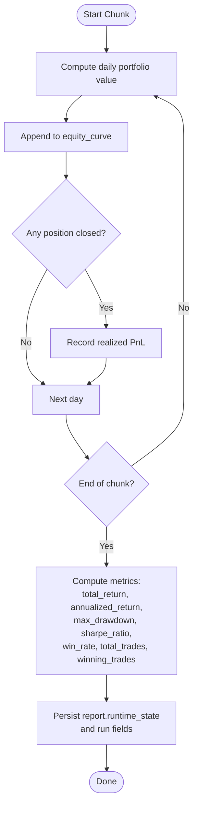
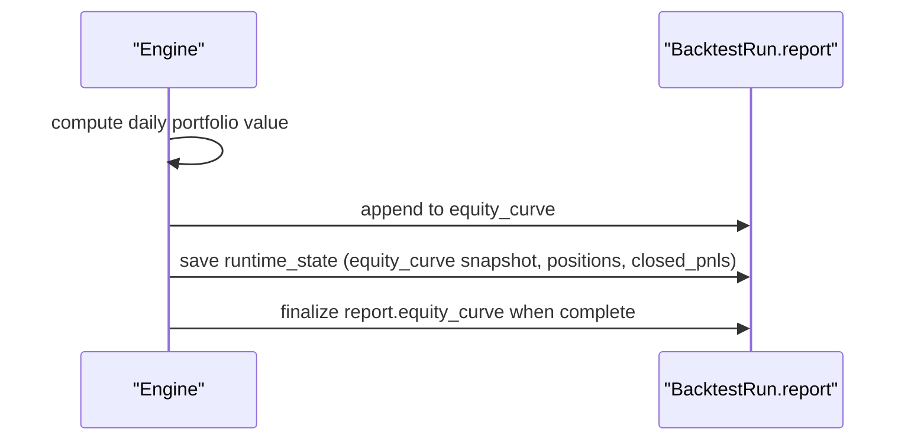
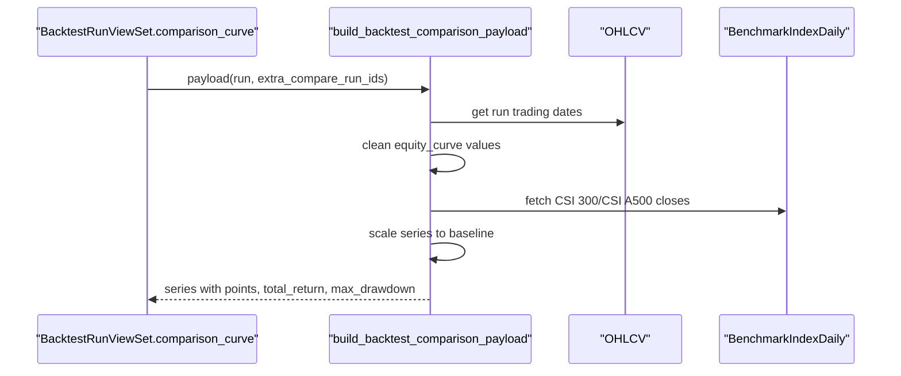
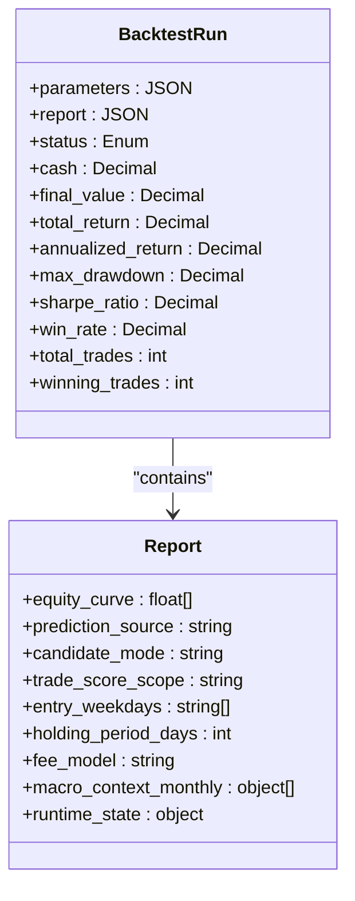
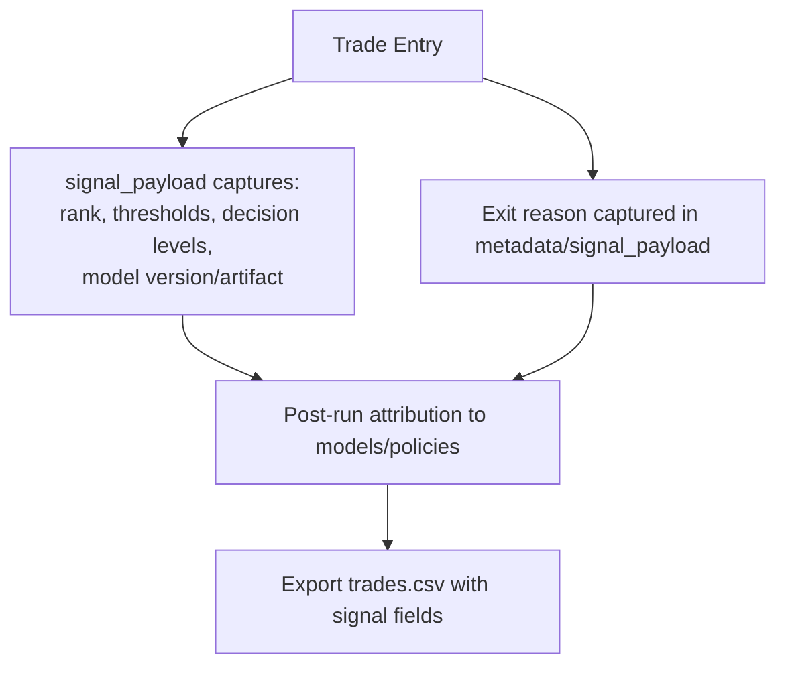
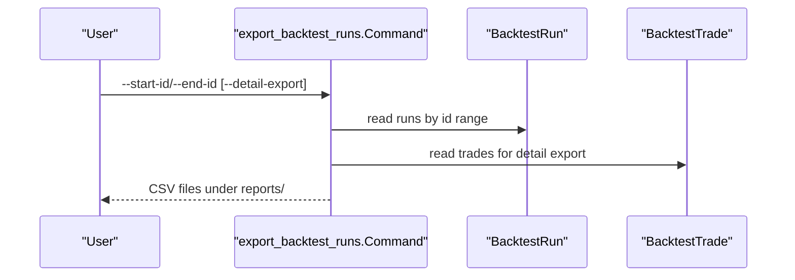
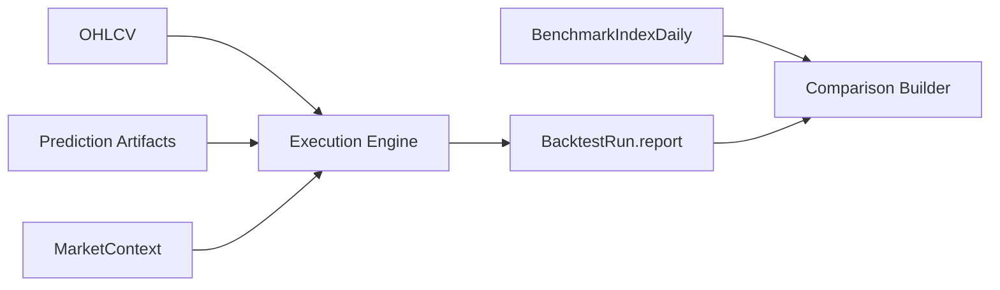

# Performance Metrics & Analysis

<cite>
**Referenced Files in This Document**
- [models.py](file://apps/backtest/models.py)
- [tasks.py](file://apps/backtest/tasks.py)
- [comparison.py](file://apps/backtest/comparison.py)
- [serializers.py](file://apps/backtest/serializers.py)
- [views.py](file://apps/backtest/views.py)
- [export_backtest_runs.py](file://apps/backtest/management/commands/export_backtest_runs.py)
- [rerun_backtests_for_comparison.py](file://apps/backtest/management/commands/rerun_backtests_for_comparison.py)
- [run_core_backtest_matrix.py](file://apps/backtest/management/commands/run_core_backtest_matrix.py)
- [TECHNICAL_GUIDE.md](file://TECHNICAL_GUIDE.md)
</cite>

## Table of Contents
1. [Introduction](#introduction)
2. [Project Structure](#project-structure)
3. [Core Components](#core-components)
4. [Architecture Overview](#architecture-overview)
5. [Detailed Component Analysis](#detailed-component-analysis)
6. [Dependency Analysis](#dependency-analysis)
7. [Performance Considerations](#performance-considerations)
8. [Troubleshooting Guide](#troubleshooting-guide)
9. [Conclusion](#conclusion)
10. [Appendices](#appendices)

## Introduction
This document explains the performance metrics calculation and analysis framework used by the backtesting system. It covers how key indicators are computed (total return, annualized return, maximum drawdown, Sharpe ratio, win rate, and trade statistics), how benchmark curves are built for comparison, how equity curves and attribution data are stored in the report JSON, and how results can be exported and analyzed across strategy configurations.

## Project Structure
The backtesting module is centered around:
- A run model that stores configuration, lifecycle state, and a report JSON containing equity curves, metadata, and resume state.
- An execution engine that computes trades, equity curves, and metrics per chunk to support long-running resumable runs.
- A comparison utility that builds normalized series against official benchmarks and optional compare runs.
- API views and serializers that expose lifecycle control, trade ledgers, and comparison payloads.
- Management commands to orchestrate matrix runs, export results, and rerun comparisons.

**Diagram sources**
- [views.py:75-208](file://apps/backtest/views.py#L75-L208)
- [tasks.py:1-37](file://apps/backtest/tasks.py#L1-L37)
- [comparison.py:1-11](file://apps/backtest/comparison.py#L1-L11)
- [models.py:24-117](file://apps/backtest/models.py#L24-L117)
- [serializers.py:48-84](file://apps/backtest/serializers.py#L48-L84)
- [export_backtest_runs.py:132-193](file://apps/backtest/management/commands/export_backtest_runs.py#L132-L193)
- [rerun_backtests_for_comparison.py:78-157](file://apps/backtest/management/commands/rerun_backtests_for_comparison.py#L78-L157)
- [run_core_backtest_matrix.py:103-200](file://apps/backtest/management/commands/run_core_backtest_matrix.py#L103-L200)

**Section sources**
- [models.py:24-117](file://apps/backtest/models.py#L24-L117)
- [tasks.py:1-37](file://apps/backtest/tasks.py#L1-L37)
- [comparison.py:1-11](file://apps/backtest/comparison.py#L1-L11)
- [views.py:75-208](file://apps/backtest/views.py#L75-L208)
- [serializers.py:48-84](file://apps/backtest/serializers.py#L48-L84)
- [export_backtest_runs.py:132-193](file://apps/backtest/management/commands/export_backtest_runs.py#L132-L193)
- [rerun_backtests_for_comparison.py:78-157](file://apps/backtest/management/commands/rerun_backtests_for_comparison.py#L78-L157)
- [run_core_backtest_matrix.py:103-200](file://apps/backtest/management/commands/run_core_backtest_matrix.py#L103-L200)

## Core Components
- BacktestRun stores top-level metrics and a report JSON with equity curve, benchmark references, runtime state, and metadata.
- Execution engine computes daily portfolio value, closes positions, records trades, and calculates metrics at completion or between chunks.
- Comparison utility normalizes strategy and benchmark curves onto the run’s trading dates and computes per-series total return and drawdowns.
- API exposes lifecycle actions and a comparison endpoint; serializers validate parameters and surface task health.
- Export commands produce CSV summaries, trade ledgers, macro context, and comparison deltas.

**Section sources**
- [models.py:24-117](file://apps/backtest/models.py#L24-L117)
- [tasks.py:2447-2553](file://apps/backtest/tasks.py#L2447-L2553)
- [comparison.py:77-139](file://apps/backtest/comparison.py#L77-L139)
- [views.py:198-208](file://apps/backtest/views.py#L198-L208)
- [serializers.py:86-299](file://apps/backtest/serializers.py#L86-L299)
- [export_backtest_runs.py:230-268](file://apps/backtest/management/commands/export_backtest_runs.py#L230-L268)

## Architecture Overview
The backtest lifecycle flows from API creation to queued execution, chunked processing, metric computation, and reporting. Comparison curves are generated on demand from stored equity curves and benchmark index history.

**Diagram sources**
- [views.py:90-100](file://apps/backtest/views.py#L90-L100)
- [views.py:198-208](file://apps/backtest/views.py#L198-L208)
- [tasks.py:2447-2553](file://apps/backtest/tasks.py#L2447-L2553)
- [comparison.py:177-244](file://apps/backtest/comparison.py#L177-L244)

## Detailed Component Analysis

### Performance Metrics Calculation
Key metrics are computed from the equity curve and realized PnLs:
- Total return: derived from final mark-to-market versus initial capital.
- Annualized return: based on calendar days over the run window.
- Maximum drawdown: peak-to-trough decline over the equity curve.
- Sharpe ratio: annualized using daily returns and population standard deviation over 252 trading days.
- Trade statistics: total_trades counts closed positions; winning_trades counts those with positive realized PnL; win_rate is their ratio.

**Diagram sources**
- [tasks.py:2447-2466](file://apps/backtest/tasks.py#L2447-L2466)
- [tasks.py:2501-2522](file://apps/backtest/tasks.py#L2501-L2522)
- [tasks.py:2124-2147](file://apps/backtest/tasks.py#L2124-L2147)

**Section sources**
- [tasks.py:2501-2522](file://apps/backtest/tasks.py#L2501-L2522)
- [tasks.py:2124-2147](file://apps/backtest/tasks.py#L2124-L2147)
- [TECHNICAL_GUIDE.md:783-806](file://TECHNICAL_GUIDE.md#L783-L806)

### Equity Curve Generation
- The engine appends daily portfolio value to an equity_curve list during execution.
- On chunk boundaries, it persists partial state including the current equity curve snapshot, open positions, and closed PnLs to support resumption.
- At completion, the full equity curve is serialized into the report JSON for downstream comparison and export.

**Diagram sources**
- [tasks.py:2447-2466](file://apps/backtest/tasks.py#L2447-L2466)
- [tasks.py:2524-2553](file://apps/backtest/tasks.py#L2524-L2553)

**Section sources**
- [tasks.py:2447-2466](file://apps/backtest/tasks.py#L2447-L2466)
- [tasks.py:2524-2553](file://apps/backtest/tasks.py#L2524-L2553)

### Benchmark Curve Calculation and Comparison Framework
- The comparison builder reads the run’s equity curve and aligns it to the run’s trading dates.
- It fetches CSI 300 and CSI A500 daily close prices for the same date range, scales both series to the run’s starting value, and computes per-series total return and drawdowns.
- Optional compare runs can be included by specifying a target run ID and/or extra compare IDs via query parameters.

**Diagram sources**
- [views.py:198-208](file://apps/backtest/views.py#L198-L208)
- [comparison.py:32-38](file://apps/backtest/comparison.py#L32-L38)
- [comparison.py:77-139](file://apps/backtest/comparison.py#L77-L139)
- [comparison.py:177-244](file://apps/backtest/comparison.py#L177-L244)

**Section sources**
- [comparison.py:77-139](file://apps/backtest/comparison.py#L77-L139)
- [comparison.py:177-244](file://apps/backtest/comparison.py#L177-L244)
- [views.py:198-208](file://apps/backtest/views.py#L198-L208)

### Report JSON Fields and Runtime State
- The report contains equity_curve, strategy metadata, fee model, macro context monthly snapshots, and model references.
- For chunked runs, runtime_state holds progress bookkeeping (current index, cash, equity curve snapshot, closed PnLs, open positions, macro monthly report, LightGBM runtime metrics).
- These fields enable resumable execution and post-run analysis without re-running the simulation.

**Diagram sources**
- [models.py:24-117](file://apps/backtest/models.py#L24-L117)
- [tasks.py:2447-2466](file://apps/backtest/tasks.py#L2447-L2466)
- [tasks.py:2524-2553](file://apps/backtest/tasks.py#L2524-L2553)
- [TECHNICAL_GUIDE.md:783-789](file://TECHNICAL_GUIDE.md#L783-L789)

**Section sources**
- [models.py:24-117](file://apps/backtest/models.py#L24-L117)
- [tasks.py:2447-2466](file://apps/backtest/tasks.py#L2447-L2466)
- [tasks.py:2524-2553](file://apps/backtest/tasks.py#L2524-L2553)
- [TECHNICAL_GUIDE.md:783-789](file://TECHNICAL_GUIDE.md#L783-L789)

### Performance Attribution Methods
- Each trade carries a signal_payload that includes candidate rank, threshold pass/fail, trade-decision levels, and model provenance. This enables post-hoc attribution of entries to specific models and policies.
- The export command writes these fields to trades.csv, making individual entries explainable after the fact.
- Macro context monthly snapshots in the report provide attribution of performance to macro phases when macro-aware ranking is enabled.

**Diagram sources**
- [models.py:120-168](file://apps/backtest/models.py#L120-L168)
- [export_backtest_runs.py:270-324](file://apps/backtest/management/commands/export_backtest_runs.py#L270-L324)
- [tasks.py:2524-2553](file://apps/backtest/tasks.py#L2524-L2553)

**Section sources**
- [models.py:120-168](file://apps/backtest/models.py#L120-L168)
- [export_backtest_runs.py:270-324](file://apps/backtest/management/commands/export_backtest_runs.py#L270-L324)
- [tasks.py:2524-2553](file://apps/backtest/tasks.py#L2524-L2553)

### Export Functionality and Reporting Capabilities
- Default export produces run_summary.csv, run_config_results.csv, and model_references.csv for quick matrix review.
- Detail export adds trades.csv, macro_context_monthly.csv, and comparison CSVs with delta metrics between paired runs.
- The rerun command clones existing runs with deep-copied parameters, sets compare_backtest_run_id, and optionally queues or executes them inline for apples-to-apples comparisons.

**Diagram sources**
- [export_backtest_runs.py:132-193](file://apps/backtest/management/commands/export_backtest_runs.py#L132-L193)
- [export_backtest_runs.py:230-268](file://apps/backtest/management/commands/export_backtest_runs.py#L230-L268)
- [export_backtest_runs.py:270-324](file://apps/backtest/management/commands/export_backtest_runs.py#L270-L324)
- [export_backtest_runs.py:494-530](file://apps/backtest/management/commands/export_backtest_runs.py#L494-L530)

**Section sources**
- [export_backtest_runs.py:132-193](file://apps/backtest/management/commands/export_backtest_runs.py#L132-L193)
- [export_backtest_runs.py:230-268](file://apps/backtest/management/commands/export_backtest_runs.py#L230-L268)
- [export_backtest_runs.py:270-324](file://apps/backtest/management/commands/export_backtest_runs.py#L270-L324)
- [export_backtest_runs.py:494-530](file://apps/backtest/management/commands/export_backtest_runs.py#L494-L530)
- [rerun_backtests_for_comparison.py:78-157](file://apps/backtest/management/commands/rerun_backtests_for_comparison.py#L78-L157)

## Dependency Analysis
- The execution engine depends on market data (OHLCV), benchmark indices, prediction artifacts, and macro context to generate signals and compute portfolio value.
- Comparison relies on stored equity curves and benchmark index history; it does not store benchmark curves on the run but derives them on demand.
- Serializers enforce parameter contracts and ensure consistent strategy surfaces across runs.

**Diagram sources**
- [tasks.py:520-544](file://apps/backtest/tasks.py#L520-L544)
- [comparison.py:112-139](file://apps/backtest/comparison.py#L112-L139)
- [tasks.py:567-595](file://apps/backtest/tasks.py#L567-L595)

**Section sources**
- [tasks.py:520-544](file://apps/backtest/tasks.py#L520-L544)
- [comparison.py:112-139](file://apps/backtest/comparison.py#L112-L139)
- [tasks.py:567-595](file://apps/backtest/tasks.py#L567-L595)

## Performance Considerations
- Long runs are chunked and resumable; chunk size is configurable and persisted in runtime_state to survive worker restarts and soft time limits.
- Process-level caches (trading dates, price maps, matrix signals) are bounded and shared within a process; they should be cleared between unrelated batches to avoid memory leaks.
- LightGBM inference backend selection (auto, cpu_serial, cpu_batched, windows_gpu) and batch size significantly affect throughput; choose based on environment capabilities.
- Fees are modeled asymmetrically for CN A-shares (stamp duty on sells only); this impacts turnover costs and must be considered when comparing strategies.

[No sources needed since this section provides general guidance]

## Troubleshooting Guide
- If comparison curves are unavailable, ensure the run status is COMPLETED and that an equity curve exists in the report.
- If a run appears stuck, check pending_control_action and task ownership via serializer-provided task_state and has_stale_task_owner flags.
- When exporting, use id ranges rather than filtering by parameters because the strategy surface lives in JSON and is not ORM-queryable.
- For inconsistent comparisons, verify that compare_backtest_run_id references a completed run of the same strategy_type and prediction_source.

**Section sources**
- [comparison.py:194-201](file://apps/backtest/comparison.py#L194-L201)
- [serializers.py:54-65](file://apps/backtest/serializers.py#L54-L65)
- [export_backtest_runs.py:1-21](file://apps/backtest/management/commands/export_backtest_runs.py#L1-L21)
- [serializers.py:265-294](file://apps/backtest/serializers.py#L265-L294)

## Conclusion
The backtesting framework provides robust, resumable execution with precise metric computation and flexible comparison capabilities. Equity curves and benchmark series are aligned for fair evaluation, while detailed attribution and export tools make it straightforward to analyze and compare different strategy configurations.

[No sources needed since this section summarizes without analyzing specific files]

## Appendices

### Interpreting Performance Metrics
- total_return: overall growth relative to initial capital; negative values indicate loss.
- annualized_return: geometric annualization over calendar days; useful for comparing strategies over different horizons.
- max_drawdown: worst peak-to-trough decline; higher values imply greater risk.
- sharpe_ratio: risk-adjusted performance using daily returns and population std dev; higher is better, but sensitive to return distribution.
- win_rate: proportion of closed positions with positive PnL; pair with average PnL per trade to understand profitability drivers.
- total_trades vs trade rows: total_trades counts round trips; do not equate with raw buy/sell row counts.

**Section sources**
- [TECHNICAL_GUIDE.md:793-806](file://TECHNICAL_GUIDE.md#L793-L806)

### Comparing Strategy Configurations
- Use rerun_backtests_for_comparison to clone runs and set compare_backtest_run_id for direct side-by-side evaluation.
- Leverage the comparison_curve endpoint to visualize strategy vs benchmarks and optional compare runs.
- Export comparison CSVs to compute deltas across metrics and identify which configuration changes improved performance.

**Section sources**
- [rerun_backtests_for_comparison.py:101-157](file://apps/backtest/management/commands/rerun_backtests_for_comparison.py#L101-L157)
- [views.py:198-208](file://apps/backtest/views.py#L198-L208)
- [export_backtest_runs.py:494-530](file://apps/backtest/management/commands/export_backtest_runs.py#L494-L530)