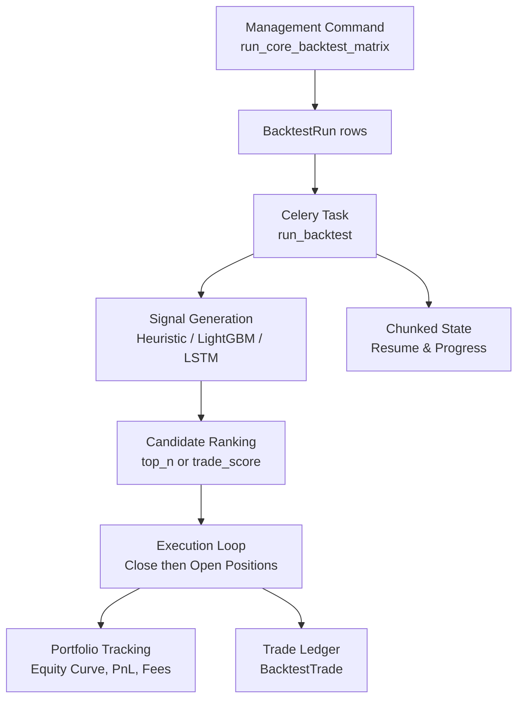
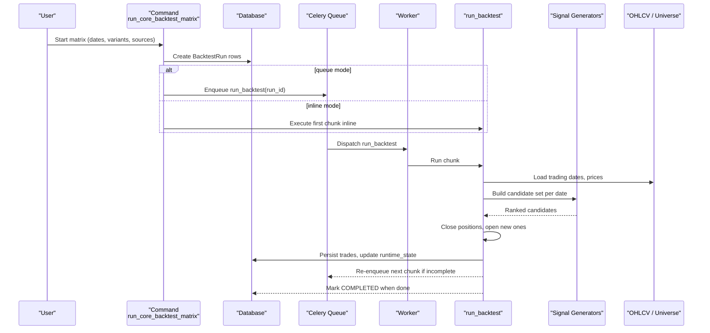
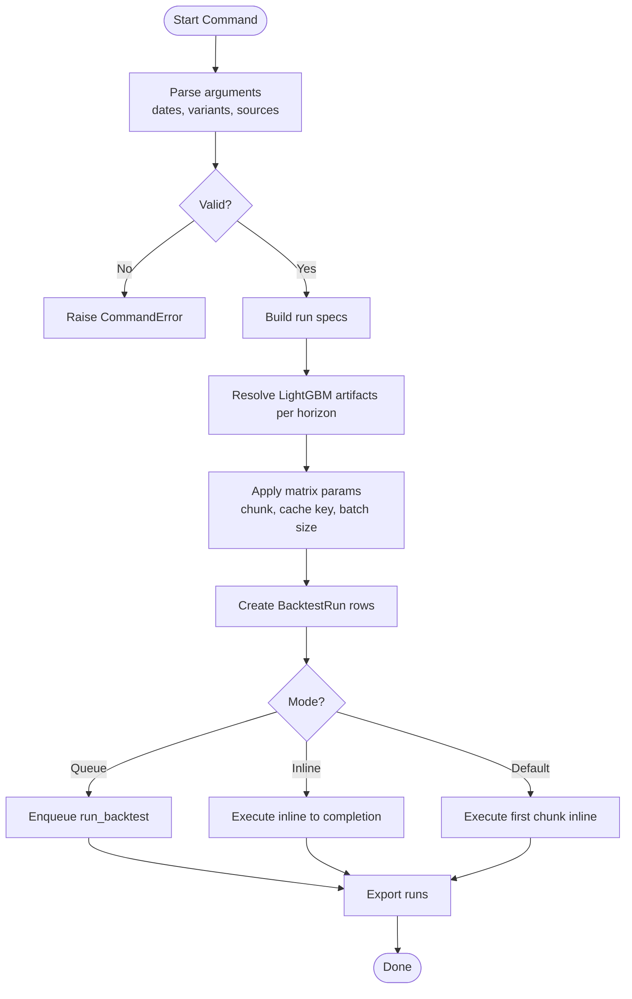
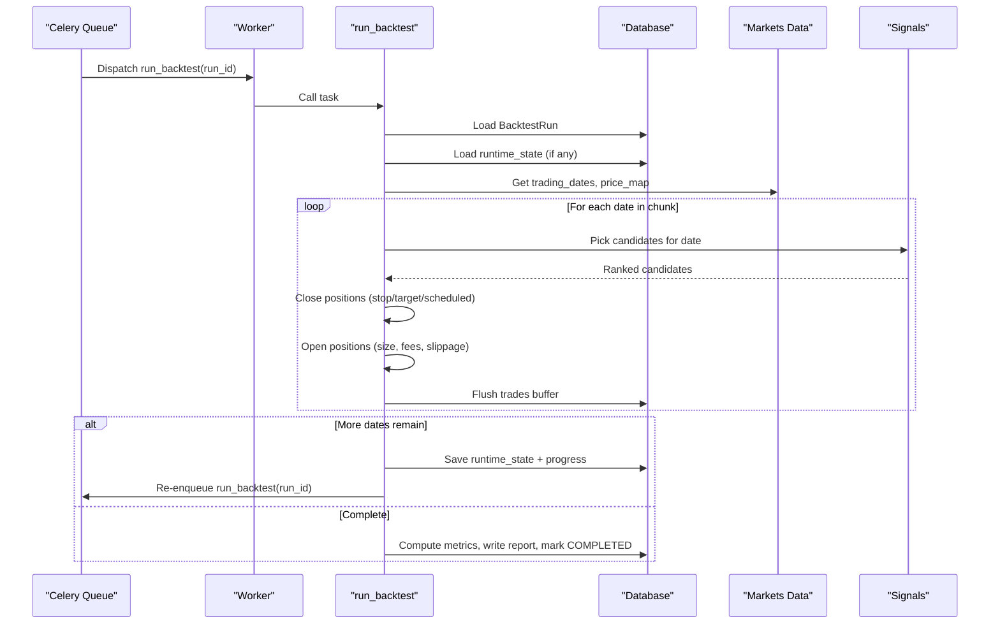
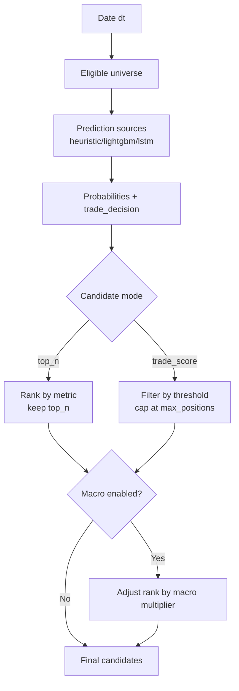
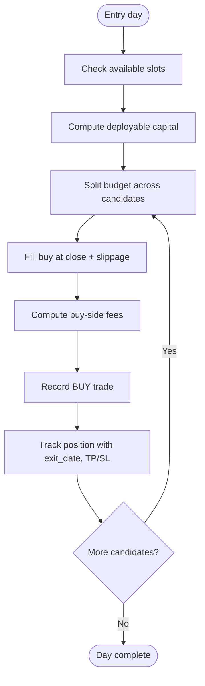
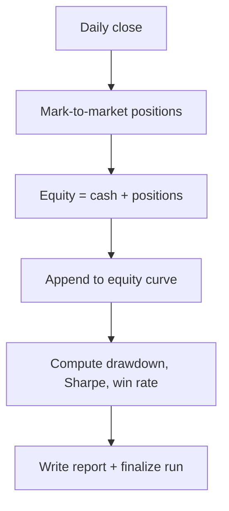
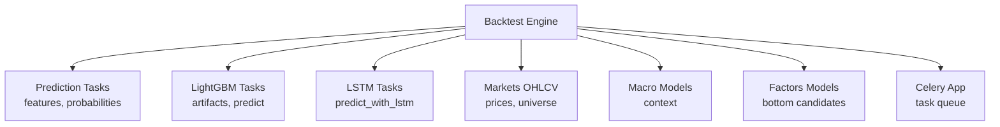

# Strategy Execution Engine

<cite>
**Referenced Files in This Document**
- [run_core_backtest_matrix.py](file://apps/backtest/management/commands/run_core_backtest_matrix.py)
- [tasks.py](file://apps/backtest/tasks.py)
- [models.py](file://apps/backtest/models.py)
- [celery.py](file://config/celery.py)
- [task_health.py](file://apps/backtest/task_health.py)
</cite>

## Table of Contents
1. [Introduction](#introduction)
2. [Project Structure](#project-structure)
3. [Core Components](#core-components)
4. [Architecture Overview](#architecture-overview)
5. [Detailed Component Analysis](#detailed-component-analysis)
6. [Dependency Analysis](#dependency-analysis)
7. [Performance Considerations](#performance-considerations)
8. [Troubleshooting Guide](#troubleshooting-guide)
9. [Conclusion](#conclusion)

## Introduction
This document explains the strategy execution engine that processes trading signals and simulates trades against historical data. It covers:
- How multiple backtest configurations are created and executed via a management command
- The Celery-based parallel execution model for long-running backtests
- How different strategy types interpret prediction signals
- The end-to-end flow from signal generation through position sizing, order execution, and portfolio tracking
- Integration with prediction results and model artifacts
- Error handling, retry mechanisms, and progress tracking for chunked, resumable runs

## Project Structure
The backtest subsystem lives under the `backtest` Django app and integrates with prediction, markets, macro, and factors apps to generate candidates, simulate trades, and persist results.

**Diagram sources**
- [run_core_backtest_matrix.py:103-170](file://apps/backtest/management/commands/run_core_backtest_matrix.py#L103-L170)
- [tasks.py:2299-2577](file://apps/backtest/tasks.py#L2299-L2577)
- [models.py:24-117](file://apps/backtest/models.py#L24-L117)

**Section sources**
- [run_core_backtest_matrix.py:103-170](file://apps/backtest/management/commands/run_core_backtest_matrix.py#L103-L170)
- [tasks.py:2299-2577](file://apps/backtest/tasks.py#L2299-L2577)
- [models.py:24-117](file://apps/backtest/models.py#L24-L117)

## Core Components
- BacktestRun: Stores run configuration, status, metrics, and chunked runtime state for resume.
- BacktestTrade: Records each buy/sell leg with fees, slippage, amounts, and signal provenance.
- Celery task run_backtest: Executes one chunk of a backtest, persists progress, and re-queues itself until complete.
- Management command run_core_backtest_matrix: Builds a matrix of runs across variants, sources, horizons, and profiles; creates all runs upfront; queues or executes inline.

Key responsibilities:
- Signal generation per asset per date using heuristic, LightGBM, or LSTM models
- Candidate selection by top_n or trade_score thresholds
- Position sizing based on capital fraction and fee-aware budgeting
- Order simulation with slippage and asymmetric fees
- Real-time portfolio equity calculation and risk metrics
- Chunked, resumable execution with progress reporting

**Section sources**
- [models.py:24-117](file://apps/backtest/models.py#L24-L117)
- [models.py:120-168](file://apps/backtest/models.py#L120-L168)
- [tasks.py:2299-2577](file://apps/backtest/tasks.py#L2299-L2577)
- [run_core_backtest_matrix.py:103-170](file://apps/backtest/management/commands/run_core_backtest_matrix.py#L103-L170)

## Architecture Overview
The execution architecture is built around a chunked, resumable Celery task that processes trading dates in configurable chunks. A management command prepares many runs and either queues them or executes them inline while preserving process-level caches for performance.

**Diagram sources**
- [run_core_backtest_matrix.py:316-461](file://apps/backtest/management/commands/run_core_backtest_matrix.py#L316-L461)
- [tasks.py:2299-2577](file://apps/backtest/tasks.py#L2299-L2577)
- [tasks.py:520-544](file://apps/backtest/tasks.py#L520-L544)

## Detailed Component Analysis

### Entry Point: run_core_backtest_matrix
- Purpose: Generate a cross-product of variants, prediction sources, horizons, and profiles; create BacktestRun rows; optionally queue or execute inline.
- Key behaviors:
  - Validates inputs (dates, variants, sources, inference backend).
  - Resolves active LightGBM artifacts per horizon when needed.
  - Applies matrix-wide parameters such as chunk size, cache key, and batch size.
  - Creates runs with strategy type PREDICTION_THRESHOLD and default initial capital.
  - Supports dry-run, output directory export, and manifest creation.
  - Inline execution groups runs by horizon to reuse cached predictions and clears caches between groups.

**Diagram sources**
- [run_core_backtest_matrix.py:103-170](file://apps/backtest/management/commands/run_core_backtest_matrix.py#L103-L170)
- [run_core_backtest_matrix.py:316-461](file://apps/backtest/management/commands/run_core_backtest_matrix.py#L316-L461)

**Section sources**
- [run_core_backtest_matrix.py:103-170](file://apps/backtest/management/commands/run_core_backtest_matrix.py#L103-L170)
- [run_core_backtest_matrix.py:316-461](file://apps/backtest/management/commands/run_core_backtest_matrix.py#L316-L461)

### Celery Task: run_backtest
- Purpose: Execute one chunk of a backtest, persist progress, and re-queue continuation until complete.
- Timeouts: Soft time limit protects long runs; hard time limit prevents runaway tasks.
- Resume: Loads runtime_state from report to continue from last completed index.
- Control actions: Pause, restart, delete can be applied between chunks.
- Completion: Computes final metrics (returns, drawdown, Sharpe), writes report, marks COMPLETED.

**Diagram sources**
- [tasks.py:2299-2577](file://apps/backtest/tasks.py#L2299-L2577)
- [tasks.py:520-544](file://apps/backtest/tasks.py#L520-L544)

**Section sources**
- [tasks.py:2299-2577](file://apps/backtest/tasks.py#L2299-L2577)

### Signal Generation and Strategy Types
- Prediction sources:
  - Heuristic: Uses feature snapshots and probability estimation to derive up/flat/down probabilities and optional trade decision fields.
  - LightGBM: Loads artifacts, extracts features, scales, predicts calibrated probabilities, and computes trade decisions.
  - LSTM: Predicts probabilities via LSTM pipeline and derives trade decisions.
- Candidate modes:
  - top_n: Rank by up_probability (or configured metric) and keep top N assets.
  - trade_score: Filter by trade_score_threshold and cap at max_positions; supports independent source or combined heuristic/LightGBM averaging.
- Macro context: Optional multiplier adjusts ranking based on market phase and event tags.

**Diagram sources**
- [tasks.py:837-909](file://apps/backtest/tasks.py#L837-L909)
- [tasks.py:912-989](file://apps/backtest/tasks.py#L912-L989)
- [tasks.py:992-1140](file://apps/backtest/tasks.py#L992-L1140)
- [tasks.py:1672-1827](file://apps/backtest/tasks.py#L1672-L1827)

**Section sources**
- [tasks.py:837-909](file://apps/backtest/tasks.py#L837-L909)
- [tasks.py:912-989](file://apps/backtest/tasks.py#L912-L989)
- [tasks.py:992-1140](file://apps/backtest/tasks.py#L992-L1140)
- [tasks.py:1672-1827](file://apps/backtest/tasks.py#L1672-L1827)

### Position Sizing and Order Execution
- Capital allocation:
  - Deployable capital per entry cycle is min(cash, initial_capital * capital_fraction_per_entry), split evenly across selected candidates.
  - Buy amount solved against budget net of fees, including minimum commission branch.
- Slippage and fills:
  - Buy fill uses close + slippage; sell fill uses close - slippage.
- Exit logic:
  - Stop loss checked first, then target price, then scheduled exit date.
  - Missing or non-positive close defers exit to next valid date; no fabricated prices.
- Fees:
  - Structured CN A-share defaults with stamp duty on sells only; legacy flat fee supported for older experiments.

**Diagram sources**
- [tasks.py:2000-2113](file://apps/backtest/tasks.py#L2000-L2113)
- [tasks.py:1920-1996](file://apps/backtest/tasks.py#L1920-L1996)
- [tasks.py:338-478](file://apps/backtest/tasks.py#L338-L478)

**Section sources**
- [tasks.py:2000-2113](file://apps/backtest/tasks.py#L2000-L2113)
- [tasks.py:1920-1996](file://apps/backtest/tasks.py#L1920-L1996)
- [tasks.py:338-478](file://apps/backtest/tasks.py#L338-L478)

### Portfolio Tracking and Metrics
- Equity curve: Computed daily as cash plus mark-to-market of open positions.
- Risk metrics:
  - Max drawdown computed from equity curve.
  - Sharpe ratio annualized from daily returns.
  - Win rate derived from closed PnL distribution.
- Report: Includes strategy metadata, fee model, model references, and macro monthly summaries.

**Diagram sources**
- [tasks.py:2116-2147](file://apps/backtest/tasks.py#L2116-L2147)
- [tasks.py:2501-2569](file://apps/backtest/tasks.py#L2501-L2569)

**Section sources**
- [tasks.py:2116-2147](file://apps/backtest/tasks.py#L2116-L2147)
- [tasks.py:2501-2569](file://apps/backtest/tasks.py#L2501-L2569)

### Process Caches and Matrix Signal Sharing
- Bounded caches:
  - Trading dates, price maps, and matrix signal surfaces are cached per range or scope to avoid recomputation.
- Matrix scope:
  - When running a matrix, a shared cache key allows runs within the same matrix to reuse prediction surfaces across horizons and policies.
- Cache clearing:
  - Between unrelated batches or horizon groups, caches are cleared to prevent leakage and bound memory.

**Section sources**
- [tasks.py:106-159](file://apps/backtest/tasks.py#L106-L159)
- [tasks.py:233-287](file://apps/backtest/tasks.py#L233-L287)
- [tasks.py:722-834](file://apps/backtest/tasks.py#L722-L834)

### Model Artifacts and Inference Backend Selection
- LightGBM artifacts:
  - Selected by explicit id/version or active artifact per horizon; validated READY status.
- Inference backend:
  - auto/cpu_batched/windows_gpu resolved at runtime; GPU fallback to CPU if unavailable.
- Batched prediction:
  - Batches feature rows, applies scaler, predicts calibrated probabilities, and records runtime metrics.

**Section sources**
- [tasks.py:1382-1453](file://apps/backtest/tasks.py#L1382-L1453)
- [tasks.py:1362-1380](file://apps/backtest/tasks.py#L1362-L1380)
- [tasks.py:1507-1582](file://apps/backtest/tasks.py#L1507-L1582)

## Dependency Analysis
The backtest engine depends on several subsystems:

**Diagram sources**
- [tasks.py:48-69](file://apps/backtest/tasks.py#L48-L69)
- [celery.py:1-17](file://config/celery.py#L1-L17)

**Section sources**
- [tasks.py:48-69](file://apps/backtest/tasks.py#L48-L69)
- [celery.py:1-17](file://config/celery.py#L1-L17)

## Performance Considerations
- Chunked execution: Limits per-task duration and enables resume after worker restarts or timeouts.
- Process-level caches: Reduce repeated queries and model invocations within a process; bounded to control memory.
- Matrix signal sharing: Avoids redundant prediction surface computation across runs in the same matrix.
- Batched LightGBM inference: Improves throughput by batching feature matrices; supports GPU when available.
- Fee modeling: Asymmetric fees reflect real costs; careful budget solving ensures capital constraints respected.

[No sources needed since this section provides general guidance]

## Troubleshooting Guide
Common issues and diagnostics:
- Stale or orphaned tasks:
  - Use task health detection to identify runs whose worker disappeared; distinguishes legitimate queued continuations from truly stale tasks.
- Long-running runs:
  - Check progress in BacktestRun.report.progress; chunk boundaries indicate how far execution has advanced.
- Errors during execution:
  - Exceptions are caught and persisted as error_message; run status transitions to FAILED.
- Control actions:
  - Pause, restart, delete can be requested; they take effect at chunk boundaries to avoid mid-chunk inconsistency.
- Database connectivity:
  - Connection errors trigger retries with connection resets; failures are recorded on the run.

**Section sources**
- [task_health.py:1-95](file://apps/backtest/task_health.py#L1-L95)
- [tasks.py:2223-2296](file://apps/backtest/tasks.py#L2223-L2296)
- [tasks.py:2326-2338](file://apps/backtest/tasks.py#L2326-L2338)
- [tasks.py:2469-2487](file://apps/backtest/tasks.py#L2469-L2487)

## Conclusion
The strategy execution engine provides a robust, scalable framework for backtesting trading strategies across multiple signal sources and candidate selection modes. Its chunked, resumable design ensures reliability over long horizons, while process-level caching and matrix signal sharing optimize performance. Clear separation of concerns—signal generation, candidate ranking, execution, and portfolio tracking—enables flexible experimentation and precise attribution of results to underlying models and parameters.

[No sources needed since this section summarizes without analyzing specific files]