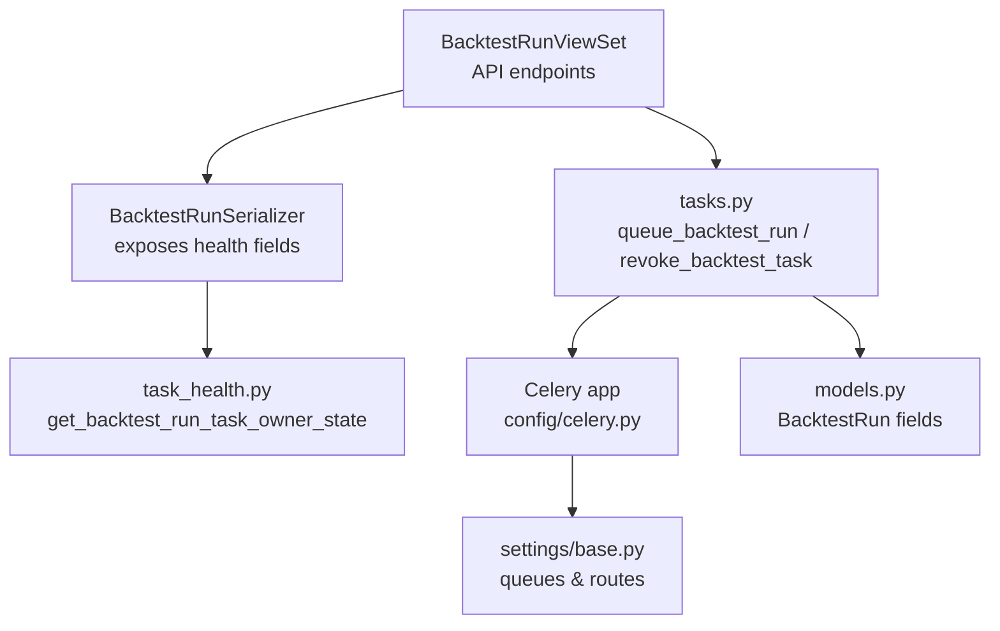
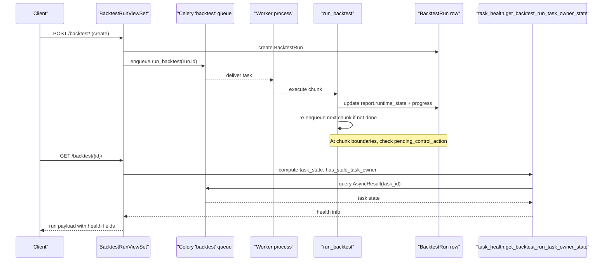
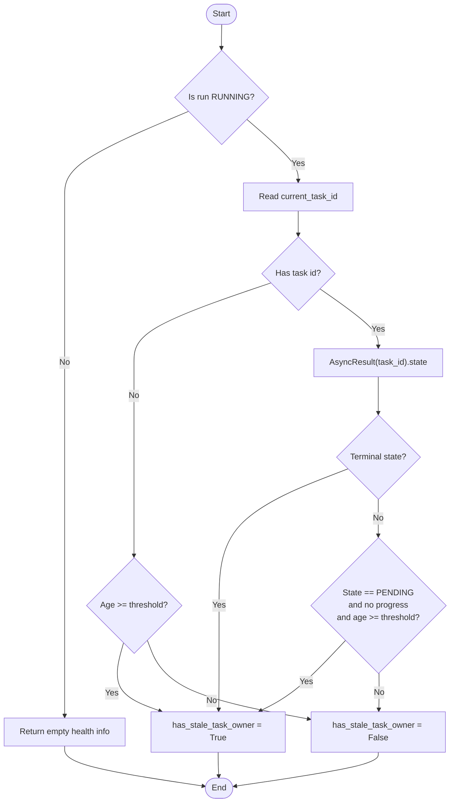
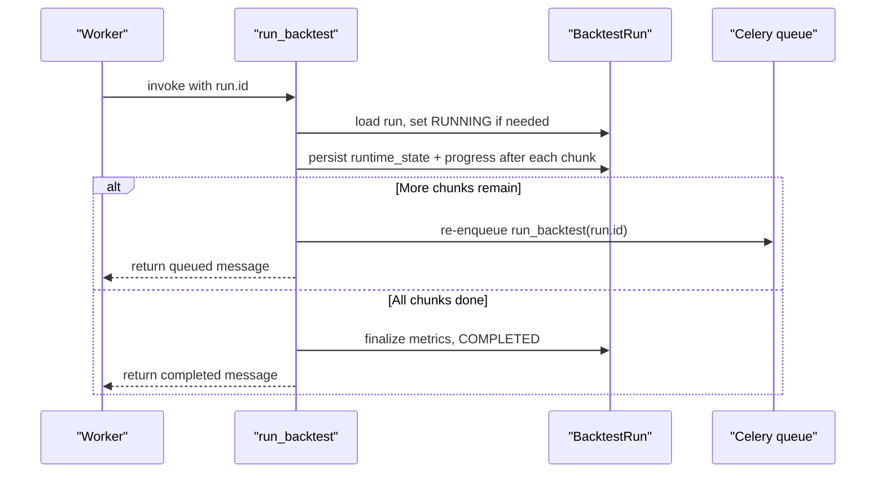
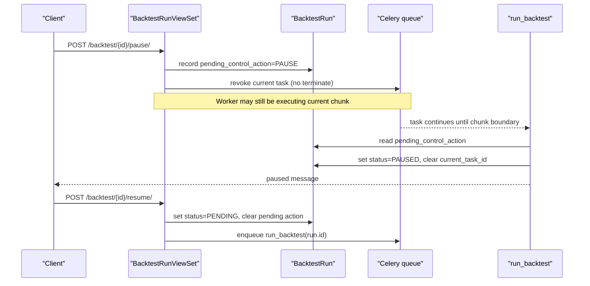
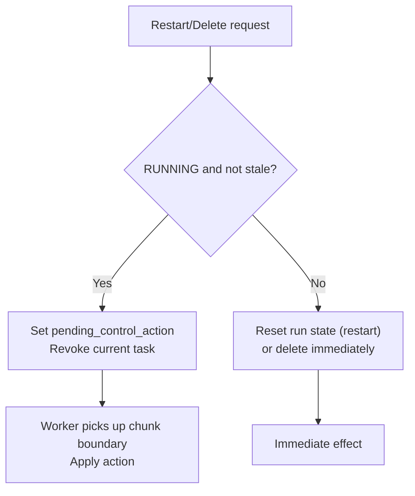
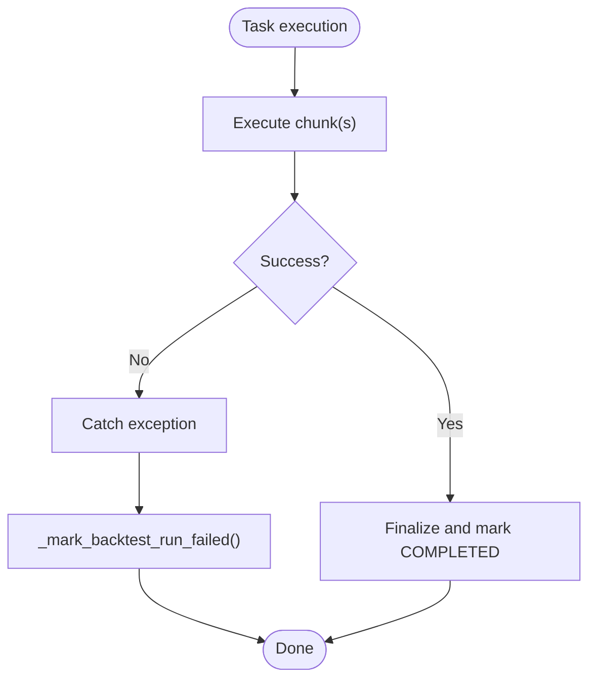
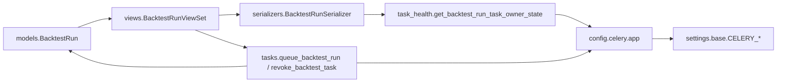

# Task Health & Monitoring

<cite>
**Referenced Files in This Document**
- [task_health.py](file://apps/backtest/task_health.py)
- [tasks.py](file://apps/backtest/tasks.py)
- [models.py](file://apps/backtest/models.py)
- [views.py](file://apps/backtest/views.py)
- [serializers.py](file://apps/backtest/serializers.py)
- [celery.py](file://config/celery.py)
- [base.py](file://config/settings/base.py)
</cite>

## Table of Contents
1. [Introduction](#introduction)
2. [Project Structure](#project-structure)
3. [Core Components](#core-components)
4. [Architecture Overview](#architecture-overview)
5. [Detailed Component Analysis](#detailed-component-analysis)
6. [Dependency Analysis](#dependency-analysis)
7. [Performance Considerations](#performance-considerations)
8. [Troubleshooting Guide](#troubleshooting-guide)
9. [Conclusion](#conclusion)
10. [Appendices](#appendices)

## Introduction
This document explains the task health monitoring system for long-running backtest jobs. It covers how the system detects failed or orphaned workers, how job recovery is coordinated through current_task_id and pending_control_action, how execution status is tracked and exposed via API, and how pause/resume works without losing progress. It also documents error handling and recovery procedures and shows how the system integrates with Celery queues to coordinate with the broader task processing infrastructure.

## Project Structure
The backtest health monitoring spans a small set of focused modules:
- Data model for runs and trades (BacktestRun, BacktestTrade)
- Celery-backed chunked execution engine (run_backtest)
- Health detection logic that distinguishes healthy chunked runs from orphaned ones
- API surface that exposes lifecycle controls (pause, resume, restart, delete) and health fields
- Celery configuration and routing for dedicated backtest queue

**Diagram sources**
- [views.py:75-209](file://apps/backtest/views.py#L75-L209)
- [serializers.py:48-84](file://apps/backtest/serializers.py#L48-L84)
- [task_health.py:45-95](file://apps/backtest/task_health.py#L45-L95)
- [tasks.py:2223-2243](file://apps/backtest/tasks.py#L2223-L2243)
- [celery.py:1-17](file://config/celery.py#L1-L17)
- [base.py:174-200](file://config/settings/base.py#L174-L200)

**Section sources**
- [models.py:24-117](file://apps/backtest/models.py#L24-L117)
- [views.py:1-18](file://apps/backtest/views.py#L1-L18)
- [celery.py:1-17](file://config/celery.py#L1-L17)
- [base.py:174-200](file://config/settings/base.py#L174-L200)

## Core Components
- BacktestRun model: stores run state, parameters, report, current_task_id, and pending_control_action. These fields are central to both control flow and health detection.
- Chunked execution task: run_backtest executes in chunks, persists runtime_state and progress, re-queues itself until complete, and honors pending_control_action at safe boundaries.
- Health detector: get_backtest_run_task_owner_state inspects Celery task state and runtime progress to determine if a RUNNING run has an orphaned worker.
- API and serializer: expose lifecycle actions and embed health fields so clients can monitor and control runs without polling Celery directly.

Key responsibilities:
- Detect stale task owners using Celery AsyncResult and runtime progress thresholds.
- Enforce intent-based lifecycle transitions by recording pending_control_action and revoking tasks when needed.
- Persist chunked progress so long runs survive worker restarts and timeouts.

**Section sources**
- [models.py:24-117](file://apps/backtest/models.py#L24-L117)
- [tasks.py:2299-2578](file://apps/backtest/tasks.py#L2299-L2578)
- [task_health.py:1-95](file://apps/backtest/task_health.py#L1-L95)
- [serializers.py:48-84](file://apps/backtest/serializers.py#L48-L84)
- [views.py:34-41](file://apps/backtest/views.py#L34-L41)

## Architecture Overview
The system coordinates between Django REST API, Celery workers, and the database to manage long-running backtests safely.

**Diagram sources**
- [views.py:90-97](file://apps/backtest/views.py#L90-L97)
- [views.py:34-41](file://apps/backtest/views.py#L34-L41)
- [tasks.py:2232-2243](file://apps/backtest/tasks.py#L2232-L2243)
- [tasks.py:2451-2488](file://apps/backtest/tasks.py#L2451-L2488)
- [task_health.py:45-95](file://apps/backtest/task_health.py#L45-L95)

## Detailed Component Analysis

### Health Detection: Stale Task Owner Logic
The health detector determines whether a RUNNING run has a valid owner or is orphaned. It uses:
- current_task_id to look up Celery task state
- report.runtime_state or report.progress to detect legitimate PENDING continuations
- a configurable age threshold to flag stale PENDING tasks without progress

Decision highlights:
- If run is not RUNNING, no stale owner.
- If no current_task_id, stale if older than threshold.
- If Celery task is terminal (FAILURE, REVOKED, SUCCESS), mark stale.
- If Celery task is PENDING but there is no runtime progress and age exceeds threshold, mark stale.

**Diagram sources**
- [task_health.py:45-95](file://apps/backtest/task_health.py#L45-L95)

**Section sources**
- [task_health.py:1-95](file://apps/backtest/task_health.py#L1-L95)

### Chunked Execution and Recovery
The run_backtest task:
- Runs in chunks defined by BACKTEST_CHUNK_TRADING_DAYS
- Persists runtime_state and progress into BacktestRun.report
- Re-queues itself until all trading days are processed
- Honors pending_control_action at chunk boundaries (DELETE, RESTART, PAUSE)
- Updates current_task_id early to reflect the actual running task
- Marks failures via _mark_backtest_run_failed

**Diagram sources**
- [tasks.py:2299-2578](file://apps/backtest/tasks.py#L2299-L2578)

**Section sources**
- [tasks.py:2299-2578](file://apps/backtest/tasks.py#L2299-L2578)

### Pause/Resume Without Losing Progress
Pause/resume is intent-based:
- Pause on a RUNNING run records pending_control_action=PAUSE and revokes the current task; the worker will pause at the next chunk boundary.
- Resume sets status=PENDING, clears pending action, and re-queues the run.
- The task checks for PAUSED status and pending_control_action at startup and chunk boundaries, clearing current_task_id and halting further work.

**Diagram sources**
- [views.py:134-179](file://apps/backtest/views.py#L134-L179)
- [tasks.py:2331-2338](file://apps/backtest/tasks.py#L2331-L2338)
- [tasks.py:2479-2485](file://apps/backtest/tasks.py#L2479-L2485)

**Section sources**
- [views.py:134-179](file://apps/backtest/views.py#L134-L179)
- [tasks.py:2331-2338](file://apps/backtest/tasks.py#L2331-L2338)
- [tasks.py:2479-2485](file://apps/backtest/tasks.py#L2479-L2485)

### Restart and Delete Handling
- Restart:
  - For RUNNING without stale owner: schedule restart at next chunk boundary via pending_control_action=RESTART.
  - For stale owner or non-RUNNING: reset run state and immediately re-enqueue.
- Delete:
  - For RUNNING without stale owner: schedule deletion at next chunk boundary.
  - Otherwise: revoke task and delete row immediately.

**Diagram sources**
- [views.py:102-122](file://apps/backtest/views.py#L102-L122)
- [views.py:181-196](file://apps/backtest/views.py#L181-L196)
- [tasks.py:2469-2499](file://apps/backtest/tasks.py#L2469-L2499)

**Section sources**
- [views.py:102-122](file://apps/backtest/views.py#L102-L122)
- [views.py:181-196](file://apps/backtest/views.py#L181-L196)
- [tasks.py:2469-2499](file://apps/backtest/tasks.py#L2469-L2499)

### Error Handling and Recovery
- Failures inside run_backtest are caught and persisted via _mark_backtest_run_failed, setting status=FAILED, error_message, clearing current_task_id and pending_control_action, and recording completed_at.
- Database connection errors are retried once with connection resets before propagating.
- Stale task detection allows operators to recover by restarting or deleting runs whose workers disappeared.

**Diagram sources**
- [tasks.py:2572-2578](file://apps/backtest/tasks.py#L2572-L2578)
- [tasks.py:2275-2296](file://apps/backtest/tasks.py#L2275-L2296)

**Section sources**
- [tasks.py:2275-2296](file://apps/backtest/tasks.py#L2275-L2296)
- [tasks.py:2572-2578](file://apps/backtest/tasks.py#L2572-L2578)

### API Visibility and Monitoring
The BacktestRunSerializer includes:
- task_state: Celery task state for the current_task_id
- has_stale_task_owner: boolean indicating orphaned worker
These fields are computed via get_backtest_run_task_owner_state and cached per object to avoid redundant queries.

Monitoring examples:
- List or retrieve runs to see status, pending_control_action, task_state, and has_stale_task_owner.
- Use filters such as strategy_type and status to narrow down active or problematic runs.
- Compare runs via comparison_curve endpoint for performance visibility.

**Section sources**
- [serializers.py:48-84](file://apps/backtest/serializers.py#L48-L84)
- [views.py:80-88](file://apps/backtest/views.py#L80-L88)
- [views.py:204-208](file://apps/backtest/views.py#L204-L208)

### Celery Integration and Queues
- Celery app is configured to load settings under CELERY namespace and autodiscover tasks.
- Dedicated queues: ops (default), backtest, train-lightgbm, train-lstm.
- Routing ensures apps.backtest.tasks.run_backtest goes to the backtest queue.
- Time limits: global defaults apply, but run_backtest overrides soft_time_limit and time_limit to accommodate long runs.

Operational notes:
- Workers must consume the correct queues; a default worker will not execute backtests.
- Broker and result backend use Redis by default.

**Section sources**
- [celery.py:1-17](file://config/celery.py#L1-L17)
- [base.py:174-200](file://config/settings/base.py#L174-L200)
- [base.py:201-204](file://config/settings/base.py#L201-L204)

## Dependency Analysis
The following diagram shows key dependencies among components involved in health monitoring and control.

**Diagram sources**
- [models.py:24-117](file://apps/backtest/models.py#L24-L117)
- [views.py:75-209](file://apps/backtest/views.py#L75-L209)
- [serializers.py:48-84](file://apps/backtest/serializers.py#L48-L84)
- [task_health.py:45-95](file://apps/backtest/task_health.py#L45-L95)
- [tasks.py:2223-2243](file://apps/backtest/tasks.py#L2223-L2243)
- [celery.py:1-17](file://config/celery.py#L1-L17)
- [base.py:174-200](file://config/settings/base.py#L174-L200)

**Section sources**
- [views.py:75-209](file://apps/backtest/views.py#L75-L209)
- [serializers.py:48-84](file://apps/backtest/serializers.py#L48-L84)
- [task_health.py:45-95](file://apps/backtest/task_health.py#L45-L95)
- [tasks.py:2223-2243](file://apps/backtest/tasks.py#L2223-L2243)
- [celery.py:1-17](file://config/celery.py#L1-L17)
- [base.py:174-200](file://config/settings/base.py#L174-L200)

## Performance Considerations
- Chunk size: BACKTEST_CHUNK_TRADING_DAYS balances throughput and checkpoint frequency. Larger chunks reduce re-queue overhead but increase recovery distance.
- Process-level caches: trading dates, price maps, and matrix signals are bounded to limit memory usage across runs within a worker process.
- LightGBM runtime metrics: batch sizes and inference backends are recorded to help diagnose slow runs.
- Time limits: run_backtest overrides global limits to allow long runs while protecting other queues.

[No sources needed since this section provides general guidance]

## Troubleshooting Guide
Common issues and remedies:
- Run stuck in RUNNING with no progress:
  - Inspect task_state and has_stale_task_owner via API.
  - If stale, restart or delete via API; the system will recover ownership.
- Run paused unexpectedly:
  - Check pending_control_action and status; resume to continue from last checkpoint.
- Frequent failures:
  - Read error_message from the run; investigate data or environment issues.
- Worker not picking up backtests:
  - Ensure a worker consumes the backtest queue; default workers only handle ops.

Operational checks:
- Verify Celery broker connectivity and queue routing.
- Confirm run_backtest time limits are appropriate for your workload.
- Use the trades endpoint to verify partial results during long runs.

**Section sources**
- [task_health.py:45-95](file://apps/backtest/task_health.py#L45-L95)
- [views.py:134-179](file://apps/backtest/views.py#L134-L179)
- [tasks.py:2275-2296](file://apps/backtest/tasks.py#L2275-L2296)
- [base.py:174-200](file://config/settings/base.py#L174-L200)

## Conclusion
The backtest health monitoring system combines chunked execution, explicit runtime state persistence, and Celery-aware health checks to provide robust control and visibility for long-running jobs. Operators can pause, resume, restart, and delete runs safely, with progress preserved across interruptions. The API surfaces task state and stale ownership indicators, enabling proactive management without direct Celery interaction. Proper queue separation and time limits ensure reliable operation alongside other background tasks.

[No sources needed since this section summarizes without analyzing specific files]

## Appendices

### Key Fields Reference
- BacktestRun.status: lifecycle states including PENDING, RUNNING, PAUSED, COMPLETED, FAILED
- BacktestRun.current_task_id: Celery task ID for the currently executing chunk
- BacktestRun.pending_control_action: intent flags NONE, PAUSE, RESTART, DELETE applied at safe boundaries
- BacktestRun.report.runtime_state and progress: chunking checkpoints used for resume

**Section sources**
- [models.py:24-117](file://apps/backtest/models.py#L24-L117)

### API Endpoints Summary
- Create backtest: enqueues run on backtest queue, returns 202 Accepted
- Retrieve/list backtests: includes task_state and has_stale_task_owner
- Lifecycle actions:
  - pause: requests pause at next chunk boundary
  - resume: re-enqueues paused run
  - restart: schedules restart or immediate restart depending on ownership
  - delete: schedules deletion or immediate deletion depending on ownership
- Trades: list executed trades for a run
- Comparison curve: compare equity curves across runs

**Section sources**
- [views.py:90-208](file://apps/backtest/views.py#L90-L208)