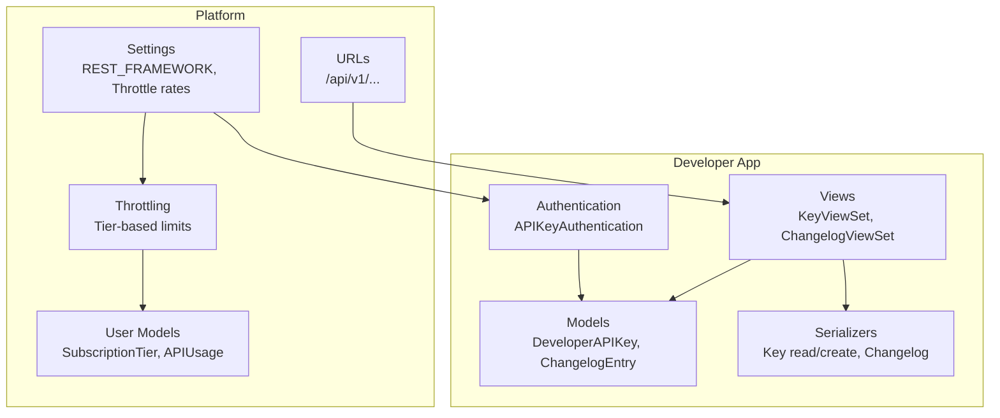
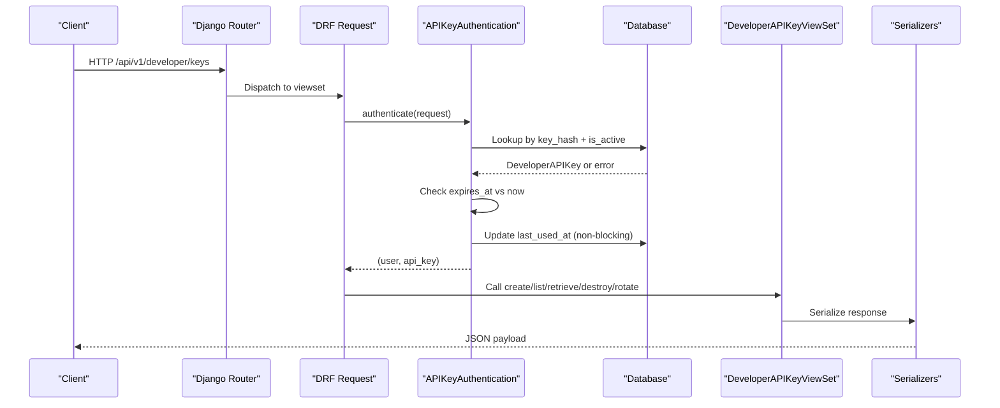
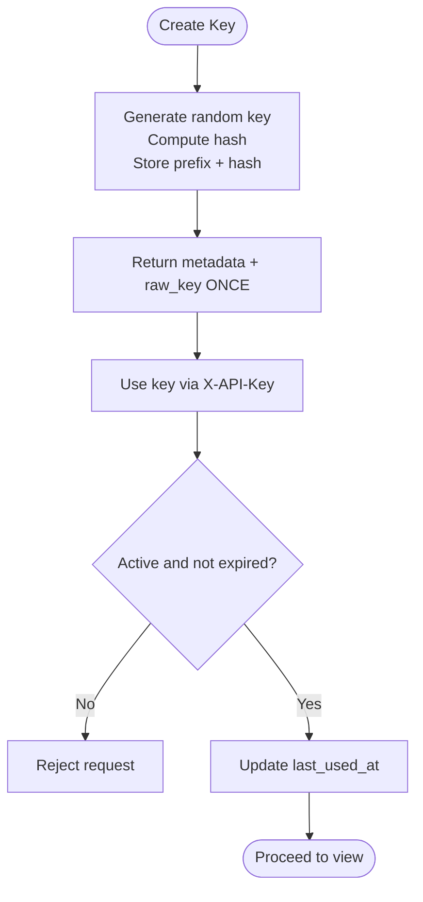
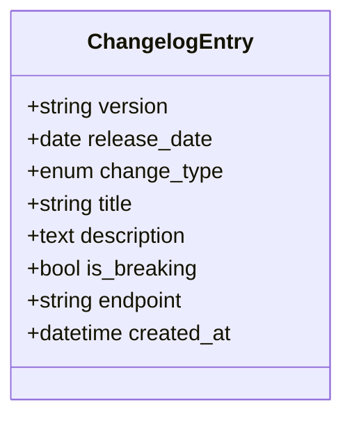
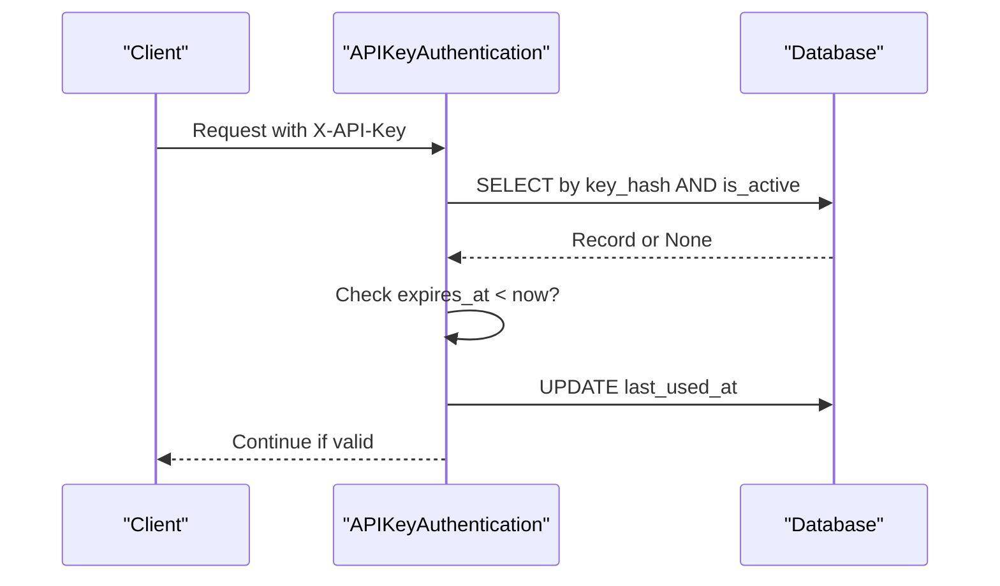
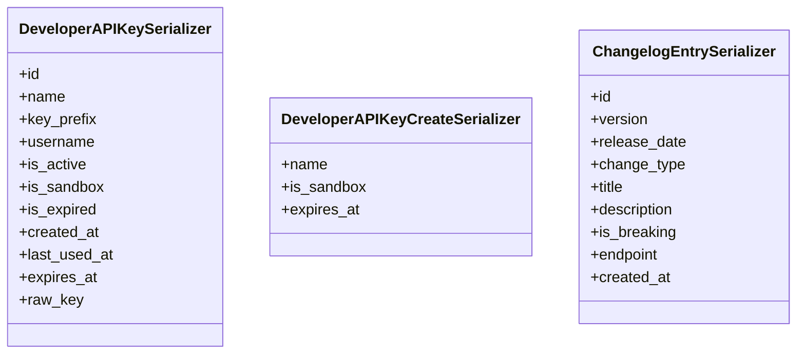
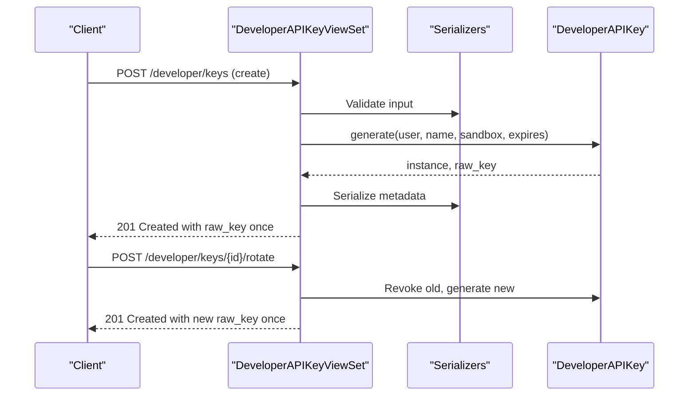
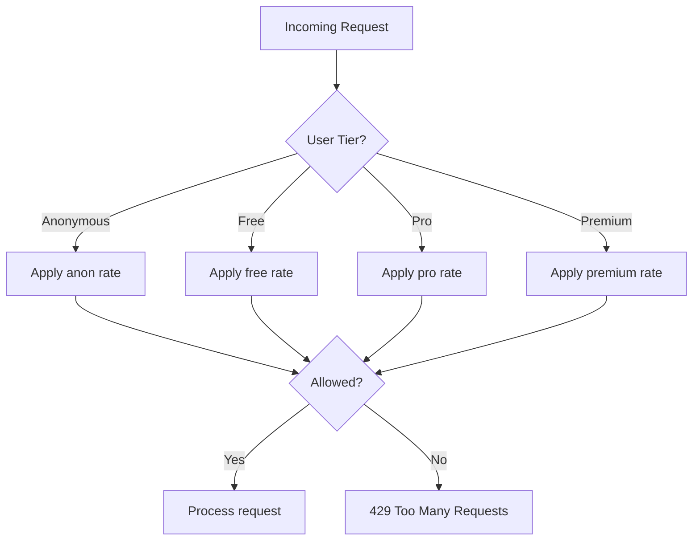
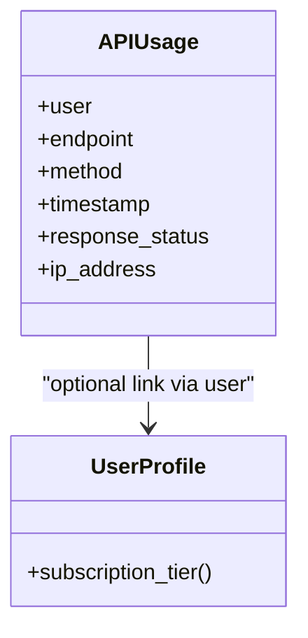
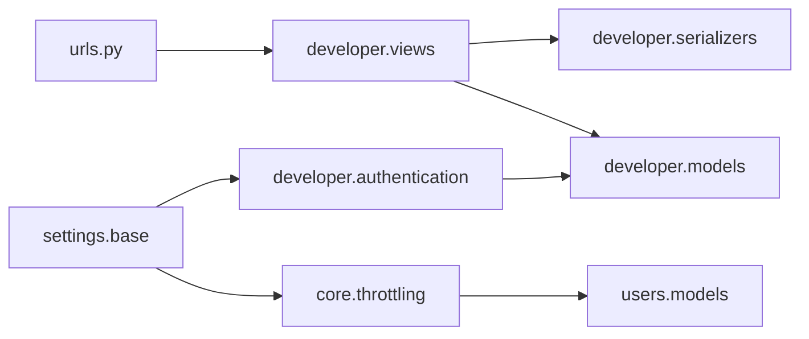

# Developer Application

<cite>
**Referenced Files in This Document**
- [models.py](file://apps/developer/models.py)
- [views.py](file://apps/developer/views.py)
- [serializers.py](file://apps/developer/serializers.py)
- [authentication.py](file://apps/developer/authentication.py)
- [urls.py](file://config/urls.py)
- [base.py](file://config/settings/base.py)
- [throttling.py](file://apps/core/throttling.py)
- [models.py](file://apps/users/models.py)
</cite>

## Table of Contents
1. [Introduction](#introduction)
2. [Project Structure](#project-structure)
3. [Core Components](#core-components)
4. [Architecture Overview](#architecture-overview)
5. [Detailed Component Analysis](#detailed-component-analysis)
6. [Dependency Analysis](#dependency-analysis)
7. [Performance Considerations](#performance-considerations)
8. [Troubleshooting Guide](#troubleshooting-guide)
9. [Conclusion](#conclusion)
10. [Appendices](#appendices)

## Introduction
The Developer application provides API tools and developer resources for the platform. It exposes endpoints to manage API keys, view a public changelog, and integrate with the main authentication system. It also documents rate limiting policies, usage tracking, and OpenAPI-based documentation generation for API discovery.

## Project Structure
The Developer app is organized into models, serializers, views, and custom authentication:
- Models define API key storage and changelog entries.
- Serializers define structured request/response schemas.
- Views implement REST endpoints for key management and changelog listing.
- Authentication integrates API key verification into the global DRF pipeline.
- URL routing registers developer endpoints under /api/v1/.
- Settings configure authentication classes, throttling tiers, and OpenAPI schema generation.

**Diagram sources**
- [urls.py:69-107](file://config/urls.py#L69-L107)
- [base.py:266-301](file://config/settings/base.py#L266-L301)
- [throttling.py:17-88](file://apps/core/throttling.py#L17-L88)
- [models.py:10-156](file://apps/developer/models.py#L10-L156)
- [views.py:13-100](file://apps/developer/views.py#L13-L100)
- [authentication.py:10-53](file://apps/developer/authentication.py#L10-L53)

**Section sources**
- [urls.py:69-107](file://config/urls.py#L69-L107)
- [base.py:266-301](file://config/settings/base.py#L266-L301)

## Core Components
- API Key Management: Create, list, retrieve, rotate, and revoke keys; store only hashes; expose safe prefix and metadata.
- Public Changelog: Read-only endpoint to discover API changes, filterable by version, type, and breaking status.
- Custom Authentication: Accepts X-API-Key header, validates against stored hash, enforces active/expired state, updates last-used timestamp.
- Serializer Patterns: Separate input serializer for creation; read-only output serializer that never leaks secrets; computed fields like is_expired.
- View Architecture: Django REST Framework viewsets with mixins for standard CRUD plus custom actions (rotate).
- Integration with Main Auth: API key auth runs alongside JWT and session auth; user context is derived from the key’s owner.
- Usage Tracking and Quotas: Tier-based throttling via subscription tier; per-user API usage model available for analytics.
- Documentation Generation: OpenAPI schema exposed via drf-spectacular with documented authentication methods and rate limits.

**Section sources**
- [models.py:10-156](file://apps/developer/models.py#L10-L156)
- [serializers.py:6-68](file://apps/developer/serializers.py#L6-L68)
- [views.py:13-100](file://apps/developer/views.py#L13-L100)
- [authentication.py:10-53](file://apps/developer/authentication.py#L10-L53)
- [base.py:266-301](file://config/settings/base.py#L266-L301)
- [throttling.py:17-88](file://apps/core/throttling.py#L17-L88)
- [models.py:140-186](file://apps/users/models.py#L140-L186)

## Architecture Overview
The Developer app integrates into the platform’s request lifecycle:
- Requests arrive at /api/v1/ routes.
- DRF selects an appropriate authentication class: JWT first, then API key, then session.
- For API key requests, the custom authenticator verifies the key, checks expiration, and updates last-used.
- Views enforce permissions and serialize responses using dedicated serializers.
- Throttling applies based on user tier or anonymous scope.
- OpenAPI schema documents both JWT and API key authentication.

**Diagram sources**
- [urls.py:69-107](file://config/urls.py#L69-L107)
- [authentication.py:24-49](file://apps/developer/authentication.py#L24-L49)
- [views.py:39-83](file://apps/developer/views.py#L39-L83)
- [serializers.py:6-51](file://apps/developer/serializers.py#L6-L51)

## Detailed Component Analysis

### API Key Lifecycle Management
- Creation: Generate a secure random key, compute SHA-256 hash, store prefix and hash; return raw key once in response.
- Listing/Retrieval: Return metadata only (no hash or full key); include username, status, expiry, timestamps.
- Rotation: Soft-revoke current key and issue a replacement with same settings; return new raw key once.
- Revocation: Mark key inactive instead of deleting rows to preserve history.
- Expiration: Keys can have optional expiry; expired keys are rejected during authentication.

**Diagram sources**
- [models.py:81-100](file://apps/developer/models.py#L81-L100)
- [authentication.py:24-49](file://apps/developer/authentication.py#L24-L49)
- [views.py:39-83](file://apps/developer/views.py#L39-L83)

**Section sources**
- [models.py:10-100](file://apps/developer/models.py#L10-L100)
- [views.py:39-83](file://apps/developer/views.py#L39-L83)
- [authentication.py:24-49](file://apps/developer/authentication.py#L24-L49)

### Public Changelog Functionality
- Purpose: Provide a public, read-only changelog of API changes, including breaking changes and affected endpoints.
- Filtering: Support filtering by version, change_type, and is_breaking; search by title/description/endpoint.
- Ordering: Newest releases first.

**Diagram sources**
- [models.py:103-156](file://apps/developer/models.py#L103-L156)

**Section sources**
- [views.py:86-100](file://apps/developer/views.py#L86-L100)
- [models.py:103-156](file://apps/developer/models.py#L103-L156)

### Custom Authentication Mechanisms for API Access
- Header: Accepts X-API-Key.
- Validation: Hashes incoming key and matches against stored hash; requires active and non-expired key.
- User Context: Returns the owning user; integrates seamlessly with permission and throttling systems.
- Usage Tracking: Updates last_used_at on each successful authentication.

**Diagram sources**
- [authentication.py:24-49](file://apps/developer/authentication.py#L24-L49)

**Section sources**
- [authentication.py:10-53](file://apps/developer/authentication.py#L10-L53)

### Serializer Patterns for Structured Responses
- Input: Dedicated serializer for key creation with name, sandbox flag, and optional expiry.
- Output: Read-only serializer exposing safe fields and computed properties; raw_key included only on creation responses.
- Changelog: Read-only serializer mapping model fields to API structure.

**Diagram sources**
- [serializers.py:6-68](file://apps/developer/serializers.py#L6-L68)

**Section sources**
- [serializers.py:6-68](file://apps/developer/serializers.py#L6-L68)

### View Architecture for Developer-Facing Endpoints
- Key Management ViewSet: List, retrieve, create, destroy (soft), and rotate actions.
- Changelog ViewSet: List and retrieve with filters and search.
- Permissions: Keys require authentication; changelog is public.

**Diagram sources**
- [views.py:13-83](file://apps/developer/views.py#L13-L83)
- [models.py:81-100](file://apps/developer/models.py#L81-L100)

**Section sources**
- [views.py:13-100](file://apps/developer/views.py#L13-L100)

### API Key Security Considerations
- Storage: Only SHA-256 hash stored; raw key never persisted.
- Display: Only key prefix shown in listings.
- Transmission: Require HTTPS in production; use X-API-Key header.
- Rotation: Provide rotate action to quickly invalidate compromised keys.
- Expiry: Enforce expiration to limit exposure window.

**Section sources**
- [models.py:10-100](file://apps/developer/models.py#L10-L100)
- [authentication.py:24-49](file://apps/developer/authentication.py#L24-L49)
- [views.py:39-83](file://apps/developer/views.py#L39-L83)

### Rate Limiting Policies for External Consumers
- Anonymous: Limited daily requests.
- Authenticated: Limits vary by subscription tier (Free, Pro, Premium).
- Implementation: Tier-based throttle classes derive cache keys from user ID and tier; separate scopes for auth endpoints.
- Configuration: Global defaults set in REST_FRAMEWORK settings.

**Diagram sources**
- [throttling.py:17-88](file://apps/core/throttling.py#L17-L88)
- [base.py:287-301](file://config/settings/base.py#L287-L301)

**Section sources**
- [throttling.py:17-88](file://apps/core/throttling.py#L17-L88)
- [base.py:287-301](file://config/settings/base.py#L287-L301)

### Usage Tracking and Quotas
- Per-request tracking: Middleware records endpoint, method, timestamp, status, and IP.
- Subscription tiers: Determine quota levels for authenticated users.
- Analytics: Queries can aggregate usage by user, endpoint, or time windows.

**Diagram sources**
- [models.py:140-186](file://apps/users/models.py#L140-L186)
- [models.py:13-66](file://apps/users/models.py#L13-L66)

**Section sources**
- [models.py:140-186](file://apps/users/models.py#L140-L186)
- [models.py:13-66](file://apps/users/models.py#L13-L66)

### Integration with Main Authentication System
- Multiple authenticators: JWT, API key, Session.
- API key returns the owning user, enabling consistent permission checks and throttling.
- OpenAPI schema documents both JWT and API key security schemes.

**Section sources**
- [base.py:281-286](file://config/settings/base.py#L281-L286)
- [base.py:352-388](file://config/settings/base.py#L352-L388)
- [authentication.py:24-49](file://apps/developer/authentication.py#L24-L49)

### Documentation Generation for API Discovery
- OpenAPI Schema: Provided via drf-spectacular at /api/v1/schema/.
- Interactive Docs: Swagger UI and ReDoc available at /api/v1/schema/swagger-ui/ and /api/v1/schema/redoc/.
- Auth Documentation: Schema includes JWT and API key security definitions.

**Section sources**
- [urls.py:124-127](file://config/urls.py#L124-L127)
- [base.py:352-388](file://config/settings/base.py#L352-L388)

## Dependency Analysis
- Views depend on serializers and models.
- Authentication depends on models to validate keys.
- Settings wire authentication classes and throttle classes globally.
- URL router registers developer endpoints alongside other domain modules.

**Diagram sources**
- [urls.py:69-107](file://config/urls.py#L69-L107)
- [base.py:266-301](file://config/settings/base.py#L266-L301)
- [throttling.py:17-88](file://apps/core/throttling.py#L17-L88)
- [models.py:10-156](file://apps/developer/models.py#L10-L156)
- [views.py:13-100](file://apps/developer/views.py#L13-L100)
- [authentication.py:10-53](file://apps/developer/authentication.py#L10-L53)

**Section sources**
- [urls.py:69-107](file://config/urls.py#L69-L107)
- [base.py:266-301](file://config/settings/base.py#L266-L301)

## Performance Considerations
- Database indexes: Key hash and user+active indexes optimize lookups and queries.
- Non-blocking usage update: last_used_at updated via bulk update to minimize latency.
- Throttling: Tiered limits reduce load on high-volume consumers; Redis-backed caching for rate counters.
- Pagination: Default pagination reduces payload sizes across endpoints.

**Section sources**
- [models.py:60-67](file://apps/developer/models.py#L60-L67)
- [authentication.py:43-46](file://apps/developer/authentication.py#L43-L46)
- [base.py:266-301](file://config/settings/base.py#L266-L301)

## Troubleshooting Guide
- Invalid or revoked key: Ensure X-API-Key header is present and correct; verify key is active and not expired.
- Expired key: Rotate or renew key before expiry; check expires_at field.
- Rate limited: Review subscription tier and daily quotas; consider upgrading tier or reducing request frequency.
- Missing raw_key: Raw key is returned only on creation or rotation; ensure you captured it immediately after creation.

**Section sources**
- [authentication.py:24-49](file://apps/developer/authentication.py#L24-L49)
- [views.py:39-83](file://apps/developer/views.py#L39-L83)
- [throttling.py:17-88](file://apps/core/throttling.py#L17-L88)

## Conclusion
The Developer application offers a robust, secure, and well-documented API access mechanism through API keys, complemented by a public changelog for transparency. It integrates seamlessly with the platform’s authentication and throttling systems, supports usage tracking, and provides comprehensive OpenAPI documentation for easy integration.

## Appendices

### API Endpoints Summary
- Manage API keys: /api/v1/developer/keys
- Rotate key: /api/v1/developer/keys/{id}/rotate
- View changelog: /api/v1/developer/changelog

**Section sources**
- [urls.py:106-107](file://config/urls.py#L106-L107)