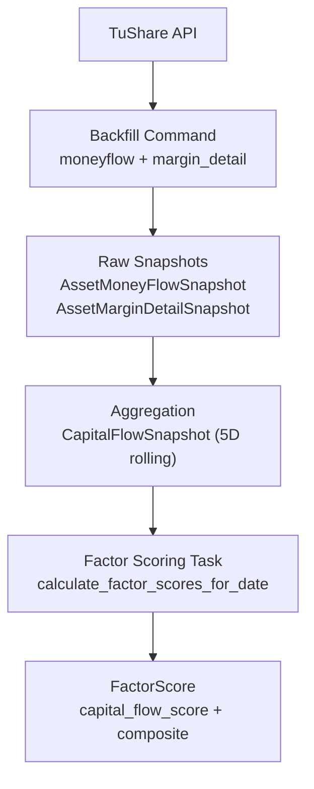
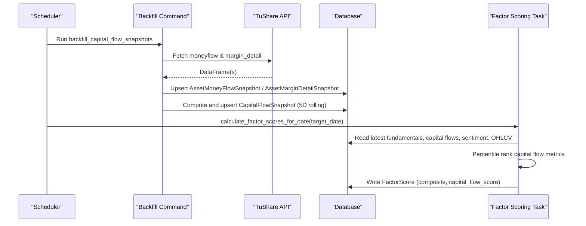
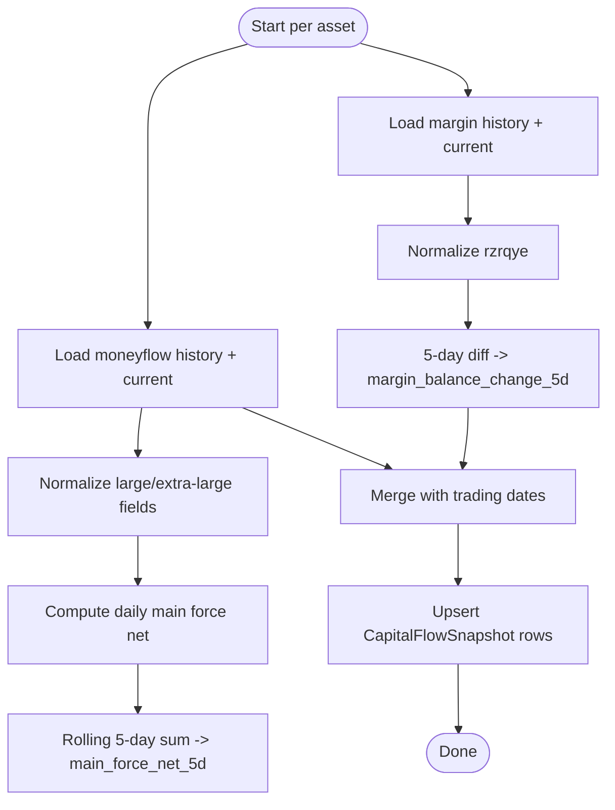
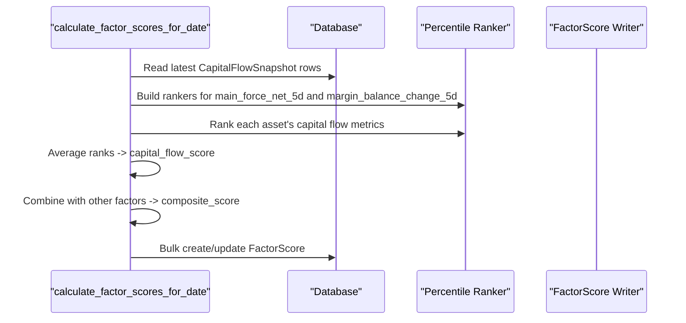
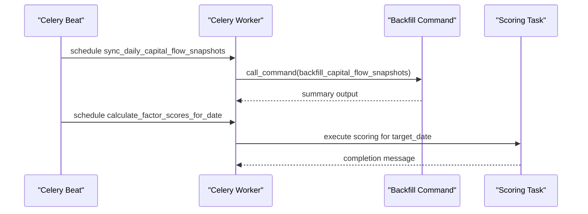
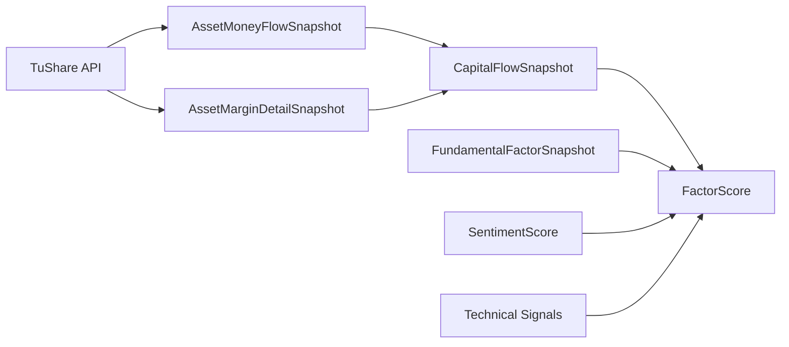

# Capital Flow Analysis

<cite>
**Referenced Files in This Document**
- [models.py](file://apps/factors/models.py)
- [backfill_capital_flow_snapshots.py](file://apps/factors/management/commands/backfill_capital_flow_snapshots.py)
- [tasks.py](file://apps/factors/tasks.py)
- [serializers.py](file://apps/factors/serializers.py)
- [validate_data_quality.py](file://apps/core/management/commands/validate_data_quality.py)
</cite>

## Table of Contents
1. [Introduction](#introduction)
2. [Project Structure](#project-structure)
3. [Core Components](#core-components)
4. [Architecture Overview](#architecture-overview)
5. [Detailed Component Analysis](#detailed-component-analysis)
6. [Dependency Analysis](#dependency-analysis)
7. [Performance Considerations](#performance-considerations)
8. [Troubleshooting Guide](#troubleshooting-guide)
9. [Conclusion](#conclusion)

## Introduction
This document explains the Capital Flow Analysis component that ingests money flow and margin data, normalizes them into daily snapshots, aggregates 5-day rolling metrics, and integrates those metrics into the broader factor scoring system. It covers:
- The raw snapshot models for money flow and margin detail
- How buy/sell amounts by size categories are used to compute net main force flow
- How margin trading balances are transformed into a 5-day change metric
- The asynchronous task architecture that refreshes capital flow snapshots and computes factor scores
- Data normalization patterns and integration points with factor scoring

## Project Structure
The capital flow pipeline spans three layers:
- Data ingestion and normalization: management command fetches TuShare moneyflow and margin_detail, upserts raw snapshots, and derives CapitalFlowSnapshot rows on trading dates
- Aggregation and scoring: Celery tasks orchestrate backfills and compute composite factor scores using normalized components
- Exposure: DRF serializers expose CapitalFlowSnapshot and FactorScore for downstream consumers

**Diagram sources**
- [backfill_capital_flow_snapshots.py:190-372](file://apps/factors/management/commands/backfill_capital_flow_snapshots.py#L190-L372)
- [tasks.py:256-460](file://apps/factors/tasks.py#L256-L460)
- [models.py:39-121](file://apps/factors/models.py#L39-L121)

**Section sources**
- [backfill_capital_flow_snapshots.py:57-118](file://apps/factors/management/commands/backfill_capital_flow_snapshots.py#L57-L118)
- [tasks.py:256-460](file://apps/factors/tasks.py#L256-L460)
- [models.py:39-121](file://apps/factors/models.py#L39-L121)

## Core Components
- AssetMoneyFlowSnapshot: stores per-stock daily money flow fields including buy/sell amounts by size categories (small, medium, large, extra-large) and net main flow amount
- AssetMarginDetailSnapshot: stores per-stock daily margin detail fields including financing and securities lending balances and volumes
- CapitalFlowSnapshot: derived daily snapshot with two key metrics:
  - main_force_net_5d: 5-day rolling sum of net main force flow
  - margin_balance_change_5d: 5-day difference in margin balance
- FactorScore: includes capital_flow_score and related sub-scores derived from CapitalFlowSnapshot

Key responsibilities:
- Raw ingestion and normalization via the backfill command
- Rolling aggregation to produce CapitalFlowSnapshot
- Percentile ranking and weighting to produce capital_flow_score and composite score

**Section sources**
- [models.py:39-121](file://apps/factors/models.py#L39-L121)
- [models.py:124-176](file://apps/factors/models.py#L124-L176)

## Architecture Overview
The pipeline is event-driven and batch-oriented:
- Daily or backfill jobs call the management command to refresh raw snapshots and aggregate CapitalFlowSnapshot
- A separate Celery task calculates factor scores for a given date, reading latest fundamentals, capital flows, sentiment, and technical signals, then writes FactorScore records

**Diagram sources**
- [backfill_capital_flow_snapshots.py:190-372](file://apps/factors/management/commands/backfill_capital_flow_snapshots.py#L190-L372)
- [tasks.py:256-460](file://apps/factors/tasks.py#L256-L460)

## Detailed Component Analysis

### AssetMoneyFlowSnapshot Model
Purpose:
- Captures raw daily money flow per asset with buy/sell amounts categorized by trade size: small, medium, large, extra-large
- Includes net main flow amount provided by the source

Size categories:
- Small: buy_sm_amount, sell_sm_amount
- Medium: buy_md_amount, sell_md_amount
- Large: buy_lg_amount, sell_lg_amount
- Extra-large: buy_elg_amount, sell_elg_amount

Net main flow:
- net_mf_amount is stored directly from the source; however, the aggregation step recomputes a “main force” metric using large and extra-large buy/sell amounts

Data integrity:
- Unique constraint on (asset, date)
- Indexes on (asset, date) and date for efficient queries

**Section sources**
- [models.py:39-67](file://apps/factors/models.py#L39-L67)

### AssetMarginDetailSnapshot Model
Purpose:
- Stores daily margin trading details per asset, including financing and securities lending balances and volumes

Key fields:
- Financing balance: rzye
- Securities lending balance: rqye
- Financing buy/repayment amounts: rzmre, rzche
- Securities lending volume, repayment volume, sell volume: rqyl, rqchl, rqmcl
- Margin balance: rzrqye (used for 5-day change calculation)

Data integrity:
- Unique constraint on (asset, date)
- Indexes on (asset, date) and date

**Section sources**
- [models.py:70-97](file://apps/factors/models.py#L70-L97)

### CapitalFlowSnapshot Model
Purpose:
- Derived daily snapshot aggregating money flow and margin data into two rolling metrics used for factor scoring

Metrics:
- main_force_net_5d: 5-day rolling sum of net main force flow computed from large and extra-large buy/sell amounts
- margin_balance_change_5d: 5-day difference in margin balance (rzrqye)

Usage:
- These metrics are percentile-ranked across assets and averaged to form capital_flow_score, which contributes to the composite factor score

**Section sources**
- [models.py:100-121](file://apps/factors/models.py#L100-L121)

### Capital Flow Aggregation Process
The aggregation occurs in the backfill command and produces CapitalFlowSnapshot rows for each trading date:

- Money flow processing:
  - Normalize large and extra-large buy/sell amounts to numeric values
  - Compute daily main force net flow as: buy_lg_amount + buy_elg_amount - sell_lg_amount - sell_elg_amount
  - Apply a 5-day rolling sum with minimum periods set to allow partial windows early in history
  - Store result as main_force_net_5d

- Margin processing:
  - Normalize margin balance field rzrqye
  - Compute 5-day difference: current rzrqye minus rzrqye from 5 trading days prior
  - Store result as margin_balance_change_5d

- Output:
  - One CapitalFlowSnapshot row per asset per trading date in the processed window
  - Metadata records formulas and source for traceability

**Diagram sources**
- [backfill_capital_flow_snapshots.py:312-372](file://apps/factors/management/commands/backfill_capital_flow_snapshots.py#L312-L372)

**Section sources**
- [backfill_capital_flow_snapshots.py:312-372](file://apps/factors/management/commands/backfill_capital_flow_snapshots.py#L312-L372)

### Factor Scoring Integration
Capital flow metrics feed into factor scoring as follows:

- Percentile ranking:
  - main_force_net_5d and margin_balance_change_5d are ranked across all assets for the target date
  - Ranking converts raw values into comparable scores between 0 and 1

- Capital flow score:
  - capital_flow_score is the average of the main force flow score and margin flow score

- Composite score:
  - capital_flow_score is weighted along with fundamental, technical, and sentiment scores to produce composite_score and bottom_probability_score

**Diagram sources**
- [tasks.py:316-460](file://apps/factors/tasks.py#L316-L460)

**Section sources**
- [tasks.py:316-460](file://apps/factors/tasks.py#L316-L460)

### Asynchronous Task Architecture
Two primary Celery tasks coordinate capital flow processing:

- sync_daily_capital_flow_snapshots:
  - Resolves target date and lookback window
  - Invokes the backfill command to refresh raw snapshots and aggregated CapitalFlowSnapshot for the specified range
  - Returns a summary string

- calculate_factor_scores_for_date:
  - Ensures point-in-time membership coverage
  - Loads latest fundamentals, capital flows, sentiment, and technical indicators
  - Computes percentile ranks and composite scores
  - Writes FactorScore records in batches

**Diagram sources**
- [tasks.py:256-280](file://apps/factors/tasks.py#L256-L280)
- [tasks.py:283-460](file://apps/factors/tasks.py#L283-L460)

**Section sources**
- [tasks.py:256-460](file://apps/factors/tasks.py#L256-L460)

### Data Normalization Patterns
- Decimal conversion:
  - All monetary and ratio fields are converted to Decimal via a safe helper that handles None, empty strings, NaN, and type errors
- Date handling:
  - Trade dates are parsed and coerced; invalid dates are dropped
- Missing data:
  - Missing columns are filled with None; rolling windows use min_periods to avoid propagating NaN unnecessarily
- Idempotent upserts:
  - Bulk_create with update_conflicts ensures idempotent writes keyed by (asset, date)

These patterns ensure robustness against inconsistent external data and support reliable re-runs.

**Section sources**
- [backfill_capital_flow_snapshots.py:35-47](file://apps/factors/management/commands/backfill_capital_flow_snapshots.py#L35-L47)
- [backfill_capital_flow_snapshots.py:245-310](file://apps/factors/management/commands/backfill_capital_flow_snapshots.py#L245-L310)

### API Exposure
CapitalFlowSnapshot is exposed through a DRF serializer that includes:
- Asset identifier and symbol
- Date
- main_force_net_5d and margin_balance_change_5d
- Metadata and timestamps

This enables downstream systems to query capital flow metrics alongside other factor data.

**Section sources**
- [serializers.py:17-26](file://apps/factors/serializers.py#L17-L26)

## Dependency Analysis
- External data provider:
  - TuShare API for moneyflow and margin_detail
- Internal dependencies:
  - Asset and OHLCV models define universe and trading dates
  - FundamentalFactorSnapshot, SentimentScore, and SignalEvent provide additional inputs for factor scoring
- Validation:
  - Data quality commands validate presence and consistency of capital flow fields and flag issues such as missing same-day snapshots or insufficient history for 5-day calculations

**Diagram sources**
- [backfill_capital_flow_snapshots.py:190-372](file://apps/factors/management/commands/backfill_capital_flow_snapshots.py#L190-L372)
- [tasks.py:316-460](file://apps/factors/tasks.py#L316-L460)
- [validate_data_quality.py:176-198](file://apps/core/management/commands/validate_data_quality.py#L176-L198)

**Section sources**
- [backfill_capital_flow_snapshots.py:190-372](file://apps/factors/management/commands/backfill_capital_flow_snapshots.py#L190-L372)
- [tasks.py:316-460](file://apps/factors/tasks.py#L316-L460)
- [validate_data_quality.py:176-198](file://apps/core/management/commands/validate_data_quality.py#L176-L198)

## Performance Considerations
- Batched writes:
  - Bulk creation with large batch sizes reduces database round-trips during backfills and scoring
- Windowed fetching:
  - TuShare requests are split into manageable date windows to respect rate limits and memory constraints
- Efficient lookups:
  - Indexes on (asset, date) and date accelerate retrieval of latest snapshots and rolling computations
- Partial windows:
  - Rolling operations use min_periods to compute metrics even when full history is not available at the start

[No sources needed since this section provides general guidance]

## Troubleshooting Guide
Common issues and diagnostics:

- Missing same-day snapshots:
  - If CapitalFlowSnapshot fields are NULL because no same-day AssetMoneyFlowSnapshot or AssetMarginDetailSnapshot exists, run the backfill command for the affected date range
- Insufficient history for 5-day metrics:
  - margin_balance_change_5d requires at least six observations to compute a 5-day difference; ensure historical data is present before the target date
- Source field nulls:
  - Validate that rzrqye is populated for both the current and 5th-prior dates; otherwise margin_balance_change_5d will be NULL
- Rate limiting:
  - The backfill command retries on TuShare rate limit errors with configurable sleep intervals; adjust settings if frequent throttling occurs

Validation utilities:
- Data quality commands report specific issues such as expected vs. suspicious nulls, gaps in capital flow fields, and reconciliation failures

**Section sources**
- [validate_data_quality.py:2316-2399](file://apps/core/management/commands/validate_data_quality.py#L2316-L2399)
- [backfill_capital_flow_snapshots.py:374-392](file://apps/factors/management/commands/backfill_capital_flow_snapshots.py#L374-L392)

## Conclusion
The Capital Flow Analysis component transforms raw money flow and margin data into actionable 5-day rolling metrics and integrates them into a comprehensive factor scoring system. By standardizing ingestion, applying robust normalization, and leveraging asynchronous tasks, it delivers timely and reliable capital flow features that enhance composite scoring and bottom candidate identification. Proper backfilling and validation ensure data quality and operational resilience.