# Composite Scoring Engine

<cite>
**Referenced Files in This Document**
- [models.py](file://apps/factors/models.py)
- [tasks.py](file://apps/factors/tasks.py)
- [views.py](file://apps/factors/views.py)
- [serializers.py](file://apps/factors/serializers.py)
- [services.py](file://apps/macro/services.py)
- [technical_guide.md](file://TECHNICAL_GUIDE.md)
</cite>

## Table of Contents
1. [Introduction](#introduction)
2. [Project Structure](#project-structure)
3. [Core Components](#core-components)
4. [Architecture Overview](#architecture-overview)
5. [Detailed Component Analysis](#detailed-component-analysis)
6. [Dependency Analysis](#dependency-analysis)
7. [Performance Considerations](#performance-considerations)
8. [Troubleshooting Guide](#troubleshooting-guide)
9. [Conclusion](#conclusion)

## Introduction
This document explains the Composite Scoring Engine that produces daily, multi-factor scores for assets by combining fundamental valuation and quality signals, capital flow momentum, technical reversal conditions, and market sentiment. It documents the FactorScore model, component scoring algorithms, aggregate score construction, weighting system, bottom probability calculation, mode variations (TECHNICAL, FUNDAMENTAL, COMPOSITE), and how macro context can adjust weights at query time.

## Project Structure
The engine is implemented in the factors app with supporting services:
- Data models define snapshots and the FactorScore output record.
- A Celery task computes scores per asset for a given date using normalized percentile ranks and technical indicators.
- A REST view exposes bottom candidates and supports on-demand recalculation with optional macro-context weight adjustments.
- Macro services provide context-aware weight presets and event-based adjustments.

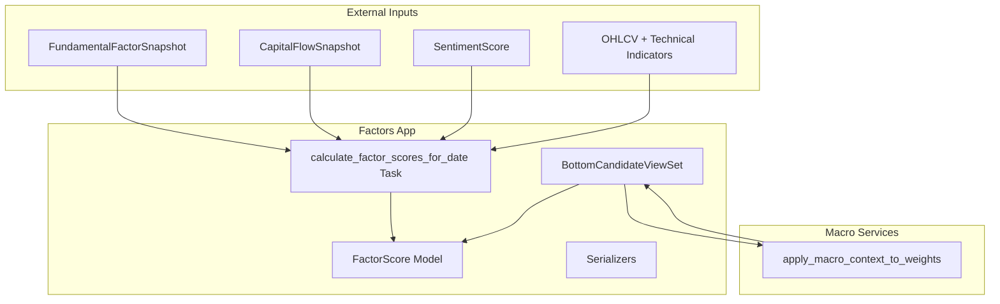

**Diagram sources**
- [tasks.py:283-460](file://apps/factors/tasks.py#L283-L460)
- [models.py:124-176](file://apps/factors/models.py#L124-L176)
- [views.py:45-218](file://apps/factors/views.py#L45-L218)
- [services.py:62-89](file://apps/macro/services.py#L62-L89)

**Section sources**
- [models.py:124-176](file://apps/factors/models.py#L124-L176)
- [tasks.py:283-460](file://apps/factors/tasks.py#L283-L460)
- [views.py:45-218](file://apps/factors/views.py#L45-L218)
- [services.py:62-89](file://apps/macro/services.py#L62-L89)

## Core Components
- FactorScore model stores per-asset, per-date scores across modes and includes both raw component scores and aggregates.
- Fundamental component uses PE, PE TTM, PB percentiles and ROE trend to derive a normalized fundamental score.
- Capital flow component uses main force net flow and margin balance change percentiles.
- Technical component measures oversold reversal likelihood using RSI, Bollinger Bands, volume confirmation, and signal events.
- Sentiment component maps a [-1, 1] sentiment score into [0, 1].
- Weights financial_weight, flow_weight, technical_weight, sentiment_weight are normalized and applied to compute composite_score and bottom_probability_score.
- Mode variations allow querying TECHNICAL, FUNDAMENTAL, or COMPOSITE outputs.

**Section sources**
- [models.py:124-176](file://apps/factors/models.py#L124-L176)
- [tasks.py:321-398](file://apps/factors/tasks.py#L321-L398)
- [tasks.py:124-192](file://apps/factors/tasks.py#L124-L192)
- [tasks.py:85-98](file://apps/factors/tasks.py#L85-L98)
- [views.py:45-79](file://apps/factors/views.py#L45-L79)

## Architecture Overview
The scoring pipeline runs as a scheduled or triggered Celery task:
- Resolve target date and normalize weights.
- Gather latest fundamentals, capital flows, sentiment, and technical data for the universe of assets.
- Build percentile rankers for each metric across the universe.
- Compute component scores per asset, then aggregates and composite.
- Persist FactorScore records with metadata and timestamps.

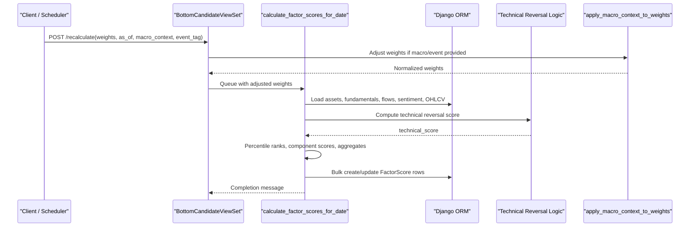

**Diagram sources**
- [views.py:178-218](file://apps/factors/views.py#L178-L218)
- [services.py:62-89](file://apps/macro/services.py#L62-L89)
- [tasks.py:283-460](file://apps/factors/tasks.py#L283-L460)
- [tasks.py:124-192](file://apps/factors/tasks.py#L124-L192)

## Detailed Component Analysis

### FactorScore Model
- Stores individual component scores:
  - PE percentile score, PE TTM percentile score, PB percentile score
  - ROE trend score
  - Main force flow score, margin flow score
  - Technical reversal score
  - Sentiment score
- Aggregates:
  - fundamental_score (average of PE TTM, PB, ROE trend)
  - capital_flow_score (average of main force flow, margin flow)
  - technical_score (reversal score)
- Weights:
  - financial_weight, flow_weight, technical_weight, sentiment_weight
- Outputs:
  - composite_score = weighted sum of aggregates
  - bottom_probability_score = composite clamped to [0, 1]
- Mode:
  - TECHNICAL, FUNDAMENTAL, COMPOSITE

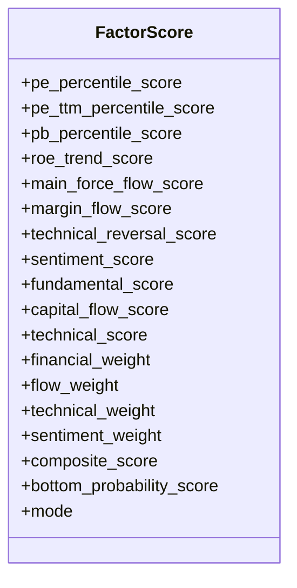

**Diagram sources**
- [models.py:124-176](file://apps/factors/models.py#L124-L176)

**Section sources**
- [models.py:124-176](file://apps/factors/models.py#L124-L176)

### Fundamental Component
- Percentile ranking:
  - For each metric (PE, PE TTM, PB), build a ranker over the universe.
  - Lower valuation multiples are better for “bottom” candidates; thus, PE/PE TTM/PB scores invert percentile rank: score = 1 - rank.
- ROE trend:
  - Derived from quarter-over-quarter ROE change, mapped into [0, 1] via a linear transformation centered around a reference range.
- Aggregate:
  - fundamental_score = average of PE TTM score, PB score, and ROE trend score.

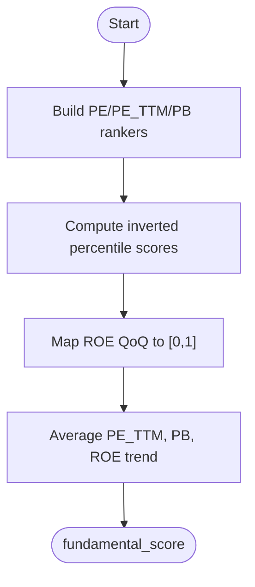

**Diagram sources**
- [tasks.py:321-379](file://apps/factors/tasks.py#L321-L379)

**Section sources**
- [tasks.py:321-379](file://apps/factors/tasks.py#L321-L379)

### Capital Flow Component
- Percentile ranking:
  - main_force_net_5d and margin_balance_change_5d are ranked across the universe.
  - Higher positive flow indicates stronger buying pressure; scores are direct percentile ranks.
- Aggregate:
  - capital_flow_score = average of main force flow score and margin flow score.

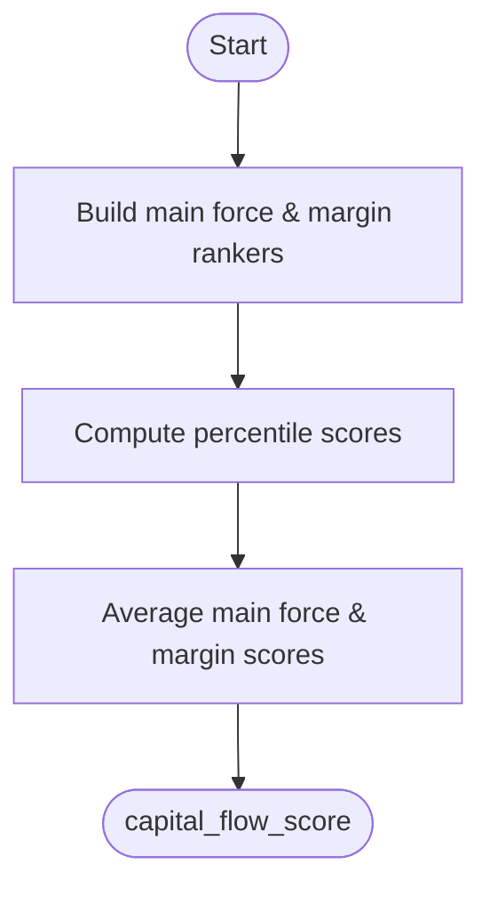

**Diagram sources**
- [tasks.py:336-385](file://apps/factors/tasks.py#L336-L385)

**Section sources**
- [tasks.py:336-385](file://apps/factors/tasks.py#L336-L385)

### Technical Component
- Inputs:
  - RSI (14-period)
  - Bollinger Bands (20-period, 2 standard deviations)
  - Recent volume (20-day average vs latest)
  - Signal events (oversold combination)
- Scoring blocks:
  - RSI oversold block: if RSI <= 35, add 0.35
  - Lower-band proximity block: if close <= lower_band * 1.03, add 0.25
  - Confirmed reversal block: if an oversold combination signal exists, or if RSI < 30 AND close <= lower_band * 1.02 AND volume below 80% of recent average, add 0.40
- Output:
  - technical_score = min(sum of blocks, 1.0)

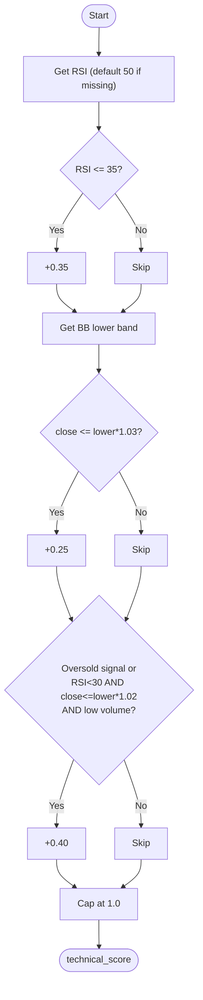

**Diagram sources**
- [tasks.py:124-192](file://apps/factors/tasks.py#L124-L192)
- [technical_guide.md:321-354](file://TECHNICAL_GUIDE.md#L321-L354)

**Section sources**
- [tasks.py:124-192](file://apps/factors/tasks.py#L124-L192)
- [technical_guide.md:321-354](file://TECHNICAL_GUIDE.md#L321-L354)

### Sentiment Component
- Input:
  - Latest 7-day asset sentiment score in [-1, 1].
- Mapping:
  - Normalize to [0, 1] via (raw + 1) / 2 and clamp to [0, 1].
- Default:
  - If no sentiment data, default to neutral 0.5.

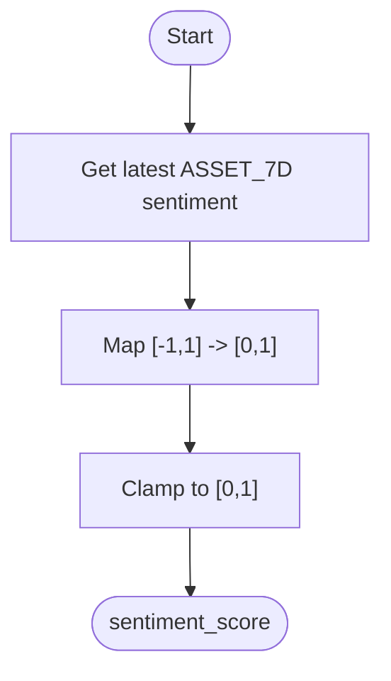

**Diagram sources**
- [tasks.py:85-98](file://apps/factors/tasks.py#L85-L98)

**Section sources**
- [tasks.py:85-98](file://apps/factors/tasks.py#L85-L98)

### Weighting System and Composite Calculation
- Parameters:
  - financial_weight, flow_weight, technical_weight, sentiment_weight
- Normalization:
  - Weights are normalized so they sum to 1. If total <= 0, defaults are used.
- Composite:
  - composite_score = fundamental_score * financial_weight + capital_flow_score * flow_weight + technical_score * technical_weight + sentiment_score * sentiment_weight
- Bottom probability:
  - bottom_probability_score = clamp(composite_score, 0, 1)

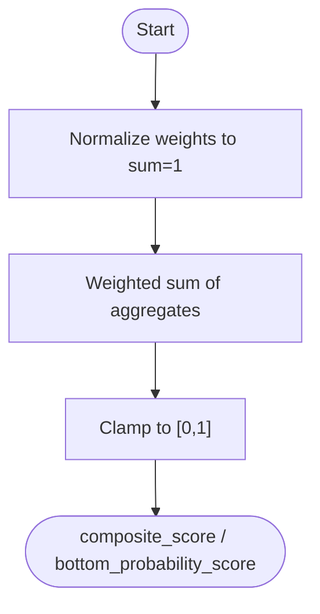

**Diagram sources**
- [tasks.py:296-308](file://apps/factors/tasks.py#L296-L308)
- [tasks.py:392-398](file://apps/factors/tasks.py#L392-L398)

**Section sources**
- [tasks.py:296-308](file://apps/factors/tasks.py#L296-L308)
- [tasks.py:392-398](file://apps/factors/tasks.py#L392-L398)

### Mode Variations
- Modes:
  - TECHNICAL: technical_score only
  - FUNDAMENTAL: fundamental_score only
  - COMPOSITE: full composite_score
- Query behavior:
  - The endpoint filters by mode and returns top candidates sorted by bottom_probability_score or alternative metrics.

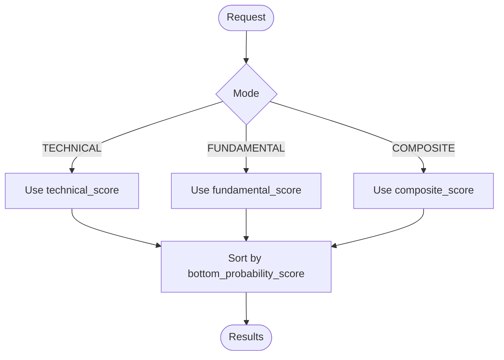

**Diagram sources**
- [views.py:54-79](file://apps/factors/views.py#L54-L79)

**Section sources**
- [views.py:54-79](file://apps/factors/views.py#L54-L79)

### Macro Context Weight Adjustment
- Purpose:
  - Adjust weights based on current macro phase and event tags before computing or rescored listing.
- Mechanism:
  - apply_macro_context_to_weights applies preset weights for a macro context and multiplicative event adjustments, then normalizes.
- Usage:
  - In list: optionally recompute adjusted scores for display without persisting changes.
  - In recalculate: pass adjusted weights to the scoring task.

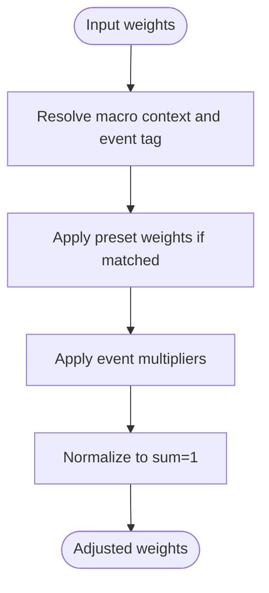

**Diagram sources**
- [services.py:62-89](file://apps/macro/services.py#L62-L89)
- [views.py:98-132](file://apps/factors/views.py#L98-L132)
- [views.py:178-218](file://apps/factors/views.py#L178-L218)

**Section sources**
- [services.py:62-89](file://apps/macro/services.py#L62-L89)
- [views.py:98-132](file://apps/factors/views.py#L98-L132)
- [views.py:178-218](file://apps/factors/views.py#L178-L218)

## Dependency Analysis
- Data dependencies:
  - FundamentalFactorSnapshot provides valuation and quality inputs.
  - CapitalFlowSnapshot provides flow momentum inputs.
  - SentimentScore provides sentiment input.
  - OHLCV and TechnicalIndicator support technical reversal logic.
- Service dependencies:
  - Macro services adjust weights dynamically.
- Persistence:
  - FactorScore records store all computed fields and metadata.

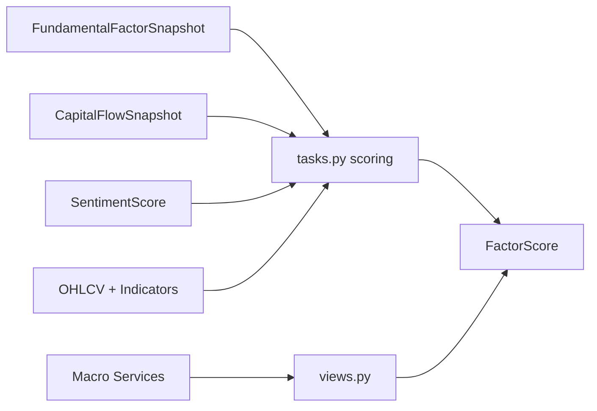

**Diagram sources**
- [tasks.py:316-319](file://apps/factors/tasks.py#L316-L319)
- [tasks.py:124-192](file://apps/factors/tasks.py#L124-L192)
- [services.py:62-89](file://apps/macro/services.py#L62-L89)
- [models.py:124-176](file://apps/factors/models.py#L124-L176)

**Section sources**
- [tasks.py:316-319](file://apps/factors/tasks.py#L316-L319)
- [tasks.py:124-192](file://apps/factors/tasks.py#L124-L192)
- [services.py:62-89](file://apps/macro/services.py#L62-L89)
- [models.py:124-176](file://apps/factors/models.py#L124-L176)

## Performance Considerations
- Batch processing:
  - Scores are created in batches to reduce database overhead.
- Efficient lookups:
  - Latest rows per asset are fetched efficiently using distinct ordering.
- Indicator computation:
  - Technical indicators use vectorized libraries and limited lookback windows to control cost.
- Weight normalization:
  - Avoids division-by-zero and ensures stable composites.

[No sources needed since this section provides general guidance]

## Troubleshooting Guide
- Missing data handling:
  - If fundamentals or flows are missing, component scores may be None; averages ignore None values and fall back to defaults where applicable.
  - Technical components default RSI to 50 when unavailable; missing BBANDS disables price-vs-band checks; insufficient OHLCV disables volume confirmation.
- Weight issues:
  - If total weights sum to zero or negative, defaults are applied automatically.
- Macro context:
  - Ensure active macro context and event tags are configured; otherwise, original weights are used.
- Query filtering:
  - Validate mode parameter and minimum score thresholds; invalid values are ignored gracefully.

**Section sources**
- [tasks.py:49-53](file://apps/factors/tasks.py#L49-L53)
- [tasks.py:124-192](file://apps/factors/tasks.py#L124-L192)
- [tasks.py:296-308](file://apps/factors/tasks.py#L296-L308)
- [views.py:54-79](file://apps/factors/views.py#L54-L79)

## Conclusion
The Composite Scoring Engine integrates multiple dimensions—valuation, flow, technical reversals, and sentiment—into a unified, interpretable score. Its design emphasizes robustness through percentile normalization, clear aggregation rules, configurable weighting, and macro-aware adjustments. The FactorScore model captures both granular components and final outputs, enabling flexible analysis across modes and scenarios.