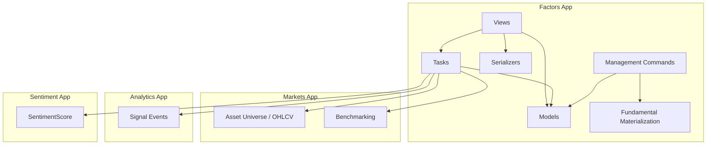
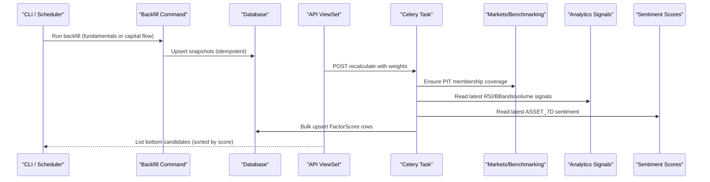
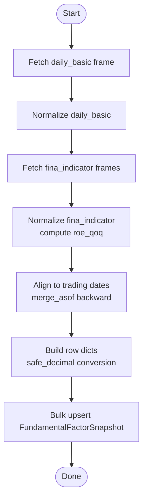
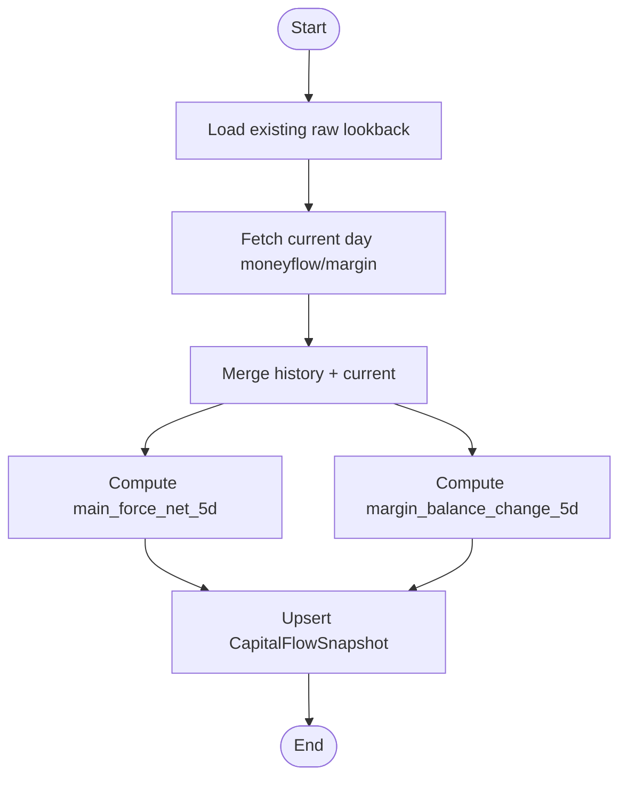
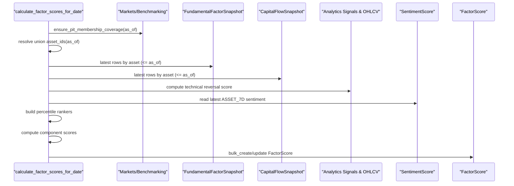
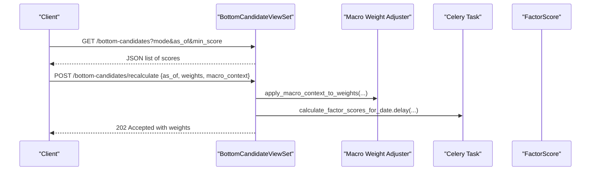
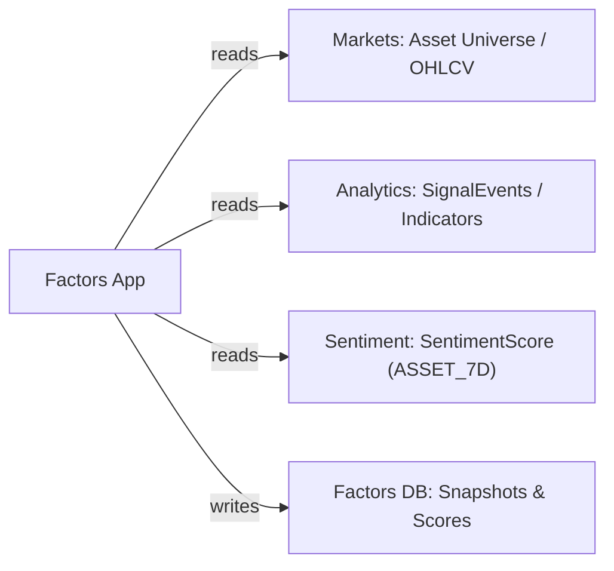

# Factors Application

<cite>
**Referenced Files in This Document**
- [models.py](file://apps/factors/models.py)
- [tasks.py](file://apps/factors/tasks.py)
- [fundamental_materialization.py](file://apps/factors/fundamental_materialization.py)
- [serializers.py](file://apps/factors/serializers.py)
- [views.py](file://apps/factors/views.py)
- [backfill_fundamental_snapshots.py](file://apps/factors/management/commands/backfill_fundamental_snapshots.py)
- [backfill_capital_flow_snapshots.py](file://apps/factors/management/commands/backfill_capital_flow_snapshots.py)
- [models.py](file://apps/sentiment/models.py)
- [models.py](file://apps/analytics/models.py)
- [benchmarking.py](file://apps/markets/benchmarking.py)
</cite>

## Table of Contents
1. [Introduction](#introduction)
2. [Project Structure](#project-structure)
3. [Core Components](#core-components)
4. [Architecture Overview](#architecture-overview)
5. [Detailed Component Analysis](#detailed-component-analysis)
6. [Dependency Analysis](#dependency-analysis)
7. [Performance Considerations](#performance-considerations)
8. [Troubleshooting Guide](#troubleshooting-guide)
9. [Conclusion](#conclusion)

## Introduction
The Factors application materializes fundamental, capital flow, and margin data into standardized daily snapshots, then computes composite factor scores that combine fundamentals, flows, technical signals, and sentiment. It exposes these results via REST APIs, supports asynchronous recalculation through Celery tasks, and provides management commands to backfill historical data from external providers. The app integrates with Markets (asset universe and OHLCV), Analytics (technical indicators and signal events), and Sentiment (asset-level sentiment aggregation) to produce unified bottom candidate rankings.

## Project Structure
The Factors app is organized around:
- Data models for snapshots and scores
- A fundamental materialization pipeline that transforms raw provider data into normalized snapshots
- Asynchronous tasks that compute factor scores and trigger backfills
- Management commands for historical backfill of fundamentals and capital flows
- Serializers and viewsets exposing the data and a screener endpoint
- Integration points to Markets, Analytics, and Sentiment apps

**Diagram sources**
- [models.py:7-176](file://apps/factors/models.py#L7-L176)
- [tasks.py:256-461](file://apps/factors/tasks.py#L256-L461)
- [views.py:29-218](file://apps/factors/views.py#L29-L218)
- [fundamental_materialization.py:123-190](file://apps/factors/fundamental_materialization.py#L123-L190)
- [backfill_fundamental_snapshots.py:40-171](file://apps/factors/management/commands/backfill_fundamental_snapshots.py#L40-L171)
- [backfill_capital_flow_snapshots.py:57-392](file://apps/factors/management/commands/backfill_capital_flow_snapshots.py#L57-L392)
- [benchmarking.py:1-200](file://apps/markets/benchmarking.py#L1-L200)
- [models.py:64-107](file://apps/sentiment/models.py#L64-L107)
- [models.py:198-255](file://apps/analytics/models.py#L198-L255)

**Section sources**
- [models.py:7-176](file://apps/factors/models.py#L7-L176)
- [tasks.py:256-461](file://apps/factors/tasks.py#L256-L461)
- [views.py:29-218](file://apps/factors/views.py#L29-L218)
- [fundamental_materialization.py:123-190](file://apps/factors/fundamental_materialization.py#L123-L190)
- [backfill_fundamental_snapshots.py:40-171](file://apps/factors/management/commands/backfill_fundamental_snapshots.py#L40-L171)
- [backfill_capital_flow_snapshots.py:57-392](file://apps/factors/management/commands/backfill_capital_flow_snapshots.py#L57-L392)
- [benchmarking.py:1-200](file://apps/markets/benchmarking.py#L1-L200)
- [models.py:64-107](file://apps/sentiment/models.py#L64-L107)
- [models.py:198-255](file://apps/analytics/models.py#L198-L255)

## Core Components
- FundamentalFactorSnapshot: Daily snapshot of valuation and size metrics plus ROE trend used for fundamental scoring.
- AssetMoneyFlowSnapshot and AssetMarginDetailSnapshot: Raw per-stock daily money flow and margin detail records.
- CapitalFlowSnapshot: Derived daily capital flow features (main force net over 5 days; margin balance change over 5 days).
- FactorScore: Composite score combining fundamental, capital flow, technical reversal, and sentiment components with configurable weights and a bottom probability output.

Key relationships:
- All snapshots are keyed by asset and date.
- FactorScore references the same asset and date and stores both component scores and aggregates.

**Section sources**
- [models.py:7-176](file://apps/factors/models.py#L7-L176)

## Architecture Overview
The system follows a layered architecture:
- Data ingestion layer: Management commands fetch raw data from TuShare and persist normalized snapshots.
- Feature computation layer: Tasks compute derived features and factor scores using point-in-time asset universes and cross-sectional ranking.
- API layer: ViewSets expose snapshots and a screener endpoint for bottom candidates, with optional macro-context weight adjustment and prediction enrichment.

**Diagram sources**
- [backfill_fundamental_snapshots.py:40-171](file://apps/factors/management/commands/backfill_fundamental_snapshots.py#L40-L171)
- [backfill_capital_flow_snapshots.py:57-392](file://apps/factors/management/commands/backfill_capital_flow_snapshots.py#L57-L392)
- [tasks.py:256-461](file://apps/factors/tasks.py#L256-L461)
- [views.py:45-218](file://apps/factors/views.py#L45-L218)
- [benchmarking.py:133-200](file://apps/markets/benchmarking.py#L133-L200)
- [models.py:198-255](file://apps/analytics/models.py#L198-L255)
- [models.py:64-107](file://apps/sentiment/models.py#L64-L107)

## Detailed Component Analysis

### Snapshot Models
- FundamentalFactorSnapshot: Stores PE, PE TTM, PB, share counts, market values, ROE, and ROE quarter-over-quarter change. Indexed by asset+date for efficient retrieval.
- AssetMoneyFlowSnapshot: Captures buy/sell amounts across size buckets and net main flow amount.
- AssetMarginDetailSnapshot: Captures financing and securities lending balances and volumes.
- CapitalFlowSnapshot: Aggregates main force net flow (5-day rolling sum) and margin balance change (5-day difference).

These models provide the foundation for cross-sectional ranking and feature derivation.

**Section sources**
- [models.py:7-122](file://apps/factors/models.py#L7-L122)

### Fundamental Materialization Pipeline
The pipeline normalizes raw provider frames into consistent fields and aligns them to trading dates:
- Normalization: Converts dates, ensures required columns exist, handles NaNs, and standardizes rate fields.
- Alignment: Uses backward merge-as-of to attach the most recent daily basic and financial indicator values to each trading date.
- Output: Produces rows suitable for bulk upsert into FundamentalFactorSnapshot.

**Diagram sources**
- [fundamental_materialization.py:61-121](file://apps/factors/fundamental_materialization.py#L61-L121)
- [fundamental_materialization.py:123-190](file://apps/factors/fundamental_materialization.py#L123-L190)
- [backfill_fundamental_snapshots.py:128-171](file://apps/factors/management/commands/backfill_fundamental_snapshots.py#L128-L171)

**Section sources**
- [fundamental_materialization.py:61-190](file://apps/factors/fundamental_materialization.py#L61-L190)
- [backfill_fundamental_snapshots.py:40-171](file://apps/factors/management/commands/backfill_fundamental_snapshots.py#L40-L171)

### Capital Flow Backfill and Derivation
- Raw ingestion: Persists AssetMoneyFlowSnapshot and AssetMarginDetailSnapshot with idempotent upserts.
- Derivation: Computes main_force_net_5d as a 5-day rolling sum of large/extra-large net flows; computes margin_balance_change_5d as a 5-day difference of total margin balance.
- Persistence: Upserts CapitalFlowSnapshot per trading date.

**Diagram sources**
- [backfill_capital_flow_snapshots.py:120-188](file://apps/factors/management/commands/backfill_capital_flow_snapshots.py#L120-L188)
- [backfill_capital_flow_snapshots.py:312-372](file://apps/factors/management/commands/backfill_capital_flow_snapshots.py#L312-L372)

**Section sources**
- [backfill_capital_flow_snapshots.py:57-392](file://apps/factors/management/commands/backfill_capital_flow_snapshots.py#L57-L392)

### Composite Score Calculation Engine
The engine computes a weighted composite score per asset per date:
- Inputs: Latest fundamental snapshot, latest capital flow snapshot, technical reversal score, and sentiment score.
- Ranking: Cross-sectional percentile ranks for PE, PE TTM, PB, main force flow, and margin balance change.
- Aggregation: Averages normalized component scores into fundamental_score and capital_flow_score; combines with technical and sentiment scores using normalized weights.
- Output: Stores component scores, weights, composite_score, and bottom_probability_score.

**Diagram sources**
- [tasks.py:283-461](file://apps/factors/tasks.py#L283-L461)
- [benchmarking.py:133-200](file://apps/markets/benchmarking.py#L133-L200)
- [models.py:124-176](file://apps/factors/models.py#L124-L176)
- [models.py:64-107](file://apps/sentiment/models.py#L64-L107)
- [models.py:198-255](file://apps/analytics/models.py#L198-L255)

**Section sources**
- [tasks.py:283-461](file://apps/factors/tasks.py#L283-L461)
- [models.py:124-176](file://apps/factors/models.py#L124-L176)

### API Exposure and Recalculation
- Snapshots: FundamentalFactorSnapshot and CapitalFlowSnapshot are exposed via ModelViewSets with authentication.
- Bottom Candidates: ReadOnlyModelViewSet lists FactorScore entries filtered by mode and date, with optional min_score threshold and sorting by trade_score or risk_reward_ratio when available.
- Recalculate: POST triggers asynchronous recalculation with macro-context-adjusted weights and returns acceptance response.

**Diagram sources**
- [views.py:29-218](file://apps/factors/views.py#L29-L218)
- [tasks.py:256-281](file://apps/factors/tasks.py#L256-L281)

**Section sources**
- [views.py:29-218](file://apps/factors/views.py#L29-L218)
- [serializers.py:6-45](file://apps/factors/serializers.py#L6-L45)

### Task Architecture for Asynchronous Processing
- sync_daily_capital_flow_snapshots: Orchestrates a recent window backfill via the management command path.
- calculate_factor_scores_for_date: Performs full scoring pipeline including universe resolution, feature reads, ranking, and bulk writes.

Both tasks use safe defaults, normalize inputs, and leverage bulk operations for performance.

**Section sources**
- [tasks.py:256-461](file://apps/factors/tasks.py#L256-L461)

### Management Commands for Historical Backfill
- backfill_fundamental_snapshots: Iterates assets and trading dates, fetches daily_basic and fina_indicator, materializes normalized rows, and upserts FundamentalFactorSnapshot with idempotent conflicts handling. Includes repair logic for stale ROE rows under the same announcement date.
- backfill_capital_flow_snapshots: Ingests moneyflow and margin_detail, persists raw snapshots, derives capital flow features, and upserts CapitalFlowSnapshot.

Both commands support date ranges, symbol filters, asset limits, and robust retry behavior against provider rate limits.

**Section sources**
- [backfill_fundamental_snapshots.py:40-265](file://apps/factors/management/commands/backfill_fundamental_snapshots.py#L40-L265)
- [backfill_capital_flow_snapshots.py:57-392](file://apps/factors/management/commands/backfill_capital_flow_snapshots.py#L57-L392)

### Serialization Patterns for API Exposure
- FundamentalFactorSnapshotSerializer: Exposes core fundamental fields and asset symbol.
- CapitalFlowSnapshotSerializer: Exposes derived capital flow features and asset symbol.
- FactorScoreSerializer: Exposes component scores, weights, composite and bottom probability scores, and asset metadata.

These serializers enable consistent JSON responses for clients and dashboards.

**Section sources**
- [serializers.py:6-45](file://apps/factors/serializers.py#L6-L45)

## Dependency Analysis
The Factors app depends on:
- Markets: Point-in-time effective universe and OHLCV data for technical computations.
- Analytics: Signal events and technical indicators for technical reversal scoring.
- Sentiment: Asset-level 7-day sentiment aggregation for sentiment weighting.

**Diagram sources**
- [tasks.py:14-19](file://apps/factors/tasks.py#L14-L19)
- [benchmarking.py:1-200](file://apps/markets/benchmarking.py#L1-L200)
- [models.py:198-255](file://apps/analytics/models.py#L198-L255)
- [models.py:64-107](file://apps/sentiment/models.py#L64-L107)

**Section sources**
- [tasks.py:14-19](file://apps/factors/tasks.py#L14-L19)
- [benchmarking.py:1-200](file://apps/markets/benchmarking.py#L1-L200)
- [models.py:198-255](file://apps/analytics/models.py#L198-L255)
- [models.py:64-107](file://apps/sentiment/models.py#L64-L107)

## Performance Considerations
- Batch writes: Bulk create with update_conflicts and unique_fields ensures idempotent upserts at scale.
- Lookback windows: Technical computations limit row counts to reduce memory and CPU usage.
- Cross-sectional ranking: Pre-sorted value sets enable O(log n) percentile ranking per asset.
- Point-in-time filtering: Ensures only valid constituents are scored for a given date, avoiding unnecessary work.
- Provider rate limiting: Commands implement retries and sleeps to handle external API constraints.

[No sources needed since this section provides general guidance]

## Troubleshooting Guide
Common issues and resolutions:
- Missing point-in-time membership coverage: Ensure IndexMembership history is backfilled before scoring runs.
- Provider rate limits: Commands include retry loops; adjust sleep settings if necessary.
- Stale ROE alignment: Use the repair flag to reprocess assets where stored ROE rows point to older report_end_dates for the same announcement date.
- Empty or incomplete snapshots: Verify upstream data availability and run targeted backfills for specific symbols or date ranges.

**Section sources**
- [benchmarking.py:133-146](file://apps/markets/benchmarking.py#L133-L146)
- [backfill_fundamental_snapshots.py:40-126](file://apps/factors/management/commands/backfill_fundamental_snapshots.py#L40-L126)
- [backfill_capital_flow_snapshots.py:66-118](file://apps/factors/management/commands/backfill_capital_flow_snapshots.py#L66-L118)

## Conclusion
The Factors application provides a robust pipeline for transforming raw market and fundamental data into standardized snapshots and composite factor scores. It integrates seamlessly with Markets, Analytics, and Sentiment to deliver unified bottom candidate rankings, supports asynchronous recalculations, and offers comprehensive backfill tools for historical data maintenance. Its design emphasizes idempotency, performance, and clear integration boundaries across apps.