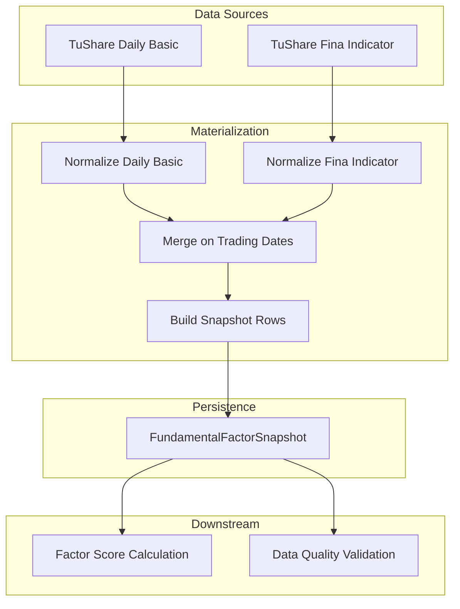
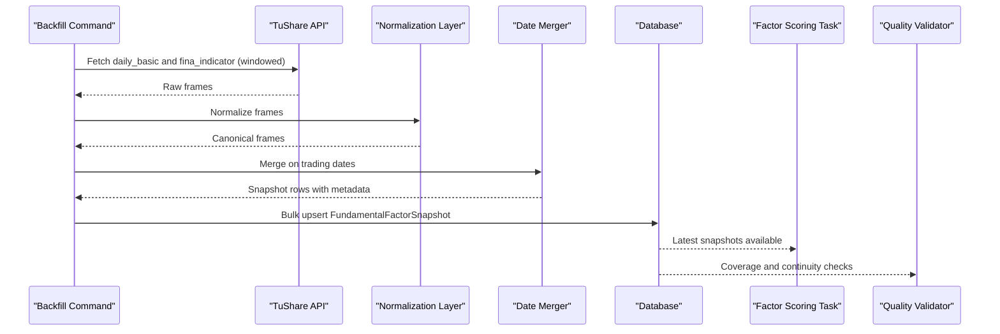
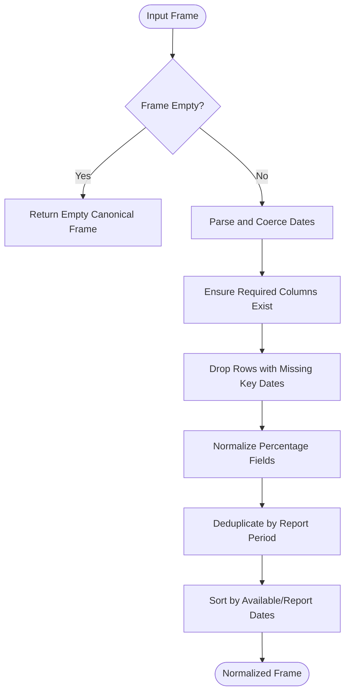
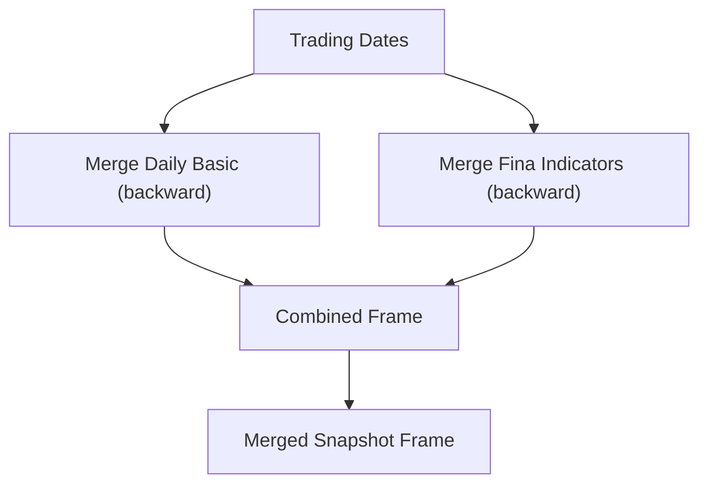
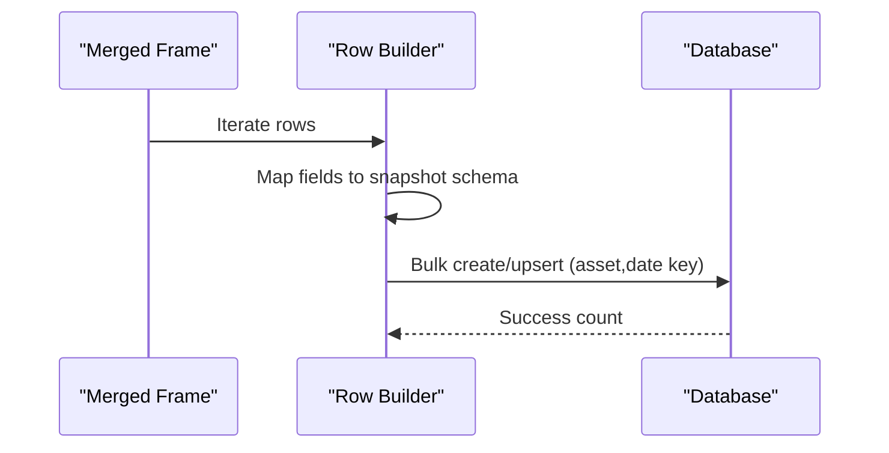
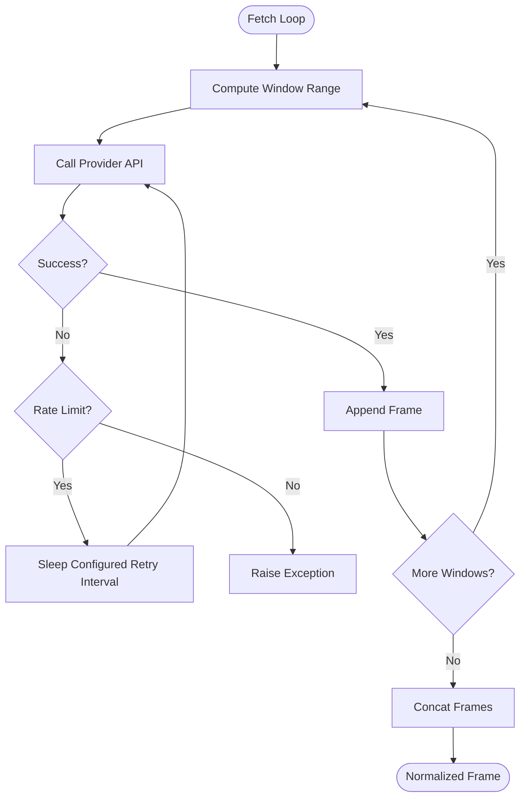
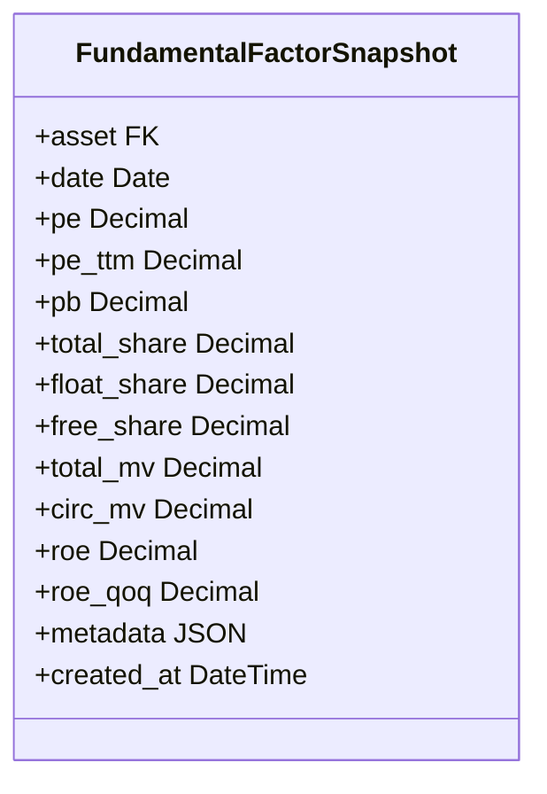
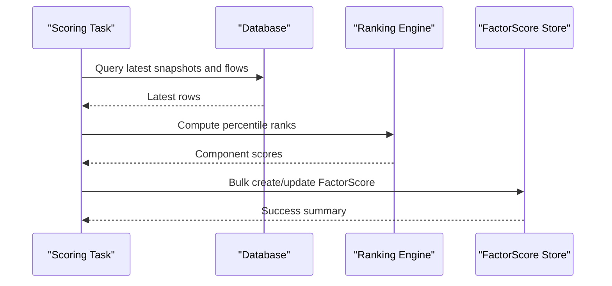
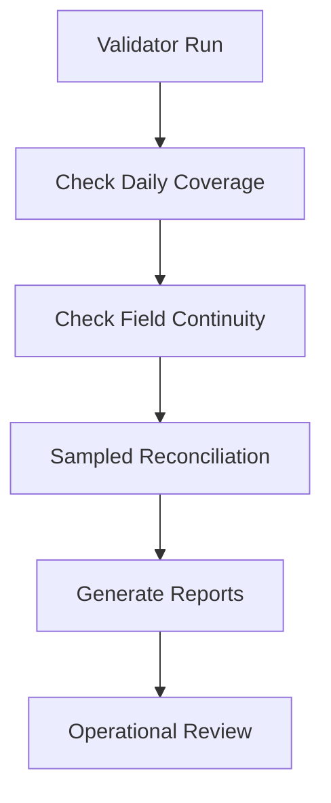
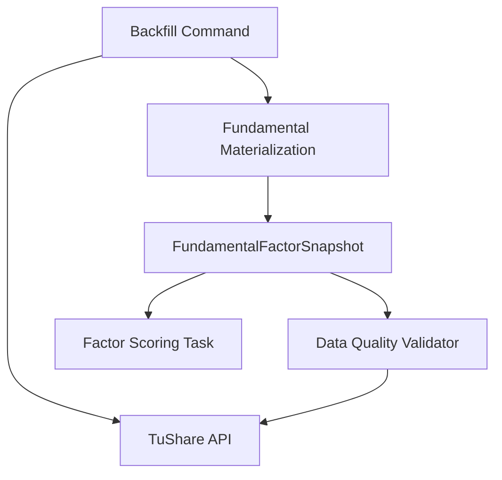

# Fundamental Materialization Process

<cite>
**Referenced Files in This Document**
- [fundamental_materialization.py](file://apps/factors/fundamental_materialization.py)
- [models.py](file://apps/factors/models.py)
- [backfill_fundamental_snapshots.py](file://apps/factors/management/commands/backfill_fundamental_snapshots.py)
- [tasks.py](file://apps/factors/tasks.py)
- [validate_data_quality.py](file://apps/core/management/commands/validate_data_quality.py)
- [base.py](file://config/settings/base.py)
</cite>

## Table of Contents
1. [Introduction](#introduction)
2. [Project Structure](#project-structure)
3. [Core Components](#core-components)
4. [Architecture Overview](#architecture-overview)
5. [Detailed Component Analysis](#detailed-component-analysis)
6. [Dependency Analysis](#dependency-analysis)
7. [Performance Considerations](#performance-considerations)
8. [Troubleshooting Guide](#troubleshooting-guide)
9. [Conclusion](#conclusion)
10. [Appendices](#appendices)

## Introduction
This document describes the Fundamental Materialization Process that transforms raw fundamental data into standardized snapshots used for factor scoring. It explains how daily valuation and financial indicator data are normalized, merged onto trading dates, validated, and persisted as consistent FundamentalFactorSnapshot records. It also covers error handling strategies for missing or invalid data, batch processing patterns for efficient bulk operations, configuration options for materialization parameters, and monitoring capabilities to track success rates and data quality.

## Project Structure
The fundamental materialization pipeline spans several modules:
- Data normalization and merging logic is implemented in a dedicated module under the factors app.
- A management command orchestrates fetching from upstream providers (TuShare), normalizing frames, and persisting snapshots.
- The database schema defines the target snapshot model and related models consumed by downstream scoring.
- Tasks compute derived scores using the stored snapshots.
- A data quality validator provides monitoring and reconciliation against upstream sources.

**Diagram sources**
- [backfill_fundamental_snapshots.py:128-171](file://apps/factors/management/commands/backfill_fundamental_snapshots.py#L128-L171)
- [fundamental_materialization.py:61-165](file://apps/factors/fundamental_materialization.py#L61-L165)
- [models.py:7-36](file://apps/factors/models.py#L7-L36)
- [tasks.py:283-460](file://apps/factors/tasks.py#L283-L460)
- [validate_data_quality.py:119-145](file://apps/core/management/commands/validate_data_quality.py#L119-L145)

**Section sources**
- [backfill_fundamental_snapshots.py:40-126](file://apps/factors/management/commands/backfill_fundamental_snapshots.py#L40-L126)
- [fundamental_materialization.py:7-190](file://apps/factors/fundamental_materialization.py#L7-L190)
- [models.py:7-36](file://apps/factors/models.py#L7-L36)
- [tasks.py:283-460](file://apps/factors/tasks.py#L283-L460)
- [validate_data_quality.py:119-145](file://apps/core/management/commands/validate_data_quality.py#L119-L145)

## Core Components
- Normalization utilities convert raw provider frames into consistent schemas with robust handling of missing values and date formats.
- Merging aligns normalized daily basic metrics and financial indicators to each trading date using time-aware joins.
- Row builders transform merged frames into domain-specific snapshot rows ready for persistence.
- The management command coordinates asset selection, windowed upstream fetches, and bulk upserts.
- The database model enforces uniqueness per asset-date and indexes for efficient queries.
- Downstream tasks consume these snapshots to compute factor scores and probabilities.
- The data quality validator monitors coverage, continuity, and reconciles stored values against upstream sources.

**Section sources**
- [fundamental_materialization.py:20-190](file://apps/factors/fundamental_materialization.py#L20-L190)
- [backfill_fundamental_snapshots.py:128-171](file://apps/factors/management/commands/backfill_fundamental_snapshots.py#L128-L171)
- [models.py:7-36](file://apps/factors/models.py#L7-L36)
- [tasks.py:283-460](file://apps/factors/tasks.py#L283-L460)
- [validate_data_quality.py:119-145](file://apps/core/management/commands/validate_data_quality.py#L119-L145)

## Architecture Overview
The materialization pipeline follows a clear sequence:
1. Identify assets and their trading dates within the requested range.
2. Fetch raw daily basic and fina_indicator data from TuShare, applying rate-limit retries and windowing.
3. Normalize both datasets into canonical columns and types; handle missing dates and values safely.
4. Merge normalized series onto trading dates using backward-looking joins so each trading day carries the latest available fundamentals.
5. Build snapshot rows with metadata capturing source timestamps for traceability.
6. Persist via bulk upserts keyed by asset and date, updating existing rows when necessary.
7. Downstream processes read the latest snapshots to compute factor scores and probabilities.
8. Data quality validation continuously checks coverage and reconciles stored values against upstream sources.

**Diagram sources**
- [backfill_fundamental_snapshots.py:128-171](file://apps/factors/management/commands/backfill_fundamental_snapshots.py#L128-L171)
- [fundamental_materialization.py:61-165](file://apps/factors/fundamental_materialization.py#L61-L165)
- [tasks.py:283-460](file://apps/factors/tasks.py#L283-L460)
- [validate_data_quality.py:119-145](file://apps/core/management/commands/validate_data_quality.py#L119-L145)

## Detailed Component Analysis

### Data Normalization and Validation
- Safe decimal conversion handles None, empty strings, NaN-like values, and non-numeric inputs gracefully, returning None for invalid entries.
- Rate normalization standardizes percentage-like fields (e.g., ROE) across different provider scales by detecting magnitude thresholds and scaling accordingly.
- Date parsing tolerates multiple formats and coerces invalid dates to NaT, ensuring robustness against inconsistent upstream formatting.
- Column presence checks ensure all required fields exist in normalized frames, filling missing columns with None where appropriate.
- Duplicate handling keeps the most recent report per report period for financial indicators, preventing stale values from overriding newer announcements.

**Diagram sources**
- [fundamental_materialization.py:20-120](file://apps/factors/fundamental_materialization.py#L20-L120)

**Section sources**
- [fundamental_materialization.py:20-120](file://apps/factors/fundamental_materialization.py#L20-L120)

### Merging onto Trading Dates
- Trading dates are deduplicated and sorted to form the base timeline.
- Daily basic metrics are joined using a backward-looking merge so each trading date receives the latest available valuation metrics.
- Financial indicators are similarly merged using announcement availability dates, preserving point-in-time correctness.
- When either dataset is empty, placeholders are inserted to maintain row integrity for downstream consumers.

**Diagram sources**
- [fundamental_materialization.py:123-165](file://apps/factors/fundamental_materialization.py#L123-L165)

**Section sources**
- [fundamental_materialization.py:123-165](file://apps/factors/fundamental_materialization.py#L123-L165)

### Row Building and Persistence
- Each merged row is transformed into a dictionary representing a FundamentalFactorSnapshot record, including metadata about source dates for auditability.
- Bulk creation uses upsert semantics keyed by asset and date, updating existing records when new data arrives.
- Batch size is tuned for performance while maintaining transactional efficiency.

**Diagram sources**
- [fundamental_materialization.py:168-190](file://apps/factors/fundamental_materialization.py#L168-L190)
- [backfill_fundamental_snapshots.py:135-171](file://apps/factors/management/commands/backfill_fundamental_snapshots.py#L135-L171)

**Section sources**
- [fundamental_materialization.py:168-190](file://apps/factors/fundamental_materialization.py#L168-L190)
- [backfill_fundamental_snapshots.py:135-171](file://apps/factors/management/commands/backfill_fundamental_snapshots.py#L135-L171)

### Upstream Fetching and Error Handling
- Windowed fetching for financial indicators avoids large payloads and respects provider limits.
- Rate limiting is handled with configurable sleep intervals and retry loops; specific rate limit errors trigger backoff before reattempting.
- Token validation ensures the upstream provider is configured before execution.
- Asset scoping allows selective runs for symbols or limited sets during testing or targeted repairs.

**Diagram sources**
- [backfill_fundamental_snapshots.py:213-245](file://apps/factors/management/commands/backfill_fundamental_snapshots.py#L213-L245)
- [backfill_fundamental_snapshots.py:247-265](file://apps/factors/management/commands/backfill_fundamental_snapshots.py#L247-L265)

**Section sources**
- [backfill_fundamental_snapshots.py:213-265](file://apps/factors/management/commands/backfill_fundamental_snapshots.py#L213-L265)

### Database Model and Indexing
- FundamentalFactorSnapshot stores valuation and profitability metrics per asset per date with precise decimal precision.
- Unique constraints prevent duplicate entries per asset-date pair.
- Indexes optimize queries by asset-date combinations and by date alone, supporting efficient retrieval for scoring and validation.

**Diagram sources**
- [models.py:7-36](file://apps/factors/models.py#L7-L36)

**Section sources**
- [models.py:7-36](file://apps/factors/models.py#L7-L36)

### Downstream Factor Scoring
- Factor scoring reads the latest FundamentalFactorSnapshot rows per asset as-of a target date.
- Percentile ranking is computed across cross-sectional fields to derive component scores.
- Composite scores combine fundamental, capital flow, technical, and sentiment components using configurable weights.
- Results are persisted in bulk with conflict resolution to avoid duplicates.

**Diagram sources**
- [tasks.py:283-460](file://apps/factors/tasks.py#L283-L460)

**Section sources**
- [tasks.py:283-460](file://apps/factors/tasks.py#L283-L460)

### Monitoring and Data Quality
- The data quality validator tracks daily coverage for fundamental snapshots and capital flow snapshots.
- Continuity checks identify gaps in essential fields like PE, PE_TTM, PB, ROE, and ROE_QOQ relative to OHLCV-backed baseline dates.
- Reconciliation audits sample stored fundamental values and recompute them from upstream sources to detect drift or misalignment.
- Reports include summaries and detailed CSV outputs for operational review.

**Diagram sources**
- [validate_data_quality.py:119-145](file://apps/core/management/commands/validate_data_quality.py#L119-L145)

**Section sources**
- [validate_data_quality.py:119-145](file://apps/core/management/commands/validate_data_quality.py#L119-L145)

## Dependency Analysis
- The materialization module depends on pandas for frame manipulation and datetime handling.
- The backfill command depends on TuShare for upstream data and Django ORM for persistence.
- Scoring tasks depend on stored snapshots and additional signals/indicators to compute composite scores.
- Data quality validation depends on both stored snapshots and upstream providers to reconcile values.

**Diagram sources**
- [backfill_fundamental_snapshots.py:128-171](file://apps/factors/management/commands/backfill_fundamental_snapshots.py#L128-L171)
- [fundamental_materialization.py:61-165](file://apps/factors/fundamental_materialization.py#L61-L165)
- [tasks.py:283-460](file://apps/factors/tasks.py#L283-L460)
- [validate_data_quality.py:119-145](file://apps/core/management/commands/validate_data_quality.py#L119-L145)

**Section sources**
- [backfill_fundamental_snapshots.py:128-171](file://apps/factors/management/commands/backfill_fundamental_snapshots.py#L128-L171)
- [fundamental_materialization.py:61-165](file://apps/factors/fundamental_materialization.py#L61-L165)
- [tasks.py:283-460](file://apps/factors/tasks.py#L283-L460)
- [validate_data_quality.py:119-145](file://apps/core/management/commands/validate_data_quality.py#L119-L145)

## Performance Considerations
- Windowed fetching reduces payload sizes and mitigates provider rate limits.
- Backward merges preserve point-in-time correctness without requiring complex lookups.
- Bulk upserts minimize database round-trips and leverage unique constraints for idempotent updates.
- Decimal arithmetic ensures precision for financial metrics while avoiding floating-point drift.
- Indexes on asset-date pairs accelerate downstream queries for scoring and validation.

[No sources needed since this section provides general guidance]

## Troubleshooting Guide
- Missing upstream token: The backfill command validates the provider token and raises an explicit error if not configured.
- Rate limit errors: The command implements retry logic with configurable sleep intervals; monitor logs for repeated retries indicating persistent throttling.
- Incomplete snapshots: Use the data quality validator to identify gaps in fundamental coverage and field continuity; focus on assets with missing core fields such as PE, PE_TTM, PB, ROE, and ROE_QOQ.
- Stale ROE alignment: The command includes a repair mode to reprocess assets where stored ROE rows reference older report periods for the same announcement date.
- Scoring anomalies: Verify that latest snapshots exist for target dates and that percentile rankings have sufficient cross-sectional coverage.

**Section sources**
- [backfill_fundamental_snapshots.py:55-77](file://apps/factors/management/commands/backfill_fundamental_snapshots.py#L55-L77)
- [backfill_fundamental_snapshots.py:247-265](file://apps/factors/management/commands/backfill_fundamental_snapshots.py#L247-L265)
- [validate_data_quality.py:119-145](file://apps/core/management/commands/validate_data_quality.py#L119-L145)

## Conclusion
The Fundamental Materialization Process provides a robust, auditable pipeline that converts raw fundamental data into standardized snapshots suitable for factor scoring. Through careful normalization, point-in-time merging, resilient upstream fetching, and efficient persistence, it ensures high-quality inputs for downstream analytics. Monitoring and reconciliation capabilities enable operators to track success rates, detect gaps, and maintain data integrity over time.

[No sources needed since this section summarizes without analyzing specific files]

## Appendices

### Configuration Options
- Provider token: Configured via environment settings and read at runtime by commands and validators.
- Request and retry sleeps: Control pacing and backoff behavior for upstream API calls.
- Lookback windows: Define how far back financial indicators are fetched to support reporting periods.
- Capital flow sync lookback: Controls the number of days synced for capital flow snapshots.

**Section sources**
- [base.py:30](file://config/settings/base.py#L30)
- [backfill_fundamental_snapshots.py:75-77](file://apps/factors/management/commands/backfill_fundamental_snapshots.py#L75-L77)
- [tasks.py:262-267](file://apps/factors/tasks.py#L262-L267)