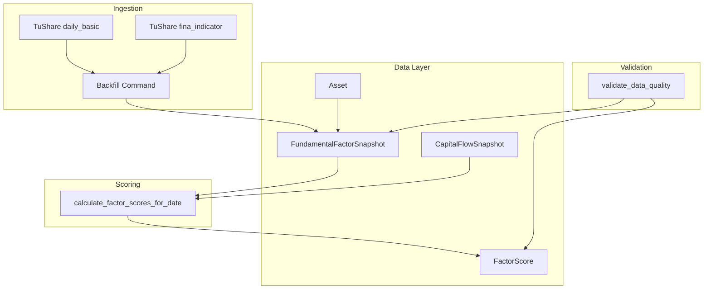
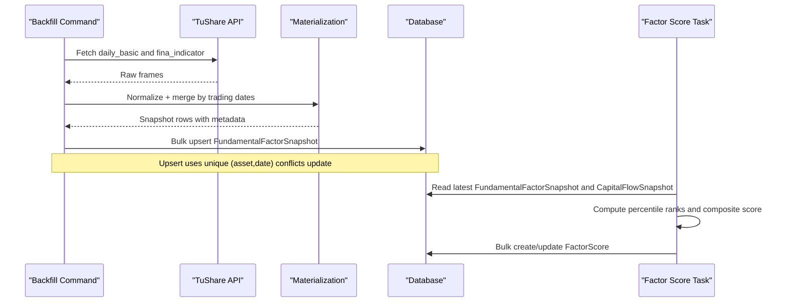
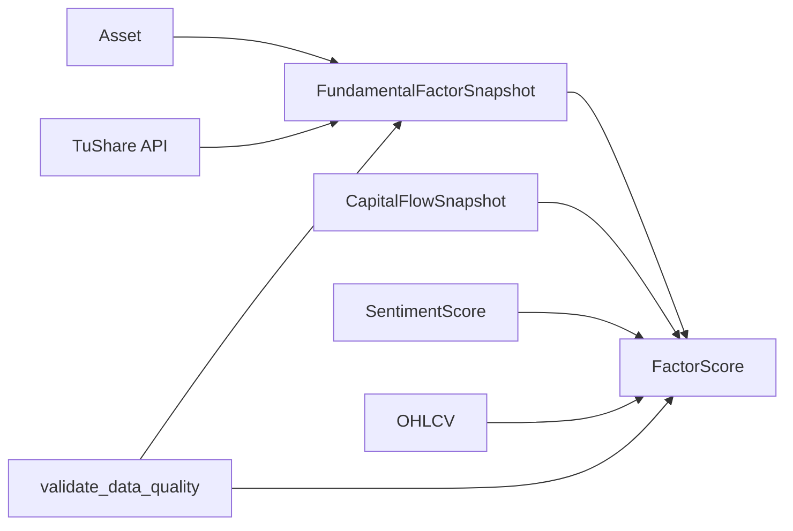

# Fundamental Snapshots

<cite>
**Referenced Files in This Document**
- [models.py](file://apps/factors/models.py)
- [tasks.py](file://apps/factors/tasks.py)
- [backfill_fundamental_snapshots.py](file://apps/factors/management/commands/backfill_fundamental_snapshots.py)
- [fundamental_materialization.py](file://apps/factors/fundamental_materialization.py)
- [validate_data_quality.py](file://apps/core/management/commands/validate_data_quality.py)
- [0005_fundamentalfactorsnapshot_market_cap_fields.py](file://apps/factors/migrations/0005_fundamentalfactorsnapshot_market_cap_fields.py)
- [0006_add_pe_ttm_fields.py](file://apps/factors/migrations/0006_add_pe_ttm_fields.py)
- [metrics.md](file://docs/reference/metrics.md)
</cite>

## Table of Contents
1. [Introduction](#introduction)
2. [Project Structure](#project-structure)
3. [Core Components](#core-components)
4. [Architecture Overview](#architecture-overview)
5. [Detailed Component Analysis](#detailed-component-analysis)
6. [Dependency Analysis](#dependency-analysis)
7. [Performance Considerations](#performance-considerations)
8. [Troubleshooting Guide](#troubleshooting-guide)
9. [Conclusion](#conclusion)

## Introduction
This document explains the Fundamental Snapshots component that stores daily fundamental data snapshots used for factor scoring. It focuses on the FundamentalFactorSnapshot model, the TuShare-based ingestion pipeline, backfill procedures, and how these snapshots feed into composite factor calculations. It also provides guidance on interpreting fundamental metrics, validating data quality, and optimizing performance for large-scale storage.

## Project Structure
The Fundamental Snapshots feature lives under the factors application and integrates with markets, analytics, sentiment, and core validation utilities:
- Data model: FundamentalFactorSnapshot and related snapshot models
- Ingestion: Management command to backfill from TuShare daily_basic and fina_indicator
- Materialization: Normalization and as-of merging logic for daily fundamentals and financial indicators
- Scoring: Celery task that computes percentile ranks and composite scores using stored snapshots
- Validation: Data quality checks covering continuity, nulls, and upstream reconciliation

**Diagram sources**
- [models.py:7-36](file://apps/factors/models.py#L7-L36)
- [backfill_fundamental_snapshots.py:40-171](file://apps/factors/management/commands/backfill_fundamental_snapshots.py#L40-L171)
- [tasks.py:283-460](file://apps/factors/tasks.py#L283-L460)
- [validate_data_quality.py:426-715](file://apps/core/management/commands/validate_data_quality.py#L426-L715)

**Section sources**
- [models.py:7-36](file://apps/factors/models.py#L7-L36)
- [backfill_fundamental_snapshots.py:40-171](file://apps/factors/management/commands/backfill_fundamental_snapshots.py#L40-L171)
- [tasks.py:283-460](file://apps/factors/tasks.py#L283-L460)
- [validate_data_quality.py:426-715](file://apps/core/management/commands/validate_data_quality.py#L426-L715)

## Core Components
- FundamentalFactorSnapshot: Daily per-asset snapshot storing valuation, size, and profitability fields plus metadata about source dates.
- CapitalFlowSnapshot: Daily per-asset capital flow features used alongside fundamentals in scoring.
- FactorScore: Aggregated daily scores (fundamental, flow, technical, sentiment) and a composite score used for ranking and probability estimation.

Key relationships:
- Each FundamentalFactorSnapshot row is tied to an Asset via a foreign key and a unique (asset, date) constraint.
- FactorScore rows are computed from the latest available FundamentalFactorSnapshot and CapitalFlowSnapshot as of each trading date.

**Section sources**
- [models.py:7-36](file://apps/factors/models.py#L7-L36)
- [models.py:100-121](file://apps/factors/models.py#L100-L121)
- [models.py:124-176](file://apps/factors/models.py#L124-L176)

## Architecture Overview
The system ingests raw TuShare data, normalizes it, materializes point-in-time snapshots per trading day, and then computes cross-sectional percentile ranks to produce composite scores.

**Diagram sources**
- [backfill_fundamental_snapshots.py:128-171](file://apps/factors/management/commands/backfill_fundamental_snapshots.py#L128-L171)
- [fundamental_materialization.py:123-190](file://apps/factors/fundamental_materialization.py#L123-L190)
- [tasks.py:283-460](file://apps/factors/tasks.py#L283-L460)

## Detailed Component Analysis

### FundamentalFactorSnapshot Model
- Fields include PE, PE TTM, PB, total share, float share, free share, total market value, circulating market value, ROE, and ROE quarter-over-quarter change.
- Metadata records source trade and announcement dates for traceability.
- Unique constraint on (asset, date) ensures one snapshot per asset per day; indexes optimize queries by asset/date and date-only scans.

Model evolution:
- Market-cap and share fields were added to support size and liquidity analysis.
- PE TTM was added to enable trailing-twelve-month valuation scoring.

Interpretation notes:
- Lower PE or PB generally indicates cheaper valuation relative to peers; higher ROE indicates stronger profitability; positive ROE QoQ suggests improving earnings momentum.
- Share and market cap fields help control for size effects and liquidity when ranking assets.

**Section sources**
- [models.py:7-36](file://apps/factors/models.py#L7-L36)
- [0005_fundamentalfactorsnapshot_market_cap_fields.py:10-35](file://apps/factors/migrations/0005_fundamentalfactorsnapshot_market_cap_fields.py#L10-L35)
- [0006_add_pe_ttm_fields.py:10-20](file://apps/factors/migrations/0006_add_pe_ttm_fields.py#L10-L20)

### Data Ingestion Pipeline from TuShare
- The backfill command iterates assets and their trading dates within a configured range.
- For each asset, it fetches:
  - daily_basic: valuation and size fields
  - fina_indicator: ROE series with announcement and report end dates
- Frames are normalized and merged against trading dates using as-of joins so that each trading day carries the most recent available fundamentals.
- Rows are bulk upserted with conflict resolution on (asset, date), updating all relevant fields and metadata.

Robustness:
- Rate-limit handling retries with configurable sleep when encountering provider throttling.
- Optional repair mode detects stale same-announcement ROE rows and reprocesses affected assets.

**Section sources**
- [backfill_fundamental_snapshots.py:40-171](file://apps/factors/management/commands/backfill_fundamental_snapshots.py#L40-L171)
- [backfill_fundamental_snapshots.py:213-265](file://apps/factors/management/commands/backfill_fundamental_snapshots.py#L213-L265)

### Materialization and As-of Logic
- Normalizers convert provider columns to standardized names and types, including safe decimal conversion and rate normalization for ROE.
- Financial indicator frames are deduplicated by report end date and sorted by availability and report periods.
- As-of merges align daily valuation data and financial indicators to each trading date, preserving source dates in metadata for auditability.

Complexity considerations:
- Date windowing splits long ranges into manageable chunks for API calls.
- Sorting and deduplication ensure deterministic selection of the latest financial report for each period.

**Section sources**
- [fundamental_materialization.py:20-43](file://apps/factors/fundamental_materialization.py#L20-L43)
- [fundamental_materialization.py:45-59](file://apps/factors/fundamental_materialization.py#L45-L59)
- [fundamental_materialization.py:61-120](file://apps/factors/fundamental_materialization.py#L61-L120)
- [fundamental_materialization.py:123-190](file://apps/factors/fundamental_materialization.py#L123-L190)

### Backfill Procedures for Historical Data
- Determines floor date and parses start/end dates; enforces ordering constraints.
- Skips assets already complete unless repair mode is enabled.
- For each asset, builds rows via materialization and persists them in batches with conflict updates.

Operational tips:
- Use symbols filter to target specific assets during testing.
- Limit assets for quick validation runs.
- Monitor logs for rate-limit retries and skipped assets.

**Section sources**
- [backfill_fundamental_snapshots.py:54-126](file://apps/factors/management/commands/backfill_fundamental_snapshots.py#L54-L126)
- [backfill_fundamental_snapshots.py:128-171](file://apps/factors/management/commands/backfill_fundamental_snapshots.py#L128-L171)

### Composite Factor Calculation Using Snapshots
- Retrieves the latest FundamentalFactorSnapshot and CapitalFlowSnapshot for each asset as of the target date.
- Computes percentile ranks across the cross-section for PE, PE TTM, PB, and capital flow metrics.
- Derives fundamental and capital flow sub-scores, combines with technical and sentiment scores using configurable weights, and writes FactorScore rows.

Scoring highlights:
- Percentile rankers handle missing values gracefully.
- Weights are normalized to sum to one; defaults are applied if invalid.
- Batched upserts avoid duplicate work and keep scores idempotent.

**Section sources**
- [tasks.py:40-69](file://apps/factors/tasks.py#L40-L69)
- [tasks.py:72-98](file://apps/factors/tasks.py#L72-L98)
- [tasks.py:283-460](file://apps/factors/tasks.py#L283-L460)

### Data Quality Validation
- Validates continuity and null coverage for fundamental fields across trading dates.
- Produces detailed reports identifying gaps, anomalies, and mismatches between stored snapshots and recomputed values from upstream TuShare data.
- Supports sampling second-layer audits to reconcile stored values with provider data.

Quality signals:
- Non-null counts and ranges for fundamental fields provide baseline expectations.
- Gap reports highlight missing windows and potential upstream issues.

**Section sources**
- [validate_data_quality.py:88-112](file://apps/core/management/commands/validate_data_quality.py#L88-L112)
- [validate_data_quality.py:174-215](file://apps/core/management/commands/validate_data_quality.py#L174-L215)
- [validate_data_quality.py:426-715](file://apps/core/management/commands/validate_data_quality.py#L426-L715)
- [metrics.md:140-188](file://docs/reference/metrics.md#L140-L188)

## Dependency Analysis
- FundamentalFactorSnapshot depends on Asset for identity and lifecycle context.
- Backfill depends on OHLCV to determine trading dates and on TuShare APIs for raw data.
- Scoring depends on FundamentalFactorSnapshot, CapitalFlowSnapshot, SentimentScore, and OHLCV-derived technical indicators.
- Validation depends on multiple tables to assess coverage and consistency.

**Diagram sources**
- [models.py:7-36](file://apps/factors/models.py#L7-L36)
- [models.py:100-121](file://apps/factors/models.py#L100-L121)
- [models.py:124-176](file://apps/factors/models.py#L124-L176)
- [backfill_fundamental_snapshots.py:128-171](file://apps/factors/management/commands/backfill_fundamental_snapshots.py#L128-L171)
- [tasks.py:283-460](file://apps/factors/tasks.py#L283-L460)
- [validate_data_quality.py:426-715](file://apps/core/management/commands/validate_data_quality.py#L426-L715)

**Section sources**
- [models.py:7-36](file://apps/factors/models.py#L7-L36)
- [tasks.py:283-460](file://apps/factors/tasks.py#L283-L460)
- [backfill_fundamental_snapshots.py:128-171](file://apps/factors/management/commands/backfill_fundamental_snapshots.py#L128-L171)
- [validate_data_quality.py:426-715](file://apps/core/management/commands/validate_data_quality.py#L426-L715)

## Performance Considerations
- Bulk operations: Backfill uses batched upserts with conflict resolution to minimize round trips and ensure idempotency.
- Indexing: Primary keys and composite indexes on (asset, date) and date-only scans accelerate lookups and time-range queries.
- Windowing: Long historical ranges are split into smaller windows for API calls and processing.
- As-of joins: Efficiently align non-daily financial announcements to daily trading dates without full scans.
- Batch sizes: Scoring uses a defined batch size for FactorScore creation to balance memory and throughput.

Recommendations:
- Tune batch sizes based on database capacity and network latency.
- Schedule backfills during off-peak hours to reduce contention.
- Use symbol filters and limit-assets flags for iterative development and testing.
- Monitor TuShare rate limits and adjust retry sleeps accordingly.

[No sources needed since this section provides general guidance]

## Troubleshooting Guide
Common issues and resolutions:
- Missing fundamental fields: Check continuity reports for gaps in PE, PE TTM, PB, ROE, ROE QoQ; verify upstream TuShare availability and run backfill with repair mode if necessary.
- Stale ROE announcements: Use repair flag to detect and reprocess assets where stored ROE references older report_end_date than upstream.
- Provider rate limits: Observe retry logs and increase retry sleep; consider reducing parallelism or limiting assets per run.
- Score inconsistencies: Validate that latest snapshots exist for target dates; rerun scoring task after backfill completes.

Diagnostic tools:
- Data quality validation outputs CSV reports detailing gaps, null reasons, and reconciliation mismatches.
- Metrics reference provides expected non-null counts and ranges for sanity checks.

**Section sources**
- [backfill_fundamental_snapshots.py:173-211](file://apps/factors/management/commands/backfill_fundamental_snapshots.py#L173-L211)
- [backfill_fundamental_snapshots.py:247-265](file://apps/factors/management/commands/backfill_fundamental_snapshots.py#L247-L265)
- [validate_data_quality.py:426-715](file://apps/core/management/commands/validate_data_quality.py#L426-L715)
- [metrics.md:140-188](file://docs/reference/metrics.md#L140-L188)

## Conclusion
The Fundamental Snapshots component provides a robust foundation for factor scoring by persisting daily valuation, size, and profitability metrics aligned to trading dates. The ingestion pipeline handles provider variability and rate limits, while materialization ensures correct point-in-time alignment. Scoring leverages cross-sectional percentile ranks to produce composite scores that integrate fundamentals, flows, technicals, and sentiment. Data quality validation and performance optimizations ensure reliability and scalability at production scale.

[No sources needed since this section summarizes without analyzing specific files]