# Macro Application

<cite>
**Referenced Files in This Document**
- [models.py](file://apps/macro/models.py)
- [providers.py](file://apps/macro/providers.py)
- [services.py](file://apps/macro/services.py)
- [tasks.py](file://apps/macro/tasks.py)
- [views.py](file://apps/macro/views.py)
- [serializers.py](file://apps/macro/serializers.py)
- [backfill_macro_snapshots.py](file://apps/macro/management/commands/backfill_macro_snapshots.py)
- [backfill_market_context.py](file://apps/macro/management/commands/backfill_market_context.py)
- [check_earliest_data.py](file://apps/macro/management/commands/check_earliest_data.py)
- [0002_add_macro_yield_surface_fields.py](file://apps/macro/migrations/0002_add_macro_yield_surface_fields.py)
- [0003_remove_macrosnapshot_cn2y_yield.py](file://apps/macro/migrations/0003_remove_macrosnapshot_cn2y_yield.py)
</cite>

## Table of Contents
1. [Introduction](#introduction)
2. [Project Structure](#project-structure)
3. [Core Components](#core-components)
4. [Architecture Overview](#architecture-overview)
5. [Detailed Component Analysis](#detailed-component-analysis)
6. [Dependency Analysis](#dependency-analysis)
7. [Performance Considerations](#performance-considerations)
8. [Troubleshooting Guide](#troubleshooting-guide)
9. [Conclusion](#conclusion)
10. [Appendices](#appendices)

## Introduction
The Macro application ingests, normalizes, and stores monthly macroeconomic snapshots for China and related FX indicators. It infers a current market regime (macro phase) from these indicators and exposes APIs to read historical snapshots, current context, and event impact statistics. The system supports multiple data providers with fallbacks, scheduled synchronization via Celery tasks, and robust backfill commands to populate historical yield curves and economic indicators. Other applications can consume the inferred macro context to adjust their decision-making weights and strategies.

## Project Structure
The Macro app is organized into standard Django components:
- Models define the snapshot, market context, and event impact statistics.
- Providers implement data fetching and normalization from TuShare and AkShare.
- Services provide reusable logic for resolving macro context and adjusting model weights.
- Tasks schedule monthly sync and context refresh.
- Views expose REST endpoints for reading and triggering sync.
- Serializers serialize models for API responses.
- Management commands perform backfills and diagnostics.

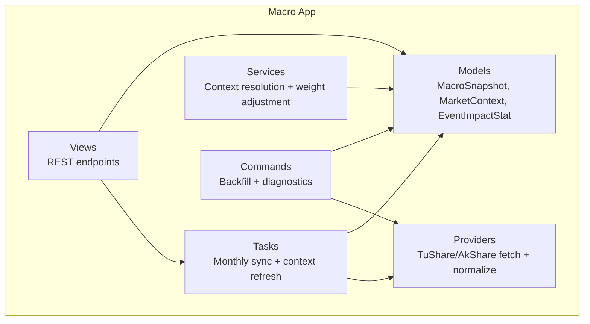

**Diagram sources**
- [models.py:5-77](file://apps/macro/models.py#L5-L77)
- [providers.py:10-664](file://apps/macro/providers.py#L10-L664)
- [services.py:6-90](file://apps/macro/services.py#L6-L90)
- [tasks.py:11-151](file://apps/macro/tasks.py#L11-L151)
- [views.py:14-60](file://apps/macro/views.py#L14-L60)
- [backfill_macro_snapshots.py:122-603](file://apps/macro/management/commands/backfill_macro_snapshots.py#L122-L603)

**Section sources**
- [models.py:5-77](file://apps/macro/models.py#L5-L77)
- [providers.py:10-664](file://apps/macro/providers.py#L10-L664)
- [services.py:6-90](file://apps/macro/services.py#L6-L90)
- [tasks.py:11-151](file://apps/macro/tasks.py#L11-L151)
- [views.py:14-60](file://apps/macro/views.py#L14-L60)
- [backfill_macro_snapshots.py:122-603](file://apps/macro/management/commands/backfill_macro_snapshots.py#L122-L603)

## Core Components
- MacroSnapshot: Monthly record of macro indicators including FX indices, yields across tenors, PMIs, and inflation metrics.
- MarketContext: Current or historical macro phase with optional event tags and time bounds.
- EventImpactStat: Historical performance stats by event tag and sector over horizons.
- Providers: Fetch from TuShare (primary) and AkShare (fallback), normalize values, and annotate metadata about sources and errors.
- Services: Resolve active macro phase and compute normalized weights for financial, flow, and technical signals based on phase and events.
- Tasks: Schedule monthly data sync and update current market context; infer phase from latest snapshot.
- Views: REST endpoints to list/read snapshots, get current context, trigger sync and refresh.
- Commands: Backfill historical macro data and context, check earliest availability.

**Section sources**
- [models.py:5-77](file://apps/macro/models.py#L5-L77)
- [providers.py:10-664](file://apps/macro/providers.py#L10-L664)
- [services.py:6-90](file://apps/macro/services.py#L6-L90)
- [tasks.py:11-151](file://apps/macro/tasks.py#L11-L151)
- [views.py:14-60](file://apps/macro/views.py#L14-L60)
- [backfill_macro_snapshots.py:122-603](file://apps/macro/management/commands/backfill_macro_snapshots.py#L122-L603)

## Architecture Overview
The system follows a layered architecture:
- Data ingestion layer (providers) pulls from external sources with retries and fallbacks.
- Processing layer (services) resolves macro context and adjusts downstream model weights.
- Persistence layer (models) stores snapshots and contexts.
- Orchestration layer (tasks) schedules periodic sync and context updates.
- Interface layer (views) exposes APIs for consumption and control.
- Operations layer (commands) performs bulk backfills and diagnostics.

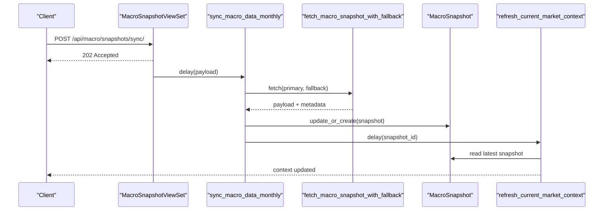

**Diagram sources**
- [views.py:21-24](file://apps/macro/views.py#L21-L24)
- [tasks.py:91-131](file://apps/macro/tasks.py#L91-L131)
- [providers.py:540-615](file://apps/macro/providers.py#L540-L615)
- [models.py:5-28](file://apps/macro/models.py#L5-L28)

## Detailed Component Analysis

### MacroSnapshot Model and Yield Surface Fields
- Fields include DXY, CNY/USD, PMIs, CPI/PPI YoY, and a full yield surface across tenors (6M, 1Y, 3Y, 5Y, 7Y, 10Y, 30Y).
- Metadata tracks source provenance, field-level sources, and error/retry information.
- Monthly granularity ensures consistent time series alignment for analysis.

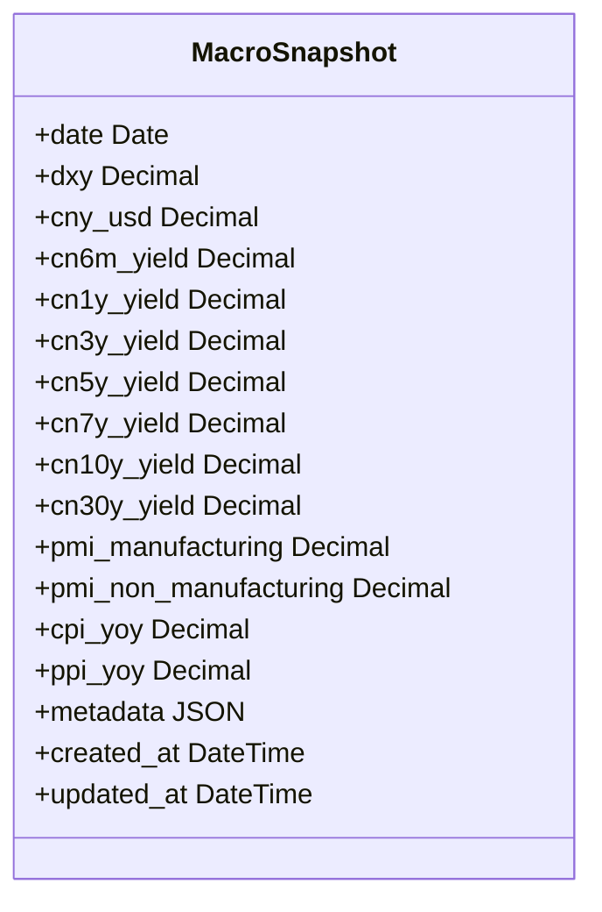

**Diagram sources**
- [models.py:5-28](file://apps/macro/models.py#L5-L28)
- [0002_add_macro_yield_surface_fields.py:10-41](file://apps/macro/migrations/0002_add_macro_yield_surface_fields.py#L10-L41)
- [0003_remove_macrosnapshot_cn2y_yield.py:10-15](file://apps/macro/migrations/0003_remove_macrosnapshot_cn2y_yield.py#L10-L15)

**Section sources**
- [models.py:5-28](file://apps/macro/models.py#L5-L28)
- [0002_add_macro_yield_surface_fields.py:10-41](file://apps/macro/migrations/0002_add_macro_yield_surface_fields.py#L10-L41)
- [0003_remove_macrosnapshot_cn2y_yield.py:10-15](file://apps/macro/migrations/0003_remove_macrosnapshot_cn2y_yield.py#L10-L15)

### Provider Abstraction and Fallback Strategy
- Primary provider: TuShare (FX daily, yield curve, PMI/CPI/PPI).
- Fallback provider: AkShare (partial coverage).
- Robust retry wrapper with configurable attempts and sleep intervals.
- Normalization functions handle quote formats, NaN handling, and scale adjustments.
- Field-level provenance tracked in metadata, including primary/fallback usage and errors.

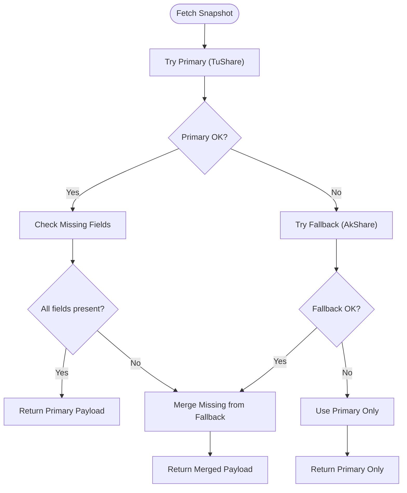

**Diagram sources**
- [providers.py:276-307](file://apps/macro/providers.py#L276-L307)
- [providers.py:540-615](file://apps/macro/providers.py#L540-L615)

**Section sources**
- [providers.py:10-664](file://apps/macro/providers.py#L10-L664)

### Services Layer: Macro Context and Weight Adjustment
- Resolves active macro phase from database or explicit parameters.
- Applies preset weights per phase (Recovery, Overheat, Stagflation, Recession).
- Adjusts weights by event tags (e.g., trade war, rate cut cycle).
- Normalizes final weights to sum to one for downstream consumers.

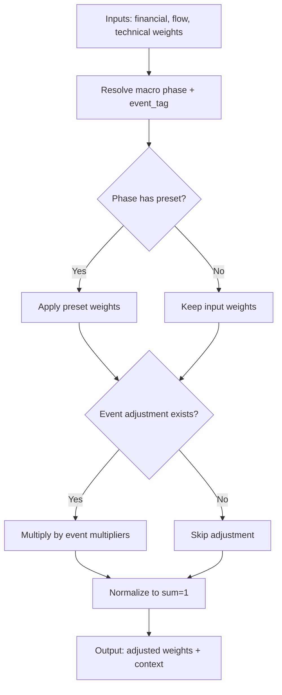

**Diagram sources**
- [services.py:6-90](file://apps/macro/services.py#L6-L90)

**Section sources**
- [services.py:6-90](file://apps/macro/services.py#L6-L90)

### Task Architecture: Scheduled Data Collection and Context Refresh
- Monthly task fetches snapshot using configured primary/fallback providers and persists it.
- After persistence, triggers asynchronous context refresh to infer and update current macro phase.
- Context refresh reads the latest snapshot, infers phase, and manages active context lifecycle.

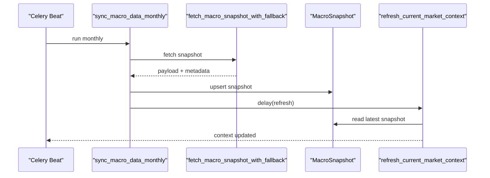

**Diagram sources**
- [tasks.py:91-151](file://apps/macro/tasks.py#L91-L151)
- [providers.py:540-615](file://apps/macro/providers.py#L540-L615)

**Section sources**
- [tasks.py:91-151](file://apps/macro/tasks.py#L91-L151)

### Backfill Processes for Historical Macro Data
- Bulk backfill command iterates month windows, pulling yield curves and FX from TuShare and CSV history where applicable.
- Supports resume capability per yield tenor to avoid reprocessing completed months.
- Uses AkShare as fallback only for the latest requested month when fields are missing.
- Persists yield points with detailed metadata, including source and curve type.
- After backfill, triggers context refresh for the latest snapshot.

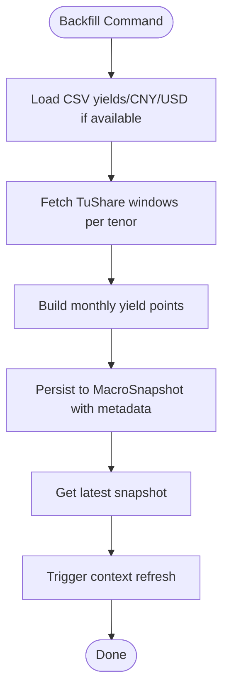

**Diagram sources**
- [backfill_macro_snapshots.py:122-603](file://apps/macro/management/commands/backfill_macro_snapshots.py#L122-L603)
- [tasks.py:134-151](file://apps/macro/tasks.py#L134-L151)

**Section sources**
- [backfill_macro_snapshots.py:122-603](file://apps/macro/management/commands/backfill_macro_snapshots.py#L122-L603)

### Yield Surface Analysis Capabilities
- Tenor mapping covers short to long maturities (6M to 30Y).
- Curve selection prefers a specific curve type when available; otherwise falls back gracefully.
- Monthly aggregation ensures consistent time alignment for slope and shape analysis.
- Metadata records curve term and trade date for traceability.

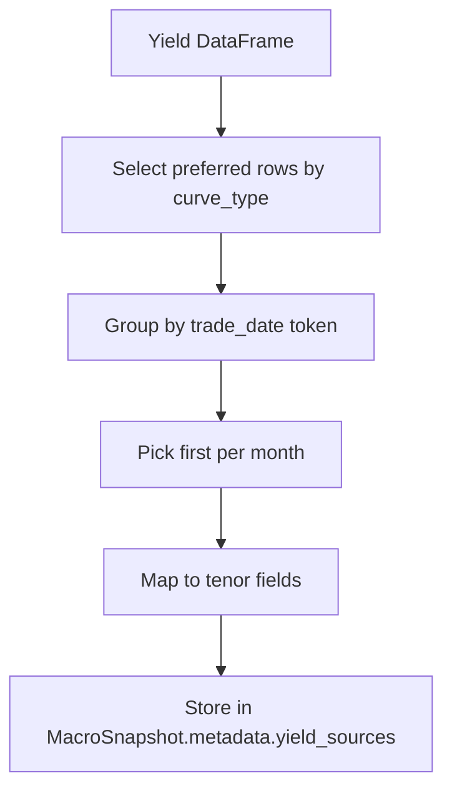

**Diagram sources**
- [providers.py:179-228](file://apps/macro/providers.py#L179-L228)

**Section sources**
- [providers.py:179-228](file://apps/macro/providers.py#L179-L228)

### Macro Context Influence on Other Applications
- Services resolve the active macro phase and optional event tag.
- Downstream applications can call weight adjustment to receive normalized weights tailored to the current regime.
- This enables dynamic strategy weighting (financial vs flow vs technical) based on macro conditions.

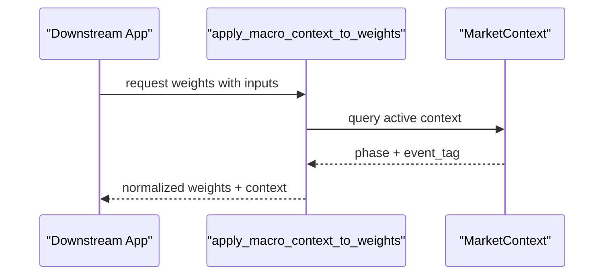

**Diagram sources**
- [services.py:51-90](file://apps/macro/services.py#L51-L90)
- [models.py:31-57](file://apps/macro/models.py#L31-L57)

**Section sources**
- [services.py:51-90](file://apps/macro/services.py#L51-L90)
- [models.py:31-57](file://apps/macro/models.py#L31-L57)

### Management Commands for Data Synchronization
- backfill_macro_snapshots: Populates historical MacroSnapshot rows from TuShare and CSV sources, with AkShare fallback for the latest month.
- backfill_market_context: Rebuilds MarketContext history from existing MacroSnapshot data.
- check_earliest_data: Reports earliest availability from sources and local database for macro and OHLCV data.

**Section sources**
- [backfill_macro_snapshots.py:122-603](file://apps/macro/management/commands/backfill_macro_snapshots.py#L122-L603)
- [backfill_market_context.py:18-58](file://apps/macro/management/commands/backfill_market_context.py#L18-L58)
- [check_earliest_data.py:13-49](file://apps/macro/management/commands/check_earliest_data.py#L13-L49)

### API Endpoints for Accessing Macro Indicators
- MacroSnapshotViewSet: List snapshots, trigger monthly sync.
- MarketContextViewSet: List contexts, get current context, trigger refresh.
- EventImpactStatViewSet: List event impact statistics, filterable by event_tag.

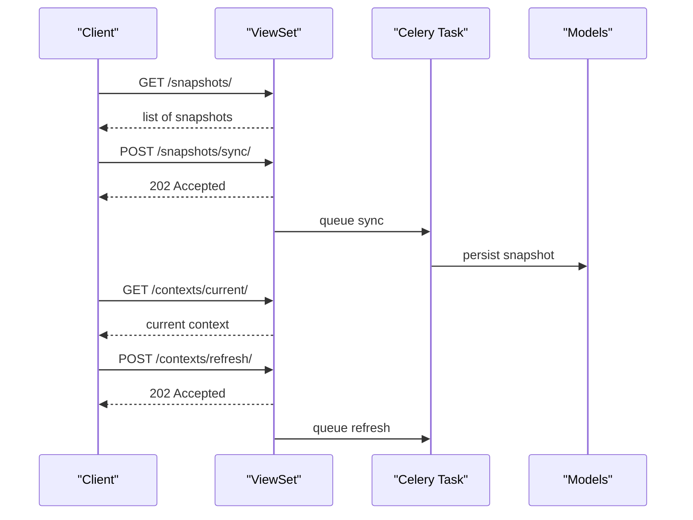

**Diagram sources**
- [views.py:14-60](file://apps/macro/views.py#L14-L60)
- [tasks.py:91-151](file://apps/macro/tasks.py#L91-L151)

**Section sources**
- [views.py:14-60](file://apps/macro/views.py#L14-L60)
- [serializers.py:6-36](file://apps/macro/serializers.py#L6-L36)

## Dependency Analysis
- Models depend on Django ORM and JSONField for flexible metadata.
- Providers depend on external libraries (TuShare, AkShare) and configuration settings for tokens and retry behavior.
- Tasks depend on Celery for scheduling and interact with both providers and models.
- Services depend on models to resolve active context and apply presets.
- Views depend on serializers and tasks to expose APIs and orchestrate background work.
- Commands depend on providers and models for backfill operations and diagnostics.

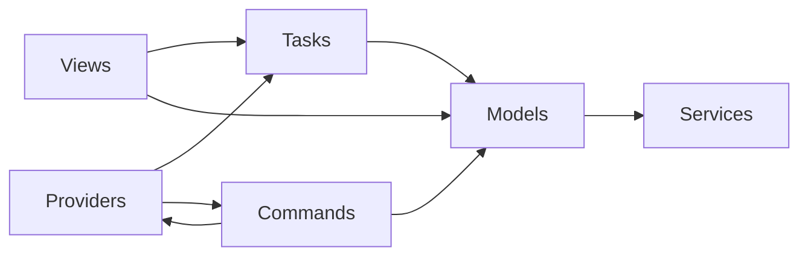

**Diagram sources**
- [models.py:5-77](file://apps/macro/models.py#L5-L77)
- [providers.py:10-664](file://apps/macro/providers.py#L10-L664)
- [tasks.py:11-151](file://apps/macro/tasks.py#L11-L151)
- [services.py:6-90](file://apps/macro/services.py#L6-L90)
- [views.py:14-60](file://apps/macro/views.py#L14-L60)
- [backfill_macro_snapshots.py:122-603](file://apps/macro/management/commands/backfill_macro_snapshots.py#L122-L603)

**Section sources**
- [models.py:5-77](file://apps/macro/models.py#L5-L77)
- [providers.py:10-664](file://apps/macro/providers.py#L10-L664)
- [tasks.py:11-151](file://apps/macro/tasks.py#L11-L151)
- [services.py:6-90](file://apps/macro/services.py#L6-L90)
- [views.py:14-60](file://apps/macro/views.py#L14-L60)
- [backfill_macro_snapshots.py:122-603](file://apps/macro/management/commands/backfill_macro_snapshots.py#L122-L603)

## Performance Considerations
- Windowed fetching for yield curves and FX reduces payload size and avoids timeouts.
- Retry wrappers with exponential backoff improve resilience against transient failures.
- Resume capabilities in backfill prevent redundant processing for completed tenors.
- Metadata tracking helps diagnose slow or failing sources without impacting core flows.
- Monthly granularity balances timeliness and storage efficiency.

[No sources needed since this section provides general guidance]

## Troubleshooting Guide
- Missing fields: Inspect payload metadata for field_sources and errors; use check_earliest_data to verify source availability.
- Provider failures: Review retry_errors and error messages in metadata; adjust retry counts and sleep intervals via settings.
- Stale context: Trigger refresh via API or command; ensure latest snapshot exists and contains required indicators.
- Backfill issues: Validate CSV paths and configurations; use resume flags to continue from last successful tenor.

**Section sources**
- [providers.py:276-307](file://apps/macro/providers.py#L276-L307)
- [check_earliest_data.py:13-49](file://apps/macro/management/commands/check_earliest_data.py#L13-L49)
- [backfill_macro_snapshots.py:122-603](file://apps/macro/management/commands/backfill_macro_snapshots.py#L122-L603)

## Conclusion
The Macro application provides a robust pipeline for collecting, normalizing, and storing macroeconomic indicators, inferring market regimes, and exposing APIs for consumption. Its provider abstraction with fallbacks, scheduled tasks, and comprehensive backfill tools ensure reliable and maintainable macro data management. Downstream applications benefit from context-aware weight adjustments that adapt to changing macro conditions.

[No sources needed since this section summarizes without analyzing specific files]

## Appendices

### API Endpoints Summary
- MacroSnapshotViewSet
  - GET /api/macro/snapshots/: List snapshots
  - POST /api/macro/snapshots/sync/: Queue monthly sync
- MarketContextViewSet
  - GET /api/macro/contexts/: List contexts
  - GET /api/macro/contexts/current/: Get active context
  - POST /api/macro/contexts/refresh/: Queue context refresh
- EventImpactStatViewSet
  - GET /api/macro/event_impacts/: List event impact stats (filter by event_tag)

**Section sources**
- [views.py:14-60](file://apps/macro/views.py#L14-L60)
- [serializers.py:6-36](file://apps/macro/serializers.py#L6-L36)