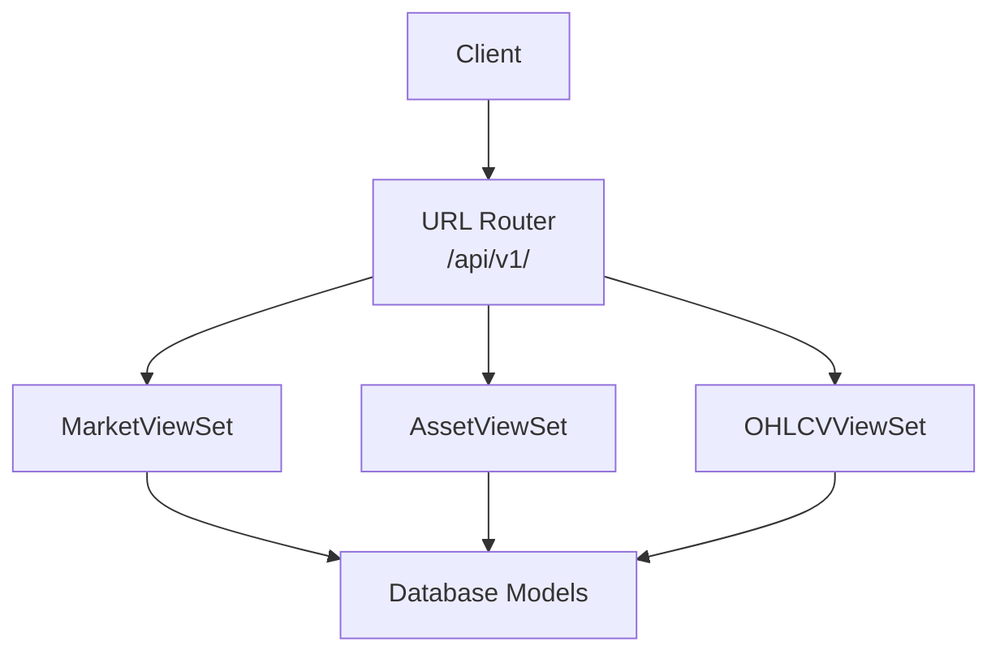
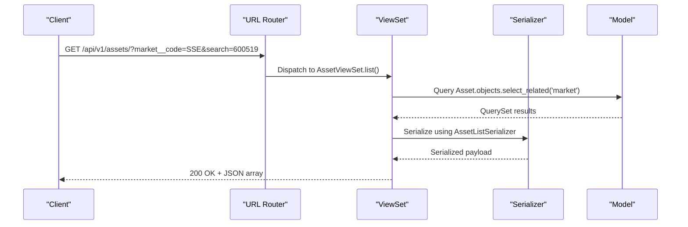
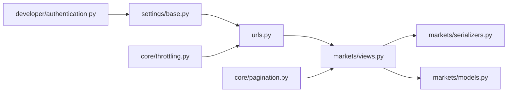

# API Endpoints

<cite>
**Referenced Files in This Document**
- [urls.py](file://config/urls.py)
- [views.py](file://apps/markets/views.py)
- [serializers.py](file://apps/markets/serializers.py)
- [models.py](file://apps/markets/models.py)
- [base.py](file://config/settings/base.py)
- [throttling.py](file://apps/core/throttling.py)
- [pagination.py](file://apps/core/pagination.py)
- [authentication.py](file://apps/developer/authentication.py)
- [api.md](file://docs/reference/api.md)
</cite>

## Table of Contents
1. [Introduction](#introduction)
2. [Project Structure](#project-structure)
3. [Core Components](#core-components)
4. [Architecture Overview](#architecture-overview)
5. [Detailed Component Analysis](#detailed-component-analysis)
6. [Dependency Analysis](#dependency-analysis)
7. [Performance Considerations](#performance-considerations)
8. [Troubleshooting Guide](#troubleshooting-guide)
9. [Conclusion](#conclusion)
10. [Appendices](#appendices)

## Introduction
This document provides API documentation for the Markets application endpoints that expose asset management, OHLCV data retrieval, trading calendar queries, and index membership lookups. It covers HTTP methods, URL patterns, request/response schemas, authentication requirements, query parameters, filtering options, pagination support, response formats, error responses, rate limiting policies, and best practices for client integration.

## Project Structure
The Markets module exposes read-only REST endpoints via Django REST Framework viewsets. The router registers three primary endpoints under the api/v1 namespace: markets, assets, and ohlcv. Additional models exist for trading calendars, suspensions, and index memberships; these are currently not exposed as public endpoints but inform internal processing and future extensions.

**Diagram sources**
- [urls.py:74-78](file://config/urls.py#L74-L78)
- [views.py:16-105](file://apps/markets/views.py#L16-L105)
- [models.py:4-226](file://apps/markets/models.py#L4-L226)

**Section sources**
- [urls.py:74-78](file://config/urls.py#L74-L78)
- [views.py:16-105](file://apps/markets/views.py#L16-L105)

## Core Components
- MarketViewSet: Read-only list and detail for markets (exchanges). Cached for 24 hours.
- AssetViewSet: Read-only list and detail for assets with filtering by market code and listing status, search by symbol/ts_code/name, and ordering by symbol/name. Cached for 2 hours.
- OHLCVViewSet: Read-only list and detail for daily OHLCV with filtering by asset id and date range (date_from, date_to), ordered by date descending. Cached for 2 hours.

Authentication and authorization:
- JWT Bearer token via Authorization header or API Key via X-API-Key header.
- Throttling is tier-based per user profile subscription tier.

Pagination:
- Standard page number pagination with default page size 50 and max 1000.

Response caching:
- Server-side caching reduces load on read endpoints.

**Section sources**
- [views.py:16-105](file://apps/markets/views.py#L16-L105)
- [serializers.py:5-49](file://apps/markets/serializers.py#L5-L49)
- [base.py:307-321](file://config/settings/base.py#L307-L321)
- [base.py:352-388](file://config/settings/base.py#L352-L388)
- [throttling.py:17-88](file://apps/core/throttling.py#L17-L88)
- [pagination.py:4-7](file://apps/core/pagination.py#L4-L7)

## Architecture Overview
The Markets API follows a standard DRF pattern:
- URLs registered via DefaultRouter map to ViewSets.
- ViewSets define querysets, serializers, filters, and optional custom logic.
- Serializers shape JSON responses.
- Models define persistent data structures.

**Diagram sources**
- [urls.py:74-78](file://config/urls.py#L74-L78)
- [views.py:32-56](file://apps/markets/views.py#L32-L56)
- [serializers.py:11-29](file://apps/markets/serializers.py#L11-L29)
- [models.py:19-63](file://apps/markets/models.py#L19-L63)

## Detailed Component Analysis

### Markets Endpoint
- Base path: /api/v1/markets
- Methods:
  - GET /api/v1/markets/ — List all markets
  - GET /api/v1/markets/{id}/ — Retrieve a specific market
- Authentication: Optional (JWT or API Key recommended)
- Pagination: Supported via standard page parameters
- Response schema:
  - id: integer
  - code: string (unique market/exchange code)
  - name: string
- Notes:
  - List and retrieve are cached for 24 hours.

Example calls:
- List markets: GET /api/v1/markets/
- Get market by id: GET /api/v1/markets/1/

Error responses:
- 404 Not Found when resource does not exist
- 401 Unauthorized if required auth is missing
- 403 Forbidden if permissions deny access
- 429 Too Many Requests when throttled

**Section sources**
- [urls.py:76-78](file://config/urls.py#L76-L78)
- [views.py:16-29](file://apps/markets/views.py#L16-L29)
- [serializers.py:5-8](file://apps/markets/serializers.py#L5-L8)
- [models.py:4-18](file://apps/markets/models.py#L4-L18)

### Assets Endpoint
- Base path: /api/v1/assets
- Methods:
  - GET /api/v1/assets/ — List assets with filtering and search
  - GET /api/v1/assets/{id}/ — Retrieve a specific asset
- Authentication: Optional (JWT or API Key recommended)
- Filtering:
  - market__code: filter by market code (e.g., SSE, SZSE)
  - listing_status: filter by active/delisted
- Search:
  - search: free-text search across symbol, ts_code, name
- Ordering:
  - order_by: symbol, name
- Pagination:
  - page: page number
  - page_size: items per page (max 1000)
- Response schema (list uses lightweight serializer):
  - id: integer
  - symbol: string
  - ts_code: string (unique)
  - name: string
  - market_code: string
  - listing_status: enum (ACTIVE, DELISTED)
  - list_date: date (nullable)
  - delist_date: date (nullable)
- Response schema (detail includes market fields):
  - Adds market_name and market_code from related market

Example calls:
- List assets in SSE: GET /api/v1/assets/?market__code=SSE
- Search by symbol: GET /api/v1/assets/?search=600519
- Order by name: GET /api/v1/assets/?ordering=name
- Page 2 with 100 items: GET /api/v1/assets/?page=2&page_size=100

Notes:
- List and retrieve are cached for 2 hours.

**Section sources**
- [urls.py:76-78](file://config/urls.py#L76-L78)
- [views.py:32-56](file://apps/markets/views.py#L32-L56)
- [serializers.py:11-29](file://apps/markets/serializers.py#L11-L29)
- [models.py:19-63](file://apps/markets/models.py#L19-L63)

### OHLCV Endpoint
- Base path: /api/v1/ohlcv
- Methods:
  - GET /api/v1/ohlcv/ — List OHLCV records with filtering
  - GET /api/v1/ohlcv/{id}/ — Retrieve a specific OHLCV record
- Authentication: Optional (JWT or API Key recommended)
- Filtering:
  - asset: filter by asset id
  - date: exact date match
  - date_from: inclusive start date (YYYY-MM-DD)
  - date_to: inclusive end date (YYYY-MM-DD)
- Ordering:
  - order_by: date (default descending)
- Pagination:
  - page: page number
  - page_size: items per page (max 1000)
- Response schema (list uses lightweight serializer):
  - date: date
  - open: decimal
  - high: decimal
  - low: decimal
  - close: decimal
  - volume: integer
- Response schema (detail includes full fields):
  - id: integer
  - asset: integer (asset id)
  - asset_symbol: string
  - asset_name: string
  - date: date
  - open: decimal
  - high: decimal
  - low: decimal
  - close: decimal
  - adj_close: decimal
  - volume: integer
  - amount: decimal

Example calls:
- Historical prices for an asset: GET /api/v1/ohlcv/?asset=1&date_from=2024-01-01&date_to=2024-01-31
- Latest price for asset: GET /api/v1/ohlcv/?asset=1&ordering=-date&page_size=1

Notes:
- List and retrieve are cached for 2 hours.

**Section sources**
- [urls.py:76-78](file://config/urls.py#L76-L78)
- [views.py:59-105](file://apps/markets/views.py#L59-L105)
- [serializers.py:32-49](file://apps/markets/serializers.py#L32-L49)
- [models.py:201-226](file://apps/markets/models.py#L201-L226)

### Trading Calendar Queries
- Data model exists for exchange trading calendars (ExchangeTradingCalendar) with fields:
  - exchange_code: string
  - trade_date: date
  - is_open: boolean
  - source: string
- Current status: No public endpoint is exposed for trading calendar queries in the current router configuration. Clients can infer market status indirectly via OHLCV availability and asset listing status. Future endpoints may be added to expose this data directly.

Best practice:
- When querying OHLCV, use date ranges aligned with known trading days to avoid gaps.
- If you need explicit market open/close status, monitor OHLCV presence and consider backfilling your own calendar based on observed dates.

**Section sources**
- [models.py:65-84](file://apps/markets/models.py#L65-L84)
- [urls.py:74-78](file://config/urls.py#L74-L78)

### Index Membership Lookups
- Data model exists for historical index membership snapshots (IndexMembership) with fields:
  - asset: foreign key to Asset
  - index_code: string
  - index_name: string
  - trade_date: date
  - weight: decimal (nullable)
  - source: string
- Current status: No public endpoint is exposed for index membership lookups in the current router configuration. These records support internal benchmarking and analytics workflows.

Best practice:
- Use asset metadata and OHLCV endpoints for current holdings and pricing.
- For historical composition analysis, rely on internal tools or future API expansions.

**Section sources**
- [models.py:117-144](file://apps/markets/models.py#L117-L144)
- [urls.py:74-78](file://config/urls.py#L74-L78)

## Dependency Analysis
The Markets API depends on:
- DRF routers and viewsets for URL routing and request handling
- Django filters for backend filtering and search
- Serializers to map models to JSON
- Models for persistent storage
- Settings for authentication and OpenAPI schema
- Throttling classes for rate limiting
- Pagination class for consistent paging

**Diagram sources**
- [urls.py:74-78](file://config/urls.py#L74-L78)
- [views.py:16-105](file://apps/markets/views.py#L16-L105)
- [serializers.py:5-49](file://apps/markets/serializers.py#L5-L49)
- [models.py:4-226](file://apps/markets/models.py#L4-L226)
- [base.py:307-321](file://config/settings/base.py#L307-L321)
- [base.py:352-388](file://config/settings/base.py#L352-L388)
- [throttling.py:17-88](file://apps/core/throttling.py#L17-L88)
- [pagination.py:4-7](file://apps/core/pagination.py#L4-L7)
- [authentication.py:10-53](file://apps/developer/authentication.py#L10-L53)

**Section sources**
- [urls.py:74-78](file://config/urls.py#L74-L78)
- [views.py:16-105](file://apps/markets/views.py#L16-L105)
- [serializers.py:5-49](file://apps/markets/serializers.py#L5-L49)
- [models.py:4-226](file://apps/markets/models.py#L4-L226)
- [base.py:307-321](file://config/settings/base.py#L307-L321)
- [base.py:352-388](file://config/settings/base.py#L352-L388)
- [throttling.py:17-88](file://apps/core/throttling.py#L17-L88)
- [pagination.py:4-7](file://apps/core/pagination.py#L4-L7)
- [authentication.py:10-53](file://apps/developer/authentication.py#L10-L53)

## Performance Considerations
- Caching:
  - Markets list/detail: 24-hour cache
  - Assets list/detail: 2-hour cache
  - OHLCV list/detail: 2-hour cache
- Pagination:
  - Default page size 50; adjust via page_size up to 1000
- Filtering:
  - Use precise filters (market__code, asset, date ranges) to reduce payload sizes
- Ordering:
  - Prefer ordering by indexed fields where applicable (e.g., date)
- Rate limits:
  - Tier-based throttling applies; see Rate Limits section

[No sources needed since this section provides general guidance]

## Troubleshooting Guide
Common errors and resolutions:
- 400 Bad Request: Invalid query parameters or malformed request body
- 401 Unauthorized: Missing or invalid JWT/API key
- 403 Forbidden: Insufficient permissions
- 404 Not Found: Resource identifier does not exist
- 429 Too Many Requests: Exceeded rate limit; check Retry-After header and tier limits

Rate limiting details:
- Anonymous: limited requests per day
- Authenticated tiers: Free (100/day), Pro (1000/day), Premium (10000/day)
- Auth endpoints have separate throttle scope to protect login/refresh traffic

Authentication tips:
- Use JWT Bearer tokens for interactive clients
- Use API Keys for programmatic integrations
- Ensure headers are correctly set:
  - Authorization: Bearer <token>
  - X-API-Key: <key>

**Section sources**
- [base.py:352-388](file://config/settings/base.py#L352-L388)
- [throttling.py:17-88](file://apps/core/throttling.py#L17-L88)
- [authentication.py:10-53](file://apps/developer/authentication.py#L10-L53)
- [api.md:188-221](file://docs/reference/api.md#L188-L221)

## Conclusion
The Markets API provides robust, cached, and filtered access to markets, assets, and OHLCV data. While trading calendar and index membership data are modeled internally, they are not yet exposed as public endpoints. Clients should leverage existing filters, pagination, and caching behaviors to build efficient integrations. Authentication via JWT or API keys ensures secure access, and tier-based throttling protects service stability.

[No sources needed since this section summarizes without analyzing specific files]

## Appendices

### Authentication and Token Management
- Obtain JWT tokens:
  - POST /api/v1/auth/token/
  - POST /api/v1/auth/token/refresh/
  - POST /api/v1/auth/token/verify/
- API Key usage:
  - Include X-API-Key header for authenticated requests

**Section sources**
- [urls.py:118-121](file://config/urls.py#L118-L121)
- [api.md:48-95](file://docs/reference/api.md#L48-L95)

### Example Workflows

#### Retrieve Asset Information
- Steps:
  - Filter by market code and/or search term
  - Paginate results as needed
  - Cache-friendly: reuse recent queries within TTL

Example:
- GET /api/v1/assets/?market__code=SSE&search=600519&page=1&page_size=50

**Section sources**
- [views.py:32-56](file://apps/markets/views.py#L32-L56)
- [serializers.py:11-29](file://apps/markets/serializers.py#L11-L29)

#### Retrieve Historical Price Data
- Steps:
  - Specify asset id and date range
  - Order by date descending to get latest first
  - Use pagination to handle large datasets

Example:
- GET /api/v1/ohlcv/?asset=1&date_from=2024-01-01&date_to=2024-01-31&ordering=-date&page_size=100

**Section sources**
- [views.py:59-105](file://apps/markets/views.py#L59-L105)
- [serializers.py:32-49](file://apps/markets/serializers.py#L32-L49)

#### Check Market Status
- Current approach:
  - Observe OHLCV availability for an asset over time
  - Infer trading days from returned dates
- Future enhancement:
  - Direct trading calendar endpoint may be added

**Section sources**
- [models.py:65-84](file://apps/markets/models.py#L65-L84)
- [urls.py:74-78](file://config/urls.py#L74-L78)

### Best Practices for Client Integration
- Always paginate and limit page_size to reasonable values
- Use precise filters to minimize payload size
- Respect rate limits and implement retry logic with exponential backoff
- Cache responses locally within server TTLs to reduce redundant requests
- Prefer API Keys for long-running jobs; rotate keys periodically
- Validate responses and handle errors gracefully

[No sources needed since this section provides general guidance]