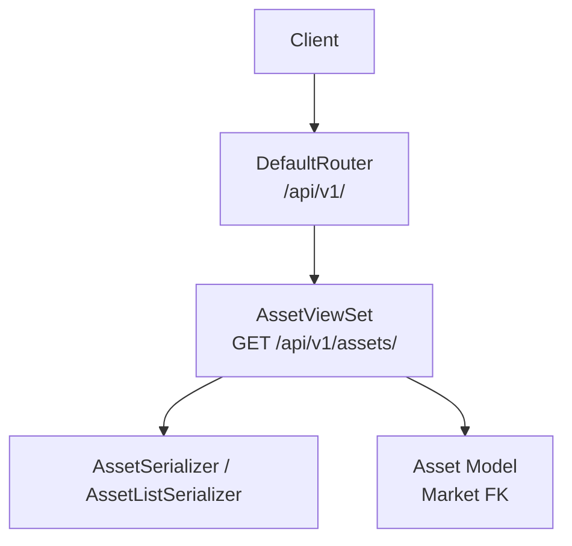
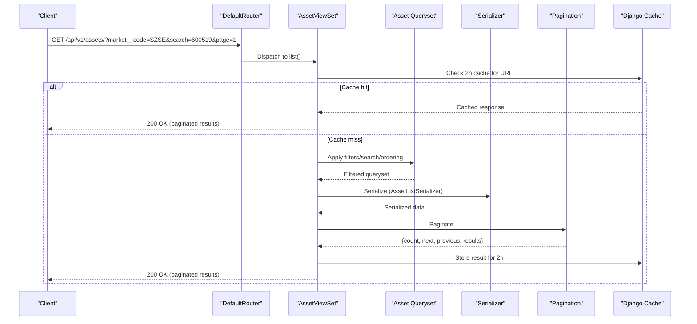
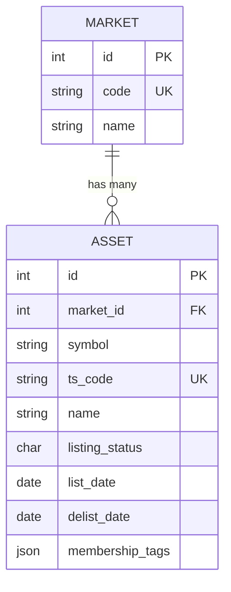
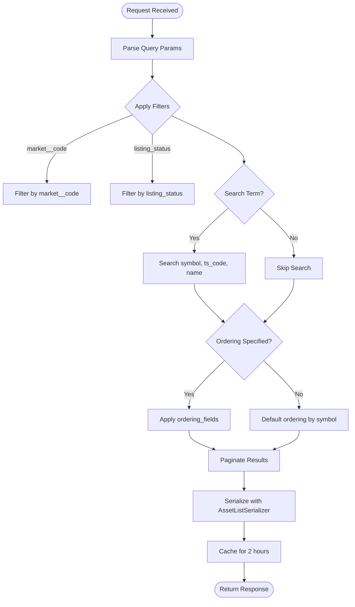
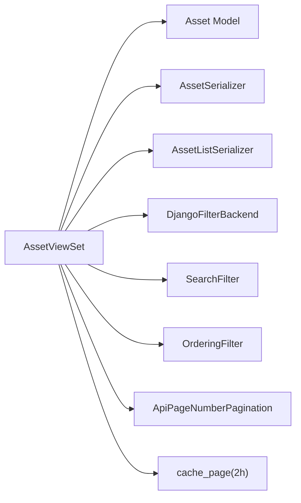

# Assets API

<cite>
**Referenced Files in This Document**
- [views.py](file://apps/markets/views.py)
- [serializers.py](file://apps/markets/serializers.py)
- [models.py](file://apps/markets/models.py)
- [urls.py](file://config/urls.py)
- [pagination.py](file://apps/core/pagination.py)
- [base.py](file://config/settings/base.py)
</cite>

## Table of Contents
1. [Introduction](#introduction)
2. [Project Structure](#project-structure)
3. [Core Components](#core-components)
4. [Architecture Overview](#architecture-overview)
5. [Detailed Component Analysis](#detailed-component-analysis)
6. [Dependency Analysis](#dependency-analysis)
7. [Performance Considerations](#performance-considerations)
8. [Troubleshooting Guide](#troubleshooting-guide)
9. [Conclusion](#conclusion)

## Introduction
This document describes the Assets REST API surface for retrieving stock and asset information. It covers the AssetViewSet endpoints under /api/v1/assets/, supported HTTP methods, URL patterns, request parameters (market__code, listing_status, symbol/ts_code/name search, ts_code filtering), response schemas via AssetSerializer and AssetListSerializer, pagination behavior, sorting options, caching behavior (2-hour cache), and performance considerations for large asset lists.

## Project Structure
The Assets API is implemented as a read-only viewset that exposes list and detail operations over the Asset model. The router registers the viewset under assets, making it available at /api/v1/assets/. Pagination is globally configured to use a page-number strategy with a default page size and maximum page size. Filtering, searching, and ordering are enabled through Django filter backends and DRF filters.

**Diagram sources**
- [urls.py:74-78](file://config/urls.py#L74-L78)
- [views.py:32-56](file://apps/markets/views.py#L32-L56)
- [serializers.py:11-29](file://apps/markets/serializers.py#L11-L29)
- [models.py:19-62](file://apps/markets/models.py#L19-L62)

**Section sources**
- [urls.py:74-78](file://config/urls.py#L74-L78)
- [views.py:32-56](file://apps/markets/views.py#L32-L56)
- [pagination.py:1-7](file://apps/core/pagination.py#L1-L7)
- [base.py:264-301](file://config/settings/base.py#L264-L301)

## Core Components
- AssetViewSet: Read-only viewset providing list and retrieve actions for assets with filtering, searching, and ordering.
- AssetSerializer: Full-detail serializer including market name/code and lifecycle fields.
- AssetListSerializer: Lightweight serializer used for list responses to reduce payload size.
- Asset model: Represents stocks/funds with market association, symbol, ts_code, name, listing status, and dates.

Key behaviors:
- List uses AssetListSerializer; detail uses AssetSerializer.
- Query parameters:
  - Exact/lookup filters: market__code, listing_status
  - Search: symbol, ts_code, name
  - Ordering: symbol, name (default order by symbol)
- Pagination: PageNumberPagination with default page_size=50 and max_page_size=1000.
- Caching: Both list and retrieve are cached for 2 hours using Django’s cache_page decorator.

**Section sources**
- [views.py:32-56](file://apps/markets/views.py#L32-L56)
- [serializers.py:11-29](file://apps/markets/serializers.py#L11-L29)
- [models.py:19-62](file://apps/markets/models.py#L19-L62)
- [pagination.py:1-7](file://apps/core/pagination.py#L1-L7)
- [base.py:264-301](file://config/settings/base.py#L264-L301)

## Architecture Overview
The Assets endpoint follows a standard DRF pattern:
- Request arrives at /api/v1/assets/...
- DefaultRouter dispatches to AssetViewSet based on HTTP method and path.
- ViewSet applies filter_backends (DjangoFilterBackend, SearchFilter, OrderingFilter).
- Queryset is built from Asset.objects.select_related('market').all() to avoid N+1 queries.
- Response is serialized using AssetListSerializer for list and AssetSerializer for detail.
- Responses are paginated using ApiPageNumberPagination.
- Results are cached for 2 hours per URL key.

**Diagram sources**
- [views.py:32-56](file://apps/markets/views.py#L32-L56)
- [serializers.py:11-29](file://apps/markets/serializers.py#L11-L29)
- [pagination.py:1-7](file://apps/core/pagination.py#L1-L7)
- [base.py:264-301](file://config/settings/base.py#L264-L301)

## Detailed Component Analysis

### AssetViewSet Endpoints
- Base path: /api/v1/assets/
- Methods:
  - GET /api/v1/assets/: List assets with filtering, searching, ordering, and pagination.
  - GET /api/v1/assets/{id}/: Retrieve a single asset by primary key.

Request parameters:
- Filters (exact/lookup):
  - market__code: Filter by market code (e.g., SZSE, SSE).
  - listing_status: Filter by listing status (ACTIVE or DELISTED).
- Search:
  - search: Free-text search across symbol, ts_code, and name.
- Ordering:
  - ordering: Comma-separated list of fields; prefix with - for descending. Allowed fields: symbol, name. Default is ascending by symbol.
- Pagination:
  - page: Page number (1-based).
  - page_size: Number of items per page (clamped to max_page_size=1000).

Response formats:
- List: Paginated envelope with count, next, previous, and results array.
- Detail: Single asset object.

Caching:
- Both list and retrieve are cached for 2 hours per URL key.

Examples:
- Query assets by market code:
  - GET /api/v1/assets/?market__code=SZSE
- Search by symbol or name:
  - GET /api/v1/assets/?search=600519
  - GET /api/v1/assets/?search=Moutai
- Filter by listing status:
  - GET /api/v1/assets/?listing_status=A
  - GET /api/v1/assets/?listing_status=D
- Retrieve individual asset details:
  - GET /api/v1/assets/{id}/

Sorting examples:
- Ascending by symbol: ?ordering=symbol
- Descending by name: ?ordering=-name
- Multiple fields: ?ordering=name,symbol

**Section sources**
- [views.py:32-56](file://apps/markets/views.py#L32-L56)
- [urls.py:74-78](file://config/urls.py#L74-L78)
- [pagination.py:1-7](file://apps/core/pagination.py#L1-L7)
- [base.py:264-301](file://config/settings/base.py#L264-L301)

### Response Schemas

#### AssetListSerializer (used for list)
Fields:
- id: Integer primary key.
- symbol: Stock symbol string.
- ts_code: Unique Tushare code string.
- name: Asset name string.
- market_code: Market code string (read-only).
- listing_status: Listing status enum value (ACTIVE or DELISTED).
- list_date: Optional IPO/list date.
- delist_date: Optional delisting date.

Notes:
- Lightweight schema optimized for list payloads.

**Section sources**
- [serializers.py:23-29](file://apps/markets/serializers.py#L23-L29)

#### AssetSerializer (used for detail)
Fields:
- id: Integer primary key.
- symbol: Stock symbol string.
- ts_code: Unique Tushare code string.
- name: Asset name string.
- market_name: Market name string (read-only).
- market_code: Market code string (read-only).
- listing_status: Listing status enum value (ACTIVE or DELISTED).
- list_date: Optional IPO/list date.
- delist_date: Optional delisting date.

Notes:
- Includes related market fields via select_related to minimize database queries.

**Section sources**
- [serializers.py:11-20](file://apps/markets/serializers.py#L11-L20)
- [views.py:37](file://apps/markets/views.py#L37)

### Data Model Relationships
- Asset belongs to Market via foreign key.
- Asset has unique constraint on (market, symbol).
- Asset includes optional membership tags JSON field and lifecycle dates.

**Diagram sources**
- [models.py:4-17](file://apps/markets/models.py#L4-L17)
- [models.py:19-62](file://apps/markets/models.py#L19-L62)

**Section sources**
- [models.py:19-62](file://apps/markets/models.py#L19-L62)

### Filtering, Searching, and Ordering Flow

**Diagram sources**
- [views.py:32-56](file://apps/markets/views.py#L32-L56)
- [pagination.py:1-7](file://apps/core/pagination.py#L1-L7)

**Section sources**
- [views.py:32-56](file://apps/markets/views.py#L32-L56)

## Dependency Analysis
- AssetViewSet depends on:
  - Asset model for data access.
  - AssetSerializer and AssetListSerializer for serialization.
  - DjangoFilterBackend for exact/lookup filters.
  - SearchFilter for free-text search.
  - OrderingFilter for sorting.
  - ApiPageNumberPagination for pagination.
  - Django cache_page decorator for 2-hour caching.

Global settings:
- DEFAULT_PAGINATION_CLASS set to ApiPageNumberPagination.
- PAGE_SIZE defaults to 50.
- DEFAULT_FILTER_BACKENDS include DjangoFilterBackend, SearchFilter, OrderingFilter.
- Authentication allows JWT and API Key; permissions allow read-only without auth for these endpoints.

**Diagram sources**
- [views.py:32-56](file://apps/markets/views.py#L32-L56)
- [serializers.py:11-29](file://apps/markets/serializers.py#L11-L29)
- [pagination.py:1-7](file://apps/core/pagination.py#L1-L7)
- [base.py:264-301](file://config/settings/base.py#L264-L301)

**Section sources**
- [views.py:32-56](file://apps/markets/views.py#L32-L56)
- [base.py:264-301](file://config/settings/base.py#L264-L301)

## Performance Considerations
- Use pagination for all list requests to avoid large payloads and expensive queries.
- Prefer specific filters (market__code, listing_status) and targeted searches to reduce result sets.
- Leverage select_related('market') already applied in the queryset to avoid N+1 queries when serializing detail.
- Take advantage of 2-hour cache for repeated identical requests; vary query strings to control cache keys.
- For very large datasets, combine filters and smaller page sizes to keep responses manageable.
- Avoid broad searches without filters; they can scan many rows.

[No sources needed since this section provides general guidance]

## Troubleshooting Guide
Common issues and resolutions:
- Empty results:
  - Verify market__code values exist in the system.
  - Confirm listing_status values match ACTIVE or DELISTED.
  - Ensure search terms match symbol, ts_code, or name exactly as stored.
- Unexpected ordering:
  - Use allowed ordering_fields (symbol, name).
  - Prefix with - for descending order.
- Pagination limits:
  - page_size is clamped to max_page_size=1000; adjust accordingly.
- Caching surprises:
  - Identical URLs return cached responses for 2 hours; clear cache if data changes rapidly or test with different query strings.

Authentication and permissions:
- These endpoints support read-only access without authentication; authenticated requests are also accepted.

Rate limiting:
- Global throttling applies; ensure clients respect rate limits and implement retries/backoff.

**Section sources**
- [views.py:32-56](file://apps/markets/views.py#L32-L56)
- [pagination.py:1-7](file://apps/core/pagination.py#L1-L7)
- [base.py:264-301](file://config/settings/base.py#L264-L301)

## Conclusion
The Assets API provides efficient, filtered, searchable, and sortable access to stock and asset information with robust pagination and 2-hour caching. Use the documented parameters and serializers to build reliable integrations, and follow performance best practices to handle large datasets effectively.