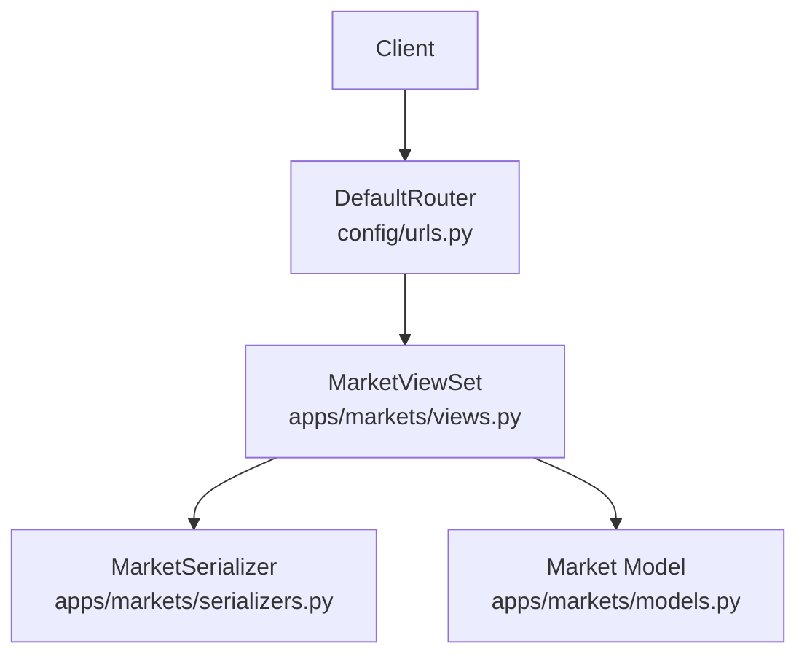
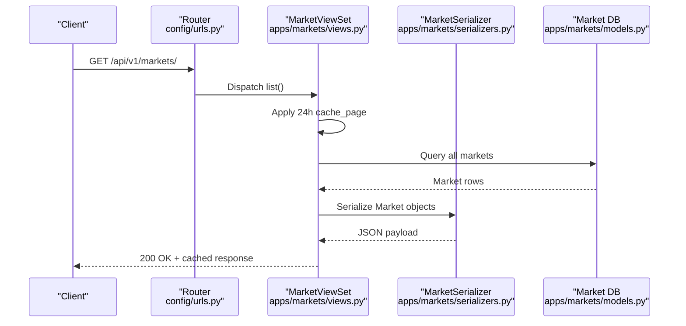
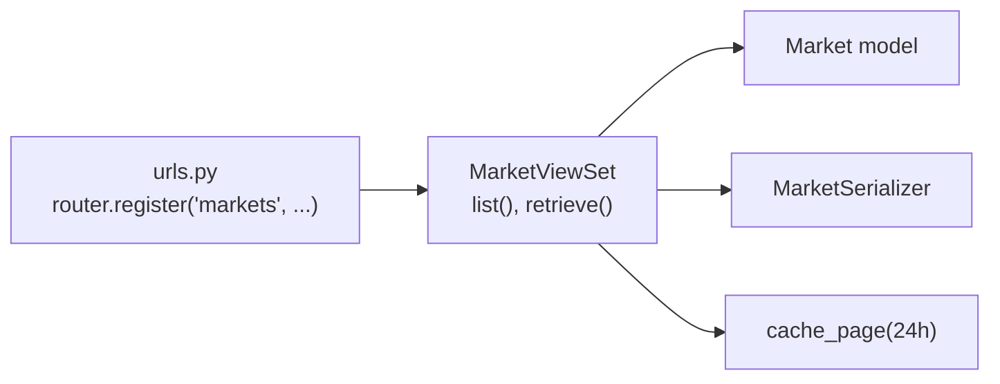

# Markets API

<cite>
**Referenced Files in This Document**
- [views.py](file://apps/markets/views.py)
- [serializers.py](file://apps/markets/serializers.py)
- [models.py](file://apps/markets/models.py)
- [urls.py](file://config/urls.py)
- [api.md](file://docs/reference/api.md)
</cite>

## Table of Contents
1. [Introduction](#introduction)
2. [Project Structure](#project-structure)
3. [Core Components](#core-components)
4. [Architecture Overview](#architecture-overview)
5. [Detailed Component Analysis](#detailed-component-analysis)
6. [Dependency Analysis](#dependency-analysis)
7. [Performance Considerations](#performance-considerations)
8. [Troubleshooting Guide](#troubleshooting-guide)
9. [Conclusion](#conclusion)

## Introduction
This document provides API documentation for the Markets endpoint that exposes market information and metadata via a read-only REST interface. It focuses on the MarketViewSet endpoints under /api/v1/markets/, including HTTP methods, URL patterns, response schemas, and basic lookup operations. It also documents caching behavior for static market data and explains how market information serves as a foundation for asset and trading operations throughout the system.

## Project Structure
The Markets API is implemented in the markets app and registered in the project’s root URL configuration:
- ViewSet definitions and caching are in apps/markets/views.py
- Data models (Market, Asset, OHLCV, etc.) are in apps/markets/models.py
- Response serialization is in apps/markets/serializers.py
- URL routing registers the viewsets under /api/v1/ in config/urls.py
- General API usage, pagination, filtering, and caching tiers are described in docs/reference/api.md

**Diagram sources**
- [urls.py:74-78](file://config/urls.py#L74-L78)
- [views.py:16-29](file://apps/markets/views.py#L16-L29)
- [serializers.py:5-9](file://apps/markets/serializers.py#L5-L9)
- [models.py:4-18](file://apps/markets/models.py#L4-L18)

**Section sources**
- [urls.py:74-78](file://config/urls.py#L74-L78)
- [views.py:16-29](file://apps/markets/views.py#L16-L29)
- [serializers.py:5-9](file://apps/markets/serializers.py#L5-L9)
- [models.py:4-18](file://apps/markets/models.py#L4-L18)
- [api.md:326-334](file://docs/reference/api.md#L326-L334)

## Core Components
- MarketViewSet: A read-only viewset exposing list and retrieve actions for markets with 24-hour response caching.
- MarketSerializer: Serializes Market model fields id, code, name.
- Market model: Represents exchanges or financial markets with unique code and human-readable name.

Key behaviors:
- List and retrieve are cached for 24 hours to serve static market metadata efficiently.
- The router registers the viewset at /api/v1/markets/.

**Section sources**
- [views.py:16-29](file://apps/markets/views.py#L16-L29)
- [serializers.py:5-9](file://apps/markets/serializers.py#L5-L9)
- [models.py:4-18](file://apps/markets/models.py#L4-L18)
- [urls.py:74-78](file://config/urls.py#L74-L78)

## Architecture Overview
The Markets API follows a standard Django REST Framework pattern:
- Requests arrive at /api/v1/markets/...
- DefaultRouter dispatches to MarketViewSet
- MarketViewSet queries the Market model and serializes results using MarketSerializer
- Responses are cached for 24 hours via cache_page decorator

**Diagram sources**
- [urls.py:74-78](file://config/urls.py#L74-L78)
- [views.py:16-29](file://apps/markets/views.py#L16-L29)
- [serializers.py:5-9](file://apps/markets/serializers.py#L5-L9)
- [models.py:4-18](file://apps/markets/models.py#L4-L18)

## Detailed Component Analysis

### MarketViewSet Endpoints
- Base path: /api/v1/markets/
- Methods:
  - GET /api/v1/markets/ — List all markets
  - GET /api/v1/markets/{id}/ — Retrieve a specific market by primary key

Behavior:
- Read-only access; no write operations.
- Both list and retrieve are cached for 24 hours using cache_page.

Response schema (list):
- Paginated envelope per global pagination settings
- Each item includes: id, code, name

Response schema (retrieve):
- Single object with fields: id, code, name

Example requests and responses:
- List available markets:
  - Request: GET /api/v1/markets/
  - Response: { count, next, previous, results: [{ id, code, name }, ...] }
- Retrieve market details:
  - Request: GET /api/v1/markets/1/
  - Response: { id, code, name }

Notes:
- Pagination defaults and parameters are defined globally; see Pagination section below.
- Filtering/searching/ordering are not enabled on this viewset beyond default DRF behavior.

**Section sources**
- [urls.py:74-78](file://config/urls.py#L74-L78)
- [views.py:16-29](file://apps/markets/views.py#L16-L29)
- [serializers.py:5-9](file://apps/markets/serializers.py#L5-L9)
- [api.md:136-164](file://docs/reference/api.md#L136-L164)

### MarketSerializer Fields
- id: integer primary key
- code: string, unique market code (e.g., exchange identifier)
- name: string, human-readable market name

These fields map directly to the Market model and are returned in both list and detail responses.

**Section sources**
- [serializers.py:5-9](file://apps/markets/serializers.py#L5-L9)
- [models.py:4-18](file://apps/markets/models.py#L4-L18)

### Market Model
- Market represents an exchange or financial market
- Fields:
  - code: unique identifier for the market
  - name: display name
- Relationships:
  - One-to-many with Asset (via ForeignKey from Asset to Market)
  - Used as a foundational reference for assets and downstream trading operations

**Section sources**
- [models.py:4-18](file://apps/markets/models.py#L4-L18)
- [models.py:19-62](file://apps/markets/models.py#L19-L62)

### Caching Behavior
- Market list and retrieve responses are cached for 24 hours using cache_page
- Cached responses have no distinguishing header; clients should treat them as potentially stale after backfills or repairs
- To bypass cache when necessary, append a unique query parameter (e.g., ?_=<nonce>) or flush the Redis cache database

Caching tier summary (from API guide):
- 24 hours: Market list/detail
- 2 hours: Asset list/detail, OHLCV list/detail, some indicator views
- 5 minutes: Indicator ranking and screener-style views

**Section sources**
- [views.py:23-29](file://apps/markets/views.py#L23-L29)
- [api.md:225-239](file://docs/reference/api.md#L225-L239)

### How Market Information Supports Asset and Trading Operations
- Assets belong to markets via a foreign key relationship; market metadata (code, name) is included in asset responses to provide context
- Downstream components (asset listing, OHLCV retrieval, analytics, predictions, backtests) rely on market context to scope data and interpret symbols correctly
- Market calendars and index membership data further support trading logic and benchmark comparisons

**Section sources**
- [models.py:19-62](file://apps/markets/models.py#L19-L62)
- [serializers.py:11-20](file://apps/markets/serializers.py#L11-L20)
- [api.md:326-334](file://docs/reference/api.md#L326-L334)

## Dependency Analysis
- URLs register MarketViewSet under /api/v1/markets/
- MarketViewSet depends on:
  - Market model for data
  - MarketSerializer for output formatting
  - DRF ReadOnlyModelViewSet base class for list/retrieve
  - Django cache_page decorator for response caching

**Diagram sources**
- [urls.py:74-78](file://config/urls.py#L74-L78)
- [views.py:16-29](file://apps/markets/views.py#L16-L29)
- [serializers.py:5-9](file://apps/markets/serializers.py#L5-L9)
- [models.py:4-18](file://apps/markets/models.py#L4-L18)

**Section sources**
- [urls.py:74-78](file://config/urls.py#L74-L78)
- [views.py:16-29](file://apps/markets/views.py#L16-L29)
- [serializers.py:5-9](file://apps/markets/serializers.py#L5-L9)
- [models.py:4-18](file://apps/markets/models.py#L4-L18)

## Performance Considerations
- 24-hour caching reduces database load for static market metadata
- Use pagination for large lists; default page size applies across list endpoints
- Avoid excessive repeated calls to list endpoints during development; leverage caching but be aware of staleness after data updates
- For real-time needs, consider refreshing cache or using a nonce query parameter to bypass cache

[No sources needed since this section provides general guidance]

## Troubleshooting Guide
Common issues and resolutions:
- Stale market data: If you recently updated market metadata and do not see changes, append a unique query parameter to bypass cache or flush the cache store
- Unexpected empty list: Verify that market records exist in the database and that the router is correctly registered
- Authentication errors: While GET is open by default, ensure your environment allows anonymous reads if required; otherwise authenticate as needed

Error formats follow DRF defaults (400 validation, 401/403 auth, 404 not found, 429 throttled, 500 server error).

**Section sources**
- [api.md:225-239](file://docs/reference/api.md#L225-L239)
- [api.md:302-323](file://docs/reference/api.md#L302-L323)

## Conclusion
The Markets API provides a simple, efficient, and cached interface to retrieve market metadata essential for asset discovery and trading workflows. With 24-hour caching for static market data, it offers low-latency access to exchange identifiers and names. Consumers can reliably use these endpoints to enumerate markets and obtain detailed market information, which underpins asset listings and subsequent analytical and trading operations.

[No sources needed since this section summarizes without analyzing specific files]